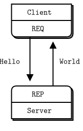
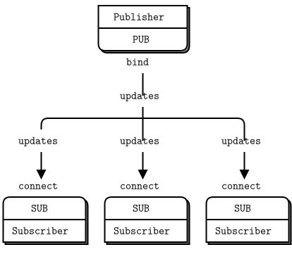
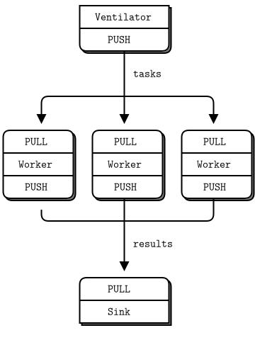
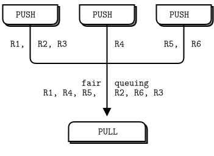
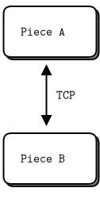
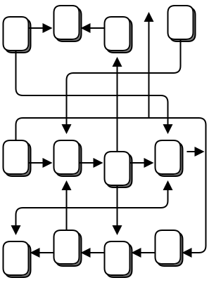

# 1장-기본 {-}

## 세상을 구원하라

ØMQ를 어떻게 설명할 것인가? 우리 중 일부는 ØMQ가 하는 놀라운 것들을 말하는 것으로 시작합니다.

* 스테로이드를 먹은 스켓입니다.
* 라우팅 기능이 있는 우편함과 같습니다.
* 빠릅니다.

어떤 사람들은 깨달음의 순간을 공유하려 합니다.

* 모든 것이 분명해졌을 때 번쩍-우르릉-쾅쾅 깨달음(zap-pow-kaboom satori) 패러다임 전환의 순간을 느낍니다.
* 사물은 단순해지고 복잡성이 사라집니다
* 마음을 열게 합니다.

어떤 사람들은 다른 것과 비교하여 ØMQ를 설명하려고 합니다.

* 더 작고 단순하지만 여전히 익숙해 보입니다

개인적으로 저는 왜 우리가 ØMQ를 만들었는지를 기억하고 싶으며, 독자 여러분은 우리가 처음 길을 접어든 근처에 머물고 있을지 모르기 때문입니다.

* 번쩍-우르릉-쾅쾅 깨달음(zap-pow-kaboom satori)에서 사토리는 불교의 용어로 해달의 경지인 깨달음 의미합니다. 일본에서 돈버는 것에도 출세에도 관심이 없는 젊은 세대를 "사토리 세대"라고 부릅니다.


프로그래밍은 예술로 치장된 과학이지만 우리 대부분은 소프트웨어의 물리학을 거의 이해하지 못하고 있으며 과학으로 가르치는 곳이 거의 없습니다. 소프트웨어의 물리학은 알고리즘이나, 자료 구조, 프로그래밍 언어나 추상화 등이 아닙니다. 이런 것들은 다만 우리가 그냥 만들어내고 사용하고 버리는 도구들일 뿐입니다. 소프트웨어의 진정한 물리학은 인간의 물리학입니다. 특히 복잡성 앞에서의 인간의 한계와 우리의 협력을 통하여 거대한 문제를 작은 조각들로 쪼개서 해결하려고 하는 욕구가 있습니다.
이것이 프로그래밍 과학입니다 : 사람들이 쉽게 이해하고 사용할 수 있는 구성요소들을 만들어냄으로써, 사람들이 그걸 이용하여 거대한 문제들을 해결하게 도와줍니다.

우리는 연결된 세상 속에 살고 있습니다. 그리고 현대의 소프트웨어들은 이런 세상 속을 항해할 수 있습니다. 따라서 미래의 거대한 솔루션들을 위한 구성요소들은 반드시 서로 연결되어야 하며 대규모로 병렬적이어야 합니다. 더 이상 프로그램이 그냥 “강력하고 침묵” 하기만 하면 되던 그런 시대는 지났습니다. 코드는 이젠 코드와 대화해야 합니다. 코드는 수다스러워야 하고 사교적이어야 하며 연결되어야 합니다. 코드는 반드시 인간의 두뇌처럼 작동해야 하고, 수조 개의 뉴런들이 서로에게 메시지를 던지듯이, 중앙 통제가 없는 대규모 병렬 네트워크로 단일 장애점 없어야 합니다. 그러면서도 극도로 어려운 문제들을 해결할 수 있어야 합니다. 그리고 코드의 미래가 인간의 두뇌처럼 보인다는 것은 우연이 아닙니다. 왜냐면 결국 네트워크도 단말에서 인간의 두뇌에 연결되며, 그 어떤 네트워크의 진화의 종착점도 인간의 두뇌이기 때문입니다.

당신이 스레드, 통신규약 또는 네트워크와 관련된 일을 하였다면 당신은 이것이 얼마나 불가능에 가까운 일인가를 알 것입니다. 이건 꿈과 같습니다. 실제 상황에서 몇 개의 프로그램들을 몇 개의 소켓을 통해 연결하는 것조차도 어렵고 불쾌합니다. 수조 원? 그 비용은 상상도 할 수 없을 정도입니다. 컴퓨터들을 연결시키는 것은 매우 어렵기 때문에 이를 수행하는 소프트웨어와 서비스들은 수십억 달러짜리의 사업입니다.

그래서 결국 우리는 이러한 세상에서 살게 되었습니다: 인터넷 보급과 속도는 상당히 발전되었는데, 그것을 제대로 활용하는 능력은 몇 년이나 뒤쳐져 있습니다. 우리는 1980년대에 한차례 소프트웨어 위기를 겼었으며, 프레드 브룩스와 같은 수준급 소프트웨어 엔지니어들은 “소프트웨어 업계에서 생산성, 신뢰성, 단순성 이 세 가지 척도 중에 어느 한 방면에서도 진보를 이루는 것에는 [「은총알이 존재하지 않는다」](http://en.wikipedia.org/wiki/No_Silver_Bullet)” 고 주장하였습니다.

브룩스가 놓쳤던 것은 자유롭게 사용 가능한 오픈 소스 소프트웨어들이었으며, 서로 효율적으로 지식을 공유함으로 위기를 해결할 수 있었습니다. 
하지만 오늘날 우리는 또 다른 소프트웨어 위기에 직면하고 있지만 이번에는 이걸 얘기하는 사람은 거의 없습니다. 위기는 가장 크고 가장 부유한 기업들만이 “연결된 응용프로그램들을” 만들 수 있다는 점입니다. 물론 요즘에는 클라우드가 있지만 클라우드는 사적 소유이며 우리의 데이터와 우리의 지식은 개인 컴퓨터에서 점점 사라지고, 우리가 접근할 수 없고 우리가 그걸 상대로 경쟁조차 펼칠 수 없는 클라우드로 흘러 들어가고 있습니다. 우리의 소셜 네트워크를 누가 가지고 있을까요? 이것은 PC에서 대형 컴퓨터로 전환되는 혁명이 역으로 수행되고 있습니다.

우리는 이런 정치철학을 「[문명과 제국, 디지털 혁명](http://cultureandempire.com/)」에서 다루고 있습니다 여기서 말하고자 하는 건, 인터넷이 대규모 연결된 프로그램에 잠재력을 제공하고 있음에도 불구하고, 현실은 이것을 충분히 이용할 수 있는 사람들은 극히 드물다는 점입니다. 그러므로 거대하고 흥미로운 문제들(건강, 의료, 교육, 경제, 물류 등의 분야들)을 해결되지 못하고 있으며 원인은 우리가 코드을 효과적으로 연결 못하고 개개인이 함께 협력하여 이러한 문제를 해결할 방법이 없었기 때문입니다.

연결된 코드의 도전 문제를 해결하기 위한 많은 시도들도 있었습니다. 예를 들어 수천 개의 「국제 인터넷 표준화 기구(Internet Engineering Task Force, IETF)」 규격들, 그것들은 각각 퍼즐의 일부만을 해결합니다. 응용프로그램 개발자에게 있어서 HTTP는 간단하고 효과 좋은 해결책이었지만 HTTP는 개발자들에게 거대한 서버와 작고, 어리석은 클라이언트로 구성된 아키텍처를 권고하면서 문제를 더 악화시키게 되었습니다.

그래서 결과적으로 오늘날에도 사람들은 여전히 UDP, TCP, 사적 소유의 통신규약, HTTP와 웹소켓 등을 그대로 사용하고 있습니다. 여전히 고통스럽고 굼뜨고 확장이 어려우며 대체적으로 중앙화 되어 있습니다. 분산된 P2P 아키텍처도 존재하긴 하지만, 대부분 노는 일에만 기여하지 생산적인 데는 도움이 되지 않으며 스카이프나 비트토렌트로 데이터를 주고받는 사람은 많지 않습니다.

이 모든 현실은 다시 우리를 최초의 프로그래밍 과학에 대한 문제로 되돌려 보냅니다. 세상을 구원하기 위해 우리는 두 가지 일을 해야 합니다.

* 첫째, 일반적인 문제인 “어디서나, 코드와 코드 간에 연결시키기”
* 둘째, 모든 대책을 최대한 간단한 구성요소로 만들어 사람들이 쉽게 이해하고 사용하게 하기

말도 안 되게 간단하게 들립니다. 그리고 정말로 그럴지도 모릅니다. 하지만 이것이 바로 이 책의 전부입니다.

## 전제 조건

ØMQ 4.3.2 버전을 사용하고 원도우 및 리눅스와 유사한 운영체제를 사용한다고 가정합니다. 이 책의 기본 예제는 C++ 언어로 구성되어 있어 C++ 코드를 읽을 수 있어야 합니다. PUSH와 SUBSCRIBE와 같은 상수를 사용할 때 실제 프로그래밍 언어에서는 ZMQ_PUSH, ZMQ_SUBSCRIBE가 호출된다고 생각할 수 있습니다.

## java 바인딩(jeroMQ) 및 예제 받기

java 바인딩(jeroMQ)과 예제들은 「[깃허브 공개 저장소](https://github.com/zeromq/jeromq)」에 있으며, `git clone`명령으로 받을 수 있으며 동기화 이후 예제 폴더에서 java 개발 언어로 작성된 예제들을 확인 가능합니다.

~~~ {.bash}
git clone https://github.com/zeromq/jeromq.git
~~~

## 물으면 얻을 것이다.

Hello World 예제로 시작하며, 클라이언트와 서버 프로그램을 만들도록 하겠습니다.
클라이언트에서 서버로 "Hello"을 보내면 서버에서 "World"를 클라이언트에게 응답합니다. 예제에서 ØMQ 소켓을 5555 포트로 오픈하여 요청에 대응합니다.

hwserver.java: Hello World 서버

```java
package guide;

//
//  Hello World server in Java
//  Binds REP socket to tcp://*:5555
//  Expects "Hello" from client, replies with "World"
//

import org.zeromq.SocketType;
import org.zeromq.ZMQ;
import org.zeromq.ZContext;

public class hwserver
{
    public static void main(String[] args) throws Exception
    {
        try (ZContext context = new ZContext()) {
            // Socket to talk to clients
            ZMQ.Socket socket = context.createSocket(SocketType.REP);
            socket.bind("tcp://*:5555");

            while (!Thread.currentThread().isInterrupted()) {
                byte[] reply = socket.recv(0);
                System.out.println(
                    "Received " + ": [" + new String(reply, ZMQ.CHARSET) + "]"
                );

                String response = "world";
                socket.send(response.getBytes(ZMQ.CHARSET), 0);

                Thread.sleep(1000); //  Do some 'work'
            }
        }
    }
}

```

그림 2 - 요청-응답



REQ-REP 소켓 쌍은 진행 순서가 고정되어 REQ 클라이언트는 루프상에서 `send()`를 호출하고 나서 `recv()`를 호출할 수 있으며, `send()`를 두 번 호출(예 : 두 개의 메시지를 연속으로 전송) 할 경우에는 오류 코드로 -1이 반환됩니다.
마찬가지로 REP 서버 측은 `recv()`를 호출하고 나서 `send()`를 호출해야 합니다.

java 바인딩(jeroMQ)을 통하여 java 언어를 사용하고 있기 때문에 샘플 코드에서 java언어를 사용합니다.

다음은 클라이언트 코드입니다.

hwclient.java: Hello World 클라이언트

```java
package guide;

//
//  Hello World client in Java
//  Connects REQ socket to tcp://localhost:5555
//  Sends "Hello" to server, expects "World" back
//

import org.zeromq.SocketType;
import org.zeromq.ZMQ;
import org.zeromq.ZContext;

public class hwclient
{
    public static void main(String[] args)
    {
        try (ZContext context = new ZContext()) {
            //  Socket to talk to server
            System.out.println("Connecting to hello world server");

            ZMQ.Socket socket = context.createSocket(SocketType.REQ);
            socket.connect("tcp://localhost:5555");

            for (int requestNbr = 0; requestNbr != 10; requestNbr++) {
                String request = "Hello";
                System.out.println("Sending Hello " + requestNbr);
                socket.send(request.getBytes(ZMQ.CHARSET), 0);

                byte[] reply = socket.recv(0);
                System.out.println(
                    "Received " + new String(reply, ZMQ.CHARSET) + " " +
                    requestNbr
                );
            }
        }
    }
}

```

ØMQ 소켓을 가졌지만 실제 구현이 단순하며, 이전에 보았듯이 초능력을 가지고 있습니다.
서버는 동시에 수천 개의 클라이언트들을 가질 수 있으며 작업을 쉽고 빠르게 할 수 있게 되었습니다. 재미를 위해 클라이언트를 시작한 다음 서버를 시작하시기 바랍니다. 모든 것이 여전히 작동하는지 확인한 다음 이것이 의미하는 바를 잠시 생각해보십시오.

* 서버, 클라이언트 구동 순서에 관계없이 정상적으로 동작합니다.

이 두 프로그램이 실제로 무엇을 하고 있는지 간략하게 살펴보겠습니다.
이들은 우선 ØMQ 컨텍스트 ØMQ 소켓을 생성합니다.
서버는 REP 소켓을 포트 5555번으로 바인딩하여 매번 루프에서 요청을 기다리고 각 요청에 응답합니다.
클라이언트는 REQ 소켓을 포트 5555번에 연결하여 요청을 보내고 서버의 응답을 받습니다.

* 빌드 및 테스트

~~~ {.bash}
c:\artemisia\jeromq>javac guide/hwserver.java
c:\artemisia\jeromq>javac guide/hwclient.java

c:\artemisia\jeromq>java guide.hwserver
Received : [Hello]
Received : [Hello]
Received : [Hello]
Received : [Hello]
Received : [Hello]
Received : [Hello]
Received : [Hello]
Received : [Hello]
Received : [Hello]
Received : [Hello]

c:\artemisia\jeromq>java guide.hwclient
Connecting to hello world server
Sending Hello 0
Received world
Sending Hello 1
Received world
Sending Hello 2
Received world
Sending Hello 3
Received world
Sending Hello 4
Received world
Sending Hello 5
Received world
Sending Hello 6
Received world
Sending Hello 7
Received world
Sending Hello 8
Received world
Sending Hello 9
Received world
~~~

서버를 죽이고(CTRL-C) 재시작하면 클라이언트는 정상적으로 동작하지 않을 것이다. 프로세스가 죽을 경우 복구는 쉽지 않은 문제입니다.. 신뢰성 있는 요청-응답은 복잡하지만 "4장-신뢰할 수 있는 요청-응답 패턴"에서 다루도록 하겠습니다.

프로그래밍된 뒤편에서는 많은 일이 일어나고 있지만 프로그래머들에게 중요한 것은 작성된 코드가 얼마나 짧고 멋있는지, 얼마나 자주 그것이 무거운 부하를 받더라도 충돌하지 않는지입니다.
이것이 ØMQ의 가장 간단한 사용 방법이며 RPC(remote procedure call)과 고전적인 클라이언트/서버 모델에 해당합니다.

## 문자열에 대한 간단한 주의 사항

ØMQ는 데이터의 바이트 크기 외에는 아무것도 모르기 때문에 개발자가 문자열을 안전하게 처리할 책임이 있습니다. 복잡한 데이터 타입이나 객체에 대하여 작업하기 위해 특화된 "통신규약 버퍼(Protocol Buffer)"라는 라이브러리가 있지만 문자열에 대하여서는 주의해야 합니다.

C 언어와 일부 다른 언어들에서 문자열은 한 개의 널(NULL(0)) 바이트로 끝이 나며 "Hello"와 같은 경우 추가 널(NULL(0)) 바이트를 추가합니다.

```java
zmq_send (requester, "Hello", 6, 0);
```

다른 언어에서 문자열을 보내면 해당 널(NULL(0)) 바이트를 포함하지 않을 것입니다. Python 언어에서는 널(NULL(0)) 바이트를 포함하지 않고 아래와 같이 보낼 수 있습니다.

```python
socket.send ("Hello")
```

이때 네트워크상에서 문자열의 길이와 개별 문자를 가진 문자열의 내용이 전송됩니다.

그림 3 - ØMQ 문자열(길이 + 개별문자)


C 언어를 통해 코드를 본다면 문자열과 비슷한 것을 확인할 수 있으며 우연히 문자열처럼 동작할 수 있지만(운이 좋아 5 바이트(Hello)에 널(NULL(0)) 뒤따르는 경우) 적절한 문자열이 아닙니다. 클라이언트와 서버가 문자열 형식에 동의하지 않는다면 이상한 결과를 가져오게 됩니다.

ØMQ에서 C 언어로 문자열 데이터를 받는다면 안전하게 끝났는지(널(NULL(0)) 문자 포함) 보장할 수 없기 때문에 매번 여분의 공간을 가지고 공백으로 채워진 새로운 버퍼에 할당하여 문자열을 복사한 다음 널(NULL(0))로 올바르게 종료해야 합니다.

따라서 ØMQ 문자열은 길이가 지정되고 후행 널(NULL(0)) 없이 네트워크로 전송된다는 규칙을 설정하였습니다. 가장 간단한 경우(예제에서 작업 수행), ØMQ 문자열은 위의 그림과 같은 ØMQ 메시지 프레임에 매핑됩니다(길이와 일부 바이트들).

## ØMQ 버전 확인하기

ØMQ는 자주 버전이 변경되며 만약 문제가 있다면 다음 버전에서 해결될 수도 있습니다.
ØMQ 버전 확인하는 방법은 다음과 같습니다.

version.java : ØMQ 버전 확인하기

```java
package guide;

import org.zeromq.ZMQ;

//  Report 0MQ version
public class version
{
    public static void main(String[] args)
    {
        String version = ZMQ.getVersionString();
        int fullVersion = ZMQ.getFullVersion();

        System.out.println(
            String.format(
                "Version string: %s, Version int: %d", version, fullVersion
            )
        );
    }
}
```

* 빌드 및 테스트

~~~ {.bash}
c:\artemisia\jeromq>javac guide/version.java
c:\artemisia\jeromq>java guide.version
Version string: 4.1.7, Version int: 40107
~~~

## 메시지 송신하기

두 번째 고전적인 패턴으로 서버의 단방향 데이터 전송으로, 서버가 일련의 클라이언트들에게 변경정보들을 배포합니다.
예를 들면 우편번호, 온도, 상대습도 등으로 구성된 기상 변경정보들이 배포하여 실제 기상관측소처럼 임의의 값을 생성하도록 하였습니다.

아래의 서버 예제에서는 PUB 소켓을 생성하여 5556 포트를 사용하였습니다.

wuserver.java: 기상 정보 변경 서버

```java
package guide;
import java.util.Random;
import org.zeromq.SocketType;
import org.zeromq.ZMQ;
import org.zeromq.ZContext;

//
//  Weather update server in Java
//  Binds PUB socket to tcp://*:5556
//  Publishes random weather updates
//
public class wuserver
{
    public static void main(String[] args) throws Exception
    {
        //  Prepare our context and publisher
        try (ZContext context = new ZContext()) {
            ZMQ.Socket publisher = context.createSocket(SocketType.PUB);
            publisher.bind("tcp://*:5556");
            publisher.bind("ipc://weather");

            //  Initialize random number generator
            Random srandom = new Random(System.currentTimeMillis());
            while (!Thread.currentThread().isInterrupted()) {
                //  Get values that will fool the boss
                int zipcode, temperature, relhumidity;
                zipcode = 10000 + srandom.nextInt(10000);
                temperature = srandom.nextInt(215) - 80 + 1;
                relhumidity = srandom.nextInt(50) + 10 + 1;

                //  Send message to all subscribers
                String update = String.format(
                    "%05d %d %d", zipcode, temperature, relhumidity
                );
                publisher.send(update, 0);
            }
        }
    }
}
```

변경정보의 전송은 시작도 끝이 없이 반복되며, 마치 끝도 없는 방송(Broadcast) 같습니다.
클라이언트 응용프로그램은 서버에서 발행되는 데이터를 들으며 특정 우편번호에 대한 것만 수신합니다. 기본적으로 뉴욕시의 우편번호(10001)가 설정되었지만 매개변수로 변경이 가능합니다.

wuclient.java: 기상 변경 클라이언트

```java
package guide;

import java.util.StringTokenizer;

import org.zeromq.SocketType;
import org.zeromq.ZMQ;
import org.zeromq.ZContext;

//
//  Weather update client in Java
//  Connects SUB socket to tcp://localhost:5556
//  Collects weather updates and finds avg temp in zipcode
//
public class wuclient
{
    public static void main(String[] args)
    {
        try (ZContext context = new ZContext()) {
            //  Socket to talk to server
            System.out.println("Collecting updates from weather server");
            ZMQ.Socket subscriber = context.createSocket(SocketType.SUB);
            subscriber.connect("tcp://localhost:5556");

            //  Subscribe to zipcode, default is NYC, 10001
            String filter = (args.length > 0) ? args[0] : "10001 ";
            subscriber.subscribe(filter.getBytes(ZMQ.CHARSET));

            //  Process 100 updates
            int update_nbr;
            long total_temp = 0;
            for (update_nbr = 0; update_nbr < 100; update_nbr++) {
                //  Use trim to remove the tailing '0' character
                String string = subscriber.recvStr(0).trim();

                StringTokenizer sscanf = new StringTokenizer(string, " ");
                int zipcode = Integer.valueOf(sscanf.nextToken());
                int temperature = Integer.valueOf(sscanf.nextToken());
                int relhumidity = Integer.valueOf(sscanf.nextToken());

                total_temp += temperature;
            }

            System.out.println(
                String.format(
                    "Average temperature for zipcode '%s' was %d.",
                    filter,
                    (int)(total_temp / update_nbr)
                )
            );
        }
    }
}

```

* 빌드 및 테스트

~~~ {.bash}
PS C:\artemisia\jeromq> javac guide/wuserver.java
PS C:\artemisia\jeromq> javac guide/wuclient.java
C:\artemisia\jeromq>java guide.wuserver
C:\artemisia\jeromq>java guide.wuclient
Collecting updates from weather server
Average temperature for zipcode '10001 ' was 32.
~~~

* 클라이언트에서 tcp("subscriber.connect("tcp://localhost:5556"))에서 ipc(subscriber.connect("ipc://weather")) 변경해도 정상적으로 동작합니다.


그림 4 - 발행-구독



클라이언트는 SUB 소켓을 사용할 때 반드시 `context.createSocket()`와 `SocketType.SUB` 을 사용하여 구독을 설정해야 하며 미수행시 어떤 메시지도 받을 수 없습니다.
구독자는 다수의 구독을 설정할 수 있으며 특정 구독은 취소할 수 있습니다. 즉, 구독자에 설정된 구독과 일치하면 변경정보를 받습니다. 구독은 반드시 출력 가능한 문자열일 필요는 없습니다.

PUB-SUB 소켓을 쌍으로 비동기로 작동하며 일반적으로 클라이언트 루프상에서 `recvStr()` 를 호출합니다.
* setReceiveTimeOut(int)을 통하여 timoeout을 설정 가능합니다.
* recvStr()의 경우 ZMQ.DONTWAIT(기다리지 않음), 0(기다림) 옵션 설정 가능합니다.

SUB 소켓에서 메시지를 보내려고(`send()`) 하면 오류가 발생합니다. 마찬가지로 PUB 소켓으로 `recvStr()`를 호출해서는 안됩니다.

이론적으로는 클라이언트, 서버에서 누가 `bind()`를 하던 `connect()`를 하는지는 문제가 되지 않지만 실제로는 PUB 소켓일 경우 `bind()`, SUB 소켓일 경우 `connect()`를 수행합니다.

* 일반적으로 1:N 통신을 경우 1에 해당하는 단말은 `bind()`, N에 해당하는 단말은 `connect()`을 수행합니다.

PUB-SUB 소켓에 대한 한 가지 중요한 사항으로 구독자가 메시지를 받기 시작하는 시기를 정확히 알 수 없습니다. 구독자를 기동하고 기다리는 동안 발행자를 기동 하면, 구독자는 항상 발행자가 보내는 첫 번째 메시지를 유실힙니다. 사유는 구독자가 발행자에게 연결할 때(작지면 0이 아닌 시간 소요) 발행자가 이미 메시지를 전송했기 때문입니다.

이 "더딘 결합(slow joiner)" 현상은 사람들을 놀라게 하며 나중에 자세히 설명하겠습니다. ØMQ는 백그라운드에서 비동기 I/O를 수행합니다.
백그라운드에서 두 개의 노드에서 아래의 순서로 통신을 수행합니다.

* 구독자는 단말에 연결(connect)하여 메시지를 수신하고 카운트합니다.
* 발행자는 단말에 바인딩(bind)하고 즉시 1,000개의 메시지들을 전송합니다.

그러면 구독자는 아마 아무것도 받지 못할 것입니다. 눈을 번쩍 뜨고 구독 필터를 올바르게 설정한 후 다시 시도하여도 구독자는 여전히 아무것도 받지 못합니다.

TCP 연결 생성은 네트워크와 연결 대상들 간의 경유 단계(hops)에 따라 몇 밀리초(milliseconds) 지연을 발생시키며, 그 시간 동안 ØMQ는 많은 메시지를 보낼 수 있습니다.
편의상 연결 설정에 5밀리초가 소요되고, 발행자가 초당 100만 메시지를 송신할 수 있다면 발행자와 연결에 필요한 5밀리초 사이에 5000개 메시지를 전송할 수 있습니다.

* 홉(hops)은 컴퓨터 네트워크에서 출발지와 목적지 사이에 위치한 경로의 한 부분이다. 데이터 패킷은 브리지, 라우터, 게이트웨이를 거치면서 출발지에서 목적지로 경유한다. 패킷이 다음 네트워크 장비로 이동할 때마다 홉이 하나 발생한다. 홉 카운트는 데이터가 출발지와 목적지 사이에서 통과해야 하는 중간 장치들의 개수를 가리킨다.

"2장-소켓 및 패턴"에서 발행자와 구독자 간에 동기화하여 데이터 유실하지 않는 방법을 설명하겠습니다. 단순하고 무식하지만 발행자가 `sleep()`을 호출하여 지연시키는 방법도 있지만 사용할 경우 응용프로그램 지연이 발생할 수 있습니다.

동기화의 대안은 단순히 발행된 데이터 스트림이 무한하고 시작과 끝이 없다고 가정하여, 구독자가 시작되기 전에 무슨 일이 일어났는지 신경 쓰지 않는다고 가정합니다. 
이것이 우리가 날씨 클라이언트 예제를 구축한 방법입니다.

정리하면, 클라이언트는 선택한 우편번호를 구독하고 해당 우편번호에 대한 100개 변경정보들을 수집합니다. 우편번호가 무작위로 분포하는 경우에는 약 1천만 변경정보가 발생합니다.
클라이언트를 시작한 후 서버를 시작하면 클라이언트는 문제없이 작동합니다.
서버를 중지하고 재시작해도 클라이언트는 계속 작동합니다.
클라이언트가 100의 변경정보들을 수집하면 평균을 계산하여 화면에 출력하고 종료합니다.


몇 가지 발행-구독(pub-sub) 패턴의 주요 사항들은 다음과 같습니다.

* 구독자는 한 개 이상의 발행자와 연결할 수 있습니다. 매번 하나의 연결을 사용하며 데이터가 도착하면 개별 대기열(`fair-queued`)에 쌓이며 개별 발행자로부터 수신된 데이터의 대기열은 다른 것에 영향을 주지 않습니다.
* 발행자에 어떤 구독자들도 연결하지 않았다면, 모든 메시지들은 버려집니다.
* TCP를 사용하고 구독자의 처리가 지연된다면 메시지는 발행자의 대기열에 추가됩니다. 이후 발행자를 최고수위 표시(HWM(high-water mark))를 사용하여 보호하는 방법을 알아보겠습니다.
* ØMQ v3.x부터, 발행자에서도 필터 기능이 추가되었습니다(tcp:// 혹은 ipc://). epgm:// 통신규약을 사용하여 구독자에서도 필터를 사용할 수 있습니다. ØMQ v2.x에서는 필터 기능은 구독자에서만 사용 가능했습니다.

아래는 2012 년에 구입한 인텔 i7 노트북(hp 8760w)에서 1천만 메시지를 수신하고 필터링하는 데 걸린 시간입니다.

~~~
[zedo@jeroMQ examples]$ time ./wuclient
Collecting updates from weather server...
Average temperature for zipcode 10001  was 26F

real	0m4.524s
user	0m0.005s
sys	0m0.004s
~~~

## 나누어서 정복하라

그림 5 - 병렬 파이프라인(parallel pipeline)



마지막 예는 작은 슈퍼 컴퓨터를 만들어 보겠으며, 슈퍼 컴퓨팅 응용프로그램은 전형적인 병렬 처리 모델입니다.

* 호흡기(ventilator)는 병렬 처리 가능한 작업들을 생성합니다.
* 일련의 작업자(Worker)들이 작업들을 처리합니다.
* 수집기(Sink)는 작업자 프로세스들로부터 작업 결과를 수집합니다.

실제로 작업자는 초고속 컴퓨터들에서 병렬 처리로 실행되며 GPU(그래픽 처리 장치)를 사용하여 어려운 연산을 수행합니다.
호흡기 소스는 100개의 작업할 메시지들을 만들며 각 메시지에는 작업자의 부하를 시간으로 전달(<=100 msec)하여 해당 시간 동안 대기하게 합니다.

* taskvent.java: 호흡기

```java
package guide;

import java.util.Random;

import org.zeromq.SocketType;
import org.zeromq.ZMQ;
import org.zeromq.ZContext;

//
//  Task ventilator in Java
//  Binds PUSH socket to tcp://localhost:5557
//  Sends batch of tasks to workers via that socket
//
public class taskvent
{
    public static void main(String[] args) throws Exception
    {
        try (ZContext context = new ZContext()) {
            //  Socket to send messages on
            ZMQ.Socket sender = context.createSocket(SocketType.PUSH);
            sender.bind("tcp://*:5557");

            //  Socket to send messages on
            ZMQ.Socket sink = context.createSocket(SocketType.PUSH);
            sink.connect("tcp://localhost:5558");

            System.out.println("Press Enter when the workers are ready: ");
            System.in.read();
            System.out.println("Sending tasks to workers\n");

            //  The first message is "0" and signals start of batch
            sink.send("0", 0);

            //  Initialize random number generator
            Random srandom = new Random(System.currentTimeMillis());

            //  Send 100 tasks
            int task_nbr;
            int total_msec = 0; //  Total expected cost in msecs
            for (task_nbr = 0; task_nbr < 100; task_nbr++) {
                int workload;
                //  Random workload from 1 to 100msecs
                workload = srandom.nextInt(100) + 1;
                total_msec += workload;
                System.out.print(workload + ".");
                String string = String.format("%d", workload);
                sender.send(string, 0);
            }
            System.out.println("Total expected cost: " + total_msec + " msec");
            Thread.sleep(1000); //  Give 0MQ time to deliver
        }
    }
}
```

작업자는 호흡기로부터 받은 메시지에 지정된 시간(밀리초)을 받아 시간만큼 대기하고 수집기에 메시지를 전달합니다.

* taskwork.java 작업자

```java
package guide;

import org.zeromq.SocketType;
import org.zeromq.ZMQ;
import org.zeromq.ZContext;

//
//  Task worker in Java
//  Connects PULL socket to tcp://localhost:5557
//  Collects workloads from ventilator via that socket
//  Connects PUSH socket to tcp://localhost:5558
//  Sends results to sink via that socket
//
public class taskwork
{
    public static void main(String[] args) throws Exception
    {
        try (ZContext context = new ZContext()) {
            //  Socket to receive messages on
            ZMQ.Socket receiver = context.createSocket(SocketType.PULL);
            receiver.connect("tcp://localhost:5557");

            //  Socket to send messages to
            ZMQ.Socket sender = context.createSocket(SocketType.PUSH);
            sender.connect("tcp://localhost:5558");

            //  Process tasks forever
            while (!Thread.currentThread().isInterrupted()) {
                String string = new String(receiver.recv(0), ZMQ.CHARSET).trim();
                long msec = Long.parseLong(string);
                //  Simple progress indicator for the viewer
                System.out.flush();
                System.out.print(string + '.');

                //  Do the work
                Thread.sleep(msec);

                //  Send results to sink
                sender.send(ZMQ.MESSAGE_SEPARATOR, 0);
            }
        }
    }
}
```

수집기는 100개의 작업들의 결과를 수집하고 전체 경과 시간을 계산하여 작업자들의 개수에 따른 병렬 처리로 작업 시간 개선을 확인합니다(예 : 작업자가 1개일 때 3초이면, 작업자가 3개이면 1초).

* tasksink.java: sinker

```java
package guide;

import org.zeromq.SocketType;
import org.zeromq.ZMQ;
import org.zeromq.ZContext;

//
//  Task sink in Java
//  Binds PULL socket to tcp://localhost:5558
//  Collects results from workers via that socket
//
public class tasksink
{
    public static void main(String[] args) throws Exception
    {
        //  Prepare our context and socket
        try (ZContext context = new ZContext()) {
            ZMQ.Socket receiver = context.createSocket(SocketType.PULL);
            receiver.bind("tcp://*:5558");

            //  Wait for start of batch
            String string = new String(receiver.recv(0), ZMQ.CHARSET);

            //  Start our clock now
            long tstart = System.currentTimeMillis();

            //  Process 100 confirmations
            int task_nbr;
            int total_msec = 0; //  Total calculated cost in msecs
            for (task_nbr = 0; task_nbr < 100; task_nbr++) {
                string = new String(receiver.recv(0), ZMQ.CHARSET).trim();
                if ((task_nbr / 10) * 10 == task_nbr) {
                    System.out.print(":");
                }
                else {
                    System.out.print(".");
                }
            }

            //  Calculate and report duration of batch
            long tend = System.currentTimeMillis();

            System.out.println(
                "\nTotal elapsed time: " + (tend - tstart) + " msec"
            );
        }
    }
}
```

평균 실행 시간은 대략 5초 정도입니다.
작업자의 개수를 1, 2, 4개로 했을 때의 결과는 다음과 같습니다.

 * 1 worker: total elapsed time: 5034 msecs.
 * 2 worker: total elapsed time: 2421 msecs.
 * 4 worker: total elapsed time: 1018 msecs.

* 빌드 및 테스트

~~~ {.bash}
PS C:\artemisia\jeromq> javac guide/wuclient.java
PS C:\artemisia\jeromq> javac guide/wuclient.java
PS C:\artemisia\jeromq> javac guide/taskvent.java

// 1개의 worker로 작업할 경우
PS C:\artemisia\jeromq> java guide.taskvent
Press Enter when the workers are ready: 
Sending tasks to workers
5074 msec
C:\artemisia\jeromq>java guide.taskwork
23.76.83.20.24.79.15.70.13.44.2.94.33.78.10.22.48.5.44.91.63.55.34.75.49.79.82.98.97.47.47.8.71.66.66.62.45.28.100.66.46.66.20.69.14.79.84.11.9.42.44.78.30.53.49.37.76.14.85.52.4.60.80.86.6.18.21.82.98.60.27.23.52.59.66.39.36.28.66.43.87.49.41.54.7.37.46.43.38.1.94.68.42.99.56.61.69.70.58.30.
C:\artemisia\jeromq>java guide.tasksink
:.........:.........:.........:.........:.........:.........:.........:.........:.........:.........
Total elapsed time: 5202 msec

// 2개의 worker로 작업할 경우
PS C:\artemisia\jeromq> java guide.taskvent
Press Enter when the workers are ready: 
Sending tasks to workers
5017 msec
C:\artemisia\jeromq>java guide.taskwork
78.55.74.3.38.66.8.88.10.44.100.48.24.74.18.66.67.59.76.5.4.65.100.33.71.26.77.78.41.76.66.20.100.57.4.81.58.47.20.96.16.72.83.45.56.99.23.35.35.81.
C:\artemisia\jeromq>java guide.taskwork
20.86.58.48.21.72.23.35.88.16.84.100.12.15.57.71.15.54.10.16.32.19.35.94.8.16.89.34.71.53.41.3.42.52.65.64.20.4.26.95.87.20.94.98.5.31.97.18.37.100.
C:\artemisia\jeromq>java guide.tasksink
:.........:.........:.........:.........:.........:.........:.........:.........:.........:.........
Total elapsed time: 2779 msec
~~~

코드상에서 특정 부분에 대하여 상세히 다루어 보겠습니다.

* 작업자는 상류의 호흡기와 하류의 수집기를 연결(connect)하며 자유롭게 작업자를 추가할 수 있습니다. 만약 작업자가 호흡기와 수집기에 바인딩(bind)를 수행할 경우 호흡기와 싱크 변경(및 추가) 시마다 작업자를 추가해야 합니다. 작업자에서 동적 요소로 연결(connect)을 수행하고 호흡기와 싱크는 정적 요소로 바인딩(bind)를 수행합니다.
 * 모든 작업자가 시작할 때까지 호흡기의 작업 시작과 동기화해야 합니다. 이것은 ØMQ의 일반적인 원칙이며 간단한 해결 방법은 없습니다. `connect()`함수 수행 시 일정 정도의 시간이 소요되며, 여러 작업자가 호흡기에 연결할 때 첫 번째 작업자가 성공적으로 연결하여 메시지를 수신하는 동안 다른 작업자는 연결을 수행합니다. 동기화되어야만 시스템은 병렬로 동작합니다. 호흡기에서 작업자들이 동기화를 위하여 사용한 `System.in.read()`를 제거할 경우 어떤 일이 발생하는지 확인해 보시기 바랍니다.
* 호흡기의 PUSH 소켓은 작업자들에게 작업들을 분배하고 이것을 "부하 분산"이라고 부릅니다(호흡기에 작업자들을 연결하여 동기화되었다는 가정).
* 수집기의 PULL 소켓은 작업자들의 결과를 균등하게 수집하여 이를 "공정-대기열(fair-queuing)"이라고 합니다.

그림 6 - 공정 대기열



파이프라인 패턴도 "더딘 결합(slow joiner)" 현상을 나타내며 PUSH 소켓이 올바르게 "부하 분산"을 수행하지 못하는 경우도 있습니다. PUSH-PULL을 사용하는 경우의 특정 작업자가 다른 작업자보다 많은 메시지를 처리하는 경우가 있습니다. 이는 특정 작업자의 PULL 소켓이 이미 호흡기에 연결되어 있어, 다른 작업자의 PULL 소켓에 연결하려는 동안 메시지를 처리하기 때문입니다. 올바른 "부하 분산"을 수행하기 위해서는 "3장-고급 요청-응답 패턴"을 참조하시기 바랍니다.

## ØMQ 프로그램하기

예제를 통하여 당신은 QMQ 라이브러리를 사용하여 특정 응용프로그램을 작성하고 싶겠지만, 시작하기 전에 기본적인 권고 사항을 통해 많은 스트레스와 혼란을 줄일 수가 있습니다.

* 단계별로 ØMQ 배우기 : 단지 하나의 단순한 API이지만, 세상의 가능성을 숨기고 있습니다. 천천히 가능성을 취하고 자신의 것으로 만드십시오.
* 멋진 코드 작성 : 추악한 코드는 오류를 숨기고 있으며 다른 사람의 도움을 받기 어렵습니다. 의미 있는 단어로 변수의 명을 사용하면 변수가 하고자 하는 바를 전달할 수 있습니다. 좋은 코드를 작성하면 당신의 세계가 좀 더 편안해질 것입니다.
* 당신이 만든 것을 테스트하십시오 : 당신의 프로그램이 작동하지 않을 때, 당신은 탓할 다섯 줄이 무엇인지 알아야 합니다. 이것은 ØMQ가 마술을 부릴 때이며, 처음에는 몇 번 시도해도 동작하지 않다가 점차 익숙해지면 잘할 수 있습니다.
* 무엇인가 바라는 대로 동작하지 않을 때, 코드를 작은 조작으로 쪼개어 각각에 대하여 테스트를 하면 동작하지 않는 부분을 찾을 수 있습니다. ØMQ는 기본적으로 모듈라 코드로 만들 수 있게 하며 이것을 이용하십시오.
* 필요하다면 추상화(클래스, 메서드 등 무엇이든지)하십시오. 만약 단순히 복사/붙여 넣기를 한다면 이것은 오류도 복사/붙여 넣기를 하는 것입니다.

### 컨텍스트 권한 얻기

ØMQ 응용프로그램은 컨텍스트를 생성하여 시작하고, 컨텍스트를 소켓을 생성하는데 사용합니다. jeroMQ의`new ZContext()` 선언을 통해 컨텍스트를 생성합니다. 프로세스에서 정확히 하나의 컨텍스트를 생성하고 사용해야 합니다. 기능적으로 컨텍스트는 단일 프로세스 내의 모든 소켓들에 대한 컨테이너이며, inproc 소켓을 통하여 프로세스 내의 스레드들 간에 빠른 연결을 하게 합니다. 

* 컨텍스트 및 소켓의 생성

C 언어의 경우

```cpp
  void *context = zmq_ctx_new ();
  void *responder = zmq_socket (context, ZMQ_REP);
  int rc = zmq_bind (responder, "tcp://*:5555");
```
C++ 언어의 경우(Artemisa)

```cpp
  szmq::Context context;
  szmq::Socket(ZMQ_REP, szmq::ZMQ_SERVER) socket(context);
  socket.bind (szmq::SocketUrl("tcp://*:5555"));
```
Java 언어의 경우(jeroMQ)

```java
  ZContext context = new ZContext()
  ZMQ.Socket socket = context.createSocket(SocketType.REP);
  socket.bind("tcp://*:5558");
```

실행 시 하나의 프로세스에서 2개의 컨텍스트를 가진다면 그들은 독자적인 ØMQ 인스턴스가 됩니다. 명시적으로 그런 상황이 필요하면 가능하지만 다음 사항을 기억하시기 바랍니다.
컨텍스트 생성하여 프로세스 시작한 경우, 종료 시 컨텍스트 객체가 자동으로 해제됩니다.

`fork()`시스템 호출을 사용하는 경우, 각 프로세스는 자신의 컨텍스트를 필요로 합니다.
메인 프로세스에서 `new ZContext()`를 선언한 후`fork()`하면 자식 프로세스는 자신의 컨텍스트를 얻습니다. 일반적으로 주요 처리는 자식 프로세스에서 수행하고 부모 프로세스는 자식 프로세스를 관리하도록 합니다.

### 깨끗하게 종료하기

세련된 프로그래머는 세련된 암살자와 같은 모토를 공유합니다. : 항상 일이 끝나면 깨끗하게 정리하기. 
ØMQ를 사용할 경우, Python과 같은 개발언어는 자동으로 메모리 해제를 수행하지만, C 언어의 경우 종료 시 각 객체들에 대한 메모리 해제를 수행하지 않을 경우 메모리 누수 현상이나 불안정된 상태를 가질 수 있습니다.

메모리 누수도 그중 하나이며 ØMQ를 사용하는 응용프로그램을 종료 시에 주의해야 합니다. 
모든 소켓을 닫은 후에 객체의 해제(`szmq::~Context()`) LINGER를 0으로 설정하지 않는 한 보류 중인 연결 또는 전송이 있으면 기본적으로 영원히 기다립니다.

* 지연(LINGER)은 TCP 소켓의 단절 상태에 대응하기 위한 옵션으로 0일 경우 연결 상태를 종료하고 소켓 버퍼에 남아있는 데이터를 버리는 비정상 종료를 수행합니다.

ØMQ 객체들에서 주의해서 처리해야 하는 것은 메시지와 소켓, 컨텍스트 3가지입니다.
다행히도 단순한 프로그램에서 이들을 취급하는 것은 매우 간단합니다.

* 많은 소켓들을 열고(open)하고 닫고(close)할 경우 응용프로그램을 재설계가 필요합니다. 일부 경우에는 컨텍스트를 제거될 때까지 소켓 핸들이 유지될 수 있습니다.
* 프로그램을 종료할 때 소켓을 닫고 컨텍스트를 제거합니다.

멀티스레드를 사용하는 경우, 이러한 처리는 더욱 복잡해집니다.
멀티스레드에 관해서는 다음 장에서 다루지만 경고를 무시하고 시도하려는 사람도 있기 때문에, 아래에서 멀티스레드 ØMQ 응용프로그램을 제대로 종료하기 위한 임시 가이드를 제공합니다.

* 첫째, 멀티스레드에서 동일 소켓을 사용하지 마십시오. 재미있을 것같다고 생각조차 마십시요. 제발 하지 마십시오. 
* 둘째, 스레드들에 대한 지속되는 요청들에 대하여 개별적으로 소켓 종료해야 합니다. 적절한 방법으로(1초 정도) 지연(LINGER) 설정하여 소켓을 닫을 수 있습니다. 컨텍스트를 삭제할 때 언어 바인딩이 자동으로 작업을 수행하지 않으면, 언어 바인딩 개발자에게 수정 요청을 보내시기 바랍니다.

* 마지막으로 컨텍스트 제거하기입니다. 메인 스레드의 컨텍스트가 제거될 경우, 공유하는 다른 스레드의 소켓이 모두 닫혀질 때까지 차단되며 오류를 발생합니다. 이러한 오류가 발생할 경우 지연(LINGER) 설정하고 해당 스레드의 소켓을 닫은 후에 종료하시기 바랍니다. 동일한 컨텍스트를 두 번 제거하지 마십시오. 메인 스레드에서 알고 있는 모든 소켓이 안전하게 닫힐 때까지 기다리도록 합니다.

끝났습니다. 이것은 매우 복잡하고 고통을 수반하지만 개발 언어별 ØMQ 바인딩을 개발하는 사람이 피땀을 흘려 자동으로 소켓을 닫아 주는 경우도 있어 반드시 이렇게 할 필요는 없을 수도 있습니다.

## 왜 ØMQ가 필요한가

ØMQ 동작 방식을 보았으며, 다시 "왜(why)"로 돌아가 보겠습니다.

오늘날 많은 응용프로그램들이 일종의 네트워크상(랜 혹은 인터넷)에서 각종 구성 요소들로 확장되고 있으며 많은 개발자들이 TCP와 UDP 통신규약을 사용하고 있습니다. 이러한 통신규약을 사용하지 어렵지는 않지만 메시지를 전송(A->B)하는 것과 신뢰성 있게 메시지를 전송하는 것에는 큰 차이가 있습니다.

원시(RAW) TCP를 사용할 때 직면하는 전통적인 문제들을 보도록 하겠습니다. 재사용 가능한 메시징 계층을 구현하기 위해서는 아래의 문제들을 해결해야 합니다.

* I/O를 어떻게 처리합니까? 
 - 응용프로그램이 차단할까요, 아니면 백그라운드에서 I/O를 처리합니까? 이것은 주요 설계 결정입니다. I/O를 차단하면 제대로 확장하기 어려운 아키텍처가 되며 백그라운드 I/O는 제대로 다루기 어렵습니다.
* 일시적으로 사라지는 동적 컴포넌트를 어떻게 다루어야 할까요? 
 - 일반적으로 작업 수행 단위들을 클라이언트와 서버, 머신으로 나누면 서버들은 유지되며 서버 간의 연결이 필요할 경우라든지, 매번 다시 연결 해야 하는 경우가 생길 수 있습니다.
* 네트워크상에서 메시지를 어떻게 표현합니까?
 - 프레임 데이터를 쉽게 쓰고 읽게하며, 버퍼 오버플로우로부터 안전하고 작은 메시지에 대하여 효율적으로 처리 필요합니다.
* 즉시 전달할 수 없는 메시지를 어떻게 처리합니까?
 - 온라인이 될 때까지 기다려야 하는 상황에서 해당 메시지를 버리든지, 데이터베이스에 넣든지 혹은 메모리 대기열에 관리해야 합니다.
* 어디에 메시지 대기열을 보관하나요?
 - 대기열로부터 데이터 읽기가 지연되고 새로 대기열이 만들어져야 하면 어떤 전략으로 대응할 것인가.
* 메시지 유실에 어떻게 대응하나요?
 - 신규 데이터를 기다리거나 재전송을 요청하거나 메시지 유실을 방지하기 위한 신뢰성 있는 계층을 만들어야 할지. 만약 해당 계층이 깨진다면 어떻게 할 것인지
* 다른 네트워크 전송계층을 사용하는 경우에는 어떻게 하나요? 
 - 예를 들면 TCP 유니케스트 대신에 멀티캐스트, IPV6 등의 전송계층 간의 통신을 위하여 응용프로그램 재작성해야 할지 다른 계층으로 전송계층을 추상화할 것인지
* 메시지들을 어떻게 라우팅 할까요?
 - 동일한 메시지를 여러 개의 단말들에게 보낼 수 있는지, 원래 요청에 대하여 회신을 보낼 수 있는지
* 다른 개발 언어에서 어떻게 API를 작성할까요?
 - 다른 개발언어에서도 상호운영성 보장이 가능한지, 효율적이고 안정적인 수단을 제공할 수 있는지, 라이브러리 재작성해야 하는지
* 다른 아키텍처(예 운영체제) 간에 어떻게 동일한 데이터를 표현할까요?
 - 데이터 유형별 특정 엔코딩이 강제로 적용합니까? 이것이 상위 계층이 아닌 메시징 시스템의 역할은 얼마나 됩니까?
* 네트워크 장애를 어떻게 처리할지?
 - 기다렸다가 재시도하기, 무시하기, 종료합니까?

하둡 주키퍼(Hadoop Zookeeper)는 C API로 작성되어 있으며 클라이언트/서버 네트워크 통신규약을 사용하며 SELECT(일정 주기) 대산에 POLL(이벤트 방식)을 사용하는 효율성을 가졌으며 범용 메세징 계층과 명시적인 네트워크 수준 통신규약을 사용하고 있었습니다. 하지만 이미 만들어 놓은 대상을 재사용하지 않고 계속 만드는 것(build wheel over and over)은 지극히 낭비적이었습니다.

하지만 어떻게 재사용 가능한 메시징 계층을 만들까요?
많은 프로젝트에서 이 기술이 요구하였지만 사람들은 아직도 TCP 소켓을 사용하여 많은 문제 목록을 계속 반복해서 해결하고 있습니다.

하지만 재사용 가능한 메세징 시스템을 만드는 것은 정말 어려운 것으로 밝혀졌으며 일부 “[「FOSS 프로젝트」](https://en.wikipedia.org/wiki/Free_and_open-source_software)” 에서도 시도하였습니다.
그래서 상용 메세징 제품이 복잡하고 고비용이고 유연하지 못하고 예민한가에 대한 이유입니다.
2006년 "iMatix"는 AMQP를 설계하여 FOSS 개발자들에서 공유하였으며 아마도 메세징 시스템에 대한 첫 번째 재사용 방법을 제공하였습니다. AMQP는 다른 많은 설계들보다 잘 동작하지만 상대적으로 복잡하고 고비용이고 예민하여, 사용하기 위해서는 몇 주나 몇 달의 학습 기간이 필요합니다.

* AMQP(Advanced Message Queuing Protocol)는 메시지 지향 미들웨어를 위한 개방형 표준 응용 계층 통신규약이며 AMQP 기반 제품은 RabbitMQ, ActiveMQ, ØMQ가 있습니다.

그림 7 - 태초의 메세징(Messaging as it Starts)



대부분의 메세징 프로젝트와 같이 AMQP에서도 재사용에 대한 오랫동안 지속된 문제를 해결하려 했으며, 새로운 개념으로 "브로커(Broker)"를 발명하였으며, 브로커는 주소 지정, 라우팅, 대기열 관리를 수행하였습니다.
그 결과 클라이언트/서버 통신규약과 일련의 API들은 응용프로그램들이 브로커를 통하여 소통할 수 있게 되었습니다. 브로커는 거대한 네트워크상에서 복잡성을 제거하는 데는 뛰어났지만, 주키퍼처럼 브로커 기반 메세징은 상황을 개선하기는 보다 더 나쁘게 만들었습니다. 이것은 브로커라는 부가적인 거대한 요소를 추가함으로 새로운 단일 장애점(SPOF, Single Point Of Failure)이 되었습니다.
브로커는 빠르게 병목 지점이 되어감에 따라 새로운 위험을 관리해야 했습니다. 소프트웨어적으로 이러한 이슈(장애조치)를 해결하기 위하여 브로커를 2개, 3개, 4개 추기 해야 했습니다. 이것을 결국 더욱 많은 조각으로 나누어지며, 복잡성을 증가하고, 중단 지점을 늘어가게 했습니다.

그리고 브로커 중심 설정은 이것을 위한 별도의 운영 조직을 필요하게 되었으며, 브로커가 매일 잘 동작하는지 모니터링하고 비정상적인 동작을 보일 때는 조정해야 했습니다. 더 많은 머신과 백업을 위한 추가적인 머신 그리고 이것을 관리하기 위한 사람 등, 브로커는 많은 데이터가 움직이는 거대한 응용프로그램에 대하여 오랫동안 여러 개의 팀을 통해 운영이 가능할 경우 적절합니다.

그림 8 - 변화된 메세징(Messaging as it Becomes)



중소규모의 응용프로그램 개발자들이 네트워크 프로그래밍을 회피하거나 규모를 조정할 수 없는 모노리식(monolithic) 응용프로그램을 만들면서 덧에 빠지거나 잘못된 네트워크 프로그래밍으로 인하여 불안정하고 복잡한 응용프로그램을 만들어 유지 보수가 어렵게 됩니다. 
또는 상용 메시징 제품을 의지하고 확장 가능하지만 투자 비용이 크거나 도태되는 기술일 경우도 있습니다. 지난 세기에서 메시징이 거대한 화두였지만 탁월한 선택은 없었으며 상용 메세징 제품을 지원하거나 라이선스를 판매하는 사람들에게는 축복이었지만, 사용자에게 비극이었기 때문입니다.

우리가 필요한 것은 메세징에 대한 작업은 단순하고 저비용이어야 하고 어떤 응용프로그램이나 운영체제에서도 동작해야 합니다. 이것은 어떤 의존성도 없는 라이브러리가 되어야 하며, 어떤 프로그램 언어에서도 사용 가능해야 합니다.

이것이 ØMQ입니다 : 내장된 라이브러리를 통하여 적은 비용과 효율적으로 네트워크상에서 대부분의 문제를 해결할 수 있습니다.

ØMQ의 특이점은 다음과 같습니다 :

* 백그라운드 스레드들에서 비동기 I/O 처리합니다.
 - 백그라운드 스레드들은 응용프로그램 스레드들 간에 통신을 하며, 잠금 없는 자료 구조를 사용하여 동시성 ØMQ 응용프로그램은 잠금, 세마포어, 대기 상태와 같은 것들을 필요로 하지 않습니다.
* 서비스 구성요소는 동적 요구에 따라 들어오고 나갈 수 있으며 ØMQ는 자동으로 재연결할 수 있습니다.
 - 서비스 구성요소를 어떤 순서로도 시작할 수 있으며 마치 서비스 지향 아키텍처처럼 네트워크상에서 언제든지 합류하거나 떠날 수 있습니다.
* 필요시 자동으로 메시지들을 대기열에 넣습니다.
 - 지능적으로 수행하여 메시지를 대기열에 추가하기 전에 가능한 수신자에게 전송합니다.
* 가득 찬 대기열(Over-full Queue(HWM, 최고 수위 표시))을 다룰 수 있습니다.
 - 대기열이 가득 차게 되면 ØMQ는 특정 메세징 종류(소위 "패턴")에 따라 자동적으로 송신자의 메시지를 막거나 혹은 버릴 수 있습니다.
* 응용프로그램들을 임의의 전송계층상에서 상호 통신하게 합니다.
 - TCP, PGM(multicast), inproc(in-process), ipc(inter-process) 등 다른 전송계층들을 사용하더라도 소스코드를 수정하지 않고 통신할 수 있습니다.
* 지연/차단된 수신자들을 메세징 패턴에 따라 다른 전략을 사용하여 안전하게 처리합니다.
* 요청-응답, 발행-구독과 같은 다양한 패턴을 통하여 메시지를 전송할 수 있습니다. 이러한 패턴은 네트워크의 구조와 위상을 생성하는 방법입니다.
* 단일 호출(`szmq::proxy()`)로 메시지를 대기열에 추가, 전달 또는 캡처하는 프록시를 만들 수 있습니다. 프록시는 네트워크의 상호 연결 복잡성을 줄일 수 있습니다.
* 네트워크 상의 단순한 프레이밍(Framing)을 사용하여 메시지를 전송한 상태 그대로 전달합니다. 10,000개 메시지를 전송하면 10,000개 메시지를 받게 됩니다.
* 메시지의 어떤 포맷도 강요하지 않습니다.
 - 메시지들은 0에서 기가바이트로 거대할 수 있으며 데이터를 표현하기 위해서는 상위에 별도 제품을 사용하면 됩니다.
* 필요할 경우 자동 재시도를 통해 네트워크 장애를 지능적으로 처리합니다. 
* 탄소 배출량을 줄입니다.
 - CPU 자원을 덜 사용하여 전력을 덜 소모하게 하며, 오래된 컴퓨터도 사용할 수 있게 합니다. 엘 고어(Al Gore)는 ØMQ를 사랑할 겁니다.

사실 ØMQ는 나열한 것 이상의 것을 하며 네트워크 지원 응용프로그램 개발에 파괴적인 영향을 줄 수 있습니다.
표면적으로 소켓과 같은 API(`recv()`, `send()`)이지만 메시지 처리 절차는 내부적으로 일련의 메시지 처리 작업들로 쪼개져서 처리됩니다. 이것은 우아하고 자연스럽고 규모를 조정할 수 있으며 각각의 작업들은 임의의 전송계층에서 하나의 노드, 여러 개의 노드들과 매핑되어 처리됩니다. 2개의 노드들이 하나의 프로세스(노드는 스레드)에서, 2개의 노드들이 하나의 머신(노드는 프로세스)에서, 2개의 노드들이 하나의 네트워크(노드는 머신)에서 처리되며 응용프로그램 소스는 모두 동일합니다.

## 소켓 확장성

ØMQ의 확장성을 보기 위하여, 아래의 쉘 스크립터를 통하여 날씨 서버와 일련의 클라이언트들을 병렬로 시작해 보겠습니다.

~~~
wuserver &
wuclient 12345 &
wuclient 23456 &
wuclient 34567 &
wuclient 45678 &
wuclient 56789 &
~~~

클라이언트들을 실행하여 "top" 명령을 통하여 활성화된 프로세스를 볼 수 있으며 다음과 같이 보입니다(CPU 4 코어 머신).

~~~
PID USER PR NI VIRT RES SHR S %CPU %MEM  TIME+ COMMAND
7136 ph  20  0 1040m 959m 1156 R 157 12.0 16:25.47 wuserver
7966 ph  20  0 98608 1804 1372 S  33 0.0 0:03.94 wuclient
7963 ph  20  0 33116 1748 1372 S  14 0.0 0:00.76 wuclient
7965 ph  20  0 33116 1784 1372 S  6 0.0 0:00.47 wuclient
7964 ph  20  0 33116 1788 1372 S  5 0.0 0:00.25 wuclient
7967 ph  20  0 33072 1740 1372 S  5 0.0 0:00.35 wuclient
~~~

날씨 서버는 단일 소켓을 가지고 병렬로 동작하는 5개 클라이언트들에게 데이터를 전송합니다. 우리는 수천 개의 동시성 클라이언트들을 가질 수도 있으며 서버는 클라이언트들을 보지 않으며 직접 통신하지도 않습니다.
이것이 ØMQ 소켓이 하나의 조그만 서버처럼 동작하는 것이며 조용히 클라이언트 요청들을 접수하여 네트워크에서 처리할 수 있을 만큼 빠르게 데이터를 전달합니다. 이것은 멀티스레드 서버로 CPU 자원을 최대한 쥐어짜도록 합니다.


## 주의 - 불안정한 패러다임!

전통적인 네트워크 프로그래밍에서는 하나의 소켓이 하나의 쌍, 하나의 연결과 통신한다는 일반적인 가정을 기반으로 합니다. 물론 멀티캐스트 통신규약도 있지만 이것은 색다른 것입니다.
우리가 "하나의 소켓 = 하나의 연결"을 가정한다면 어떤 방법으로 우리의 아키텍처를 확장할 수 있을까요. 우리는 단일 소켓에 대하여 개별 동작하는 스레드들에 대한 로직을 만들어야 하고 각각의 스레드의 상태와 지능을 부여해야 합니다.

ØMQ 세계에서는 소켓들은 출입구로 빠르고 작은 백그라운드 통신 엔진으로 일련의 연결이 자동적으로 이루어지도록 관리합니다. 당신은 연결에 대한 오픈과 닫기 혹은 설정된 상태를 볼 수 없으며, 차단된 송/수신, 풀링을 사용하던지 간에 소켓과 소통할 수 있으며, 직접 연결 관리할 필요는 없습니다. 연결은 비공개이며 보이지 않으며 이것이 ØMQ 확장성의 핵심입니다.

이것은 소켓과 통신하는 코드의 변경 없이 주변에 있는 다양한 네트워크 통신규약의 연결들을 처리할 수 있게 합니다. ØMQ에 있는 메시징 패턴은 응용프로그램 코드에 있는 메시징 패턴보다 비용이 절감되고 확장성이 높아집니다.

하지만 일반적인 가정이 적용되지 않는 경우도 있습니다.
예제 코드를 읽을 때, 당신의 머리에 기존의 지식과 매핑하려고 할지도 모릅니다.
"소켓"이라는 단어를 읽으면 '아, 이것은 다른 노드에 대한 연결을 나타냅니다"라고 생각하겠지만 잘못된 것입니다.
"스레드"라는 단어를 읽으면 '아, 스레드가 다른 노드와의 연결을 나타냅니다"라고 생각할지 모르지만, 이 또한 잘못되었습니다.

이 가이드를 처음 읽고 있다면, 실제로 ØMQ의 코드를 사용할 수 있을 때까지 1,2일(혹은 3,4일) 소요됩니다.
특히, ØMQ가 어떻게 사물을 단순화하고 있는지에 대해 당신은 혼란스러워할 수 있으며 ØMQ에 일반적인 가정을 적용하려고 하면 동작하지 않을 것이라고 생각할 수 있습니다.
하지만 결국 진리와 깨달음을 경험하는 순간, 당신은 번쩍-우르릉-쾅쾅 깨달음(zap-pow-kaboom satori) 패러다임 전환을 하게 될 것입니다.