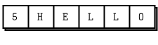

# 2장-소켓 및 패턴 {-}

1장 - 기본에서 몇 가지 ØMQ 패턴의 기본 예제로 ØMQ의 세계로 뛰어들었습니다 : 요청-응답, 발행-구독, 파이프라인. 이장에서는 우리의 손을 더럽히면서 실제 프로그램에서 이러한 도구들을 어떻게 사용하는지 배우게 될 것입니다.

다루는 내용은 다음과 같습니다.

* ØMQ 소켓을 만들고 사용하는 방법
* 소켓상에서 메시지 송/수신 방법
* ØMQ 비동기 I/O 모델상에서 응용프로그램 개발하기
* 하나의 스레드상에서 다중 소켓 처리하는 방법
* 치명적인 및 비치명적인 오류에 적절하게 대응하기
* Ctrl-C와 같은 인터럽트 처리하기
* ØMQ 응용프로그램을 깨끗하게 종료하기
* ØMQ 응용프로그램의 메모리 누수 여부를 확인하기
* 멀티파트 메시지 송/수신 방법
* 네트워크상에서 메시지 전달하기
* 단순 메시지 대기열 브로커 개발하기
* ØMQ에서 멀티스레드 응용프로그램 개발하기
* ØMQ를 스레드 간 신호에 사용하기
* ØMQ를 네트워크상 노드들 간 협업에 사용하기
* 발행-구독에서 메시지 봉투 생성하고 사용하기
* 메모리 오버플로우에 대비하여 최고수위 표시(HWM,high-water mark) 사용하기

## 소켓 API

ØMQ는 익숙한 소켓 기반 API를 제공하고 내부에 일련의 메시지 처리 엔진을 가지고 있으며 당신이 어떻게 분산 소프트웨어를 설계하고 개발하는지에 따라 점차 당신의 세계관으로 만들 수 있습니다.

소켓은 네트워크 프로그래밍에서는 표준 API이며 눈꺼풀처럼 눈알이 빰에 떨어지는 것을 막을 정도로 유용합니다. 
특히 개발자에게 ØMQ  매력적인 점은 다른 개념 대신 소켓과 메시지를 사용한다란 것이며, 이러한 개념을 이끌어낸 [Martin Sustrik](http://250bpm.com/)에게 감사하고 싶습니다. 
 "메시지 기반 미들웨어"로 방 전체를 긴장감으로 채울 것 문구를 "특별히 매운 소켓!"으로 변경하여 피자에 대한 이상한 갈망과 더 많은 것을 알고 싶게 합니다. 

좋아하는 요리처럼, ØMQ 소켓도 쉽게 이해할 수 있습니다. 
ØMQ 소켓도 BSD 소켓과 같이 4개의 생명 주기가 있습니다.

* 소켓 생성 및 파괴를 합니다.
 - 소켓의 운명의 생명 주기를 만듭니다(`connect()`, `close()` 참조).
* 소켓 구성 옵션 설정합니다.
 - 필요할 경우 설정 필요합니다(`setSockOpt()` 참조).
* 소켓 연결을 합니다.
 - ØMQ 연결을 생성하여 소켓을 네트워크에 참여시킵니다(`bind()`, `connect()` 참조).
* 소켓을 통한 메시지 송/수신합니다.
 - 다양한 통신 패턴에서 메세지 송신과 수신에 사용됩니다.(`send()`, `recv()` 참조)

소켓은 향상 void 포인터이며, 메시지들은 구조체이며 C++ 언어에서 `send()`에 메시지의 주소를 전달하거나 `recv()` 메시지의 주소를 반환받습니다.
기억하기 쉽게 ØMQ에서 모든 소켓은 우리에게 속해 있지만 메시지들은 소스 코드상에 있습니다.

소켓 생성, 소멸 및 구성은 모든 객체에 대해 예상대로 동작하지만, ØMQ는 비동기식이며 소켓을 네트워크 토폴로지에 연결하는 방법에 따라 소켓을 사용하는데 영향을 미칩니다.

### 네트워크상에 소켓 넣기

2개의 노드 간의 연결을 생성하기 위하여, 한쪽 노드에 `bind()`를  그리고 다른 쪽 노드에 `connect()`를 사용할 수 있습니다. 일반적으로 `bind()`를 수행하는 노드를 서버(네트워크 주소가 고정됨)라고 하며 `connect()`를 수행하는 노드를 클라이언트(네트워크 주소가 모르거나 임시)라고 합니다.
우리는 "단말(endpoint)에 소켓을 바인딩"과 "단말에 소켓을 연결"라고 말하며, 단말은 네트워크 주소를 알 수 있어야 합니다.

ØMQ 연결은 전통적인 TCP 연결과 다소 차이가 있으며 주요한 차이는 다음과 같습니다.

* ØMQ는 임의의 전송방식(inproc, ipc, tcp, pgm, epgm)을 교차하여 사용할 수 있습니다.
 - `zmq_inproc()`, `zmq_ipc()`, `zmq_tcp()`, `zmq_pgm()`, `zmq_epgm()` 참조
* 하나의 소켓에서 여러 개의 송/수신 연결들(connections)을 가질 수 있습니다.
* `zmq_accept()`가 같은 함수가 없습니다.
 - 소켓이 단말에 바인딩되면 자동으로 연결을 수락합니다.
* ØMQ는 네트워크 연결을 백그라운드로 수행하며, 네트워크 연결이 끊기면 자동으로 재연결합니다(예를 들어 통신 대상이 사라졌다가 다시 돌아올 경우).
* 응용프로그램 코드가 이러한 연결에 대해 직접 작업하지 않습니다. : ØMQ 소켓에 내장되어 있습니다.

일반적인 네트워크 아키텍처상에서 클라이언트/서버 구성할 때, 서버는 정적 형태, 클라이언트는 동적 형태로, 각 노드에서 서버의 경우 `bind()`, 클라이언트에서는 `connect()`을 수행하지만 어떤 종류의 소켓(예 : REQ-REP, PUB-SUB, PUSH-PULL, ROUTER-DEALER)을 사용하는지에 연관되며, 특이한 네트워크 아키텍처에서는 예외가 있습니다. 이러한 소켓 유형을 나중에 살펴보도록 하겠습니다.

서버를 시작하기 전에 클라이언트를 수행하는 경우, 전통적인 네트워킹에서는 오류가 발생하지만, ØMQ의 경우 순서에 상관없이 시작과 중단을 할 수 있습니다. 클라이언트 노드에서 `connect()`를 수행하여 성공하면 소켓에 메시지를 전달하기 시작합니다. 일정 단계(희망하건대 메시지가 너무 많이 대기열에 쌓이게 되어 버리거나 차단되기 전까지)까지, 서버가 기동 되어 `bind()`를 하게 되면 ØMQ는 메시지를 전송하게 됩니다.

서버 노드는 다수의 단말들(통신규약과 네트워크 주소의 조합)을 바인딩할 수 있으며 이것도 하나의 소켓을 통해 가능합니다. 즉 서로 다른 전송방식(inproc, ipc, pgm, tcp 등)으로 연결을 수락합니다.

```java
socket.bind(szmq::SocketUrl("tcp://*:5555"));
socket.bind(szmq::SocketUrl("tcp://*:9999"));
socket.bind(szmq::SocketUrl("inproc://somename"));
```

UDP를 제외하고 대부분의 전송방식에서 동일한 단말을 두 번 바인딩할 수 없습니다.
그러나 ipc(프로세스 간 통신) 전송계층은 하나의 프로세스가 첫 번째 프로세스에서 이미 사용된 단말에 바인딩하게 합니다. 이것은 프로세스 간의 충돌에 대비하여 복구하기 위한 목적입니다.

ØMQ는 어느 쪽이 바인딩되고 어느 쪽이 연결되는지에 대해 중립을 유지하려 하지만 차이점이 있습니다. 나중에 더 자세히 살펴보겠습니다. 일반적으로 "서버"는 다소 고정된 단말에 바인딩하고  "클라이언트"는 동적 요소인 단말에 연결하는 것으로 생각합니다. 동적/정적 사용 모델에 따라 응용프로그램을 설계하십시오. 그러면 "그냥 작동"할 가능성이 높습니다.

소켓은 유형이 있고 소켓 유형에 따라 정의되는 의미는 네트워크 상에서 내부/외부 메시지 라우팅 정책이나 대기열 저장 등입니다. 특정 소켓 유형은 함께 사용할 수 없으며 예를 들면 PUB 소켓과 SUB 소켓. 

ØMQ는 다양한 형태로 소켓을 연결할 수 있으며 메시징 대기열 시스템으로써 기본 역량을 제공합니다. 근본적으로 ØMQ는 다양한 구성 요소(소켓, 연결, 프록시 등)들을 필요에 따라 끼워 맞추어 필요한 네트워크 아키텍처를 정의할 수 있게 합니다.

### 메시지 송/수신

메시지 송/수신을 위하여 `send()`와 `recv()` 함수를 사용할 수 있습니다. 전통적인 방식의 명칭이지만 ØMQ I/O 모델은 기존 TCP 모델과는 확연히 차이가 있습니다.

Figure 9 - 1:1 TCP 소켓(TCP sockets are 1 to 1)


TCP 소켓과 ØMQ 소켓의 주요 차이는 데이터 처리 방식입니다.

* ØMQ 소켓은 메시지들을 전달합니다.
마치 UDP처럼. 다소 TCP의 바이트 스트림처럼 동작한다. ØMQ 메시지는 길이가 지정된 바이너리 데이터로 성능 최적화를 위해 다소 까다롭게 설계되었습니다.
* ØMQ 소켓의 I/O는 백그라운드 스레드로 동작합니다.
응용프로그램이 무엇을 바쁘게 처리하더라도 I/O 스래드는 메시지들을 입력 대기열로부터 수신하고, 출력 대기열로에서 송신하게 합니다.
* ØMQ 소켓들은 소켓 유형에 따라 1:N 라우팅이 내장되어 있다.

`send()` 함수는 실제 메시지를 소켓 연결에서 전송하지 않고 메시지를 대기열에 쌓아 I/O 스레드가 비동기로 전송할 수 있게 합니다. 이러한 동작은 일부 예외 상황을 제외하고는 차단되지 않습니다. 그래서 메시지를 `send()`로 전송할 때 반환값이 필요 없습니다.

### 유니케스트 전송방식

ØMQ는 일련의 유니케스트 전송방식(inproc, ipc, tcp)과 멀티캐스트 통신방식(epgm, pgm)을 제공합니다. 멀티캐스트는 진보된 기술로 나중에 다루지만 전개 비율에 따라 1:N 유니케스트가 불가하다는 것을 모른다면 시작조차 하지 마시기 바랍니다.

대부분의 경우 TCP 사용하며 "비연결성 TCP 전송계층"라고 하며, 대부분의 경우 충분히 빠르고 유연하고 간편합니다. 우리가 "비연결성"라고 부르는 것은 ØMQ의 TCP 전송방식은 단말이 연결을 하기전에 존재할 필요가 없기 때문입니다. 클라이언트들과 서버들은 언제든지 연결하거나 바인딩할 수 있으며, 나가고 들어오는 것이 가능하며 응용프로그램에 투명하게 유지됩니다.

프로세스 간 ipc 전송방식도 TCP처럼 "비연결성"이지만 한 가지 제약 사항은 원도우 환경에서는 아직 동작하지 않습니다. 편의상 단말의 명칭들을 ".ipc" 확장명으로 사용하여 다른 파일명과 잠재적인 충돌을 피하도록 하겠습니다. 유닉스 시스템에서 ipc 단말을 사용하려 한다면 적절한 접근 권한을 생성이 필요하며 그렇지 않다면 다른 사용자 식별자(ID)하에 구동되는 프로세스 간에 공유는 허용되지 않을 것입니다. 그리고 모든 프로세스들은 파일들(예를 들면 동일 디렉터리에서 존재하는 파일들)에 대하서 접근할 수 있어야 합니다.

스레드 간 inproc 전송방식은  "연결된 신호 전송계층"이며 tcp 혹은 ipc 보다 훨씬 빠르지만 tcp나 ipc와 비교했을 때 특정 제약을 가지고 있습니다 : 서버는 반드시 클라이언트가 연결을 요청하기 전에 바인딩이 되어야 한다. 이것은 미래의 ØMQ 버전에서 개선되겠지만 현재는 어떻게 inproc 소켓을 사용해야 하는지를 정의합니다. 우리는 부모 스레드에서 소켓을 생성하고 바인딩하고 자식 스레드를 시작하여 소켓을 생성하고 연결하게 합니다.

### ØMQ는 중립적인 전송수단이 아니다.

ØMQ을 처음 접하는 사람들의 공통적인 질문(이것은 나 스스로에게도 한 것임)은 "ØMQ로 XYZ 서버를 개발하는 방법은 무엇이지?"입니다. 예를 들면 "ØMQ로 HTTP 서버를 개발하는 방법은 무엇이지?"와 같으며 이는 HTTP 요청과 응답을 일반 소켓을 사용하는 것처럼, ØMQ 소켓을 통하여 더 빠르고 좋게 동일한 작업을 수행할 수 있어야 합니다.

예전에는 ØMQ는 "그렇게 동작하지 않는다"라며 ØMQ는 중립적인 전송수단(Neutral carrier)이 아니다고 했습니다 : 이것은 전송방식 통신규약(OSI 7 계층)에 프레이임을 부가하기 때문입니다. ØMQ의 프레이임은 기존의 통신규약들과 호환되지 않습니다. 예를 들어 HTTP 요청과 ØMQ 요청을 비교하면 둘 다 TCP/IP상에서 동작하지만 자신의 프레이임을 사용하는 경향이 있습니다.

*  프레이임(framing)은 OSI 7 계층에서 데이터링크에서 정의하고 있으며 메시지 데이터 구성 방식으로 다양한 통신규약들에 의해 교환되고 운반되는 데이터 단위입니다

그림 10 - 네트워크상 HTTP


HTTP 요청은 CR(0x0D)-LF(0x0A)을 프레이임 구분자로 사용하지만 ØMQ는 길이가 지정된 프레임을 사용합니다. 그래서 ØMQ를 사용하여 요청-응답 소켓 패턴으로 HTTP와 유사한 통신규약을 작성할 수 있지만 HTTP에서는 할 수 없습니다.

그림 11 - 네트워크상 ØMQ



v3.3 버전 이후로 ØMQ는 "ZMQ_ROUTER_RAW"라는 새로운 소켓 옵션을 가지고 ØMQ 프레이밍이 없이도 데이터를 읽고 쓸 수 있게 되었습니다. 즉 적절한 HTTP 요청과 응답을 읽고 쓸수 있게 되었다. "하딥 싱(Hardeep Singh)"은 자신의 ØMQ 응용프로그램에서 텔넷 서버에 연결할 수 있도록 이러한 변경에 기여했습니다. 현재(2020년 8월) ØMQ 4.3.2의 `setSockOpt()`에서도 `ZMQ_ROUTER_RAW` 사용 가능합니다.

### I/O 스레드들

이전에 ØMQ는 백그라운드 스레드를 통하여 I/O을 수행한다고 하였으며, 하나의 I/O 스레드(모든 소켓들에 대하여)에서 메시지 처리가 가능합니다(일부 극단적으로 대량의 I/O를 처리하는 응용프로그램의 경우 I/O 스레드 개수를 조정 가능함). 새로운 컨텍스트를 만들 때, 하나의 I/O 스레드가 시작되며, 일반적으로 하나의 I/O 스레드는 초당 1 기가바이트의 데이트를 입/출력할 수 있습니다. I/O 스레드의 개수를 늘리기 위해서는 소켓을 생성하기 전에 `szmq::Context()` 함수를 사용할 수 있습니다.

```java
#include <szmq/szmq.h>
#include <iostream>
using namespace std;

int main(){
	int io_threads = 1;
	int num_of_max_sockets = 5;
	szmq::Context ctx(io_threads, num_of_max_sockets);
	cout << "ZMQ_IO_THREADS : " << ctx.getContext(ZMQ_IO_THREADS) << endl;
	cout << "ZMQ_MAX_SOCKETS : " << ctx.getContext(ZMQ_MAX_SOCKETS) << endl;
	assert (ctx.getContext(ZMQ_IO_THREADS) == io_threads);
	assert (ctx.getContext(ZMQ_MAX_SOCKETS) == num_of_max_sockets);
	return 0;
}
```

* 빌드 및 테스트

~~~{.bash}
PS D:\work\sook\src\szmq\examples> cl -EHsc ctx_test.java szmq.lib
PS D:\work\sook\src\szmq\examples> ./ctx_test
ZMQ_IO_THREADS : 1
ZMQ_MAX_SOCKETS : 5
~~~

하나의 소켓에서 한 번에 수십 개 혹은 수천 개의 연결을 처리할 수 있으며 이것이 ØMQ 기반 응용프로그램 작성에 근본적인 영향을 줍니다. 기존의 네트워크 응용프로그램에서는 원격 연결당 하나의 프로세스 혹은 하나의 스레드가 필요하였으며, 해당 프로세스 혹은 스레드에서 하나의 소켓으로 처리하였습니다. ØMQ를 사용하면 전체 구조를 단일 프로세스로 축소하고 필요에 따라 확장할 수 있습니다.

* ØMQ 응용프로그램 작성 시 클라이언트/서버를 각각의 스레드로 작성하여 inproc를 통하여 테스트를 수행하고, 정상적인 경우 각 스레드는 프로세스로 분리하여 IPC나 TCP로 연결할 수 있습니다.

ØMQ를 스레드 간 통신(inproc)에 사용할 경우(예를 들어 멀티스레드 응용프로그램에서 외부 소켓 I/O가 없을 경우)에 한하여 I/O 스레드의 개수를 0으로 설정할 수 있습니다. 흥미롭지만 중요한 최적화는 아닙니다.

## 메시징 패턴

ØMQ 소켓 API를 감싸고 있는 갈색 포장지를 걷어내면 메시징 패턴의 세계가 놓여 있습니다. 만약 기업 메시징 시스템에 대한 배경이 있거나 UDP을 아신다면 다소 막연하지만 익숙할 것입니다. 그러나 ØMQ를 새로 접하시는 분에게는 놀라울 것입니다. 우리는 TCP 패러디엄을 사용하여 다른 노드와 1:1 매핑을 하였습니다.

ØMQ가 하는 일을 간단히 다음과 같습니다. 

* 데이터의 블록(메시지, 대용량 데이터(blobs))을 노드 간에 빠르고 효율적으로 전달합니다.
* 노드를 스레드(inproc), 프로세스(ipc) 혹은 머신(tcp, pgm)으로 메핑 할 수 있습니다.
* ØMQ는 응용프로그램에서 전송방식(in-process, inter-process, TCP, multicast)에 관계없이 단일 소켓 API를 제공합니다.
* 노드들 간 연결이 끊기면 자동으로 재연결하게 합니다.
* 송/수신 측에서 메시지들을 대기열에 관리하며, 이러한 대기열을 신중하게 관리하여 프로세스에 메모리가 부족하지 않도록 하며, 필요하다면 디스크에 저장합니다.
* 소켓 오류를 처리합니다.
* 모든 I/O 처리를 백그라운드 스레드가 처리합니다(기본 1개이며, 수량 조정 가능).
* ØMQ는 노드 간의 통신에 잠금 없는 기술을 사용하여 잠금, 대기, 세마포어, 교착이 발생하지 않습니다.

패턴이란 불리는 정확한 레시피에 따라 메시지들을 경유하고 대기열에 쌓을 수 있으며, 이러한 패턴들을 통하여 ØMQ에 지능을 제공합니다.
패턴들은 우리가 힘겹게 얻은 경험을 통하여 데이터와 작업을 분산하기 위한 최선의 방법을 제공합니다. ØMQ의 패턴은 하드 코딩되어 있지만 향후 버전에서는 사용자 정의 가능 패턴이 허용될 수 있습니다.

ØMQ 패턴들은 소켓과 일치하는 유형의 쌍으로 구현됩니다. ØMQ 패턴을 이해하기 위해서 소켓 유형의 이해가 필요하며 어떻게 함께 동작(ØMQ 패턴, 소켓 유형)하는지 알아야 합니다.

내장된 핵심 ØMQ 패턴들은 다음과 같습니다.

* 요청-응답(REQ-REP)
 - 일련의 클라이언트들에게 서비스들 연결을 하게 하며, 이것은 RPC(remote procedure call)와 작업 분배 패턴입니다.
* 발행-구독(PUSH-PULL)
 - 일련의 발행자들과 구독자들 연결을 하게 하며, 데이터 분배 패턴입니다.
* 파이프라인(Pipeline)
 - 노드들을 팬아웃/팬인(fan-out/fan-in) 패턴으로 연결하게 하며 여러 개의 절차들과 루프를 가질 수 있습니다. 이것은 병렬 작업 분배와 수집 패턴입니다.
* 독점적인 쌍(PAIR-PAIR)
 - 2개의 소켓들을 상호 독점적으로 연결합니다. 이것은 하나의 프로세스에서 2개의 스레드 간에 연결하는 패턴이며 정상적인 소켓의 쌍과 혼동이 없어야 합니다.

1장 기본에서 3개의 패턴을 보았으며 "독점적인 쌍"은 다음 장에서 보도록 하겠습니다. `szmq::Socket()` 매뉴얼에 패턴에 대한 설명이 되어 있으며 이해될 때까지 숙지할 필요가 있습니다.
다음은 연결-바인드 쌍에 대하여 유효한 소켓 조합입니다(어느쪽이든 바인딩을 수행할 수 있습니다.).

* PUB와 SUB
* REQ와 REP
* REQ와 ROUTER(주의 필요, REQ는 추가로 1개의 널(NULL(0)) 프레임을 넣는다.)
* DEALER와 REP(주의 필요, REP는 1개의 널(NULL(0)) 프레임으로 가정한다.)
* DEALER와 ROUTER
* DEALER와 DEALER
* ROUTER와 ROUTER
* PUSH와 PULL
* PAIR와 PAIR

XPUB와 XSUB 소켓도 있으며, 다음장에서 다루도록 하겠습니다(PUB와 SUB의 원시(raw) 버전과 유사). 다른 소켓 조합들은 신뢰할 수 없는 결과를 낳을 수 있으며, 미래의 ØMQ에서는 오류를 생성하게 할 예정입니다. 물론 코드상에서 다른 소켓 유형을 연결할 수 있습니다(즉, 한 소켓 유형에서 읽고 다른 소켓 유형에 쓰기).

### 고수준의 메시지 패턴들

ØMQ 에는 내장된 4개의 핵심 패턴이 있으며, 그들은 ØMQ API의 일부이며 C++ 라이브러리로 구현되어 있으며 모든 용도에 적절하게 동작함을 보장합니다.

* 핵심 패턴들은 ØMQ RFC사이트(https://rfc.zeromq.org)에서 정의되어 있습니다.
- MDP(Majordome Protocol), TSP(Titanic Service Protocol), FLP(Freelance Protocol), CHP(Clustered Hashmap Protocol) 등이 있습니다.

위의 제목에서 ØMQ의 핵심 라이브러리가 아니고 ØMQ 패키지에 포함되지도 않았음에도 고수준의 메시지 패턴들을 넣은 것은,  ØMQ 커뮤니티에서 자신만의 영역으로 존재하기 때문이다.
예를 들면 집사(Majordome) 패턴(4장-신뢰성 있는 요청-응답 패턴에서 소개)은 ØMQ 조직에서 깃허브 프로젝트(https://github.com/ØMQ/majordomo)로 자리 잡았습니다.

이 책에서 우리가 제공하고자 하는 일련의 고수준 패턴들은 작을 수도 있고(정상적으로 메시지 처리하는 방법) 거대(신뢰할 수 있는 PUB-SUB 아키텍처를 만드는 방법)할 수도 있습니다.

### 메시지와 작업하기(RAW zeroMQ API)

libzmq 핵심 라이브러리는 사실 메시지를 송/수신하는 2개의 API를 가지고 있습니다. `zmq_send()`와 `zmq_recv()` 함수이며, 이미 한줄짜리 코드로 보았습니다. `zmq_recv()`는 임의의 메시지 크기를 가지는 데이터를 처리하는 데는 좋지 않습니다. `zmq_recv()`는 응용프로그램의 코드 내에서 정의한 버퍼의 크기를 넘을 경우 크기 이상 메시지 데이터는 버리게 됩니다. 그래서 `zmq_msg_t` 구조체를 다룰 수 있도록 추가적인 API로 작업해야 합니다.

* 메시지 초기화 : `zmq_msg_init()`,  `zmq_msg_init_size()`,  `zmq_msg_init_data() `
* 메시지 송/수신 : `zmq_msg_send()`,  `zmq_msg_recv()` 
* 메시지 해제 : `zmq_msg_close()`
* 메시지 내용 접근 : `zmq_msg_data()`,  `zmq_msg_size()`,  `zmq_msg_more()`
* 메시지 속성 작업 : `zmq_msg_get()` ,  `zmq_msg_set()`
* 메시지 조작 : `zmq_msg_copy()` ,  `zmq_msg_move()`

네트워크상에서, ØMQ 메시지들은 메모리상 0에서 임의의 크기의 덩어리(blob)입니다. 응용프로그램에서 해당 메시지를 처리하기 위해서는 통신규약 버퍼, msgpack, JSON 등으로 직렬화를 수행해야 합니다.
이식 가능한 데이터 표현을 현명하게 선택하기 위하여 장/단점을 이해해야 결정할 수 있습니다.

메모리상에서 ØMQ 메시지는 `zmq_msg_t` 구조체(개발 언어에 따라 클래스)로 존재하며 C 언어에서 ØMQ 메시지들을 사용하는 기본 규칙이 있습니다.

* `zmq_msg_t` 객체(데이터의 블록 아님)를 생성하고 전달할 수 있습니다.
* 메시지를 읽기 위해서 `zmq_msg_init()`을 호출하여 하나의 빈 메시지를 만들고 `zmq_msg_recv()`을 통하여 수신합니다.
* 새로운 데이터(구조체)에 메시지를 쓰기 위해서 `zmq_msg_init_size()`을 호출하여 메시지를 생성하고 동시에 구조체 크기의 데이터 블록을 할당합니다. 그리고 `memcpy()`을 사용하여 데이터를 채워 넣고 `zmq_msg_send()`를 통하여 메시지를 송신합니다.
* 메시지를 해제(파괴가 아님)를 위하여, `zmq_msg_close()`을 호출하여 참조를 없애고 결국 ØMQ가 메시지를 삭제하게 합니다.
* 메시지 내용을 접근하기 위하여 `zmq_msg_data()`을 사용하며, 메시지 내용에 얼마나 많은 데이터가 있는지 알기 위하여 `zmq_msg_size()`을 호출합니다.
* `zmq_msg_move()`, `zmq_msg_copy()`, `zmq_msg_init_data()`에 대하여 정확하게 사용법을 확인하여 사용해야 합니다.
* 메시지가 `zmq_msg_send()`을 통해 전송된 이후, ØMQ는 메시지를 청소합니다. 예를 들어 크기를 0으로 설정하여 동일 메시지를 두 번 보낼 수 없으며 데이터 전송 이후 메시지에 접근할 수 없습니다.
* 이러한 규칙은 `zmq_send()`와 `zmq_recv()`을 사용한 경우 적용되지 않으며, 이 함수들은 바이트의 배열을 전달하지 메시지 구조체를 전달하는 것은 아니기 때문입니다.

만약 동일 메시지를 한번 이상 보내고 싶을 경우, 추가적인 메시지를 만들어 `zmq_msg_init()`으로 초기화하고 `zmq_msg_copy()`을 사용하고 첫 번째 메시지를 복사하여 생성할 수 있습니다. 이것은 데이터를 복사하는 것이 아니라 참조를 복사합니다. 그런 다음 메시지를 두 번(혹은 이상으로 더 많은 복사를 작성하는 경우) 보내며, 마지막 사본을 보내거나 닫을 때 메시지가 삭제됩니다.

ØMQ는 멀티파트 메시지들을 지원하며 일련의 데이터 프레임들을 하나의 네트워크상 메시지로 송/수신하게 하며 실제 응용프로그램에서 광범위하게 사용됩니다. "3장-개선된 요청-응답 패턴"에서 살펴보도록 하겠습니다.

프레임들(ØMQ 참조 매뉴얼에서는 메시지 파트들이고도 함)은 기본적인 ØMQ 메시지 형태이며 하나의 프레임은 일정 길이의 데이터의 블록이며 길이는 0 이상입니다. TCP 프로그래밍을 하셨다면 "네트워크 소켓에서 얼마나 많은 데이터를 읽어야 하는지?"란 물음에 대하여 ØMQ 프레임이 유용한 해답임을 알 수 있습니다.

[ZMTP](https://rfc.ØMQ.org/spec/37/)라고 불리는 와이어 레벨(wire-level) 통신규약이 존재하며 ØMQ가 TCP 연결상에서 프레임들을 어떻게 읽고 쓰는지를 정의합니다. 관심 있으면 한번 참조하기 바라며 사양서는 단순합니다.

원래는 하나의 ØMQ 메시지는 UDP처럼 하나의 프레임이었지만 나중에 멀티파트 메시지들로 확장하였으며, 단순히 일련의 프레임들이 있으며 "more" 비트을 1로 설정하고, 하나의 프레임 있으면 "more" 비트를 0으로 설정합니다.
ØMQ API에서 "more" 플레그를 통해 메시지를 쓸 수 있으며, 메시지를 읽을 때 "more"을 체크하여 추가적인 동작을 할 수 있습니다.

저수준의 ØMQ API와 참조 매뉴얼에서는 메시지들과 프레임들 간에 모호함이 있어 용어를 정의하겠습니다.

* 하나의 메시지는 하나 이상의 파트(part)들이 될 수 있습니다.
* 여기서 파트는 프레임입니다.
* 각 파트는 `zmq_msg_t` 객체입니다.
* 저수준 ØMQ API를 통하여 각 파트를 개별적으로 송/수신할 수 있습니다.
* 고수준 ØMQ API에서는 전체 멀티파트 메시지를 전송하는 래퍼를 제공합니다.

메시지에 대하여 알아두면 좋을 것들이 있습니다.

* 길이가 0인 메시지를 전송할 수 있습니다. 예를 들어 하나의 스레드에서 다른 스레드로 신호를 전송하기 위한 목적입니다.
* ØMQ는 메시지의 모든 파트들(하나 이상)의 전송을 보증하거나, 하지 않을 수 있습니다.
* ØMQ는 메시지(1개 혹은 멀티파트)를 바로 전송하지 않고, 일정 시간 후에 보냅니다.  그래서 하나의 멀티파트 메시지는 설정한 메모리의 크기에 맞아야 합니다.
* 하나의 메시지(1개 혹은  멀티파트)는 반드시 메모리 크기에 맞아야 하며 파일이나 임의의 크기를 전송하려면 하나의 파트의 메시지로 쪼개어서 각 조각을 전송해야 합니다. 멀티파트 데이터를 사용하여 메모리 사용을 줄일 수는 없습니다.
* 메시지 수신이 끝나면 `zmq_msg_close()`을 반드시 호출하여야 하며, 일부 개발 언어에서는 변수의 사용 범위를 벋어나도 자동으로 삭제하지 않습니다. 메시지를 전송할 때는 `zmq_msg_close()`을 호출하지 마시기 바랍니다.

아직 `zmq_msg_init_data()`을 언급하지 않았지만 이것은 "zero-copy"며 문제를 일으킬 수 있습니다. 마이크로초 단축에 대해 걱정하기보다는 ØMQ에 대해 알아야 할 중요한 사항들이 많이 있습니다.

많은 API는 작업하기 피곤하며 각종 함수들을 성능을 위해 최적화하는 것도 단순하지 않습니다. [ØMQ 매뉴얼](http://api.ØMQ.org/)에 익숙하기 전에 API를 잘못 사용하는 경우 오류가 발생할 수 있습니다. 특정 개발 언어에 대한 바인딩을 통하여 API를 쉽게 사용하는 것도 하나의 방법입니다.

### 다중 소켓 다루기

지금까지의 예제들은 아래 항목의 루프를 수행하였습니다.
1. 소켓의 메시지를 기다림
2. 메시지를 처리
3. 반복

만약 다중 단말로부터 동시에 메시지를 받아 처리해야 한다면 하나의 소켓에 모든 단말들을 연결하여 ØMQ가 팬아웃 형태로 처리하는 것이 간단한 방법이며, 원격 단말들에도 동일한 패턴을 적용할 수 있습니다. 하지만 패턴이 다른 경우 즉 PULL 소켓을 PUB 단말에 연결하는 것은 잘못된 방법이다.

* 가능한 패턴 : PUB/SUB, REQ/REP, REQ/ROUTER, DEALER/REP, DEALER/ROUTER, DEALER/DEALER, ROUTER/ROUTER, PUSH/PULL, PAIR/PAIR

실제로 한 번에 여러 소켓에서 읽으려면 `szmq::poll()`을 사용해야 합니다. 더 좋은 방법은 `szmq::poll()`을 프레임워크로 감싸서 이벤트 중심으로 반응하도록 변형하는 것이지만, 여기서 다루고 싶은 것보다 훨씬 더 많은 작업이 필요합니다.

* zloop 리엑터(reactor)를 통하여 이벤트 중심으로 반응하도록 zmq_poll() 대체 가능합니다.

그럼 그렇게 하지 말라는 예로, 비차단(nonblocking) 소켓 읽기를 수행하는 방법을 보여 드리겠습니다.
다음 예제는  2개의 소켓으로 메시지를 비차단 읽기로 수신하고 있으며 프로그램은 날씨 변경정보의 구독자와 병렬 작업의 작업자 역할을 수행하여 다소 혼란스럽습니다.

msreader.java: 다중 소켓 읽기

```java
//  Reading from multiple sockets
//  This version uses a simple recv loop

#include <szmq/szmq.h>
#include <iostream>
#include <chrono>
#include <thread>
using namespace std;

int main (void) 
{
    //  Connect to task ventilator
    szmq::Context context;
    // make a non blocking socket
    szmq::Socket<ZMQ_PULL, szmq::ZMQ_CLIENT> receiver(context);
    receiver.connect(szmq::SocketUrl("tcp://localhost:5557"));

    //  Connect to weather server
    szmq::Socket<ZMQ_SUB, szmq::ZMQ_CLIENT> subscriber(context);
    subscriber.connect(szmq::SocketUrl("tcp://localhost:5556"));
    subscriber.setSockOpt(ZMQ_SUBSCRIBE, "10001", 5);

    //  Process messages from both sockets
    //  We prioritize traffic from the task ventilator
    while (1) {
        while (1) {
            auto msg = receiver.recvOne(0); // set receive timeout to 0
            if (msg.size() != 0) {
                //  Process task
                cout << "P";
            }
            else
                break;
        }
        while (1) {
            auto msg = subscriber.recvOne(0); // set receive timeout to 0
            if (msg.size() != 0) {
                //  Process weather update
                cout << "S";
            }
            else
                break;
        }
        //  No activity, so sleep for 1 msec
        std::this_thread::sleep_for(std::chrono::milliseconds(1));      //  Do some 'work'
    }
    return 0;
}
```

* 빌드 및 테스트

~~~{.bash}
PS D:\work\sook\src\szmq\examples> cl -EHsc msreader.java szmq.lib

PS D:\work\sook\src\szmq\examples> ./taskvent
Press Enter when the workers are ready:
Sending tasks to workers...
Total expected cost: 5207 msec
PS D:\work\sook\src\szmq\examples> ./taskwork
74.98.24.45.45.82.85.63.8.75.41.95.53.76.63.19.40.36.59.77.44.47.
94.60.10.96.46.52.11.39.79.63.18.44.45.99.10.71.75.29.9.77.59.96.41.
15.52.91.70.78.88.55.36.59.97.77.82.96.98.14.32.98.37.83.5.20.88.43.
8.24.92.23.19.24.54.25.24.16.32.29.75.54.70.52.21.54.50.53.52.75.25.
32.75.26.7.37.71.14.48.78.
PS D:\work\sook\src\szmq\examples> ./msreader
PPPPPPPPPPPPPPPPPPPPPPPPPPPPPPPPPPPPPPPPPPPP
PPPPPPPPPPPPPPPPPPPPPPPPPPPPPPPPPPPPPPPPPPPP
PPPPPPPPPPPSSSSSSSSSSSSSSSSSSSSS
~~~

이런 접근에 대한 비용은 첫 번째 메시지에 대한 추가적인 지연이 발생합니다(메시지 처리하기에도 바쁜데 루푸의 마지막에 `sleep()`). 이러한 접근은 고속 처리가 필요한 응용프로그램에서 치명적인 지연을 발생합니다. `nanosleep()`를 사용할 경우 바쁘게 반복(busy-loop)되지 않는지 확인해야 합니다.

예제에서 2개의 루프에서 첫 번쨰 소켓(ZMQ_PULL)이 두 번쨰 소켓(ZMQ_SUB)보다 먼저 처리하게 하였습니다.

대안으로 이제 `szmq::poll()`을 사용하는 응용프로그램을 보도록 하겠습니다.

mspoller.java: 다중 소켓 폴러

```java
//  Reading from multiple sockets
//  This version uses zmq_poll()

#include <szmq/szmq.h>
#include <iostream>
#include <chrono>
#include <thread>
using namespace std;

int main (void) 
{

    //  Connect to task ventilator
    szmq::Context context;
    // make a non blocking socket
    szmq::Socket<ZMQ_PULL, szmq::ZMQ_CLIENT> receiver(context, szmq::NonblockingFlag(false));
    receiver.connect(szmq::SocketUrl("tcp://localhost:5557"));

    //  Connect to weather server
    szmq::Socket<ZMQ_SUB, szmq::ZMQ_CLIENT> subscriber(context, szmq::NonblockingFlag(false));
    subscriber.connect(szmq::SocketUrl("tcp://localhost:5556"));
    subscriber.setSockOpt(ZMQ_SUBSCRIBE, "10001", 5);

    //  Process messages from both sockets
    while (1) {
        std::vector<szmq::PollItem> pollItems = {
			{reinterpret_cast<void*>(*receiver), 0, ZMQ_POLLIN, 0},
            {reinterpret_cast<void*>(*subscriber), 0, ZMQ_POLLIN, 0}};
        szmq::poll(pollItems, 2, -1);
        if (pollItems [0].revents & ZMQ_POLLIN) {
            auto msg = receiver.recvOne();
            //  Process task
            cout << "P";

        }
        if (pollItems [1].revents & ZMQ_POLLIN) {
            auto msg = subscriber.recvOne();
            //  Process weather update
            cout << "S";
        }
    }
    return 0;
}
```

* "szmq::poll(items, 2, -1)"에서 3번째 인수가 "-1"일 경우, 이벤트가 발생할때까지 기다리게 됩니다.

`zmq_pollitem_t`는 4개의 맴버가 있으며 구조체입니다.(ØMQ 4.3.2).

```java
typedef struct zmq_pollitem_t
{
    void *socket;
#if defined _WIN32
    SOCKET fd;
#else
    int fd;
#endif
    short events;
    short revents;
} zmq_pollitem_t;
```

* 빌드 및 테스트

~~~ {.bash}
PS D:\work\sook\src\szmq\examples> cl -EHsc mspoller.java szmq.lib

PS D:\work\sook\src\szmq\examples> ./taskvent
Press Enter when the workers are ready:
Sending tasks to workers...
Total expected cost: 5207 msec
PS D:\work\sook\src\szmq\examples> ./taskwork
74.98.24.45.45.82.85.63.8.75.41.95.53.76.63.19.40.36.59.77.44.47.
94.60.10.96.46.52.11.39.79.63.18.44.45.99.10.71.75.29.9.77.59.96.41.
15.52.91.70.78.88.55.36.59.97.77.82.96.98.14.32.98.37.83.5.20.88.43.
8.24.92.23.19.24.54.25.24.16.32.29.75.54.70.52.21.54.50.53.52.75.25.
32.75.26.7.37.71.14.48.78.
PS D:\work\sook\src\szmq\examples> ./mspoller
SSSSSSSSSSSSSSSSSSSSSSSSSSSSSSSSSSPPPPPPPPPPPPPPPPPPPPPPPPP
PPPPPPPPPPPPPPPPPPPPPPPPPPPPPPPPPPPPPPPPPPPPPPPPPPPPPPPPPPP
PPPPPPPPPPPPPPPPSSSSSSSSSSSSSSSSSSSS
...
~~~

### 멀티파트 메시지들

ØMQ는 여러 개의 프레임들로 하나의 메시지를 구성하게 하며 멀티파트 메시지를 제공합니다. 현실에서는 응용프로그램은 멀티파트 메시지를 많이 사용하며 IP 주소 정보를 메시지에 내포하여 직열화 용도로 사용합니다. 우리는 이것을 응답 봉투에서 나중에 다루겠습니다.

이제부터 어떤 응용프로그램(프록시와 같은)에서나 멀티파트 메시지를 맹목적으로 안전하게 읽고 쓰는 방법을 설명하며, 프록시는 메시지를 별도의 검사 없이 전달하도록 합니다.

멀티파트 메시지 작업 시, 개별 파트는 `szmq::Message` 객체이며, 메시지를 5개의 파트들로 전송한다면 반드시 5개의 szmq::Message 항목들을 생성, 전송, 파괴를 해야 합니다. 이것을 미리 하거나(`szmq::Message`를 배열이나 구조체에 저장하여) 혹은 전송 이후 차례로 할 수 있습니다.

`sendMore()`를 통하여 멀티파트 메시지에 있는 프레임을 전송하는 방법입니다(각각의 프레임은 메시지 객체로 수신합니다).

```java
  socket.sendMore(szmq::Message::from(std::string("message")));
  ...
  socket.sendMore(szmq::Message::from(std::string("message")));
  ...
  socket.sendOne(szmq::Message::from(std::string("message")));
```

`recvOne()`을 통하여 메시지에 있는 모든 파트들을 수신하고 처리하는 예제입니다. 파트는 1개이거나 멀티파트로 가능합니다.

```java
while (1) {
    auto message socket.recvOne().read<std::string>()
    // Process the message frame
    ...
    if (!socket.hasMore())
        break; // Last message frame
}
```

멀티파트 메시지들에 대하여 알아야 될 몇 가지 사항은 다음과 같습니다.

* 멀티파트 메시지를 전송할 때, 첫 번째 파트(와 후속되는 파트들)는 마지막 파트를 전송하기 전에 네트워크상에서 실제 전송되어야 합니다.
* `szmq::poll()`을 사용한다면, 메시지의 첫 번째 파트가 수신될 때, 나머지 모든 파트들도 도착되어야 합니다.
* 메시지의 모든 파트들을 수신하거나, 하나도 받지 않을 수 있습니다.
* 메시지의 각각의 파트는 개별적인 `zmq_msg` 항목입니다.
* `hasMore()`을 통한 `more` 속성을 점검 여부에 관계없이 메시지의 모든 파트들을 수신할 수 있습니다.
* 데이터 전송 시, ØMQ는 메시지 대기열에 마지막 프레임이 올 때까지 쌓이게 하여, 마지막 프레임이 도착하면 대기열의 모든 프레임들을 전송합니다.
* 소켓을 닫는 경우를 제외하고는 메시지 전송 시 프레임들을 부분적으로 취소할 방법은 없습니다.


### 중개자와 프록시

ØMQ는 지능의 탈중앙화를 목표로 만들었지만 네트워크상에서 중간이 텅 비었다는 것은 아니며, ØMQ를 통해 메시지 인식 가능한 인프라구조를 만들었습니다.
ØMQ의 배관은 조그만 파이프에서 완전한 서비스 지향 브로커까지 확장될 수 있습니다. 
메시지 업계에서는 이것을 중개자로 부르며 양쪽의 중앙에서 중개하는 역할을 수행하며, ØMQ에서는 문맥에 따라 프록시, 대기열, 포워더, 디바이스, 브로커라 부르겠습니다.

이러한 패턴은 현실세계에서 일반적이지만 왜 우리의 사회와 경제에서 실제 아무 기능도 없는 중개자로 채워져 있는 것은 거대한 네트워크 상에서 복잡성을 줄이고 비용을 낮추기 위함입니다. 현실세계에서 중계자는 보통 도매상, 판매 대리점, 관리자 등으로 불립니다.

### 동적 발견 문제

거대한 분산 아키텍처를 설계할 때 골 때리는 문제 중에 하나가 상대방을 찾는 것입니다. 어떻게 각 노드들이 상호 간을 인식할 수 있을지, 이것은 노드들이 네트워크상에서 들어오고 나가고를 반복하면서 특히 어렵게 되며 이러한 문제를 "동적 발견 문제"로 부르기로 하겠습니다.

* 클라이언트에서 서비스(서버) 제공자를 찾기 위한 방법이 분산 시스템 구성에서 주요한 화두이며, 일부 상용 제품에서는 디렉터리 서비스(Directory Service)를 통해 문제를 해결합니다. 대표적인 제품으로 Apache LDAP이 있으며, NASA의 GMSEC의 경우 LDAP을 사용합니다.

동적 발견에 대한 몇 가지 해결 방법이 있지만, 가장 쉬운 해결 방법은 네트워크 아키텍처를 하드 코딩(혹은 구성 파일 사용)하여 사전에 정의하는 것이지만, 새로운 노드가 추가되면 네트워크 구성을 다시 하드 코딩(혹은 구성 파일 변경) 해야 합니다.

그림 12 - 소규모 Pub-Sub 네트워크


실제 이런 해결법(하드 코딩(혹은 구성 파일 변경))은 현명하지 못하며 무너지기 쉬운 아키텍터로 이끌어 갑니다.
하나의 발행자에 대하여 100여 개의 구독자가 있다면 각 구독자가 연결하려는 발행자 단말 정보를 구성 정보화하여 발행자에 연결하려 할 것입니다. 발행자가가 고정되어 있고 구독자가 동적인 경우는 쉽지만, 새로운 발행자들을 추가할 경우 더 이상 이전 구성 정보를 사용할 수 없습니다. 만약 구성 정보 변경을 통하여 각 구독자를 발행자에 연결하게 한다면 동적 발견 회피 비용(구성 정보 변경 + 구독자 재기동)은 점점 더 늘어갈 것입니다.

그림 13 - 프록시를 통한 발행-구독 네트워크


이것에 대한 해결책은 중개자를 추가하는 것이며, 네트워크상 정적 지점에 다른 모든 노드들이 연결하게 합니다. 전통적인 메시징에서 이러한 역할은 메시지 브로커가 수행합니다. ØMQ는 이와 같은 메시지 브로커가 없지만 중개자들을 쉽게 만들 수 있습니다.

그럼 왜 ØMQ에서 메시지 브로커를 만들지 않았는지 궁금해질 것입니다. 초보자가 응용프로그램을 작성할 때 메시지 브로커가 있다면 상당히 편리할 수 있습니다. 마치 네트워크 상에서 성능을 고려하지 않은 스타 토폴로지가 편리한 것처럼 말입니다.
하지만 메시지 브로커는 탐욕스러운 놈입니다 : 특히 중앙 중개자 역할을 할 경우 그들은 너무 복잡하고 다양한 상태를 가지고, 결국 문제를 일으킵니다.

중개자를 단순히 상태가 없는 메시지 스위치들로 생각하면 좋을 것 같으며, 유사한 사례는 HTTP 프록시이며 클라이언트의 요청을 서버에 전달하고 서버의 응답을 클라이언트에 전달하는 역할 외에는 수행하지 않습니다.
PUB-SUB 프록시를 추가하여 우리의 예제에서 동적 발견 문제를 해결할 수 있습니다. 프록시를 네트워크상 중앙에 두고 프록시를 발행자에게는 XSUB 소켓으로 구독자에게는 XPUB 소켓으로 오픈하고 각각(XSUB, XPUB)에 대하여 잘 알려진 IP 주소와 포트로 바인딩하게 합니다. 그러면 다른 프로세스들(발행자, 구독자)는 개별적으로 연결하는 것 대신에 프록시에 연결합니다. 이런 구성에서 추가적인 발행자나 구독자를 구성하는 것은 쉬운 일입니다.

그림 14 - 확장된 발행-구독


ØMQ가 구독 정보를 구독자들로부터 발행자들로 전달할 수 있는 XSUB과 XPUB 소켓에 대하여 살펴보도록 하겠습니다. XSUB와 XPUB은 특별한 메시지들에 대한 구독 정보를 공개하는 것 외에는 SUB와 PUB과 정확히 일치합니다. 프록시는 구독된 메시지들을 발행자들로부터 구독자들로 전달하며, XSUB 소켓으로 읽어서 XPUB 소켓에 쓰도록 합니다. 이것이 XSUB와 XPUB의 주요 사용법입니다.

* XSUB는 eXtended subscriber, XPUB은 eXtended publisher이며, 다수의 발행자들과 구독자들을 연결하는 프록시(`szmq::proxy()`)를 통해 브로커 역할을 수행합니다.
* XSUB와 XPUB을 테스트하기 위하여 기상 변경 정보를 전달하는 `wuserver`의 `bind()`를 `connect()`로 변경하여 테스트를 하겠습니다.

* wuserver1.java : 기상 변경 정보 발행

```java
//  Weather update server
//  Binds PUB socket to tcp://*:5556
//  Publishes random weather updates

#include <szmq/szmq.h>
#include <cstdlib>
#include <time.h>
#include <string>
#include <boost/format.hpp>
using namespace std;

int main (void)
{
    //  Prepare our context and publisher
    szmq::Context context;
    szmq::Socket<ZMQ_PUB, szmq::ZMQ_SERVER> publisher(context);
    publisher.bind(szmq::SocketUrl("tcp://*:5556"));

    //  Initialize random number generator
    //std::srand (static_cast<unsigned int>(std::time(0)));
    srand((unsigned) time(NULL));
    while (1) {
        //  Get values that will fool the boss
        int zipcode, temperature, relhumidity;
        zipcode     = rand() % 100000;
        temperature = rand() % 215 - 80;
        relhumidity = rand() %50 + 10;
        //  Send message to all subscribers
        char update[20];
        snprintf (update, 20 ,
        	"%05d %d %d", zipcode, temperature, relhumidity);
        publisher.sendOne(szmq::Message::from(update));
    }
    publisher.close();
    return 0;
}
```
* wuclient1.java : 기상 변경 정보 구독

```java
//  Weather update client
//  Connects SUB socket to tcp://localhost:5556
//  Collects weather updates and finds avg temp in zipcode

#include <szmq/szmq.h>
#include <sstream>
#include <boost/format.hpp>
using namespace std;

int main (int argc, char *argv [])
{
    //  Socket to talk to server
    std::cout << "Collecting updates from weather server...\n";
    szmq::Context context;
    szmq::Socket<ZMQ_SUB, szmq::ZMQ_CLIENT> subscriber(context);

    subscriber.connect(szmq::SocketUrl("tcp://localhost:5557"));
    
    //  Subscribe to zipcode, default is NYC, 10001
    const char *filter = (argc > 1)? argv [1]: "10001 ";
    subscriber.setSockOpt(ZMQ_SUBSCRIBE, filter, strlen(filter));

    //  Process 100 updates
    int update_nbr;
    long total_temp = 0;
    for (update_nbr = 0; update_nbr < 100; update_nbr++) {
        auto buffer = subscriber.recvOne().read<std::string>();
        int zipcode, temperature, relhumidity;
        std::istringstream iss(buffer);
		iss >> zipcode >> temperature >> relhumidity ;
        total_temp += temperature;
    }
    std::cout << boost::format("Average temperature for zipcode %1% was %2%F\n") % filter % (int)(total_temp/update_nbr);
    subscriber.close();
    return 0;
}
```
* wuproxy1.java : XSUB와 XPUB를 사용하여 중개자 역할 수행

```java
//  Weather proxy device

#include <szmq/szmq.h>
using namespace std;

int main (void)
{
    szmq::Context context;
    szmq::Socket<ZMQ_XSUB, szmq::ZMQ_CLIENT> frontend(context);      
    frontend.connect(szmq::SocketUrl("tcp://localhost:5556"));
    szmq::Socket<ZMQ_XPUB, szmq::ZMQ_SERVER> backend(context);
    backend.bind(szmq::SocketUrl("tcp://*:5557"));
    //  Run the proxy until the user interrupts us
    szmq::proxy(reinterpret_cast<void*>(*frontend), reinterpret_cast<void*>(*backend), NULL);
    
    frontend.close();
    backend.close();
    return 0;
}

```

* 빌드 및 테스트

~~~ {.bash}
PS D:\work\sook\src\szmq\examples> cl -EHsc wuproxy1.java szmq.lib
PS D:\work\sook\src\szmq\examples> cl -EHsc wuserver1.java szmq.lib
PS D:\work\sook\src\szmq\examples> cl -EHsc wuclient1.java szmq.lib

PS D:\work\sook\src\szmq\examples> ./wuproxy1
PS D:\work\sook\src\szmq\examples> ./wuserver1

PS D:\work\sook\src\szmq\examples> ./wuclient1
Collecting updates from weather server...
Average temperature for zipcode 10001  was 24F
PS D:\work\sook\src\szmq\examples> ./wuclient1
Collecting updates from weather server...
Average temperature for zipcode 10001  was 31F
~~~

### 공유 대기열(DEALER와 ROUTER 소켓)

Hello World 클라이언트/서버 응용프로그램에서, 하나의 클라이언트는 하나의 서비스와 통신할 수 있었습니다. 그러나 실제상황에서는 다수의 서비스와 다수의 클라이언트에 대하여 사용 가능해야 하며, 이를 통해 서비스의 성능을 향상할 수 있습니다(단 하나의 스레드가 아닌 다수의 스레드들, 프로세스들 및 노드들). 유일한 제약은 서비스는 무상태이며, 요청 중인 모든 상태는 데이터베이스와 같은 공유 스토리지에 저장되어야 합니다.

그림 15 - 요청 분배


다수의 클라이언트들을 다수의 서버에 연결하는 방법에는 두 가지가 있습니다. 가장 강력한 방법은 각 클라이언트 소켓을 여러 서비스 단말에 연결하는 것입니다. 하나의 클라이언트 소켓은 여러 서비스 소켓에 연결할 수 있으며, REQ 소켓은 이러한 서비스들 간의 요청을 분배합니다. 다시 말해 하나의 클라이언트 소켓을 세 개의 서비스 단말에 연결한다고 하면 : 서비스 단말들(A, B 및 C)에 대하여 클라이언트는 R1, R2, R3, R4를 요청합니다. R1 및 R4는 서비스 A로 이동하고 R2는 B로 이동하고 R3은 서비스 C로 이동합니다.

* 서버에서 서비스를 제공하기 때문에, 서버란 용어 대신 서비스로 대체하여 사용하기도 합니다.
* 클라이언트가 REQ 소켓을 일련의 서버들의 REP 소켓에 연결하기 위한 예제는 다음과 같습니다.

* hwclient_mc.java : REQ 소켓에 일련의 서버를 연결

```java
//  Hello World client
#include <szmq/szmq.h>
#include <assert.h>
#include <iostream>

using namespace std;

int main (void)
{
    cout << "Connecting to hello world server...\n";
    szmq::Context context;
    szmq::Socket<ZMQ_REQ, szmq::ZMQ_CLIENT> requester(context);
    requester.connect(szmq::SocketUrl("tcp://localhost:5555"));
    requester.connect(szmq::SocketUrl("tcp://localhost:5556"));
    requester.connect(szmq::SocketUrl("tcp://localhost:5557"));
    
    int request_nbr;
    for (request_nbr = 0; request_nbr != 10; request_nbr++) {
        cout << "Sending Hello : " << request_nbr << endl;
        requester.sendOne(szmq::Message::from("Hello"));
        auto buffer = requester.recvOne();
        cout << "Received : " << buffer.read<std::string>() << endl;
    }
    requester.close();
    return 0;
}
```

* hwserver_argv.java : 명령어 창에서 바인딩 주소를 받아 실행하는 서버

```java
//  Hello World server

#include <szmq/szmq.h>
#include <iostream>
#include <chrono>
#include <thread>

using namespace std;

int main (int argc, char *argv [])
{
    if (argc < 2) {
        cout << "syntax: hwserver_argv tcp://*:xxxx...\n";
        return 0;
    }  
    //  Socket to talk to clients
    szmq::Context context;
    
    szmq::Socket<ZMQ_REP, szmq::ZMQ_SERVER> responder(context);
    responder.bind(szmq::SocketUrl(argv[1]));

    while (true) {
        auto buffer = responder.recvOne();
        cout << "received request: " << buffer.read<std::string>() << endl;
        std::this_thread::sleep_for(std::chrono::milliseconds(1000));      //  Do some 'work'
        responder.sendOne(szmq::Message::from("World"));
    }
    responder.close();
    return 0;
}

```

* 빌드 및 테스트

~~~{.bash}
PS D:\work\sook\src\szmq\examples> cl -EHsc hwclient_mc.java szmq.lib
PS D:\work\sook\src\szmq\examples> cl -EHsc hwserver_argv.java szmq.lib
PS D:\work\sook\src\szmq\examples> ./hwclient_mc
Connecting to hello world server...
Sending Hello : 0
Received : World
Sending Hello : 1
Received : World
Sending Hello : 2
Received : World
Sending Hello : 3
Received : World
Sending Hello : 4
Received : World
Sending Hello : 5
Received : World
Sending Hello : 6
Received : World
Sending Hello : 7
Received : World
Sending Hello : 8
Received : World
Sending Hello : 9
Received : World
PS D:\work\sook\src\szmq\examples> ./hwserver_argv tcp://*:5555
received request: Hello
received request: Hello
received request: Hello
received request: Hello
PS D:\work\sook\src\szmq\examples>  ./hwserver_argv tcp://*:5556
received request: Hello
received request: Hello
received request: Hello
PS D:\work\sook\src\szmq\examples>  ./hwserver_argv tcp://*:5557
received request: Hello
received request: Hello
received request: Hello
~~~

이 디자인을 사용하면 더 많은 클라이언트를 쉽게 추가할 수 있습니다. 더 많은 서비스를 추가할 수도 있습니다. 각 클라이언트는 서비스에 요청들을 분배합니다. 그러나 각 클라이언트는 서비스 토폴로지(어디서 무슨 서비스를 제공하는지)를 알아야 합니다. 100개의 클라이언트들이 있고 3개의 서비스들을 추가하기로 결정한 경우 클라이언트들이 3개의 새로운 서비스에 대해 알 수 있도록 100 개의 클라이언트를 서비스들의 구성 정보를 변경하고 다시 시작해야 합니다.

슈퍼 컴퓨팅 클러스터에 자원이 부족하여 수백 개의 새로운 서비스 노드들을 추가해야 할 경우, 새벽 3시에 일어나 하고 싶지는 않으실 겁니다. 너무 많은 정적 조각들은 액체 콘크리트와 같습니다 : 지식이 분산되고 정적 조각이 많을수록 네트워크 토폴로지를 변경하는 것에는 많은 노력이 필요합니다. 우리가 원하는 것은 클라이언트들과 서비스들 사이에 네트워크 토폴로지에 대한 모든 지식을 중앙화하는 것입니다. 이상적으로는 토폴로지의 다른 부분을 건드리지 않고 원격 서비스 또는 클라이언트를 추가 및 삭제할 수 있어야 합니다.

따라서 우리는 이러한 유연성을 제공하는 작은 메시지 대기열 브로커를 작성하겠습니다. 브로커는 클라이언트의 프론트엔드와 서비스의 백엔드의 두 단말을 바인딩합니다. 그런 다음 `szmq::poll()`을 사용하여이 두 소켓의 활동을 모니터링하고 소켓에 메세지가 전달 되었을 때, 두 소켓 사이에서 메시지를 오가도록 합니다. 브로커는 명시적으로 어떤 대기열도 관리하지 않습니다 - ØMQd의 각 소켓에서 자동으로 처리하게 합니다.

REQ를 사용하여 REP와 통신할 때 엄격한 동기식 요청-응답가 필요하였습니다. 클라이언트가 요청을 보내면 서비스는 요청을 받아 응답을 보냅니다. 그런 다음 클라이언트는 응답을 받습니다. 만약 클라이언트나 서비스가 다른 작업을 시도하면(예 : 응답을 기다리지 않고 두 개의 요청을 연속으로 전송) 오류가 발생합니다.

그러나 우리의 브로커는 비차단적으로 동작하며. 명확하게 `szmq::poll()`을 이용하여 어떤 소켓에 이벤트를 기다릴 수 있지만, REP와 REQ 소켓은 사용할 수 없습니다.

그림 16 - 확장된 요청-응답


다행히도 비차단 요청-응답을 수행할 수 있는 DEALER와 ROUTER라는 2개의 소켓이 있습니다. "3장-고급 요청-응답 패턴"에서 DEALER 및 ROUTER 소켓을 사용하여 모든 종류의 비동기 요청-응답 흐름을 구축하는 방법을 보도록 하겠습니다. 지금은 DEALER와 ROUTER가 중개자로 요청-응답을 확장하는 방법을 보도록 하겠습니다.

이 간단한 확장된 요청-응답 패턴으로, REQ 소켓은 ROUTER 소켓과 통신하고 DEALER 소켓은 REP 소켓과 통신합니다. DEALER와 ROUTER 사이에는 하나의 소켓에서 메시지를 가져와서 다른 소켓으로 보내는 코드(`szmq::proxy()`)가 존재해야 합니다.

요청-응답 브로커는 2개의 단말에 바인딩합니다. 하나는 클라이언트들을 연결(프론트엔드 소켓)하고 다른 하나는 작업자들을 연결(백엔드 소켓)하는 것입니다. 이 브로커를 테스트하기 위하여 백엔드 소켓에 연결하는 작업자들의 개수를 변경할 수도 있습니다. 다음은 요청하는 클라이언트 소스 코드입니다.

* rrclient.java: 요청-응답 클라이언트

```java
//  Hello World client
//  Connects REQ socket to tcp://localhost:5559
//  Sends "Hello" to server, expects "World" back
#include <szmq/szmq.h>
#include <assert.h>
#include <iostream>
using namespace std;

int main (void) 
{
    szmq::Context context;

    //  Socket to talk to server
    szmq::Socket<ZMQ_REQ, szmq::ZMQ_CLIENT> requester(context);
    requester.connect(szmq::SocketUrl("tcp://localhost:5559"));

    int request_nbr;
    for (request_nbr = 0; request_nbr != 10; request_nbr++) {
        requester.sendOne(szmq::Message::from("Hello"));
        auto string = requester.recvOne().read<std::string>();
        cout << "Received reply " << request_nbr << "[" << string << "]\n";
    }
    requester.close();
    return 0;
}
```

다음은 작업자(worker)의 코드입니다.

* rrworker.c: 요청-응답 작업자

```java
//  Hello World worker
//  Connects REP socket to tcp://localhost:5560
//  Expects "Hello" from client, replies with "World"
#include <szmq/szmq.h>
#include <iostream>
#include <chrono>
#include <thread>
using namespace std;

int main (void) 
{
    szmq::Context context;
    //  Socket to talk to clients
    szmq::Socket<ZMQ_REP, szmq::ZMQ_CLIENT> responder(context);
    responder.connect(szmq::SocketUrl("tcp://localhost:5560"));
    while (1) {
        //  Wait for next request from client
        auto string = responder.recvOne().read<std::string>();
        cout << "Received request: [" << string << "]\n";
        //  Do some 'work'
        std::this_thread::sleep_for(std::chrono::milliseconds(1000));
        //  Send reply back to client
        responder.sendOne(szmq::Message::from("World"));
    }
    //  We never get here, but clean up anyhow
    responder.close();
    return 0;
}
```

다음이 브로커 코드입니다. 멀티파트 메시지를 제대로 처리 할 수 있습니다.

* rrbroker.java: 요청-응답 브로커

```java
//  Simple request-reply broker
#include <szmq/szmq.h>
#include <iostream>
using namespace std;

int main (void) 
{
    //  Prepare our context and sockets
    szmq::Context context;
    szmq::Socket<ZMQ_ROUTER, szmq::ZMQ_SERVER> frontend(context);    
    szmq::Socket<ZMQ_DEALER, szmq::ZMQ_SERVER> backend(context);
    int rc = frontend.bind(szmq::SocketUrl("tcp://*:5559"));
    assert (rc == 0);
    rc = backend.bind(szmq::SocketUrl("tcp://*:5560"));
    assert (rc == 0);

    //  Initialize poll set
    std::vector<szmq::PollItem> pollItems = {
		{reinterpret_cast<void*>(*frontend), 0, ZMQ_POLLIN, 0},
        {reinterpret_cast<void*>(*backend), 0, ZMQ_POLLIN, 0}};

    //  Switch messages between sockets
    while (1) {
        szmq::poll(pollItems, 2, -1);
        if (pollItems [0].revents & ZMQ_POLLIN) {
            while (1) {
                //  Process all parts of the message
                auto message = frontend.recvOne();
                bool more = frontend.hasMore();
                if(more)
                    backend.sendMore(message);
                else{
                    backend.sendOne(message);
                    break;       //  Last message part
                }
            }
        }
        if (pollItems [1].revents & ZMQ_POLLIN) {
            while (1) {
                //  Process all parts of the message
                auto message = backend.recvOne();
                bool more = backend.hasMore();
                if(more)
                    frontend.sendMore(message);
                else{
                    frontend.sendOne(message);
                    break;       //  Last message part
                }
            }
        }
    }
    //  We never get here, but clean up anyhow
    frontend.close();
    backend.close();
    return 0;
}
```

그림 17 - 요청-응답 브로커


요청-응답 브로커를 사용하면 클라이언트는 작업자를 보지 못하고 작업자는 클라이언트를 보지 않기 때문에 클라이언트/서버 아키텍처를 쉽게 확장할 수 있습니다. 유일한 정적 노드는 중간에 있는 브로커입니다.

*  빌드 및 테스트

~~~ {.bash}
PS D:\work\sook\src\szmq\examples> cl -EHsc rrbroker.java szmq.lib
PS D:\work\sook\src\szmq\examples> cl -EHsc rrworker.java szmq.lib
PS D:\work\sook\src\szmq\examples> cl -EHsc rrclient.java szmq.lib

PS D:\work\sook\src\szmq\examples> ./rrbroker
PS D:\work\sook\src\szmq\examples> ./rrworker
Received request: [Hello]
Received request: [Hello]
Received request: [Hello]
Received request: [Hello]
Received request: [Hello]
Received request: [Hello]
Received request: [Hello]
Received request: [Hello]
Received request: [Hello]
Received request: [Hello]
PS D:\work\sook\src\szmq\examples> ./rrclient
Received reply 0[World]
Received reply 1[World]
Received reply 2[World]
Received reply 3[World]
Received reply 4[World]
Received reply 5[World]
Received reply 6[World]
Received reply 7[World]
Received reply 8[World]
Received reply 9[World]
~~~

* 이런 구조에서는 작업자에서 제공하는 서비스를 구분해야 할 경우(설비 연계 서비스, 사용자 연계 서비스, 트랜젝션 처리 서비스 등) 개별 서비스에 대하여 요청/응답 브로커에서 분배합니다. 클라이언트에서 각 서비스를 제공하는 작업자들의 정보를 등록하여 찾아가게 하거나, 브로커에 서비스 추가/삭제하여 클라이언트가 브로커에 서비스를 요청하고 제공받게 할 수 있습니다.
작업자의 서비스들을 클라이언트에 정적으로 보관하거나, 브로커에서 서비스 관리하지 않기 위해서는 클라이언트에서 필요한 서비스를 찾을 수 있도록 서비스를 식별하기 위한 중앙의 저장소를 두어 운영할 수도 있습니다.

### ØMQ의 내장된 프록시 함수

이전 섹션의 rrbroker의 코어 루프는 매우 유용하고 재사용 가능합니다. 적은 노력으로 PUB-SUB 포워더와 공유 대기열과 같은 작은 중개자를 구축할 수 있었습니다. ØMQ는 이 같은 기능을 감싼 하나의 함수 `szmq::proxy()`를 준비하고 있습니다.

```java
szmq::proxy (frontend, backend, capture);
```

* 아래의 코드를 zmq_proxy() 함수에서 대응할 수 있습니다.

```java
    //  Initialize poll set
    std::vector<szmq::PollItem> pollItems = {
		{reinterpret_cast<void*>(*frontend), 0, ZMQ_POLLIN, 0},
        {reinterpret_cast<void*>(*backend), 0, ZMQ_POLLIN, 0}};

    //  Switch messages between sockets
    while (1) {
        szmq::poll(pollItems, 2, -1);
        if (pollItems [0].revents & ZMQ_POLLIN) {
            while (1) {
                //  Process all parts of the message
                auto message = frontend.recvOne();
                bool more = frontend.hasMore();
                if(more)
                    backend.sendMore(message);
                else{
                    backend.sendOne(message);
                    break;       //  Last message part
                }
            }
        }
        if (pollItems [1].revents & ZMQ_POLLIN) {
            while (1) {
                //  Process all parts of the message
                auto message = backend.recvOne();
                bool more = backend.hasMore();
                if(more)
                    frontend.sendMore(message);
                else{
                    frontend.sendOne(message);
                    break;       //  Last message part
                }
            }
        }
    }
```

2개의 소켓(또는 데이터를 캡처하려는 경우 3개 소켓)이 연결, 바인딩 및 구성되어야 합니다. `szmq::proxy()` 함수를 호출하면 rrbroker의 메인 루프를 시작하는 것과 같습니다. `szmq::proxy()`를 호출하도록 요청-응답 브로커를 다시 작성하겠습니다.

* msgqueue.java: 메세지 대기열 브로커

```java
//  Simple message queuing broker
//  Same as request-reply broker but using shared queue proxy

#include <szmq/szmq.h>
using namespace std;

int main (void) 
{
    szmq::Context context;

    szmq::Socket<ZMQ_ROUTER, szmq::ZMQ_SERVER> frontend(context);      
    int rc = frontend.bind(szmq::SocketUrl("tcp://*:5559"));
    assert (rc == 0);

    szmq::Socket<ZMQ_DEALER, szmq::ZMQ_SERVER> backend(context);
    rc = backend.bind(szmq::SocketUrl("tcp://*:5560"));
    assert (rc == 0);

    //  Start the proxy
    szmq::proxy(reinterpret_cast<void*>(*frontend), reinterpret_cast<void*>(*backend), NULL);
    //  We never get here...
    frontend.close();
    backend.close();
    return 0;
}
```

* 빌드 및 테스트

~~~ {.bash}
PS D:\work\sook\src\szmq\examples> cl -EHsc msgqueue.java szmq.lib
PS D:\work\sook\src\szmq\examples> cl -EHsc rrworker.java szmq.lib
PS D:\work\sook\src\szmq\examples> cl -EHsc rrclient.java szmq.lib
PS D:\work\sook\src\szmq\examples> ./msgqueue
PS D:\work\sook\src\szmq\examples> ./rrworker
Received request: [Hello]
Received request: [Hello]
Received request: [Hello]
Received request: [Hello]
Received request: [Hello]
Received request: [Hello]
Received request: [Hello]
Received request: [Hello]
Received request: [Hello]
Received request: [Hello]
PS D:\work\sook\src\szmq\examples> ./rrclient
Received reply 0[World]
Received reply 1[World]
Received reply 2[World]
Received reply 3[World]
Received reply 4[World]
Received reply 5[World]
Received reply 6[World]
Received reply 7[World]
Received reply 8[World]
Received reply 9[World]
~~~

대부분의 ØMQ 사용자의 경우, 이 단계에서 "임의의 소켓 유형을 프록시에 넣으면 어떤 일이 일어날까?" 생각합니다. 짧게 대답하면 : 그것을 시도하고 무슨 일이 일어나는지 보아야 합니다. 실제로는 보통 ROUTER/DEALER, XSUB/XPUB 또는 PULL/PUSH을 사용합니다.

### 전송계층 간의 연결

ØMQ 사용자의 계속되는 요청은 "기술 X와 ØMQ 네트워크를 어떻게 연결합니까?"입니다. 여기서 X는 다른 네트워킹 또는 메시징 기술입니다.

그림 18 - Pub-Sub 포워드 프록시(Forwarder Proxy)


간단한 대답은 브리지(Bridge)를 만드는 것입니다. 브리지는 한 소켓에서 하나의 통신규약을 말하고, 다른 소켓에서 두 번째 통신규약으로 변환하는 작은 응용프로그램입니다. 통신규약 번역기라고 할 수 있으며, ØMQ는 2개의 서로 다른 전송방식과 네트워크를 연결할 수 있습니다.

예제로, 발행자와 일련의 구독자들 간에 2개의 네트워크를 연결하는 작은 프록시를 작성하도록 하겠습니다. 프론트엔드 소켓은 날씨 서버가 있는 내부 네트워크를 향하며, 백엔드 소켓은 외부 네트워크의 일련의 구독자들을 향하게 합니다. 프록시의 프론트엔드 소켓에서 날씨 서비스에 구독하고 백엔드 소켓으로 데이터를 재배포하게 합니다.

* wuproxy.java: 기상정보 변경 프록시

```java
//  Weather proxy device

#include <szmq/szmq.h>
using namespace std;

int main (void)
{
    szmq::Context context;

    szmq::Socket<ZMQ_XSUB, szmq::ZMQ_CLIENT> frontend(context);      
    frontend.connect(szmq::SocketUrl("tcp://192.168.55.210:5556"));

    szmq::Socket<ZMQ_XPUB, szmq::ZMQ_SERVER> backend(context);
    backend.bind(szmq::SocketUrl("tcp://10.1.1.0:8100"));


    //  Run the proxy until the user interrupts us
    szmq::proxy(reinterpret_cast<void*>(*frontend), reinterpret_cast<void*>(*backend), NULL);
    
    frontend.close();
    backend.close();
    return 0;
}
```
* wuserver와 wuclient간에 wuproxy를 넣어서 테스트 가능합니다.


이전 프록시 예제와 매우 유사하지만, 중요한 부분은 프론트엔드와 백엔드 소켓이 서로 다른 2개의 네트워크에 있다는 것입니다. 예를 들어 이 모델을 사용하여 멀티캐스트 네트워크(pgm 전송방식)를 TCP 발행자에 연결할 수도 있습니다.

## 오류 처리와 ETERM

ØMQ의 오류 처리 철학은 빠른 실패와 회복의 조합입니다. 프로세스는 내부 오류에 대해 가능한 취약하고 외부 공격 및 오류에 대해 가능한 강력해야 대응해야 합니다. 유사한 예로 살아있는 세포는 내부 오류가 하나만 감지되면 스스로 죽지만, 외부로부터의 공격에는 모든 가능한 수단을 통하여 저항합니다.

어설션(assertion)은 ØMQ의 안정적인 코드에 필수적인 조미료입니다. 그들은 세포막에 있어야 하며 그런 막을 통하여 결함이 내부 또는 외부인지 구분하고, 불확실한 경우 설계 결함으로 수정해야 합니다.. C/C++에서 어설션은 오류 발생 시 응용프로그램을 즉시 중지합니다. 다른 언어에서는 예외 혹은 중지가 발생할 수 있습니다.

*  어설션(assertion) 사용 사례(msgqueue.c에서 발취), assert()는 조건식이 거짓(false) 일 때 프로그램을 중단하며 참(true) 일 때는 프로그램이 계속 실행합니다.

```java
    ...
    szmq::Socket<ZMQ_ROUTER, szmq::ZMQ_SERVER> frontend(context);      
    int rc = frontend.bind(szmq::SocketUrl("tcp://*:5559"));
    assert (rc == 0);

    szmq::Socket<ZMQ_DEALER, szmq::ZMQ_SERVER> backend(context);
    rc = backend.bind(szmq::SocketUrl("tcp://*:5560"));
    assert (rc == 0);
    ...
```

ØMQ가 외부 오류를 감지하면 호출 코드에 오류를 반환합니다. 드문 경우지만 오류를 복구하기 위한 명확한 전략이 없으면 메시지를 자동으로 삭제합니다.

지금까지 살펴본 대부분의 C++ 예제에서는 오류 처리가 없었습니다. 실제 코드는 모든  ØMQ 함수 호출에서 오류 처리를 수행해야 하며, 다른 개발 언어 바인딩(예 : java)을 사용하는 경우 바인딩이 오류를 처리할 수 있습니다. C++ 개발 언어에서는 오류 처리 작업을 직접 해야 합니다. POSIX 관례로 시작하는 몇 가지 간단한 규칙이 있습니다.

* 객체 생성 함수의 경우 실패하면 NULL 값을 반환합니다.
* 데이터 처리하는 함수의 경우 처리되는 데이터의 바이트 크기를 반환하지만, 오류나 실패 시 -1을 반환합니다.
* 기타 처리 함수들의 경우 반환값이 0이면 성공, -1이면 실패입니다.
* 오류 코드는 `errno` 혹은 `zmq_errno(void)`에서 제공합니다.
* 로그를 위한 오류 메시지는 `zmq_strerror(int errnum)`를 통해 제공됩니다.

hwserver.java를 수정(hwserver1.java)하여 "strerror(errno)" 확인하겠습니다.

* hwserver1.java : Hellow World 서버 수정본

```java
//  Hello World server

#include <szmq/szmq.h>
#include <iostream>
#include <chrono>
#include <thread>

using namespace std;

int main (void)
{
    //  Socket to talk to clients
    szmq::Context context;
    szmq::Socket<ZMQ_REP, szmq::ZMQ_SERVER> responder(context);
    int rc = responder.bind(szmq::SocketUrl("tcp://*:5555"));
    if (rc == -1){
        printf("E: bind failed: %s\n", zmq_strerror(zmq_errno()));
        return -1;
    }
    
    while (1) {
        auto buffer = responder.recvOne();
        cout << "received request: " << buffer.read<std::string>() << endl;
        std::this_thread::sleep_for(std::chrono::milliseconds(1000));      //  Do some 'work'
        responder.sendOne(szmq::Message::from("World"));
    }
    responder.close();
    return 0;
}
```

* 빌드 및 테스트

~~~{.bash}
PS D:\work\sook\src\szmq\examples> cl -EHsc hwserver1.java szmq.lib

PS D:\work\sook\src\szmq\examples> ./hwserver1

PS D:\work\sook\src\szmq\examples> ./hwserver1
E: bind failed: Address in use
~~~

치명적이지 않은 것으로 취급해야 하는 두 가지 주요 예외 조건이 있습니다 : 

* 소스 코드 내에서 `ZMQ_DONTWAIT` 옵션이 포함한 경우 메시지가 수신되지만 대기 데이터가 없는 경우 ØMQ는 -1을 반환하고 errno를 EAGAIN으로 설정합니다.
* 메인 스레드에서 Context 객체의 해제에 따른 ~Context() 호출한 경우,  `zmq_ctx_destroy()`를 호출하고 다른 스레드가 여전히 차단 작업을 수행하는 경우 `zmq_ctx_destroy()` 호출은 컨텍스트를 닫고 모든 차단 호출은 -1로 종료되고 errno는 ETERM으로 설정됩니다.

C/C ++의 `assert()`는 최적화에 의해 완전히 제거되므로 `assert()`내에서 ØMQ API를 호출해서는 안됩니다.
최적화를 통해 모든`assert()`는 제거된 응용프로그램에서 개발자의 의도에 따라 ØMQ API 호출을 작성하여 오류가 발생할 경우 중단하게 해야 합니다.

*  assert() 매크로는 assert.h 헤더 파일에 정의되어 있으며, 원도우 VC 2017에서 디버그 모드에서만 동작하며 최적화된 릴리즈 모드에서는 제외됩니다.

그림 19 - 강제 종료 신호를 가진 병렬 파이프라인(Pipeline)


프로세스를 깨끗하게 종료하는 방법을 알아보겠습니다. 이전 섹션의 병렬 파이프라인 예제를 보면, 백그라운드에서 많은 수의 작업자를 시작한 후 작업이 완료되면 수동으로 해당 작업자를 종료해야 했습니다. 이것을 작업이 완료되면 작업자에서 종료 신호를 보내 자동으로 종료하도록 하겠습니다. 이 작업을 수행하기 가장 좋은 대상은 작업이 완료된 시점을 알고 있는 수집기입니다.

작업자와 수집기를 연결하기 위하여 사용한 방법은 단방향 PUSH/PULL 소켓입니다. 다른 소켓 유형으로 전환하거나 다중 소켓을 혼합할 수 있습니다. 후자를 선택하여 : PUB-SUB 모델로 수집기에서 종료 메시지를 작업자에게 보냅니다.

* 수집기는 새로운 단말에 PUB 소켓을 생성합니다.
* 작업자들은 SUB 소켓을 수집기 단말에 연결합니다.
* 수집기가 일괄 작업의 종료 감지하면 PUB 소켓에 종료 신호를 보냅니다.
* 작업자들이 종료 메시지(kill message)를 감지하면 종료됩니다.

이러한 작업은 수집기에서 새로운 코드 추가가 필요합니다.

```java
    //  Socket for worker control
    szmq::Socket<ZMQ_PUB, szmq::ZMQ_SERVER> controller(context);
    controller.bind(szmq::SocketUrl("tcp://*:5559"));
    ...
    // 작업자(worker)를 종료시키는 신호를 전송
    controller.sendOne(szmq::Message::from(std::string("KILL")));
```

작업자 프로세스에서는 2개의 소켓(호흡기에서 작업을 받아 오는 PULL 소켓과 제어 명령을 가져오는 SUB 소켓)을 이전에 보았던 `szmq::poll()` 기술을 사용해서 관리합니다.

* taskwork2.java: 종료 신호를 처리하는 작업자

```java
//  Task worker - design 2
//  Adds pub-sub flow to receive and respond to kill signal

#include <szmq/szmq.h>
#include <iostream>
#include <thread>
#include <string>
using namespace std;

int main (void) 
{
    //  Socket to receive messages on
    szmq::Context context;
    szmq::Socket<ZMQ_PULL, szmq::ZMQ_CLIENT> receiver(context);
    receiver.connect(szmq::SocketUrl("tcp://localhost:5557"));

    //  Socket to send messages to
    szmq::Socket<ZMQ_PUSH, szmq::ZMQ_CLIENT> sender(context);
    sender.connect(szmq::SocketUrl("tcp://localhost:5558"));

    //  Socket for control input
    szmq::Socket<ZMQ_SUB, szmq::ZMQ_CLIENT> controller(context);
    controller.connect(szmq::SocketUrl("tcp://localhost:5559"));
    controller.setSockOpt(ZMQ_SUBSCRIBE, "", 0);

    //  Process messages from either socket
    while (1) {
        std::vector<szmq::PollItem> pollItems = {
			{reinterpret_cast<void*>(*receiver), 0, ZMQ_POLLIN, 0},
            {reinterpret_cast<void*>(*controller), 0, ZMQ_POLLIN, 0}};
        szmq::poll(pollItems, 2, -1);

        if (pollItems [0].revents & ZMQ_POLLIN) {
            auto string = receiver.recvOne().read<std::string>();
            cout << string << ".";
            this_thread::sleep_for(chrono::milliseconds(stol(string)));
            sender.sendOne(szmq::Message::from(""));  //  Send results to sink
        }
        //  Any waiting controller command acts as 'KILL'
        if (pollItems [1].revents & ZMQ_POLLIN)
            break;                      //  Exit loop
    }
    sender.close();
    receiver.close();
    controller.close();
    return 0;
}
```

수정된 수집기 응용프로그램에서는 결과 수집이 완료되면 모든 작업자들에게 종료 메시지를 전송합니다.

* tasksink2.java: 강제 종료(kill) 신호를 가진 병렬 작업 수집기(sink)

```java
//  Task sink - design 2
//  Adds pub-sub flow to send kill signal to workers

#include <szmq/szmq.h>
#include <boost/format.hpp>
#include <chrono>

using namespace std;

int main (void) 
{
    //  Socket to receive messages on
    szmq::Context context;
    szmq::Socket<ZMQ_PULL, szmq::ZMQ_SERVER> receiver(context);
    receiver.bind(szmq::SocketUrl("tcp://*:5558"));

    //  Socket for worker control
    szmq::Socket<ZMQ_PUB, szmq::ZMQ_SERVER> controller(context);
    controller.bind(szmq::SocketUrl("tcp://*:5559"));

    //  Wait for start of batch
    auto buffer = receiver.recvOne();
    
    //  Start our clock now
    chrono::steady_clock::time_point begin = chrono::steady_clock::now();

    //  Process 100 confirmations
    int task_nbr;
    for (task_nbr = 0; task_nbr < 100; task_nbr++) {
        auto buffer = receiver.recvOne();
        if (task_nbr % 10 == 0)
            cout << ":";
        else
            cout << ".";
    }
    //  Calculate and report duration of batch
    chrono::steady_clock::time_point end = chrono::steady_clock::now();
    auto duration = chrono::duration_cast<chrono::milliseconds>(end - begin).count();
    cout <<  boost::format("Total elapsed time: %1% msec\n") % duration;

    //  Send kill signal to workers
    controller.sendOne(szmq::Message::from(std::string("KILL")));
    receiver.close();
    controller.close();
    return 0;
}
```

*  빌드 및 테스트

~~~{.bash}
PS D:\work\sook\src\szmq\examples> cl -EHsc taskwork2.java szmq.lib
PS D:\work\sook\src\szmq\examples> cl -EHsc tasksink2.java szmq.lib

PS D:\work\sook\src\szmq\examples> ./taskvent
Press Enter when the workers are ready:
Sending tasks to workers...
Total expected cost: 4924 msec

PS D:\work\sook\src\szmq\examples> ./taskwork2
79.92.61.63.19.64.79.75.99.77.20.26.9.30.41.25.13.65.37.5.79.62.90.
23.24.54.69.19.16.39.48.10.59.2.85.27.18.12.60.12.79.5.73.70.95.42.
67.97.74.30.32.49.48.32.7.73.55.23.30.56.21.33.11.66.4.96.53.47.75.
98.94.67.94.92.96.1.61.9.17.81.68.7.63.72.55.27.60.93.13.1.21.87.94.
79.13.40.30.50.53.20.

PS D:\work\sook\src\szmq\examples> ./tasksink2
:.........:.........:.........:.........:.........:...
......:.........:.........:.........:.........
Total elapsed time: 5103 msec
~~~

## 메모리 누수 탐지

오랫동안 구동되는 응용프로그램의 경우 올바르게 메모리 관리를 수행하지 않으면 사용 가능한 메모리 공간을 모두 차지하여 충돌이 발생합니다. 메모리 관리를 자동으로 수행하는 개발 언어를 사용한다면 축하할 일이지만 C 나 C++와 같이 메모리 관리가 필요한 개발 언어로 프로그래밍하는 경우 `valgrind` 사용을 통하여 프로그램에서 메모리 누수(leak)를 탐지할 수 있습니다.

유분투 혹은 데비안 운영체제에서 valgrind를 설치하려면 다음 명령을 실행하십시오.

~~~ {.bash}
sudo apt-get install valgrind
~~~

*  CentOS의 경우 아래와 같이 설치를 진행합니다.

~~~ {.bash}
[root@felix C]# yum install valgrind
Last metadata expiration check: 0:48:43 ago on Fri 17 Jan 2020 09:34:23 AM KST.
Package valgrind-1:3.14.0-10.el8.x86_64 is already installed.
Dependencies resolved.
====================================================================
 Package    Arch   Version      Repository     Size
====================================================================
Upgrading:
 valgrind   x86_64  1:3.15.0-9.el8   AppStream  12 M
 valgrind-devel x86_64 1:3.15.0-9.el8   AppStream   90 k
Transaction Summary
============================================================================
Upgrade  2 Packages

Total download size: 12 M
Is this ok [y/N]: y
Downloading Packages:
(1/2): valgrind-devel-3.15.0-9.el8.x86_64.rpm     992 kB/s |  90 kB     00:00    
(2/2): valgrind-3.15.0-9.el8.x86_64.rpm      3.6 MB/s |  12 MB     00:03    
----------------------------------------------------------------------------
... 
~~~

기본적으로 ØMQ는 valgrind가 많은 로그를 발생시키며, 이러한 경고를 제거하려면 다음 내용을 포함하는 `vg.supp`라는 파일을 작성하시기 바랍니다.

~~~
{
   <socketcall_sendto>
   Memcheck:Param
   socketcall.sendto(msg)
   fun:send
   ...
}
{
    <socketcall_sendto>
    Memcheck:Param
    socketcall.send(msg)
    fun:send
    ...
}
~~~

Ctrl-C 수행 후에 응용프로그램이 완전히 종료되도록 수정하십시오. 자체 종료되는 응용프로그램에서는 필요하지 없겠지만, 오랫동안 구동되는 응용프로그램의 경우 필수이며, 그렇지 않을 경우 `valgrind`가 현재 할당된 모든 메모리에 대하여 경고를 표시합니다.

응용프로그램을 빌드 수행 시 -DDEBUG 옵션을 사용하면 `valgrind`가 메모리 누수 위치를 정확하게 알려 줄 수 있습니다.

* 마지막으로 'vagrind'을 아래와 같이 실행하십시오.

~~~ {.bash}
valgrind --tool=memcheck --leak-check=full --suppressions=vg.supp someprog
~~~

그리고 보고된 오류를 수정하면 아래와 같이 행복한 메시지가 출력됩니다.

~~~
==30536== ERROR SUMMARY: 0 errors from 0 contexts...
~~~

*  CentOS의 경우 아래와 테스트를 수행합니다.

~~~ {.bash}
[zedo@sook C]$ ./interrupt
^CW: interrupt received, killing server...
W: cleaning up

[zedo@sook C]$ valgrind --tool=memcheck --leak-check=full --suppressions=vg.supp
 ./interrupt
==5157== Memcheck, a memory error detector
==5157== Copyright (C) 2002-2017, and GNU GPL'd, by Julian Seward et al.
==5157== Using Valgrind-3.15.0 and LibVEX; rerun with -h for copyright info
==5157== Command: ./interrupt
==5157== 
^CW: interrupt received, killing server...
W: cleaning up
==5157== 
==5157== HEAP SUMMARY:
==5157==     in use at exit: 0 bytes in 0 blocks
==5157==   total heap usage: 41 allocs, 41 frees, 23,038 bytes allocated
==5157== 
==5157== All heap blocks were freed -- no leaks are possible
==5157== 
==5157== For lists of detected and suppressed errors, rerun with: -s
==5157== ERROR SUMMARY: 0 errors from 0 contexts (suppressed: 0 from 0)
~~~ 

## ØMQ에서 멀티스레드

ØMQ는 멀티스레드 응용프로그램의 작성에 최적화되어 있습니다. 전통적인 소켓을 사용하셨다면, ØMQ 소켓 사용 시 약간의 재조정이 필요하지만, ØMQ 멀티스레딩은 기존에 알고 계셨던 멀티스레드 응용프로그램 작성 경험이 거의 필요하지 않습니다. 기존의 지식을 정원에 던져버리고 기름을 부어 태워 버리십시오. 책(지식)을 불태우는 경우는 드물지만, 동시성 프로그래밍의 경우 필요합니다.

ØMQ에서는 완벽한 멀티스레드 응용프로그램을 만들기 위해(그리고 문자 그대로), 뮤텍스, 잠금이 불필요하며 ØMQ 소켓을 통해 전송되는 메시지를 제외하고는 어떤 다른 형태의 스레드 간 통신이 필요하지 않습니다.

*  전통적인 멀티스레드 응용프로그램에서는 스레드 간의 동기화를 위해 뮤텍스, 잠금, 세마포어를 사용하여 교착을 회피합니다.

"완벽한 멀티스레드 프로그램"은 작성하기 쉽고 이해하기 쉬운 코드로 어떤 프로그래밍 언어와 운영체제에서도 동일한 설계 방식으로 동작하며, CPU 수에 비례하여 자원의 낭비 없이 성능이 확장되어야 합니다.

멀티스레드 코드 작성하기 위한 기술(잠금 및 세마포어, 크리티컬 섹션 등)을 배우기 위해 수년의 시간을 보냈다면, 그것이 아무것도 아니라는 것을 깨닫는 순간 어처구니가 없을 것입니다. 30년 이상의 동시성 프로그래밍에서 배운 교훈이 있다면, 그것은 단지 "상태(& 자원)를 공유하지 마십시오"입니다. 이것은 한잔의 맥주를 같이 마시려고 하는 두 명의 술꾼들과 같습니다. 그들이 좋은 친구인지는 중요하지 않습니다. 조만간 그들은 싸우게 될 것입니다. 그리고 술꾼들과 테이블이 많을수록 맥주를 놓고 서로 더 많이 싸우게 됩니다. 멀티스레드 응용프로그램의 비극의 대다수는 술집에서 술꾼들의 싸움처럼 보입니다.

고전적인 공유 상태 멀티스레드 코드를 작성할 때 싸워야 할 일련의 이상한 문제들은 스트레스와 위험으로 직결되지 않는다면 재미있을 수도 있지만, 이러한 코드는 정상적으로 동작하는 것처럼 보여도 갑자기 중단될 수 있습니다. 세계 최고의 경험을 가진 대기업(Microsoft)에서 "멀티스레드 코드에서 발생 가능한 11 개의 문제" 목록을 발표하였으며,  잊어버린 동기화(forgotten synchronization), 부적절한 세분화(incorrect granularity), 읽기 및 쓰기 분열(read and write tearing), 잠금 없는 순서 변경(lock-free reordering), 잠금 호송(lock convoys), 2단계 댄스(two-step dance) 및 우선순위 반전(priority inversion)을 다루고 있습니다.

*  잠금 호송(lock convoys)은 잠금(Lock)을 소유한 스레드가 스케줄링에서 제외되어 지연됨으로써 그 잠금(Lock) 해제를 기다리는 다른 스레드(Thread)들도 함께 지연되는 현상입니다.

몰론 위에서는 11개가 아닌 7개의 문제만 나열하였습니다. 하지만 요지는 발전소 혹은 주식 시장과 같이 기간산업에 적용된 코드에서, 바쁜 목요일 오후 3시에 2 단계 잠금 호송으로 인하여 처리가 지연되기를 원하지는 않습니다. 용어가 실제로 의미하는 것에는 누구도 신경 쓰지 않으며 이것으로 프로그래밍이 되지도 않으며 더 복잡한 해결 방안으로 인한 더 복잡한 부작용과 싸우게 됩니다.

이와 같이 널리 사용되는 모델들은 전체 산업의 기반임에도 불구하고 근본적으로 잘못되었으며, 공유 상태 동시성(shared state concurrency)은 그중 하나입니다. 인터넷이 그러하듯 제한 없이 확장하고자 하는 코드는 메시지를 보내고 어떤 것도 공유하지 않는 것입니다(결함 있는(broken) 프로그래밍 모델에 대한 일반적인 오류는 제외).

ØMQ로 즐거운 멀티스레드 코드를 작성하려면 몇 가지 규칙을 따라야 합니다.

* 스레드 내에 데이터를 개별적으로 고립시키고 스레드들 간에 공유하지 않습니다. 예외는 ØMQ 컨텍스트로 스레드 안전합니다.
* 전통적인 병렬 처리인 뮤텍스, 크리티컬 섹션, 세마포어 등을 멀리 하며, 이것은 ØMQ 응용프로그램에 부적절합니다.
* 프로세스 시작 시 단 하나의 ØMQ 컨텍스트를 생성하여 inproc(스레드 간 통신) 소켓을 통해 연결하려는 모든 스레드들에 전달합니다.
* 응용프로그램에서 구조체를 생성하기 위하여 할당된 스레드들(attached threads)을 사용하며, inproc상에서 페어 소켓을 사용하여 부모 스레드에 연결합니다. 이러한 패턴은 부모 소켓을 바인딩 한 다음에 부모 소켓을 연결하는 자식 스레드를 만듭니다.
* 독립적인 작업을 위하여 자체 컨텍스트를 가진 해제된 스레드(detached threads) 사용합니다. TCP 상에서 연결하며 나중에 소스 코드의 큰 변경 없이 독립적인 프로세스들로 전환 가능합니다.
* 모든 스레드들 간의 정보 교환은 ØMQ 메시지로 이루어지며, 어느 정도 공식적으로 정의할 수 있습니다.
* 스레드들 간에 ØMQ 소켓을 공유하지 말아야 하며, ØMQ 소켓은 스레드 안전하지 않습니다. 소켓을 다른 스레드로 전환하는 것은 기술적으로는 가능하지만 숙련된 기술이 필요합니다. 여러 스레드에서 하나의 소켓을 취급하는 유일한 방법은 마법 같은 가비지 수집을 가진 언어 바인딩 정도입니다.

*  스레드 안전은 스레드를 통한 동시성 프로그래밍 수행 시, 교착, 경쟁조건을 감지하여 회피할 수 있게 합니다.

응용프로그램에서 2개 이상의 프록시를 시작해야 하는 경우, 예를 들어 각 스레드에서 각각의 프록시를 실행하려고 하면, 한 스레드에서 프록시 프론트엔드 및 백엔드 소켓을 작성한 후 다른 스레드의 프록시로 소켓을 전달하게 되면 오류가 발생하기 쉽습니다. 이것은 처음에는 작동하는 것처럼 보이지만 실제 사용에서는 무작위로 실패합니다. 
* 알아두기 : 소켓을 만든 스레드가 아닌 스레드에서 소켓을 사용하거나 닫지 마십시오.

이러한 규칙을 따르면 우아한 멀티스레드 응용프로그램을 쉽게 구축할 수 있으며 나중에 필요에 따라 스레드를 별도의 프로세스로 분리할 수 있습니다. 응용프로그램 로직은 요구되는 규모에 따라, 스레드들, 프로세스들 혹은 노드들로 확장할 수 있습니다.

ØMQ는 가상의 "그린"스레드 대신 기본 운영체제 스레드를 사용합니다. 장점은 새로운 스레드 API를 배울 필요가 없고 ØMQ 스레드가 운영체제에 매핑되어 사용 가능합니다. 인텔의 스레드 검사기와 같은 표준 도구를 사용하여 응용프로그램이 수행 중인 작업을 확인할 수 있습니다. 단점은 운영체제 기반 스레드 API가 항상 이식 가능한 것은 아니며 거대한 수의 스레드가 필요한 경우 일부 운영체제에서는 성능에 영향을 주게 됩니다.

실제 동작 방법으로 이전 Hello World 서버(hwserver)를 보다 유능한 것으로 변환하겠습니다. 원래 서버는 단일 스레드로 구동되었습니다. 요청당 작업이 적을 경우 문제 되지 않지만 : 하나의 ØMQ 스레드가 CPU 코어에서 최고 속도로 실행되며 대기 없이 많은 작업을 수행할 수 있습니다. 그러나 현실적인 서버는 요청마다 중요한 작업을 수행해야 합니다. 단일 CPU 코어로는 10,000개의 클라이언트의 요청을 하나의 스레드인 서버에서 처리하기에는 충분하지 않습니다. 그래서 현실적인 서버는 여러 작업자 스레드들을 구동시켜 10,000개의 클라이언트의 요청을 최대한 빨리 받아 작업자 스레드에 배포합니다. 작업자 스레드들은 작업을 분산 처리하여 결국 응답을 보냅니다.

물론 브로커와 외부 작업자 프로세스를 사용하여 모든 작업을 수행할 수 있지만, 16개 프로세스로 16 코어 CPU를 소모하기보다는 하나의 프로세스에서 멀티스레드를 구동하는 것이 더욱 쉽습니다.
추가로 하나의 프로세스에서 작업자 스레드들을 실행하면 네트워크 홉, 지연시간, 트래픽을 줄일 수 있습니다.

멀티스레드 버전의 Hello World 서비스는 기본적으로 하나의 프로세스 내에서 브로커와 작업자로 구성하게 합니다.

1. pthread 라이브러를 사용할 경우 

* mtserver.java: 멀티스레드 Hello World 서버

```java
//  Multithreaded Hello World server

#include <szmq/szmq.h>
#include <iostream>
#include <chrono>
#include <thread>
#include <pthread.h>
using namespace std;
static void *
worker_routine (void *arg) {
    //  Socket to talk to dispatcher
    szmq::Context *context = (szmq::Context *) arg; 
    szmq::Socket<ZMQ_REP, szmq::ZMQ_CLIENT> receiver(*context);
    receiver.connect(szmq::SocketUrl("inproc://workers"));

    while (1) {
        auto buffer = receiver.recvOne();
        cout << "received request: " << buffer.read<std::string>() << endl;
        std::this_thread::sleep_for(std::chrono::milliseconds(1000));      //  Do some 'work'
        receiver.sendOne(szmq::Message::from("World"));
    }
    receiver.close();
    return NULL;
}

int main (void)
{
    szmq::Context context;

    //  Socket to talk to clients
    szmq::Socket<ZMQ_ROUTER, szmq::ZMQ_SERVER> clients(context);   
    clients.bind(szmq::SocketUrl("tcp://*:5555")); 
    szmq::Socket<ZMQ_DEALER, szmq::ZMQ_SERVER> workers(context);
    workers.bind(szmq::SocketUrl("inproc://workers"));

    //  Launch pool of worker threads
    int thread_nbr;
    for (thread_nbr = 0; thread_nbr < 5; thread_nbr++) {
        pthread_t worker;
        pthread_create (&worker, NULL, worker_routine, (void *)&context);
    }
    //  Connect work threads to client threads via a queue proxy
    szmq::proxy(reinterpret_cast<void*>(*clients), reinterpret_cast<void*>(*workers), NULL);

    //  We never get here, but clean up anyhow
    clients.close();
    workers.close();
    return 0;
}
```

2. std::thread를 사용할 경우

* mtserver1.java: 멀티스레드 Hello World 서버

```java
//  Multithreaded Hello World server

#include <szmq/szmq.h>
#include <iostream>
#include <chrono>
#include <thread>
using namespace std;
static void *
worker_routine (void *arg) {
    //  Socket to talk to dispatcher
    szmq::Context *context = (szmq::Context *) arg; 
    szmq::Socket<ZMQ_REP, szmq::ZMQ_CLIENT> receiver(*context);
    receiver.connect(szmq::SocketUrl("inproc://workers"));

    while (1) {
        auto buffer = receiver.recvOne();
        cout << "received request: " << buffer.read<std::string>() << endl;
        std::this_thread::sleep_for(std::chrono::milliseconds(1000));      //  Do some 'work'
        receiver.sendOne(szmq::Message::from("World"));
    }
    receiver.close();
    return NULL;
}

int main (void)
{
    szmq::Context context;

    //  Socket to talk to clients
    szmq::Socket<ZMQ_ROUTER, szmq::ZMQ_SERVER> clients(context);   
    clients.bind(szmq::SocketUrl("tcp://*:5555")); 
    szmq::Socket<ZMQ_DEALER, szmq::ZMQ_SERVER> workers(context);
    workers.bind(szmq::SocketUrl("inproc://workers"));


    //  Launch pool of worker threads
    int thread_nbr;
    for (thread_nbr = 0; thread_nbr < 5; thread_nbr++) {
        thread worker(&worker_routine, (void *)&context);
        worker.detach();
    }
    //  Connect work threads to client threads via a queue proxy
    szmq::proxy(reinterpret_cast<void*>(*clients), reinterpret_cast<void*>(*workers), NULL);

    //  We never get here, but clean up anyhow
    clients.close();
    workers.close();
    return 0;
}
```

3. czmq의 zthread를 사용할 경우(czmq 4.x 버전에서는 더이상 지원하지 않습니다.(zactor로 대체됨))

### mtserver2.java: 멀티스레드 Hello World 서버

```java
//  Multithreaded Hello World server

#include <szmq/szmq.h>
#include <iostream>
#include <czmq.h>
using namespace std;
static void *
worker_routine (void *arg) {
    //  Socket to talk to dispatcher
    szmq::Context *context = (szmq::Context *) arg; 
    szmq::Socket<ZMQ_REP, szmq::ZMQ_CLIENT> receiver(*context);
    receiver.connect(szmq::SocketUrl("inproc://workers"));

    while (1) {
        auto buffer = receiver.recvOne();
        cout << "received request: " << buffer.read<std::string>() << endl;
        zclock_sleep(1000);    //  Do some 'work'
        receiver.sendOne(szmq::Message::from("World"));
    }
    receiver.close();
    return NULL;
}

int main (void)
{
    szmq::Context context;

    //  Socket to talk to clients
    szmq::Socket<ZMQ_ROUTER, szmq::ZMQ_SERVER> clients(context);   
    clients.bind(szmq::SocketUrl("tcp://*:5555")); 
    szmq::Socket<ZMQ_DEALER, szmq::ZMQ_SERVER> workers(context);
    workers.bind(szmq::SocketUrl("inproc://workers"));

    //  Launch pool of worker threads
    int thread_nbr;
    for (thread_nbr = 0; thread_nbr < 5; thread_nbr++) {
        zthread_new(worker_routine, (void *)&context);
    }
    //  Connect work threads to client threads via a queue proxy
    szmq::proxy(reinterpret_cast<void*>(*clients), reinterpret_cast<void*>(*workers), NULL);

    //  We never get here, but clean up anyhow
    clients.close();
    workers.close();
    return 0;
}
```

그림 20 - 멀티스레드 서비스


*  원도우 운영체제에서 POSIX 스레드(pthread) 사용하기 위해서는 [pthreads Win32](http://www.sourceware.org/pthreads-win32/)를 사용 가능 합니다.
응용프로그램 빌드 시 timespec 관련 오류(Error C2011 'timespec': 'struct' type redefinition) 발생할 경우 `pthread.h" 파일에 
`#define HAVE_STRUCT_TIMESPEC` 추가합니다.
사이트(ftp://sourceware.org/pub/pthreads-win32/dll-latest)에서 최신 파일(pthreadVC2.dll, pthreadVC2.lib, pthread.h, sched.h, semaphore.h)을 받아 설치합니다.

이제 코드를 보면 무엇을 하는지 아실 수 있으실 겁니다. 작동 방법 :

* 서버(mtserver)는 일련의 작업자 스레드들(worker threads)를 시작합니다. 각 작업자 스레드는 REP 소켓을 만들어 연결하여 소켓의 요청을 처리합니다. 작업자 스레드는 단일 스레드 서버와 같습니다. 유일한 차이점은 전송방식(tcp 대신 inproc)과 바인드-연결(bind-connect) 방향입니다.
* 서버는 클라이언트(hwclient)와 통신하기 위해 ROUTER 소켓을 생성하고 외부 인터페이스(tcp를 통해)에 바인딩(bind)합니다.
* 서버는 작업자들과 통신하기 위해 DEALER 소켓을 생성하고 내부 인터페이스 (inproc 통해)에 바인딩(bind)합니다.
* 서버는 두 소켓(ROUTER-DEALER)을 연결하는 프록시(`zmq_proxy()`)를 시작합니다. 프록시는 모든 클라이언트에서 들어오는 요청을 작업자들에게 배포하며 작업자들의 응답을 클라이언트에 전달합니다.

*  빌드 및 테스트

~~~{.bash}
PS D:\work\sook\src\szmq\examples> cl -EHsc mtserver.java szmq.lib pthreadVC2.lib

PS D:\work\sook\src\szmq\examples> ./hwclient
Connecting to hello world server...
Sending Hello : 0
Received : World
Sending Hello : 1
Received : World
Sending Hello : 2
Received : World
..

PS D:\work\sook\src\szmq\examples> ./mtserver
received request: Hello
received request: Hello
received request: Hello
received request: Hello
received request: Hello
received request: Hello
received request: Hello
received request: Hello
received request: Hello
received request: Hello
~~~

스레드들의 생성은 대부분 프로그래밍 언어에서 이식성이 없다는 점에 유의하십시오.
POSIX 라이브러리 pthreads이지만 원도우에서는 다른 API를 사용해야 됩니다.
예제에서는 `pthread_create()`를 호출하여 정의된 작업자의 기능을 수행하고 있습니다.
'3장-고급 요청-응답 패턴'에서 이식 가능한 고급 API(CZMQ)로 변환 방법을 살펴보겠습니다.

여기서 "작업(작업자 스레드가 요청을 받아 응답)"은 1초 동안 대기(`sleep(1000)`)합니다. 우리는 다른 노드와 통신하는 것을 포함하여 작업자들에 대하여 무엇이든 할 수 있습니다. 멀티스레드 서버(mtserver)를 ØMQ 소켓과 노드처럼 보이게 하였습니다. 그리고 REQ-REP 통로는 REQ-ROUTER-queue-DEALER-REP로 사용되는 것을 확인하였습니다.

## 스레드들간의 신호(PAIR 소캣)

ØMQ로 멀티스레드 응용프로그램을 만들 때 스레드들 간 협업하는 방법에 대하여 궁금하실 겁니다. `sleep()` 함수를 삽입하거나 멀티스레딩 기술인 세마포어 혹은 뮤텍스와 같이 사용하고 싶더라도 ØMQ 메시지만 사용해야 합니다. 술꾼과 맥주병 이야기에서 언급한 것처럼 스레드들 간에 메시지 전달만 수행하고 공유하는 상태(& 자원)가 없어야 합니다.

준비되셨다면 서로 신호를 보내는 3개의 스레드를 만들어 봅시다. 예제에서 inproc 전송방식로 PAIR 소켓을 사용합니다.

* mtrelay.java: 멀티 스레드(MT) relay

```java
//  Multithreaded relay

#include <szmq/szmq.h>
#include <iostream>
#include <thread>
using namespace std;

static void *
step1 (void *arg) {
    szmq::Context *context = (szmq::Context *) arg; 
    //  Connect to step2 and tell it we're ready
    szmq::Socket<ZMQ_PAIR, szmq::ZMQ_CLIENT> xmitter(*context);
    xmitter.connect(szmq::SocketUrl("inproc://step2"));
    cout << "Step 1 ready, signaling step 2\n";
    xmitter.sendOne(szmq::Message::from("READY"));
    xmitter.close();
    return NULL;
}

static void *
step2 (void *arg) {
    szmq::Context *context = (szmq::Context *) arg; 
    //  Bind inproc socket before starting step1
    szmq::Socket<ZMQ_PAIR, szmq::ZMQ_SERVER> receiver(*context);
    receiver.bind(szmq::SocketUrl("inproc://step2"));
    thread pair(&step1, (void *)context);
    pair.join();
    //  Wait for signal and pass it on
    auto string = receiver.recvOne();
    receiver.close();
    //  Connect to step3 and tell it we're ready
    szmq::Socket<ZMQ_PAIR, szmq::ZMQ_CLIENT> xmitter(*context);
    xmitter.connect(szmq::SocketUrl("inproc://step3"));
    cout << "Step 2 ready, signaling step 3\n";
    xmitter.sendOne(szmq::Message::from("READY"));
    xmitter.close();

    return NULL;
}

int main (void)
{
    szmq::Context context;
    //  Bind inproc socket before starting step2
    szmq::Socket<ZMQ_PAIR, szmq::ZMQ_SERVER> receiver(context);   
    receiver.bind(szmq::SocketUrl("inproc://step3")); 
    thread pair(&step2, (void *)&context);
    pair.join();
    //  Wait for signal
    auto string = receiver.recvOne();
    receiver.close();
    cout << "Test successful!\n";
    return 0;
}
```

* 빌드 및 테스트

~~~{.bash}
PS D:\work\sook\src\szmq\examples> cl -EHsc mtrelay.java szmq.lib

PS D:\work\sook\src\szmq\examples> ./mtrelay
Step 1 ready, signaling step 2
Step 2 ready, signaling step 3
Test successful!
~~~

그림 21 - 릴레이(Relay)


이것은 ØMQ 멀티스레드을 위한 고전적인 패턴입니다.

* 2개의 스레드는 공유 컨텍스트를 통하여 inproc로 통신합니다.
* 부모 스레드는 하나의 소켓을 만들어 `inproc://step3(혹은 step2)`에 바인딩한 다음, 자식 스레드를 시작하여 컨텍스트를 전달합니다.
* 자식 스레드는 두 번째 소켓을 만들어서 `inproc://step3(혹은 step2)`에 연결한 다음, 준비된 부모 스레드에 신호를 보냅니다.

이 패턴(ZMQ_PAIR)을 사용하는 멀티스레드 코드는 프로세스에서는 사용할 수 없습니다. inproc 및 소켓 쌍(PAIR)을 사용하여 강하게 연결된 응용프로그램(스레드가 구조적으로 상호 의존적)을 작성할 수 있습니다. 낮은 지연 시간이 핵심적일 경우 사용하시기 바랍니다. 다른 디자인 패턴으로 느슨하게 연결된 응용프로그램의 경우, 스레드들이 자체 컨텍스트가 있고 ipc 또는 tcp를 통해 통신합니다. 느슨하게 연결된 스레드들은 독립적인 프로세스로 쉽게 분리 할 수 있습니다.

PAIR 소켓을 사용한 예제를 처음으로 보여 주었습니다. PAIR를 사용하는 이유는 다른 소켓 조합으로도 동작할 것 같지만 이러한 신호 인터페이스로 사용하면 부작용이 있습니다.

* 송신자는 PUSH를 사용하고 수신자 PULL을 사용할 수 있습니다. 이것은 단순하고 동작하지만 PUSH는 모든 사용 가능한 수신자에게 메시지를 분배합니다. 실수로 2개의 수신자를 시작한 경우(예 : 이미 첫 번째 실행 중이고 잠시 후(1초) 두 번째는 시작한 경우) 신호의 절반을 "손실"됩니다. PAIR는 하나 이상의 연결을 거부할 수 있는 장점이 있습니다. PAIR 독점적(exclusive)합니다.
* 송신자는 DEALER를, 수신자는 ROUTER를 사용할 수 있습니다. 그러나 ROUTER는 메시지를 "봉투"속에 넣으며, 0 크기 신호가 멀티파트 메시지(공백 구분자 + 데이터) 변환됩니다. 데이터에 신경 쓰지 않고 유효한 신호로 어떤 것도 처리하지 않고 소켓에서 한번 이상 읽지 않는다면 문제가 되지는 않습니다. 
그러나 실제 데이터를 전송하기로 결정하면 ROUTER가 갑자기 잘못된 메시지를 제공하는 것을 알게 됩니다. 또한 DEALER는 ROUTER에서 전달된 메시지를 배포하여 PUSH와 동일한 위험(실수로 2개의 수신자를 시작)이 있습니다.
* 송신자에 PUB를 사용하고 수신자에 SUB를 사용할 수 있습니다. 그러면 메시지를 보낸 그대로 정확하게 전달할 수 있으며 PUB는 PUSH 또는 DEALER처럼 배포하지 않습니다. 그러나 빈 구독으로 구독자로 설정해야 하나 귀찮은 일입니다.

*  빈 구독(empty subscrition)은 구독자가 발행자가 전송하는 모든 메시지를 수신 가능하도록 필터를 두지 않도록 설정합니다.
- 설정 예시 : `subscriber.setSockOpt(ZMQ_SUBSCRIBE, "", 0);`

이러한 이유로 PAIR 패턴은 스레드들 간의 협업을 위한 최상의 선택입니다.

## 노드 간의 협업

네트워크상에서 노드들 간의 협업하려 하면, PAIR 소켓을 적용할 수 없습니다.  이것은 스레드들과 노드들 간에 전략이 다른 몇 가지 영역 중 하나입니다. 주로 노드들은 왔다 갔다 하고 스레드들은 보통 정적입니다. PAIR 소켓은 원격 노드가 가고 다시 돌아오면 자동으로 재연결하지 않습니다.

그림 22 - 발행-구독 동기화


스레드들과 노드들 간의 두 번째 중요한 차이점은 일반적으로 스레드들의 수는 고정되어 있지만 노드들의 수는 가변적입니다. 노드 협업을 위해 이전 시나리오(날씨 서버 및 클라이언트)를 가져와서 구독자 시작 시 발행자에 대한 연결에 소요되는 시간으로 인하여 데이터가 유실하지 않도록 하겠습니다.

다음은 응용프로그램 동작 방식입니다.

* 발행자는 미리 예상되는 구독자들의 숫자를 알고 있으며 이것은 어딘가에서 얻을 수 있는 마법 숫자입니다.
* 발행자가 시작하면서 모든 구독자들이 연결될 때까지 기다립니다. 이것이 노드 협업 부분입니다. 각 구독자들이 구독하기 시작하면 다른 소켓으로 발행자에게 준비가 되었음을 알립니다.
* 발행자는 모든 구독자들이 연결되면 데이터 전송을 시작됩니다.

*  마법 숫자(magic number)는 이름 없는 숫자 상수(unnamed numerical constants)로 상황에 따라 상수값이 변경(예 : 하드웨어 아키텍처에 따란 INT는 16 비트 혹은 32 비트로 표현)될 수 있을 때 지정합니다. 현실에서는 구독자들의 숫자가 실제 얼마인지 정확히 알기 어렵기 때문에 예제에서는 정해진 구독자의 숫자를 마법 숫자(magic number)로 지칭합니다.

이 경우에 REP-REQ 소켓을 통하여 구독자들과 발행자 간에 동기화하도록 하겠습니다. 아래는 발행자의 소스 코드입니다.

* syncpub.java: 동기화된 발행자
  - 원도우 환경에서 테스트 위해 `SUBSCRIBERS_EXPECTED`을 10에서 2로 변경

```java
//  Synchronized publisher

#include <szmq/szmq.h>
#include <iostream>
using namespace std;
#define SUBSCRIBERS_EXPECTED  2  //  We wait for 2 subscribers 

int main (void)
{
    szmq::Context context;

    //  Socket to talk to clients
    szmq::Socket<ZMQ_PUB, szmq::ZMQ_SERVER> publisher(context);
    int sndhwm = 1100000;
    publisher.setSockOpt(ZMQ_SNDHWM, &sndhwm, sizeof (int));
    publisher.bind(szmq::SocketUrl("tcp://*:5561"));

    //  Socket to receive signals
    szmq::Socket<ZMQ_REP, szmq::ZMQ_SERVER> syncservice(context);
    syncservice.bind(szmq::SocketUrl("tcp://*:5562"));

    //  Get synchronization from subscribers
    cout << "Waiting for subscribers\n";
    int subscribers = 0;
    while (subscribers < SUBSCRIBERS_EXPECTED) {
        //  - wait for synchronization request
        auto string = syncservice.recvOne();
        //  - send synchronization reply
        syncservice.sendOne(szmq::Message::from(""));
        subscribers++;
    }
    //  Now broadcast exactly 1M updates followed by END
    cout << "Broadcasting messages\n";
    int update_nbr;
    for (update_nbr = 0; update_nbr < 100000; update_nbr++)
        publisher.sendOne(szmq::Message::from("Rhubarb"));
    
    publisher.sendOne(szmq::Message::from("END"));

    publisher.close();
    syncservice.close();
    return 0;
}

```

아래는 구독자 소스 코드입니다.

* syncsub.java: 동기화된 구독자

```java
//  Synchronized subscriber

#include <szmq/szmq.h>
#include <iostream>
#include <czmq.h>
using namespace std;

int main (void)
{
    szmq::Context context;

    //  First, connect our subscriber socket
    szmq::Socket<ZMQ_SUB, szmq::ZMQ_CLIENT> subscriber(context);
    subscriber.connect(szmq::SocketUrl("tcp://localhost:5561"));
    subscriber.setSockOpt(ZMQ_SUBSCRIBE, "", 0);

    //  0MQ is so fast, we need to wait a while...
    zclock_sleep(1000);     //  Do some 

    //  Second, synchronize with publisher
    szmq::Socket<ZMQ_REQ, szmq::ZMQ_CLIENT> syncclient(context);
    syncclient.connect(szmq::SocketUrl("tcp://localhost:5562"));

    //  - send a synchronization request
    syncclient.sendOne(szmq::Message::from(""));

    //  - wait for synchronization reply
    auto string = syncclient.recvOne().read<std::string>();

    //  Third, get our updates and report how many we got
    int update_nbr = 0;
    cout << "Ready to subscribe\n";
    while (1) {
        auto msg = subscriber.recv1().read<std::string>();
        if ((update_nbr % 10000) == 0) cout << ".";
        if (msg.compare("END") == 0) {
            break;
        }
        update_nbr++ ;
    }
    cout << "Received " << update_nbr << " updates\n";
    subscriber.close();
    syncclient.close();
    return 0;
}
```

아래 배시 쉴 스크립터는 10개의 먼저 구독자들을 구동하고 발행자를 구동합니다. 

~~~ {.bash}
echo "Starting subscribers..."
for ((a=0; a<10; a++)); do
    syncsub &
done
echo "Starting publisher..."
syncpub
~~~

;Which gives us this satisfying output:

만족스러운 결과를 보여 줍니다.

~~~
Starting subscribers...
Starting publisher...
Received 1000000 updates
Received 1000000 updates
...
Received 1000000 updates
Received 1000000 updates
~~~

*  빌드 및 테스트

~~~{.bash}
PS D:\work\sook\src\szmq\examples> cl -EHsc -MTd syncpub.java szmq.lib
PS D:\work\sook\src\szmq\examples> cl -EHsc -MTd syncsub.java szmq.lib

PS D:\work\sook\src\szmq\examples> ./syncpub
Waiting for subscribers
Broadcasting messages

PS D:\work\sook\src\szmq\examples> ./syncsub
Received 1000000 updates
~~~

'syncsub'에서 REQ/REP 통신가 완료될 때까지 SUB 연결이 완료되지 않는다고 하면 inproc 이외의 전송을 사용하는 경우 아웃바운드 연결이 어떤 순서로든 완료된다는 보장은 없습니다. 따라서 예제에서는 `syncsub'에서 SUB 소켓 연결하고 REQ/REP 동기화 전송 사이에 1초의 대기를 수행하였습니다.

보다 강력한 모델은 다음과 같습니다.

* 발행자가 PUB 소켓을 열고 `Hello`메시지(데이터 아님)를 보내기 시작합니다.
* 구독자는 SUB 소켓을 연결하고 `Hello` 메시지를 받으면 REQ/REP 소켓 쌍을 통해 발행자에게 알려줍니다.
* 발행자가 모든 필요한 확인 완료하며, 실제 데이터를 보내기 시작합니다.

## 제로 복사

ØMQ 메시지 API는 응용프로그램 버퍼의 데이터를 복사하지 않고 직접 메시지를 송/수신하게 합니다. 우리는 이것을 제로 복사라고 부르며 일부 응용프로그램의 성능을 향상할 수 있습니다.

제로 복사는 높은 빈도로 큰 메모리 공간(수천 바이트) 전송하는 특정한 경우 사용할 수 있습니다. 짧은 메시지 또는 낮은 빈도에서 제로 복사를 사용하면 별다른 효과 없이 코드를 더 복잡하고 엉망으로 만들 수 있습니다. 모든 최적화처럼 도움이 될 거라면 사용하고 전/후의 성능을 측정하십시오.

제로 복사(zero-copy)를 수행하려면 `zmq_msg_init_data()`를 사용하여 `malloc()` 또는 다른 할당자에 이미 할당된 데이터 블록을 참조하는 메시지를 생성하여 `zmq_msg_send()`을 통해 전달합니다. 메시지를 생성할 때, ØMQ는 메시지 전송이 완료되면 데이터 블록을 해제하기 위해 호출하는 기능도 전달합니다. 단순한 예로, 힙에 할당된 버퍼가 1,000 바이트로 가정합니다.

```java
void my_free (void *data, void *hint) {
    free (data);
}
// Send message from buffer, which we allocate and ØMQ will free for us
zmq_msg_t message;
zmq_msg_init_data (&message, buffer, 1000, my_free, NULL);
zmq_msg_send (&message, socket, 0);
```

`zmq_msg_send()`로 메시지를 송신하고 `zmq_msg_close()`를 호출하지 않는 점에 주의하십시오.
`libzmq` 라이브러리는 실제 메시지를 송신하고 자동으로 작업(메모리 해제)을 수행합니다.

수신에는 제로 복사를 수행할 방법은 없습니다 : ØMQ는 원하는 기간 동안 저장할 수 있는 버퍼를 제공하지만 데이터를 응용프로그램 버퍼에 직접 쓰지는 않습니다.

데이터를 쓸 때, ØMQ의 멀티파트 메시지는 제로 복사와 함께 잘 작동합니다. 전통적인 메시징에서는 전송할 하나의 버퍼와 함께 다른 버퍼 마살링해야 합니다. 이것은 데이터 복사를 의미합니다. ØMQ에서는 서로 다른 소스에서 여러 개의 버퍼를 개별 메시지 프레임으로 보낼 수 있습니다. 각 필드를 길이가 구분된 프레임으로 보냅니다. 응용프로그램에서는 일련의 송/수신 호출처럼 보입니다. 그러나 내부적으로 다중 프레임이 네트워크에 쓰이고 단일 시스템 호출로 다시 읽히므로 매우 효율적입니다.

* 마살링(marshalling or marshaling)은 객체의 메모리상 표현을 다른 데이터 형태로 변경하는 절차입니다. 컴퓨터상에서 응용프로그램들 간의 데이터 통신 수행시 서로 다른 포맷에 대하여 전환하는 작업이 필요하며, 직렬화(Serialization)와 유사합니다.

## 발행-구독 메시지 봉투

발행-구독 패턴에서, 키를 개별 메시지 프레임으로 분할하고 봉투라고 했습니다. 발행-구독 봉투를 사용하기 위해서는 직접 만들어야 합니다. 선택 사항으로 이전 발행-구독 예제에서는 이런 작업을 수행하지 않았습니다. 
발행-구독 봉투를 이용하려면 약간의 코드를 추가해야 합니다.
키와 데이터를 별도의 메시지 프레임에 나누어서 있어 실제 코드를 보면 바로 이해할 수 있습니다. 

그림 23 - 개별 키를 가진 발행-구독 봉투 


구독자에서 구독시 필터를 사용하여 접두사 일치 수행하는 것을 기억하십시오. 즉, "XYZ로 시작하는 모든 메시지"를 찾아야 합니다. 분명한 질문으로 실수로 접두사 일치가 데이터와 일치하지 않도록 데이터에서 키를 구분하는 방법입니다. 가장 좋은 방법은 봉투를 사용하여 프레임 경계를 넘지 않으므로 일치 여부 확인하는 것입니다. 최소 예제로 발행-구독 봉투가 코드로 구현하였으며 발행자는 A와 B의 두 가지 유형의 메시지를 보냅니다.

봉투에는 메시지 유형이 있습니다.

* psenvpub.java: Pub-Sub 봉투 발행자(enveloper publisher)

```java
//  Pubsub envelope publisher
//  Note that the zhelpers.h file also provides s_sendmore

#include <szmq/szmq.h>
#include <chrono>
#include <thread>
using namespace std;

int main (void)
{
    //  Prepare our context and publisher
    szmq::Context context;
    szmq::Socket<ZMQ_PUB, szmq::ZMQ_SERVER> publisher(context);
    publisher.bind(szmq::SocketUrl("tcp://*:5563"));

    while (1) {
        //  Write two messages, each with an envelope and content
        publisher.sendMore(szmq::Message::from("A"));
        publisher.sendOne(szmq::Message::from("We don't want to see this"));
        publisher.sendMore(szmq::Message::from("B"));
        publisher.sendOne(szmq::Message::from("We would like to see this"));
        this_thread::sleep_for(chrono::milliseconds(1000));  //  Do the work
    }
    //  We never get here, but clean up anyhow
    publisher.close();
    return 0;
}
```

구독자(subscriber)는 B 유형의 메시지만 원합니다.

* psenvsub.java : Pub-Sub 봉투 구독자(enveloper subscriber)

```java
//  Pubsub envelope subscriber

#include <szmq/szmq.h>
#include <iostream>
#include <boost/format.hpp>
using namespace std;

int main (void)
{
    //  Prepare our context and subscriber
    szmq::Context context;
    szmq::Socket<ZMQ_SUB, szmq::ZMQ_CLIENT> subscriber(context);
    subscriber.connect(szmq::SocketUrl("tcp://localhost:5563"));
    subscriber.setSockOpt(ZMQ_SUBSCRIBE, "B", 1);

    while (1) {
        //  Read envelope with address
        auto address = subscriber.recvOne().read<std::string>();
        auto contents = subscriber.recvOne().read<std::string>();
        cout << boost::format("[%1%] %2% \n") % address % contents;
    } 
    //  We never get here, but clean up anyhow
    subscriber.close();
    return 0;
}
```

2개의 프로그램을 실행하면 구독자(subscriber)는 아래와 같이 보입니다.

~~~
[B] We would like to see this
[B] We would like to see this
[B] We would like to see this
...
~~~

* 빌드 및 테스트

~~~{.bash}
PS D:\work\sook\src\szmq\examples> cl -EHsc -MTd psenvpub.java szmq.lib
PS D:\work\sook\src\szmq\examples> cl -EHsc -MTd psenvsub.java szmq.lib

PS D:\work\sook\src\szmq\examples> ./psenvpub

PS D:\work\sook\src\szmq\examples> ./psenvsub
[B] We would like to see this
[B] We would like to see this
[B] We would like to see this
...
~~~

* 다중 필터(multiple filters)를 아래와 같이 수행하면 "A', "B" 2개 중에 한 개만 있어도 수신 가능함.

```java
    subscriber.setSockOpt(ZMQ_SUBSCRIBE, "A", 1);
    subscriber.setSockOpt(ZMQ_SUBSCRIBE, "B", 1);
```

예제에서 구독 필터가 전체 멀티 파트 메시지(키와 데이터)를 거부하거나 수락함을 보여줍니다. 멀티파트 메시지의 일부만 받지 않습니다. 여러 발행자들을 구독하고 다른 소켓을 통해 데이터를 보낼 수 있도록 주소를 알고 싶다면 (이것은 일반적인 사용 사례임) 3 부분으로 된 메시지(key-address-data)를 만드십시오.

그림 24 -  서버 주소(Address) 가진 발행-구독 봉투


## 최고수위 표시

프로세스에서 프로세스로 메시지를 빠르게 보낼 때에 곧 메모리가 쉽게 채워질 수 있다는 것을 알게 됩니다. 프로그램 상의 문제에 대하여 이해하고 예방 조치를 하지 않아 메세지 수신 프로세스의 어딘가에서 몇 초의 지연이 발생하면 메시지 데이터는 메모리 상의 백로그 전환되어 서버의 자원을 고갈시킬 수 있습니다.

문제는 다음과 같습니다 : 프로세스 A가 높은 빈도로 프로세스 B로 메시지를 전송하고 프로세스 B에서 메시지를 처리하고 있다고 가정하면, 갑자기 B 프로세스가 바쁜 상태(가비지 수집, CPU 과부하 등)가 되어 잠시 메시지를 처리할 수 없습니다. 많은 가비지 수집(역주 : java 가상 머신과 같이)의 경우 몇 초가 소요되거나 더 심각한 문제가 있는 경우 처리 시간이 지연될 수 있습니다. 
- 프로세스 A가 여전히 미친 듯이 메시지를 보내면 메시지는 어떻게 될까요? 
- 일부는 B의 네트워크 버퍼(buffer)에 있습니다. 
- 일부는 이더넷 네트워크 자체에 있으며 
- 일부는 프로세스 A의 네트워크 버퍼에 있습니다. 
- 나머지는 나중에 신속하게 재전송할 수 있도록 프로세스 A의 메모리에 남아 있습니다.
- 사전 예방을 하지 않을 경우 프로세스 A는 메모리가 고갈되어 오류가 발생할 수 있습니다.

이것은 메시지 브로커의 일관되고 고전적인 문제입니다. 더 아프게 만드는 것은 프로세스 B 오류이며 피상적이며 B는 일반적으로 A가 제어할 수 없는 사용자 작성 응용프로그램입니다.

해결 방법의 하나는 문제를 메시지를 계속 전달하는 상류에 알리는 것입니다. 프로세스 A는 다른 곳에서 메시지를 받고 있으며 "Stop!"이라고 전달됩니다. 이것을 흐름 제어라고 합니다. 타당해 보이지만 트위터 피드에 "Stop!"을 보내면 어떨까요? B 정상화될 때까지 전 세계에서 트윗을 중단하라고 지시합니까?

흐름 제어는 경우에 따라 작동하거나 하지 않을 수 있습니다. 전송계층은 응용프로그램 계층에 "stop"하도록 지시할 수 없습니다. 마치 지하철 시스템이 연계된 많은 계열사에게 "너무 바쁘니 직원을 30분 더 근무하도록 하십시오"하는 것처럼 할 수는 없습니다.
메시징의 해결책은 버퍼 크기에 제한을 두어 전송되는 메시지가 버퍼 제한에 도달하면 적절한 조치를 취하는 것입니다. 경우에 따라 메시지를 버리는 것이 해결책이 될 수도 있으며 다른 경우는 대기하는 것이 최선의 전략입니다.

ØMQ는 HWM(최고수위 표시) 개념을 사용하여 내부 파이프의 용량을 정의합니다. 내/외부 소켓에 대한 각 연결에서 소켓 유형에 따라 자체 파이프 및 송/수신을 위한 HWM이 있습니다. 일부 소켓(PUB, PUSH)은 송신 버퍼만 있으며 일부 소켓(SUB, PULL, REQ, REP)은 수신 버퍼만 있습니다. 일부 소켓(DEALER, ROUTER, PAIR)은 송신 및 수신 버퍼가 모두 있습니다.

ØMQ v2.x에서는 HWM은 기본적으로 제한이 없어 대량 데이터를 발행하는 발행자에는 치명적인 문제였습니다(옮긴이 : PUB 소켓 사용으로 메모리 버퍼 초과). ØMQ v3.x부터는 기본적으로 HWM을 1,000으로 설정되어 있습니다. 여전히 ØMQ v2.x를 사용하는 경우 메시지 크기 및 예상 구독자 성능을 고려하여 ØMQ v3.x과 일치하도록 HWM을 1,000으로 설정하거나 다른 수치로 조정해야 합니다. 

소켓이 HWM에 도달하면 소켓 유형에 따라 데이터를 차단하거나 삭제합니다. PUB 및 ROUTER 소켓은 HWM에 도달하면 데이터를 삭제하지만 다른 소켓 유형은 차단합니다. inproc 전송방식에서 송신자와 수신자는 동일한 버퍼를 공유하므로 실제 HWM은 양쪽에서 설정한 HWM의 합입니다.

마지막으로, HWM은 정확하지 않습니다. 기본적으로 최대 1,000개의 메시지를 받을 수 있지만 libzmq가 대기열을 구현하는 방식으로 인해 실제 버퍼 크기가 훨씬 작을(절반까지) 수 있습니다.

## 메시지 분실 문제 해결 방법

ØMQ를 사용하여 응용프로그램을 구축하면 "수신할 메시지가 손실되었습니다"와 같은 문제가 한번 이상 발생합니다 :  가장 일반적인 원인을 설명하는 다이어그램을 작성했습니다.

그림 25 - 메시지 분실 문제 해결 방법


도표가 이야기하는 바는 다음과 같습니다.

* SUB 소켓에서 `ZMQ_SUBSCRIBE`로 `setSockOpt()`를 사용하여 구독을 설정하십시오. 그렇지 않으면 메시지를 받을 수 없습니다. 접두사로 메시지를 구독하기 때문에 필터에 ""(빈 구독)를 구독하면 모든 메시지를 받을 수 있습니다.
* PUB 소켓이 데이터 전송을 시작한 후 SUB 소켓을 시작하면(즉, PUB 소켓에 연결 설정) SUB 소켓 연결 전의 발행된 데이터를 잃게 됩니다. 이것이 문제이면 아키텍처를 수정하여 SUB 소켓이 먼저 시작한 후에 PUB 소켓이 발행하도록 하십시오
* SUB 및 PUB 소켓을 동기화하더라도 메시지가 손실될 수 있습니다. 이것은 실제로 연결이 생성될 때까지 내부 대기열이 생성되지 않기 때문입니다. 바인드/연결 방향을 바꾸어, SUB 소켓이 바인딩하고 PUB 소켓이 연결되면 기대한 것처럼 동작할 수 있습니다.
* REP 및 REQ 소켓을 사용하고 동기화된 송신/수신/송신/수신 순서를 지키지 않으면, ØMQ가 오류를 보고하지만 무시할 경우가 있습니다. 그러면 메시지를 잃어버린 것과 같습니다. REQ 또는 REP를 사용하는 경우 송신/수신 순서를 지켜야 하며 항상 실제 코드에서는 ØMQ 호출에서 오류가 있는지 확인하십시오.
* PUSH 소켓을 사용한다면, 연결할 첫 번째 PULL 소켓은 불공정하게 분배된 메시지들을 가지게 됩니다. 메시지의 정확한 순서은 모든 PULL 소켓이 성공적으로 연결된 경우에 발생하며 다소(몇 밀리초) 시간이 걸립니다. PUSH/PULL 소켓의 대안으로 낮은 데이터 빈도를 위해서는 ROUTER/DEALER 및 부하 분산 패턴을 고려하시기 바랍니다.
* 스레드 간에 소켓을 공유하지 마십시오. 무작위적인 이상 현상을 초래하고 충돌합니다.
* inproc을 사용하는 경우 두 소켓이 동일한 컨텍스트에 있는지 확인하십시오. 그렇지 않으면 연결 측이 실제로 실패합니다. 또한 먼저 바인딩한 다음 연결하십시오. inproc은 tcp와 같은 연결이 끊긴 전송방식이 아닙니다.
* ROUTER 소켓을 사용하는 경우, 우연히 잘못된 인식자(ID) 프레임을 보내어(또는 인식자(ID) 프레임을 보내지 않음) 메시지를 잃어버리기가 쉽습니다. 일반적으로 ROUTER 소켓에서 `ZMQ_ROUTER_MANDATORY` 옵션을 설정하는 것이 좋지만 모든 송신 호출에서 반환값을 확인해야 합니다.
* 마지막으로, 무엇이 잘못되었는지 알 수 없다면 문제를 재현하는 최소한의 테스트 사례를 만들어 문제가 발생하는지 테스트 수행하시기 바라며 ØMQ 커뮤니티에 도움을 요청하십시오.
* `subscriber.setSockOpt(ZMQ_SUBSCRIBE, "", 0)` 설정 시 모든 메시지 구독합니다.