# 3장-고급 요청-응답 패턴 {-}

2장-소켓 및 패턴에서 우리는 ØMQ의 새로운 측면에 대하여 일련의 작은 응용프로그램을 개발하여 ØMQ 기본적인 사용 방법을 살펴보았습니다. 3장에서는 ØMQ의 핵심 요청-응답 패턴 위에 만들어진 고급 패턴을 알아보며 작은 응용프로그램을 개발해 보겠습니다.

다루는 내용은 다음과 같습니다.

* 요청-응답 메커니즘의 작동 방법
* REQ, REP, DEALER 및 ROUTER 소켓 조합 방법
* 상세한 ROUTER 소켓 작동 방법
* 부하 분산 패턴
* 간단한 부하 분산 메시지 브로커 구축
* ØMQ를 위한 고급 API 설계
* 비동기 요청-응답 서버 구축
* 상세한 브로커 간 라우팅 예제

## 요청-응답 메커니즘

이미 멀티파트 메시지를 간략히 알아보았습니다. 이제 주요 사용 사례인 응답 메시지 봉투를 알아보겠습니다. 봉투는 데이터 자체를 건드리지 않고 하나의 주소로 데이터를 안전하게 포장하는 방법입니다. 봉투에서 응답 주소를 분리하여 메시지 내용 또는 구조에 관계없이 주소를 생성, 읽기 및 제거하는 API 및 프록시와 같은 범용 중개자를 작성할 수 있습니다.

* 멀티파트 메시지는 여러 개의 프레임들로 하나의 메시지를 구성합니다.

요청-응답 패턴에서 봉투는 응답을 위한 반송 주소를 가지고 있습니다. 이것은 상태가 없는 ØMQ 네트워크가 어떻게 왕복 요청-응답 대화를 수행하는 방법입니다.

REQ 및 REP 소켓을 사용하면 봉투들을 볼 수 조차 없습니다. REQ/REP 소켓들은 자동으로 봉투를 처리하지만 대부분의 흥미로운 요청-응답 패턴의 경우 특히 ROUTER 소켓에서 봉투를 이해하고 싶을 것입니다. 우리는 단계적으로 작업해 나가겠습니다.

### 간단한 응답 봉투

요청-응답 교환은 요청 메시지와 이에 따른 응답 메시지로 구성됩니다. 간단한 요청-응답 패턴에는 각 요청에 대해 하나의 응답이 있습니다. 고급 패턴에서는 요청과 응답이 비동기적으로 동작할 수 있지만 응답 봉투는 항상 동일한 방식으로 동작합니다.

ØMQ 응답 봉투는 공식적으로 0개 이상의 회신 주소, 공백 구분자, 메시지 본문(0개 이상의 프레임들)으로 구성됩니다. 봉투는 순차적으로 여러 소켓에 의해 생성되어 함께 동작합니다. 우리는 이것을 구체적으로 살펴보겠습니다.

REQ 소켓을 통해 "Hello"를 보내는 것으로 시작하겠습니다. REQ 소켓은 주소가 없고 공백 구분자 프레임과 "Hello" 문자열이 포함된 메시지 프레임만 있는 가장 간단한 응답 봉투를 생성합니다. 이것은 2개의 프레임으로 구성된 메시지입니다.

그림 26 - 최소 봉투 요청(Request with Minimal Envelope)


REP 소켓은 일치하는 작업을 수행합니다. 봉투에서 공백 구분자 프레임 제거하고 전체 봉투를 저장한 후 "Hello" 문자열을 응용프로그램에 전달합니다. 따라서 우리의 원래 Hello World 예제는 내부적으로 요청-응답 봉투를 처리하여 응용프로그램에서는 이를 보지 못했습니다.

hwclient와 hwserver 사이에 흐르는 네트워크 데이터를 감시한다면,  보게 될 것은 다음과 같습니다. : 모든 요청과 모든 응답은 사실 두 개의 프레임으로 "하나의 공백 프레임"과 "본문"입니다. 간단한 REQ-REP 대화에는 별 의미가 없는 것 같지만 ROUTER와 DEALER가 봉투를 다루는 방법을 살펴보면 그 이유를 알 수 있습니다.

 - 요청시 : hwclient-["Hello"]->REQ->[""+"Hello"]->REP->["Hello"]->hwserver
 - 읃답시 : hwserver-["World"]->REP-[""+"World"]->REQ-["World"]->hwclient

### 확장된 응답 봉투

이제 REQ-REP 쌍 사이에 ROUTER-DEALER 프록시 두어 확장하고 이것이 응답 봉투에 어떤 영향을 주는지 알아보겠습니다. 이것은 확장된 요청-응답 패턴으로 "2장-소켓 및 패턴"에서 보았습니다. 실제로 프록시 단계를 원하는 만큼 삽입할 수 있습니다. 동작 방식은 동일합니다.

그림 27 - 확장된 요청-응답 패턴

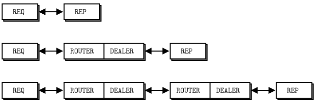

가상 코드에서 프록시는 아래와 같이 동작합니다.

```python
prepare context, frontend and backend sockets
while true:
    poll on both sockets
    if frontend had input:
        read all frames from frontend
        send to backend
    if backend had input:
        read all frames from backend
        send to frontend
```

ROUTER 소켓은 다른 소켓과 달리 모든 연결을 추적하고 호출자에게 이에 대해 알려줍니다. 호출자에게 알리는 방법은 수신된 각 메시지 선두에 연결 식별자(ID)를 붙이는 것입니다. 때때로 주소라고도 할 수 있는 식별자(ID)는 "이것은 연결에 대한 고유한 핸들"이란 의미를 가진 이진 문자열(binary string)입니다. 그래서 ROUTER 소켓을 통해 메시지를 보낼 때 먼저 식별자(ID) 프레임을 보냅니다.

'zmq_socket()' 매뉴얼에서는 이와 같이 설명합니다.

메시지를 수신할 때 ZMQ_ROUTER 소켓은 메시지를 응용프로그램에 전달하기 전에 발신 상대의 식별자(ID)를 포함하는 메시지 부분을 메시지 선두에 추가해야 합니다. 수신된 메시지는 연결된 모든 상대 사이의 공정 대기열에 놓입니다. ZMQ_ROUTER 소켓에서 메시지를 보낼 때 메시지의 첫 번째 부분을 제거하고 이를 사용하여 메시지가 라우팅 될 상대의 식별자(ID)가 되게 합니다.

지난 이야기지만, ØMQ v2.2 이전 버전의 식별자(ID)로 UUID를 사용하였으며, ØMQ 3.0 이후부터는 짧은 정수를 사용하고 있습니다.
이런 변화는 네트워크 성능을 개선하는 영향을 주지만, 다중 프록시 홉(hops)을 사용하는 경우는 영향은 미미한 것입니다.
주목할만한 영향은 libzmq에서 UUID 생성에 필요한 라이브러리에 의존성을 제거한 것입니다.

* UUID(universally unique identifier)은 네트워크 상에서 서로 모르는 개체들을 식별하고 구별하기 위해서는 각각의 고유한 식별자로 32개의 십육진수(4bit)인 128 bits의 수로 표현됩니다(예 : 550e8400-e29b-41d4-a716-446655440000).

식별자들(IDs)은 이해하기 어려운 개념이지만 ØMQ 전문가가 되고 싶다면 필수입니다. ROUTER 소켓은 작동하는 각 연결에 대해 임의의 식별자(ID)를 만듭니다. ROUTER 소켓에 3개의 REQ 소켓이 연결되어 있는 경우 각각의 REQ 소켓에 대해 하나씩 3개의 임의의 ID를 생성합니다.

동작 가능한 예제로 계속하면 REQ 소켓에 3 바이트 식별자(ID) ABC가 있다고 하면 내부적으로 ROUTER 소켓이 ABC를 검색할 수 있는 해쉬 테이블 가지고 REQ 소켓에 대한 TCP 연결을 찾을 수 있게 합니다.

ROUTER 소켓에서 메시지를 받으면 3개의 프레임을 얻습니다.

그림 28 - 주소가 있는 요청(Request with One Address)


프록시 루프의 핵심은 "한 소켓에서 읽고 다른 소켓에 쓰기"이므로, 문자 그대로 3개의 프레임을 DEALER 소켓으로 보냅니다.  네트워크 트래픽을 엿보기한다면 3개의 프레임이 DEALER 소켓에서 REP 소켓으로 이동하는 것을 볼 수 있습니다. REP 소켓은 이전과 마찬가지로 새 응답 주소를 포함하여 전체 봉투를 제거하고 다시 한번 호출자에게 "Hello"를 전달합니다.

부수적으로 REP 소켓은 한 번에 하나의 요청-응답만 처리할 수 있으므로 엄격한 송/수신 주기를 지키지 않고 여러 개의 요청을 읽어 여러 개의 응답을 보내려고 하면 오류가 발생하는 원인입니다.

이제 반환 경로를 시각화할 수 있습니다. `hwserver`가 "World"를 다시 보내면 REP 소켓은 저장한 봉투에 감싸고 네트워크를 통해 DEALER 소켓으로 3개 프레임(ID + empty delimiter + body) 응답 메시지를 보냅니다.

그림 29 - 주소가 있는 응답


DEALER는 3개의 프레임을 읽고 3개의 모든 프레임을 ROUTER 소켓에 전달됩니다.
ROUTER는 첫 번째 메시지 프레임을 읽고 ABC라는 ID에 해당하는 연결을 찾습니다. 연결을 찾으면 나머지 2개 프레임(empty delimiter + body)을 네트워크에 보냅니다.

그림 30 - 최소 응답 봉투(Reply with Minimal Envelope)


REQ 소켓은 전달된 메시지를 받아 첫 번째 프레임이 공백 구분자인지 확인하고 맞으면 REQ 소켓은 공백 구분자 프레임을 버리고 "World"를 호출한  응용프로그램에 전달합니다. 그러면 ØMQ를 시작했을 때의 놀라움으로 응용프로그램에서 "World"가 출력됩니다.

* 송/수신시에 프레임 구성
  - 송신 : APP -["Hello"]-> REQ -[""+"Hello"]-> ROUTER -[ID+""+"Hello"]-> DEALER -[ID+""+"Hello"]-> REP -["Hello"]-> APP
  - 수신 : APP -["World"]-> REP -[ID+""+"World"]-> DEALER -[ID+""+"World"]-> ROUTER -[""+"World"]-> REQ -["World"]-> APP

* 송/수신 시에 프레임 전달에 대한 테스트를 위하여 "test_frame.c"을 작성하였으며 czmq 라이브러리를 사용합니다.
- test_frame.c Hello World 예제 프로그램의 프레임 흐름

* test_frame.java Hello World 예제 프로그램의 프레임 흐름(특수 문자를 HEX로 변경)

```java
//  Multithreaded Hello World server
#include <szmq/szmq.h>
#include <iostream>
#include <chrono>
#include <thread>
#include <boost/format.hpp>
using namespace std;

#define NBR_THREADS 1
static void *
worker_routine (void *arg) {
    //  Socket to talk to dispatcher
    szmq::Context *context = (szmq::Context *) arg; 
    szmq::Socket<ZMQ_REP, szmq::ZMQ_CLIENT> receiver(*context);
    receiver.connect(szmq::SocketUrl("inproc://workers"));
    while (1) {
        while (1) {
            //  Process all parts of the message
            auto msg = receiver.recvOne();
            cout << boost::format("[DEALER->REP][%1%] %2% \n") % msg.size() % szmq::strhex(msg.read<std::string>());   
            if(!receiver.hasMore())
                break;
        }
        //  Do some 'work'
        std::this_thread::sleep_for(std::chrono::milliseconds(1000));    //  Do some 'work'
        //  Send reply back to client
        receiver.sendOne(szmq::Message::from("World"));
    }
    receiver.close();
    return NULL;
}

static void *
client_routine (void *arg) {
    //  Socket to talk to dispatcher   
    szmq::Context *context = (szmq::Context *) arg; 
    szmq::Socket<ZMQ_REQ, szmq::ZMQ_CLIENT> sender(*context);
    sender.connect(szmq::SocketUrl("inproc://clients"));
    while (1) {        
        //  Send request to worker
        sender.sendOne(szmq::Message::from("Hello"));
        while (1) {
            //  Process all parts of the message
            auto msg = sender.recvOne();
            cout << boost::format("[ROUTER->REQ][%1%] %2% \n") % msg.size() % szmq::strhex(msg.read<std::string>());   
            if(!sender.hasMore())
                break;
        }
    }
    sender.close();
    return NULL;
}

int main (void)
{
    szmq::Context context;
    //  Socket to talk to clients
    szmq::Socket<ZMQ_ROUTER, szmq::ZMQ_SERVER> frontend(context);    
    frontend.bind(szmq::SocketUrl("inproc://clients"));
    //  Socket to talk to workers
    szmq::Socket<ZMQ_DEALER, szmq::ZMQ_SERVER> backend(context);
    backend.bind(szmq::SocketUrl("inproc://workers"));

    int thread_nbr;
    //  Launch pool of client threads
    for (thread_nbr = 0; thread_nbr < NBR_THREADS; thread_nbr++) {     
        thread client(&client_routine, (void *)&context);   
        client.detach();
    }
   //  Launch pool of worker threads
    for (thread_nbr = 0; thread_nbr < NBR_THREADS; thread_nbr++) {        
        thread worker(&worker_routine, (void *)&context);   
        worker.detach();
    }

    //  Initialize poll set
    std::vector<szmq::PollItem> pollItems = {
		{reinterpret_cast<void*>(*frontend), 0, ZMQ_POLLIN, 0},
        {reinterpret_cast<void*>(*backend), 0, ZMQ_POLLIN, 0}};

    //  Connect work threads to client threads via a queue proxy
    while (1) {        
        szmq::poll(pollItems, 2, -1);
        if (pollItems [0].revents & ZMQ_POLLIN) {
            //  Process all parts of the message
            while (1) {
                //  Process all parts of the message
                auto msg = frontend.recvOne();
                cout << boost::format("[ROUTER->DEALER][%1%] %2% \n") % msg.size() % szmq::strhex(msg.read<std::string>());    
                bool more = frontend.hasMore();
                if(more)
                    backend.sendMore(msg);
                else{
                    backend.sendOne(msg);
                    break;       //  Last message part
                }
            }
        }
        if (pollItems [1].revents & ZMQ_POLLIN) {
            while (1) {
                //  Process all parts of the message
                auto msg = backend.recvOne();
                cout << boost::format("[DEALER->ROUTER][%1%] %2% \n") % msg.size() % szmq::strhex(msg.read<std::string>());    
                bool more = backend.hasMore();
                if(more)
                    frontend.sendMore(msg);
                else{
                    frontend.sendOne(msg);
                    break;       //  Last message part
                }
            } 
        }
    }
    frontend.close();
    backend.close();
    return 0;
}
```

* 빌드 및 테스트

~~~{.bash}
PS D:\work\sook\src\szmq\examples> cl -EHsc test_frame.java szmq.lib
PS D:\work\sook\src\szmq\examples> ./test_frame
[ROUTER->DEALER][5] 0080000029         --> ID
[ROUTER->DEALER][0]                    --> 공백 구분자
[ROUTER->DEALER][5] Hello              --> 데이터
[DEALER->REP][5] Hello
[DEALER->ROUTER][5] 0080000029         --> ID
[DEALER->ROUTER][0]                    --> 공백 구분자
[DEALER->ROUTER][5] World              --> 데이터
[ROUTER->REQ][5] World
[ROUTER->DEALER][5] 0080000029         --> ID
[ROUTER->DEALER][0]                    --> 공백 구분자
[ROUTER->DEALER][5] Hello              --> 데이터
[DEALER->REP][5] Hello                 --> 데이터
...
~~~

### 이것이 좋은 이유는?

솔직하게 엄격한 요청-응답 또는 확장된 요청-응답을 사용하는 경우는 다소 제한적입니다. 첫째, 오류가 있는 응용프로그램 코드로 인한 서버 실패와 같은 일반적인 오류로부터 쉽게 복구할 수 있는 방법이 없습니다. "4장-신뢰할 수 있는 요청-응답 패턴"에서 자세히 다루겠습니다. 하지만 4개의 소켓(REQ-ROUTER-DEALER-REP)이 봉투를 처리하는 방식과 서로 대화하는 방식을 파악하면 매우 유용한 작업을 수행할 수 있습니다. ROUTER가 응답 봉투를 사용하여 응답을 다시 라우팅 할 클라이언트 REQ 소켓을 결정하는 것을 보았습니다. 이제 다른 방식으로 표현해 보겠습니다.

* ROUTER가 메시지를 줄 때마다, ROUTER는 식별자(ID)로 어떤 상대로부터 왔는지 알려줍니다.
* 응용프로그램에서 해쉬 테이블로 식별자(ID)를 관리하여 도착된 새로운 상대를 추적할 수 있습니다.
* 메시지의 첫 번째 프레임으로 식별자(ID)를 접두사로 지정하면, ROUTER는 연결된 모든 상대에 비동기로 메시지들을 라우팅합니다.

ROUTER 소켓은 전체 봉투를 관여하지 않으며 공백 구분자에 대해서도 모릅니다. ROUTER 소켓이 관심을 갖는 것은 식별자(ID) 프레임으로 메시지를 보낼 연결(connection)을 아는 것입니다.

### 요청-응답 소켓 정리

정리하면 다음과 같습니다.

* REQ 소켓은 메시지 데이터 앞에 공백 구분자 프레임을 넣어 네트워크로 보냅니다. REQ 소켓은 동기식으로 REQ 소켓은 항상 하나의 요청을 보내고 하나의 응답을 기다립니다. REQ 소켓은 한 번에 하나의 상대와 통신합니다. REQ 소켓을 여러 상대에 연결하려면, 요청들은 한 번에 하나씩 각 상대에 분산되고 응답이 예상됩니다.
* REP 소켓은 모든 식별자(ID) 프레임과 공백 구분자를 읽고 저장한 다음 프레임을 호출자에게 전달합니다. REP 소켓은 동기식이며 한 번에 하나의 상대와 통신합니다. REP 소켓을 여러 개의 단말들에 연결하면 요청들은 상대로부터 공정한 형태로 읽히고, 응답은 항상 마지막 요청을 한 동일한 상대로 전송됩니다.
* DEALER 소켓은 응답 봉투를 인식하지 못하며 응답 봉투를 멀티파트 메시지처럼 처리합니다. DEALER 소켓은 비동기식이며 PUSH와 PULL이 결합된 것과 같으며 모든 연결 간에 보내진 메시지(ROUTER->DEALER)를 배포하고 모든 연결에서 받은 메시지(REP->DEALER)를 순서대로 공정 대기열에 보관합니다.
* ROUTER 소켓은 DEALER처럼 응답 봉투를 인식하지 못합니다. ROUTER는 연결에 대한 식별자(ID)를 만들고 수신된 메시지의 첫 번째 프레임으로 생성한 식별자(ID)를 호출자에게 전달합니다. 반대로 호출자가 메시지를 보낼 때 첫 번째 메시지 프레임을 식별자(ID)로 사용하여 보낼 연결을 찾습니다. ROUTER는 비동기로 동작합니다.

## 요청-응답 조합

각각 특정 동작을 하는 4개의 요청-응답 소켓들(REQ, ROUTER, DELEAER, REP)이 있으며 그들이 단순하고 확장된 요청-응답 패턴들(request-reply patterns)로 연결되는 방법을 보았습니다. 이러한 소켓은 많은 문제를 해결하기 위해 사용될 수 있는 구성요소로 사용될 것입니다.

규정된 조합은 다음과 같습니다.

* REQ에서 REP
* DEALER에서 REP
* REQ에서 ROUTER
* DEALER에서 ROUTER
* DEALER에서 DEALER
* ROUTER에서 ROUTER


다음 조합은 유효하지 않습니다(이유를 설명하겠습니다).

* REQ에서 REQ
* REQ에서 DEALER
* REP에서 REP
* REP에서 ROUTER

의미를 상기하기 위한 몇 가지 팁들입니다. DEALER는 비동기 REQ 소켓과 같고 ROUTER는 비동기 REP 소켓과 같습니다. REQ 소켓을 사용하는 경우 DEALER를 사용할 수 있으며 봉투에 직접 읽고 쓸 수 있어야 합니다. REP 소켓을 사용하는 곳에 ROUTER를 사용할 수 있으며 식별자(ID) 프레임을 직접 관리해야 합니다.

REQ 및 DEALER 소켓을 "클라이언트"로, REP 및 ROUTER 소켓을 "서버"로 생각하십시오. 대부분 REP 및 ROUTER 소켓을 서버처럼 바인딩하고 REQ 및 DEALER 소켓을 클라이언트처럼 연결하려고 합니다. 항상 이렇게 간단하지는 않지만 시작하기에 깨끗하고 기억에 남을 것입니다.

### REQ와 REP 조합

이미 REP 서버와 통신하는 REQ 클라이언트를 다루었지만 한 가지 측면을 살펴보겠습니다. REQ 클라이언트는 메시지 흐름을 시작해야 하며 REP 서버는 처음에 요청을 하지 않은 REQ 클라이언트와 통신할 수 없습니다. 기술적으로도 불가능하며, REP 서버에서 API 호출을 시도하면 EFSM 오류도 반환합니다.

### DEALER와 REP 조합

이제 DEALER로 REQ 클라이언트를 바꾸며 여러 REP 서버들과 통신할 수 있는 비동기 클라이언트(asynchronous client)로 제공할 수 있습니다. DEALER를 사용하여 "Hello World" 클라이언트를 다시 작성하면 응답을 기다리지 않고 "Hello"요청을 얼마든지 보낼 수 있습니다.

DEALER를 사용하여 REP 소켓과 통신할 때, REQ 소켓이 보낸 봉투(empty delimiter + body)를 정확하게 모방하며 그렇지 않으면 REP 소켓이 잘못된 메시지로 버립니다. 따라서 메시지를 보내려면 :

* MORE 플래그가 설정된 빈 메시지 프레임을 보내고
* 메시지 본문을 보냅니다.

그리고 REP 소켓에서 메시지를 받으면

* 첫 번째 프레임을 받고 비어 있지 않으면 전체 메시지를 버립니다.
* 다음 프레임을 수신하고 응용프로그램에 전달합니다.

### REQ와 ROUTER 조합

REQ를 DEALER로 대체하는 것과 같이 REP를 ROUTER로 대체할 수 있습니다. 여러 REQ 클라이언트와 동시에 통신할 수 있는 비동기 서버를 제공합니다. ROUTER를 사용하여 "Hello World" 서버를 다시 작성하면 여러 "Hello" 요청을 병렬로 처리할 수 있습니다. 이것을 "2장-소켓 및 패턴"에서 mtserver 예제를 보았습니다.

* mtserver 예제는 여러 개(예 : 10개)의 hwclient 요청을 ROUTER 소켓(asynchronous server)에서 받아 프록시(zmq_proxy())로 DEALER 소켓으로 전달하면 5개의 worker 스레드들이 받아 응답하는 형태입니다.

* mtserver 예제에서는 worker에 대하여서만 스레드 구성하였으나, 다음 예제에서는 client도 스레드로 구성하여 테스트하였습니다.

* mtserver_client.java : 다중 서버와 클라이언트 스레드를 통한 테스트

```java
//  Multithreaded Hello World server

#include <szmq/szmq.h>
#include <iostream>
#include <chrono>
#include <thread>
using namespace std;

static void *
client_routine (void *arg) {
    //  Socket to talk to dispatcher   
    szmq::Context *context = (szmq::Context *) arg; 
    szmq::Socket<ZMQ_REQ, szmq::ZMQ_CLIENT> sender(*context);
    sender.connect(szmq::SocketUrl("inproc://clients"));
    while (1) {        
        //  Send request to worker
        sender.sendOne(szmq::Message::from("Hello"));
        //  Process all parts of the message
        auto buffer = sender.recvOne();
        cout << "received reply: " << buffer.read<std::string>() << endl;
    }
    sender.close();
    return NULL;
}
static void *
worker_routine (void *arg) {
    //  Socket to talk to dispatcher
    szmq::Context *context = (szmq::Context *) arg; 
    szmq::Socket<ZMQ_REP, szmq::ZMQ_CLIENT> receiver(*context);
    receiver.connect(szmq::SocketUrl("inproc://workers"));

    while (1) {
        auto buffer = receiver.recvOne();
        cout << "received request: " << buffer.read<std::string>() << endl;
        std::this_thread::sleep_for(std::chrono::milliseconds(1000));      //  Do some 'work'
        receiver.sendOne(szmq::Message::from("World"));
    }
    receiver.close();
    return NULL;
}

int main (void)
{
    szmq::Context context;

    //  Socket to talk to clients
    szmq::Socket<ZMQ_ROUTER, szmq::ZMQ_SERVER> clients(context);   
    clients.bind(szmq::SocketUrl("inproc://clients")); 
    szmq::Socket<ZMQ_DEALER, szmq::ZMQ_SERVER> workers(context);
    workers.bind(szmq::SocketUrl("inproc://workers"));

    //  Launch pool of worker threads
    int thread_nbr;
    for (thread_nbr = 0; thread_nbr < 5; thread_nbr++) {
        thread worker(&worker_routine, (void *)&context);
        worker.detach();
    }
    //  Launch pool of clients threads
    for (thread_nbr = 0; thread_nbr < 5; thread_nbr++) {
        thread client(&client_routine, (void *)&context);
        client.detach();
    }

    //  Connect work threads to client threads via a queue proxy
    szmq::proxy(reinterpret_cast<void*>(*clients), reinterpret_cast<void*>(*workers), NULL);

    //  We never get here, but clean up anyhow
    clients.close();
    workers.close();
    return 0;
}
```
* 빌드 및 테스트

~~~{.bash}
PS D:\work\sook\src\szmq\examples> cl -EHsc  mtserver_client.java szmq.lib

PS D:\work\sook\src\szmq\examples> ./mtserver_client
received request: Hello
received request: Hello
received request: Hello
received request: Hello
received request: Hello
received reply: World
received reply: World
received reply: World
received reply: World
received request: Helloreceived request: Hello
received request: Hello
...
~~~

ROUTER 소켓은 두 가지 사용법이 있습니다.

* 프론트엔드와 백엔드 소켓들 간에 메시지를 전환하는 프록시로 사용
* 응용프로그램이 메시지를 읽고 그에 따라 행동하도록 사용

첫 번째 경우 ROUTER는 단순히 인위적인 식별자(ID) 프레임을 포함한 모든 프레임들을 읽고 맹목적으로 전달합니다. 두 번째 경우 ROUTER는 전송된 응답 봉투의 형식을 알아야 합니다. 다른 상대가 REQ 소켓이므로 ROUTER는 식별자 프레임(ID), 공백 프레임(empty delimiter) 및 데이터 프레임(body)을 가져옵니다.

### DEALER와 ROUTER 조합

이제 REQ와 REP를 DEALER 및 ROUTER로 전환하여 가장 강력한 소켓 조합을 얻을 수 있습니다. DEALER는 ROUTER와 통신합니다. 이것은 비동기 클라이언트들(DEALER)가 비동기 서버들(ROUTER)와 통신하여 양측에서 메시지 형식을 완전히 제어하게 합니다.

DEALER와 ROUTER는 임의의 메시지 형식으로 작업할 수 있기 때문에 안전하게 사용하려면  프로토콜 디자이너가 되어야 합니다. 최소한 REQ/REP 응답 봉투를 모방할지 여부를 결정해야 합니다. 실제로 답장을 보내야 하는지 여부에 따라 다릅니다.

### DEALER와 DEALER 조합

REP를 ROUTER와 교체할 수 있지만, DEALER가 단 하나의 상대와 통신하는 경우 DEALER를 REP로 교체할 수 있습니다.

REP를 DEALER로 교체하면 작업자가 갑자기 전체 비동기식으로 전환되어 원하는 수의 응답을 다시 보낼 수 있습니다. 이에 따른 대가는 응답 봉투를 직접 관리하고 올바르게 처리해야 해야 하며 그렇지 않으면 아무것도 작동하지 않습니다. 나중에 작동되는 예제를 보겠습니다. 지금 당장은 DEALER와 DEALER가 제대로 작동하기에는 까다로운 패턴 중 하나이며 다행히도 우리가 필요로 하는 경우는 드뭅니다.

### ROUTER와 ROUTER 조합

이것은 N 대 N 연결에 완벽하게 들리지만 사용하기 가장 어려운 조합입니다. ØMQ에 익숙해질 때까지 피해야 합니다. "4장-신뢰할 수 있는 요청-응답 패턴"의 프리랜서 패턴에서 한 가지 예제를 보겠으며, "8장 - 분산 컴퓨팅을 위한 프레임워크"에서 P2P(peer-to-peer) 작업을 위한 ROUTER 설계를 대체하는 DEALER 설계를 보겠습니다.

### 잘못된 조합

대부분의 경우 클라이언트를 클라이언트에 연결하거나, 서버를 서버에 연결하는 것은 나쁜 생각이며 동작하지 않습니다. 그러나 일반적으로 모호한 경고를 하기보다는 자세히 설명하겠습니다.

* REQ와 REQ 조합 : 양측은 서로에게 메시지를 보내는 것으로 시작하기를 원하며, 두 상대가 동시에 메시지를 교환하도록 시간을 정한 경우에만 작동합니다. 생각만 해도 머리가 아픕니다.
* REQ와 DEALER 조합 : 이론적으로는 이것을 할 수 있지만, DEALER에 두 번째 REQ를 추가하면 원래 상대에게 답장을 보낼 방법이 없기 때문에 REQ와 DEALER 간의 통신은 중단됩니다. 따라서 REQ 소켓은 혼란스럽고 다른 클라이언트를 위한 메시지를 반환합니다.
* REP와 REP 조합 : 양측은 상대방이 첫 번째 메시지를 보내기를 기다립니다.
* REP와 ROUTER 조합 : ROUTER 소켓은 이론적으로 REP 소켓이 연결되어 있고 해당 연결된 식별자(ID)를 알고 있는 경우 통신을 시작하고 적절한 형식의 요청을 할 수 있지만, 그것은 지저분하고 ROUTER와 DEALER 위에 아무것도 추가하지 않습니다.

ØMQ의 올바른 소켓의 조합에 대해 일반적인 사항은 항상 어느 한쪽이 단말에 바인딩하고 다른 쪽에서는 연결한다는 것입니다.
추가로, 어느 쪽에서 바인딩을 하거나 연결을 해도 상관없지만 자연스러운 패턴을 따라야 합니다.
"확실(정적)한 존재"임이 기대되는 측면이 바인딩을 실시하여 서버, 브로커, 발행자, 수집가가 되며, '희미(동적)한 존재'는 연결을 실시하여 클라이언트나 작업자가 될 것입니다.
이를 기억해두면 더 좋은 ØMQ 아키텍처를 설계하는 데 도움이 됩니다.

## ROUTER 소켓 알아보기

ROUTER 소켓을 좀 더 자세히 보겠습니다. ROUTER가 개별 메시지를 특정 연결들로 라우팅하는 것을 보았습니다. 이러한 연결들을 식별하는 방법과 메시지를 보낼 수 없는 경우 ROUTER 소켓이 수행하는 작업에 대해 자세히 설명하겠습니다.

### 식별자와 주소

ØMQ에서 식별자(ID)의 개념은 ROUTER 소켓이 다른 소켓에 대한 연결을 식별하는 방법입니다. 더 광범위하게, 식별자들(IDs)은 응답 봉투의 주소로 사용됩니다.
대부분의 경우, 식별자(ID)는 로컬에서 ROUTER 소켓에 대한 해쉬 테이블의 색인 키로 사용됩니다.
독자적으로 상대는 물리적인 주소(네트워크의 단말 "tcp : //192.168.55.117 : 5670")와 논리적인 주소(UUID 혹은 이메일 주소, 다른 고유한 키)를 가질 수 있습니다.

ROUTER 소켓을 사용하여 특정 상대와 통신하는 응용프로그램은 해쉬 테이블을 구축한 경우 논리 주소를 식별자(ID)로 변환할 수 있습니다. ROUTER 소켓은 상대가 메시지를 보낼 때 연결의 식별자(ID)만 알리기 때문에, 단지 상대에게 메시지로 응답할 수 있을 뿐이지, 자발적으로 상대와 통신할 수 없습니다.

이는 규칙을 뒤집고 상대가 ROUTER에 연결될 때까지 기다리지 않고 ROUTER를 상대에 연결하는 경우에도 마찬가지입니다. 그러나 ROUTER 소켓이 식별자(ID) 대신 논리 주소를 사용하도록 강제할 수 있습니다. `setSockOpt()` 참조 페이지는 소켓 식별자(ID) 설정하는 방법이 설명되어 있으며 다음과 같이 작동합니다.

* ROUTER에 바인딩 혹은 연결하려는 상대 응용프로그램 소켓(DEALER 또는 REQ)에서 대한 옵션 ZMQ_IDENTITY 옵션을 설정합니다.
* 일반적으로 상대는 이미 바인딩된 ROUTER 소켓에 연결합니다. 그러나 ROUTER도 상대에 연결할 수도 있습니다.
* 연결 수행 시, 상대 소켓(REQ 혹은 DEALER)은 ROUTER 소켓에 "연결에 대한 식별자(ID)로 사용하십시오"라고 알려줍니다.
* 상대 소켓(REQ 혹은 DEALER)이 그렇게 하지 않으면, ROUTER는 연결에 대해 일반적인 임의의 식별자(ID)를 생성합니다.
* 이제 ROUTER 소켓은 해당 상대에서 들어오는 모든 메시지에 대하여 접두사 식별자 프레임으로 논리 주소를 응용프로그램에 제공합니다.
* ROUTER는 모든 보내는 메시지에 대하여서도 접두사 식별자 프레임을 논리 주소로 사용됩니다.

* `client.setSockOpt(ZMQ_IDENTITY, "PEER1", 5);`

다음은 ROUTER 소켓에 연결하는 2개의 상대의 간단한 예입니다. 하나는 논리적 주소 "PEER2"를 부과합니다.

* identity.java: 식별자 검사

```java
//  Demonstrate request-reply identities

#include <szmq/szmq.h>
#include <iostream>
using namespace std;

int main (void) 
{
    szmq::Context context;
    szmq::Socket<ZMQ_ROUTER, szmq::ZMQ_SERVER> sink(context);
    sink.bind(szmq::SocketUrl("inproc://example"));

    //  First allow 0MQ to set the identity
    szmq::Socket<ZMQ_REQ, szmq::ZMQ_CLIENT> anonymous(context);
    anonymous.connect(szmq::SocketUrl("inproc://example"));
    anonymous.sendOne(szmq::Message::from("ROUTER uses a generated 5 byte identity"));
    auto msgs = sink.recvMultiple();
    for (auto it = begin (msgs); it != end (msgs); ++it) 
        it->dump();

    //  Then set the identity ourselves
    szmq::Socket<ZMQ_REQ, szmq::ZMQ_CLIENT> identified(context);
    identified.setSockOpt(ZMQ_IDENTITY, "PEER2", 5);
    identified.connect(szmq::SocketUrl("inproc://example"));
    identified.sendOne(szmq::Message::from("ROUTER socket uses REQ's socket identity"));
    msgs = sink.recvMultiple();
    for (auto it = begin (msgs); it != end (msgs); ++it) 
        it->dump();

    sink.close();
    anonymous.close();
    identified.close();
    return 0;
}
```

수행 결과는 다음과 같습니다.

* 빌드 및 테스트

~~~{.bash}
PS D:\work\sook\src\szmq\examples> cl -EHsc -MTd identity.java szmq.lib

PS D:\work\sook\src\szmq\examples> ./identity
[005]0080000029
[000]
[027]ROUTER uses a generated 5 byte identity
[005]PEER2
[000]
[028]ROUTER socket uses REQ's socket identity
~~~

* `szmq::Message::dump()`는 소켓에서 수신된 메시지의 내용을 멀티파트 메시지로 모두 출력하는 함수입니다.

### ROUTER 오류 처리

ROUTER 소켓은 어디에도 보낼 수 없는 메시지들를 처리하는 다소 무식한 방법을 가지고 있습니다 : 조용히 메시지들을 버리기. 동작하는 코드에서 의미가 있는 태도이지만 디버깅을 어렵게 만듭니다. "첫 번째 프레임으로 식별자(ID) 보내기" 접근은 우리가 학습할 때 종종 실수할 정도로 까다로우며 ROUTER의 바위 같은 침묵은 그다지 건설적이지 않습니다.

ØMQ v3.2부터는 소켓 옵션을 설정하여 오류를 잡을 수 있습니다 : `ZMQ_ROUTER_MANDATORY`. ROUTER 소켓에 설정한 다음 상대(REQ 혹은 DEALER)로 메시지를 전송(send) 시 라우팅할 수 없는 식별자를 만나면 ROUTER 소켓에서 `EHOSTUNREACH` 오류를 알립니다.

## 부하 분산 패턴

이제 몇 가지 코드를 살펴보겠습니다. ROUTER 소켓에 REQ 소켓을 연결 한 다음 DEALER 소켓에 연결하는 방법을 살펴보겠습니다(REQ-ROUTER-DEALER). 2개의 예제는 부하 분산 패턴과 동일한 처리 방법을 따릅니다. 이 패턴은 단순히 응답 채널 역할을 하는 것보다 계획적인 라우팅을 위해 ROUTER 소켓을 사용하는 첫 번째 사례입니다.

부하 분산 패턴은 매우 일반적이며 이 책에서 여러 번 보았습니다. 간단한 라운드 로빈 라우팅(PUSH 및 DEALER 제공하는 것처럼)으로 주요 문제를 해결하였지만 라운드 로빈은 작업의 처리 시간이 고르지 않은 경우 비효율적이 될 수 있습니다.

우체국에 비유하면, 카운터 당 대기열이 하나 있고 우표를 사는 사람(빠르고 간단한 거래)이 있고 새 계정을 여는 사람(매우 느린 거래)이 있다면 우표 구매자가 대기열에 부당하게 기다리는 것을 발견하게 될 것입니다. 우체국에서와 마찬가지로 메시징 아키텍처가 불공평하면 사람들은 짜증을 낼 것입니다.

우체국에 대한 솔루션은 업무 처리 특성에 따라 느린 작업에 하나 또는 두 개의 카운터을 생성하고, 그 외의 작업은 다른 카운터가 선착순으로 클라이언트에게 서비스를 제공하도록 단일 대기열을 만드는 것입니다.

 단순한 접근 방식의 PUSH와 DEALER를 사용하는 한 가지 이유는 순수한 성능 때문입니다. 미국의 주요 공항에 도착하면 이민국에서 사람들이 줄을 서서 기다리는 것을 볼 수 있습니다. 국경 순찰대원은 단일 대기열을 사용하는 대신 각 카운터로 미리 사람들을 보내 대기하게 합니다. 사람들이 미리 50야드를 걷게 하여 승객당 1~2분 시간을 절약 가능한 것은 모든 여권 검사는 거의 같은 시간이 걸리기에 다소 공정합니다. 이것이 PUSH 및 DEALER의 전략입니다. 이동 거리가 줄어들도록 미리 작업 부하를 보냅니다.

이것은 ØMQ에서 되풀이되는 주제입니다 : 세계의 문제는 다양하며 올바른 방법으로 각각 다른 문제를 해결함으로써 이익을 얻을 수 있습니다. 공항은 우체국이 아니며 문제의 규모가 다릅니다.

브로커(ROUTER)에 연결된 작업자(DEALER 또는 REQ) 시나리오로 돌아가 보겠습니다. 브로커는 작업자가 언제 준비되었는지 알고 있어야 하며, 매번 최저사용빈도(LRU) 작업자를 선택할 수 있도록 작업자 목록을 유지해야 합니다.

* LRU(least recently used)는 최저사용빈도의 의미로 오랫동안 사용되지 않은 대상을 선택하는 알고리즘입니다.

솔루션은 실제로 간단합니다. 작업자가 시작할 때와 각 작업을 완료한 후에 "ready" 메시지를 보냅니다. 브로커는 이러한 메시지를 하나씩 읽습니다. 메시지를 읽을 때마다 마지막으로 사용한 작업자가 보낸 것입니다. 그리고 우리는 ROUTER 소켓을 사용하기 때문에 작업자에게 작업을 회신할 수 있는 ID가 있습니다.

작업에 대한 결과는 응답이 보내지고, 새로운 작업 요청에 따라 작업에 대한 응답은 보내지기 때문에 요청-응답에 대한 응용입니다. 이들을 이해하기 위하여 예제 코드로 구현하겠습니다.

### ROUTER 브로커와 REQ 작업자

일련의 REQ 작업자들과 통신하는 ROUTER 브로커를 사용하는 부하 분산 패턴의 예입니다.

* rtreq.java: ROUTER 브로커와 REQ 작업자

```java
// 2020-10-16T09:56+08:00
//  ROUTER-to-REQ example

#include <szmq/szmq.h>
#include <iostream>
#include <chrono>
#include <cstdlib>
#include <thread>
#include <boost/format.hpp>
using namespace std;

#define NBR_WORKERS 10

static void *
worker_task(void *ctx, void *args)
{
    szmq::Context *context = (szmq::Context *) ctx; 
    szmq::Socket<ZMQ_REQ, szmq::ZMQ_CLIENT> worker(*context);

#ifdef _WIN32
    worker.setId((intptr_t)args);
#else
    worker.setId();          //  Set a printable identity.
#endif
    worker.connect(szmq::SocketUrl("inproc://workers"));

    int total = 0;
    while (1) {
        //  Tell the broker we're ready for work
        worker.sendOne(szmq::Message::from("Hi Boss"));

        //  Get workload from broker, until finished
        auto workload = worker.recvOne().read<std::string>();
        int finished = (workload.compare("Fired!") == 0);

        if (finished) {
            cout << boost::format("[%1%] Completed: %2% tasks\n") %(intptr_t)args % total; 
            break;
        }
        total++;

        //  Do some random work
        this_thread::sleep_for(chrono::milliseconds(std::rand() % 500 + 1)); 
    }
    worker.close();
    return NULL;
}

//  .split main task
//  While this example runs in a single process, that is only to make
//  it easier to start and stop the example. Each thread has its own
//  context and conceptually acts as a separate process.

int main(void)
{
    szmq::Context context;
    szmq::Socket<ZMQ_ROUTER, szmq::ZMQ_SERVER> broker(context); 
    broker.bind(szmq::SocketUrl("inproc://workers"));
    
    std::srand (static_cast<unsigned int>(std::time(0)));

    int worker_nbr;
    for (worker_nbr = 0; worker_nbr < NBR_WORKERS; worker_nbr++) {
        thread worker(&worker_task, (void *)&context, (void *)(intptr_t)worker_nbr);
        worker.detach();
    }
    //  Run for five seconds and then tell workers to end
    chrono::steady_clock::time_point begin = chrono::steady_clock::now();
    int workers_fired = 0;
    while (1) {
        //  Next message gives us least recently used worker
        auto identity = broker.recvOne().read<std::string>();
        broker.sendMore(szmq::Message::from(std::string(identity)));
        broker.recvOne();     //  Envelope delimiter
        broker.recvOne();     //  Response from worker
        broker.sendMore(szmq::Message::from(std::string("")));

        //  Encourage workers until it's time to fire them
        chrono::steady_clock::time_point end = chrono::steady_clock::now();
        auto duration = chrono::duration_cast<chrono::milliseconds>(end - begin).count();
        if (duration < 5000)
            broker.sendOne(szmq::Message::from(std::string("Work harder")));
        else {
            broker.sendOne(szmq::Message::from(std::string("Fired!")));
            if (++workers_fired == NBR_WORKERS)
                break;
        }
    }
    this_thread::sleep_for(chrono::milliseconds(1000)); 
    broker.close();
    return 0;
}
```

예제는 5초 동안 실행된 다음 각 작업자가 처리한 작업의 개수를 출력합니다. ROUTER 소켓을 통한 부하 분산으로 REQ 요청을 처리하면 작업의 공정한 분배를 기대할 수 있습니다.

* 빌드 및 테스트
1. 원도우 환경의 경우

~~~{.bash}
PS D:\work\sook\src\szmq\examples> cl -EHsc -MTd rtreq.java szmq.lib
PS D:\work\sook\src\szmq\examples> ./rtreq
[1] Completed: 17 tasks
[0] Completed: 17 tasks
[4] Completed: 17 tasks
[3] Completed: 17 tasks
[2] Completed: 17 tasks
[8] Completed: 17 tasks
[5] Completed: 17 tasks
[6] Completed: 17 tasks
[9] Completed: 17 tasks
[7] Completed: 17 tasks
~~~

2. 리눅스 환경의 경우

~~~{.bash}
zedo@sook:/work/sook/src/szmq/examples$ g++ -o rtreq rtreq.java  -lsook-szmq -lzmq  -lpthread
zedo@sook:/work/sook/src/szmq/examples$ ./rtreq
[5] Completed: 22 tasks
[4] Completed: 22 tasks
[9] Completed: 18 tasks
[2] Completed: 19 tasks
[6] Completed: 17 tasks
[7] Completed: 19 tasks
[1] Completed: 22 tasks
[3] Completed: 24 tasks
[8] Completed: 21 tasks
[0] Completed: 23 tasks
~~~

예제에서 작업자와 통신하기 위하여 식별자(ID)와 공백 구분자 프레임으로 REQ-적합한 봉투를 생성해야 했습니다.

그림 31 - REQ에 대한 라우팅 봉투(Routing Envelope for REQ)


* mtserver_client 예제에서는 REQ 클라이언트 스레드들과 REP 작업자 스레드들과 ROUTER-DEALER 간에 `szmq::proxy()`을 통해 그대로 전달하여, 식별자(ID) 및 공백 구분자 프레임 없이 데이터만으로 통신이 가능했습니다.
위의 예제는 ROUTER 소켓에서 받은 데이터를 직접 다루기 때문에 3개의 프레임들(ID + empty delimiter + body) 처리가 필요합니다.

### ROUTER 브로커와 DEALER 작업자

어디서든 REQ를 사용할 수 있는 곳이면 DEALER를 사용할 수 있습니다. 2개의 구체적인 차이점이 있습니다 :

* REQ 소켓은 모든 데이터 프레임 앞에 공백 구분자 프레임을 보냅니다. DEALER는 그렇지 않습니다.
* REQ 소켓은 응답을 받기 전에 하나의 요청 메시지만 보냅니다. DEALER는 완전히 비동기적입니다.

동기와 비동기 동작은 엄격한 요청-응답을 수행하기 때문에 예제에 영향을 미치지 않습니다. 이는 "4장-신뢰할 수 있는 요청-응답 패턴"에서 다루며 오류 복구를 처리할 때 더 관련이 있습니다.

이제 똑같은 예제지만 REQ 소켓이 DEALER 소켓으로 대체되었습니다.

* rtdealer.java: ROUTER에서 DEALER

```java
// 2020-10-16T09:56+08:00
//  ROUTER-to-DEALER  example

#include <szmq/szmq.h>
#include <iostream>
#include <chrono>
#include <cstdlib>
#include <thread>
#include <boost/format.hpp>
using namespace std;

#define NBR_WORKERS 10

static void *
worker_task(void *ctx, void *args)
{
    szmq::Context *context = (szmq::Context *) ctx; 
    szmq::Socket<ZMQ_DEALER, szmq::ZMQ_CLIENT> worker(*context);

#ifdef _WIN32
    worker.setId((intptr_t)args);
#else
    worker.setId();          //  Set a printable identity.
#endif
    worker.connect(szmq::SocketUrl("inproc://workers"));
    int total = 0;
    while (1) {
        //  Tell the broker we're ready for work
        worker.sendMore(szmq::Message::from(""));
        worker.sendOne(szmq::Message::from("Hi Boss"));
        //  Get workload from broker, until finished
        worker.recvOne();   //  Envelope delimiter
        auto workload = worker.recvOne().read<std::string>();
        int finished = (workload.compare("Fired!") == 0);
        if (finished) {
            cout << boost::format("[%1%] Completed: %2% tasks\n") %(intptr_t)args % total; 
            break;
        }
        total++;
        //  Do some random work
        this_thread::sleep_for(chrono::milliseconds(std::rand() % 500 + 1)); 
    }
    worker.close();
    return NULL;
}

//  .split main task
//  While this example runs in a single process, that is only to make
//  it easier to start and stop the example. Each thread has its own
//  context and conceptually acts as a separate process.

int main(void)
{
    szmq::Context context;
    szmq::Socket<ZMQ_ROUTER, szmq::ZMQ_SERVER> broker(context); 
    broker.bind(szmq::SocketUrl("inproc://workers"));
    std::srand (static_cast<unsigned int>(std::time(0)));

    int worker_nbr;
    for (worker_nbr = 0; worker_nbr < NBR_WORKERS; worker_nbr++) {
        thread worker(&worker_task, (void *)&context, (void *)(intptr_t)worker_nbr);
        worker.detach();
    }
    //  Run for five seconds and then tell workers to end
    chrono::steady_clock::time_point begin = chrono::steady_clock::now();
    int workers_fired = 0;
    while (1) {
        //  Next message gives us least recently used worker
        auto identity = broker.recvOne().read<std::string>();
        broker.sendMore(szmq::Message::from(std::string(identity)));
        broker.recvOne();     //  Envelope delimiter
        broker.recvOne();     //  Response from worker
        broker.sendMore(szmq::Message::from(std::string("")));

        //  Encourage workers until it's time to fire them
        chrono::steady_clock::time_point end = chrono::steady_clock::now();
        auto duration = chrono::duration_cast<chrono::milliseconds>(end - begin).count();
        if (duration < 5000)
            broker.sendOne(szmq::Message::from(std::string("Work harder")));
        else {
            broker.sendOne(szmq::Message::from(std::string("Fired!")));
            if (++workers_fired == NBR_WORKERS)
                break;
        }
    }
    this_thread::sleep_for(chrono::milliseconds(1000)); 
    broker.close();
    return 0;
}
```

* 빌드 및 테스트

~~~{.bash}
PS D:\work\sook\src\szmq\examples> cl -EHsc -MTd rtdealer.java szmq.lib

PS D:\work\sook\src\szmq\examples> ./rtdealer
[0] Completed: 17 tasks
[3] Completed: 17 tasks
[5] Completed: 17 tasks
[7] Completed: 17 tasks
[6] Completed: 17 tasks
[1] Completed: 17 tasks
[9] Completed: 17 tasks
[8] Completed: 17 tasks
[2] Completed: 17 tasks
[4] Completed: 17 tasks
~~~

* rtreq 예제에서 REQ 소켓을 사용한 작업자에서는 공백 구분자 없이 데이터만 송/수신하였지만, DEALER 사용한 작업자에서는 공백 구분자와 데이터 프레임을 송/수신하였습니다. main() 함수의 소스는 변경이 없지만 작업자 스레드에서 공백 구분자를 송/수신하도록 변경되었습니다.

* DEALER-ROUTER 송/수신시에 프레임 구성은 다음과 같습니다.
  - 송신 : APP-[""+"Hello"]->DEALER-[""+"Hello"]->ROUTER-[ID+""+"Hello"]->APP
  - 수신 : APP-[ID+""+"World"]-ROUTER->[ID+""+"World"]->DEALER-[""+"World"]->APP

작업자가 DEALER 소켓을 사용하고 데이터 프레임 이전에 공백 구분자를 읽고 쓴다는 점을 제외하면 코드는 거의 동일합니다. 이것은 REQ 작업자와의 호환성을 유지하기 위한 접근 방식입니다.

DEALER에서 공백 구분자 프레임을 넣은 이유를 기억하십시오. REP 소켓에서 종료되는 다중도약 네트워크 확장 요청을 허용하여 응답 봉투에서 공백 구분자를 분리하여 데이터 프레임을 응용프로그램에 전달할 수 있습니다.

* 다중도약 네트워크(multihop network)는 고정되어 있거나 이동하는 단말들을 도약해 무선통신 네트워크를 효율적으로 구성하는 기술입니다. 이 기술은 네트워크를 확장하지 않아도 가청 범위를 넓힐 수 있게 합니다.

메시지가 REP 소켓을 경유하지 않는다면 양쪽에 공백 구분자 프레임을 생략할 수 있으며 이렇게 함으로 간단합니다. 이것은 순수한 DEALER와 ROUTER 프로토콜을 이용하고 싶은 경우에 일반적인 설계 방법입니다.

* DEALER-ROUTER 송/수신시에서 공백을 제거할 경우 프레임 구성은 다음과 같습니다.
  - 송신 : APP-["Hello"]->DEALER-["Hello"]->ROUTER-[ID+"Hello"]->APP
  - 수신 : APP-[ID+"World"]-ROUTER->[ID+"World"]->DEALER-[World"]->APP

* rtdealer1.java : DEALER-ROUTER 송/수신에서 공백을 제거

```java
// 2020-10-16T09:56+08:00
//  ROUTER-to-DEALER  example

#include <szmq/szmq.h>
#include <iostream>
#include <chrono>
#include <cstdlib>
#include <thread>
#include <boost/format.hpp>
using namespace std;

#define NBR_WORKERS 10

static void *
worker_task(void *ctx, void *args)
{
    szmq::Context *context = (szmq::Context *) ctx; 
    szmq::Socket<ZMQ_DEALER, szmq::ZMQ_CLIENT> worker(*context);
#ifdef _WIN32
    worker.setId((intptr_t)args);
#else
    worker.setId();          //  Set a printable identity.
#endif
    worker.connect(szmq::SocketUrl("inproc://workers"));
    int total = 0;
    while (1) {
        //  Tell the broker we're ready for work
        worker.sendOne(szmq::Message::from("Hi Boss"));
        //  Get workload from broker, until finished
        auto workload = worker.recvOne().read<std::string>();
        int finished = (workload.compare("Fired!") == 0);
        if (finished) {
            cout << boost::format("[%1%] Completed: %2% tasks\n") %(intptr_t)args % total; 
            break;
        }
        total++;
        //  Do some random work
        this_thread::sleep_for(chrono::milliseconds(std::rand() % 500 + 1)); 
    }
    worker.close();
    return NULL;
}

//  .split main task
//  While this example runs in a single process, that is only to make
//  it easier to start and stop the example. Each thread has its own
//  context and conceptually acts as a separate process.

int main(void)
{
    szmq::Context context;
    szmq::Socket<ZMQ_ROUTER, szmq::ZMQ_SERVER> broker(context); 
    broker.bind(szmq::SocketUrl("inproc://workers"));
    
    std::srand (static_cast<unsigned int>(std::time(0)));

    int worker_nbr;
    for (worker_nbr = 0; worker_nbr < NBR_WORKERS; worker_nbr++) {
        thread worker(&worker_task, (void *)&context, (void *)(intptr_t)worker_nbr);
        worker.detach();
    }
    //  Run for five seconds and then tell workers to end
    chrono::steady_clock::time_point begin = chrono::steady_clock::now();
    int workers_fired = 0;
    while (1) {
        //  Next message gives us least recently used worker
        auto identity = broker.recvOne().read<std::string>();
        broker.sendMore(szmq::Message::from(std::string(identity)));
        broker.recvOne();     //  Response from worker

        //  Encourage workers until it's time to fire them
        chrono::steady_clock::time_point end = chrono::steady_clock::now();
        auto duration = chrono::duration_cast<chrono::milliseconds>(end - begin).count();
        if (duration < 5000)
            broker.sendOne(szmq::Message::from(std::string("Work harder")));
        else {
            broker.sendOne(szmq::Message::from(std::string("Fired!")));
            if (++workers_fired == NBR_WORKERS)
                break;
        }
    }
    this_thread::sleep_for(chrono::milliseconds(1000)); 
    broker.close();
    return 0;
}
```

* 빌드 및 테스트

~~~{.bash}
PS D:\work\sook\src\szmq\examples> cl -EHsc -MTd rtdealer1.java szmq.lib

PS D:\work\sook\src\szmq\examples> ./rtdealer1
[0] Completed: 17 tasks
[9] Completed: 17 tasks
[2] Completed: 17 tasks
[8] Completed: 17 tasks
[5] Completed: 17 tasks
[3] Completed: 17 tasks
[6] Completed: 17 tasks
[4] Completed: 17 tasks
[7] Completed: 17 tasks
[1] Completed: 17 tasks
~~~

### 부하 분산 메시지 브로커

이전 예제까지 절반 정도 완성되었습니다. 일련의 작업자들을 더미 요청 및 응답으로 관리할 수 있지만 클라이언트와 통신할 방법은 없습니다. 클라이언트 요청을 수락하는 두 번째 프론트엔드 ROUTER 소켓을 추가하고 이전 예제를 프론트엔드에서 백엔드로 메시지를 전환할 수 있는 프록시로 바꾸면, 유용하고 재사용 가능한 작은 부하 분산 메시지 브로커을 가지게 됩니다.

그림 32 - 부하 분산 브로커(Load Balancing Broker)

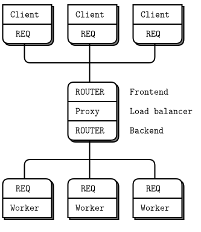

;This broker does the following:

이 브로커는 다음과 같은 작업을 수행합니다.

* 일련의 클라이언트들로부터의 연결을 받습니다.
* 일련의 작업자들로부터의 연결을 받습니다.
* 클라이언트의 요청을 받고 단일 대기열에 보관합니다.
* 부하 분산 패턴을 사용하여 이러한 요청들을 작업자에게 보냅니다.
* 작업자들로부터 응답을 받습니다.
* 이러한 응답을 원래 요청한 클라이언트로 다시 보냅니다.

브로커 코드는 상당히 길지만 이해할 가치가 있습니다.

* lbbroker.java: 부하 분산 브로커

```java
//  Load-balancing broker
//  Clients and workers are shown here in-process

#include <szmq/szmq.h>
#include <iostream>
#include <chrono>
#include <cstdlib>
#include <thread>
#include <queue>
#include <boost/format.hpp>
using namespace std;

#define NBR_CLIENTS 10
#define NBR_WORKERS 3
//  Basic request-reply client using REQ socket
//  Because s_send and s_recv can't handle 0MQ binary identities, we
//  set a printable text identity to allow routing.
//
static void *
client_task(void *args)
{
    szmq::Context context; 
    szmq::Socket<ZMQ_REQ, szmq::ZMQ_CLIENT> client(context);
#ifdef _WIN32
    client.setId((intptr_t)args);
#else
    client.setId();          //  Set a printable identity.
#endif
    client.connect(szmq::SocketUrl("tcp://localhost:5672"));
    client.sendOne(szmq::Message::from("HELLO"));
    auto reply = client.recvOne().read<std::string>();
    cout << boost::format("[%1%] Client: %2% \n") %(intptr_t)args % reply;
    client.close();
    return NULL;
}


//  .split worker task
//  While this example runs in a single process, that is just to make
//  it easier to start and stop the example. Each thread has its own
//  context and conceptually acts as a separate process.
//  This is the worker task, using a REQ socket to do load-balancing.
//  Because s_send and s_recv can't handle 0MQ binary identities, we
//  set a printable text identity to allow routing.

static void *
worker_task(void *args)
{
    szmq::Context context;
    szmq::Socket<ZMQ_REQ, szmq::ZMQ_CLIENT> worker(context);
#ifdef _WIN32
    worker.setId((intptr_t)args);
#else
    worker.setId();          //  Set a printable identity.
#endif
    worker.connect(szmq::SocketUrl("tcp://localhost:5673"));
    //  Tell broker we're ready for work
    worker.sendOne(szmq::Message::from("READY"));
    while (1) {     
        //  Read and save all frames until we get an empty frame
        //  In this example there is only 1, but there could be more
        auto client_id = worker.recvOne();
        {
            auto empty = worker.recvOne();
        }
        //  Get request, send reply
        auto request = worker.recvOne().read<std::string>();
        cout << boost::format("[%1%] Worker: %2% \n") %(intptr_t)args % request;
        auto empty = szmq::Message::from(std::string(""));
        auto reply = szmq::Message::from(std::string("OK"));
        worker.sendMultiple(client_id, empty, reply);
    }
    worker.close();
    return NULL;
}

//  .split main task
//  This is the main task. It starts the clients and workers, and then
//  routes requests between the two layers. Workers signal READY when
//  they start; after that we treat them as ready when they reply with
//  a response back to a client. The load-balancing data structure is 
//  just a queue of next available workers.

int main(void)
{
    //  Prepare our context and sockets
    szmq::Context context;
    szmq::Socket<ZMQ_ROUTER, szmq::ZMQ_SERVER> frontend(context);    
    szmq::Socket<ZMQ_ROUTER, szmq::ZMQ_SERVER> backend(context);
    frontend.bind(szmq::SocketUrl("tcp://*:5672"));
    backend.bind(szmq::SocketUrl("tcp://*:5673"));

    int client_nbr;
    for (client_nbr = 0; client_nbr < NBR_CLIENTS; client_nbr++) {
        thread client(&client_task, (void *)(intptr_t)client_nbr);
        client.detach();
    }
    int worker_nbr;
    for (worker_nbr = 0; worker_nbr < NBR_WORKERS; worker_nbr++) {
        thread worker(&worker_task, (void *)(intptr_t)worker_nbr);
        worker.detach();
    }
    //  Logic of LRU loop
    //  - Poll backend always, frontend only if 1+ worker ready
    //  - If worker replies, queue worker as ready and forward reply
    //    to client if necessary
    //  - If client requests, pop next worker and send request to it
    //
    //  A very simple queue structure with known max size
    std::queue<szmq::Message> worker_queue;
    //  Initialize poll set
    std::vector<szmq::PollItem> pollItems = {
        {reinterpret_cast<void*>(*backend), 0, ZMQ_POLLIN, 0},
        {reinterpret_cast<void*>(*frontend), 0, ZMQ_POLLIN, 0}}; 
    while (1) {
        //  Poll frontend only if we have available workers
        szmq::poll(pollItems, worker_queue.size() ? 2 : 1, -1);
        //  Handle worker activity on backend
        if (pollItems [0].revents & ZMQ_POLLIN) {
            //  Queue worker identity for load-balancing
            auto worker_id = backend.recvOne();
            worker_queue.push(worker_id);
            this_thread::sleep_for(chrono::milliseconds(10));
            //  Second frame is empty
            {
                auto empty = backend.recvOne();
            }
            //  Third frame is READY or else a client reply identity
            auto client_id = backend.recvOne();
              //  If client reply, send rest back to frontend            
            if ((client_id.read<std::string>().compare("READY")) != 0) {                
                {
                    auto empty = backend.recvOne();
                }
                auto reply = backend.recvOne();
                auto empty = szmq::Message::from(std::string(""));
                frontend.sendMultiple(client_id, empty, reply);
                if (--client_nbr == 0)
                    break;      //  Exit after N messages
                    
            }
        }
        //  .split handling a client request
        //  Here is how we handle a client request:
        if (pollItems [1].revents & ZMQ_POLLIN) {
            //  Now get next client request, route to last-used worker
            //  Client request is [identity][empty][request]
            auto client_id = frontend.recvOne();
            {
                auto empty = frontend.recvOne();
            }
            auto request = frontend.recvOne();
            auto worker_id = worker_queue.front(); //worker_queue [0];
            worker_queue.pop();
            auto empty = szmq::Message::from(std::string(""));
            backend.sendMultiple(worker_id, empty, client_id, empty, request);
        }
    }
    frontend.close();
    backend.close();
    return 0;
}
```

* 빌드 및 테스트

~~~{.bash}
PS D:\work\sook\src\szmq\examples> cl -EHsc  lbbroker.java szmq.lib  --> std::thread 사용

PS D:\work\sook\src\szmq\examples> ./lbbroker
[0] Worker: HELLO
[2] Worker: HELLO
[3] Client: OK
[1] Worker: HELLO 
[0] Worker: HELLO
[0] Client: OK
[8] Client: OK
[2] Worker: HELLO
[1] Worker: HELLO
[5] Client: OK
[0] Worker: HELLO
[2] Client: OK
[2] Worker: HELLO
[7] Client: OK
[9] Client: OK
[1] Worker: HELLO
[0] Worker: HELLO
[6] Client: OK
[4] Client: OK
[1] Client: OK
~~~

* 송/수신 시 구조
  - 송신 : APP(client)->REQ->ROUTER(frontend)->ROUTER(backend)->REQ->APP(worker)
  - 수신 : APP(worker)->REQ->ROUTER(backend)->ROUTER(frontend)->REQ->APP(client)

* 송/수신 시에 멀티파트 메시지 구성
  - 송신 : CLIENT -["HELLO"]-> REQ -[""+"HELLO"]-> ROUTER -[CID+""+"HELLO"]-> logic -[WID+""+CID+""+"HELLO"]-> ROUTER -[""+CID+""+"HELLO"]-> REQ -[CID+""+"HELLO"]-> WORKER
  - 수신 : WORKER -[CID+""+"OK"]-> REQ -[""+CID+""+"OK"]-> ROUTER ->[WID+""CID+""+"OK"]-> logic -[CID+""+"OK"]-> ROUTER -[+""+"OK"]-> REQ -["OK"]-> CLIENT

* dequeue 매크로에서 사용된 memmove() 함수는 source가 가리키는 곳부터 num 바이트만큼을 destination이 가리키는 곳으로 옮기는 역할을 수행하며, 큐(queue)의 q(0)에 q(1)부터 정해진 크기(sizeof(q)-sizeof(q[0]))의 데이터가 복사됩니다.

```java
#include <string.h>  // C++ 에서는 <cstring>
void* memmove(void* destination, const void* source, size_t num);
```

* 클라이언트와 작업자 스레드에서 식별자(ID)를 지정하지 않을 경우, ØMQ에서 ROUTER에서 자체 생성하고 바이너리 ID 형태로 `send()`, `recv()`에서 처리할 수 없습니다.

이 프로그램의 어려운 부분은 (a)각 소켓이 읽고 쓰는 봉투들과 (b)부하 분배 알고리즘입니다. 메시지 봉투 형식부터 시작하여 차례로 설명하겠습니다.

클라이언트에서 작업자와 전체 요청-응답 체인을 추적하도록 하겠습니다. 이 코드에서는 메시지 프레임을 더 쉽게 추적할 수 있도록 클라이언트 및 작업자 소켓의 식별자(ID)를 설정합니다. 실제로 ROUTER 소켓이 연결을 위한 식별자들(IDs)를 만들게 하였으며, 클라이언트의 ID는 "CLIENT"라 하고 작업자의 ID는 "WORKER"라고 가정하고 클라이언트 응용프로그램은 단일 프레임의 "Hello"를 보냅니다.

그림 33 - 클라이언트가 보낸 메시지(Message that Client Sends)


REQ 소켓이 공백 구분자 프레임을 추가하고 ROUTER 소켓이 연결 식별자(ID)를 추가하기 때문에 프록시는 프론트엔드 ROUTER 소켓에서 클라이언트 주소(ID), 공백 구분자 프레임(emtpty delimiter), 데이터 부분(body)을 읽습니다.

그림 34 -  프론트엔드가 받는 메시지(Message Coming in on Frontend)


그리고 브로커는 다른 쪽 끝에서 REQ를 유지하기 위해 선택된 작업자 식별자(ID)와 공백 구분자를 클라이언트로부터 전달된 메시지의 앞에 추가하여 작업자에게 전송합니다.

그림 35 - 백엔드로 보내는 메시지(Message Send to Backend)

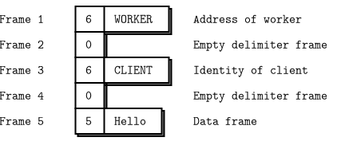

이 복잡한 봉투 스택은 백엔드 ROUTER 소켓에 의해 첫 번째 프레임(Worker ID)을 제거되고 작업자의 REQ 소켓은 공백 구분자을 제거하고 나머지는 작업자 응용 프로그램에 제공합니다.

그림 36 - 작업자에게 전달되는 메시지(Message Delivered to Worker)


작업자는 봉투(빈 메시지 프레임까지 포함하는 모든 부분)를 저장하며 데이터 부분으로 필요한 것을 할 수 있습니다. REP 소켓은 이 작업을 자동으로 수행하지만, REQ-ROUTER 패턴을 사용함으로 적절한 부하 분산을 할 수 있는 것에 주목하시기 바랍니다.

반대 방향으로는 메시지는 들어왔을 때와 동일합니다. 즉, 백엔드 소켓은 브로커에게 다섯 부분으로 메시지(WORKER ID + EMPTY + CLIENT ID + EMPTY + BODY)를 제공하고 브로커는 프론트엔드 소켓에 세 부분으로 메시지(CLIENT ID + EMPTY + BODY)를 보내고 클라이언트는 하나의 데이터 프레임(BODY) 메시지만 받습니다. 

이제 부하 분산 알고리즘을 보겠습니다. 모든 클라이언트와 작업자가 REQ 소켓을 사용하고 작업자가 받은 메시지의 봉투를 올바르게 저장하고 응답해야 합니다. 알고리즘은 다음과 같습니다.

* 항상 백엔드를 폴링하는 zmq_pollitem_t 구조체의 배열을 통해 하나 이상의 작업자가 가용한 경우에만 프론트엔드를 폴링합니다(`szmq::poll(items, available_workers ? 2 : 1, -)`).
* 폴링 제한시간은 설정하지 않습니다.
* 백엔드의 활동은 작업자가 기동하여 "READY" 메시지나 클라이언트에 대한 응답이 있으면 작업자 대기열(`worker_queue[10]`)에 작업자 주소(WORKER_ID)를 저장하고 나머지(CLIENT ID + EMPTY + BODY)가 클라이언트 응답인 경우 프론트엔드를 통해 해당 클라이언트로 다시 전송합니다.
* 프론트엔드의 활동은 클라이언트 요청을 받으면 다음 작업자 식별자(ID, 마지막으로 사용된 작업자)를 가져와(DEQUEUE) 요청을 백엔드로 보냅니다. 이것은 작업자 주소(WORKER_ID), 공백 구분자와 클라이언트의 요청인 3개의 프레임을 전송하는 것을 의미합니다.

이제 작업자가 초기 "READY"메시지에서 제공하는 정보를 기반한 수정안으로 부하 분산 알고리즘을 재사용하고 확장할 수 있음을 알아야 합니다. 예를 들어 작업자는 시작하여 자체 성능 테스트를 수행하여 브로커에게 얼마나 빠른지 알려 줄 수 있습니다. 그러면 브로커는 가장 오래된 작업자가 아닌 가장 처리가 빠른 가용한 작업자를 선택할 수 있습니다.

## ØMQ 고급 API

요청-응답을 패턴에 대한 화제를 벗어나 ØMQ API 자신에 대하여 보도록 하겠습니다. 이러한 우회하는 이유가 있습니다. 우리가 더 복잡한 예제를 작성함에 따라 저수준 ØMQ API가 점점 다루기 힘들기 시작합니다. 

물론 수천 명의 사람들이 동의하고 의존하는 문서화된 공개 규약인 ØMQ API을 변경할 수는 없습니다. 대신에 지금까지의 경험, 특히 복잡한 요청-응답 패턴 작성 경험을 기반으로 상위 수준의 API(higher-level API)를 만들 수 있습니다.

우리가 원하는 것은 회신 주소의 개수에 상관없이 응답 봉투를 포함하여, 전체 메시지를 한방에 송/수신할 수 있는 API이며, 최소한의 코드 작성으로 우리가 원하는 것을 할 수 있어야 합니다.

좋은 메시지 API를 만드는 것은 상당히 어렵습니다. 용어 문제가 있습니다 : ØMQ는 멀티파트 메시지들과 개별 메시지 프레임들에 대하여 "메시지"를 사용합니다.  우리에게는 기대하는 데이터 타입이 다르다는 문제도 있습니다 : 메시지 내용이 출력 가능한 문자열 데이터로, 때로는 이진 블록으로 나올 수도 있으며 기술적인 문제로 거대한 데이터를 복사하지 않고 보낼 수도 있습니다.

좋은 API를 만드는 문제는 모든 개발 언어에 영향을 미칩니다. 이 책에서의 사용 사례는 C 언어입니다. 어떤 개발 언어를 사용하든 언어 바인딩(binding)이 C 바인딩보다 좋게(또는 더 나은) 만들 수 있도록 고민이 필요합니다.

### 고급 API의 특징

고급 API는 3개의 알기 쉬운 개념을 이용합니다 :

* 문자열 도우미(이미 `zhelpers.h`에서 `s_send()`, `s_recv()` 사용) 
* 프레임(메시지 프레임) 및
* 메시지(하나 이상의 프레임 목록)

복잡한 메시지를 읽고 쓰는데 필요한 코드의 양을 줄이는 것은 굉장합니다: 결과는 읽고 이해하기 편해졌습니다. ØMQ 작업의 다른 측면을 고려해서 계속하겠습니다. 지금까지 ØMQ에 대한 경험에 기반한 고급 API의 요구 사항 목록은 다음과 같습니다.

* 이식 가능한 시간. 
 - 시간을 밀리초 단위의 해상도나 수 밀리초 간 대기 설정하는 것은 이식성이 없습니다. 현실적인 ØMQ 응용프로그램은 이식 가능한 시간이 필요하며, 고급 API에서 제공해야 합니다.
* `zmq_poll()`을 대체할 리엑터. 
 - 폴링 루프는 간단하지만 어색합니다. 이것들을 많이 사용하면 동일한 작업을 반복해서 수행합니다 : 타이머를 계산, 소켓이 준비되면 코드를 호출. 소켓 리더와 타이머가 있는 소켓 리엑터로 많은 반복 작업을 줄일 수 있습니다.

### CZMQ 고급 API

요구 사항을 실제 C 언어에 구현하면 ØMQ 언어 바인딩인 CZMQ가 됩니다. 사실이 고급 바인딩(`zhelpers.h`)은 이전 버전의 예제에서도 개발되었습니다. ØMQ로 이식 가능한 계층을 통해 쉬운 사용과 해쉬 테이블 및 목록과 같은 자료 구조를 가진 컨테이너(C 개발언어)도 제공합니다. CZMQ는 또한 우아한 객체 모델 사용하여 멋진 코딩으로 이끌어줍니다.

다음은 ØMQ 고급 API(C의 경우 CZMQ)를 사용하여 재작성된 부하 분산 브로커입니다.

앞의 예제(lbbroker.java)에서는 단일 메세지 전송 형태로 진행했다면, 이번에는 다중 메세지 송/수신을 하도록 수정하였습니다.
czmp의 zlist는 szmq 메세지 객체 처리에 적절하지 않아 std::list를 사용하였으며,  zthread는 더 이상 지원하지 않은 관계로 std::thread를 사용하였습니다.
main()에서 backend를 poll 수행시 시간 지연을 두고 있으며, client_task() 스레드가 정상적인 메세지를 수신하고 main()이 종료하게 합니다.
- zclock_sleep(10);

* lbbroker2.java: sendMultiple(), recvMultiple() 사용한 부하 분산 브로커

```java
//  Load-balancing broker
//  Clients and workers are shown here in-process

#include <szmq/szmq.h>
#include <iostream>
#include <cstdlib>
#include <thread>
#include <czmq.h>
#include <list>
#include <boost/format.hpp>
using namespace std;

#define NBR_CLIENTS 10
#define NBR_WORKERS 3
#define WORKER_READY   "READY"      //  Signals worker is ready

//  Basic request-reply client using REQ socket
static void *
client_task(void *args)
{
    szmq::Context context; 
    szmq::Socket<ZMQ_REQ, szmq::ZMQ_CLIENT> client(context);
    client.setId((intptr_t)args);
    client.connect(szmq::SocketUrl("tcp://localhost:5672"));
    client.sendOne(szmq::Message::from("HELLO"));
    auto reply = client.recv1().read<std::string>();
    cout << "[" << (intptr_t)args << "]" << " Client : " << reply << endl;
    client.close();
    return NULL;
}

// Worker using REQ socket to do load-balancing
static void *
worker_task(void *args)
{
    szmq::Context context;
    szmq::Socket<ZMQ_REQ, szmq::ZMQ_CLIENT> worker(context);
    worker.setId((intptr_t)args);
    worker.connect(szmq::SocketUrl("tcp://localhost:5673"));
    //  Tell broker we're ready for work
    worker.sendOne(szmq::Message::from(WORKER_READY));
    //  Process messages as they arrive(ClientID + "" + "Hello")
    while (1) {     
        //  Read and save all frames until we get an empty frame
        //  In this example there is only 1, but there could be more
        auto msgs = worker.recvN();
        cout << "[" << (intptr_t)args << "]" << " Worker : " << msgs.back().read<std::string>() << endl; //request("HELLO")
		msgs.pop_back();
		msgs.emplace_back(szmq::Message::from(std::string("OK")));
        worker.sendMultiple(msgs);
    }
    worker.close();
    return NULL;
}

//  .split main task
//  This is the main task. It starts the clients and workers, and then
//  routes requests between the two layers. Workers signal READY when
//  they start; after that we treat them as ready when they reply with
//  a response back to a client. The load-balancing data structure is 
//  just a queue of next available workers.

int main(void)
{
    //  Prepare our context and sockets
    szmq::Context context;
    szmq::Socket<ZMQ_ROUTER, szmq::ZMQ_SERVER> frontend(context);    
    szmq::Socket<ZMQ_ROUTER, szmq::ZMQ_SERVER> backend(context);
    frontend.bind(szmq::SocketUrl("tcp://*:5672"));
    backend.bind(szmq::SocketUrl("tcp://*:5673"));

    std::vector < std::thread > threadPool;
    int client_nbr;
    for (client_nbr = 0; client_nbr < NBR_CLIENTS; client_nbr++) {
		thread client(&client_task, (void *)(intptr_t)client_nbr);
        client.detach();
    }
    int worker_nbr;
    for (worker_nbr = 0; worker_nbr < NBR_WORKERS; worker_nbr++) {
        thread worker(&worker_task, (void *)(intptr_t)worker_nbr);
        worker.detach();
    }
    std::list<szmq::Message> workers;
    //  Initialize poll set
    std::vector<szmq::PollItem> items = {
        {reinterpret_cast<void*>(*backend), 0, ZMQ_POLLIN, 0},
        {reinterpret_cast<void*>(*frontend), 0, ZMQ_POLLIN, 0}}; 
    while (1) {
        //  Poll frontend only if we have available workers
        szmq::poll(items, workers.size() ? 2 : 1, -1);
        //  Handle worker activity on backend
        if (items [0].revents & ZMQ_POLLIN) {
            //  Queue worker identity for load-balancing
            auto msgs = backend.recvN();
			auto worker_id = msgs.front();
            workers.emplace_back(worker_id);
			msgs.erase(msgs.begin()); // delete the worker_id
			msgs.erase(msgs.begin()); // delete the empty delimiter	
            //  Third frame is READY or else a client reply identity
            auto client_id = msgs.front();
              //  If client reply, send rest back to frontend            
            if ((client_id.read<std::string>().compare(WORKER_READY)) != 0) {  
                frontend.sendMultiple(msgs);	// clientID + "" + reply
                if (--client_nbr == 0)
                    break;      //  Exit after N messages
                cout << "client_nbr : " << client_nbr << endl; 
            }
            zclock_sleep(10);  // need to sync with workers thread
        }
        //  .split handling a client request
        //  Here is how we handle a client request:
        if (items [1].revents & ZMQ_POLLIN) {
            //  Now get next client request, route to last-used worker
            //  Client request is [identity][empty][request]
            auto msgs = frontend.recvN();
            msgs.insert(msgs.begin(), szmq::Message::from(std::string("")));
			msgs.insert(msgs.begin(), workers.front());			
            workers.pop_front();
            backend.sendMultiple(msgs);  // WorkerID + "" + ClientID + "" + request 
        }
    }
	//  When we're done, clean up properly
	while (!workers.empty()) {
		workers.pop_back();
	}	
    frontend.close();
    backend.close();
    return 0;
}
```

* 빌드 및 테스트 

1. 원도우

~~~{.bash}
PS D:\work\sook\src\szmq\examples> cl -EHsc -MTd lbbroker2.java szmq.lib czmq.lib

PS D:\work\sook\src\szmq\examples> ./lbbroker2
Worker: HELLO
Worker: HELLO
Client : Worker: HELLO
OK
Client : OK
Worker: HELLO
Client : OK
Worker: HELLO
Client : OK
Worker: HELLO
Client : OK
Worker: HELLO
Client : OK
Worker: HELLO
Client : OK
Worker: HELLO
Client : Worker: HELLO
OK
Client : OK
Client : OK
~~~

2. 리눅스(Ubuntu)
~~~{.bash}
zedo@sook:/work/sook/src/szmq/examples$ g++ -o lbbroker2 lbbroker2.java -lsook-szmq -lzmq -lpthread
zedo@sook:/work/sook/src/szmq/examples$ ./lbbroker
[1] Worker: HELLO 
[2] Worker: HELLO 
[0] Client: OK 
[0] Worker: HELLO 
[6] Client: OK 
[1] Worker: HELLO 
[9] Client: OK 
[2] Worker: HELLO 
[7] Client: OK 
[0] Worker: HELLO 
[3] Client: OK 
[1] Worker: HELLO 
[1] Client: OK 
[2] Worker: HELLO 
[0] Worker: HELLO 
[5] Client: OK 
[4] Client: OK 
[1] Worker: HELLO 
[2] Client: OK 
[8] Client: OK 
~~~

이전 예제는 여전히 `szmq:poll()`을 사용합니다. 그렇다면 리엑터는 어떻게 된 것일까요? CZMQ `zloop` 리엑터는 간단하지만 기능적이며 다음의 것을 수행할 수 있습니다.

* 소켓에 처리 함수(`zloop_reader()`)를 설정합니다. 즉, 소켓에 입력이 있을 때마다 호출되는 코드입니다.
* 소켓에서 처리 함수(`zloop_reader()`)를 취소합니다.
* 특정 간격으로 한번 또는 여러 번 꺼지는 타이머를 설정합니다.
* 타이머를 취소합니다.

zloop는 내부적으로 `zmq_poll()`을 사용합니다. 처리 함수(`zloop_reader()`)를 추가하거나 제거할 때마다 폴링 세트를 재구축되고, 다음 타이머와 일치하도록 폴링 제한시간을 계산합니다. 그리고 주의가 필요한 각 소켓 및 타이머에 대한 처리 함수(`zloop_reader()`)와 타이머 함수(`zloop_timer()`)를 호출합니다.

리액터 패턴을 사용하면 기존 코드가 변경되며 루프(`while(true)`)가 제거됩니다.. 주요 논리는 다음과 같습니다.

```java
zloop_t *reactor = zloop_new ();
zloop_reader (reactor, self->backend, s_handle_backend, self);
zloop_start (reactor);
zloop_destroy (&reactor);
```

메시지의 실제 처리는 전용 함수 또는 메서드 내에 있으며(`s_handle_frontend()`, `s_handle_backend()`) 이런 형태로 마음에 들지 않을 수 있습니다 : 그것은 취향의 문제입니다. 이 패턴은 타이머 처리와 소켓의 처리가 섞여 있는 경우에 도움이 됩니다. 이 책의 예제에서 간단한 경우 `zmq_poll()`을 사용하고 복잡한 경우 `zloop`를 사용하겠습니다.

아래 예제는 재작성된 부하 분산 브로커입니다. 이번에는 `zloop`를 사용합니다.

s_backend_handle()과 s_frontend_handle()에 전달되는 구조체는 다음과 같습니다.

```java
typedef struct {
    szmq::detail::SocketImpl& frontend;    //  Listen to clients
    szmq::detail::SocketImpl& backend;     //  Listen to workers
    queue<szmq::Message> *workers;  // List of ready workers
} lbbroker_t;
```

* lbbroker3.c: zloop을 사용한 부하 분산 브로커

```java
//  Load-balancing broker
//  Demonstrates use of the CZMQ API and reactor style
//
//  The client and worker tasks are identical from the previous example.
//  .skip

#include <szmq/szmq.h>
#include <czmq.h>
#include <iostream>
#include <cstdlib>
#include <czmq.h>
#include <thread>
#include <queue>
#include <boost/format.hpp>
using namespace std;

#define NBR_CLIENTS 10
#define NBR_WORKERS 3
#define WORKER_READY   "\001"      //  Signals worker is ready

//  Basic request-reply client using REQ socket
//
static void *
client_task(void *args)
{
    szmq::Context context; 
    szmq::Socket<ZMQ_REQ, szmq::ZMQ_CLIENT> client(context);
    client.connect(szmq::SocketUrl("tcp://localhost:5672"));
    while(true){
        client.sendOne(szmq::Message::from("HELLO"));
        auto reply = client.recvOne().read<std::string>();
        cout << "Client : " << reply << endl;
        zclock_sleep(1000);
    }
    client.close();
    return NULL;
}

//  Worker using REQ socket to do load-balancing
//
static void *
worker_task(void *args)
{
    szmq::Context context;
    szmq::Socket<ZMQ_REQ, szmq::ZMQ_CLIENT> worker(context);
    worker.connect(szmq::SocketUrl("tcp://localhost:5673"));
    //  Tell broker we're ready for work
    worker.sendOne(szmq::Message::from(WORKER_READY));
    //  Process messages as they arrive(ClientID +  "Hello")
    while (true) {     
        auto msgs = worker.recvMultiple();
		cout << "Worker: " << msgs.back().read<std::string>() << endl; //request("HELLO")
		msgs.pop_back();
		msgs.emplace_back(szmq::Message::from(std::string("OK")));
        worker.sendMultiple(msgs);  // ClietID +  "OK"
    }
    worker.close();
    return NULL;
}

//  .until
//  Our load-balancer structure, passed to reactor handlers
typedef struct {
    szmq::detail::SocketImpl& frontend;             //  Listen to clients
    szmq::detail::SocketImpl& backend;              //  Listen to workers
    queue<szmq::Message> *workers;  // List of ready workers
} lbbroker_t;

//  .split reactor design
//  In the reactor design, each time a message arrives on a socket, the
//  reactor passes it to a handler function. We have two handlers; one
//  for the frontend, one for the backend:

//  Handle input from client, on frontend
int s_handle_frontend (zloop_t *loop, szmq::PollItem *poller, void *arg)
{
    lbbroker_t *self = (lbbroker_t *) arg;
    auto msgs = self->frontend.recvMultiple();
    msgs.insert(msgs.begin(), szmq::Message::from(std::string("")));
    msgs.insert(msgs.begin(), self->workers->front());			
    self->workers->pop();
    self->backend.sendMultiple(msgs);  //WorkerID + "" + ClientID + "" + request     
    //  Cancel reader on frontend if we went from 1 to 0 workers
    if (self->workers->size() == 0) {
        szmq::PollItem poller = {reinterpret_cast<void*>(*self->frontend), 0, ZMQ_POLLIN };
        zloop_poller_end (loop, &poller);
    }
    return 0;
}

//  Handle input from worker, on backend
int s_handle_backend (zloop_t *loop, szmq::PollItem *poller, void *arg)
{
    //  Use worker identity for load-balancing
    lbbroker_t *self = (lbbroker_t *) arg;
    auto msgs = self->backend.recvMultiple();
    auto worker_id = msgs.front();    
    self->workers->push(worker_id);
    msgs.erase(msgs.begin()); // delete the worker_id
    msgs.erase(msgs.begin()); // delete the empty delimiter	  
    //  Enable reader on frontend if we went from 0 to 1 workers
    if (self->workers->size() == 1) {
        szmq::PollItem poller = {reinterpret_cast<void*>(*self->frontend), 0, ZMQ_POLLIN};
        zloop_poller (loop, &poller, s_handle_frontend, self);
    }
    auto client_id = msgs.front();
    if ((client_id.read<std::string>().compare(WORKER_READY)) != 0) { 
        self->frontend.sendMultiple(msgs);	// clientID + "" + reply
    }
    return 0;
}

//  .split main task
//  And the main task now sets up child tasks, then starts its reactor.
//  If you press Ctrl-C, the reactor exits and the main task shuts down.
//  Because the reactor is a CZMQ class, this example may not translate
//  into all languages equally well.

int main (void)
{
    szmq::Context context;
    szmq::Socket<ZMQ_ROUTER, szmq::ZMQ_SERVER> backend(context);
    backend.bind(szmq::SocketUrl("tcp://*:5673"));
    szmq::Socket<ZMQ_ROUTER, szmq::ZMQ_SERVER> frontend(context);
    frontend.bind(szmq::SocketUrl("tcp://*:5672"));
    // make lbbroker structure
    lbbroker_t self = {frontend, backend, new queue<szmq::Message>};

    std::vector < std::thread > threadPool;
    int client_nbr;
    for (client_nbr = 0; client_nbr < NBR_CLIENTS; ++client_nbr) {
        threadPool.push_back(std::thread([&]() {
         client_task((void *)(intptr_t)client_nbr); // will connect with inproc://workers
        }));
    }
    int worker_nbr;
    for (worker_nbr = 0; worker_nbr < NBR_WORKERS; ++worker_nbr) {
        threadPool.push_back(std::thread([&]() {
         worker_task((void *)(intptr_t)worker_nbr); // will connect with inproc://workers
        }));
    }
    cout << "threadPool.size() : " << threadPool.size() << endl;

    //  Prepare reactor and fire it up
    zloop_t *reactor = zloop_new ();
    szmq::PollItem poller = {reinterpret_cast<void *>(*backend), 0, ZMQ_POLLIN };
    zloop_poller (reactor, &poller, s_handle_backend, &self);
    zloop_start  (reactor);
    zloop_destroy (&reactor);

    //  When we're done, clean up properly    
    while (self.workers->size()) {
        self.workers->pop();
    }
    frontend.close();
    backend.close();
    delete (self.workers);
    return 0;
}

```


* 빌드 및 테스트

~~~{.bash}
PS D:\work\sook\src\szmq\examples> cl -EHsc -MTd lbbroker3.java szmq.lib czmq.lib
PS D:\work\sook\src\szmq\examples> ./lbbroker3
Worker: HELLO
Worker: HELLO
Client : OK
Worker: HELLO
Client : OK
Worker: HELLO
Worker: HELLO
Client : OK
Worker: HELLO
Client : OK
Client : OK
Worker: HELLO
Client : OK
Worker: HELLO
Worker: HELLO
Client : OK
Client : OK
Client : OK
Worker: HELLO
Client : OK
...
~~~

자식 스레드들을 사용하는 경우, 자식 스레드들은 인터럽트를 받지 못하기 때문에 종료하기 위하여 다음 중 하나를 수행할 수 있습니다.

* 자식 스레드들과 동일한 컨텍스트를 공유(예 : PAIR 소켓)하는 경우 컨텍스트를 파기합니다. 이 경우 대기중인 모든 차단 호출은 ETERM으로 끝납니다.
* 자식 스레드들이 자신의 컨텍스트를 사용하는 경우 종료 메시지를 보냅니다. 이를 위해서는 소켓 간의 연결이 필요합니다.

## 비동기 클라이언트/서버 패턴

ROUTER에서 DEALER 예제에서 하나의 서버가 여러 작업자들과 비동기적으로 통신하는 1 대 N 사용 사례(mtserver와 hwclient(REQ) 사례)를 보았습니다. 역으로 다양한 클라이언트들이 단일 서버와 비동기식으로 통신하고 매우 유용한 N-to-1 아키텍처를 사용할 수 있습니다.

그림 37 - 비동기 클라이언트/서버(Asynchronous Client/Server)

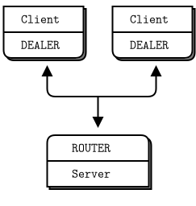

동작 방식은 다음과 같습니다.

* 클라이언트는 서버에 연결하여 요청을 보냅니다.
* 각 요청에 대해 서버는 0개 이상의 응답을 보냅니다.
* 클라이언트는 응답을 기다리지 않고 여러 요청들을 보낼 수 있습니다.
* 서버는 새로운 요청을 기다리지 않고 여러 응답들을 보낼 수 있습니다.

동작 방식에 대한 소스 코드는 다음과 같습니다.

* asyncsrv.java : 비동기 클라이언트(N)/서버(1)

```java
//  Asynchronous client-to-server (DEALER to ROUTER)
//
//  While this example runs in a single process, that is to make
//  it easier to start and stop the example. Each task has its own
//  context and conceptually acts as a separate process.
#include <szmq/szmq.h>
#include <iostream>
#include <czmq.h>
#include <cstdlib>
#include <thread>
using namespace std;

#define NBR_THREADS 3

//  This is our client task
//  It connects to the server, and then sends a request once per second
//  It collects responses as they arrive, and it prints them out. We will
//  run several client tasks in parallel, each with a different random ID.

static void *
client_task (void *args)
{
    szmq::Context context; 
    szmq::Socket<ZMQ_DEALER, szmq::ZMQ_CLIENT> client(context);
#ifdef _WIN32
    client.setId((intptr_t)args);
#else
    client.setId();          //  Set a printable identity.
#endif
    client.connect(szmq::SocketUrl("tcp://localhost:5570"));
    std::vector<szmq::PollItem> pollItems = {
        {reinterpret_cast<void*>(*client), 0, ZMQ_POLLIN, 0}};
    int request_nbr = 0;
    while (true) {
        //  Tick once per second, pulling in arriving messages
        int centitick;
        for (centitick = 0; centitick < 100; centitick++) {
            szmq::poll(pollItems, 1, 10);
            if (pollItems [0].revents & ZMQ_POLLIN) {
                auto msgs = client.recvN();
                cout << "client task id :(" << (intptr_t)args << ") received" << endl;
                for (auto it = begin (msgs); it != end (msgs); ++it) 
                    it->dump();
            }
        }
        char request[20];
        snprintf (request, 20 ,	"request #%d ",++request_nbr);
        client.sendOne(szmq::Message::from(request));
    }
    client.close();
    return NULL;
}

//  .split server task
//  This is our server task.
//  It uses the multithreaded server model to deal requests out to a pool
//  of workers and route replies back to clients. One worker can handle
//  one request at a time but one client can talk to multiple workers at
//  once.

static void * server_worker (void *ctx);

static void *
server_task (void *args)
{
    //  Frontend socket talks to clients over TCP
    szmq::Context context;
    szmq::Socket<ZMQ_ROUTER, szmq::ZMQ_SERVER> frontend(context);      
    frontend.bind(szmq::SocketUrl("tcp://*:5570"));
    szmq::Socket<ZMQ_DEALER, szmq::ZMQ_SERVER> backend(context);
    backend.bind(szmq::SocketUrl("inproc://backend"));

    std::vector <std::thread> threadPool;
    for (int thread_nbr = 0; thread_nbr < 5; ++thread_nbr) {
        threadPool.push_back(std::thread([&]() {
            server_worker((void *)&context); // will connect with inproc://workers
        }));
    }
    //  Connect backend to frontend via a proxy
    szmq::proxy(reinterpret_cast<void*>(*frontend), reinterpret_cast<void*>(*backend), NULL);
    frontend.close();
    backend.close();
    return NULL;
}

//  .split worker task
//  Each worker task works on one request at a time and sends a random number
//  of replies back, with random delays between replies:

static void *
server_worker (void *ctx)
{
    szmq::Context *context = (szmq::Context *)ctx;
    szmq::Socket<ZMQ_DEALER, szmq::ZMQ_CLIENT> worker(*context);
    worker.connect(szmq::SocketUrl("inproc://backend"));

    while (true) {
        //  The DEALER socket gives us the reply envelope and message
        auto msgs = worker.recvN();
        auto identity = msgs.front();
        msgs.erase(msgs.begin());
        auto content = msgs.front();
        msgs.erase(msgs.begin());
        
        //  Send 0..4 replies back
        int reply, replies = std::rand() % 5;
        for (reply = 0; reply < replies; reply++) {
            //  Sleep for some fraction of a second
            zclock_sleep(std::rand() % 1000 + 1);
            worker.sendMultiple(identity, content);
        }
    }
}

//  The main thread simply starts several clients and a server, and then
//  waits for the server to finish.

int main (void)
{
    std::vector <std::thread> threadPool;
    for (int thread_nbr = 0; thread_nbr < NBR_THREADS; ++thread_nbr) {
        threadPool.push_back(std::thread([&]() {
            client_task(((void *)(intptr_t)thread_nbr)); 
        }));
    }
    thread(&server_task, nullptr).detach();
    zclock_sleep(5000); //  Run for 5 seconds then quit
    return 0;
}
```

* 빌드 및 테스트

~~~{.bash}
PS D:\work\sook\src\szmq\examples> cl -EHsc asyncsrv.java szmq.lib czmq.lib

PS D:\work\sook\src\szmq\examples> ./asyncsrv
client task id :(0) received
[010]request #1
client task id :(1) received
[010]request #1
client task id :(2) received
[010]request #1
client task id :(1) received
[010]request #2
client task id :(0) received
[010]request #2
client task id :(2) received
[010]request #2
client task id :(2) received
[010]request #2
client task id :(2) received
[010]request #2
~~~

이 예제는 다중 프로세스 아키텍처를 시뮬레이션하여 멀티스레드를 사용하여 하나의 프로세스에서 실행됩니다. 예제를 실행하면 서버에서 받은 응답을 출력하는 3개의 클라이언트 (각각 임의의 식별자(ID)가 있음)가 표시됩니다. 주의 깊게 살펴보면 각 클라이언트 작업이 요청당 0개 이상의 응답을 받는 것을 볼 수 있습니다.

이 코드에 대한 설명입니다.

* 클라이언트는 초당 한 번씩 요청을 보내고 0개 이상의 응답을받습니다. `szmq::poll()`을 사용하여 작업을 수행하기 위해, 단순히 1초 제한시간으로 폴링할 수 없으며 마지막 응답을 받은 후 1초 후에 새 요청을 보내게 됩니다. 그래서 우리는 높은 빈도(1초당 100회 폴링(1/100초(10밀리초) 간격))로 폴링합니다. 이는 거의 정확합니다.
* 서버는 작업자 스레드 풀(pool)을 사용하여 각 스레드가 하나의 요청을 동기적으로 처리합니다. 클라이언트(DEALER)는 내부 대기열을 사용하여 프론트엔드 소켓(ROUTER)에 연결하고 작업자(DEALER)도 내부 대기열을 사용하여 백엔드 소켓(DEALER)에 연결합니다. `szmq::proxy()` 호출하여 프런트 엔드와 백엔드 소켓 간에 통신하도록 합니다.

그림 38 - 비동기 서버 상세(Detail of Asynchronous Server)

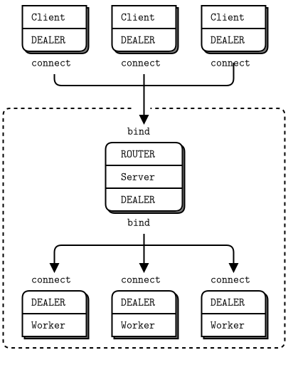

클라이언트와 서버간에 DEALER와 ROUTER 통신을 수행하고 있지만, 서버 메인 스레드와 작업자 스레드들 간에는 내부적으로  DEALER와 DEALER를 수행하고 있습니다. REP 소켓을 사용했듯이 작업자들은 엄격하게 동기식입니다. 하지만 여러 회신을 보내려고 하기 때문에 비동기 소켓이 필요합니다. 회신들을 각 응답에 대하여 직접 라우팅하지 않기 위해서, 항상 요청을 보낸 단일 서버 스레드로 가게 합니다.

라우팅 봉투에 대해 생각해 봅시다. 클라이언트는 단일 프레임으로 구성된 메시지를 보냅니다. 서버 스레드는 2개 프레임 메시지(CLINT ID + DATA)를 받습니다. 2개 프레임을 작업자에게 보내면 일반 응답 봉투로 취급하고 2개 프레임 메시지(CLINT ID + DATA)로 반환합니다. 그러면 작업자는 첫 번째 프레임을 라우팅할 ID(CLIENT ID)로 두 번째 프레임을 클라이언트에 대한 응답으로 사용합니다.

이것은 아래와 같이 보입니다.

```
     client          server       frontend       worker
   [ DEALER ]<---->[ ROUTER <----> DEALER <----> DEALER ]
             1 part         2 parts       2 parts
```

이제 소켓들에 대해 : 부하 분산 ROUTER와 DEALER 패턴을 작업자들 간의 통신에 사용할 수 있었지만 추가 작업이 있습니다. 이 경우 DEALER와 DEALER 패턴은 괜찮겠지만 단점은 각 요청에 대한 지연시간가 짧지만 작업 분산이 평준화되지 않을 위험이 있습니다. 이 경우 단순화시켜 대응합니다.

클라이언트와 통신 상태를 유지하는 서버를 구축할 때 고전적인 문제가 발생합니다. 서버가 클라이언트에 대한 통신 상태를 유지하지만, 클라이언트는 '희미(동적)한 존재(comes and goes)'지만 연결을 유지할 경우 결국 서버 자원은 부족하게 됩니다. 기본 식별자(ID)를 사용하여 동일한 클라이언트들이 계속 연결을 유지하더라도 각 연결은 새로운 연결처럼 보입니다.

위의 예제를 매우 짧은 시간(작업자가 요청을 처리하는 데 걸리는 시간) 동안만 통신 상태를 유지 한 다음 통신 상태를 버리는 방식으로 문제를 해결할 수 있습니다. 그러나 해결안은 많은 경우에 실용적이지 않습니다. 상태 기반 비동기 서버에서 클라이언트 상태를 적절하게 관리하려면 다음의 작업을 수행해야 합니다.

* 일정 시간 간격으로 클라이언트에서 서버로 심박을 보냅니다. 위의 예제에서는 클라이언트에서 1초당 한번 요청을 보냈으며, 심박으로 신뢰할 수 있게 사용할 수 있습니다.
* 클라이언트 식별자(ID)를 키로 사용하여 상태를 저장합니다.
* 클라이언트로부터 중단된 심박을 감지합니다. 클라이언트로부터 일정 시간(예 : 2초) 동안 요청이 없으면 서버는 이를 감지하고 해당 클라이언트에 대해 보유하고 있는 모든 상태를 폐기할 수 있습니다.

## 동작 예제 : 브로커 간 라우팅

지금까지 본 모든 것을 가져와 실제 응용프로그램으로 확장해 보겠습니다. 여러 번의 반복을 거처 단계별로 구축하겠습니다. 우량(VIP) 고객이 긴급하게 전화를 걸어 대규모 클라우드 컴퓨팅 시설의 설계를 요청합니다. 고객의 클라우드에 대한 비전은 많은 데이터 센터에 퍼져 있는 각 클라이언트들과 작업자들이 클러스터를 통해 하나로 동작하는 있습니다. 우리는 실전이 항상 이론을 능가한다는 것을 알만큼 똑똑하기 때문에 ØMQ를 사용하여 동작하는 시뮬레이션을 만들겠습니다. 우리의 고객은 자신의 상사가 마음을 바꾸기 전에 예산을 확정하기 바라며, 트위터에서 ØMQ에 대한 훌륭한 정보를 읽은 것 같습니다.

### 상세한 요구 사항

몇 잔의 에스프레소를 마시고 코드 작성에 뛰어들고 싶지만, 전체적으로 잘못된 문제에 대한 놀라운 해결책을 제공하기 전에, 자세한 사항을 확인하라고 마음속에서 무언가의 속삭임 있습니다. 그래서 고객에서 "클라우드로 어떤 일을 하고 싶으시나요?"라고 묻습니다.

고객의 요구사항은 다음과 같습니다.

* 작업자는 다양한 종류의 하드웨어에서 실행되지만, 어떤 작업도 처리할 수 있어야 합니다. 클러스터당 수백 개의 작업자가 있고 대략 12개의 클러스터가 있습니다.
* 클라이언트는 작업자에게 작업을 요청합니다. 각 작업은 독립적인 작업 단위로 클라이언트는 가용한 작업자를 찾아 가능한 한 빨리 작업을 보내려고 합니다. 많은 클라이언트가 존재하며 임의적으로 왔다 갔다 합니다.
* 클라우드에서 진짜 어려운 것은 클러스터를 언제든지 추가하고 제거할 수 있어야 하는 것입니다. 클러스터는 속해 있는 모든 작업자와 클라이언트들을 함께 즉시 클라우드를 떠나거나 합류할 수 있습니다.
* 자체 클러스터에 작업자가 없는 경우, 클라이언트의 작업은 클라우드에서 가용한 다른 클러스터의 작업자에게 전달됩니다.
* 클라이언트는 한 번에 하나의 작업을 보내 응답을 기다립니다. 제한시간(X초) 내에 응답을 받지 못하면 작업을 다시 전송합니다. 이것은 우리의 고려사항은 아니며 클라이언트 API가 이미 수행하고 있습니다.
* 작업자들은 한 번에 하나의 작업을 처리합니다. 그들은 매우 단순하게 작업을 처리합니다. 작업자들의 수행이 중단되면 그들을 기동한 스크립트에 의해 재시작됩니다.

위에서 설명한 것을 제대로 이해했는지 다시 확인합니다.

* "클러스터들 간에 일종의 초고속 네트워크 상호 연결이 있을 것입니다. 맞습니까?" 고객은 "예, 물론 우리는 바보가 아닙니다."라고 말합니다.
* "통신 규모는 어느 정도입니까?"라고 묻습니다. 고객은 "클러스터 당 최대 1,000개의 클라이언트들, 각 클라이언트는 초당 최대 10 개의 요청을 수행합니다. 요청은 작고 응답도 각각 1KB 이하로 작습니다."라고 응답합니다(20 Mbytes=20,000,000 bytes=1(Cluster) * 1,000(clients) * 10(requests) * 1,000(bytes) * 2(send/recv)).

그러면 고객의 요구 사항에 대하여 약간의 계산을 하고 이것이 일반 TCP상에서 작동할지 확인합니다. 클라이언트들 2,500 개 x 10/초(request) x 1,000바이트(date) x 2방향(send/recv) = 50 MBytes/초 또는 400 Mbit/초, 1Gb 대역폭의 TCP 네트워크에는 문제가 되지 않습니다.

이것은 간단한 문제로 특별한 하드웨어나 통신규약들이 필요하지 않고 다소 영리한 라우팅 알고리즘과 신중한 설계만 필요로 합니다. 먼저 하나의 클러스터(하나의 데이터 센터)를 설계하고 클러스터를 함께 연결하는 방법을 알아보겠습니다.

### 단일 클러스터 아키텍처

작업자들과 클라이언트들은 동기적으로 동작합니다. 부하 분산 패턴을 사용하여 작업들을 작업자들에게 전달하기 원하며 작업자들은 모두 동일한 기능을 수행합니다. 데이터센터에는 작업자는 익명이며 특정 서비스에 대한 개념이 없습니다. 클라이언트들은 직접 주소를 지정하지 않습니다.
재시도(제한시간(X초) 내에 응답을 받지 못하면 클라이언트에서 작업을 다시 전송)가 자동으로 이루어지므로 통신에 대한 보증은 언급하지 않아도 좋을 것입니다.

우리가 이미 보았듯이 클라이언트들과 작업자들은 서로 직접 통신하지 않습니다. 동적으로 노드들을 추가하거나 제거하는 것이 불가능합니다. 따라서 우리의 기본 모델은 이전에 살펴본 요청-응답 메시지 브로커로 구성됩니다.

그림 39 - 클러스터 아키텍처

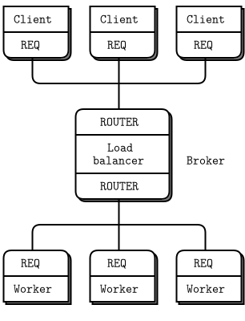

### 다중 클러스터로 확장

이제 하나 이상의 클러스터로 확장합니다. 각 클러스터에는 일련의 클라이언트들 및 작업자들이 있으며 이들을 함께 결합하는 브로커(broker)가 있습니다.

그림 40 -  다중 클러스터

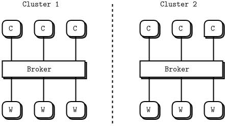

여기서 질문입니다 :  각 클러스터에 속해 있는 클라이언트들이 다른 클러스터의 작업자들과 통신하는 방법은 어떻게 될까요? 여기 몇 가지 방법이 있으며 각각 장단점이 있습니다.

* 클라이언트들은 직접 양쪽 브로커에 연결할 수 있습니다. 장점은 브로커들과 작업자들을 수정할 필요가 없습니다. 그러나 클라이언트들은 더 복잡해지고 전체 토폴로지를 알아야 합니다. 예를 들어 세 번째 또는 네 번째 클러스터를 추가하려는 경우 모든 클라이언트들이 영향을 받습니다. 영향으로 클라이언트의 라우팅 및 장애조치 로직을 변경해야 하며 좋지 않습니다.
* 작업자들은 직접 양쪽 브로커에 연결하려 하려 하지만 REQ 작업자는 하나의 브로커에만 응답할 수 있어 그렇게 할 수 없습니다. REP를 사용하려 하지만 REP는 부하 분산처럼 사용자 지정 가능한 브로커와 작업자 간 라우팅을 제공하지 않고 내장된 부하 분산만 제공하여 잘못된 것입니다. 유휴 작업자에게 작업을 분배하려면 정확하게 부하 분산이 필요합니다. 유일한 해결책은 작업자 노드들에 대해 ROUTER 소켓을 사용하는 것입니다. 이것을 "아이디어# 1"로 명명하겠습니다.
* 브로커들은 상호 간에 연결할 수 있습니다. 가장 적은 추가 연결을 생성하여 가장 깔끔해 보입니다. 동적으로 클러스터를 추가하기 어려지만 설계 범위를 벗어난 것 같습니다. 이제 클라이언트들과 작업자들은 실제 네트워크 토폴로지를 모르게 하고 브로커들 간에는 여유 용량이 있을 때 서로에게 알립니다. 이것을 "아이디어 #2"로 명명하겠습니다.

아이디어 #1을 분석해 보겠습니다. 이 모델에서는 작업자들이 양쪽 브로커들에 연결하고 하나의 브로커에서 작업을 수락합니다.

그림 41 - 아이디어#1 : 교차 연결된 작업자

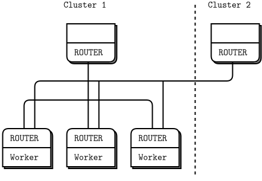

좋은 방법으로 보이지만 우리가 원하는 것을 제공하지 않습니다. 클라이언트들은 가능하면 로컬 작업자들을 얻고 기다리는 것보다 더 나은 경우에만 원격 작업자를 얻습니다. 또한 작업자들은 양쪽 브로커들에게 "준비(READY)"신호를 보내고 다른 작업자는 유휴 상태로 있는 동안 한 번에 두 개의 작업들을 받을 수 있습니다. 이 디자인은 잘못된 것 같으며 원인은 다시 우리가 양쪽 말단에 라우팅 로직 넣어야 하기 때문입니다.

그럼, 아이디어# 2에서 우리는 브로커들을 상호 연결하고 우리가 익숙한 REQ 소켓을 사용하는 클라이언트들과 또는 작업자들을 손대지는 않습니다.

그림 42 - 상호 통신하는 브로커(Broker Talking to Each Other)

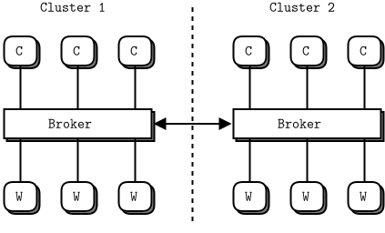

이 디자인은 문제가 한 곳에서 해결되고 나머지 것들은 보이지 않기 때문에 매력적입니다. 기본적으로 브로커들은 서로에게 비밀 채널들을 열고 낙타 상인처럼 속삭입니다. "이봐, 나는 여유가 좀 있는데 클라이언트들이 너무 많을 경우 알려 주시면 우리가 대응하겠습니다."

사실 이것은 더 복잡한 라우팅 알고리즘 일뿐입니다 : 브로커들은 서로를 위해 하청업체가 됩니다. 실제 코드를 작성하기 전에 이와 같은 설계를 좋아할 점들이 있습니다.

* 일반적인 경우(동일한 클러스터의 클라이언트들과 작업자들)를 기본으로 하고 예외적인 경우(클러스터들 간 작업을 섞음)에 대한 추가 작업을 수행합니다.
* 다른 유형의 작업에 대해 다른 메시지 흐름을 사용하게 합니다. 다르게 처리하게 하기 위함으로 예를 들면 서로 다른 유형의 네트워크 연결을 사용합니다.
* 부드럽게 확장할 수 있습니다. 3개 이상의 브로커들간의 상호 연결하는 것은 다소 복잡하게 되지만, 이것이 문제라고 판단되면 하나의 슈퍼 브로커를 추가하여 쉽게 해결할 수 있습니다.

이제 동작하는 예제를 만들겠습니다. 전체 클러스터를 하나의 프로세스로 압축합니다. 분명히 현실적이지는 않지만 시뮬레이션하기에는 단순하게 만들어 시뮬레이션을 정확하게 실제 프로세스들로 확장 할 수 있습니다. 이것이 ØMQ의 아름다움입니다 - 미시 수준에서 설계하고 거시 수준까지 확장 할 수 있습니다. 스레드들은 프로세스들이 된 다음 하드웨어 머신들로 점차 거시적으로 확장 가능 하지만, 패턴들과 논리는 동일하게 유지됩니다. 각 "클러스터" 프로세스들에는 클라이언트 스레드들, 작업자 스레드들 및 브로커 스레드가 포함됩니다.

이제 기본 모델을 잘 알게 되었습니다.

* REQ 클라이언트 스레드들은 작업부하들을 생성하여 브로커(ROUTER)로 전달합니다.
* REQ 작업자 스레드들은 작업부하들을 처리하고 결과들을 브로커(ROUTER)로 반환합니다.
* 브로커는 부하 분산 패턴을 사용하여 작업부하들을 대기열에 넣고 분배합니다.

### 페더레이션 및 상대 연결

브로커들을 상호 연결하는 방법에는 여러 가지가 있습니다. 우리가 원하는 것은 다른 브로커들에게 "우리는 여유 용량이 있어"라고 말한 다음 여러 작업들을 받는 것입니다. 또한 우리는 다른 브로커들에게 "그만, 우리는 여유 용량이 없어"라고 말할 수 있어야 합니다. 완벽할 필요는 없으며, 때로는 즉시 처리할 수 없는 작업들을 받은 다음 가능한 한 빨리 처리합니다.

가장 쉬운 상호 연결은 연합(Federation)이며, 브로커들이 클라이언트들과  작업자들을 서로 시뮬레이션하는 것입니다. 이를 수행하기 위해 클러스터의 백엔드를 다른 브로커의 프론트엔드 소켓에 연결합니다. 한 소켓을 단말에 바인딩하고 다른 단말에 연결이 모두 가능한지 확인하십시오.

그럼 43 - 연합 모델에서 교차 연결된 브로커들

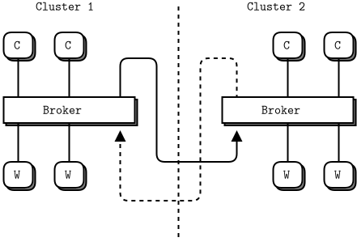

연합은 브로커들과 타당하고 좋은 처리 방식을 가진 단순한 로직을 제공합니다. 클라이언트들이 없을 때 다른 브로커에게 "준비(READY)"라고 알리고 하나의 작업을 받아들입니다. 유일한 문제는 이것이 너무 단순하다는 것입니다. 연합된 브로커는 한 번에 하나의 작업만 처리할 수 있습니다. 브로커가 잠금 단계 클라이언트와 작업자로 하게 되면 정의상 잠금 단계가 되며, 비록 많은 작업자들이 있어도 동시에 사용할 수 없습니다. 우리의 브로커들은 완전히 비동기적으로 연결되어야 합니다.

* 잠근 단계 통신규약(lock-step protocol)은 동기식 요청-응답과 같이 클라이언트가 하나의 요청을 하면, 작업자가 요청을 받아 처리하고 응답할 때까지 대기하는 방식입니다. 특정 작업자들에 대하여 응답이 지연되는 현상이 발생하면 시스템의 자원 활용도 및 성능은 저하됩니다. 해결 방법으로는 요청에 대한 응답 지연 시 제한시간을 두거나, 비동기 요청-응답 처리가 있습니다.

페더레이션 모델은 다른 종류의 라우팅, 특히 부하 분산이나 라운드 로빈보다는 서비스 이름 및 근접성에 따라 라우팅하는 서비스 지향 아키텍처들(SOAs)에 적합합니다. 모든 용도에 적응하는 가능한 것은 아니지만 용도에 따라 사용할 수 있습니다.

연합 대신 상대 연결 방식에서는 브로커들이 서로를 명시적으로 인식하고 제한된 채널들을 통해 통신합니다.  상세히 설명하면 N개의 브로커들이 상호 연결한다고 가정하면, 각 브로커에는 (N-1) 개의 상대가 있으며 모든 브로커들은 정확히 동일한 코드와 로직을 사용합니다. 브로커들 간에는 2개의 고유한 정보 흐름이 있습니다.

* [상태 정보] 각 브로커는 언제든지 가용한 작업자 수를 상대들에게 알려야 합니다. 이것은 매우 간단한 정보로 일정 시간 간격으로 변경되는 수량 정보입니다. 발행-구독이 명백하고(정확한) 소켓 패턴입니다. 따라서 모든 브로커들은 PUB 소켓을 열어 상태 정보를 발행하고 모든 브로커들은 SUB 소켓도 열어 다른 모든 브로커들의 PUB 소켓에 연결하여 상대들의 상태 정보를 받습니다.
* [작업 위임/작업 수신] 각 브로커는 작업을 상대에게 위임하고 비동기적으로 응답들을 받을 수 있는 방법이 필요합니다. ROUTER 소켓을 사용하여 작업을 수행하며 다른 조합은 적용할 수 없습니다. 각 브로커에는 2개의 ROUTER 소켓을 가지고 하나는 작업들 수신용이고 다른 하나는 작업들 위임용입니다. 2개의 소켓을 사용하지 않는다면 매번 요청을 읽었는지 응답을 읽었는지에 알기 위해 더 많은 작업이 필요합니다. 이는 메시지 봉투에 더 많은 정보를 추가하는 것을 의미합니다.

그리고 클러스터에는 브로커와 클라이언트들 및 작업자들 간에 정보 흐름이 있습니다.

### 명명식

2개의 소켓들 x 3개의 흐름들 = 6개의 소켓으로 브로커에서 관리해야 합니다. 다중 소켓으로 다양한 소켓 유형이 섞여 있는 브로커에서 좋은 이름을 선정하는 것은 우리의 마음을 일관성 있게 유지하는 데 중요합니다. 소켓은 그들의 이름을 통해 무엇을 하는지 알 수 있어야 합니다. 몇 주 후에 추운 월요일 아침 커피를 마시기 전에, 코드를 읽으며 고통을 느끼지 않기 위해서입니다.

소켓에 대한 샤머니즘적인 명명식을 하겠습니다. 세 가지 흐름은 다음과 같습니다.

* 샤머니즘(shamanism)은 초자연적인 존재와 직접적으로 소통하는 샤먼을 중심으로 하는 주술이나 종교입니다.

* [local] 브로커와 클라이언트들 및 작업자들 간의 로컬 요청-응답(Workload flow) 흐름.
* [cloud] 브로커와 상대 브로커들 간의 클라우드 요청-응답(Task deligation) 흐름.
* [state] 브로커와 상대 브로커들 간의 상태 흐름(State flow)

길이가 모두 같은 의미 있는 이름을 찾으면 코드가 잘 정렬되며 중요한 사항은 아니지만 세부 사항에 주의 깊게 살피는데 도움이 됩니다. 브로커의 각 흐름에는 2개의 소켓이 있으며 프론트엔드와 백엔드를 호출입니다. 우리는 이 이름들을 자주 사용했습니다. 프론트엔드는 정보 또는 작업들을 받습니다. 백엔드는 이를 다른 상대들로 보냅니다. 개념적 흐름은 앞에서 뒤로 진행됩니다(응답들은 뒤에서 앞으로 반대 방향으로 진행됩니다.).

본 입문서에서는 작성하는 모든 코드에서 다음 소켓 이름들을 사용합니다.

* 「local」 로컬에 작업부하 처리에 사용되는 localfe와 localbe
* 「cloud」 클라우드의 작업 위임/응답 처리에 사용되는 cloudfe와 cloudbe
* 「state」 브로커들간의 상태(작업자의 개수 전달)를 확인하기 위해 사용되는 statefe와 statebe

전송 방식은 ipc를 사용하는 것은 하나의 박스에서 모든 것을 시뮬레이션하기 때문입니다. 이것은 연결 측면에서 tcp처럼 작동한다는 장점이 있으며(즉, inproc과는 달리 연결이 끊어진 전송방식) 어려울 수 있는 IP 주소나 DNS 이름이 필요하지 않습니다. ipc 단말들로 무언가-로컬(something-local), 무언가-클라우드(something-cloud) 및 무언가-상태(something-state)라는 불리는 것을 사용합니다. 여기서 무언가(something)는 시뮬레이션하는 클러스터의 이름입니다.

이것은 일부 이름들에 대한 과분한 작업이라고 생각할 수 있습니다. 왜 그들을 s1, s2, s3, s4 등으로 부르지 않을까요? 대답은 당신의 두뇌가 완벽한 기계가 아니라면 코드를 읽을 때 많은 도움이 필요하며 우리는 의미 있는 이름들이 도움이 된다는 것을 알게 되었습니다. "6개의 다른 소켓"보다는 "3개의 흐름, 2개의 방향"으로 기억하는 것이 더 쉽습니다.

그림 44 - 브로커 소켓 배열(피어링)

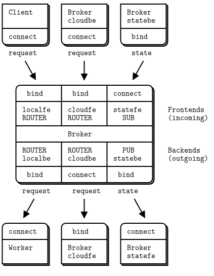

각 브로커의 cloudbe을 다른 모든 브로커들의 cloudfe에 연결하고 마찬가지로 각 브로커의 statebe에 다른 모든 브로커들의 statefe을 연결합니다.

### 상태 흐름에 대한 기본 작업

각 소켓 흐름은 방심한 사람들이 빠지기 쉬운 고유의 함정들이 있기 때문에, 한 번에 전체를 코드로 구축하기보다는 각 소켓에 대하여 하나씩 실제 코드로 테스트합니다. 각 흐름이 만족스러우면 전체 프로그램으로 통합할 수 있습니다. 상태 흐름(state flow)부터 시작하겠습니다.

그림 45 - 상태 흐름(The State Flow)

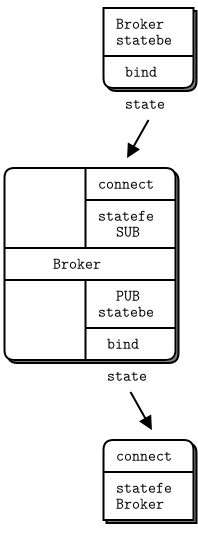

상태 흐름이 코드상에서 동작하는 방식입니다.

tcp를 사용하여 스레드간 통신이 가능하도록 변경하여 테스트를 수행합니다. tcp 소켓을 사용하도록 변경합니다.

* peering1_tcp.java : state flow에 대한 기본작업(tcp)

```java
//  Broker peering simulation (part 1)
//  Prototypes the state flow
#include <szmq/szmq.h>
#include <iostream>
#include <cstdlib>
#include <thread>
using namespace std;

int main (int argc, char *argv [])
{
    //  First argument is this broker's name
    //  Other arguments are our peers' names
    //
    if (argc < 2) {
        cout << "syntax: peering1 me {you}...\n";
        return 0;
    }    
    srand (static_cast<unsigned int>(std::time(0)));
    char *self = argv[1];
    cout << "I: preparing broker at "<< self <<"...\n";

    //  Bind state backend to endpoint
    szmq::Context context;
    szmq::Socket<ZMQ_PUB, szmq::ZMQ_SERVER> statebe(context);
    char fmt[255];
    snprintf(fmt, 255, "tcp://*:%s", self);
    cout << fmt << endl;
    statebe.bind(szmq::SocketUrl(fmt));
    
    //  Connect statefe to all peers
    szmq::Socket<ZMQ_SUB, szmq::ZMQ_CLIENT> statefe(context);
    statefe.setSockOpt(ZMQ_SUBSCRIBE, "", 0);
    for (int argn = 2; argn < argc; argn++) {
        char *peer = argv[argn];
        cout <<"I: connecting to state backend at "<< peer << endl;
        snprintf(fmt, 255, "tcp://localhost:%s", peer);
        cout << fmt << endl;
        statefe.connect(szmq::SocketUrl(fmt));
    }
    //  .split main loop
    //  The main loop sends out status messages to peers, and collects
    //  status messages back from peers. The zmq_poll timeout defines
    //  our own heartbeat:
    while (true) {
        //  Poll for activity, or 1 second timeout
        std::vector<szmq::PollItem> items = {
			{reinterpret_cast<void*>(*statefe), 0, ZMQ_POLLIN, 0}};
        szmq::poll(items, 1, 1000);    // timeout 1sec
        //  Handle incoming status messages
        if (items [0].revents & ZMQ_POLLIN) {
            auto peer_name = statefe.recv1().read<std::string>();
            auto available = statefe.recv1().read<int>();
            snprintf(fmt, 255, "%s - %d workers received", peer_name.c_str(), available);
            cout << fmt << endl;
        }
        else {
            //  Send random values for worker availability
            statebe.sendMultiple(szmq::Message::from(self), szmq::Message::from(rand()%10));
        }
    }
    return EXIT_SUCCESS;
}
```

* 빌드 및 테스트

~~~{.bash}
PS D:\work\sook\src\szmq\examples> cl -EHsc peering1_tcp.java szmq.lib
PS D:\work\sook\src\szmq\examples> ./peering1_tcp 5555 5556
I: preparing broker at 5555...
I: connecting to state backend at 5556
5556 - 5 workers received
5556 - 6 workers received
5556 - 9 workers received
...

PS D:\work\sook\src\szmq\examples> ./peering1_tcp 5556 5555
I: preparing broker at 5556...
I: connecting to state backend at 5555
5555 - 0 workers received
5555 - 8 workers received
5555 - 8 workers received
~~~

;Notes about this code:

이 코드에서 주의할 사항은 다음과 같습니다.

* 각 브로커에는 식별자(ID)를 가지며 ipc 단말 이름들을 구성하는 데 사용합니다. 실제 브로커는 TCP상에서 동작하며 좀 더 복잡한 구성체계로 작업해야 합니다. 이 책의 뒷부분에서 보겠지만, 지금은 생성된 ipc 이름을 사용하여 TCP/IP 주소 또는 이름으로 발생하는 문제를 무시할 수 있습니다.
* 우리는 프로그램의 핵심으로 `szmq::poll()` 루프를 사용합니다. `szmq::poll()`을 통해 들어오는 메시지들을 처리하고 상태 메시지들을 보냅니다. 수신 메시지들을 1초 동안 받지 못할 경우 상태 메시지를 보냅니다. 메시지를 받을 때마다 상태 메시지를 보내면 다른 브로커들에서 많은 메시지를 처리(상태 메시지 받고/상태 메시지 보내고) 해야 합니다.
* 우리는 발신자 주소와 데이터로 구성된 2개 부분으로 구성된 PUB-SUB 메시지를 사용합니다. 작업을 보내려면 발행자의 주소를 알아야 하기 때문에 한 가지 방법으로 메시지의 일부로 명시적으로 포함하여 보내는 것입니다.
* 실행 중인 브로커들에 연결할 때 오래된 상태 정보를 받을 수 있기 때문에 구독자들에 식별자(ID)를 설정하지 않습니다.
* 우리는 발행자에게 HWM을 설정하지 않았지만 ØMQ v2.x를 사용한다면 설정하는 것이 좋습니다.

프로그램을 빌드하고 3개의 클러스터를 시뮬레이션하기 위해 세 번 실행합니다. DC1, DC2 및 DC3(임의적인 이름임)이라고 부르며, 이 3개 명령들을 별도의 창에서 실행합니다.

```
peering1 DC1 DC2 DC3  #  Start DC1 and connect to DC2 and DC3
peering1 DC2 DC1 DC3  #  Start DC2 and connect to DC1 and DC3
peering1 DC3 DC1 DC2  #  Start DC3 and connect to DC1 and DC2
```

프로그램들을 실행하면 각 클러스터가 상대 클러스터의 상태를 보고하는 것을 볼 수 있으며, 몇 초 후 그들은 모두 즐겁게 1초당 한 번씩 난수(0~9)를 출력합니다. 이것을 시도하고 3개의 브로커가 모두 일치하고 1초당 상태 변경정보에 동기화됨을 확인하시기 바랍니다.

실제로는 우리는 정기적으로 상태 메시지를 보내는 것이 아니라 상태가 변경될 때(예 : 작업자가 가용하거나 비가용하거나) 메시지를 보냅니다. 메시지로 인한 많은 통신 트래픽이 발생할 것 같지만, 상태 메시지의 크기는 작으며 내부 클러스터 간 연결 설정으로 매우 빠릅니다.

정확한 시간 간격으로 상태 메시지들을 보내려면 자식 스레드를 만들고 자식 스레드에서 statebe 소켓을 열어 메인 스레드에서 자식 스레드로 가용한 작업자의 변경 정보를 보내고 자식 스레드는 정기적인 메시지와 함께 상대 클러스터들에게 보내도록 합니다. 

* 원도우 환경에서는 ipc를 사용할 수 없기 때문에 inproc나 tcp로 코드를 변경하여 테스트가 필요합니다.
peering1의 경우 여러 개의 프로세스들을 실행하여 프로세스 간 통신(ipc)하도록 설계되어 있어 프로세스 내(inproc)로 변경할 경우 각 스레드들 간에 컨텍스트가 공유될 수 있도록 수정 필요합니다.

inproc를 사용하여 스레드간 통신이 가능하도록 변경하여 테스트를 수행합니다. inproc 소켓을 사용하도록 변경합니다.

* peering1_inproc.java : state flow에 대한 기본작업(inproc)

```java
//  Broker peering simulation (part 1)
//  Prototypes the state flow
#include <szmq/szmq.h>
#include <czmq.h>
#include <iostream>
#include <thread>
#include <cstdlib>
using namespace std;

static void *
broker(szmq::Context *ctx, char *argv [])
{
    //  First argument is this broker's name
    //  Other arguments are our peers' names
    //
    char fmt[255];
    char *self = argv[1];
    cout << "I: preparing broker at "<< self <<"...\n";

    //  Bind state backend to endpoint
    szmq::Socket<ZMQ_PUB, szmq::ZMQ_SERVER> statebe(*ctx);
    snprintf(fmt, 255, "inproc://%s-state", self);
    statebe.bind(szmq::SocketUrl(fmt));
    
    //  Connect statefe to all peers
    szmq::Socket<ZMQ_SUB, szmq::ZMQ_CLIENT> statefe(*ctx);
    statefe.setSockOpt(ZMQ_SUBSCRIBE, "", 0);
    int argc = 0;
    while(argv[++argc]);
    for (int argn = 2; argn < argc; argn++) {
        char *peer = argv[argn];
        cout <<"I: connecting to state backend at "<< peer << endl;
        snprintf(fmt, 255, "inproc://%s-state", peer);
        statefe.connect(szmq::SocketUrl(fmt));
    }
    //  .split main loop
    //  The main loop sends out status messages to peers, and collects
    //  status messages back from peers. The zmq_poll timeout defines
    //  our own heartbeat:

    while (true) {
        //  Poll for activity, or 1 second timeout
        std::vector<szmq::PollItem> pollItems = {
			{reinterpret_cast<void*>(*statefe), 0, ZMQ_POLLIN, 0}};
        szmq::poll(pollItems, 1, 1000);    // timeout 1sec
        //  Handle incoming status messages
        if (pollItems [0].revents & ZMQ_POLLIN) {
            auto peer_name = statefe.recvOne().read<std::string>();
            auto available = statefe.recvOne().read<int>();
            snprintf(fmt, 255, "%s - %d workers received", peer_name.c_str(), available);
            cout << fmt << endl;
        }
        else {
            //  Send random values for worker availability
            statebe.sendMultiple(szmq::Message::from(self), szmq::Message::from(rand()%10));
        }
    }
}

int main (int argc, char *argv [])
{
    //  First argument is this broker's name
    //  Other arguments are our peers' names
    //
    if (argc < 2) {
        cout << "syntax: peering1 me {you}...\n";
        return 0;
    }    
    srand (static_cast<unsigned int>(std::time(0)));
    szmq::Context context;
    thread(&broker, &context, argv).detach();
    zclock_sleep(100);

    // Change the order
    int m,n;
    for(n=2; n < argc; n++){
        char *temp = strdup(argv[1]);
        for(m = 2; m < argc; m++)     
        {            
            argv[m-1] = argv[m];
        }
        argv[m-1] = temp;
        thread(&broker, &context, argv).detach();
        zclock_sleep(100);
    }
    while(true){}
    return EXIT_SUCCESS;
}
```

* 빌드 및 테스트

~~~{.bash}
//원도우의 경우
PS D:\work\sook\src\szmq\examples> ./peering_inproc dog cat fish bird
I: preparing broker at dog...
I: connecting to state backend at cat
I: connecting to state backend at fish
I: connecting to state backend at bird
I: preparing broker at cat...
I: connecting to state backend at fish
I: connecting to state backend at bird
I: connecting to state backend at dog
I: preparing broker at fish...
I: connecting to state backend at bird
I: connecting to state backend at dog
I: connecting to state backend at cat
I: preparing broker at bird...
I: connecting to state backend at dog
I: connecting to state backend at cat
I: connecting to state backend at fish
dog - 1 workers received
dog - 1 workers received
dog - 1 workers received
dog - 7 workers received
dog - 7 workers received
fish - 1 workers received
...

//리눅스의 경우
[zedo@jeroMQ examples]$ g++ -o peering_inproc peering_inproc.java  -lsook-szmq -lzmq  -lpthread
[zedo@jeroMQ examples]$ ./peering_inproc dag cat bird fish
I: preparing broker at dag...
I: connecting to state backend at cat
I: connecting to state backend at bird
I: connecting to state backend at fish
I: preparing broker at cat...
I: connecting to state backend at bird
I: connecting to state backend at fish
I: connecting to state backend at dag
I: preparing broker at bird...
I: connecting to state backend at fish
I: connecting to state backend at dag
I: connecting to state backend at cat
I: preparing broker at fish...
I: connecting to state backend at dag
I: connecting to state backend at cat
I: connecting to state backend at bird
dag - 2 workers received
dag - 2 workers received
dag - 2 workers received
...
~~~

### 로컬 및 클라우드 흐름에 대한 기본 작업

이제 로컬과 클라우드 소켓을 통해 작업들 흐름의 기본 작업을 수행하겠습니다. 이 코드는 클라이언트들과 상대 브로커들로부터 요청들 받아 무작위로 로컬 작업자들과 및 클라우드 상대들에 배포합니다.

그림 46 - 작업들의 흐름

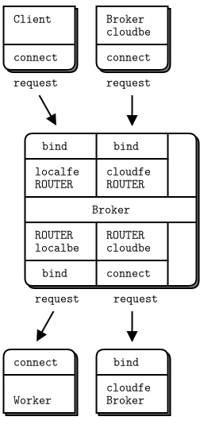

조금 복잡해지는 코드로 작성하기 전에 핵심 라우팅 로직을 그리면서 간단하면서도 안정된 설계를 하겠습니다.

2개의 대기열이 필요합니다. 하나는 로컬 클라이언트들의 요청을 위한 것이고 다른 하나는 클라우드 클라이언트들의 요청을 위한 것입니다. 한 가지 옵션은 로컬 및 클라우드 프론트엔드에서 메시지를 가져와서 각각의 대기열들에서 퍼내는 것이지만  ØMQ 소켓은 이미 대기열이 존재하여 무의미합니다. 따라서 ØMQ 소켓 버퍼들을 대기열들로 사용합니다.

이것이 우리가 부하 분산 브로커(lbbroker)에서 사용한 기술이며 멋지게 동작했습니다. 요청을 보낼 곳(작업자들 혹은 상대 브로커들)이 있을 때만 2개의 프론트엔드들에서 읽습니다. 백엔드에서 요청에 대한 응답을 반환하므로 항상 백엔드 소켓을 읽을 수 있습니다. 백엔드가 우리와 통신하지 않는 한 프론트엔드를 감시할 필요가 없습니다.

* 백엔드에서 처리 가능한 경우 프론트엔드로부터 요청을 받아 전달하며, 이전 예제(lbbroker)에서 처럼 작업자 대기열의 대기 상태를 보고 요청 처리할 수 있습니다.

주요 처리 과정은 다음과 같습니다.

* 특정 작업을 수행하기 위해 백엔드를 폴링하면 수신한 메시지는 작업자의  "준비(READY)" 상태이거나 응답일 수 있습니다. 응답인 경우 로컬 클라이언트 프론트엔드(localfe) 혹은 클라우드 프론트엔드(cloudfe)를 통해 반환합니다.
* 작업자가 응답하면 사용할 수 있게 되었으므로 대기열에 넣고 큐의 크기를 하나 증가 시킵니다.
* 작업자들이 가용할 동안 프론트엔드에서 요청을 받아 로컬 작업자(localbe)에게 또는 무작위로 클라우드 상대(cloudbe)로 라우팅합니다.

작업자가 아닌 상대 브로커에 무작위로 작업을 보내는 것은 전체 클러스터에서 작업 분배를 시뮬레이션하기 위함입니다. 그다지 현명하지 않지만 이 단계에서는 괜찮습니다.

브로커 식별자(ID)를 사용하여 브로커들 간에 메시지를 전달합니다. 각 브로커에 있는 식별자(ID)는 단순한 프로그램 실행 명령에서 매개변수로 제공하는 이름입니다. 이러한 식별자(ID)는 클라이언트 노드들의 식별자(ID)와 중복되지 말아야 하며, 중복될 경우 응답을 클라이언트들 혹은 브로커로 반환할지 알 수 없습니다.

여기에서 실제로 작동하는 코드입니다.
흥미로운 부분은 "Interesting part)"이라는 주석으로 시작됩니다.

대응하는 TCP 포트를 지정하며 브로커의 peer 지정시에 주의가 필요합니다.
- localfe(bind) : self
- localbe(bind) : std::stoi(self) + 1
- couldfe(bind) : std::stoi(self) + 2
- couldbe(connect) : std::stoi(peer) + 2

* peering2_tcp.java: local과 cloud 간 흐름의 기본 구현

```java
//  Broker peering simulation (part 2)
//  Prototypes the request-reply flow
#include <szmq/szmq.h>
#include <iostream>
#include <boost/format.hpp>
#include <cstdlib>
#include <thread>
#include <queue>
#define NBR_CLIENTS 10
#define NBR_WORKERS 3
#define WORKER_READY   "\001"      //  Signals worker is ready

using namespace std;

//  Our own name; in practice this would be configured per node
static char *self;

//  .split client task
//  The client task does a request-reply dialog using a standard
//  synchronous REQ socket:

static void *
client_task (void *args)
{
    szmq::Context context;
    szmq::Socket<ZMQ_REQ, szmq::ZMQ_CLIENT> client(context);
    client.connect(szmq::SocketUrl(boost::str(boost::format("tcp://localhost:%1%") % self)));
    cout << boost::format("client : tcp://localhost:%1%\n") % self;
    while (true) {
        //  Send request, get reply
        client.sendOne(szmq::Message::from("HELLO"));
        auto reply = client.recvOne();
        cout << "Client: " << reply.read<std::string>() << endl;
        std::this_thread::sleep_for(std::chrono::milliseconds(1000));  
    }
    client.close();
    return NULL;
}

//  .split worker task
//  The worker task plugs into the load-balancer using a REQ
//  socket:

static void *
worker_task (void *args)
{
    szmq::Context context;
    szmq::Socket<ZMQ_REQ, szmq::ZMQ_CLIENT> worker(context);
    worker.connect(szmq::SocketUrl(boost::str(boost::format("tcp://localhost:%1%") % (stoi(self)+1))));
    cout << boost::format("worker : tcp://localhost:%1%\n") % (stoi(self)+1);
    //  Tell broker we're ready for work
    worker.sendOne(szmq::Message::from(WORKER_READY));

    //  Process messages as they arrive
    while (true) {
        auto msgs = worker.recvMultiple();
        cout << "Worker: " << msgs.back().read<std::string>() << endl; //request("HELLO")
        msgs.pop_back();
		msgs.emplace_back(szmq::Message::from(std::string("OK")));
        worker.sendMultiple(msgs);
    }
    worker.close();
    return NULL;
}

//  .split main task
//  The main task begins by setting-up its frontend and backend sockets
//  and then starting its client and worker tasks:

int main (int argc, char *argv [])
{
    //  First argument is this broker's name
    //  Other arguments are our peers' names
    //
    if (argc < 2) {
        cout << "syntax: peering2 me {you}...\n";
        return 0;
    }
    self = argv [1];
    cout <<"I: preparing broker at " << self << "...\n";
    srand (static_cast<unsigned int>(std::time(0)));

    szmq::Context context;
    //  Bind cloud frontend to endpoint
    szmq::Socket<ZMQ_ROUTER, szmq::ZMQ_SERVER> cloudfe(context); 
    cloudfe.setId(string(self));
    cloudfe.bind(szmq::SocketUrl(boost::str(boost::format("tcp://*:%1%") % (stoi(self)+2))));

    //  Connect cloud backend to all peers
    szmq::Socket<ZMQ_ROUTER, szmq::ZMQ_CLIENT> cloudbe(context); 
    cloudbe.setId(string(self));
    int argn;
    for (argn = 2; argn < argc; argn++) {
        char *peer = argv [argn];
        cout <<"I: connecting to cloud frontend at " << stoi(peer)+2 << endl;
        cloudbe.connect(szmq::SocketUrl(boost::str(boost::format("tcp://localhost:%1%") % (stoi(peer)+2))));
    }
    //  Prepare local frontend and backend
    szmq::Socket<ZMQ_ROUTER, szmq::ZMQ_SERVER> localfe(context);    
    szmq::Socket<ZMQ_ROUTER, szmq::ZMQ_SERVER> localbe(context);
    localfe.bind(szmq::SocketUrl(boost::str(boost::format("tcp://*:%1%") % self)));
    localbe.bind(szmq::SocketUrl(boost::str(boost::format("tcp://*:%1%") % (stoi(self)+1))));

    //  Get user to tell us when we can start...
    cout << "Press Enter when all brokers are started: ";
    getchar ();

    //  Start local workers
  int worker_nbr;
    for (worker_nbr = 0; worker_nbr < NBR_WORKERS; worker_nbr++){
        thread worker(&worker_task, nullptr);
        worker.detach();
    }
    //  Start local clients
    int client_nbr;
    for (client_nbr = 0; client_nbr < NBR_CLIENTS; client_nbr++){
        thread client(&client_task, nullptr);
        client.detach();
    }

    // Interesting part
    //  .split request-reply handling
    //  Here, we handle the request-reply flow. We're using load-balancing
    //  to poll workers at all times, and clients only when there are one 
    //  or more workers available.

    //  Least recently used queue of available workers
    std::queue<szmq::Message> worker_queue;

    while (true) {
        //  First, route any waiting replies from workers
        std::vector<szmq::PollItem> backends = {
            {reinterpret_cast<void*>(*localbe), 0, ZMQ_POLLIN, 0},
            {reinterpret_cast<void*>(*cloudbe), 0, ZMQ_POLLIN, 0}};        

        //  If we have no workers, wait indefinitely
        szmq::poll(backends, 2, worker_queue.size() ? 1000 : -1);

        //  Handle reply from local worker
        std::vector<szmq::Message> msgs;
        if (backends [0].revents & ZMQ_POLLIN) {
            msgs = localbe.recvMultiple();
            auto identity = msgs.front();
            worker_queue.push(identity);
            msgs.erase(msgs.begin()); // delete the worker_id
            msgs.erase(msgs.begin()); // delete the empty delimiter	
            //  If it's READY, don't route the message any further
            auto client_id = msgs.front();
            if((client_id.read<std::string>().compare(WORKER_READY)) == 0)
                msgs.clear();
        }
        //  Or handle reply from peer broker
        else
        if (backends [1].revents & ZMQ_POLLIN) {
            msgs = cloudbe.recvMultiple();
            //  We don't use peer broker identity for anything
            auto identity = msgs.front();
            msgs.erase(msgs.begin()); // delete the cloudbe id
            msgs.erase(msgs.begin()); // delete the empty delimiter	
        }
        //  Route reply to cloud if it's addressed to a broker
        for (argn = 2; msgs.size() && argn < argc; argn++) {
            auto client_id = msgs.front();
            if((client_id.read<std::string>().compare(argv [argn])) == 0){
                cloudfe.sendMultiple(msgs); msgs.clear();
            }
        }
        //  Route reply to client if we still need to
        if (msgs.size()){
            localfe.sendMultiple(msgs); msgs.clear();
        }
        //  .split route client requests
        //  Now we route as many client requests as we have worker capacity
        //  for. We may reroute requests from our local frontend, but not from 
        //  the cloud frontend. We reroute randomly now, just to test things
        //  out. In the next version, we'll do this properly by calculating
        //  cloud capacity:

        while (worker_queue.size()) {
            std::vector<szmq::PollItem> frontends = {
                {reinterpret_cast<void*>(*localfe), 0, ZMQ_POLLIN, 0},
                {reinterpret_cast<void*>(*cloudfe), 0, ZMQ_POLLIN, 0}};   
            szmq::poll(frontends, 2, 0);
            int reroutable = 0;
            //  We'll do peer brokers first, to prevent starvation
            if (frontends [1].revents & ZMQ_POLLIN) {
                msgs = cloudfe.recvMultiple();
                reroutable = 0;
            }
            else
            if (frontends [0].revents & ZMQ_POLLIN) {
                msgs = localfe.recvMultiple();
                reroutable = 1;
            }
            else
                break;      //  No work, go back to backends

            //  If reroutable, send to cloud 20% of the time
            //  Here we'd normally use cloud status information
            //
            if (reroutable && argc > 2 && (rand() % 5) == 0) {
                //  Route to random broker peer
                int peer = rand() % (argc - 2) + 2;
                msgs.insert(msgs.begin(), szmq::Message::from(std::string("")));
                msgs.insert(msgs.begin(), szmq::Message::from(string(argv[peer])));	
                cloudbe.sendMultiple(msgs); msgs.clear();
            }
            else {
                msgs.insert(msgs.begin(), szmq::Message::from(std::string("")));
                msgs.insert(msgs.begin(), worker_queue.front()); //worker_queue [0];
                worker_queue.pop();
                localbe.sendMultiple(msgs); msgs.clear();
            }
        }
    }
    //  When we're done, clean up properly
	while (worker_queue.size()) {
		worker_queue.pop();
	}	
    cloudfe.close();
    cloudbe.close();
    localfe.close();
    localbe.close();
    return EXIT_SUCCESS;
}
```

* 빌드 및 테스트

~~~{.bash}
// 원도우
PS D:\work\sook\src\szmq\examples> cl -EHsc peering2_tcp.java szmq.lib


PS D:\work\sook\src\szmq\examples> ./peering2_tcp 6000 5000
PS D:\work\sook\src\szmq\examples> ./peering2_tcp 5000 6000
I: preparing broker at 5000...
I: connecting to cloud frontend at 6002
Press Enter when all brokers are started:
worker : tcp://localhost:5001
worker : tcp://localhost:5001
client : tcp://localhost:5000
client : tcp://localhost:5000
client : tcp://localhost:5000
client : tcp://localhost:5000
client : tcp://localhost:5000
client : tcp://localhost:5000
client : tcp://localhost:5000
client : tcp://localhost:5000
client : tcp://localhost:5000
client : tcp://localhost:5000
worker : tcp://localhost:5001
Worker: HELLO
Worker: HELLO
Worker: HELLO
Client: OK
...

// 리눅스
zedo@sook:/work/sook/src/szmq/examples$ g++ -o peering2_tcp peering2_tcp.java -lsook-szmq -lzmq -lpthread
zedo@sook:/work/sook/src/szmq/examples$ ./peering2_tcp 5000 6000
I: preparing broker at 5000...
I: connecting to cloud frontend at 6002
Press Enter when all brokers are started: 
worker : tcp://localhost:5001
worker : tcp://localhost:5001
worker : tcp://localhost:5001
client : tcp://localhost:5000
client : tcp://localhost:5000
client : tcp://localhost:5000
client : tcp://localhost:5000
client : tcp://localhost:5000
client : tcp://localhost:5000
Worker: HELLO
client : tcp://localhost:5000
client : tcp://localhost:
client : tcp://localhost:50005000
client : tcp://localhost:5000
Worker: HELLO
Client: OK
...
~~~

코드의 대한 설명입니다.

* 적어도 C++ 언어로 작성된 코드에서 szmq::Message 클래스를 사용하면 구현이 쉬워지고 코드는 훨씬 짧아집니다. szmq::Message는 동작 가능한 추상화입니다. C++ 언어로 ØMQ 응용프로그램을 개발할 경우 SZMQ 라이브러리를 사용해야 합니다.
* 우리는 상대로부터 어떤 상태 정보도 받지 못하기 때문에 그들이 동작 중이라고 가정합니다. 코드에서 처음에는 모든 브로커들이 실행 중인지 확인하며, 실제로 브로커들의 상태를 보내지 않으면 브로커에게 어떤 메시지도 전송하지 않습니다.

정상적으로 실행되는 코드를 보면서 만족시킬 수 있습니다. 잘못 전달 된 메시지가 있는 경우 클라이언트는 결국 차단되고 브로커는 추적 정보 출력을 중지하며 브로커들을 중단함으로 확인할 수 있습니다.
다른 브로커가 클라우드에 요청을 보내고 클라이언트들은 하나씩 응답이 되돌아올 때까지 기다립니다.

### 결합하기

위의 예제들을 하나의 패키지로 합치겠습니다. 이전에는 전체 클러스터를 하나의 프로세스로 실행합니다. 2가지 예제를 가져와서 하나로 병합하여 원하는 수의 클러스터들을 시뮬레이션할 수 있도록 하겠습니다.

이 코드는 270줄로 이전 2개의 예제를 합친 크기입니다. 이는 클라이언트들과 작업자들 및 클라우드 작업부하를 분산시키는 클러스터 시뮬레이션에 좋습니다.
다음은 코드입니다.

peering3.c는 ipc 전송 방식을 사용하여 원도우에서 사용 가능한 tcp 전송 방식으로 변경하겠습니다. 변경을 위하여 바인드와 연결에 사용되는 포트 번호를 지정합니다.

localfe : self
localbe : stoi(self)+1
cloudfe : stoi(self)+2
cloudbe : stoi(peer)+2
statefe : stoi(peer)+4
statebe : stoi(self)+4
monitor : stoi(self)+3  --> 모니터링을 위하여 신규 포트 추가됨

* peering3.java : 클로스터 전체 시뮬레이션

```java
//  Broker peering simulation (part 2)
//  Prototypes the request-reply flow
#include <szmq/szmq.h>
#include <iostream>
#include <boost/format.hpp>
#include <cstdlib>
#include <thread>
#include <queue>
#define NBR_CLIENTS 10
#define NBR_WORKERS 5
#define WORKER_READY   "\001"      //  Signals worker is ready

using namespace std;

//  Our own name; in practice this would be configured per node
static char *self;

//  .split client task
//  The client task does a request-reply dialog using a standard
//  synchronous REQ socket:

static void *
client_task (void *args)
{
    szmq::Context context;
    szmq::Socket<ZMQ_REQ, szmq::ZMQ_CLIENT> client(context);
    client.connect(szmq::SocketUrl(boost::str(boost::format("tcp://localhost:%1%") % self)));
    cout << boost::format("[d]client : tcp://localhost:%1%\n") % self;
    szmq::Socket<ZMQ_PUSH, szmq::ZMQ_CLIENT> monitor(context);
    monitor.connect(szmq::SocketUrl(boost::str(boost::format("tcp://localhost:%1%") % (stoi(self)+3))));
    cout << boost::format("[d]monitor : tcp://localhost:%1%\n") % (stoi(self)+3);
    while (true) {
        std::this_thread::sleep_for(std::chrono::milliseconds((rand() % 5)* 100)); 
        int burst = rand() % 15;
        while (burst--) {
            auto task_id =  boost::str(boost::format("%1$06X") % (rand() % 0x1000000)); 
            //  Send request, get reply
            client.sendOne(szmq::Message::from(task_id));
            std::vector<szmq::PollItem> pollset = {
			    {reinterpret_cast<void*>(*client), 0, ZMQ_POLLIN, 0}};
            szmq::poll(pollset, 1, 10*1000);    // 10 seconds timeout
            if (pollset [0].revents & ZMQ_POLLIN) {
                auto reply = client.recvOne();               
                monitor.sendOne(szmq::Message::from(boost::str(boost::format("I: CLIENT recived reply %1%") % reply.read<std::string>())));
            } else {
                monitor.sendOne(szmq::Message::from(boost::str(boost::format("E: CLIENT EXIT - lost task %1%") % task_id)));
                return NULL;
            }
        } 
    }
    client.close();
    monitor.close();
    return NULL;
}

//  .split worker task
//  The worker task plugs into the load-balancer using a REQ
//  socket:

static void *
worker_task (void *args)
{
    szmq::Context context;
    szmq::Socket<ZMQ_REQ, szmq::ZMQ_CLIENT> worker(context);
    worker.connect(szmq::SocketUrl(boost::str(boost::format("tcp://localhost:%1%") % (stoi(self)+1))));
    cout << boost::format("[d]worker : tcp://localhost:%1%\n") % (stoi(self)+1);
    //  Tell broker we're ready for work
    worker.sendOne(szmq::Message::from(WORKER_READY));

    //  Process messages as they arrive
    while (true) {
        auto msgs = worker.recvMultiple();
        std::this_thread::sleep_for(std::chrono::milliseconds((rand() % 2)* 1000)); 
        worker.sendMultiple(msgs);
    }
    worker.close();
    return NULL;
}

//  .split main task
//  The main task begins by setting-up its frontend and backend sockets
//  and then starting its client and worker tasks:

int main (int argc, char *argv [])
{
    //  First argument is this broker's name
    //  Other arguments are our peers' names
    //
    if (argc < 2) {
        cout << "syntax: peering3 me {you}...\n";
        return 0;
    }
    self = argv [1];
    cout <<"[d]I: preparing broker at " << self << "...\n";
    srand (static_cast<unsigned int>(std::time(0)));

    szmq::Context context;
    //  Prepare local frontend and backend
    szmq::Socket<ZMQ_ROUTER, szmq::ZMQ_SERVER> localfe(context);    
    localfe.bind(szmq::SocketUrl(boost::str(boost::format("tcp://*:%1%") % self)));
    cout << "[d]localfe : tcp::/*:" << self << endl;

    szmq::Socket<ZMQ_ROUTER, szmq::ZMQ_SERVER> localbe(context);
    localbe.bind(szmq::SocketUrl(boost::str(boost::format("tcp://*:%1%") % (stoi(self)+1))));
    cout << "[d]localbe : tcp::/*:" << stoi(self)+1 << endl;

    //  Bind cloud frontend to endpoint
    szmq::Socket<ZMQ_ROUTER, szmq::ZMQ_SERVER> cloudfe(context); 
    cloudfe.setId(string(self));
    cloudfe.bind(szmq::SocketUrl(boost::str(boost::format("tcp://*:%1%") % (stoi(self)+2))));

    //  Connect cloud backend to all peers
    szmq::Socket<ZMQ_ROUTER, szmq::ZMQ_CLIENT> cloudbe(context); 
    cloudbe.setId(string(self));
    int argn;
    for (argn = 2; argn < argc; argn++) {
        char *peer = argv [argn];
        cout <<"I: connecting to cloud frontend at " << stoi(peer)+2 << endl;
        cloudbe.connect(szmq::SocketUrl(boost::str(boost::format("tcp://localhost:%1%") % (stoi(peer)+2))));
    }

    //  Bind state backend to endpoint
    szmq::Socket<ZMQ_PUB, szmq::ZMQ_SERVER> statebe (context); 
    statebe.bind(szmq::SocketUrl(boost::str(boost::format("tcp://*:%1%") % (stoi(self)+4))));
    cout << "[d]statebe : tcp::/*:" << stoi(self)+4 << endl;

    //  Connect state frontend to all peers
    szmq::Socket<ZMQ_SUB, szmq::ZMQ_CLIENT> statefe(context); 
    statefe.setSockOpt(ZMQ_SUBSCRIBE, "", 0);
    for (argn = 2; argn < argc; argn++) {
        char *peer = argv [argn];
        cout <<"I: connecting to state backend at " << stoi(peer)+4<< endl;
        statefe.connect(szmq::SocketUrl(boost::str(boost::format("tcp://localhost:%1%") % (stoi(peer)+4))));
    }
    //  Prepare monitor socket
    szmq::Socket<ZMQ_PULL, szmq::ZMQ_SERVER> monitor(context); 
    monitor.bind(szmq::SocketUrl(boost::str(boost::format("tcp://*:%1%") % (stoi(self)+3))));
    cout << "[d]monitor : tcp::/*:" << stoi(self)+3 << endl;

    //  Get user to tell us when we can start...
    cout << "Press Enter when all brokers are started: ";
    getchar ();

    //  Start local workers
  int worker_nbr;
    for (worker_nbr = 0; worker_nbr < NBR_WORKERS; worker_nbr++){
        thread worker(&worker_task, nullptr);
        worker.detach();
    }
    //  Start local clients
    int client_nbr;
    for (client_nbr = 0; client_nbr < NBR_CLIENTS; client_nbr++){
        thread client(&client_task, nullptr);
        client.detach();
    }

    //  .split main loop
    //  The main loop has two parts. First, we poll workers and our two service
    //  sockets (statefe and monitor), in any case. If we have no ready workers,
    //  then there's no point in looking at incoming requests. These can remain 
    //  on their internal ØMQ queues:

    //  Least recently used queue of available workers
    int local_capacity = 0;
    int cloud_capacity = 0;
    std::queue<szmq::Message> worker_queue;

    while (true) {
        //  First, route any waiting replies from workers
        std::vector<szmq::PollItem> primary = {
            {reinterpret_cast<void*>(*localbe), 0, ZMQ_POLLIN, 0},
            {reinterpret_cast<void*>(*cloudbe), 0, ZMQ_POLLIN, 0},
            {reinterpret_cast<void*>(*statefe), 0, ZMQ_POLLIN, 0},
            {reinterpret_cast<void*>(*monitor), 0, ZMQ_POLLIN, 0}};        
        //  If we have no workers, wait indefinitely
        szmq::poll(primary, 4, local_capacity? 1000 : -1);
        //  Track if capacity changes during this iteration
        int previous = local_capacity;
        //  Handle reply from local worker
        std::vector<szmq::Message> msgs;
        if (primary [0].revents & ZMQ_POLLIN) {
            msgs = localbe.recvMultiple();
            auto identity = msgs.front();
            worker_queue.push(identity);
            local_capacity++;
            msgs.erase(msgs.begin()); // delete the worker_id
            msgs.erase(msgs.begin()); // delete the empty delimiter	
            //  If it's READY, don't route the message any further
            auto client_id = msgs.front();
            if((client_id.read<std::string>().compare(WORKER_READY)) == 0)
                msgs.clear();
        }
        //  Or handle reply from peer broker
        else
        if (primary [1].revents & ZMQ_POLLIN) {
            msgs = cloudbe.recvMultiple();
            //  We don't use peer broker identity for anything
            auto identity = msgs.front();
            msgs.erase(msgs.begin()); // delete the cloudbe id
            msgs.erase(msgs.begin()); // delete the empty delimiter	
        }
        //  Route reply to cloud if it's addressed to a broker
        for (argn = 2; msgs.size() && argn < argc; argn++) {
            auto client_id = msgs.front();
            if((client_id.read<std::string>().compare(argv [argn])) == 0){
                cloudfe.sendMultiple(msgs); msgs.clear();
            }
        }
        //  Route reply to client if we still need to
        if (msgs.size()){
            localfe.sendMultiple(msgs); msgs.clear();
        }
        //  .split handle state messages
        //  If we have input messages on our statefe or monitor sockets, we
        //  can process these immediately:

        if (primary [2].revents & ZMQ_POLLIN) {
            auto peer = statefe.recvOne();
            auto status = statefe.recvOne().read<int>();
            cloud_capacity = status;
        }
        if (primary [3].revents & ZMQ_POLLIN) {
            auto status = monitor.recvOne().read<std::string>();
            cout << status << endl;
        }
        //  .split route client requests
        //  Now we route as many client requests as we have worker capacity
        //  for. We may reroute requests from our local frontend, but not from 
        //  the cloud frontend. We reroute randomly now, just to test things
        //  out. In the next version, we'll do this properly by calculating
        //  cloud capacity:
        while (local_capacity + cloud_capacity) {
            std::vector<szmq::PollItem> secondary  = {
                {reinterpret_cast<void*>(*localfe), 0, ZMQ_POLLIN, 0},
                {reinterpret_cast<void*>(*cloudfe), 0, ZMQ_POLLIN, 0}};   
            szmq::poll(secondary, local_capacity ? 2 : 1, 0);
            //  We'll do peer brokers first, to prevent starvation
            if (secondary [0].revents & ZMQ_POLLIN)
                msgs = localfe.recvMultiple();
            else
            if (secondary [1].revents & ZMQ_POLLIN) 
                msgs = cloudfe.recvMultiple();
            else
                break;      //  No work, go back to backends

            if (local_capacity) {
                msgs.insert(msgs.begin(), szmq::Message::from(std::string("")));
                msgs.insert(msgs.begin(), worker_queue.front()); //worker_queue [0];
                worker_queue.pop();
                localbe.sendMultiple(msgs); msgs.clear();
                local_capacity--;
            }
            else {
                //  Route to random broker peer
                int peer = rand() % (argc - 2) + 2;
                msgs.insert(msgs.begin(), szmq::Message::from(std::string("")));
                msgs.insert(msgs.begin(), szmq::Message::from(string(argv[peer])));	
                for (auto it = begin (msgs); it != end (msgs); ++it) 
                    it->dump();
                cloudbe.sendMultiple(msgs); msgs.clear();
            }
        }
        //  .split broadcast capacity
        //  We broadcast capacity messages to other peers; to reduce chatter,
        //  we do this only if our capacity changed.

        if (local_capacity != previous) {
            //  We stick our own identity onto the envelope
            statebe.sendOne(szmq::Message::from(self));
            //  Broadcast new capacity
            statebe.sendOne(szmq::Message::from(local_capacity));
        }
    }
    //  When we're done, clean up properly
	while (worker_queue.size()) {
		worker_queue.pop();
	}	
    localfe.close();
    localbe.close();    
    cloudfe.close();
    cloudbe.close();
    return EXIT_SUCCESS;
}
```

* 빌드 및 테스트

~~~{.bash}
// 원도우
D:\work\sook\src\szmq\examples> cl -EHsc -MTd peering3_tcp.java szmq.lib

PS D:\work\sook\src\szmq\examples> ./peering3_tcp 5000 6000
[d]I: preparing broker at 5000...
[d]localfe : tcp::/*:5000
[d]localbe : tcp::/*:5001
I: connecting to cloud frontend at 6002
[d]statebe : tcp::/*:5004
I: connecting to state backend at 6004
[d]monitor : tcp::/*:5003
Press Enter when all brokers are started:
[d]monitor : tcp://localhost:5003
[d]monitor : tcp://localhost:5003
I: CLIENT recived reply 0018BE
I: CLIENT recived reply 0018BE
I: CLIENT recived reply 0018BE
I: CLIENT recived reply 0018BE
I: CLIENT recived reply 0018BE
...

PS D:\work\sook\src\szmq\examples> ./peering3_tcp 6000 5000
[d]I: preparing broker at 6000...
[d]localfe : tcp::/*:6000
[d]localbe : tcp::/*:6001
I: connecting to cloud frontend at 5002
[d]statebe : tcp::/*:6004
I: connecting to state backend at 5004
[d]monitor : tcp::/*:6003
Press Enter when all brokers are started:
...

//리눅스
zedo@sook:/work/sook/src/szmq/examples$ g++ -o peering3_tcp peering3_tcp.java -lsook-szmq -lzmq -lpthread 
zedo@sook:/work/sook/src/szmq/examples$ ./peering3_tcp 5000 6000
[d]I: preparing broker at 5000...
[d]localfe : tcp::/*:5000
[d]localbe : tcp::/*:5001
I: connecting to cloud frontend at 6002
[d]statebe : tcp::/*:5004
I: connecting to state backend at 6004
[d]monitor : tcp::/*:5003
Press Enter when all brokers are started: 
[d]worker : tcp://localhost:[d]worker : tcp://localhost:50015001
...
[d]monitor : tcp://localhost:5003
I: CLIENT recived reply 529353
I: CLIENT recived reply 90CA99
...
zedo@sook:/work/sook/src/szmq/examples$ ./peering3_tcp 6000 5000
[d]I: preparing broker at 6000...
[d]localfe : tcp::/*:6000
[d]localbe : tcp::/*:6001
...
~~~

적당히 큰 프로그램으로 코드를 작성하는데 대략 하루가 걸렸습니다. 주목할 점은 다음과 같습니다.

* 클라이언트 스레드들은 실패한 요청을 감지하고 보고 합니다. 응답을 기다리면서 잠시 후(약 10초) 아무것도 도착하지 않으면 오류 메시지를 출력합니다.
* 클라이언트 스레드들은 직접 인쇄하지 않고 대신 모니터 PUSH 소켓에 메시지를 보내면 메인의 PULL 소켓이 수집하고 출력합니다. 이것은 모니터링 및 로깅을 위해 ØMQ 소켓을 사용한 첫 번째 사례였습니다. 이 방법은 중요하므로 나중에 자세히 설명합니다.
* 클라이언트는 다양한 부하를 시뮬레이션하며 임의의 순간에 클러스터의 부하가 100%가 되면 작업을 클라우드로 옮기게 합니다. 시뮬레이션 부하는 클라이언트들 및 작업자들의 수와 클라이언트 및 작업자 스레드들의 지연으로 제어합니다. 보다 현실적인 시뮬레이션을 위해 시뮬레이션 부하를 조정해 보시기 바랍니다.
* 메인 루프는 2개의 `szmq::PollItem`를 사용합니다. 실제로 정보, 백엔드 및 프론트엔드의 3가지를 사용합니다. 이전 기본 작업에서와 같이 백엔드에 처리 용량이 없으면 프런트 엔드 메시지를 받지 않습니다.

다음은 프로그램을 개발하면서 발생한 몇 가지 문제들입니다.

* 어딘가에서 요청들이나 응답들이 잃게 되어 클라이언트들이 멈출 수 있습니다. ROUTER 소켓은 전달할 수 없는 메시지들을 삭제합니다. 여기서 첫 번째 전략은 이러한 문제를 감지하고 보고하도록 클라이언트 스레드를 수정하는 것입니다. 둘째, 문제의 원인이 명확해질 때까지 메인 루프에서 모든 수신 후와 모든 송신 전에 `szmq::dump()` 호출을 넣었습니다.
* 메인 루프가 하나 이상의 준비된 소켓들에서 잘못 읽게 되면 첫 번째 메시지가 유실되었습니다. 첫 번째 준비된 소켓에서만 읽음으로써 문제를 해결했습니다.

이 시뮬레이션은 클라스터 상대의 사라짐을 감지하지 않습니다. 여러 클러스터 상대들을 시작하고 하나(다른 상대들에게 작업자 수를 브로드캐스팅 수행함)를 중지하면, 다른 상대들은 사라진 상대에게 계속해서 작업을 보냅니다. 당신은 이것을 시도할 경우 분실된 요청들에 대해 불평(10초 대기 동안 응답이 오지 않으면 오류 메시지 출력)하는 클라이언트들을 확인할 수 있습니다. 해결책은 2개입니다. 첫째, 용량 정보(작업자 수)를 잠시 동안만 유지하여 상대가 사라지면 용량이 빠르게 0으로 설정합니다. 둘째, 요청-응답 체인에 신뢰성을 추가합니다. 다음 장에서 안정성에 대하여 설명하겠습니다.

위의 예제를 1개의 프로세스에서 동작하도록 inproc로 변경할 경우 다음과 같습니다.

* peering3_inproc.java

```java
//  Broker peering simulation (part 2)
//  Prototypes the request-reply flow
#include <szmq/szmq.h>
#include <iostream>
#include <czmq.h>
#include <cstdlib>
#include <thread>
#include <queue>
#define NBR_CLIENTS 10
#define NBR_WORKERS 5
#define WORKER_READY   "\001"      //  Signals worker is ready

using namespace std;


//  .split client task
//  The client task does a request-reply dialog using a standard
//  synchronous REQ socket:

static void 
client_task (void *context, char* self)
{   
    int rc;
    szmq::Context *ctx = (szmq::Context *) context;
    char fmt[255];
    szmq::Socket<ZMQ_REQ, szmq::ZMQ_CLIENT> client(*ctx);    
    snprintf(fmt, 255, "inproc://%s-localfe", self);
    client.connect(szmq::SocketUrl(fmt)); 
    szmq::Socket<ZMQ_PUSH, szmq::ZMQ_CLIENT> monitor(*ctx);
    snprintf(fmt, 255, "inproc://%s-monitor", self);
    monitor.connect(szmq::SocketUrl(fmt));
    while (true) {
        zclock_sleep((rand() % 5));
        int burst = rand() % 15;
        while (burst--) {
            char task_id[5];
            snprintf(task_id, 5, "%04X", rand() % 0x10000);
            //  Send request, get reply
            rc = client.sendOne(szmq::Message::from(string(task_id)));
            if (rc == -1) printf("E: client.sendOne() : %s\n",zmq_strerror(zmq_errno()));
            std::vector<szmq::PollItem> pollset = {
			    {reinterpret_cast<void*>(*client), 0, ZMQ_POLLIN, 0}};
            rc = szmq::poll(pollset, 1, 10*1000);    // 10 seconds timeout
            if (rc == -1) printf("E: [client]szmq::poll() : %s\n",zmq_strerror(zmq_errno()));
            if (pollset [0].revents & ZMQ_POLLIN) {
                auto reply = client.recvOne().read<std::string>();
                snprintf(fmt, 255, "[%s]I: CLIENT recived reply %s", self, reply.c_str());               
                rc = monitor.sendOne(szmq::Message::from(fmt));
                if (rc == -1) printf("E: [client]monitor.sendOne() : %s\n",zmq_strerror(zmq_errno()));
            } else {
                snprintf(fmt, 255, "[%s]E: CLIENT EXIT - lost task %s", self, task_id);   
                rc = monitor.sendOne(szmq::Message::from(fmt));
                if (rc == -1) printf("E: [client]monitor.sendOne() : %s\n",zmq_strerror(zmq_errno()));
                client.close();
                monitor.close();
                return;
            }
        } 
    }
    client.close();
    monitor.close();
}

//  .split worker task
//  The worker task plugs into the load-balancer using a REQ
//  socket:

static void 
worker_task (void *context, char* self)
{
    int rc;
    szmq::Context *ctx = (szmq::Context *) context;
    char fmt[255];
    szmq::Socket<ZMQ_REQ, szmq::ZMQ_CLIENT> worker(*ctx);
    snprintf(fmt, 255, "inproc://%s-localbe", self);
    worker.connect(szmq::SocketUrl(fmt));
    szmq::Socket<ZMQ_PUSH, szmq::ZMQ_CLIENT> monitor(*ctx);
    snprintf(fmt, 255, "inproc://%s-monitor", self);
    monitor.connect(szmq::SocketUrl(fmt));
    //  Tell broker we're ready for work
    rc = worker.sendOne(szmq::Message::from(WORKER_READY));
    if (rc == 0) printf("E: worker.sendOne() : %s\n",zmq_strerror(zmq_errno()));
    //  Process messages as they arrive
    while (true) {
        auto msgs = worker.recvN();
        auto msgbuffer = msgs.back().read<std::string>();
        snprintf(fmt, 255, "[%s] Worker received :  %s", self, msgbuffer.c_str());   
        rc = monitor.sendOne(szmq::Message::from(fmt));     
        if (rc == -1) printf("E: monitor.sendOne() : %s\n",zmq_strerror(zmq_errno()));   
        zclock_sleep((rand() % 2));
        rc = worker.sendMultiple(msgs); msgs.clear();
        if (rc == 0) printf("E: worker.sendMultiple() : %s\n",zmq_strerror(zmq_errno()));
    }
    worker.close();
}

//  .split main task
//  The main task begins by setting-up its frontend and backend sockets
//  and then starting its client and worker tasks:
static void 
broker (void *args, char* argv[])
{
    int rc;
    char fmt[255];
    char* self = argv [1];
    cout <<"I: preparing broker at " << self << "...\n";    

    szmq::Context *ctx = (szmq::Context *) args;
    //  Prepare local frontend and backend
    szmq::Socket<ZMQ_ROUTER, szmq::ZMQ_SERVER> localfe(*ctx);   
    snprintf(fmt, 255, "inproc://%s-localfe", self); 
    localfe.bind(szmq::SocketUrl(fmt));
    szmq::Socket<ZMQ_ROUTER, szmq::ZMQ_SERVER> localbe(*ctx);
    snprintf(fmt, 255, "inproc://%s-localbe", self); 
    localbe.bind(szmq::SocketUrl(fmt));

    //  Bind cloud frontend to endpoint
    szmq::Socket<ZMQ_ROUTER, szmq::ZMQ_SERVER> cloudfe(*ctx); 
    cloudfe.setId(string(self));
    //cloudfe.setSockOpt(ZMQ_IDENTITY, self, strlen(self));
    snprintf(fmt, 255, "inproc://%s-cloudfe", self); 
    cloudfe.bind(szmq::SocketUrl(fmt));

    //  Connect cloud backend to all peers
    szmq::Socket<ZMQ_ROUTER, szmq::ZMQ_CLIENT> cloudbe(*ctx); 
    cloudbe.setId(string(self));
    // cloudbe.setSockOpt(ZMQ_IDENTITY, self, strlen(self));
    int argc = 0;
    while(argv[++argc]);
    for (int argn = 2; argn < argc; argn++) {
        char *peer = argv [argn];
        snprintf(fmt, 255, "[%s] I: connecting to cloud frontend at '%s'", self, peer); 
        cout << fmt << endl;
        snprintf(fmt, 255, "inproc://%s-cloudbe", peer); 
        cloudbe.connect(szmq::SocketUrl(fmt));
    }

    //  Bind state backend to endpoint
    szmq::Socket<ZMQ_PUB, szmq::ZMQ_SERVER> statebe(*ctx);
    snprintf(fmt, 255, "inproc://%s-state", self); 
    statebe.bind(szmq::SocketUrl(fmt));

    //  Connect state frontend to all peers
    szmq::Socket<ZMQ_SUB, szmq::ZMQ_CLIENT> statefe(*ctx); 
    statefe.setSockOpt(ZMQ_SUBSCRIBE, "", 0);
    for (int argn = 2; argn < argc; argn++) {
        char *peer = argv [argn];
        snprintf(fmt, 255, "[%s] I: connecting to state backend at '%s'", self, peer); 
        cout << fmt << endl;
        snprintf(fmt, 255, "inproc://%s-statebe", peer); 
        statefe.connect(szmq::SocketUrl(fmt));
    }
    //  Prepare monitor socket
    szmq::Socket<ZMQ_PULL, szmq::ZMQ_SERVER> monitor(*ctx);
    snprintf(fmt, 255, "inproc://%s-monitor", self);
    monitor.bind(szmq::SocketUrl(fmt));

    std::vector < std::thread > threadPool;
    //  Start local workers
    for (int worker_nbr = 0; worker_nbr < NBR_WORKERS; ++worker_nbr) {
        threadPool.push_back(std::thread([&]() {
            worker_task((void *)ctx, self); // will connect with inproc(localbe)
        }));
    }
    for (int client_nbr = 0; client_nbr < NBR_CLIENTS; ++client_nbr) {
        threadPool.push_back(std::thread([&]() {
            client_task((void *)ctx, self); // will connect with inproc(localbe)
        }));
    }

    //  .split main loop
    //  The main loop has two parts. First, we poll workers and our two service
    //  sockets (statefe and monitor), in any case. If we have no ready workers,
    //  then there's no point in looking at incoming requests. These can remain 
    //  on their internal ØMQ queues:

    //  Least recently used queue of available workers
    int local_capacity = 0;
    int cloud_capacity = 0;
    std::string peer_name;
    std::queue<szmq::Message> worker_queue;

    while (true) {
        //  First, route any waiting replies from workers
        std::vector<szmq::PollItem> primary = {
            {reinterpret_cast<void*>(*localbe), 0, ZMQ_POLLIN, 0},
            {reinterpret_cast<void*>(*cloudbe), 0, ZMQ_POLLIN, 0},
            {reinterpret_cast<void*>(*statefe), 0, ZMQ_POLLIN, 0},
            {reinterpret_cast<void*>(*monitor), 0, ZMQ_POLLIN, 0}};        
        //  If we have no workers, wait indefinitely
        szmq::poll(primary, 4, local_capacity ? 1000 : -1);
        //  Track if capacity changes during this iteration
        int previous = local_capacity;
        std::vector<szmq::Message> msgs;
        //  Handle reply from local worker        
        if (primary [0].revents & ZMQ_POLLIN) {
            msgs = localbe.recvN();
            auto identity = msgs.front();
            worker_queue.push(identity);
            local_capacity++;
            msgs.erase(msgs.begin()); // delete the worker_id
            msgs.erase(msgs.begin()); // delete the empty delimiter	
            //  If it's READY, don't route the message any further
            auto client_id = msgs.front().read<std::string>();
            if((client_id.compare(WORKER_READY)) == 0)
                msgs.clear();
        }
        //  Or handle reply from peer broker
        else
        if (primary [1].revents & ZMQ_POLLIN) {
            msgs = cloudbe.recvN();
            //  We don't use peer broker identity for anything
            auto identity = msgs.front();
            msgs.erase(msgs.begin()); // delete the cloudbe id
            msgs.erase(msgs.begin()); // delete the empty delimiter	
            //  Route reply to cloud if it's addressed to a broker
            for (int argn = 2; msgs.size() && argn < argc; argn++) {
                auto client_id = msgs.front();
                if((client_id.read<std::string>().compare(string(argv [argn]))) == 0){
                    rc = cloudfe.sendMultiple(msgs); msgs.clear();
                    if (rc == 0) printf("E: cloudfe.sendMultiple() : %s\n",zmq_strerror(zmq_errno()));
                }
            }
        }
        //  Route reply to client if we still need to
        if (msgs.size()){
            for (auto it = begin (msgs); it != end (msgs); ++it) 
                it->dump();
            rc = localfe.sendMultiple(msgs); msgs.clear();
            if (rc == 0) printf("E: localfe.sendMultiple() : %s\n",zmq_strerror(zmq_errno()));
        }
        //  .split handle state messages
        //  If we have input messages on our statefe or monitor sockets, we
        //  can process these immediately:

        if (primary [2].revents & ZMQ_POLLIN) {
            peer_name = statefe.recv1().read<std::string>();
            auto statue = statefe.recv1().read<int>();
            cloud_capacity = statue;
        }
        if (primary [3].revents & ZMQ_POLLIN) {
            auto status = monitor.recv1().read<std::string>();
            cout << status << endl;
        }
        //  .split route client requests
        //  Now we route as many client requests as we have worker capacity
        //  for. We may reroute requests from our local frontend, but not from 
        //  the cloud frontend. We reroute randomly now, just to test things
        //  out. In the next version, we'll do this properly by calculating
        //  cloud capacity:
        while (local_capacity + cloud_capacity) {
            std::vector<szmq::PollItem> secondary  = {
                {reinterpret_cast<void*>(*localfe), 0, ZMQ_POLLIN, 0},
                {reinterpret_cast<void*>(*cloudfe), 0, ZMQ_POLLIN, 0}};   
            szmq::poll(secondary, local_capacity ? 2 : 1, 0);
            //  We'll do peer brokers first, to prevent starvation
            if (secondary [0].revents & ZMQ_POLLIN)
                msgs = localfe.recvN();
            else
            if (secondary [1].revents & ZMQ_POLLIN) 
                msgs = cloudfe.recvN();
            else
                break;      //  No work, go back to backends

            if (local_capacity) {
                msgs.insert(msgs.begin(), szmq::Message::from(std::string("")));
                msgs.insert(msgs.begin(), worker_queue.front()); //worker_queue [0];
                worker_queue.pop();
                rc = localbe.sendMultiple(msgs); msgs.clear();
                if (rc == 0) printf("E: localbe.sendMultiple() : %s\n",zmq_strerror(zmq_errno()));
                local_capacity--;
            }
            else 
            if (cloud_capacity){
                //  Route to random broker peer
                //int peer = rand() % (argc - 2) + 2;
                msgs.insert(msgs.begin(), szmq::Message::from(std::string("")));
                //msgs.insert(msgs.begin(), szmq::Message::from(string(argv[peer])));	
                msgs.insert(msgs.begin(), szmq::Message::from(peer_name));	
                rc = cloudbe.sendMultiple(msgs); msgs.clear();
                if (rc == 0) printf("E: cloudbe.sendMultiple() : %s\n",zmq_strerror(zmq_errno()));
            }
        }
        //  .split broadcast capacity
        //  We broadcast capacity messages to other peers; to reduce chatter,
        //  we do this only if our capacity changed.
        if (local_capacity != previous) {
            //  We stick our own identity onto the envelope
            rc = statebe.sendOne(szmq::Message::from(self));
            if (rc == -1) printf("E: statebe.sendOne() : %s\n",zmq_strerror(zmq_errno()));
            //  Broadcast new capacity
            rc = statebe.sendOne(szmq::Message::from(local_capacity));
            if (rc == -1) printf("E: statebe.sendOne() : %s\n",zmq_strerror(zmq_errno()));
        }
        msgs.clear();
    }
    //  When we're done, clean up properly
	while (worker_queue.size()) {
		worker_queue.pop();
	}	
    localfe.close();
    localbe.close();    
    cloudfe.close();
    cloudbe.close();
    statefe.close();
    statebe.close();
    monitor.close();
}

int main (int argc, char *argv [])
{
    //  First argument is this broker's name
    //  Other arguments are our peers' names
    if (argc < 2) {
        printf ("syntax: peering3_inproc me {you}...\n");
        return 0;
    }    
    szmq::Context ctx;
    srand (static_cast<unsigned int>(std::time(0)));
    std::vector < std::thread > threadPool;
    //  Start broker
    threadPool.push_back(std::thread([&]() {
         broker((void *)&ctx, argv); 
    }));
    zclock_sleep(100);
    // Change the order
    int m,n;
    for(n=2; n < argc; n++){
        char *temp = strdup(argv[1]);
        for(m = 2; m < argc; m++)     
        {            
            argv[m-1] = argv[m];
        }
        argv[m-1] = temp;
        threadPool.push_back(std::thread([&]() {
            broker((void *)&ctx, argv); 
        }));
        zclock_sleep(100);
    }
    while(1);  
    return EXIT_SUCCESS;
}
```

* 빌드 및 테스트

~~~{.bash}
PS D:\work\sook\src\szmq\examples> cl -EHsc peering3_inproc.java szmq.lib czmq.lib
PS D:\work\sook\src\szmq\examples> ./peering3_inproc1 dog cat fish bird
I: preparing broker at dog...
[dog] I: connecting to cloud frontend at 'cat'
[dog] I: connecting to cloud frontend at 'fish'
[dog] I: connecting to cloud frontend at 'bird'
[dog] I: connecting to state backend at 'cat'
[dog] I: connecting to state backend at 'fish'
[dog] I: connecting to state backend at 'bird'
I: preparing broker at cat...
[cat] I: connecting to cloud frontend at 'fish'
[cat] I: connecting to cloud frontend at 'bird'
[cat] I: connecting to cloud frontend at 'dog'
[cat] I: connecting to state backend at 'fish'
[cat] I: connecting to state backend at 'bird'
[cat] I: connecting to state backend at 'dog'
....
~~~
