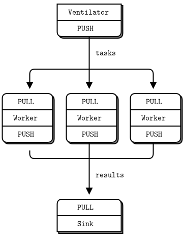

# 4장-신뢰할 수 있는 요청-응답 패턴 {-}

"3장-고급 요청-응답 패턴"은 ØMQ의 요청-응답 패턴의 고급 사용 방법을 예제와 함께 다루었습니다. 이 장에서는 신뢰성에 대한 일반적인 요구 사항을 보고 ØMQ의 핵심 요청-응답 패턴상에서 일련의 신뢰할 수 있는 메시징 패턴을 구축합니다.

이 장에서는 사용자관점의 요청-응답 패턴에 중점을 두고 있으며, 자체 ØMQ 아키텍처를 설계하는 데 도움이 되는 재사용 가능한 모델입니다.

* 게으른 해적 패턴(LPP) : 클라이언트 측의 신뢰할 수 있는 요청-응답
* 단순한 해적 패턴(SPP) : 부하 분산을 사용한 신뢰할 수 있는 요청-응답
* 편집증 해적 패턴(PPP) : 심박을 통한 신뢰할 수 있는 요청-응답
* 집사(majordomo) 패턴(MDP) : 서비스 지향 신뢰할 수 있는 메세지 대기열
* 타이타닉 패턴 : 디스크 기반 / 연결 해제된 신뢰할 수 있는 메세지 대기열
* 바이너리 스타 패턴 : 기본-백업 서버 장애조치
* 프리랜서 패턴 : 브로커 없는 신뢰할 수 있는 요청 응답

## 신뢰성이란 무엇인가?

"신뢰성"에 대해 말하는 대부분의 사람들은 의미하는 바를 모릅니다. 신뢰성은 장애의 관점에서만 정의할 수 있습니다. 즉, 일련의 잘 정의되고 이해된 장애를 다룰 수 있다면 이러한 장애의 관점에서 신뢰성이 있다고 할 수 있습니다. 그 이상도 이하도 아닙니다. 따라서 분산된 ØMQ 응용프로그램에서 가능한 장애 원인을 발생 확률에 따라 내림차순(확률이 높은 순)으로 보겠습니다.

* 응용프로그램 코드가 최악의 범죄자입니다. 충돌, 종료, 멈춤, 입력에 대한 무응답, 입력 처리 지연, 메모리 고갈 등이 발생할 수 있습니다.
* 시스템 코드 -- ØMQ의 시스템 코드를 사용하여 작성한 브로커는 응용프로그램 코드와 같은 이유로 죽을 수 있습니다. 시스템 코드는 응용프로그램 코드보다 더 신뢰할 수 있어야 하지만 여전히 충돌 및 잘못될 수 있으며 특히 느린 클라이언트에 대한 메시지를 대기열에 넣으려고 하면 메모리가 부족할 수 있습니다.
* 메시지 대기열 초과로 인한 메시지 유실이 발생합니다. 처리가 느린 클라이언트와 함께 동작하는 브로커(시스템 코드)로 인해 메시지 대기열은 초과될 수 있습니다. 대기열이 초과되면 메시지를 버리기 시작하여 메시지 "유실"이 발생합니다.
* 하드웨어 장애 -- 하드웨어는 장애가 발생하면 박스에서 실행되는 모든 프로세스들도 영향을 받게 됩니다.
* 네트워크 장애 -- 네트워크는 색다르게 장애가 발생합니다. 예를 들어 스위치의 일부 포트가 죽거나 네트워크 상의 일부 지점에 접근할 수 없게 됩니다.
* 전체 데이터 센터 장애 -- 데이터 센터는 번개, 지진, 화재, 일상적인 전력 장애, 냉각 장애로 영향을 받을 수 있습니다.

소프트웨어 시스템을 완전히 신뢰할 수 있게 만들어 이러한 모든 가능한 장애에 대응하게 하는 것은 엄청나게 어렵고 비용이 많이 드는 작업이며 이 책의 범위를 벗어납니다.

위 목록의 5개 사례는 대기업을 제외한 실제 요구사항의 99.9%를 해당됩니다.

## 신뢰성 설계

주제를 단순화하면, 신뢰성은 "코드가 멈추거나 충돌할 때 정상적으로 동작하게 유지"하는 것이며 이런 장애 상황을 "죽음"으로 줄여 이야기합니다. 그러나 우리가 정상적으로 동작하고 싶은 것은 단순한 메시지보다 더 복잡합니다. 우리는 각각의 핵심 ØMQ 메시징 패턴을 통해 코드가 죽더라도 동작하는 방법을 살펴보겠습니다.

하나씩 살펴보겠습니다.

* 요청-응답 : 서버가(요청을 처리하는 동안) 죽으면, 클라이언트는 응답을 받지 못하기 때문에 장애를 알 수 있습니다. 그런 다음 잠시 대기하다가 다시 시도하거나 다른 서버를 찾는 등의 작업을 수행할 수 있습니다. 클라이언트가 죽는 거에 대해서는, 지금은 "다른 무엇인가의 문제"로 제외합니다.
* 발행-구독 : 클라이언트가 죽으면(일부 데이터를 얻음) 서버는 클라이언트가 죽은 사실을 알지 못합니다. 발행-구독은 클라이언트에서 서버로 어떤 정보를 보내지 않기 때문입니다. 그러나 클라이언트는 새로운 경로(예 : 요청-응답)로 서버에 접속하여 "내가 놓친 모든 것을 재전송해주십시오"라고 요구할 수 있습니다. 서버가 죽는 것은 이 책의 범위가 아닙니다. 구독자는 자신이 너무 느리게 동작하지 않는지 검증하면서, 느릴 경우 시스템 관리자에게 경고를 보내거나 자살할 수 있습니다.
* 파이프라인 : 작업자가(작업 중) 죽게 되면 호흡기(이전 예제 : ventilator, worker, sink)는 알지 못합니다.  파이프라인은 흐르는 시간처럼 한 방향으로만 동작합니다. 그러나 하류 수집기(sink)는 하나의 작업이 완료되지 않았음을 감지하고 호흡기에게 "이봐, 324 작업 다시 보내!"라는 메시지를 보낼 수 있습니다. 호흡기 또는 수집기가 죽으면, 상류 클라이언트(worker)가 보낸 작업 배치는 대기하는 데 지쳐서 전체 데이터를 재전송할 수 있습니다. 우아하지는 않지만 시스템 코드는 문제가 될 만큼 자주 죽지는 않습니다.

* 그림 5 - 병렬 파이프라인(parallel pipeline)



이 장에서는 신뢰성 있는 메시징에서 요청-응답에만 초점을 맞출 것입니다.

기본적인 요청-응답 패턴(하나의 REQ 클라이언트 소켓이 REP 서버 소켓에 동기식 송/수신)은 매우 일반적인 유형의 장애가 발생합니다. 요청을 처리하는 동안 서버가 충돌하거나 네트워크가 송/수신 데이터를 유실하면 클라이언트는 영원히 멈추게 됩니다. 

OMQ의 요청-응답 패턴은 TCP보다 훨씬 좋습니다. ØMQ는 자동으로 상대들을 다시 연결하고 메시지를 부하 분산하는 등의 기능을 제공합니다. 그러나 실상황에서는 충분하지 않습니다. 기본적인 요청-응답 패턴을 신뢰할 수 있는 유일한 경우는 동일 프로세스에 있는 2개의 스레드들 간이며 장애가 될 수 있는 네트워크 또는 독자적인 서버 프로세스가 없어야 합니다.

그러나 약간의 추가 작업으로 이 겸손한 패턴은 분산된 네트워크에서 실제 작업을 위한 좋은 기반이 되며, 일련의 신뢰성 있는 요청-응답(reliable request-reply, RRR) 패턴들을 만들어 해적 패턴들(Pirate patterns)이라고 부르겠습니다.

경험상 클라이언트를 서버에 연결하는 방법에는 대략 3가지가 있습니다. 각각은 안정성에 대한 고유의 접근 방식이 필요합니다.

* 여러 개의 클라이언트들이 단일 서버와 직접 통신합니다. 
  + 사용 사례: 잘 알려진 단일 서버에 클라이언트들이 통신해야 합니다. 
  + 처리할 장애 유형 : 서버 충돌 및 재시작, 네트워크 연결 끊김.
* 여러 개의 클라이언트들이 브로커와 통신하며 브로커는 여러 개의 작업자들에게 작업을 분배합니다.
  + 사용 사례 : 서비스 지향 트랜잭션 처리. 
  + 처리할 장애 유형 : 작업자 충돌 및 재시작, 작업자 바쁜 작업 처리, 작업자 과부하, 대기열 충돌 및 재시작, 네트워크 연결 끊김.
* 여러 개의 클라이언트가 브로커 없이 여러 개의 서버들과 통신합니다. 
  + 사용 사례 : 이름 확인과 같은 분산 서비스(예 : DNS). 
  + 처리할 장애 유형 : 서비스 충돌 및 재시작, 서비스 바쁜 작업 처리, 서비스 과부하 및 네트워크 연결 끊김.

각 접근 방식에는 장단점이 있으며 함께 사용하는 경우가 있습니다. 세 가지 모두 자세히 살펴보겠습니다.

## 클라이언트 측면의 신뢰성(게으른 해적 패턴)

클라이언트 코드의 일부 변경하여 매우 간단하고 신뢰성 있는 요청-응답을 얻을 수 있습니다. 우리는 이것을 게으른 해적 패턴이라고 부릅니다. 수신 차단을 수행하는 대신 다음을 수행합니다. : 

* REQ 소켓을 폴링(poll)하고 응답이 도착했을 때만 수신합니다.
* 제한시간 내에 응답이 도착하지 않으면 요청을 재전송합니다.
* 여러 번의 요청들 후에도 여전히 응답이 없으면 트랜잭션을 포기합니다.

엄격한 송/수신 방식 외에 클라이언트에서 REQ 소켓을 사용하려 하면 오류가 발생합니다 (기술적으로 REQ 소켓은 송/수신 핑-퐁(ping-pong)을 위해 작은 유한 상태 머신을 구현합니다. 오류 코드는 "EFSM"입니다.). 해적 패턴으로 REQ 소켓을 사용하는 것을 어렵게 하며, 해적 패턴에서는 응답을 받기 전에 여러 요청(재시도)을 보낼 수 있어야 하기 때문입니다.

아주 무식한 방법으로 응답이 오기 전에 재요청 수행으로 인한 "EFSM" 오류가 발생하면 REQ 소켓을 닫고 다시 열어 요청하는 것입니다.

* lpclient.java: 게으른 해적 클라이언트

```java
#include <szmq/szmq.h>
#include <iostream>
#include <boost/format.hpp>
#define REQUEST_TIMEOUT 2500 // msecs, (>1000!)
#define REQUEST_RETRIES 3 // Before we abandon
#define SERVER_ENDPOINT "tcp://localhost:5555"

using namespace std;

szmq::detail::ClientSocketImpl& s_client_socket(szmq::Context *context)
{
    szmq::detail::ClientSocketImpl *client = new szmq::detail::ClientSocketImpl(ZMQ_REQ, szmq::ZMQ_CLIENT, *context);
    client->connect(szmq::SocketUrl(SERVER_ENDPOINT));
    return *client;
}

int main()
{
    szmq::Context context;
    szmq::detail::ClientSocketImpl& client = s_client_socket(&context);
    cout << "I: Connecting to server...\n";

    int sequence = 0;
    int retries_left = REQUEST_RETRIES;
    cout << "Entering while loop...\n";
    while(retries_left) // interrupt needs to be handled
    {
        // We send a request, then we get a reply
        auto request = boost::str(boost::format("%1%") % ++sequence);
        client.sendOne(szmq::Message::from(request));
        int expect_reply = 1;
        while(expect_reply)
        {
            cout << "Expecting reply....\n";
            std::vector<szmq::PollItem> items = {
			    {reinterpret_cast<void*>(*client), 0, ZMQ_POLLIN, 0}};
            szmq::poll(items, 1, REQUEST_TIMEOUT);    // 2.5 seconds timeout
            // Here we process a server reply and exit our loop if the
            // reply is valid. If we didn't get a reply we close the
            // client socket, open it again and resend the request. We
            // try a number times before finally abandoning:
            if (items[0].revents & ZMQ_POLLIN)
            {
                // We got a reply from the server, must match sequence
                auto reply = client.recvOne().read<std::string>();
                cout << "reply : " << reply << endl;
                if (stoi(reply) == sequence)
                {
                    cout << "I: server replied OK (" << reply << ")\n";
                    retries_left=REQUEST_RETRIES;
                    expect_reply = 0;
                }
                else
                {
                    cout << "E: malformed reply from server: " << reply << endl;
                }
            }
            else 
            {
                if(--retries_left == 0)
                {
                    cout << "E: Server seems to be offline, abandoning\n";
                    break;
                }
                else
                {
                    cout << "W: no response from server, retrying...\n";
                    cout << "I: reconnecting to server...\n";
                    client = std::move(s_client_socket(&context));
                    client.sendOne(szmq::Message::from(request));
                }
            }
        }
    }
    client.close();
    return 0;
}
```

대응하는 서버를 함께 구동합니다.

* lpserver.java : 게으른 해적 서버

```java
//  Lazy Pirate server
//  Binds REQ socket to tcp://*:5555
//  Like hwserver except:
//   - echoes request as-is
//   - randomly runs slowly, or exits to simulate a crash.

#include <szmq/szmq.h>
#include <iostream>
#include <boost/format.hpp>
#include <cstdlib>
#include <thread>

using namespace std;
int main (void)
{
    srand (static_cast<unsigned int>(std::time(0)));

    szmq::Context context;
    szmq::Socket<ZMQ_REP, szmq::ZMQ_SERVER> server(context);
    server.bind(szmq::SocketUrl("tcp://*:5555"));

    int cycles = 0;
    while (1) {
        auto request = server.recvOne().read<std::string>();
        cycles++;
        //  Simulate various problems, after a few cycles
        if (cycles > 3 && (rand() % 3 == 0)) {
            cout << "I: simulating a crash\n";
            break;
        }
        else
        if (cycles > 3 &&  (rand() % 3 == 0)) {
            cout << "I: simulating CPU overload\n";
            std::this_thread::sleep_for(std::chrono::milliseconds(2000)); 
        }
        cout << "I: normal request (" << request << ")\n";
        std::this_thread::sleep_for(std::chrono::milliseconds(1000));     //  Do some heavy work
        server.sendOne(szmq::Message::from(request));
    }
    server.close();
    return 0;
}
```

그림 47 - 게으른 해적 패턴(The Lazy Pirate Pattern)


이 테스트 케이스를 실행하려면 2개의 콘솔 창에서 클라이언트와 서버를 시작하십시오. 서버는 몇 개의 메시지들 받은 이후 무작위로 오동작합니다. 클라이언트의 응답을 확인할 수 있습니다. 다음은 서버부터의 전형적인 출력 예시입니다.

~~~{.bash}
PS D:\work\sook\src\szmq\examples> cl -EHsc -MTd lpserver.java szmq.lib
PS D:\work\sook\src\szmq\examples> cl -EHsc -MTd lpclient.java szmq.lib

PS D:\work\sook\src\szmq\examples> ./lpserver
I: normal request (1)
I: normal request (2)
I: normal request (3)
I: simulating a crash

PS D:\work\sook\src\szmq\examples> ./lpclient
I: Connecting to server...
Entering while loop...
Expecting reply....
reply : 1
I: server replied OK (1)
Expecting reply....
reply : 2
I: server replied OK (2)
Expecting reply....
reply : 3
I: server replied OK (3)
Expecting reply....
W: no response from server, retrying...
I: reconnecting to server...
Expecting reply....
W: no response from server, retrying...
I: reconnecting to server...
Expecting reply....
E: Server seems to be offline, abandoning
~~~

클라이언트는 각 메시지의 요청 순서에 따라 응답 순서가 정확히 왔는지 확인합니다 :
요청들이나 응답들이 유실되지 않거나, 응답들이 한번 이상 반환되지 않거나, 순서가 맞지 않을 경우를 확인합니다. 이 동작 방식이 실제로 동작한다고 확신할 때까지 테스트를 수행하시기 바랍니다. 양산 응용프로그램에서는 순서 번호는 필요하지 않지만 설계를 신뢰하는 데 도움이 됩니다.

클라이언트는 REQ 소켓의 엄격한 송/수신 주기를 지키기 위하여 무식한 강제 종료/재오픈을 수행합니다. REQ 소켓(sync) 대신에 DEALER 소켓(async)을 사용하고 싶겠지만 좋은 결정은 아닙니다. 첫째, 그것은 REQ 소켓 봉투들 모방하는 것이 복잡하고(그것이 무엇인지 잊었다면, 그것을 하고 싶지 않은 좋은 징조입니다), 둘째, 예상하지 못한 응답들을 받을 가능성이 있습니다.

* DEALER의 경우 멀티파트 메시지(multipart message) 형태로 첫 번째 파트는 공백 구분자(empty delimter), 두 번째 파트는 데이터(body)로 REP 소켓에 데이터 전송 필요합니다.

* hwclient2.java : REP 대신에 DEALER 소켓을 사용

```java
/**
**Hello World client
DEALER socket connect to tcp://localhost:5555
send "Hello" to server，expect receive "World"
*/
#include <szmq/szmq.h>
#include <iostream>
#include <boost/format.hpp>
using namespace std;

int main (void)
{
	cout << "Connecting to hello world server...\n";
	szmq::Context context;
	szmq::Socket<ZMQ_DEALER, szmq::ZMQ_CLIENT> requester(context);
    requester.connect(szmq::SocketUrl("tcp://localhost:5555"));
	int request_nbr;	//request number
	int reply_nbr = 0;  //receive respond number

	for (request_nbr = 0; request_nbr < 10; request_nbr++)
	{
		cout << "Sending request msg: Hello NO=" << request_nbr+1 << endl;
		//send request msg to server
		requester.sendMore(szmq::Message::from(""));  //send multi part msg,the first part is empty part
		requester.sendOne(szmq::Message::from("Hello")); //the second part is your request msg
		//receive reply msg
		if (requester.recvOne().read<std::string>().compare("") == 0){
			auto reply = requester.recvOne().read<std::string>();
			cout << boost::format("Received respond msg: %1% NO=%2%\n\n") % reply % ++reply_nbr;
		}
		//if the first part you received is not empty part,discard the whole ZMQ msg
		else{
			cout << "Discard the ZMQ message!\n";
		}
	}
	requester.close();
	return 0;
}

```

hwserver는 REP소켓을 사용하며 수정 없이 사용 가능합니다.

* 빌드 및 테스트

~~~{.bash}
PS D:\work\sook\src\szmq\examples> cl -EHsc  hwclient2.java szmq.lib

PS D:\work\sook\src\szmq\examples> ./hwserver
received request: Hello
received request: Hello
received request: Hello
received request: Hello
received request: Hello
received request: Hello
received request: Hello
received request: Hello
received request: Hello
received request: Hello

PS D:\work\sook\src\szmq\examples> ./hwclient2
Connecting to hello world server...
Sending request msg: Hello NO=1
Received respond msg: World NO=1
Sending request msg: Hello NO=2
Received respond msg: World NO=2
Sending request msg: Hello NO=3
Received respond msg: World NO=3
Sending request msg: Hello NO=4
Received respond msg: World NO=4
Sending request msg: Hello NO=5
Received respond msg: World NO=5
Sending request msg: Hello NO=6
Received respond msg: World NO=6
Sending request msg: Hello NO=7
Received respond msg: World NO=
Sending request msg: Hello NO=8
Received respond msg: World NO=8
Sending request msg: Hello NO=9
Received respond msg: World NO=9
Sending request msg: Hello NO=10
Received respond msg: World NO=10
~~~

클라이언트에서만 장애를 처리하는 것은 일련의 클라이언트들이 단일 서버와 통신하는 경우에만 동작합니다. 서버 장애를 처리할 수 있는 경우는 동일 서버를 재시작하여 복구하는 것을 의미합니다. 서버 하드웨어의 전원 공급 중단과 같은 영구적인 오류가 있는 경우 이 접근 방식이 동작하지 않습니다. 서버의 응용프로그램 코드는 보통 대부분의 아키텍처에서 가장 큰 장애 원인이므로 단일 서버에 의존하는 것은 좋은 생각이 아닙니다.

게으른 해적 패턴의 장단점은 다음과 같습니다.

* 장점 : 이해와 구현이 간단합니다.
* 장점 : 기존 클라이언트 및 서버 응용프로그램 코드로 쉽게 동작합니다.
* 장점 : ØMQ는 동작할 때까지 자동으로 재연결을 재시도합니다.
* 단점 : 백업 또는 대체 서버들로 장애조치하지 않습니다.

* 하나의 프로세스에서 게으른 해적 클라이언트(lpclient)와 서버(lpserver)를 구동하기 위한 예제는 다음과 같습니다(lppattern.c).
클라이언트와 서버의 숫자를 각각 1개로 하는 것에 주의 필요합니다.


## 신뢰할 수 있는 큐잉(단순한 해적 패턴)

두 번째 접근 방식은 대기열 프록시를 사용하여 게으른 해적 패턴을 확장하여 투명하게 여러 대의 서버들과 통신하게 하며, 서버들은 좀 더 정확하게 "작업자들"라고 부를 수 있습니다. 최소한의 구동 모델인 단순한 해적 패턴부터 시작하여 단계별로 개발할 것입니다.

단순한 해적 패턴에서 작업자들은 상태 비저장입니다. 응용프로그램은 데이터베이스와 같이 공유 상태가 필요하지만 메시징 프레임워크를 설계할 당시에는 인지하지 못할 수도 있습니다. 대기열 프록시가 있다는 것은 클라이언트가 작업자들이 오가는 것을 인지하지 못하는 것을 의미합니다. 한 작업자가 죽을 경우, 다른 작업자가 인계받습니다. 이것은 멋지고 간단한 전송 방식이지만 하나의 실제 약점으로, 중앙 대기열 자체가 단일 실패 지점으로 관리해야 할 문제가 됩니다.

* 상태 비저장(stateless)는 서버가 클라이언트의 이전 상태를 저장하지 않아 클라이언트의 이전 요청과도 무관한 각각의 요청을 독립적으로 처리하게 합니다.(예 : http)

그림 48 - 단순한 해적 패턴(The Simple Pirate Pattern)


대기열 프록시의 기본은 "3장-고급 요청-응답 패턴"의 부하 분산 브로커입니다. "죽거나 차단된 작업자들을 처리하기 위해 최소한 해야 할 것은 무엇입니까?" 실제 해야 할 것은 의외로 적습니다. 우리는 이미 클라이언트들에서 재시도 기능을 부가한 적 있으며 따라서 부하 분산 패턴을 사용하면 꽤 잘 작동할 것입니다. 이것은 QMQ의 철학에 부합하며 P2P(peer-to-peer)와 같은 요청-응답 패턴 사이에 프록시를 추가하여 확장할 수 있습니다.

여기에는 특별한 클라이언트가 필요하지 않습니다.
이전의 게으른 해적 클라이언트(lpclient)를 사용할 수 있으며, 대기열은 부하 분산 브로커의 기본 작업과 동일합니다 : 

* spqueue.java : 단순한 해적 브로커

```java
//  Simple Pirate broker
//  This is identical to load-balancing pattern, with no reliability
//  mechanisms. It depends on the client for recovery. Runs forever.
#include <szmq/szmq.h>
#include <iostream>
#include <boost/format.hpp>
#include <queue>
#define WORKER_READY   "\001"      //  Signals worker is ready

using namespace std;

int main (void)
{
    szmq::Context context;
    szmq::Socket<ZMQ_ROUTER, szmq::ZMQ_SERVER> frontend(context);    
    szmq::Socket<ZMQ_ROUTER, szmq::ZMQ_SERVER> backend(context);
    frontend.bind(szmq::SocketUrl("tcp://*:5555"));  //  For clients
    backend.bind(szmq::SocketUrl("tcp://*:5556"));   //  For workers

    //  Queue of available workers
    std::queue<szmq::Message> worker_queue;
    
    //  The body of this example is exactly the same as lbbroker2.
    //  .skip
    while (true) {
        std::vector<szmq::PollItem> items = {
            {reinterpret_cast<void*>(*backend), 0, ZMQ_POLLIN, 0},
            {reinterpret_cast<void*>(*frontend), 0, ZMQ_POLLIN, 0}};
        //  Poll frontend only if we have available workers
        szmq::poll(items, worker_queue.size() ? 2 : 1, -1);
        //  Handle worker activity on backend
        if (items [0].revents & ZMQ_POLLIN) {
            //  Use worker identity for load-balancing
            auto msgs = backend.recvMultiple();
            auto identity = msgs.front();   //worker ID
            worker_queue.push(identity);
			msgs.erase(msgs.begin()); // delete the worker_id
			msgs.erase(msgs.begin()); // delete the empty delimiter	

            //  Forward message to client if it's not a READY
            auto client_id = msgs.front();
              //  If client reply, send rest back to frontend            
            if ((client_id.read<std::string>().compare(WORKER_READY)) == 0)    
                msgs.clear();
            else
                frontend.sendMultiple(msgs);	// clientID + "" + reply
        }
        if (items [1].revents & ZMQ_POLLIN) {
            //  Get client request, route to first available worker
            auto msgs = frontend.recvMultiple();
            msgs.insert(msgs.begin(), szmq::Message::from(std::string("")));
			msgs.insert(msgs.begin(), worker_queue.front());			
            worker_queue.pop();
            backend.sendMultiple(msgs);  // WorkerID + "" + ClientID + "" + 
        }
    }
    //  When we're done, clean up properly
	while (worker_queue.size()) {
		worker_queue.pop();
	}	
    frontend.close();
    backend.close();
    return 0;
    //  .until
}
```

다음은 작업자 코드로, 게으른 해적 서버(lpserver)를 가져 와서 부하분산 패턴에 맞게 적용하였습니다.(REQ 소켓 및 "준비(ready)" 신호 사용).

* spworker.java: 단순한 해적 작업자

```java
//  Simple Pirate worker
//  Connects REQ socket to tcp://*:5556
//  Implements worker part of load-balancing
#include <szmq/szmq.h>
#include <iostream>
#include <iomanip>
#include <sstream>
#include <boost/format.hpp>
#include <cstdlib>
#include <thread>
#define WORKER_READY   "\001"      //  Signals worker is ready

using namespace std;
int main (void)
{
    srand (static_cast<unsigned int>(std::time(0)));
    szmq::Context context;
    szmq::Socket<ZMQ_REQ, szmq::ZMQ_CLIENT> worker(context);
    std::stringstream identity;
    identity << std::hex << std::uppercase
        << std::setw(4) << std::setfill('0') << rand() % (0x10000) << "-"
        << std::setw(4) << std::setfill('0') << rand() % (0x10000);
    worker.setId(identity.str());
    worker.connect(szmq::SocketUrl("tcp://localhost:5556"));

    cout << boost::format("I: (%1%) worker ready\n") % identity.str();
    worker.sendOne(szmq::Message::from(WORKER_READY));

    int cycles = 0;
    while (true) {
        auto msgs = worker.recvMultiple();
        cycles++;
        //  Simulate various problems, after a few cycles
        if (cycles > 3 && (rand() % 5 == 0)) {
            cout << boost::format("I: (%1%) simulating a crash\n") % identity.str();
            break;
        }
        else
        if (cycles > 3 &&  (rand() % 5 == 0)) {
            cout << boost::format("I: (%1%) simulating CPU overload\n") % identity.str();
            std::this_thread::sleep_for(std::chrono::milliseconds(3000)); 
        }
        cout << boost::format("I: (%1%) normal reply\n") % identity.str();
        std::this_thread::sleep_for(std::chrono::milliseconds(1000));     //  Do some heavy work
        worker.sendMultiple(msgs);
    }
    worker.close();
    return 0;
}
```

이를 테스트하려면 순서에 관계없이 여러 개의 작업자들, 게으른 해적 클라이언트(lpclient) 및 대기열(spqueue)을 시작하십시오. 그러면 결국 작업자들이 모두 중단되는 것을 볼 수 있으며 클라이언트는 재시도(3회)를 수행한 후 포기합니다. 대기열은 멈추지 않으며 작업자들과 클라이언트들을 계속해서 재시작할 수 있습니다. 이 모델은 어떤 수량의 클라이언트들과 작업자라도 함께 작동합니다.

* 빌드 및 테스트

~~~{.bash}
PS D:\work\sook\src\szmq\examples> cl -EHsc -MTd spqueue.java szmq.lib
PS D:\work\sook\src\szmq\examples> cl -EHsc -MTd spworker.java szmq.lib

PS D:\work\sook\src\szmq\examples> ./spqueue

PS D:\work\sook\src\szmq\examples> ./spworker
I: (3CE5-138F) worker ready
I: (3CE5-138F) normal reply
I: (3CE5-138F) normal reply
I: (3CE5-138F) normal reply
I: (3CE5-138F) simulating a crash

PS D:\work\sook\src\szmq\examples> ./lpclient
I: Connecting to server...
Entering while loop...
Expecting reply....
After polling
Polling Done..
W: no response from server, retrying...
I: reconnecting to server...
Expecting reply....
After polling
Polling Done..
W: no response from server, retrying...
I: reconnecting to server...
Expecting reply....
After polling
Polling Done..
E: Server seems to be offline, abandoning
~~~

* 원도우 파워쉘(Powershell)에서 구동 중인 프로세스 검색 및 중지하는 방법은 다음과 같습니다.

~~~{.bash}
 tasklist | findstr spqueue
spqueue.exe                   9276 Console                    1      4,812 K
 stop-process -name spqueue
## "taskkill /F /IM" 사용할 수도 있음
 tasklist | findstr spqueue
~~~

* 하나의 프로세스에서 게으른 해적 클라이언트(lpclient)와 단순한 해적 브로커(spqueue), 단순한 해적 작업자(spworker)를 구동하기 위한 예제는 다음과 같습니다(sppattern.c).

* sppattern.java : inproc를 통한 spqueue와 spworker, lpclient 함께 구동

```java
//  Simple Pirate broker
//  This is identical to load-balancing pattern, with no reliability
//  mechanisms. It depends on the client for recovery. Runs forever.
#include <szmq/szmq.h>
#include <iostream>
#include <iomanip>
#include <sstream>
#include <thread>
#include <boost/format.hpp>
#include <queue>
#define NBR_CLIENTS 3
#define NBR_WORKERS 3
#define REQUEST_TIMEOUT 2500 // msecs, (>1000!)
#define REQUEST_RETRIES 3 // Before we abandon
#define FRONTEND "inproc://frontend"
#define BACKEND "inproc://backend"
#define WORKER_READY   "\001"      //  Signals worker is ready

using namespace std;

szmq::detail::ClientSocketImpl& s_client_socket(szmq::Context& context)
{
    szmq::detail::ClientSocketImpl *client = new szmq::detail::ClientSocketImpl(ZMQ_REQ, szmq::ZMQ_CLIENT, context);
    client->connect(szmq::SocketUrl(FRONTEND));
    return *client;
}

//  Lazy Pirate client using REQ socket
//
static void *
client_task (void *ctx)
{
    szmq::Context *context = (szmq::Context *)ctx;
    szmq::detail::ClientSocketImpl& client = s_client_socket(*context);
    client.connect(szmq::SocketUrl(FRONTEND));
    cout << "I: Connecting to server...\n";

    int sequence = 0;
    int retries_left = REQUEST_RETRIES;
    cout << "Entering while loop...\n";
    while(retries_left) // interrupt needs to be handled
    {
        // We send a request, then we get a reply
        auto request = boost::str(boost::format("%1%") % ++sequence);
        client.sendOne(szmq::Message::from(request));
        int expect_reply = 1;
        while(expect_reply)
        {
            cout << "Expecting reply....\n";
            std::vector<szmq::PollItem> items = {
			    {reinterpret_cast<void*>(*client), 0, ZMQ_POLLIN, 0}};
            cout << "After polling\n";
            szmq::poll(items, 1, REQUEST_TIMEOUT);    // 2.5 seconds timeout
            cout << "Polling Done.. \n";
            // Here we process a server reply and exit our loop if the
            // reply is valid. If we didn't get a reply we close the
            // client socket, open it again and resend the request. We
            // try a number times before finally abandoning:
            if (items[0].revents & ZMQ_POLLIN)
            {
                // We got a reply from the server, must match sequence
                auto reply = client.recvOne().read<std::string>();
                cout << "reply : " << reply << endl;
                if (stoi(reply) == sequence)
                {
                    cout << "I: server replied OK (" << reply << ")\n";
                    retries_left=REQUEST_RETRIES;
                    expect_reply = 0;
                }
                else
                {
                    cout << "E: malformed reply from server: " << reply << endl;
                }
            }
            else 
            {
                if(--retries_left == 0)
                {
                    cout << "E: Server seems to be offline, abandoning\n";
                    break;
                }
                else
                {
                    cout << "W: no response from server, retrying...\n";
                    cout << "I: reconnecting to server...\n";
                    client = std::move(s_client_socket(*context));
                    client.sendOne(szmq::Message::from(request));
                }
            }
        }
    }
    client.close();
    return NULL;
}

//  Lazy Pirate server using REQ socket
//
static void *
worker_task (void *ctx)
{
    szmq::Context *context = (szmq::Context *)ctx;
    szmq::Socket<ZMQ_REQ, szmq::ZMQ_CLIENT> worker(*context);
    srand (static_cast<unsigned int>(std::time(0)));
    std::stringstream identity;
    identity << std::hex << std::uppercase
        << std::setw(4) << std::setfill('0') << rand() % (0x10000) << "-"
        << std::setw(4) << std::setfill('0') << rand() % (0x10000);
    worker.setId(identity.str());
    worker.connect(szmq::SocketUrl(BACKEND));

    cout << boost::format("I: (%1%) worker ready\n") % identity.str();
    worker.sendOne(szmq::Message::from(WORKER_READY));

    int cycles = 0;
    while (true) {
        auto msgs = worker.recvMultiple();
        cycles++;
        //  Simulate various problems, after a few cycles
        if (cycles > 3 && (rand() % 5 == 0)) {
            cout << boost::format("I: (%1%) simulating a crash\n") % identity.str();
            break;
        }
        else
        if (cycles > 3 &&  (rand() % 5 == 0)) {
            cout << boost::format("I: (%1%) simulating CPU overload\n") % identity.str();
            std::this_thread::sleep_for(std::chrono::milliseconds(3000)); 
        }
        cout << boost::format("I: (%1%) normal reply\n") % identity.str();
        std::this_thread::sleep_for(std::chrono::milliseconds(1000));     //  Do some heavy work
        worker.sendMultiple(msgs);
    }
    worker.close();
    return 0;
}

int main (void)
{
    szmq::Context context;
    szmq::Socket<ZMQ_ROUTER, szmq::ZMQ_SERVER> frontend(context);    
    szmq::Socket<ZMQ_ROUTER, szmq::ZMQ_SERVER> backend(context);
    frontend.bind(szmq::SocketUrl(FRONTEND));  //  For clients
    backend.bind(szmq::SocketUrl(BACKEND));   //  For workers

    int worker_nbr;
    for (worker_nbr = 0; worker_nbr < NBR_WORKERS; worker_nbr++) {
        thread worker(&worker_task, (void *)&context);
        worker.detach();
        std::this_thread::sleep_for(std::chrono::milliseconds(1000)); 
    }
    
    int client_nbr;
    for (client_nbr = 0; client_nbr < NBR_CLIENTS; client_nbr++) {
        thread client(&client_task, (void *)&context);
        client.detach();
    }

    //  Queue of available workers
    std::queue<szmq::Message> worker_queue;
    
    //  The body of this example is exactly the same as lbbroker2.
    //  .skip
    while (true) {
        std::vector<szmq::PollItem> items = {
            {reinterpret_cast<void*>(*backend), 0, ZMQ_POLLIN, 0},
            {reinterpret_cast<void*>(*frontend), 0, ZMQ_POLLIN, 0}};
        //  Poll frontend only if we have available workers
        szmq::poll(items, worker_queue.size() ? 2 : 1, -1);
        //  Handle worker activity on backend
        if (items [0].revents & ZMQ_POLLIN) {
            //  Use worker identity for load-balancing
            auto msgs = backend.recvMultiple();
            auto identity = msgs.front();   //worker ID
            worker_queue.push(identity);
			msgs.erase(msgs.begin()); // delete the worker_id
			msgs.erase(msgs.begin()); // delete the empty delimiter	

            //  Forward message to client if it's not a READY
            auto client_id = msgs.front();
              //  If client reply, send rest back to frontend            
            if ((client_id.read<std::string>().compare(WORKER_READY)) == 0)    
                msgs.clear();
            else
                frontend.sendMultiple(msgs);	// clientID + "" + reply
        }
        if (items [1].revents & ZMQ_POLLIN) {
            //  Get client request, route to first available worker
            auto msgs = frontend.recvMultiple();
            msgs.insert(msgs.begin(), szmq::Message::from(std::string("")));
			msgs.insert(msgs.begin(), worker_queue.front());			
            worker_queue.pop();
            backend.sendMultiple(msgs);  // WorkerID + "" + ClientID + "" + 
        }
    }
    //  When we're done, clean up properly
	while (worker_queue.size()) {
		worker_queue.pop();
	}	
    frontend.close();
    backend.close();
    return 0;
    //  .until
}
```

* 빌드 및 테스트

~~~{.bash}
PS D:\work\sook\src\szmq\examples> cl  sppattern.java szmq.lib

PS D:\work\sook\src\szmq\examples> ./sppattern
I: (55A7-3CAC) worker ready
I: (7FA4-3CAF) worker ready
I: (29A0-3CB3) worker ready
I: Connecting to server...
Entering while loop...
Expecting reply....
After polling
I: Connecting to server...
Entering while loop...
I: (55A7-3CAC) normal reply
I: Connecting to server...
Entering while loop...
I: (7FA4-3CAF) normal reply
I: (29A0-3CB3) normal reply
Expecting reply....
Expecting reply....
After polling
After polling
Polling Done..
reply : 1
I: server replied OK (1)
Polling Done..
Polling Done..
Expecting reply....
After polling
reply : 1
I: server replied OK (1)
I: (55A7-3CAC) normal reply
I: (7FA4-3CAF) normal reply
reply : 1
I: server replied OK (1)
Expecting reply....
After polling
I: (29A0-3CB3) normal reply
~~~

## 튼튼한 큐잉(편집증 해적 패턴)

그림 49 - 편집증 해적 패턴


단순한 해적 대기열 패턴은 기존 2가지 기존 패턴(게으른 해적, 부하 분산 브로커)의 조합이기 때문에 잘 작동합니다. 하지만 몇 가지 약점이 있습니다.

* [Heatbeat : Queue to Worker] 대기열 프록시 장애와 재시작의 경우 안정적이지 않습니다. 클라이언트는 복구되지만 작업자는 복구되지 않습니다. ØMQ는 작업자의 소켓을 자동으로 다시 연결하지만, 재시작된 대기열 프록시에 작업자는 준비(ready) 신호를 보내지 않았으므로 브로커의 리스트(zlist_t)상에 존재하지 않아  클라이언트의 요청을 처리할 수 없습니다. 이 문제를 해결하려면 대기열 프록시에서 작업자로 심박을 전송하여 작업자는 대기열 프록시가 장애가 일어난 시각을 알 수 있습니다.
*  [Heatbeat : Worker to Queue] 대기열 프록시는 작업자 장애를 감지하지 않으므로, 작업자가 유휴 상태에서 죽으면 클라이언트가 대기열 프록시로 요청을 보낼 때까지 죽은 작업자를 대기열 프록시(zlist_t)에서 제거할 수 없습니다. 클라이언트는 아무것도 기다리지 않고 재시도합니다. 중대한 문제는 아니지만 좋지 않습니다. 제대로 된 작업을 수행하려면, 작업자가 대기열 프록시로 심박을 전송하여 대기열 프록시의 송/수신 단계에서 죽은 작업자를 감지할 수 있습니다.

위의 약점을 보완하여 제대로 된 편집증 해적 패턴으로 수정하겠습니다.

이전 예제에서는 작업자(spworker)에 대해 REQ 소켓을 사용했지만, 편집증 해적 작업자의 경우 DEALER 소켓으로 바꿉니다. DEALER 소켓을 사용함으로 REQ의 잠금 단계 송/수신(sync) 대신에 언제든지 메시지 송/수신할(async) 수 있는 장점이 있습니다. DEALER 소켓의 단점은 봉투(empty delimiter + body) 관리가 필요합니다(이 개념에 대한 배경 지식은 "3장-고급 요청-응답 패턴"을 참조하시기 바랍니다.).

우리는 계속 게으른 해적 클라이언트를 사용하겠으며, 편집증 해적 대기열 프록시의 코드는 다음과 같습니다. 다음과 같습니다.

* worker.h : 작업자 및 작업자 리스트를 처리하는 코드

``` cpp
#include <szmq/szmq.h>
#include <iostream>
#include <iomanip>
#include <sstream>
#include <thread>
#include <boost/format.hpp>
#include <list>

#define HEARTBEAT_LIVENESS  3       //  3-5 is reasonable
#define HEARTBEAT_INTERVAL  1000    //  msecs

using namespace std;

class Worker {
	public:
		Worker() noexcept{
			std::stringstream ss;
			ss << std::hex << std::uppercase
				<< std::setw(4) << std::setfill('0') << rand() % (0x10000) << "-"
				<< std::setw(4) << std::setfill('0') << rand() % (0x10000);
			identity = ss.str();
			id_string = ss.str();
			expiry = szmq::now() + HEARTBEAT_INTERVAL * HEARTBEAT_LIVENESS;
		} 
		Worker(std::string id) noexcept{
			identity = id;
			id_string = szmq::strhex(id);
			expiry = szmq::now() + HEARTBEAT_INTERVAL * HEARTBEAT_LIVENESS;
		} 
		
		void setId(std::string id) noexcept {
			identity = id;
			id_string = szmq::strhex(id);
		}
		
		std::string getId() noexcept {
			return identity;
		}

		std::string getIdStr() noexcept {
			return id_string;
		}

		void setExpiry(uint64_t value) noexcept {
			expiry = value;
		}
		
		uint64_t getExpiry() noexcept {
			return expiry;
		}

		/**
		* Worker is copyable
		*/
		Worker(Worker const& other) noexcept{
			identity = other.identity;
			id_string = other.id_string;
			expiry = other.expiry;
		}
		Worker& operator=(Worker const& other) noexcept {
			identity = other.identity;
			id_string = other.id_string;
			expiry = other.expiry;
			return *this;
		}
		
		~Worker() {};
			
	private:
		std::string identity;	//  Identity of worker
		std::string id_string;  // Printable identity
		uint64_t expiry;			//  Expires at this time
};

class Workers {
	public:	
		~Workers() noexcept{
			while(worker_list.size())
				worker_list.pop_back();
		}
		
		void push(Worker wrk) noexcept{
			worker_list.push_back(wrk);
		}

		void ready(Worker self) noexcept{
			for (list<Worker>::iterator it = worker_list.begin(); it != worker_list.end(); ++it) {
				if(self.getIdStr().compare(it->getIdStr())==0){
					worker_list.erase(it);
					break;
				}
			}
			worker_list.push_back(self);
		}
		
		int size() noexcept{
			return worker_list.size();
		}
		
		bool isEmpty() noexcept{
			return worker_list.empty();
		}
		list<Worker>::iterator begin() noexcept {
			return worker_list.begin();
		}

		list<Worker>::iterator end() noexcept {
			return worker_list.end();
		}

		Worker front() noexcept {
			return worker_list.front();
		}
		Worker next() noexcept {
				auto wrk = worker_list.front();
				worker_list.pop_front();
				return wrk;
		}
		void pop() noexcept {
			worker_list.pop_front();
		}
		void purge() noexcept{
			while(worker_list.size()){
                auto it = worker_list.front();
				if(szmq::now() < it.getExpiry())
					break;
				else
					worker_list.pop_front();
			}
		}
	private:
		std::list<Worker> worker_list;
};
```

* ppqueue.java : 편집증 해적 대기열

```java
//  Paranoid Pirate queue
#include <szmq/szmq.h>
#include <iostream>
#include <iomanip>
#include <sstream>
#include <thread>
#include <boost/format.hpp>
#include <queue>
#include "worker.h"
#define HEARTBEAT_LIVENESS  3       //  3-5 is reasonable
#define HEARTBEAT_INTERVAL  1000    //  msecs
//  Paranoid Pirate Protocol constants
#define PPP_READY       "\001"      //  Signals worker is ready
#define PPP_HEARTBEAT   "\002"      //  Signals worker heartbeat
#define FRONTEND "tcp://*:5555"
#define BACKEND "tcp://*:5556"

using namespace std;

//  .split main task
//  The main task is a load-balancer with heartbeating on workers so we
//  can detect crashed or blocked worker tasks:

int main (void)
{
    szmq::Context context;
    szmq::Socket<ZMQ_ROUTER, szmq::ZMQ_SERVER> frontend(context);    
    szmq::Socket<ZMQ_ROUTER, szmq::ZMQ_SERVER> backend(context);
    frontend.bind(szmq::SocketUrl(FRONTEND));  //  For clients
    backend.bind(szmq::SocketUrl(BACKEND));   //  For workers

    //  List of available workers
    Workers workers;

    //  Send out heartbeats at regular intervals
    int64_t heartbeat_at = szmq::now() + HEARTBEAT_INTERVAL;

    while (true) {
        std::vector<szmq::PollItem> items = {
        {reinterpret_cast<void*>(*backend), 0, ZMQ_POLLIN, 0},
        {reinterpret_cast<void*>(*frontend), 0, ZMQ_POLLIN, 0}}; 
        //  Poll frontend only if we have available workers
        //cout << "workers queue size : " << workers.size() << endl;
        szmq::poll(items, workers.size()? 2 : 1, HEARTBEAT_INTERVAL);
        //  Handle worker activity on backend
        if (items [0].revents & ZMQ_POLLIN) {
            //  Use worker identity for load-balancing
            auto msgs = backend.recvMultiple();
			auto identity = msgs.front();
            //  Any sign of life from worker means it's ready
            workers.ready(Worker(identity.read<std::string>()));
			msgs.erase(msgs.begin()); // delete the worker_id
			//msgs.erase(msgs.begin()); // delete the empty delimiter	

            //  Validate control message, or return reply to client            
            if (msgs.size() == 1) {
                auto client_id = msgs.front().read<std::string>();
                if (client_id.compare(PPP_READY)
                && client_id.compare(PPP_HEARTBEAT)) {
                    cout <<"E: invalid message from worker";
                    msgs.front().dump();
                }
                msgs.clear();
            }
            else
                frontend.sendMultiple(msgs);
        }
        if (items [1].revents & ZMQ_POLLIN) {
            //  Now get next client request, route to next worker
            auto msgs = frontend.recvMultiple();
            auto identity = workers.next().getId();
            //msgs.insert(msgs.begin(), szmq::Message::from(std::string("")));
            msgs.insert(msgs.begin(), szmq::Message::from(identity));
            backend.sendMultiple(msgs);
        }
        //  .split handle heartbeating
        //  We handle heartbeating after any socket activity. First, we send
        //  heartbeats to any idle workers if it's time. Then, we purge any
        //  dead workers:
        if (szmq::now() >= heartbeat_at) {
            std::vector<szmq::Message> msgs;
             for (list<Worker>::iterator it = workers.begin(); it != workers.end(); ++it) {
                    msgs.insert(msgs.begin(), szmq::Message::from(PPP_HEARTBEAT));
                    //msgs.insert(msgs.begin(), szmq::Message::from(std::string("")));
                    msgs.insert(msgs.begin(), szmq::Message::from(it->getId()));
                    backend.sendMultiple(msgs); msgs.clear();
            }
            heartbeat_at = szmq::now() + HEARTBEAT_INTERVAL;
        }
        workers.purge();
    }
    //  When we're done, clean up properly
    frontend.close();
    backend.close();
    return 0;
}
```

대기열 프록시는 작업자들에게 심박 전송으로 부하 분산 패턴을 확장합니다. 심박은 바로 이해하기 어려운 "단순한(simple)" 것 중 하나입니다. 이에 대해서는 잠시 후에 설명하겠습니다.

다음 코드는 편집증 해적 작업자입니다.。

* ppworker.java : 편집증 해적 작업자

```java
//  Paranoid Pirate worker

#include <szmq/szmq.h>
#include <thread>
#include <cstdlib>
#include <iostream>
#include <boost/format.hpp>
#define HEARTBEAT_LIVENESS  3       //  3-5 is reasonable
#define HEARTBEAT_INTERVAL  1000    //  msecs
#define INTERVAL_INIT       1000    //  Initial reconnect
#define INTERVAL_MAX       32000    //  After exponential backoff

//  Paranoid Pirate Protocol constants
#define PPP_READY       "\001"      //  Signals worker is ready
#define PPP_HEARTBEAT   "\002"      //  Signals worker heartbeat
#define BACKEND "tcp://localhost:5556"
//  Helper function that returns a new configured socket
//  connected to the Paranoid Pirate queue
using namespace std;

static void 
s_worker_socket (void *socket) {
    auto worker = (szmq::detail::ClientSocketImpl *)socket;
    worker->connect(szmq::SocketUrl(BACKEND));
    //  Tell queue we're ready for work
    cout << "I: worker ready\n" ;
    worker->sendOne(szmq::Message::from(PPP_READY));
    return ;
}

//  .split main task
//  We have a single task that implements the worker side of the
//  Paranoid Pirate Protocol (PPP). The interesting parts here are
//  the heartbeating, which lets the worker detect if the queue has
//  died, and vice versa:

int main (void)
{
    szmq::Context ctx;
    szmq::Socket<ZMQ_DEALER, szmq::ZMQ_CLIENT> worker(ctx);
    worker.connect(szmq::SocketUrl(BACKEND));
    s_worker_socket((void *)&worker);

    //  If liveness hits zero, queue is considered disconnected
    size_t liveness = HEARTBEAT_LIVENESS;
    size_t interval = INTERVAL_INIT;

    //  Send out heartbeats at regular intervals
    uint64_t heartbeat_at = szmq::now() + HEARTBEAT_INTERVAL;

    std::srand (static_cast<unsigned int>(std::time(0)));
    int cycles = 0;
    while (true) {
        std::vector<szmq::PollItem> items = {
                {reinterpret_cast<void *>(*worker), 0, ZMQ_POLLIN, 0}}; 
        szmq::poll(items, 1, HEARTBEAT_INTERVAL);
        if (items [0].revents & ZMQ_POLLIN) {
            //  Get message
            //  - 3-part envelope + content -> requestd
            //  - 1-part HEARTBEAT -> heartbeat
            auto msgs = worker.recvMultiple(); 
            //if(msgs.front().read<std::string>().compare("")==0)
            //    msgs.erase(msgs.begin());
            //  .split simulating problems
            //  To test the robustness of the queue implementation we 
            //  simulate various typical problems, such as the worker
            //  crashing or running very slowly. We do this after a few
            //  cycles so that the architecture can get up and running
            //  first:
            if (msgs.size() == 3) {
                cycles++;
                if (cycles > 3 && (rand() % 5) == 0) {
                    cout << "I[3-Part]: simulating a crash\n";
                    msgs.clear();
                    break;
                }
                else
                if (cycles > 3 && (rand() % 5) == 0) {
                    cout <<"I[3-Part]: simulating CPU overload\n";
                    this_thread::sleep_for(chrono::milliseconds(3000));

                }
                cout << "I[3-Part]: normal reply\n";
                worker.sendMultiple(msgs);
                liveness = HEARTBEAT_LIVENESS;
                this_thread::sleep_for(chrono::milliseconds(1000));  //  Do some heavy work
            }
            else
            //  .split handle heartbeats
            //  When we get a heartbeat message from the queue, it means the
            //  queue was (recently) alive, so we must reset our liveness
            //  indicator:            
            if (msgs.size() == 1) {
                auto msg = msgs.front();
                if(msg.read<std::string>().compare(PPP_HEARTBEAT)==0)
                    liveness = HEARTBEAT_LIVENESS;
                else
                {
                    cout << "E[1-Part]: invalid message\n";
                    msg.dump();
                }
            }
            else {
                cout << "E(size : none): invalid message\n";
                for (auto it = begin (msgs); it != end (msgs); ++it) 
                    it->dump();  
            }
            interval = INTERVAL_INIT;
        }
        else
        //  .split detecting a dead queue
        //  If the queue hasn't sent us heartbeats in a while, destroy the
        //  socket and reconnect. This is the simplest most brutal way of
        //  discarding any messages we might have sent in the meantime:
        if (--liveness == 0) {
            cout << "W: heartbeat failure, can't reach queue\n";
            cout << boost::format("W: reconnecting in %1% msec...\n") % interval;
            this_thread::sleep_for(chrono::milliseconds(interval));

            if (interval < INTERVAL_MAX)
                interval *= 2;            
            szmq::Socket<ZMQ_DEALER, szmq::ZMQ_CLIENT> worker(ctx);
            worker.connect(szmq::SocketUrl(BACKEND));
            s_worker_socket((void *)&worker);
            liveness = HEARTBEAT_LIVENESS;
        }
        //  Send heartbeat to queue if it's time
        if (szmq::now() > heartbeat_at) {
            heartbeat_at = szmq::now() + HEARTBEAT_INTERVAL;
            cout << "I: worker send heartbeat to broker\n";
            worker.sendOne(szmq::Message::from(PPP_HEARTBEAT));
        }
    }
    worker.close();
    return 0;
}
```

예제에 대하여 부가적인 설명은 다음과 같습니다.

* 코드에는 이전과 같이 장애 상황(crash, CPU overload)이 포함되어 있습니다. 이로 인해 (a)디버그 하기가 매우 어렵고,  (b)재사용하기가 위험합니다. 디버그 하기 위해서는 장애 상황 비활성화가 필요합니다.
* 작업자는 게으른 해적 클라이언트용으로 설계한 것과 유사한 재연결 전략을 사용합니다. 두 가지 주요 차이점이 있습니다. (a)지수 백오프(3회 응답 대기 후 "interval *= 2"하여 최대 32초간 대기)를 수행하고, (b)무한히 재시도합니다 (클라이언트는 실패를 보고하기 전에 2차례 재시도).

아래의 bash 쉘스크립터를 통하여 클라이언트와 대기열 프로시, 작업자들을 시작합니다.

~~~ {.bash}
ppqueue &
for i in 1 2 3 4; do
    ppworker &
    sleep 1
done
lpclient &
~~~

작업자들이 중단되면서 하나씩 죽는 것을 볼 수 있으며 클라이언트는 결국 포기합니다. 대기열 프록시를 중지하고 재시작하면 클라이언트와 작업자들이 다시 연결하여 동작합니다. 그리고 당신이 대기열 프록시와 작업자들에 대하여 무엇을 하든 클라이언트는 요청 순서에 어긋나는 응답을 받지 않을 것입니다 : 전체 체인(workers-queue-client)이 동작하거나 클라이언트가 포기합니다.

* 빌드 및 테스트

~~~{.bash}
PS D:\work\sook\src\szmq\examples> cl -EHsc -MTd ppqueue.java szmq.lib
PS D:\work\sook\src\szmq\examples> cl -EHsc -MTd ppworker.java szmq.lib

PS D:\work\sook\src\szmq\examples> ./ppqueue

PS D:\work\sook\src\szmq\examples> ./ppworker
I: worker ready
I: worker send heartbeat to broker
I: worker send heartbeat to broker
I[3-Part]: normal reply
I: worker send heartbeat to broker
I[3-Part]: normal reply
I: worker send heartbeat to broker
I[3-Part]: normal reply
I: worker send heartbeat to broker
I[3-Part]: normal reply
I: worker send heartbeat to broker
I[3-Part]: simulating a crash

PS D:\work\sook\src\szmq\examples> ./lpclient
I: Connecting to server...
Entering while loop...
Expecting reply....
After polling
Polling Done..
reply : 1
I: server replied OK (1)
Expecting reply....
After polling
Polling Done..
reply : 2
I: server replied OK (2)
Expecting reply....
After polling
Polling Done..
reply : 3
...
~~~

* 브로커(ppqueue)와 작업자(ppworker) 및 클라이언트(lpclient)를 하나의 프로세스에서 동작하도록 변경한 코드(pppattern.c)는 다음과 같습니다.


## 심박

심박은 상대가 살았는지 죽었는지 알기 위한 문제를 해결합니다. 이것은 ØMQ에 한정된 문제가 아니며, TCP는 오랜 제한시간(30 분 정도)이 있어, 상대가 죽었는지, 연결이 끊어졌는지,  주말에 빨간 머리 아가씨와 프라하에 가서 보드카 한잔하는지 알 수가 없습니다.

심박을 제대로 얻는 것은 쉽지 않습니다. 편집증 해적 예제를 작성할 때, 심박이 제대로 작동하게 하는데 약 5시간이 소요되었습니다. 나머지 요청-응답 체인은 약 10분이 소요되었습니다. 특히 심박이 제대로 전송되지 않으면 상대들은 연결 해제되었다고 판단하여 "거짓 장애"를 생성하기 쉽습니다.

사람들이 ØMQ에서 심박에 사용하는 3가지 주요 해결책을 살펴보겠습니다.

### 무시하기

가장 일반적인 방법은 심박을 전혀 하지 않는 것입니다. 대부분의 ØMQ 응용프로그램은 아니지만 많은 응용프로그램이 이와 같이 합니다. 대다수의 경우 ØMQ는 상대들을 숨김으로 이를 권장합니다. 이 접근법은 어떤 문제들이 있을까요?

* 상대방들과 연결을 유지하는 응용프로그램에서 ROUTER 소켓을 사용하면 상대들이 연결을 해제 및 재연결을 지속적으로 수행하면 응용프로그램의 메모리(응용프로그램이 각 상대에 대해 보유하는 자원) 누수가 발생하고 점차 느려집니다.
* SUB 혹은 DEALER 소켓 기반 데이터를 수신자들로 사용할 때, 우리는 좋은 침묵(데이터 없음)과 나쁜 침묵(상대방이 죽었음)의 차이를 구분할 수 없습니다. 수신자가 상대방이 죽었다는 것을 알게 되면 백업 경로로 전환하여 데이터 수신을 지속할 수 있습니다.
* TCP 연결을 사용하는 경우 오랫동안 비활성화가 되면, 연결이 끊어지는 경우가 있습니다. 무언가를 보내면(기술적으로는 심박보다 "keep-alive") 네트워크가 살아 있게 됩니다.

### 단방향 심박

두 번째 옵션은 각 노드에서 1초마다 상대 노드들로 심박 메시지를 보내는 것입니다. 한 노드가 제한시간(보통 몇 초) 내에 다른 노드로부터 심박을 받지 못한다면 해당 상대를 죽은 것으로 처리됩니다. 이제 정말 좋은 것일까요? 이것은 잘 작동할 수도 있지만, 잘되지 않는 경우도 있습니다.

PUB-SUB 패턴이 단방향 심박을 사용할 수 있는 유일한 모델입니다.
SUB 소켓은 PUB 소켓에 메시지를 전송할 수 없지만, PUB 소켓은 구독자들에게 "I'm alive"라는 메시지를 보낼 수 있습니다.

최적화를 고려하면, 실제 데이터가 없는 경우에만 심박를 보낼 수 있습니다. 또한 네트워크 활동이 문제인 경우(예 : 모바일 네트워크에서 통신으로 인해 배터리가 소모) 심박을 조금씩 느리게 보낼 수 있습니다. 수신자가 장애(통신의 급정지)를 감지할 수 있으면 괜찮습니다.

이러한 설계의 일반적인 문제는 다음과 같습니다.

* 많은 양의 데이터를 전송할 경우 해당 데이터로 인해 심박이 지연되므로 부정확할 수 있습니다. 심박이 지연되면 네트워크 정체로 인해 잘못된 제한시간과 연결 끊김이 발생할 수 있습니다. 따라서 발신자가 심박을 최적화 여부에 관계없이, 수신되는 데이터는 심박으로 취급합니다.
* PUB-SUB 패턴에서 사라진 수신자에 대한 메시지를 유실되는 동안, PUSH 및 DEALER 소켓은 메시지를 대기열에 넣습니다. 심박을 수신받는 상대가 죽었다가 다시 살아날 경우 대기열에 저장된 심박을 모두 받을 수 있습니다.
* 이 디자인은 심박 제한시간이 전체 네트워크에서 동일하다고 가정하지만 정확하진  않습니다. 일부 상대들은 장애를 신속하게 감지하기 위해 매우 공격적인 심박을 원할 것입니다. 그리고 일부는 네트워크를 수면 모드나 전력을 절약하기 위해서 매우 느슨한 심박을 원할 것입니다.

### 양방향 심박

세 번째 옵션은 핑-퐁(ping-pong)처럼 대화하는 것입니다. 한 상대가 다른 상대에게 `ping` 명령을 보내면 `pong` 명령으로 응답합니다. 2개의 명령 모두 추가적인 데이터는 없으며, 핑(pings)과 퐁(pongs)은 상호 연관되지 않습니다. "클라이언트"와 "서버"의 역할은 일부 네트워크에서 임의적이므로 보통 상대들끼리 핑(ping)을 보내고 응답으로 퐁(pong)을 기대할 수 있습니다. 그러나 제한시간은 동적 클라이언트에 알려진 네트워크 전송 방식에 의존적이기 때문에, 일반적으로 클라이언트에서 서버에 `ping`명령을 수행합니다.

이것은 모든 ROUTER 기반 브로커에서 동작하며, 두 번째 모델과 동일한 최적화를 사용하면  작업이 더욱 향상됩니다. 클라이언트로 수신되는 모든 데이터를 퐁(pong)으로 취급하고, 클라이언트에서 제한시간 내에 송신해야 할 데이터가 없는 경우 핑(ping)을 보냅니다.

### 편집증 해적 심박

편집증 해적 패턴에게는 두 번째 접근 방식(단방향 심박)을 선택했습니다. 가장 간단한 옵션이 아닐 수도 있습니다: 오늘 이것을 설계한다면 아마 핑-퐁(ping-pong) 방식(양뱡향 심박)을 선택할 것 같습니다. 그러나 원칙들은 비슷합니다. 심박 메시지는 비동기적으로 양방향(quueu-to-worker, worker-to-queue)으로 흐르며, 어느 쪽 상대(queue 혹은 worker)도 다른 쪽이 "죽었다"고 판단하고 통신를 중지할 수 있습니다.

작업자가 대기열 브로커로부터 심박(broker->worker)을 처리하는 방법은 다음과 같습니다.

* 대기열 브로커가 죽었다고 결정하기 전에, 허용 가능한 최대 심박 수인 `liveness` 변수를 정합니다. 3(`HEARTBEAT_LIVENESS`)에서 시작하며 요청 데이터나 심박이 수신되지 않을 때(1초 간격)마다 -1씩 감소합니다.
* `zmq_poll()` 루프에서  1초(timeout) 동안 대기합니다. 이것이 심박 시간 간격입니다.
* `zmq_poll()` 대기 시간 동안 수신 메시지(요청, 심박)가 있으면, `liveness` 변수를 최대 심박 수인 `HEARTBEAT_LIVENESS`로 재설정합니다.
* `zmq_poll()` 대기 시간 동안 메시지(요청, 심박)가 없으면,  `liveness` 변수를 -1 감소(--liveness) 시킵니다.
* `liveness` 가 0에 도달하면 대기열 브로커이 죽은 것으로 판단합니다.
* 대기열 브로커가 죽으면, 소켓을 제거(`zsocket_destroy()`)하고, 신규 소켓을 생성(`zsocket_new()`)하고 재연결(`zsocket_connect()`)합니다.
* 너무 많은 소켓을 열고 닫는 것을 방지하기 위해, 특정 시간간격 동안 대기 이후 재연결하며, 시간 간격은 32초(`INTERVAL_MAX`)에 도달 할 때까지 2배(`interval *= 2`) 늘립니다.

다음은 대기열 브로커가 작업자의 심박(worker->broker)을 처리하는 방식입니다.

* 다음 심박을 보낼 때를 계산합니다. 작업자들과 브로커와 통신하고 있기 때문에 단일 변수(`heartbeat_at`)입니다.
* `zmq_poll()` 루프에서 시간을 지날 때마다 브로커에서 모든 작업자들로 심박를 보냅니다.

아래는 작업자의 주요한 심박 처리 코드입니다.

```java
#define HEARTBEAT_LIVENESS 3 // 3-5 is reasonable
#define HEARTBEAT_INTERVAL 1000 // msecs
#define INTERVAL_INIT 1000 // Initial reconnect
#define INTERVAL_MAX 32000 // After exponential backoff

…
// If liveness hits zero, queue is considered disconnected
size_t liveness = HEARTBEAT_LIVENESS;
size_t interval = INTERVAL_INIT;

//  Send out heartbeats at regular intervals
uint64_t heartbeat_at = szmq::now() + HEARTBEAT_INTERVAL;

while (true) {
    std::vector<szmq::PollItem> items = {
            {reinterpret_cast<void *>(*worker), 0, ZMQ_POLLIN, 0}}; 
    szmq::poll(items, 1, HEARTBEAT_INTERVAL);
    if (items [0].revents & ZMQ_POLLIN) {
        ...
        // Receive any message from queue
        liveness = HEARTBEAT_LIVENESS;
        interval = INTERVAL_INIT;
        ...
    }
    else
    if (--liveness == 0) {
        this_thread::sleep_for(chrono::milliseconds(interval));
        if (interval < INTERVAL_MAX)
            interval *= 2;
        szmq::Socket<ZMQ_DEALER, szmq::ZMQ_CLIENT> worker(ctx);
        ...
        liveness = HEARTBEAT_LIVENESS;
    }
    // Send heartbeat to queue if it's time
    if (szmq::now() > heartbeat_at) {
        heartbeat_at =  szmq::now() + HEARTBEAT_INTERVAL;
        // Send heartbeat message to queue
    }
}
```

대기열 브로커의 코드도 동일하지만 각 작업자들에 대한 유효시간(`heartbeat_at`)을 관리합니다.

아래는 심박 구현을 위한 몇 가지 조언들입니다.

* `zmq_poll()` 혹은 반응자(`zloop`)를 응용프로그램의 주요 작업의 핵심으로 사용합니다.
* 상대들 간에 심박을 구축하여, 장애 상황을 시뮬레이션 및 테스트 한 다음 나머지 메시지 흐름을 구축합니다. 나중에 심박을 추가하는 것은 다소 까다롭습니다.
* 작업을 수행하면서 간단한 추적 기능을 사용하여, 명령어창에 출력하게 합니다. 상대들 간에 메시지 흐름을 추적하려면 `zmsg`가 제공하는 `zmsg_dump()` 기능을 사용하고 차이가 있는지 확인할 수 있도록 점차 메시지들에 번호를 지정합니다.
* 실제 응용프로그램에서 심박을 구성해서 상대와 통신해야 합니다. 일부 상대들은 최소 10 msec의 간격의 공격적인 심박을 원하며, 멀리 떨어진 상대들은 최대 30초의 심박을 원합니다.
* 각 상대들마다 다른 심박 간격이 있는 경우, 폴링 제한시간은 이들 중 가장 낮은(가장 짧은 시간) 것이어야 합니다. 무한한 제한시간을 사용하지 마십시오.
* 메시지와 동일한 소켓에서 심박을 수행하면, 심박을 통해 네트워크 연결을 유지(keep-alive)하는 역할도 합니다(일부 불친절한 방화벽은 통신이 수행되지 않은 접속을 끊어 버리는 일이 있기 때문입니다).

## 계약과 통신규약

주의를 기울였다면 편집증 해적(PPP)은 단순한 해적 패턴(SPP)과 심박 때문에 상호 운영할 수 없다는 것을 알게 되었을 것입니다.  그러나 "상호 운용성(interoperability)"을 어떻게 정의할까요? 상호 운용성을 보장하려면, 일종의 계약(Contracts)이 필요하며 이러한 동의(agreement)를 통해 서로 다른 시간과 장소에 있는 서로 다른 팀들(사람들)이 동작이 보장되는 코드를 작성할 수 있게 합니다. 이를 "통신규약(Protocols)"이라고 합니다.

사양서(specifications) 없이 실험하는 것은 재미있지만, 실제 응용프로그램에서는 합리적인 기준이 아닙니다. 작업자를 다른 개발 언어로 작성하려면 어떻게 됩니까? 어떻게 동작하는지 보기 위해 소스 코드를 분석해야 하나요? 어떤 이유로 통신규약을 변경하려면 무엇을 해야 할까요? 원래는 간단한 통신규약도 점차 진화되어 복잡하게 됩니다.

계약의 부재은 일회용 응용프로그램의 전락하는 확실한 신호입니다. 통신규약에 대한 계약을 작성해 봅시다. 어떻게 하나요?

공개 ØMQ 계약을 위한 홈으로 만든 위키(`rfc.zeromq.org`)가 있습니다.
새로운 사양서를 만들기 위해서 위키에 등록하고 지침을 따르며 이것은 상당히 간단하지만 기술적인 문서를 작성하는 것이 모든 사람에게 식은 죽먹기는 아닙니다.

새로운 해적 패턴 통신규약을 작성하는 데 약 15분이 걸렸습니다. 큰 사양서는 아니지만 기본적인 행동을 이해하는 데는 충실합니다. 예를 들어 편집증 해적 패턴 통신 규약에 대하여 다른 사람이 작성한 코드가 위배될 경우 "당신이 작성한 대기열 브로커는 편집증 해적 패턴과 호환되지 않습니다. 수정하십시오!"라고 말할 수 있습니다.

편집증 해적 패턴을 실제 통신규약으로 바꾸려면 더 많은 작업이 필요합니다.

* `READY` 명령에 통신규약 버전 번호가 있어야 다른 버전의 편집증 해적 패턴을 구별할 수 있습니다.
* 현재 메시지들에서 `READY` 및 `HEARTBEAT`는 요청과 응답 메시지와 별 차이가 없습니다. 구별하기 위해 "메시지 유형" 부분에 포함하는 메시지 구조가 필요합니다.

## 서비스기반 신뢰성 있는 큐잉(MDP))

그림 50 - 집사(majordomo) 패턴


진보의 좋은 점은 변호사들과 위원회들이 관여하기 전에 빨리 진행하는 것입니다. 한 페이지짜리 MDP(Majordomo Protocol) 사양서는 PPP(Paranoid Pirate Protocol)를 보다 견고한 것으로 바꿉니다. 이것이 우리가 복잡한 아키텍처를 설계하는 방법입니다 : 계약서를 작성하는 것으로 시작하고 이를 구현할 소프트웨어를 작성합니다.

MDP는 한 가지 흥미로운 방식으로 PPP를 확장하고 개선합니다: 클라이언트가 보내는 요청에 "서비스 이름"을 추가하고 작업자에게 특정 서비스를 등록하도록 요청합니다. 서비스 이름을 추가하면 편집증 해적 브로커가 서비스 지향 브로커로 바뀝니다. MDP의 좋은 점은 동작하는 코드가 있으며, 이전 통신규약(PPP)도 있어, 명확한 문제를 해결한 정확한 일련의 개선 사례에서 나왔다는 것입니다. 이것으로 초안을 쉽게 작성할 수 있었습니다.

MDP를 구현하려면 클라이언트와 작업자를 위한 프레임워크를 작성해야 합니다. 모든 응용프로그램 개발자에게 사양서를 읽고 코드로 구현하도록 요청하는 것은 어려운 일이기 때문에 쉽게 사용할 수 있는 API를 제공하는 것이 좋습니다.

첫 번째 계약(MDP 자체)은 분산 아키텍처의 각 부분들이 상호 통신 방식을 정의하고, 두 번째 계약은 사용자 응용프로그램과 MDP 기술 프레임워크와 통신하는 방식을 정의합니다.

MDP에는 클라이언트 측과 작업자 측의 두 종류가 있습니다. 클라이언트 및 작업자 응용프로그램을 모두 작성할 것이므로 2개의 객체 필요합니다. 다음은 간단한 객체 지향 접근 방식을 사용하여 설계한 클라이언트입니다.

```java
class mdClient {
    mdClient (szmq::Context& context, std::string broker, int verbose, int timeout, int retry);
    ~mdClient (){ };
    std::vector<szmq::Message> send (std::string service, vector<szmq::Message> request);
        ...
}
```

이게 다입니다. 브로커에 대한 세션을 열고, 요청 메시지를 보내고, 응답 메시지를 받고, 결국 연결을 닫습니다. 
다음은 작업자 객체에 대한 설계입니다.

```java
class mdWorker {
    mdWorker (szmq::Context& context, std::string broker, std::string service, int verbose, uint64_t heartbeat, uint64_t reconnect);
    ~mdWorker () {};
    std::vector<szmq::Message> recv (std::vector<szmq::Message> reply_p);
    ...
}
```

클라이언트와 다소 대칭적이지만 작업자 통신 방식은 약간 다릅니다. 
작업자가 처음으로 `recv()`를 수행하면 null 응답을 전달하고 요청을 받으면 요청을 응답(echo)으로 새 요청을 받습니다.

클라이언트 및 작업자 객체는 이미 개발 한 편집증 해적 코드를 기반으로 구성이 매우 단순하였습니다. 다음은 클라이언트 객체입니다. :

* mdclient.h: MDP 클라이언트 클래스

```java
/*  =====================================================================
 *  mdclient.h - Majordomo Protocol Client class
 *  Implements the MDP/Worker spec at http://rfc.zeromq.org/spec:7.
 *  ===================================================================== */

#ifndef __MDCLIENT_H_INCLUDED__
#define __MDCLIENT_H_INCLUDED__

#include <szmq/szmq.h>
#include <iostream>
#include <iomanip>
#include <sstream>
#include <thread>
#include <boost/format.hpp>
#include "mdp.h"
using namespace std;
class mdClient {
public:
    //  ---------------------------------------------------------------------
    //  Constructor

    mdClient (szmq::Context& context, std::string broker, int verbose, int timeout, int retry)
        : mContext(context), 
          mBroker(broker), 
          mVerbose(verbose), 
          mTimeout(timeout), 
          mRetries(retry),
          mClient(context) {
        connectBroker ();
    }
    //  ---------------------------------------------------------------------
    //  Destructor
    virtual
    ~mdClient (){ }


    //  ---------------------------------------------------------------------
    //  Connect to broker
    void connectBroker ()    {           
        //mClient.setId();
        mClient.connect(szmq::SocketUrl(mBroker));
        if (mVerbose) {
            VLOG(4) << "I: connecting to broker at " << mBroker << "...";
        }
    }
    //  ---------------------------------------------------------------------
    //  reconnect to broker
    void reconnectBroker (std::vector<szmq::Message> requests)    {    
        szmq::Socket<ZMQ_REQ, szmq::ZMQ_CLIENT> mClient(mContext);
        //mClient.setId();
        mClient.connect(szmq::SocketUrl(mBroker));
        if (mVerbose) {
            VLOG(4) << "I: connecting to broker at " << mBroker << "...";
        }
        mClient.sendMultiple(requests);
    }


    //  ---------------------------------------------------------------------
    //  Set request timeout

    void
    setTimeout (int timeout)
    {
        mTimeout = timeout;
    }


    //  ---------------------------------------------------------------------
    //  Set request retries

    void
    setRetries (int retries)
    {
        mRetries = retries;
    }


    //  ---------------------------------------------------------------------
    //  Send request to broker and get reply by hook or crook
    //  Takes ownership of request message and destroys it when sent.
    //  Returns the reply message or NULL if there was no reply.

    std::vector<szmq::Message>
    send (std::string service, vector<szmq::Message> request)
    {
        assert (request.size() > 0);
        std::vector<szmq::Message> requests = request;
        //  Prefix request with protocol frames
        //  Frame 1: "MDPCxy" (six bytes, MDP/Client x.y)
        //  Frame 2: Service name (printable string)
        requests.insert(requests.begin(), szmq::Message::from(service));
        requests.insert(requests.begin(), szmq::Message::from(MDPC_CLIENT));	   

        if (mVerbose) {
            VLOG(4) << boost::format("I: send request to '%1%' service:") % service;
            for (auto it = begin (requests); it != end (requests); ++it) 
                it->dump();
        }

        int retries_left = mRetries;
        while (retries_left) {
            mClient.sendMultiple(requests);
            while (true) {
                //  Poll socket for a reply, with timeout
                std::vector<szmq::PollItem> items = {
                    {reinterpret_cast<void*>(*mClient), 0, ZMQ_POLLIN, 0}};
                szmq::poll(items, 1, mTimeout);
                //  If we got a reply, process it
                if (items [0].revents & ZMQ_POLLIN) {
                    auto replies = mClient.recvMultiple();
                    if (mVerbose) {
                        VLOG(4) << "I: received reply:";
                        for (auto it = begin (replies); it != end (replies); ++it) 
                            it->dump();
                    }    
                    //  Don't try to handle errors, just assert noisily
                    assert(replies.size() >= 3);
                    auto header = replies.front().read<std::string>();
                    replies.erase(replies.begin()); // delete the MDPC_CLIENT
                    assert(header.compare(MDPC_CLIENT)==0);
                    auto reply_service = replies.front().read<std::string>();
                    replies.erase(replies.begin()); // delete the reply service
                    assert(reply_service.compare(service)==0);
                    requests.clear();
                    return replies;     //  Success
                }
                else {
                    if (--retries_left) {
                        if (mVerbose) {
                            VLOG(4) << "W: no reply, reconnecting...";
                        }
                        //  Reconnect, and resend message                        
                        reconnectBroker (requests);
                    }
                    else {
                        if (mVerbose) {
                            VLOG(4) << "W: permanent error, abandoning request";
                        }
                        break;          //  Give up
                    }
                }
            }
        }
        requests.clear();
        return requests;
    }

private:
    std::string mBroker;
    szmq::Context& mContext;          
    szmq::Socket<ZMQ_REQ, szmq::ZMQ_CLIENT> mClient;  //  client socket
    int mVerbose;                //  Print activity to stdout
    int mTimeout;                //  Request timeout
    int mRetries;                //  Request retries
};

#endif
```

클라이언트 객체가 어떻게 동작하는지, 100,000번 요청-응답 주기들을 수행하는 예제 테스트 프로그램으로 살펴보겠습니다.

* mdclient.java: MDP 클라이언트

```java
//  Majordomo Protocol client example
//  Uses the mdcli API to hide all MDP aspects

//  Lets us build this source without creating a library
#include "mdclient.h"
#include <iostream>
using namespace std;
int main (int argc, char *argv [])
{
    szmq::Context ctx;
    int verbose = (ctx, argc > 1 && (strcmp(argv[1], "-v")==0));
    mdClient session(ctx, "tcp://localhost:5555", verbose, 2500, 1);

    std::vector<szmq::Message> request;
    int count;
    for (count = 0; count < 100000; count++) {
        request.insert(request.begin(), szmq::Message::from("Hello, world"));
        auto replies = session.send("echo", request);

        if (replies.size()) {
            request.clear();
            replies.clear();
        } else
            break;              //  Interrupt or failure
    }
    cout << count << " requests/replies processed\n";
    return 0;
}
```

* 빌드 및 테스트
테스트 수행 시 `-v` 옵션을 주게 되면 처리 현황에 대한 정보를 받을 수 있습니다. 
제한시간 2.5초 동안 2회 응답이 없어 프로그램은 종료합니다.

~~~{.bash}
// 원도우
PS D:\work\sook\src\szmq\examples> cl -EHsc -MTd lpclient.java szmq.lib

PS D:\work\sook\src\szmq\examples> ./mdclient -v
[INFO]  I: connecting to broker at tcp://localhost:5555...
[INFO]  I: send request to 'echo' service:
[006]MDPC01
[004]echo
[012]Hello, world
After polling
Polling Done..
[INFO]  W: no reply, reconnecting...
[INFO]  I: connecting to broker at tcp://localhost:5555...
After polling
Polling Done..
[INFO]  W: no reply, reconnecting...
[INFO]  I: connecting to broker at tcp://localhost:5555...
After polling
Polling Done..
[INFO]  W: permanent error, abandoning request
0 requests/replies processed

// 리눅스
zedo@sook:/work/sook/src/szmq/examples$ g++ -o mdclient  mdclient.java -lsook-szmq -lzmq

zedo@sook:/work/sook/src/szmq/examples$ ./mdclient -v
[INFO]	I: connecting to broker at tcp://localhost:5555...
[006]MDPC01
[004]echo
[012]Hello, world
After polling
Polling Done.. 
[INFO]	W: no reply, reconnecting...
[INFO]	I: connecting to broker at tcp://localhost:5555...
After polling
Polling Done.. 
[INFO]	W: no reply, reconnecting...
[INFO]	I: connecting to broker at tcp://localhost:5555...
After polling
Polling Done.. 
[INFO]	W: permanent error, abandoning request
0 requests/replies processed
~~~

다음은 작업자 객체입니다.

* mdWorker.h 작업자 클래스

```java
/*  =====================================================================
 *  mdworker.h - Majordomo Protocol Worker API
 *  Implements the MDP/Worker spec at http://rfc.zeromq.org/spec:7.
 *  ===================================================================== */

#ifndef __MDWORKER_H_INCLUDED__
#define __MDWORKER_H_INCLUDED__

#include <szmq/szmq.h>
#include <iostream>
#include <iomanip>
#include <sstream>
#include <thread>
#include <boost/format.hpp>
#include "mdp.h"

//  Reliability parameters
#define HEARTBEAT_LIVENESS  3       //  3-5 is reasonable

using namespace std;
//  Structure of our class
//  We access these properties only via class methods
class mdWorker {
public:

   //  ---------------------------------------------------------------------
   //  Constructor

    mdWorker (szmq::Context& context, std::string broker, std::string service, int verbose, uint64_t heartbeat, uint64_t reconnect)
        : mContext(context),
          mBroker(broker),
          mService(service),
          mVerbose(verbose),
          mHeartbeat(heartbeat),
          mReconnect(reconnect),
          mExpect_reply(false),
          mWorker(context) {
        connectBroker ();
    }

    //  ---------------------------------------------------------------------
    //  Destructor

    virtual
    ~mdWorker () {}


    //  ---------------------------------------------------------------------
    //  Send message to broker
    //  If no _msg is provided, creates one internally
    void sendBroker(char *command, std::string option, std::vector<szmq::Message> msgs_)
    {
        std::vector<szmq::Message> msgs = msgs_;
        //  Stack protocol envelope to start of message
        if (option.length() != 0) {
            msgs.insert(msgs.begin(), szmq::Message::from(option));
        }
        msgs.insert(msgs.begin(), szmq::Message::from(command));
        msgs.insert(msgs.begin(), szmq::Message::from(MDPW_WORKER));
        msgs.insert(msgs.begin(), szmq::Message::from(""));
        if (mVerbose) {
            cout <<  boost::format("I: sending %1% to broker\n") % mdps_commands [(int) *command];
            for (auto it = begin (msgs); it != end (msgs); ++it) 
                it->dump();
        }
        mWorker.sendMultiple(msgs);
    }

    //  ---------------------------------------------------------------------
    //  Connect or reconnect to broker

    void connectBroker ()
    {

        //mWorker.setId();
        mWorker.connect(szmq::SocketUrl(mBroker));
        if (mVerbose)
           cout << "I: connecting to broker at " << mBroker << "...";

        //  Register service with broker
        std::vector<szmq::Message> msgs;
        sendBroker ((char*)MDPW_READY, mService, msgs);

        //  If liveness hits zero, queue is considered disconnected
        mLiveness = HEARTBEAT_LIVENESS;             // 3 times
        mHeartbeat_at = szmq::now() + mHeartbeat;   // 2.5sec
    }

    void reconnectBroker ()
    {
        szmq::Socket<ZMQ_DEALER, szmq::ZMQ_CLIENT> mWorker(mContext);
        //mWorker.setId();
        mWorker.connect(szmq::SocketUrl(mBroker));
        if (mVerbose)
           cout << "I: reconnecting to broker at " << mBroker << "...\n";

        //  Register service with broker
        std::vector<szmq::Message> msgs;
        sendBroker ((char*)MDPW_READY, mService, msgs);

        //  If liveness hits zero, queue is considered disconnected
        mLiveness = HEARTBEAT_LIVENESS;             // 3 times
        mHeartbeat_at = szmq::now() + mHeartbeat;   // 2.5sec
    }
    //  ---------------------------------------------------------------------
    //  Set heartbeat delay
    void
    setHeartbeat (int heartbeat)
    {
        mHeartbeat = heartbeat;
    }
    //  ---------------------------------------------------------------------
    //  Set reconnect delay
    void
    setReconnect (int reconnect)
    {
        mReconnect = reconnect;
    }

    //  ---------------------------------------------------------------------
    //  Send reply, if any, to broker and wait for next request.
    std::vector<szmq::Message>
    recv (std::vector<szmq::Message> reply_p)
    {
        //  Format and send the reply if we were provided one
        std::vector<szmq::Message> reply = reply_p;
        assert(reply.size() || !mExpect_reply);

        if (reply.size()) {
            assert (mReply_to.size()!=0);
            reply.insert(reply.begin(), szmq::Message::from("")); // empty delimiter
            reply.insert(reply.begin(), szmq::Message::from(mReply_to));	 // client address
            mReply_to = "";
            sendBroker ((char*)MDPW_REPLY, "", reply);
            reply_p.clear();
        }
        mExpect_reply = true;

        while (true) {
            std::vector<szmq::PollItem> items = {
                    {reinterpret_cast<void*>(*mWorker), 0, ZMQ_POLLIN, 0}};
            szmq::poll (items, 1, mHeartbeat);  // 2.5 sec

            if (items[0].revents & ZMQ_POLLIN) {
                auto msgs = mWorker.recvMultiple();
                if (mVerbose) {
                    cout << "I: received message from broker:\n" ;
                    for (auto it = begin (msgs); it != end (msgs); ++it) 
                        it->dump();
                }
                mLiveness = HEARTBEAT_LIVENESS;

                //  Don't try to handle errors, just assert noisily
                assert (msgs.size() >= 3);
                // empty delimiter
                auto empty = msgs.front().read<std::string>();
                msgs.erase(msgs.begin()); // delete the MDPC_CLIENT
                assert (empty.compare("") == 0);
                // header(MDPW01)
                auto header = msgs.front().read<std::string>();
                msgs.erase(msgs.begin()); // delete the MDPW_WORKER
                assert(header.compare(MDPW_WORKER)==0);
                // command(MDPW01)
                auto command = msgs.front().read<std::string>();
                msgs.erase(msgs.begin()); // delete the command
                if (command.compare (MDPW_REQUEST) == 0) {
                    //  We should pop and save as many addresses as there are
                    //  up to a null part, but for now, just save one...
                    mReply_to = msgs.front().read<std::string>();  //client address
                    msgs.erase(msgs.begin()); // delete the command
                    msgs.erase(msgs.begin()); // delete empty delimiter
                    return msgs;     //  We have a request to process
                }
                else if (command.compare (MDPW_HEARTBEAT) == 0) {
                    //  Do nothing for heartbeats
                }
                else if (command.compare (MDPW_DISCONNECT) == 0) {
                    reconnectBroker ();
                }
                else {
                    cout << boost::format("E: invalid input message (%1%)\n") % command ;
                    for (auto it = begin (msgs); it != end (msgs); ++it) 
                        it->dump();
                }
                msgs.clear();
            }
            else
            if (--mLiveness == 0) {
                if (mVerbose) {
                    cout << "W: disconnected from broker - retrying...\n";
                }
                std::this_thread::sleep_for(std::chrono::milliseconds(mReconnect));  // 2.5 sec
                reconnectBroker ();
            }
            //  Send HEARTBEAT if it's time
            if (szmq::now() >= mHeartbeat_at) {
                reply.clear();
                if (mVerbose)  cout << "I: sending HEARTBEAT to broker\n";
                sendBroker ((char*)MDPW_HEARTBEAT, "", reply);
                mHeartbeat_at += mHeartbeat;
            }
        }
        reply.clear();
        return reply;
    }

private:
    std::string mBroker;
    std::string mService;
    szmq::Context& mContext;
    szmq::Socket<ZMQ_DEALER, szmq::ZMQ_CLIENT> mWorker;     //  Socket to broker
    int mVerbose;                //  Print activity to stdout

    //  Heartbeat management
    uint64_t mHeartbeat_at;      //  When to send HEARTBEAT
    size_t mLiveness;            //  How many attempts left
    uint64_t mHeartbeat;              //  Heartbeat delay, msecs
    uint64_t mReconnect;              //  Reconnect delay, msecs

    //  Internal state
    bool mExpect_reply;           //  Zero only at start

    //  Return address, if any
    std::string mReply_to;
};

#endif
```

작업자 객체가 어떻게 동작하는지, 에코(echo) 서비스로 구현된 예제 테스트 프로그램으로 살펴보겠습니다.

* mdworker.java: MDP 작업자

```java
//  Majordomo Protocol worker example
//  Uses the mdwrk API to hide all MDP aspects

//  Lets us build this source without creating a library
#include "mdworker.h"
#include <iostream>
using namespace std;

int main (int argc, char *argv [])
{
    szmq::Context ctx;
    int verbose = (argc > 1 && (strcmp(argv [1], "-v")==0));
    mdWorker session(ctx, "tcp://localhost:5555", "echo", verbose, 2500, 2500);

    std::vector<szmq::Message> reply;
    while (true) {
        auto request = session.recv(reply);
        if (request.size() == 0)
            break;              //  Worker was interrupted
        reply = request;        //  Echo is complex... :-)
    }
    return 0;
}
```

* 빌드 및 테스트
 - 작업자는 응답을 대기하며 제한시간에 응답이 없으면 활성(liveness)을 -1 감소하고 심박을 보내고, 활성(liveness)이 0 되면 재접속하고 계속 대기합니다(무한 반복).

~~~{.bash}
// 원도우
PS D:\work\sook\src\szmq\examples> cl -EHsc -MTd mdworker.java szmq.lib
PS D:\work\sook\src\szmq\examples> ./mdworker -v
[000]
[006]MDPW01
[001]01
[004]echo
[INFO]  I: sending HEARTBEAT to broker
[000]
[006]MDPW01
[001]04
[INFO]  I: sending HEARTBEAT to broker
[000]
[006]MDPW01
[001]04
[INFO]  W: disconnected from broker - retrying...
[INFO]  I: connecting to broker at tcp://localhost:5555...
[000]
[006]MDPW01
[001]01
[004]echo
...

// 리눅스
zedo@sook:/work/sook/src/szmq/examples$ g++ -o mdworker  mdworker.java -lsook-szmq -lzmq
zedo@sook:/work/sook/src/szmq/examples$ ./mdworker -v
[INFO]	I: connecting to broker at tcp://localhost:5555...
[INFO]	I: sending READY to broker
[000]
[006]MDPW01
[001]01
[004]echo
[INFO]	I: sending HEARTBEAT to broker
[000]
[006]MDPW01
[001]04
[INFO]	I: sending HEARTBEAT to broker
[000]
[006]MDPW01
[001]04
[INFO]	W: disconnected from broker - retrying...
[INFO]	I: connecting to broker at tcp://localhost:5555...
...
~~~

작업자 객체에 대하여 몇 가지 주의할 점은 다음과 같습니다.

* 객체는 단일 스레드로 작업자가 백그라운드에서 심박을 보내지 않음을 의미합니다. 다행스럽게도 이것이 바로 우리가 원하는 것입니다: 작업자 응용프로그램이 중단되면 심박은 중지되고 브로커는 작업자에게 요청을 보내는 것을 중지합니다.
* 작업자 객체는 지수 백-오프를 수행하지 않습니다. 복잡하게 할 필요가 없습니다.
*  오류보고를 수행하지 않습니다. 예상과 다르면 어설션(혹은 개발 언어에 따라 예외 처리)이 발생합니다. 임시 참조 구현에서는 이상적이며, 모든 통신규약 오류는 즉시 보여주어야 합니다. 실제 응용프로그램의 경우 객체는 잘못된 메시지에 대하여 오류를 발생하고 종료하는 것이 아니라 예외 상황으로 처리하고 다음 메시지 처리가 필요합니다.

* 지수 백 오프(exponential back-off)는 편집증 해적 패턴에서 작업자로 응답이 오지 않을 경우 활성(liveness)을 -1 감소시키면서 대기(sleep)하는 주기(interval)을 2^n으로 최대 32초까지 수행하는 기능입니다.

ØMQ는 상대가 사라졌다가 돌아오면 자동으로 소켓을 재연결하지만, 작업자 API가 소켓을 수동으로 닫고 새 소켓을 여는 이유에 대하여 궁금할 것입니다.
이해하기 위해 단순한 해적(SPP)과 편집증 해적(PPP) 작업자들을 되돌아보면, ØMQ는 브로커가 죽고 다시 돌아오면 자동으로 작업자를 다시 연결하지만, 브로커에 작업자들을 재등록하기에는 충분하지 않습니다. 

* 작업자에서 "READY" 신호를 통하여 브로커에 작업자를 등록하는 과정이 존재합니다.

적어도 두 가지 해결방안이 있습니다.
 - [작업자 측면] 여기서 사용하는 가장 간단한 방법은 작업자가 심박을 통하여 연결을 모니터링하다가 브로커가 죽었다고 판단되면 소켓을 닫고 새 소켓으로 시작하는 것입니다. 
 - [브로커 측면] 다른 방법은 브로커에 대한 것으로, 브로커가 알 수 없는 작업자로부터 심박을 받으면 작업자에게 재등록을 요청하는 것입니다. 통신규약상에 지원이 필요합니다.

이제 MDP 브로커를 설계하겠습니다. 핵심 구조는 일련의 대기열로 하나의 서비스에 하나의 대기열입니다.  작업자가 나타날 때 이러한 대기열들을 생성합니다(작업자들이 사라지면 제거할 수 있지만 복잡해지기 때문에 지금은 잊어버립니다). 또한 하나의 서비스에 작업자 대기열을 유지합니다.

서비스와 작업자에 대한 객체입니다.

* service.h 서비스 클래스

```java
#ifndef __SERVUCE_H_INCLUDED__
#define __SERVUCE_H_INCLUDED__

#include <szmq/szmq.h>
#include <iostream>
#include <deque>
#include <list>
#include "worker.h"

using namespace std;
class Worker;

class Service {
	public:
		Service() noexcept{
			name = "";
		} 
		Service(std::string name_) noexcept{
			name = name_;
		} 
		
		void setName(std::string name_) noexcept {
			name = name_;
		}
		
		std::string getName() noexcept {
			return name;
		}
		
		/**
		* Service is copyable
		*/
		Service(Service const& other) noexcept{
			name = other.name;
			requests = other.requests;
			workersMap = other.workersMap;
		}
		Service& operator=(Service const& other) noexcept {
			name = other.name;
			requests = other.requests;
			workersMap = other.workersMap;
			return *this;
		}
		~Service() {};
		std::deque<vector<szmq::Message>> requests;   //  List of client requests
		std::map<std::string, Worker> workersMap;   //  Hash of waiting workers	
	private:
		std::string name;             //  Service name
};

#endif
```

* worker.h 작업자 클래스

```java
#ifndef __WORKER_H_INCLUDED__
#define __WORKER_H_INCLUDED__

#include <szmq/szmq.h>
#include <iostream>
#include <iomanip>
#include <sstream>
#include <thread>
#include <boost/format.hpp>
#include <list>
#include "service.h"

using namespace std;
class Service;

class Worker {
	public:
		Worker() noexcept{
			std::stringstream ss;
			ss << std::hex << std::uppercase
				<< std::setw(4) << std::setfill('0') << rand() % (0x10000) << "-"
				<< std::setw(4) << std::setfill('0') << rand() % (0x10000);
			identity = ss.str();
			id_string = ss.str();
			service = Service("");
			expiry = szmq::now() + HEARTBEAT_INTERVAL * HEARTBEAT_LIVENESS;
		} 
		Worker(std::string id) noexcept{
			identity = id;
			id_string = szmq::strhex(id);
			service = Service("");
			expiry = szmq::now() + HEARTBEAT_INTERVAL * HEARTBEAT_LIVENESS;
		} 
		Worker(std::string id, Service service_, uint64_t expiry_ = 0) noexcept{
			identity = identity;
			id_string = szmq::strhex(id);
			service = service_;
			expiry = expiry_;
		}
		void setId(std::string id) noexcept {
			identity = id;
			id_string = szmq::strhex(id);
		}
		
		std::string getId() noexcept {
			return identity;
		}

		std::string getIdStr() noexcept {
			return id_string;
		}

		void setExpiry(uint64_t value) noexcept {
			expiry = value;
		}
		
		uint64_t getExpiry() noexcept {
			return expiry;
		}

		/**
		* Worker is copyable
		*/
		Worker(Worker const& other) noexcept{
			identity = other.identity;
			id_string = other.id_string;
			expiry = other.expiry;
			service = other.service;
		}
		Worker& operator=(Worker const& other) noexcept {
			identity = other.identity;
			id_string = other.id_string;
			expiry = other.expiry;
			service = other.service;
			return *this;
		}

		~Worker() {};
		
		Service service;		// Owning service, if known
		uint64_t expiry;			//  Expires at this time
	private:
		std::string identity;	//  Identity of worker
		std::string id_string;  // Printable identity		
		
};
#enfif
```
Majordomo 브로커 객체입니다.

* mdbroker.h 브로커 클래스

```java
//  Majordomo Protocol broker
//  A minimal C++ implementation of the Majordomo Protocol as defined in
//  http://rfc.zeromq.org/spec:7 and http://rfc.zeromq.org/spec:8.
#ifndef __MDBROKER_H_INCLUDED__
#define __MDBROKER_H_INCLUDED__

#include <szmq/szmq.h>
#include <iostream>
#include <iomanip>
#include <sstream>
#include <thread>
#include <boost/format.hpp>
#include <map>
#include <deque>
#include <list>
#include "mdp.h"
#include "worker.h"
#include "service.h"
using namespace std;

//  This defines a single broker
class mdBroker {
public:
    //  ---------------------------------------------------------------------
    //  Constructor for broker object

    mdBroker (szmq::Context& context_, int verbose_) 
    : context(context_),
        socket(context_),
        verbose(verbose_)
    {
        //  Initialize broker 
    }

    //  ---------------------------------------------------------------------
    //  Destructor for broker object

    virtual
    ~mdBroker ()
    {
        while (!servicesMap.empty())
        {
            servicesMap.erase(servicesMap.begin());
        }
        while (!workersMap.empty())
        {
            workersMap.erase(workersMap.begin());
        }      
    }

    //  ---------------------------------------------------------------------
    //  Bind broker to endpoint, can call this multiple times
    //  We use a single socket for both clients and workers.

    void
    bind (std::string endpoint_)
    {
        endpoint = endpoint_;
        socket.bind(szmq::SocketUrl(endpoint));
        cout << "I: MDP broker/0.1.1 is active at " << endpoint << endl;
    }

private:
    //  ---------------------------------------------------------------------
    //  Delete any idle workers that haven't pinged us in a while.
    void
    purgeWorkers ()
    {
        if (verbose) cout << "+++++ purgeWorkers()\n";
        uint64_t now = szmq::now();

        for(auto it = workersMap.begin(); it != workersMap.end();) {
            if (it->second.getExpiry() <= now) {
                if (verbose) cout << "I: deleting expired worker: " << szmq::strhex(it->first) << endl;
                deleteWorker(it->second, 0);
                it = workersMap.erase(it);   
            }else
                ++it;
        }
        if (verbose) cout << "----- purgeWorkers()\n";
    }
    //  ---------------------------------------------------------------------
    //  Locate or create new service entry
    Service
    requireService (std::string name)
    {
        assert (name.size() > 0);
        if (servicesMap.count(name)) {
            return servicesMap.at(name);
        } else {
            Service srv = Service(name);
            servicesMap.insert(std::make_pair(name, srv));
            if (verbose) {
                cout << "I: registering new worker service: " << name << endl;
            }
            return srv;
        }
    }
    //  ---------------------------------------------------------------------
    //  Locate or create new service and worker entry
    Service
    requireServiceWorker (std::string srvName, Worker wrk)
    {
        assert (srvName.size() > 0);
        if (servicesMap.count(srvName)) {
            if(servicesMap[srvName].workersMap.count(wrk.getId()))
                    servicesMap[srvName].workersMap[wrk.getId()] = wrk;
            else 
                servicesMap[srvName].workersMap.insert(std::make_pair(wrk.getId(), wrk));
            return servicesMap.at(srvName);
        } else {
            Service srv = Service(srvName);
            servicesMap.insert(std::make_pair(srvName, srv));
            servicesMap[srvName].workersMap.insert(std::make_pair(wrk.getId(), wrk));
            return servicesMap.at(srvName);
        }
    }

    //  ---------------------------------------------------------------------
    //  Dispatch requests to waiting workers as possible

    void
    dispatchService (Service service_, vector<szmq::Message> msgs_)
    {
        assert(service_.getName().size() > 0);
        if (verbose) cout << "+++++ dispatchService()\n";
        Service srv = service_;
        if (verbose) 
        cout << boost::format("servicesMap[%1%]\n") % srv.getName();
        if (msgs_.size()) {                    //  Queue message if any
            srv.requests.push_back(msgs_);
        }
        purgeWorkers ();
        if (verbose) 
        cout << "srv.workersMap.empty() : " << srv.workersMap.empty() << ", srv.requests.empty() : "  << srv.requests.empty() << endl;
        while (! srv.workersMap.empty() && ! srv.requests.empty())
        {
            // Choose the most recently seen idle worker; others might be about to expire
            auto wrk = srv.workersMap.begin();
            auto next = wrk;
            for (++next; next != srv.workersMap.end(); ++next)
            {
                if (verbose) cout << "dispatchService() service worker ID :" << szmq::strhex(wrk->first) << endl;
                if (next->second.getExpiry() > wrk->second.getExpiry())
                    wrk = next;
            }
            
            vector<szmq::Message> msgs = srv.requests.front();
            srv.requests.pop_front();
            if (verbose) {
                for (auto it = begin (msgs); it != end (msgs); ++it) 
                    it->dump();
                cout << "sendworker() worker id : " << szmq::strhex(wrk->first) << endl;
            }
            sendWorker (wrk->second, (char*)MDPW_REQUEST, "", msgs);
            //if(workersMap.count(wrk->first))
            //    workersMap.erase(wrk->first);
            if(srv.workersMap.count(wrk->first))
                srv.workersMap.erase(wrk->first);
        }
        if (verbose) {
            servicesMap[srv.getName()] = srv;
            cout << boost::format("servicesMap[%1%]\n") % srv.getName();
            cout << "----- end dispatchService()\n";
        }
    }

    //  ---------------------------------------------------------------------
    //  Handle internal service according to 8/MMI specification
    void
    internalService (std::string service_name, vector<szmq::Message> msgs_)
    {
        if (verbose) cout << "+++++ internalService()\n";
        vector<szmq::Message> msgs = msgs_;
        if (service_name.compare("mmi.service") == 0) {
            if(servicesMap.count(msgs.back().read<std::string>())) {               
                if (servicesMap.at(msgs.back().read<std::string>()).workersMap.size()) {
                    msgs.pop_back();
                    msgs.emplace_back(szmq::Message::from("200"));
                } else {
                    msgs.pop_back();
                    msgs.emplace_back(szmq::Message::from("404"));
                }
            }
        }
        else {
            msgs.pop_back();
            msgs.emplace_back(szmq::Message::from("501"));
        }

        //  Remove & save client return envelope and insert the
        //  protocol header and service name, then rewrap envelope.
        std::string client = msgs.front().read<std::string>();
        msgs.erase(msgs.begin());
        msgs.insert(msgs.begin(), szmq::Message::from(service_name));
        msgs.insert(msgs.begin(), szmq::Message::from(MDPC_CLIENT));	
        msgs.insert(msgs.begin(), szmq::Message::from(""));
        msgs.insert(msgs.begin(), szmq::Message::from(client));	
        socket.sendMultiple(msgs);
        msgs.clear();
        if (verbose) cout << "----- internalService()\n";
    }
    //  ---------------------------------------------------------------------
    //  Creates worker if necessary
    Worker
    requireWorker (std::string identity)
    {
        assert (identity.length()!=0);

        //  self->workers is keyed off worker identity
        if (workersMap.count(identity)) {
            return workersMap.at(identity);
        } else {
            Worker wrk = Worker(identity);
            workersMap.insert(std::make_pair(identity, wrk));
            if (verbose) {
                cout << "I: registering new worker: " << szmq::strhex(identity) << endl;
            }
            return wrk;
        }
    }

    //  ---------------------------------------------------------------------
    //  Deletes worker from all data structures, and destroys worker
    void
    deleteWorker (Worker wrk, int disconnect)
    {
        assert(wrk.getId().size() > 0);
        if (disconnect) {
            vector<szmq::Message> msgs;
            sendWorker (wrk, (char*)MDPW_DISCONNECT, "", msgs);
        }

        // delete service - workersMap
        if(servicesMap.count(wrk.service.getName()))
            servicesMap[wrk.service.getName()].workersMap.erase(wrk.getId());
        //  This  the worker destructor
        if(workersMap.count(wrk.getId()))
            workersMap.erase(wrk.getId());
    }
    //  ---------------------------------------------------------------------
    //  Process message sent to us by a worker
    void
    processWorker (std::string sender_, vector<szmq::Message> msgs_)
    {
        if (verbose) cout << "+++++ processWorker()\n";
        assert (msgs_.size() >= 1);     //  At least, command
        vector<szmq::Message> msgs = msgs_;

        std::string command = msgs.front().read<std::string>();
        msgs.erase(msgs.begin()); // delete the command
        bool isWorkerReady = workersMap.count(sender_) > 0;
        Worker wrk = requireWorker(sender_);

        if (command.compare (MDPW_READY) == 0) {
            if (verbose) cout << "I: receive MDPW_READY : " << szmq::strhex(sender_) << " isWorkerReady : " << isWorkerReady << endl;
            if (isWorkerReady)  {              //  Not first command in session
                deleteWorker(wrk, 1);
            }
            else {
                if (sender_.size() >= 4  //  Reserved service name
                &&  sender_.find_first_of("mmi.") == 0) {
                    deleteWorker (wrk, 1);
                } else {
                    //  Attach worker to service and mark as idle
                    std::string service_name = msgs.front().read<std::string>();
                    if (verbose) cout << "service_name : " << service_name << endl;
                    msgs.erase(msgs.begin()); // delete the service name
                    wrk.service = requireServiceWorker(service_name, wrk);
                    waitWorker(wrk);
                }
            }
        } else {
            if (command.compare (MDPW_REPLY) == 0) {
                if (verbose) cout << "I: receive MDPW_REPLY : " << szmq::strhex(sender_) << " isWorkerReady : " << isWorkerReady << endl;
                if (isWorkerReady) {
                    //  Remove & save client return envelope and insert the
                    //  protocol header and service name, then rewrap envelope.
                    std::string client =  msgs.front().read<std::string>();
                    msgs.erase(msgs.begin()); // delete the client id
                    msgs.insert(msgs.begin(), szmq::Message::from(wrk.service.getName()));
                    msgs.insert(msgs.begin(), szmq::Message::from(MDPC_CLIENT));	
                    msgs.insert(msgs.begin(), szmq::Message::from(""));
                    msgs.insert(msgs.begin(), szmq::Message::from(client));
                    if (verbose){
                        cout << "SEND TO Client\n";
                        for (auto it = begin (msgs); it != end (msgs); ++it) 
                                it->dump();  
                    }
                    socket.sendMultiple(msgs);
                    waitWorker(wrk);
                }
                else {
                    deleteWorker(wrk, 1);
                }
            } else {
                if (command.compare (MDPW_HEARTBEAT) == 0) {
                    if (verbose) cout << "I: receive MDPW_HEARTBEAT : " << szmq::strhex(sender_) << " isWorkerReady : " << isWorkerReady << endl;
                    if (isWorkerReady) {
                        wrk.setExpiry(szmq::now() + HEARTBEAT_EXPIRY);
                        workersMap[wrk.getId()] = wrk;
                    } else {
                        deleteWorker (wrk, 1);
                    }
                } else {
                    if (verbose) cout << "I: receive MDPW_DISCONNECT : " << szmq::strhex(sender_)<< endl;
                    if (command.compare (MDPW_DISCONNECT) == 0) {
                        deleteWorker (wrk, 0);
                    } else {
                        cout << boost::format("E: invalid input message (%1%)\n") %  
                            mdps_commands [stoi(command)];
                        for (auto it = begin (msgs); it != end (msgs); ++it) 
                            it->dump();  
                    }
                }
            }
        }
        msgs.clear();
        if (verbose) cout << "----- processWorker()\n";
    }

    //  ---------------------------------------------------------------------
    //  Send message to worker
    //  If pointer to message is provided, sends that message
    void
    sendWorker (Worker worker_,
        char *command_, std::string option_, vector<szmq::Message> msgs_)
    {
        if (verbose) cout << "+++++ sendWorker()\n";
        vector<szmq::Message> msgs = msgs_;

        //  Stack protocol envelope to start of message
        if (option_.size() > 0)                 //  Optional frame after command
            msgs.insert(msgs.begin(), szmq::Message::from(option_));
        msgs.insert(msgs.begin(), szmq::Message::from(command_)); 
        msgs.insert(msgs.begin(), szmq::Message::from(MDPW_WORKER)); 
        //  Stack routing envelope to start of message
        msgs.insert(msgs.begin(), szmq::Message::from("")); 
        msgs.insert(msgs.begin(), szmq::Message::from(worker_.getId())); 
        if (verbose) {
            cout << boost::format("I: sending %1% to worker\n") % 
                mdps_commands [(int) *command_];
            for (auto it = begin(msgs); it != end(msgs); ++it) 
                it->dump();
        }
        socket.sendMultiple(msgs);
        //msgs.clear();
        if (verbose) cout << "----- sendWorker()\n";
    }

    //  ---------------------------------------------------------------------
    //  This worker is now waiting for work
    void   
    waitWorker(Worker wrk_)
    {
        if (verbose) cout << "+++++ waitWorker()\n";
        assert(wrk_.getId().size() > 0);
        Worker wrk = wrk_;        
        //  Queue to broker and service waiting lists
        wrk.setExpiry(szmq::now() + HEARTBEAT_EXPIRY);
        servicesMap[wrk.service.getName()] = wrk.service;
        servicesMap[wrk.service.getName()].workersMap[wrk.getId()] = wrk;
        // Attempt to process outstanding requests
        vector<szmq::Message> msgs;
        dispatchService (wrk.service, msgs);
        workersMap[wrk.getId()] = wrk;
    }
    //  ---------------------------------------------------------------------
    //  Process a request coming from a client
    void
    processClient (std::string sender_, vector<szmq::Message> msgs_)
    {
        if (verbose) cout << "+++++ processClient()\n";
        assert (msgs_.size() >= 2);     //  Service name + body
        vector<szmq::Message> msgs = msgs_;
        std::string service_name = msgs.front().read<std::string>();
        if (verbose) cout << "service_name : " << service_name << endl;
        msgs.erase(msgs.begin()); // delete the service name
        Service srv = requireService(service_name);
        //  Set reply return address to client sender
        msgs.insert(msgs.begin(), szmq::Message::from("")); 
        msgs.insert(msgs.begin(), szmq::Message::from(sender_)); 
        if (service_name.length() >= 4
        &&  service_name.find_first_of("mmi.") == 0) {
            internalService (service_name, msgs);
        } else {
            dispatchService(srv, msgs);
        }
        msgs.clear();
        if (verbose) cout << "----- processClient()\n";
    }

public:
    //  Get and process messages forever or until interrupted
    void
    startBrokering() {
        uint64_t heartbeat_at = szmq::now() + HEARTBEAT_INTERVAL;
        while (true) {
            std::vector<szmq::PollItem> items = {
                {reinterpret_cast<void*>(*socket), 0, ZMQ_POLLIN, 0}};
            uint64_t timeout = heartbeat_at - szmq::now();
            if (timeout < 0)
                timeout = 0;
            if (verbose) cout << "poll timeout : " << (long)timeout << endl;
            szmq::poll (items, 1, (long)timeout);
            //  Process next input message, if any
            if (items [0].revents & ZMQ_POLLIN) {
                auto msgs = socket.recvMultiple();
                if (verbose) {
                    cout << "I: received message:" << endl;
                    for (auto it = begin(msgs); it != end(msgs); ++it) 
                        it->dump();
                }
                std::string sender =  msgs.front().read<std::string>();
                msgs.erase(msgs.begin()); // delete the sender id
                msgs.erase(msgs.begin()); // empty delimiter the sender id
                std::string header =  msgs.front().read<std::string>();
                msgs.erase(msgs.begin()); // delete the header
                if (verbose) {
                    cout << "========================\n";
                    cout << "sbrok, sender: "<< szmq::strhex(sender) << endl;
                    cout << "sbrok, header: "<< header << endl;
                    cout << "msg size: " << msgs.size() << endl;
                    for (auto it = begin(msgs); it != end(msgs); ++it) 
                        it->dump();
                }
                if (header.compare(MDPC_CLIENT) == 0) {
                    if (verbose) cout << "I: receive MDPC_CLIENT : " << szmq::strhex(sender) << endl;
                    processClient(sender, msgs);
                }
                else if (header.compare(MDPW_WORKER) == 0) {
                    if (verbose) cout << "I: receive MDPW_WORKER : " << szmq::strhex(sender) << endl;
                    processWorker(sender, msgs);
                }
                else {
                    cout <<"E: invalid message:" << endl;
                    for (auto it = begin(msgs); it != end(msgs); ++it) 
                        it->dump();
                    msgs.clear();
                }
            }
            //  Disconnect and delete any expired workers
            //  Send heartbeats to idle workers if needed
            if (szmq::now() >= heartbeat_at) {
                purgeWorkers ();
                vector<szmq::Message> tmp;
                for (auto it = workersMap.begin(); it != workersMap.end(); ++it)                     
                    sendWorker(it->second, (char*)MDPW_HEARTBEAT, "", tmp);
                heartbeat_at += HEARTBEAT_INTERVAL;
            }
        }
    }

private:
    szmq::Context& context;                  //  0MQ context
    szmq::Socket<ZMQ_ROUTER, szmq::ZMQ_SERVER> socket;                    //  Socket for clients & workers
    int verbose;                               //  Print activity to stdout
    std::string endpoint;                      //  Broker binds to this endpoint
    std::map<std::string, Service> servicesMap;  //  Hash of known services
    std::map<std::string, Worker> workersMap;    //  Hash of known workers
    //std::list<Worker> workers;              //  List of waiting workers
};

#endif
```

* mdbroker.java 브로커 프로그램

```java
//  Majordomo Protocol broker
//  A minimal C implementation of the Majordomo Protocol as defined in
//  http://rfc.zeromq.org/spec:7 and http://rfc.zeromq.org/spec:8.

#include "mdbroker.h"
#include <szmq/szmq.h>

//  ---------------------------------------------------------------------
//  Main broker work happens here

int main (int argc, char *argv [])
{
    szmq::Context ctx;
    int verbose = (argc > 1 && strcmp (argv [1], "-v") == 0);
    mdBroker brk(ctx, verbose);
    brk.bind ("tcp://*:5555");
    brk.startBrokering();

    return 0;
}
```

이것은 우리가 본 것 중 가장 복잡한 예제입니다. 거의 500라인의 코드입니다. 이것을 작성하고 다소 견고하게 만드는 데 2일이나 걸렸습니다. 그러나 이것은 아직 완전한 서비스 지향 브로커로는 짧은 편입니다.

브로커 코드에서 주의할 몇 가지 사항은 다음과 같습니다.

* MDP는 단일 ROUTER 소켓에서 클라이언트들과 작업자들을 모두 처리할 수 ​​있습니다. 이는 브로커를 배포하고 관리하는 데는 좋습니다: 대부분의 프록시가 필요로 하는 두 개가 아닌 하나의 ØMQ 단말에 있습니다.
* 브로커는 모든 MDP/v0.1 사양을 구현하였으며,  브로커가 잘못된 명령을 보내는 경우에 연결 해제, 심박 및 나머지들을 포함합니다.
* 멀티스레드로 실행하기 위해 확장될 수 있으며, 각각의 스레드는 하나의 소켓과 하나의 클라이언트 및 작업자 집합을 관리합니다. 이것은 대규모 아키텍처로 분할하기 위한 흥미로운 주제가 될 수 있습니다. C 코드는 작업을 쉽게 하기 위해 이미 브로커 클래스를 중심으로 구성되어 있습니다.
* 기본(primary)/장애조치(failover) 또는 라이브(live)/라이브(live) 브로커 신뢰성 모델은 쉽지만, 브로커는 기본적으로 서비스 존재를 제외하고는 상태가 없기 때문에, 클라이언트들과 작업자들이 처음 선택한 브로커가 죽었을 경우 다른 브로커를 선택하는 것은 클라이언트들과 작업자들의 책임입니다.
* 예제는 2.5초간격 심박을 사용하며, 주로 추적을 활성화할 때 출력량을 줄이기 위해서입니다.  실제 값은 대부분의 LAN 응용프로그램에서 더 작을 수 있으나 모든 재시도는 혹시 서비스가 재시작되는 것을 고려해 충분히 늦추어져야 합니다(최소 10초).

현재 MDP 구현과 통신규약은 개선하고 확장하였으며, 현재 자체 [Github 프로젝트](https://github.com/zeromq/majordomo)로 자리 잡았습니다. 적절하게 사용 가능한 MDP 스택을 원한다면 GitHub 프로젝트를 사용하십시오.

* 빌드 및 테스트
- 브로커(mdbroker)와 작업자(mdworker)를 실행하고 나서 클라이언트(mdclient)를 수행합니다.
- 클라이언트(mdclient)에서 루프를 100,000번 수행하는 것을 2로 변경합니다.
- 작업자(mdworker)에 등록된 서비스 이름이 "echo"와 클라이언트에서 요청하는 서비스 이름인 "echo"가 일치해야만 정상 구동됩니다.

~~~{.bash}
// 원도우
PS D:\work\sook\src\szmq\examples> cl -EHsc  mdworker.java szmq.lib  
PS D:\work\sook\src\szmq\examples> cl -EHsc  mdclient.java szmq.lib  
PS D:\work\sook\src\szmq\examples> cl -EHsc  mdbroker.java szmq.lib  

PS D:\work\sook\src\szmq\examples> ./mdbroker
I: MDP broker/0.1.1 is active at tcp://*:5555

PS D:\work\sook\src\szmq\examples> ./mdworker

PS D:\git_store\zguide\examples\C++> ./mdclient
100000 requests/replies processed

// 리눅스
zedo@sook:/work/sook/src/szmq/examples$ g++ -o mdworker  mdworker.java -lsook-szmq -lzmq
zedo@sook:/work/sook/src/szmq/examples$ g++ -o mdclient  mdclient.java -lsook-szmq -lzmq
zedo@sook:/work/sook/src/szmq/examples$ g++ -o mdbroker  mdbroker.java -lsook-szmq -lzmq

zedo@sook:/work/sook/src/szmq/examples$ ./mdbroker
I: MDP broker/0.1.1 is active at tcp://*:5555

zedo@sook:/work/sook/src/szmq/examples$ ./mdworker

zedo@sook:/work/sook/src/szmq/examples$ ./mdclient
100000 requests/replies processed
~~~

## 비동기 MDP 패턴

이전의 MDP 구현은 간단하지만 멍청합니다. 클라이언트는 섹시한 API로 감싼 단순한 해적 패턴입니다. 명령어창에서 클라이언트, 브로커 및 작업자를 실행하면 약 14초 내에 100,000개의 요청을 처리(`-v` 옵션 제거)할 수 있으며, 이는 CPU 리소스 있는 한도에서 메시지 프레임들을 주변으로 복사 가능하기 때문입니다. 그러나 진짜 문제는 우리가 네트워크 왕복(round-trips)입니다. ØMQ는 네이글 알고리즘을 비활성화하지만 왕복은 여전히 느립니다.

* 네이글(Nagle) 알고리즘은 TCP/IP 기반의 네트워크에서 특정 작은 인터넷 패킷 전송을 억제하는 알고리즘으로 작은 패킷을 가능한 모아서 큰 패킷으로 모아서 한 번에 전송합니다. 네트워크 전송의 효율을 높여주지만 실시간으로 운용해야 하는 응용프로그램에서는 오히려 지연을 발생시키게 됩니다.

이론은 이론적으로는 훌륭하지만 실제 해보는 것이 좋습니다. 간단한 테스트 프로그램으로 실제 왕복 비용을 측정해 봅시다. 
프로그램에서 대량의 메시지들을 보내고, 
* 첫째 각 메시지에 대한 응답을 하나씩 기다리고, 
* 두 번째는 일괄 처리로, 모든 응답을 한꺼번에 읽게 합니다. 

두 접근 방식 모두 동일한 작업을 수행하지만 결과는 매우 다릅니다. 클라이언트, 중개인 및 작업자를 동작하는 예제를 작성하겠습니다.

* tripping.java : 왕복 데모(Round-trip demonstrator)

```java
//  Round-trip demonstrator
//  While this example runs in a single process, that is just to make
//  it easier to start and stop the example. The client task signals to
//  main when it's ready.

#include <szmq/szmq.h>
#include <czmq.h>
#include <iostream>
#include <chrono>
#include <cstdlib>
#include <thread>
#include <boost/format.hpp>
using namespace std;

static void *
client_task (szmq::Context *ctx)
{
    char fmt[255];
    szmq::Socket<ZMQ_PAIR, szmq::ZMQ_CLIENT> pipe(*ctx);
    pipe.connect(szmq::SocketUrl("inproc://internal"));

    szmq::Socket<ZMQ_DEALER, szmq::ZMQ_CLIENT> client(*ctx);
    client.setId();
    client.connect(szmq::SocketUrl("tcp://localhost:5555"));

    cout << "Setting up test...\n";
    zclock_sleep(100);

    int requests;
    uint64_t start;

    cout << "Synchronous round-trip test...\n";
    start = zclock_time();
    for (requests = 0; requests < 10000; requests++) {
        client.sendOne(szmq::Message::from("hello"));
        auto reply = client.recv1();
    }
    snprintf(fmt, 255, " %d calls/second", 
        (1000 * 10000) / (int) (zclock_time () - start));
    cout << fmt << endl;

    cout << "Asynchronous round-trip test...\n";
    start = zclock_time();
    for (requests = 0; requests < 100000; requests++)
        client.sendOne(szmq::Message::from("hello"));
    for (requests = 0; requests < 100000; requests++) 
        auto reply = client.recv1();
    snprintf(fmt, 255, " %d calls/second", 
        (1000 * 10000) / (int) (zclock_time () - start));
    cout << fmt << endl;
    pipe.sendOne(szmq::Message::from("done"));
    client.close();
    pipe.close();
    return NULL;
}

//  .split worker task
//  Here is the worker task. All it does is receive a message, and
//  bounce it back the way it came:

static void *
worker_task (void *args)
{
    szmq::Context context;
    szmq::Socket<ZMQ_DEALER, szmq::ZMQ_CLIENT> worker(context);
    worker.connect(szmq::SocketUrl("tcp://localhost:5556"));

    while (true) {
        auto msg = worker.recv1();
        worker.sendOne(msg);
    }
    worker.close();
    return NULL;
}

//  .split broker task
//  Here is the broker task. It uses the {{zmq_proxy}} function to switch
//  messages between frontend and backend:

static void *
broker_task (void *args)
{
    //  Prepare our context and sockets
    szmq::Context context;
    szmq::Socket<ZMQ_DEALER, szmq::ZMQ_SERVER> frontend(context);
    frontend.bind(szmq::SocketUrl("tcp://*:5555"));
    szmq::Socket<ZMQ_DEALER, szmq::ZMQ_SERVER> backend(context);
    backend.bind(szmq::SocketUrl("tcp://*:5556"));
    szmq::proxy (reinterpret_cast<void*>(*frontend), reinterpret_cast<void*>(*backend), NULL);
    frontend.close();
    backend.close();
    return NULL;
}

//  .split main task
//  Finally, here's the main task, which starts the client, worker, and
//  broker, and then runs until the client signals it to stop:

int main (void)
{
    //  Create threads
    szmq::Context context;
    szmq::Socket<ZMQ_PAIR, szmq::ZMQ_SERVER> pipe(context);
    pipe.bind(szmq::SocketUrl("inproc://internal"));

    thread(&client_task, &context).detach();
    thread(&worker_task, nullptr).detach();
    thread(&broker_task, nullptr).detach();

    //  Wait for signal on client pipe
    auto signal = pipe.recvOne();
    pipe.close();
    return 0;
}
```

자체 보유한 개발 서버에서는 다음과 같은 결과를 얻을 수 있었습니다.

* 빌드 및 테스트

~~~{.bash}
PS D:\work\sook\src\szmq\examples> cl -EHsc  tripping.java szmq.lib

PS D:\work\sook\src\szmq\examples> ./tripping1
Setting up test...
Synchronous round-trip test...
 1737 calls/second
Asynchronous round-trip test...
 135135 calls/second
PS D:\work\sook\src\szmq\examples> ./tripping1
Setting up test...
Synchronous round-trip test...
 1986 calls/second
Asynchronous round-trip test...
 138888 calls/second
~~~

클라이언트 스레드는 시작하기 전에 잠시 대기를 수행(`zclock_sleep(100)`)합니다. 이것은 라우터 소켓의 "기능들"중 하나는 아직 연결되지 않은 상대의 주소로 메시지를 보내면 메시지가 유실됩니다. 예제에서는 부하 분산 메커니즘을 사용하지 않아, 일정 시간 동안 대기하지 않으면, 작업자 스레드의 연결이 지연되어 메시지가 유실되면 테스트가 엉망이 됩니다.

테스트 결과를 보았듯이, 간단한 예제의 경우에서 동기식으로 진행되는 왕복은 비동기식보다 10배 더 느립니다. "물 들어올 때 노 저어라" 말처럼, 비동기식을 MDP에 적용하여 더 빠르게 만들 수 있는지 보겠습니다.

먼저 클라이언트 객체의 `send()`을 수정하여 송신(`send()`)과 수신(`recv()`)으로 분리합니다.

* mdclient2.h: 비동기 MDP 클라이언트 객체

```java
/*  =====================================================================
 *  mdclient.h - Majordomo Protocol Client class
 *  Implements the MDP/Worker spec at http://rfc.zeromq.org/spec:7.
 *  ===================================================================== */

#ifndef __MDCLIENT_H_INCLUDED__
#define __MDCLIENT_H_INCLUDED__

#include <szmq/szmq.h>
#include <iostream>
#include <iomanip>
#include <sstream>
#include <thread>
#include <boost/format.hpp>
#include "mdp.h"
using namespace std;
class mdClient {
public:
    //  ---------------------------------------------------------------------
    //  Constructor

    mdClient (szmq::Context& context, std::string broker, int verbose, int timeout, int retry)
        : mContext(context), 
          mBroker(broker), 
          mVerbose(verbose), 
          mTimeout(timeout), 
          mRetries(retry),
          mClient(context) {
        connectBroker ();
    }
    //  ---------------------------------------------------------------------
    //  Destructor
    virtual
    ~mdClient (){ }


    //  ---------------------------------------------------------------------
    //  Connect to broker
    void connectBroker ()    {           
        //mClient.setId();
        mClient.connect(szmq::SocketUrl(mBroker));
        if (mVerbose) {
            VLOG(4) << "I: connecting to broker at " << mBroker << "...";
        }
    }
    //  ---------------------------------------------------------------------
    //  reconnect to broker
    void reconnectBroker (std::vector<szmq::Message> requests)    {    
        szmq::Socket<ZMQ_REQ, szmq::ZMQ_CLIENT> mClient(mContext);
        //mClient.setId();
        mClient.connect(szmq::SocketUrl(mBroker));
        if (mVerbose) {
            VLOG(4) << "I: connecting to broker at " << mBroker << "...";
        }
        mClient.sendMultiple(requests);
    }


    //  ---------------------------------------------------------------------
    //  Set request timeout

    void
    setTimeout (int timeout)
    {
        mTimeout = timeout;
    }


    //  ---------------------------------------------------------------------
    //  Set request retries

    void
    setRetries (int retries)
    {
        mRetries = retries;
    }


    //  The send method now just sends one message, without waiting for a
    //  reply. Since we're using a DEALER socket we have to send an empty
    //  frame at the start, to create the same envelope that the REQ socket
    //  would normally make for us:

    int
    send (std::string service, szmq::Message request)
    {
        assert (request.size() > 0);
        std::vector<szmq::Message> requests;
        requests.insert(requests.begin(), request);
        //  Prefix request with protocol frames
        //  Frame 0: empty (REQ emulation)
        //  Frame 1: "MDPCxy" (six bytes, MDP/Client x.y)
        //  Frame 2: Service name (printable string)
        requests.insert(requests.begin(), szmq::Message::from(service));
        requests.insert(requests.begin(), szmq::Message::from(MDPC_CLIENT));	   
        requests.insert(requests.begin(), szmq::Message::from(""));	  
        if (mVerbose) {
            VLOG(4) << boost::format("I: send request to '%1%' service:") % service;
            for (auto it = begin (requests); it != end (requests); ++it) 
                it->dump();
        }
        mClient.sendMultiple(requests);
        return 0;
    }
    //  The recv method waits for a reply message and returns that to the 
    //  caller.
    //  ---------------------------------------------------------------------
    //  Returns the reply message or NULL if there was no reply. Does not
    //  attempt to recover from a broker failure, this is not possible
    //  without storing all unanswered requests and resending them all...

    std::vector<szmq::Message>
    recv (std::string service)
    {
        std::vector<szmq::PollItem> items = {
            {reinterpret_cast<void*>(*mClient), 0, ZMQ_POLLIN, 0}};
        szmq::poll(items, 1, mTimeout);
        //  If we got a reply, process it
        if (items [0].revents & ZMQ_POLLIN) {
            auto replies = mClient.recvMultiple();
            if (mVerbose) {
                VLOG(4) << "I: received reply:";
                for (auto it = begin (replies); it != end (replies); ++it) 
                    it->dump();
            }    
            //  Don't try to handle errors, just assert noisily
            assert(replies.size() >= 4);
            replies.erase(replies.begin()); // empty maeesage
            auto header = replies.front().read<std::string>();
            replies.erase(replies.begin()); // delete the MDPC_CLIENT
            assert(header.compare(MDPC_CLIENT)==0);
            auto reply_service = replies.front().read<std::string>();
            replies.erase(replies.begin()); // delete the reply service
            assert(reply_service.compare(service)==0);
            return replies;     //  Success
        }
        if (mVerbose) {
            VLOG(4) << "W: permanent error, abandoning request";
        }
        std::vector<szmq::Message> tmp;
        return tmp;
    }
private:
    std::string mBroker;
    szmq::Context& mContext;          
    szmq::Socket<ZMQ_DEALER, szmq::ZMQ_CLIENT> mClient;  //  client socket
    int mVerbose;                //  Print activity to stdout
    int mTimeout;                //  Request timeout
    int mRetries;                //  Request retries
};

#endif
```

차이점은 다음과 같습니다.

* 클라이언트에서 REQ 대신 DEALER 소켓을 사용하여, 각 요청과 각 응답 전에 공백 구분자(empty delimiter) 프레임을 넣어 봉투(envelope)를 구성합니다.
* 요청을 재시도하지 않습니다. 응용프로그램을 재시도 필요한 경우 자체적으로 수행할 수 있습니다.
* 동기식 send(`mdcli_send()`) 메서드를 비동기식 send(`mdcli_send()`) 및 recv(`mdcli_recv()`) 메서드로 분리합니다.
* send 메서드는 비동기식이며 전송 후 즉시 결과를 반환하기 때문에 발신자는 응답을 받기 전에 많은 메시지들을 보낼 수 있습니다.
* recv 메서드는 하나의 응답을 기다렸다가(제한시간(2.5초) 내) 호출자에게 응답 메시지를 반환합니다.

다음은 대응하는 클라이언트 테스트 프로그램으로,
100,000개의 메시지들를 보낸 다음 100,000개의 메시지를 받습니다.

* mdclient2.java : 비동기 MDP 클라이언트

```java
//  Majordomo Protocol client example - asynchronous
//  Uses the mdcli API to hide all MDP aspects

//  Lets us build this source without creating a library
#include "mdclient2.h"
#include <iostream>
using namespace std;
int main (int argc, char *argv [])
{
    szmq::Context ctx;
    int verbose = (ctx, argc > 1 && (strcmp(argv[1], "-v")==0));
    mdClient session(ctx, "tcp://localhost:5555", verbose, 2500, 1);

    int count;
    for (count = 0; count < 100000; count++) {
        auto request = szmq::Message::from("Hello, world");
        session.send("echo", request);
    }

    for (count = 0; count < 100000; count++) {
        auto replies = session.recv("echo");

        if (replies.size())
            replies.clear();
        else
            break;              //  Interrupt or failure
    }
    cout << count << " replies received\n";
    return 0;
}
```

프로토콜을 전혀 수정하지 않았기 때문에 브로커와 작업자의 코드는 변경되지 않았습니다. 즉각적인 성능 향상이 있었습니다. 다음은 동기식 클라이언트에서 100,000개의 요청-응답 수행했던 결과입니다.

~~~{.bash}
$ time mdclient
100000 requests/replies processed

real    0m14.088s
user    0m1.310s
sys     0m2.670s
~~~

;And here's the asynchronous client, with a single worker:

다음은 비동기 클라이언트에서 하나의 작업자에서 수행한 결과입니다.

~~~{.bash}
$ time mdclient2
100000 replies received

real    0m8.730s
user    0m0.920s
sys     0m1.550s
~~~

2배 정도 빠르며 나쁘진 않지만, 10명의 작업자 구동하여 처리 결과를 보도록 하겠습니다.

~~~{.bash}
$ time mdclient2
100000 replies received

real    0m3.863s
user    0m0.730s
sys     0m0.470s
~~~
 
* 비동기식으로 개선된 클라이언트(mdclient2) 수행 결과 기존 동기식 보다 약 2배 정도 성능의 차이가 있었습니다.

* 빌드 및 테스트

~~~{.bash}
 cl -EHsc mdclient2.c libzmq.lib czmq.lib

 ./mdbroker

 ./mdworker

 ./mdclient2 -v
20-08-20 10:57:39 I: connecting to broker at tcp://localhost:5555...
20-08-20 10:57:39 I: send request to 'echo' service:
D: 20-08-20 10:57:39 [000]
D: 20-08-20 10:57:39 [006] MDPC01
D: 20-08-20 10:57:39 [004] echo
D: 20-08-20 10:57:39 [011] Hello world
...
~~~

완전히 비동기식은 아닌 것은 작업자는 마지막 사용 기준으로 메시지를 받기 때문입니다. 그러나 더 많은 작업자들을 통해 확장 가능합니다. 내 PC(4개의 코어(CPU))에서 8개 정도의 작업자들이 있으면 성능은 그다지 개선되지 않습니다. 그러나 클라이언트를 동기식을 비동기식으로 변경하는 몇 분의 작업으로 처리량이 4배 향상되었습니다. 브로커는 여전히 최적화되지 않았습니다. 제로 복사(zero-copy)를 수행하는 대신 메시지 프레임을 복사하는 데 대부분의 시간을 소비합니다. 그러나 우리는 매우 적은 노력으로 초당 25K의 안정적인 요청/응답 호출을 받고 있습니다.

그러나 비동기식 MDP 패턴이 장밋빛처럼 아름다운 것은 아닙니다. 그것은 근본적인 약점을 가지고 있는데, 더 많은 작업 없이는 브로커 장애에서 살아남을 수 없다는 것입니다. mdcliapi2 코드를 보면 장애 후에 재연결을 시도하지 않으며, 올바르게 재연결을 위해서는 다음의 작업이 필요합니다.

* 클라이언트의 모든 요청 번호에 매핑되는 응답 번호, 이상적으로 적용하려면 통신규약을 변경해야 합니다.
* 클라이언트 API의 모든 미해결 요청(예 : 응답이 미수신된 요청)을 추적하고 유지합니다.
* 장애조치의 경우, 클라이언트 API가 모든 미해결 요청을 브로커에 재전송합니다.

핵심 구현 기준은 아니지만 성능의 대가는 복잡성이란 것을 의미합니다. MDP를 위해 구현할 가치가 있을까요? 수천 명의 클라이언트들을 지원하는 웹 프론트엔드의 경우 필요하겠지만, DNS와 같은 이름 조회 서비스의 경우 하나의 요청에서 세션이 완료되면 더 이상 필요하지 않습니다.

## 서비스 검색

우리는 훌륭한 서비스 지향 브로커를 가지고 있지만, 특정 서비스를 사용할 수 있는지 여부를 알 수는 없습니다. 클라이언트에서 요청이 실패했는지 여부(제한시간 내에 응답이 오지 않음)는 알지만 이유는 알 수 없습니다. 브로커에게 "에코 서비스가 실행 중입니까?"라고 물을 수 있으면 유용합니다. 가장 확실한 방법은 MDP/클라이언트 통신규약을 수정하여 브로커에 서비스 실행 여부를 묻는 명령을 추가하는 것입니다. 그러나 MDP/클라이언트는 단순하다는 매력이 있지만 서비스 검색 기능을 추가하면 MDP/작업자 통신규약만큼 복잡해집니다.

또 다른 방법은 이메일이 수행하는 작업으로, 전달할 수 없는 요청은 반환되게 합니다. 이것은 비동기식으로 운영되는 클라이언트와 브로커에서 잘 작동하지만 복잡성이 추가합니다. 요청에 따른 응답과 반환된 요청들을 제대로 구분해야 합니다.

기존에 MDP을 수정하는 대신에, MDP상에 추가적인 기능으로 구축해 보겠습니다. 서비스 검색은 그 자체로 서비스이며, "서비스 X 비활성화", "통계 제공"등과 같이 여러 관리 서비스들 중 하나와 같습니다. 우리가 원하는 것은 일반적이고 확장 가능한 솔루션이며 통신규약이나 기존 응용프로그램에는 영향이 없어야 합니다.

RFC로 [MMI: Majordomo Management Interface](http://rfc.zeromq.org/spec:8)는 MDP 통신규약 위에 구축된 작은 RFC입니다. 이미 브로커에서 구현(`s_broker_client_msg()`)했지만, 코드 전부를 읽지 않는다면 아마 놓쳤을 것입니다. 브로커에서 어떻게 작동하는지 설명하겠습니다.

* 클라이언트가 `mmi.`로 시작하는 서비스를 요청하면, 브로커는 작업자에게 전달하는 대신 내부적으로 처리합니다.
* 브로커에서는 서비스 검색 서비스로 `mmi.service` 처리합니다.
* 요청에 대한 반환값은 외부 서비스의 이름(작업자가 제공 한 실제 서비스)입니다.
* 브로커는 해당 서비스로 등록된 작업자가 존재 여부에 따라 "200"(OK) 또는 "404"(Not found)를 반환합니다.

응용프로그램에서 서비스 검색을 사용하는 방법은 다음과 같습니다.

* mmiecho.java: MDP상 서비스 검색

```java
//  MMI echo query example

//  Lets us build this source without creating a library
#include "mdclient.h"
#include <szmq/szmq.h>
using namespace std;
int main (int argc, char *argv [])
{
    szmq::Context ctx;
    int verbose = (ctx, argc > 1 && (strcmp(argv[1], "-v")==0));
    mdClient session(ctx, "tcp://localhost:5555", verbose, 2500, 1);

    //  This is the service we want to look up
    std::vector<szmq::Message> request;
    request.insert(request.begin(), szmq::Message::from("echo"));
    //  This is the service we send our request to
    auto replies = session.send("mmi.service", request);

    if (replies.size()) {
        replies.erase(replies.begin()); // delete empty delimiter
        std::string reply_code = replies.front().read<std::string>();
        cout << "Lookup echo service: " << reply_code << endl;
    }
    else
        cout << "E: no response from broker, make sure it's running\n";

    return 0;
}
```

* 브로커(mdbroker)에 `internalService()`에 구현되어 있으며 "mmi.service"가 아닌 경우 작업자로 메시지를 전달(`dispatchService()`)하게 한다.

* 빌드 및 테스트

~~~{.bash}
PS D:\work\sook\src\szmq\examples> cl -EHsc  mmiecho.java szmq.lib

PS D:\work\sook\src\szmq\examples> ./mmiecho -v
[INFO]  I: send request to 'mmi.service' service:
[006]MDPC01
[011]mmi.service
[004]echo
[INFO]  I: received reply:
[006]MDPC01
[011]mmi.service
[000]
[003]200
Lookup echo service: 200
~~~

"echo" 서비스로 등록된 작업자가 실행 혹은 실행되지 않는 상황에서 테스트하면  "200(OK)" 혹은 "404(Not found)"가 표시됩니다.
예제에서 브로커에서 MMI를 구현한 것은 조잡합니다. 예를 들어, 작업자가 사라지더라도 서비스는 "현재"상태로 유지됩니다. 사실 브로커는 제한시간 후에 작업자가 없는 서비스를 제거해야합니다.

* "echo" 서비스로 브로커에 등록된 작업자를 중지시키고 "mmiecho"을 두 차례 수행하면 "200(OK)"가 나오나 3번째 부터는 "404(Not found)"가 출력되는 것은 브로커에서 심박 수행시 "purge()"을 통하여 대기중인 작업자들의 제한시간 초과(7.5초=2.5초(HEARTBEAT_INTERVAL) * 3(HEARTBEAT_LIVENESS))된 경우 삭제하기 때문입니다.

## 멱등성 서비스

멱등성은 약으로 복용하는 것이 아닙니다. 이것이 의미하는 바는 작업을 반복해도 안전하다는 것입니다. 시계의 시간을 확인하기는 멱등성입니다. 아이들에게 신용 카드를 빌려주기는 아닙니다(아이에 따라 결과가 달라짐). 많은 클라이언트-서버 사용 사례들은 멱등성이지만 일부는 그렇지 않습니다. 멱등성 사례의 다음과 같습니다.

* 멱등성(冪等性)은 연산을 여러 번 적용하더라도 결과가 달라지지 않는 성질입니다.
 - 예) 절댓값 함수 - abs(abs(x)) = abs(x)

* 상태 비저장 작업 배포는 멱등성입니다. 서버들이 상태 비저장 작업자들로써 역할로 요청에 의해 제공되는 상태를 기반으로 응답하는 파이프라인을 수행합니다. 이 경우 동일한 요청을 여러 번 실행해도 안전합니다(비효율적임).
* 이름 서비스는 멱등성입니다. 이름 서비스는 논리적 주소를 바인딩하거나 연결할 단말들로 변환합니다. 이러한 경우 동일한 조회 요청을 여러 번 수행해도 안전합니다.

멱등성 아닌 경우는 다음과 같습니다.

* 로깅 서비스. 동일한 로그 정보가 한번 이상 기록되는 것을 원하지 않습니다.
* 하류(downstream) 노드에 영향을 미치는 모든 서비스, 예 : 다른 노드들에 정보 전송. 해당 서비스가 동일한 요청을 한번 이상 받으면 하류 노드들이 중복 정보를 가지게 됩니다.
* 멱등성이 아닌 방식으로 공유 데이터를 수정하는 모든 서비스. 예 : 은행 계좌에서 인출하는 서비스는 추가 작업 없이는 멱등성이 아닙니다.

서버 응용프로그램들이 멱등성이 아닌 경우, 정확히 언제 충돌(종료)할 수 있는지 좀 더 신중하게 생각해야 합니다. 응용프로그램이 유휴 상태이거나 요청을 처리하는 동안 종료되는 경우는 그나마 괜찮지만, 금융권에서 클라이언트 요청에 의해 차변과 대변 처리 트랜잭션을 처리하다가 서버가 응답을 보내는 중에 죽는다면 문제입니다. 왜냐하면 서버에서 해당 트랜잭션을 처리했지만 클라이언트로 응답을 보내지 못했기 때문입니다.

응답이 클라이언트로 반환되는 순간 네트워크가 중단되면, 동일한 문제가 발생합니다. 클라이언트는 서버가 죽었다고 생각하고 재요청을 하며 서버는 동일한 작업을 두 번 하게 되어 우리가 원하지 않는 결과를 발생합니다.

멱등성이 아닌 작업을 처리하려면 중복 요청들을 감지하고 거부하는 표준적인 솔루션을 사용해야 하며, 다음을 의미합니다.

* 클라이언트는 모든 요청에 고유한 클라이언트 식별자(ID)와 고유한 메시지 번호로 넣어야 합니다.(client ID + Message No + request)
* 서버는 응답을 보내기 전에, 응답 메시지에 클라이언트 식별자(ID)와 메시지 번호의 조합하여 키로 저장합니다.(client ID + Message No + reply)
* 서버는 클라이언트로부터 요청을 받으면, 먼저 해당 클라이언트 ID와 메시지 번호에 대한 응답이 있는지 확인합니다(client ID + Message No + reply). 서버에 이미 응답이 있다면 요청을 처리하지 않고 기존 응답만 다시 보냅니다.

## 비연결 신뢰성(타이타닉 패턴)

MDP가 "신뢰할 수 있는" 메시지 브로커라는 사실을 알게 되면 하드디스크를 추가 할 수 있습니다. 결국 이것은 대부분의 기업 메시징 시스템에서 동작합니다. 이와 같이 유혹적인 생각은 다소 부정적일 수밖에 없는 것에 유감입니다. 하지만 냉소주의는 내 전문 분야 중 하나입니다. 그래서 아키텍처의 중심에 하드디스크 기반 브로커를 배치하여 지속성을 유지하지 않는 이유는 다음과 같습니다.

* 게으른 해적 클라이언트(LPP)는 잘 작동하였습니다. 클라이언트-서버 직접 연결(LPP)에서 부하 분산 브로커(SPP)까지 전체 범위의 아키텍처에서 동작합니다. 게으른 해적 패턴의 작업자는 상태 비저장이며 멱등성이라고 가정하는 경향이 있지만, 지속성이 필요한 경우 한계가 있습니다.
* 하드디스크는 느린 성능에서 부가적인 관리(새벽 6시 장애, 일과 시작 시 필연적인 고장 등), 수리 등 많은 문제를 가져옵니다. 일반적으로 해적 패턴의 아름다움은 단순성입니다. 해적 패턴의 요소들(클라이언트, 브로커, 작업자)은 충돌하지 않지만, 여전히 하드웨어가 걱정된다면 브로커가 없는 P2P(Peer-To-Peer) 패턴으로 이동할 수 있습니다. 이장의 뒷부분에서 설명하겠습니다.

그러나 이렇게 말했지만 , 하드디스크 기반 안정성이 필연적인 사용 사례는 비연결 비동기 네트워크입니다. 해적의 주요 문제, 즉 클라이언트가 실시간으로 응답을 기다려야 하는 문제를 해결합니다. 클라이언트와 작업자가 가끔씩만 연결되어 있는 경우(이메일과 유사하게 생각) 클라이언트들과 작업자들 간에 상태 비저장 네트워크를 사용할 수 없습니다. 상태를 중간에 두어야 합니다.

여기 타이타닉 패턴이 있으며, 우리는 메시지를 디스크에 기록하여 클라이언트들과 작업자들이 산발적으로 연결되어 있어도 메시지가 유실되지 않도록 합니다. MDP에서 브로커에 서비스 검색 기능(`s_broker_client_msg()`)을 추가한 것처럼 타이타닉을 별도의 통신규약으로 확장하는 대신 MDP 위에 계층화할 것입니다. 이것은 놀랍게도 게으르게 보이는 것은 발사 후 망각형(fire-and-forget) 신뢰성을 브로커가 아닌 전문화된 작업자에 구현하기 때문입니다.
작업자에 구현하기 좋은 이유는 다음과 같습니다.

* 우리가 나누고 정복하기 때문에 훨씬 쉽습니다. 브로커가 메시지 라우팅을 처리하고, 작업자는 신뢰성을 처리합니다.
* 특정 개발 언어로 작성된 브로커와 다른 개발 언어로 작성된 작업자를 혼합할 수 있습니다.
* 작업자를 통해 발사 후 망각형 기술로 독자적으로 진화시킵니다.
단 하나의 단점은 브로커와 하드디스크 간에 부가적인 네트워크 홉이지만 장점들은 단점을 능가하는 가치가 있습니다.

지속적인 요청-응답 아키텍처를 만드는 방법들은 많이 있지만, 우리는 간단하고 고통 없는 것을 지향하겠습니다. 몇 시간 동안 사용해 본 후 가장 간단한 설계는 "프록시 서비스"입니다. 즉, 타이타닉은 작업자들에게 영향을 주지 않습니다. 클라이언트가 즉시 응답을 원하면, 서비스에 직접 말하고 서비스가 가용하기를 기대합니다. 클라이언트가 기꺼이 기다리며 타이타닉과 대화하면서 "이봐, 친구, 내가 식료품을 사는 동안 이걸 처리해 주시겠어요?"라고 묻습니다.

그림 51 - 타이타닉 패턴


타이타닉은 작업자이자 클라이언트이며, 클라이언트와 타이타닉 간의 대화는 다음과 같습니다.

* 클라이언트 : 나의 요청을 수락해 주세요. - 타이타닉 : 네, 수락했습니다.
* 클라이언트 : 저에게 응답이 있나요? - 타이타닉 : 네, 여기 있습니다. 혹은 아니요, 아직 없습니다.
* 클라이언트 : 네. 요청을 지워주신다면 감사하겠습니다. - 타이타닉 : 네, 지웠습니다.

한편 타이타닉과 브로커, 작업자 간의 대화는 다음과 같습니다.

* 타이타닉 : 안녕, 브로커, 커피 서비스가 있나요? - 브로커 : 음, 예, 있는 것 같아요
* 타이타닉 : 안녕, 커피 서비스(작업자), 이거 처리해 주세요.
* 커피(작업자) : 네, 여기 있습니다.
* 타이타닉 : 달콤해!

가능한 실패 시나리오를 통해 작업할 수 있습니다. 요청을 처리하는 동안 작업자가 중지하면 타이타닉은 계속 재요청합니다. 작업자의 응답이 어딘가에서 유실되면 타이타닉은 재요청합니다. 작업자를 통해 요청이 처리되었지만 클라이언트가 응답을 받지 못하면 클라이언트에서 다시 묻습니다. 요청 또는 응답을 처리하는 동안 타이타닉이 중지되면 클라이언트가 다시 시도합니다. 요청이 확실히 저장소에 기록되어 있으며 메시지는 유실되지 않습니다.

핸드 세이킹(요청-응답처럼 쌍으로 동작)은 현명하지만 파이프라인이 가능합니다. 예 : 클라이언트는 비동기 MDP 패턴을 사용하여 많은 작업을 수행한 다음 응답을 나중에 받습니다.

클라이언트가 응답을 요청하기 위한 방법이 필요합니다. 동일한 서비스를 요청하는 많은 클라이언트들이 있으며, 클라이언트들은 사라지거나 다른 식별자로 재등장합니다. 다음은 단순하지만 합리적이고 안전한 솔루션이 있습니다.

* 모든 요청은 UUID(Universally Unique ID)를 생성하며, 타이타닉이 요청을 대기열에 넣은 후 클라이언트로 반환합니다.
* 클라이언트가 응답을 요청할 때, 원래 요청에 대한 UUID를 지정해야 합니다.

실제로는, 클라이언트는 요청 UUID는 안전하게 로컬 데이터베이스에 저장될 것입니다.

타이타닉에 대한 공식 사양서를 작성하기 전에, 클라이언트가 타이타닉과 통신하는 방법을 고려하겠습니다. 하나는 단일 서비스를 사용하여 3개 요청 유형을 보내는 것입니다. 
두 번째는 더 단순하게 그냥 3개의 서비스를 사용하는 것입니다.

* titanic.request : [titanic-client] 요청 메시지를 저장하고, 요청에 대한 UUID를 반환합니다.
* titanic.reply : [titanic-worker] 주어진 요청 UUID에 대해 가능한 응답을 가져옵니다.
* titanic.close : [titanic-client] 응답이 저장되고 처리되었는지 확인합니다.

ØMQ에 대한 멀티스레딩 경험을 통해 간단한 멀티스레드 작업자를 작성해 3개의 서비스를 제공합니다.
타이타닉에서 사용할 ØMQ 메시지와 프레임 설계를 하겠습니다. 이를 타이타닉 서비스 통신규약(TSP)으로 제공됩니다.

TSP를 사용하면 MDP를 통해 직접 서비스에 접근하는 것보다 클라이언트 응용프로그램에 더 많은 작업이 수행됩니다. 다음은 짧지만 강력한 "echo"클라이언트 예제입니다.

* ticlient.java: 타이타닉 클라이언트

```java
//  Titanic client example
//  Implements client side of http://rfc.zeromq.org/spec:9

//  Lets build this source without creating a library
#include "mdclient.h"
#include <szmq/szmq.h>
using namespace std;

//  Calls a TSP service
//  Returns response if successful (status code 200 OK), else NULL
//
static vector<szmq::Message>
s_service_call (mdClient *session_, string service_, std::vector<szmq::Message> request_)
{
    auto reply = session_->send(service_, request_);
    if(reply.size()){
        auto status =  reply.back().read<std::string>();
        if(status.compare("200")==0)
            return reply;
        else 
        if(status.compare("400")==0) {
            cout << "E: client fatal error, aborting\n";
            exit(EXIT_FAILURE);
        }
        else 
        if(status.compare("500")==0) {
            cout << "E: server fatal error, aborting\n";
            exit(EXIT_FAILURE);
        }
    } else 
        exit(EXIT_SUCCESS);   //  Interrupted or failed
    reply.clear();
    return reply; //  Didn't succeed; don't care why not
}
    
//  .split main task
//  The main task tests our service call by sending an echo request:

int main (int argc, char *argv [])
{
    szmq::Context ctx;
    int verbose = (ctx, argc > 1 && (strcmp(argv[1], "-v")==0));
    mdClient session(ctx, "tcp://localhost:5555", verbose, 2500, 1);


    //  1. Send 'echo' request to Titanic
    std::vector<szmq::Message> request;
    request.insert(request.begin(), szmq::Message::from("echo"));
    request.insert(request.begin(), szmq::Message::from("Hello world"));
    auto reply = s_service_call(&session, "titanic.request", request);

    std::string uuid;
    if (reply.size()) {
        reply.erase(reply.begin()); // delete return value
        uuid = reply.front().read<std::string>();
        cout << boost::format("I: request UUID : %1%\n") % uuid;
    }
    //  2. Wait until we get a reply
    while (true) {
        std::this_thread::sleep_for(std::chrono::milliseconds(100));
        request.clear();
        request.insert(request.begin(), szmq::Message::from(uuid));
        reply = s_service_call(&session, "titanic.reply", request);
        if (reply.size()) {
            auto reply_string = reply.back().read<std::string>();
            cout << "Reply : " << reply_string << endl;

            //  3. Close request
            request.clear();
            request.insert(request.begin(), szmq::Message::from(uuid));
            reply = s_service_call(&session, "titanic.close", request);
            break;
        }
        else {
            cout << "I: no reply yet, trying again...\n";
            std::this_thread::sleep_for(std::chrono::milliseconds(5000));    //  Try again in 5 seconds
        }
    }
    return 0;
}
```

* 빌드 및 테스트

타아타닉 작업자가 구동중이 아닌 상태에서 클라이언트 구동시 아래와 같은 결과가 발생합니다.

~~~{.bash}
PS D:\work\sook\src\szmq\examples> ./ticlient -v
[006]MDPC01
[015]titanic.request
[011]Hello world
[004]echo
[INFO]  W: permanent error, abandoning request
~~~

물론 이러한 기능은 어떤 종류의 프레임워크나 API로 감싸질 수 있습니다. 일반 응용프로그램 개발자에게 전체 메시징의 세부 사항을 배우도록 요청하는 것은 좋지 않습니다 : 이는 개발자들의 머리를 아프게 하고, 시간이 소요되며, 코드가 복잡하고 버그가 많게 되며 지능을 부가하기 어렵습니다.

* uuid_test.java 타이타닉에 사용되는 UUID 생성을 위한 테스트 프로그램

```java
#include <iostream>
#include <boost/algorithm/string.hpp>
#include <boost/uuid/uuid.hpp>            // uuid class
#include <boost/uuid/uuid_generators.hpp> // generators
#include <boost/uuid/uuid_io.hpp>         // streaming operators etc.
using namespace std;

void main()
{
	std::string tmp = boost::uuids::to_string(boost::uuids::random_generator()());
	std::string tmp1 = boost::algorithm::replace_all_copy(tmp, "-", "");
    cout << "uuidstr : " << tmp1 << endl;
}
```

* 빌드 및 테스트

~~~{.bash}
PS D:\work\sook\src\szmq\examples> cl -EHsc uuid_test.java

PS D:\work\sook\src\szmq\examples> ./uuid_test
uuidstr : 52da7b17d13845bd8fdc4dd7754b68ed
PS D:\work\sook\src\szmq\examples> ./uuid_test
uuidstr : 88695b8590474056a8970a72cb8e04d3
PS D:\work\sook\src\szmq\examples> ./uuid_test
uuidstr : d1cc01f25f9044f3adf33f51168ce248
...
~~~

예를 들어, 실제 응용프로그램에서 클라이언트는 각 요청을 차단할 수 있지만, 작업이 실행되는 동안 유용한 작업을 수행하고 싶어 합니다. 이를 위하여 백그라운드 스레드를 구축하고 스레드 간 통신하기 위해 주요한 연결 작업이 필요합니다. 이런 요구사항에 대하여 일반 개발자가 잘못 사용하지 않도록 단순한 API로 감싸 내부를 추상화하는 방법을 제공하는 것이, MDP에서 서비스 확인에서 사용한 동일한 방식입니다.

다음은 타이타닉 서버의 구현입니다. 타이타닉은 클라이언트와의 대화를 처리하기 위해 3개의 스레드들을 사용하여 3개의 서비스를 처리하며, 가장 확실한 접근 방식(메시지 당 하나의 파일)을 사용하여 디스크를 통한 완전한 지속성을 수행합니다. 너무 놀라울 만큼 단순합니다. 유일한 복잡한 부분은 디렉터리를 계속해서 읽는 것을 피하기 위해 모든 요청들에 대한 개별 대기열을 보유하게 하는 부분입니다.

* titanic.java: 타이타닉 서버

```java
//  Titanic service
//  Implements server side of http://rfc.zeromq.org/spec:9

//  Lets us build this source without creating a library
#include "mdworker.h"
#include "mdclient.h"
#include <szmq/szmq.h>
#include <iostream>
#include <fstream>
#include <sstream>
#include <boost/format.hpp>
#include <boost/filesystem.hpp>           // file operation
#include <boost/uuid/uuid.hpp>            // uuid class
#include <boost/uuid/uuid_generators.hpp> // generators
#include <boost/uuid/uuid_io.hpp>         // streaming operators etc.
#include <boost/algorithm/string.hpp>
using namespace std;

//  Return a new UUID as a printable character string
//  Caller must free returned string when finished with it

static std::string
s_generate_uuid (void)
{
    std::string tmp = boost::uuids::to_string(boost::uuids::random_generator()());
    std::string uuidstr =  boost::algorithm::replace_all_copy(tmp, "-", "");
    return uuidstr;
}

//  Returns freshly allocated request filename for given UUID

#define TITANIC_DIR ".titanic"

static std::string
s_request_filename (std::string uuid) {
    std::string filename = boost::str(boost::format("%1%/%2%.req") % TITANIC_DIR % uuid);
    return filename;
}

//  Returns freshly allocated reply filename for given UUID

static std::string
s_reply_filename (std::string uuid) {
    std::string filename = boost::str(boost::format("%1%/%2%.rep") % TITANIC_DIR % uuid);
    return filename;
}

//  .split Titanic request service
//  The {{titanic.request}} task waits for requests to this service. It writes
//  each request to disk and returns a UUID to the client. The client picks
//  up the reply asynchronously using the {{titanic.reply}} service:

static void *
titanic_request (void *ctx, int verbose_)
{
    szmq::Context *context = (szmq::Context *)ctx;
    mdWorker worker(*context, "tcp://localhost:5555", "titanic.request", verbose_, 2500, 2500);
    // internal processing
    szmq::Socket<ZMQ_PAIR, szmq::ZMQ_CLIENT> pipe(*context);
    pipe.connect(szmq::SocketUrl("inproc://internal"));

    std::vector<szmq::Message> reply;

    while (true) {
        //  Send reply if it's not null
        //  And then get next request from broker
        auto request = worker.recv(reply);
        if (verbose_) {
            cout << "titanic_request() received request " << endl;
            for (auto it = begin (request); it != end (request); ++it) 
                    it->dump();
        }
        if (request.size()==0)
            break;      //  Interrupted, exit

        //  Ensure message directory exists
        boost::filesystem::path dir(TITANIC_DIR);
        boost::filesystem::create_directory(dir);

        //  Generate UUID and save message to disk
        auto uuid = s_generate_uuid ();
        if (verbose_) cout << "titanic_request()  uuid : " << uuid << endl;
        auto filename = s_request_filename (uuid);
        boost::filesystem::ofstream file(filename);
        for (auto it = begin (request); it != end (request); ++it) 
                file << it->read<std::string>() << endl;
        file.close();
        request.clear();

        //  Send UUID through to message queue
        pipe.sendOne(szmq::Message::from(uuid));

        //  Now send UUID back to client
        //  Done by the mdwrk_recv() at the top of the loop
        reply.clear();
        reply.insert(reply.begin(), szmq::Message::from("200"));
        reply.insert(reply.begin(), szmq::Message::from(uuid));
    }
    return NULL;
}

//  .split Titanic reply service
//  The {{titanic.reply}} task checks if there's a reply for the specified
//  request (by UUID), and returns a 200 (OK), 300 (Pending), or 400
//  (Unknown) accordingly:

static void *
titanic_reply (void *ctx, int verbose_)
{
    szmq::Context *context = (szmq::Context *)ctx;
    mdWorker worker(*context, "tcp://localhost:5555", "titanic.reply", verbose_, 2500, 2500);

    std::vector<szmq::Message> reply;
    while (true) {
        //  Send reply if it's not null
        //  And then get next request from broker
        auto request = worker.recv(reply);
        if (verbose_) {
            cout << "titanic_reply() received request " << endl;
            for (auto it = begin (request); it != end (request); ++it) 
                    it->dump();       
        }
        if (request.size()==0)
            break;      //  Interrupted, exit
        std::string uuid = request.front().read<std::string>();
        request.erase(request.begin()); // delete uuid
        auto req_filename =  s_request_filename (uuid);
        auto rep_filename =  s_reply_filename (uuid);
        if (boost::filesystem::exists(rep_filename)){
            boost::filesystem::ifstream file(rep_filename);
            std::string line;
            while (std::getline(file, line)) {
                reply.insert(reply.begin(), szmq::Message::from(line));
            }
            reply.insert(reply.end(), szmq::Message::from("200"));
            file.close();
        }
        else {
            reply.clear();
            if(boost::filesystem::exists(req_filename))
                reply.insert(reply.end(), szmq::Message::from("300"));   //Pending
            else
                reply.insert(reply.end(), szmq::Message::from("400"));   //Unknown
        }
        request.clear();
    }
    return NULL;
}

//  .split Titanic close task
//  The {{titanic.close}} task removes any waiting replies for the request
//  (specified by UUID). It's idempotent, so it is safe to call more than
//  once in a row:

static void *
titanic_close (void *ctx, int verbose_)
{
    szmq::Context *context = (szmq::Context *)ctx;
    mdWorker worker(*context, "tcp://localhost:5555", "titanic.close", verbose_, 2500, 2500);

    std::vector<szmq::Message> reply;

    while (true) {
        //  Send reply if it's not null
        //  And then get next request from broker
        auto request = worker.recv(reply);
        if (verbose_) {
            cout << "titanic_reply() received request " << endl;
            for (auto it = begin (request); it != end (request); ++it) 
                    it->dump();   
        }
        if (request.size()==0)
            break;      //  Interrupted, exit
        auto uuid =  request.front().read<std::string>();
        request.erase(request.begin()); // delete the uuid
        std::string req_filename = s_request_filename (uuid);
        std::string rep_filename = s_reply_filename (uuid);

        boost::filesystem::remove(req_filename);
        boost::filesystem::remove(rep_filename);

        reply.clear();
        reply.insert(reply.begin(), szmq::Message::from("200"));
    }
    return NULL;
}

//  .split try to call a service
//  Here, we first check if the requested MDP service is defined or not,
//  using a MMI lookup to the Majordomo broker. If the service exists,
//  we send a request and wait for a reply using the conventional MDP
//  client API. This is not meant to be fast, just very simple:

static int s_service_success (void *ctx, std::string uuid, int verbose_)
{
    //  Load request message, service will be first frame
    std::string filename = s_request_filename (uuid);
    //  If the client already closed request, treat as successful
    if (!boost::filesystem::exists(filename))
        return 1;

    vector<szmq::Message> request;
    boost::filesystem::ifstream file(filename);
    std::string line;
    while (std::getline(file, line)) {
        request.insert(request.begin(), szmq::Message::from(line));
    }
    file.close();
    auto service = request.front();
    auto service_name = service.read<std::string>();

    //  Create MDP client session with short timeout
    szmq::Context *context = (szmq::Context *)ctx;
    mdClient client(*context, "tcp://localhost:5555",  verbose_, 1000, 1);     // 1sec timeout, 1 retry

    //  Use MMI protocol to check if service is available
    std::vector<szmq::Message> mmi_request;
    mmi_request.insert(mmi_request.begin(), service);
    auto reply = client.send("mmi.service", mmi_request);
    reply.erase(reply.begin()); // delete empty delimiter
    auto service_ok = (reply.size() > 0 && reply.front().read<std::string>().compare("200")==0);
    if (verbose_) cout << "service_ok : " << service_ok << endl;
    reply.clear();

    int result = 0;
    if (service_ok) {
        auto reply = client.send(service_name, request);
        if (reply.size() > 0) {
            filename = s_reply_filename (uuid);
            boost::filesystem::ofstream file(filename);
            assert(file);
            for (auto it = begin (reply); it != end (reply); ++it) 
                    file << it->read<std::string>() << endl;
            file.close();
            reply.clear();
            result = 1;
        }
    }
    return result;
}

//  .split worker task
//  This is the main thread for the Titanic worker. It starts three child
//  threads; for the request, reply, and close services. It then dispatches
//  requests to workers using a simple brute force disk queue. It receives
//  request UUIDs from the {{titanic.request}} service, saves these to a disk
//  file, and then throws each request at MDP workers until it gets a
//  response.

int main (int argc, char *argv [])
{
    szmq::Context context;
    int verbose = (argc > 1 && (strcmp(argv[1], "-v")==0));
    szmq::Socket<ZMQ_PAIR, szmq::ZMQ_SERVER> request_pipe(context);
    request_pipe.bind(szmq::SocketUrl("inproc://internal"));
    {
        thread ti_request(&titanic_request, (void *)&context, verbose);
        ti_request.detach();
    }
    {
        thread ti_reply(&titanic_reply, (void *)&context,verbose);
        ti_reply.detach();
    }
    {
        thread ti_close(&titanic_close, (void *)&context,verbose);
        ti_close.detach();
    }
    //  Main dispatcher loop
    std::vector<szmq::PollItem> items ={
        {reinterpret_cast<void*>(*request_pipe), 0, ZMQ_POLLIN, 0}};
    while (true) {
        //  We'll dispatch once per second, if there's no activity
        szmq::poll(items, 1, 1000);
        if (items[0].revents & ZMQ_POLLIN) {
            //  Ensure message directory exists
            boost::filesystem::path dir(TITANIC_DIR);
            boost::filesystem::create_directory(dir);
            //  Append UUID to queue, prefixed with '-' for pending
            auto msg = request_pipe.recvOne();
            msg.dump();
            if (msg.size()==0)
                break;          //  Interrupted
            auto uuid = msg.read<std::string>();
            std::string filename = boost::str(boost::format("%1%/queue") % TITANIC_DIR);
            boost::filesystem::ofstream file(filename);
            file << "-" << uuid << endl;
            file.close();
        }
        //  Brute force dispatcher
        char entry [] = "?.......:.......:.......:.......:";
        FILE *file = fopen (TITANIC_DIR "/queue", "r+");
        while (file && fread (entry, 33, 1, file) == 1) {
            //  UUID is prefixed with '-' if still waiting
            if (entry [0] == '-') {
                if (verbose) cout <<"I: processing request" << string(entry+1) << endl;
                if (s_service_success ((void *)&context, string(entry+1), verbose)) {
                    if (verbose) 
                        cout << "I: s_service_success() OK, change : " << "+" <<  string(entry+1) << endl;
                    //  Mark queue entry as processed
                    fseek (file, -33, SEEK_CUR);
                    fwrite ("+", 1, 1, file);
                    fseek (file, 32, SEEK_CUR);
                }
            }
            //  Skip end of line, LF or CRLF
            if (fgetc (file) == '\r')
                fgetc (file);
        }
        if (file)
            fclose (file);
    }
    return 0;
}
```

* 빌드 및 테스트

테스트를 위해서는 mdbroker, mdworker, titanic, ticlient 순서로 실행이 필요합니다.

~~~{.bash}
// 원도우
PS D:\work\sook\src\szmq\examples> cl -EHsc  mdbroker.java szmq.lib
PS D:\work\sook\src\szmq\examples> cl -EHsc  mdworker.java szmq.lib
PS D:\work\sook\src\szmq\examples> cl -EHsc  titanic.java szmq.lib
PS D:\work\sook\src\szmq\examples> cl -EHsc  ticlient.java szmq.lib

PS D:\work\sook\src\szmq\examples> ./mdbroker
I: MDP broker/0.1.1 is active at tcp://*:5555
...
srv.workersMap.empty() : 0, srv.requests.empty() : 1
servicesMap[titanic.request]
srv.workersMap.empty() : 0, srv.requests.empty() : 0
servicesMap[titanic.request]
srv.workersMap.empty() : 0, srv.requests.empty() : 1
servicesMap[echo]
srv.workersMap.empty() : 0, srv.requests.empty() : 0
servicesMap[echo]
srv.workersMap.empty() : 0, srv.requests.empty() : 1
servicesMap[titanic.reply]
srv.workersMap.empty() : 0, srv.requests.empty() : 0
servicesMap[titanic.reply]
srv.workersMap.empty() : 0, srv.requests.empty() : 1
servicesMap[titanic.close]
srv.workersMap.empty() : 0, srv.requests.empty() : 0
servicesMap[titanic.close]
...

PS D:\work\sook\src\szmq\examples> ./titanic
[032]5215fb2588ec45c8bed1f063e9f86534
[032]c41d1b6af55540b2a007ac313643a52f
...

PS D:\work\sook\src\szmq\examples> ./mdworker

PS D:\work\sook\src\szmq\examples> ./ticlient -v
I: connecting to broker at tcp://localhost:5555...
I: send request to 'titanic.request' service:
[006]MDPC01
[015]titanic.request
[011]Hello world
[004]echo
I: received reply:
[006]MDPC01
[015]titanic.request
[000]
[032]5215fb2588ec45c8bed1f063e9f86534
[003]200
I: request UUID : 5215fb2588ec45c8bed1f063e9f86534
I: send request to 'titanic.reply' service:
[006]MDPC01
[013]titanic.reply
[032]5215fb2588ec45c8bed1f063e9f86534
I: received reply:
[006]MDPC01
[013]titanic.reply
[000]
[011]Hello world
[004]echo
[000]
[003]200
Reply : 20
I: send request to 'titanic.close' service:
[006]MDPC01
[013]titanic.close
[032]5215fb2588ec45c8bed1f063e9f86534
I: received reply:
[006]MDPC01
[013]titanic.close
[000]
[003]200

// 리눅스
zedo@sook:/work/sook/src/szmq/examples$ g++ -o titanic  titanic.java -lsook-szmq -lzmq -lpthread -lboost_system -lboost_filesystem
zedo@sook:/work/sook/src/szmq/examples$ g++ -o ticlient  ticlient.java -lsook-szmq -lzmq

zedo@sook:/work/sook/src/szmq/examples$ ./mdbroker
I: MDP broker/0.1.1 is active at tcp://*:5555

zedo@sook:/work/sook/src/szmq/examples$ ./mdworker

zedo@sook:/work/sook/src/szmq/examples$ ./titanic
[032]01a3352c54734a44a77627e4b96f6aad

zedo@sook:/work/sook/src/szmq/examples$ ./ticlient -v
I: connecting to broker at tcp://localhost:5555...
I: send request to 'titanic.request' service:
[006]MDPC01
[015]titanic.request
[011]Hello world
[004]echo
I: received reply:
[006]MDPC01
[015]titanic.request
[000]
[032]01a3352c54734a44a77627e4b96f6aad
[003]200
I: request UUID : 01a3352c54734a44a77627e4b96f6aad
I: send request to 'titanic.reply' service:
[006]MDPC01
[013]titanic.reply
[032]01a3352c54734a44a77627e4b96f6aad
I: received reply:
[006]MDPC01
[013]titanic.reply
[000]
[011]Hello world
[004]echo
[000]
[003]200
Reply : 200
I: send request to 'titanic.close' service:
[006]MDPC01
[013]titanic.close
[032]01a3352c54734a44a77627e4b96f6aad
I: received reply:
[006]MDPC01
[013]titanic.close
[000]
[003]200
~~~

리눅스의 경우 메이크 파일(makefile)을 통하여 빌드를 수행하면 간단하게 진행할 수 있습니다.
(titnaic.mk)

~~~{.bash}
TARGET = titanic 
OBJECTS = $(TARGET).o 
SOURCES = $(TARGET).java
BOOST = -lboost_system -lboost_filesystem
ZMQ = -lsook-szmq -lzmq
PTHREAD = -lpthread
GCC = g++ -std=c++17
FLAGS = -Wall -pedantic -Wextra 

build: $(OBJECTS)
        $(GCC) $(FLAGS) $(OBJECTS) -o $(TARGET) $(ZMQ) $(PTHREAD) $(BOOST)

$(OBJECTS): $(SOURCE)
        $(GCC) $(FLAGS) -c $(SOURCES)

clean:
        rm -rf *.o $(TARGET)
~~~

테스트를 위해 mdbroker 및 titanic을 시작한 다음, ticlient를 실행합니다. 그리고 mdworker를 시작하면 클라이언트(ticlient)가 응답을 받고 행복하게 종료되는 것을 볼 수 있습니다.

코드상에 주목할 점은 다음과 같습니다.

* 일부 루프는 전송으로 시작되고, 다른 루프는 메시지 수신으로 시작됩니다. 이는 타이타닉이 서로 다른 역할들로 클라이언트와 작업자 역할을 수행하기 때문입니다.
* 타이타닉 브로커는 MMI 서비스 검색 통신규약을 사용하여 실행 중인 서비스들에게만 요청을 보냅니다. 우리의 작은 MDP 브로커의 MMI 구현은 매우 간소화되어 항상 작동하지는 않을 겁니다.
* inproc 연결(`request_pipe`)을 통해 titanic.request 서비스로부터 메인 디스패처로 새로운 요청 데이터를 보냅니다. 이렇게 하면 디스패처가 디스크 디렉터리를 읽고, 모든 요청 파일을 메모리에 적제하고, 파일을 날짜/시간별로 정렬할 필요가 없습니다.

이 예제에서 중요한 것은 성능이 아니라(테스트하지는 않았지만 확실히 나쁠 것으로 예상됨) 신뢰성 있는 계약서를 얼마나 잘 구현하는 것입니다. mdbroker 및 titanic 프로그램을 시작하고, ticlient를 시작한 다음, mdworker의 echo 서비스를 시작합니다. 4개의 프로그램에서 "-v" 옵션을 사용하여 실행하며 자세한 활동 추적할 수 있습니다. 언제든 클라이언트를 제외한 모든 부분을 중지하고 재시작할 수 있으며 메시지들의 손실은 없습니다.

실제 사례에서 타이타닉을 사용하고 싶다면 "성능을 개선하려면 어떻게 하나요?"라는 질문에 대응해야 합니다.

성능을 개선하기 위해 제안하는 구현 방안은 다음과 같습니다.

* 모든 데이터에 대하여 여러 파일들이 아닌 단일 파일을 사용하십시오. 
운영체제는 일반적으로 많은 작은 파일들보다 몇 개의 큰 파일을 처리하는 것이 성능을 개선합니다.
* 새로운 요청이 연속적으로 쓰기 가능하도록 디스크 파일을 순환 버퍼로 구성합니다(순환이 완료 시, 겹치는 부분 덮어씀). 하나의 스레드로 디스크 파일에 최대 속도로 쓰고, 빠르게 동작할 수 있습니다.
* 메모리에 인덱스를 유지하고, 시작 시 디스크 버퍼에서 인덱스를 다시 생성합니다. 
이렇게 하면 인덱스를 디스크에서 완전히 안전하게 유지하는 데 필요한 부가적인 하드디스크 접근을 줄입니다. 모든 메시지에 대하여 N 미리초(milliseconds) 단위로 `fsync()`로 메모리와 디스크 간의 동기화를 수행하지 않으면 시스템 장애 시 마지막 M개의 메시지를 유실할 수 있습니다. 
* 하드디스크 대신에 메모리 디스크를 사용하십시오
* 전체 파일을 미리 할당하거나, 큰 덩어리로 할당하여 필요에 따라 순환 버퍼를 늘리거나 줄일 수 있습니다. 
이렇게 하면 디스크 단편화가 방지되고 대부분의 읽기 및 쓰기가 연속적으로 이루어집니다.

빠른 키/값 저장소(해시 테이블)가 아닌 데이터베이스에 메시지들을 저장하는 것은 추천하지 않습니다. 데이터베이스를 통한 추상화의 대가는 원시 디스크 파일에 비해 10배에서 수천 배 성능 저하를 불려 옵니다.

타이타닉을 더욱 안정적으로 만들고 싶다면, 요청들을 백업 서버에 복제하십시오. 백업 서버는 현재 서버가 위치한 장소가 핵공격을 받을 경우 살아남을 수 있도록 멀리 떨어진 위치에 배치해야 하지만 복제를 위해 너무 많은 지연시간이 발생해서는 안됩니다.

타이타닉을 보다 빠르고 안정적으로 만들고 싶다면, 요청들과 응답들은 메모리에 저장하십시오. 이러면 연결이 끊어진 네트워크 상황에서도 지속성이 유지되지만, 타이타닉 서버 자체의 장애 시에는 메시지 유실이 발생할 수 있습니다.

## 고가용성 쌍 (바이너리 스타 패턴)

그림 52 - 고가용성 쌍, 정상 동작


바이너리 스타 패턴은 2개의 서버를 기본-백업으로 고가용성 쌍으로 배치합니다. 주어진 시간에 이들 중 하나(활성)는 클라이언트 응용프로그램의 연결을 수락합니다. 다른 하나(비활성)는 아무것도 하지 않지만, 2대의 서버들은 서로를 모니터링합니다. 활성 서버가 네트워크에서 사라지고 일정 시간이 지나면 비활성 서버가 활성 서버의 역할을 수행합니다.

우리는 OpenAMQ 서버를 위해 iMatix 사에서 바이너리 스타 패턴을 개발했으며, 다음과 같은 목표로 설계하였습니다.

* 똑바른 고가용성 솔루션을 제공합니다.
* 충분히 이해하고 사용할 만큼 단순해야 합니다.
* 필요할 때만 안정적으로 장애조치를 수행합니다.

바이너리 스타 쌍이 실행 중이라고 가정하고, 다음은 장애조치가 발생하는 여러 다른 시나리오입니다.

* 기본 서버로 실행되는 하드웨어에 치명적인 문제(전원 공급 장치가 고장 나거나, 기계에 불이 붙거나, 누군가가 실수로 전원을 뽑은 경우)가 발생하여 사라집니다. 응용프로그램은 서버가 사라짐을 확인하고 백업 서버에 연결합니다.
* 기본 서버가 있는 네트워크 영역에 장애(아마도 라우터에 순간 전압 상승으로 인한 기계적인 결함)가 발생하여 응용프로그램은 백업 서버로 연결하기 시작합니다.
* 기본 서버가 중지하거나 운영자에 의해 종료되어도 자동으로 재시작되지 않습니다.

그림 53 -장애 시 고가용성 쌍


장애 복구 절차는 다음과 같습니다.

1. 운영자는 기본 서버를 다시 시작하고 네트워크에서 사라지는 문제를 해결합니다.
2. 운영자는 백업 서버를 잠시 중지함으로 응용프로그램에 최소한의 중단을 수행합니다. 
3. 응용프로그램이 기본 서버에 재연결되면, 운영자는 백업 서버를 다시 시작합니다.

복구(기본 서버를 활성으로 사용)는 수동으로 이루어지는 작업입니다. 자동 복구가 바람직하지 않다는 것을 고통스럽게 경험하였으며 여러 가지의 이유가 있습니다.

* 장애조치는 응용프로그램에 대한 서비스 중단을 발생하여, 10-30초 동안 지속 가능합니다. 실제 긴급 상황이라면 전체 중단되는 것보다는 낫습니다. 그러나 복구로 인하여 추가적으로 10~30초가 중단이 발생하면, 사용자가 네트워크를 사용하지 않거나 사용량이 적을 때 하는 것이 좋습니다.
* 긴급 상황이 발생하면. 문제 해결이 최우선 과제입니다. 자동 복구는 시스템 관리자에게 불확실성을 야기하며, 백업 서버에서도 동일한 문제가 발생 가능한지 확인해야 합니다.
* 네트워크가 장애조치 및 복구된 상황에서 자동 복구는 운영자가 발생한 상황을 분석하기 어렵게 합니다. 서비스가 중단되었지만 원인이 분명하지 않습니다.

그렇다고 해도 바이너리 스타 패턴은 기본 서버에 장애가 발생하면 백업 서버로 복구되며, 백업 서버에 장애 발생하면, (다시) 기본 서버로 복구되면서 사실상 자동 복구된 모습입니다. 

바이너리 스타 쌍의 종료 프로세스는 다음 중 하나입니다.

* 비활성(백업) 서버를 중지한 다음 활성(기본) 서버를 중지하거나
* 순서에 관계없이 2대의 서버를 거의 동시에 중지하십시오.

 활성(기본) 서버를 중지한 다음 비활성(백업) 서버를 중지 시, 장애조치 시간보다 지연되면  응용프로그램의 활성 서버에 연결이 해제 후 비활성 서버로 재연결되었다가, 비활성 서버가 중단되면 다시 연결 해제되어 사용자들에게 혼란을 야기합니다.

### 상세 요구사항

바이너리 스타는 단순하며 정확하게 작동합니다. 실제로 현재 설계는 세 번째 개정판입니다. 이전의 설계들은 너무 복잡하고 너무 많은 작업을 시도하여, 이해하고 사용하기 쉽게 그리고 충분히 신뢰 가능하도록 기능을 보완하였습니다.

고가용성 아키텍처에 대한 요구사항들은 다음과 같습니다.

* 장애조치는 치명적인 시스템 장애에 대한 보험을 제공하기 위함이며, 시스템 장애는 하드웨어 고장, 화재, 사고 등이 있습니다. 일반적인 서버 장애에서 복구하는 간단한 방법은 이미 다루었습니다.
* 장애조치 시간은 60초 미만이며 10초 이하가 바람직합니다.
* 장애조치는 자동으로 이루어지지만 복구는 수동으로 이루어져야 합니다. 응용프로그램이 백업 서버로 자동 전환되기를 바라지만, 운영자가 문제를 해결하고 응용프로그램을 다시 중단하기로 결정한 경우를 제외하고는 응용프로그램이 스스로 기본 서버로 다시 전환되는 것을 원하지 않습니다.
* 클라이언트 응용프로그램에 대한 통신규약은 개발자가 이해하기 쉽고 간단해야 합니다. 이상적으로는 클라이언트 API에서 숨겨져야 합니다.
* 네트워크 설계자를 위한 명확한 지침들이 제공되어, 2대의 서버가 모두 활성 상태로 생각되는 정신분열증 회피해야 합니다.
* 2대의 서버가 시작되는 순서에 대한 종속성이 없어야 합니다.
* PM(Planed Maintance)를 위하여 클라이언트 응용프로그램을 운영이 가능한 상태로, 2대 서버들 중 하나를 중지하고 재시작할 수 있어야 합니다(다시 재연결 발생).
* 운영자는 항상 2대의 서버를 모니터링할 수 있어야 합니다.
* 고속 전용 네트워크 연결을 사용하여 2대의 서버를 연결해야 합니다. 즉, 장애조치 동기화는 고정 IP 경로를 사용해야 합니다.

다음 일들을 가정합니다.

* 단일 백업 서버로도 충분한 보험을 제공합니다. 다중의 백업은 고려하지 않습니다.
* 기본 및 백업 서버는 동일하게 응용프로그램 부하를 처리할 수 있어야 합니다. 서버들 간의 부하 분산은 하지 않습니다.
* 상시 백업 서버가 아무것도 하지 않아도 되게 충분한 예산이 있습니다.

다음 일들을 가정하지 않습니다.

* 활성 백업 서버 또는 부하 분산 사용 : 바이너리 스타 쌍에서 백업 서버는 비활성 상태이며 기본 서버가 오프라인이 될 때까지 작업을 수행하지 않습니다.
* 모든 방식의 지속성 메시지들 또는 트랜잭션들 처리 : 안정화되지 않은(그리고 아마 신뢰할 수 없는) 서버 또는 바이너리 스타 쌍의 네트워크의 존재를 가정합니다.
* 네트워크의 자동 탐색 : 바이너리 스타 쌍은 수동 및 명시적으로 네트워크에서 정의되며 응용프로그램에 알려져 있습니다 (적어도 응용프로그램 구성 데이터에서).
* 서버들 간의 상태 혹은 메시지 복제 : 모든 서버 측 상태는 장애조치 시 응용프로그램에서 재생성되어야 합니다.

바이너리 스타에서 사용하는 주요 용어입니다.

* 기본(Primary) : 일반적으로 또는 처음에 활성화된 서버.
* 백업(Backup) : 일반적으로 비활성 상태의 서버. 기본(Primary) 서버가 네트워크에서 사라지고 클라이언트 응용프로그램이 백업 서버에 연결을 요청할 때 활성화됩니다.
* 활성(Active) : 클라이언트 연결을 수락하는 서버. 활성 서버는 최대 하나입니다.
* 수동(Passive) : 활성화된 서버가 사라지면 인계받는 서버. 바이너리 스타 쌍이 정상적으로 실행 중이면, 기본 서버가 활성 상태이고 백업 서버가 비활성 상태입니다. 장애조치가 발생하면 역할이 바뀝니다.

바이너리 스타 쌍을 구성하기 위하여 필요한 것은 다음과 같습니다.

1. 기본 서버에게 백업 서버가 있는 곳을 알려줍니다.
2. 백업 서버에게 기본 서버가 있는 곳을 알려줍니다.
3. 선택적으로, 장애조치 응답 시간은 두 대의 서버에 동일하게 설정하십시오.

주요 튜닝 매개변수로 서버가 상대 서버의 상태를 확인하는 빈도와 얼마나 빨리 장애조치를 활성화하는 시간이 있습니다. 예제에서 장애조치 제한시간 값은 기본적으로 2초입니다. 이 값을 줄이면 백업 서버가 더 빠르게 활성화되지만 기본 서버가 복구되는 경우에도 인계될 수 있습니다. 예를 들어, 기본 서버가 충돌로 재시작되는 셸 스크립트가 있다면 장애조치 제한시간은 기본 서버로 재시작되는데 필요한 시간보다 높아야 합니다.

클라이언트 응용프로그램이 바이너리 스타 쌍으로 제대로 작동하려면 다음과 같이 구현되어야 합니다.

1. 양쪽 서버 주소를 알고 있습니다.
2. 기본 서버에 연결하고 실패하면 백업 서버에 연결합니다.
3. 연결 실패를 인지하며, 일반적으로 심박을 사용합니다.
4. 기본 서버에 재연결 시도 후 백업 서버(순서대로)로 진행하며, 재시도 간의 지연시간(예: 2.5초)은 서버 장애조치 제한시간(예: 2초) 보다 커야 합니다.
5. 서버에서 필요한 모든 상태를 재생성합니다.
6. 메시지들에 대한 신뢰성이 필요한 경우, 장애조치 시 유실된 메시지들을 재전송합니다.

구현하는 것은 쉽지 않으며 , 보통 최종 사용자 응용프로그램에서 상세 구현을 숨기는 API로 추상화합니다.

바이너리 스타 패턴의 주요 제한 사항은 다음과 같습니다.

* 하나의 서버 프로세스는 하나의 바이너리 스타 쌍의 일부가 됩니다.
* 기본 서버는 하나의 백업 서버만 가질 수 있습니다.
* 비활성 서버는 특별한 작업을 수행하지 않습니다.
* 백업 서버는 기본 서버에서 구동되는 전체 응용프로그램의 부하들을 처리할 수 있어야 합니다.
* 장애조치 구성은 응용프로그램 실행 중에는 변경 불가합니다.
* 클라이언트 응용프로그램은 장애조치에 대응하기 위한 기능을 가지고 있어야 합니다.

### 정신분열증 방지

정신분열증은 기본-백업 서버가 동시에 활성이라고 생각할 때 발생합니다. 이로 인해 응용프로그램들은 서로 인식하지 못해 종료되게 됩니다. 바이너리 스타에는 정신분열을 감지하고 제거하는 알고리즘이 있으며, 3개의 방향 결정 메커니즘을 기반합니다(서버는 클라이언트 응용프로그램 연결 요청을 받고 상대 서버를 인식할 수 없을 때까지 활성 상태가 되지 않습니다).

그러나 3개의 방향 결정 알고리즘은 (잘못) 설계된 네트워크로 인하여 오동작의 가능성도 있습니다.  일반적인 시나리오는 두 개 건물 사이에 분산된 바이너리 스타 쌍으로, 각 건물에도 일련의 응용프로그램이 있고 두 개의 건물 사이에 단일 네트워크 연결이 존재합니다. 네트워크 연결을 끊으면 두 개의 세트의 클라이언트 응용프로그램들이 생성되고, 바이너리 스타 쌍의 절반에 속해 있는 클라이언트 응용프로그램들은 각각의 서버에 대해 장애조치하여 2대의 서버가 활성화됩니다.

정신분열 상황을 방지하려면 바이너리 스타 쌍을 전용 네트워크 링크를 사용하여 연결해야 하며,  동일한 스위치에 두 대의 서버들을 연결하거나 두 대의 서버 간에 크로스오버 케이블로 직접 연결하는 것이 좀 더 좋습니다.

* 크로스오버 케이블은 스위치(혹은 허브)를 사용하지 않고 두 장비를 직접 연결 가능하도록 설계된 이더넷 케이블

바이너리 스타 아키텍처를 각각 응용프로그램 세트로 존재할 수 있는 2개의 섬으로 나누지 말아야 합니다. 이것은 네트워크 아키텍처의 공통적인 유형으로, 이러한 경우 고가용성 장애조치가 아닌 연합(federation) 모델을 사용해야 합니다.

* 페더레이션 모델은 다른 종류의 라우팅, 특히 부하 분산(load balancing)이나 라운드 로빈(round robin)보다는 서비스 이름 및 근접성에 따라 라우팅하는 서비스 지향 아키텍처(service-oriented architectures(SOAs))에 적합합니다.

적절한 편집증적인 네트워크 구성은 하나가 아닌 2개의 사설망으로 클러스터 연결을 사용합니다. 그리고 클러스터에 사용되는 네트워크 카드는 메시지 전송에 사용되는 네트워크 카드와 다르게 하며, 서버 하드웨어에서 다른 경로에 있습니다. 목표는 네트워크(데이터 통신)의 가능한 오류와 클러스터(장애조치)의 가능한 장애를 분리하는 것입니다. 네트워크 포트 장애는 상대적 높습니다.

### 바이너리 스타 구현

더 이상 고민하지 말고, 여기에 바이너리 스타 서버의 개념 구현(Proof-of-concept)을 하였으며, 기본 및 백업 서버는 동일한 코드로 역할(기본 혹은 백업)을 지정하여 실행합니다.

* bstarsrv.java: 바이너리 스타 서버

```java
//  Binary Star server proof-of-concept implementation. This server does no
//  real work; it just demonstrates the Binary Star failover model.
#include <szmq/szmq.h>
#include <iostream>
using namespace std;

//  States we can be in at any point in time
typedef enum {
    STATE_PRIMARY = 1,          //  Primary, waiting for peer to connect
    STATE_BACKUP = 2,           //  Backup, waiting for peer to connect
    STATE_ACTIVE = 3,           //  Active - accepting connections
    STATE_PASSIVE = 4           //  Passive - not accepting connections
} state_t;

//  Events, which start with the states our peer can be in
typedef enum {
    PEER_PRIMARY = 1,           //  HA peer is pending primary
    PEER_BACKUP = 2,            //  HA peer is pending backup
    PEER_ACTIVE = 3,            //  HA peer is active
    PEER_PASSIVE = 4,           //  HA peer is passive
    CLIENT_REQUEST = 5          //  Client makes request
} event_t;

//  Our finite state machine
typedef struct {
    state_t state;              //  Current state
    event_t event;              //  Current event
    uint64_t peer_expiry;        //  When peer is considered 'dead'
} bstar_t;

//  We send state information this often
//  If peer doesn't respond in two heartbeats, it is 'dead'
#define HEARTBEAT 1000          //  In msecs(1sec)

//  .split Binary Star state machine
//  The heart of the Binary Star design is its finite-state machine (FSM).
//  The FSM runs one event at a time. We apply an event to the current state,
//  which checks if the event is accepted, and if so, sets a new state:

static bool
s_state_machine (bstar_t *fsm)
{
    bool exception = false;
    
    //  These are the PRIMARY and BACKUP states; we're waiting to become
    //  ACTIVE or PASSIVE depending on events we get from our peer:
    if (fsm->state == STATE_PRIMARY) {
        if (fsm->event == PEER_BACKUP) {
            cout << "I: connected to backup (passive), ready active\n";
            fsm->state = STATE_ACTIVE;
        }
        else
        if (fsm->event == PEER_ACTIVE) {
            cout << "I: connected to backup (active), ready passive\n";
            fsm->state = STATE_PASSIVE;
        }
        //  Accept client connections
    }
    else
    if (fsm->state == STATE_BACKUP) {
        if (fsm->event == PEER_ACTIVE) {
            cout << "I: connected to primary (active), ready passive\n";
            fsm->state = STATE_PASSIVE;
        }
        else
        //  Reject client connections when acting as backup
        if (fsm->event == CLIENT_REQUEST)
            exception = true;
    }
    else
    //  .split active and passive states
    //  These are the ACTIVE and PASSIVE states:

    if (fsm->state == STATE_ACTIVE) {
        if (fsm->event == PEER_ACTIVE) {
            //  Two actives would mean split-brain
            cout << "E: fatal error - dual actives, aborting\n";
            exception = true;
        }
    }
    else
    //  Server is passive
    //  CLIENT_REQUEST events can trigger failover if peer looks dead
    if (fsm->state == STATE_PASSIVE) {
        if (fsm->event == PEER_PRIMARY) {
            //  Peer is restarting - become active, peer will go passive
            cout << "I: primary (passive) is restarting, ready active\n";
            fsm->state = STATE_ACTIVE;
        }
        else
        if (fsm->event == PEER_BACKUP) {
            //  Peer is restarting - become active, peer will go passive
            cout << "I: backup (passive) is restarting, ready active\n";
            fsm->state = STATE_ACTIVE;
        }
        else
        if (fsm->event == PEER_PASSIVE) {
            //  Two passives would mean cluster would be non-responsive
            cout << "E: fatal error - dual passives, aborting\n";
            exception = true;
        }
        else
        if (fsm->event == CLIENT_REQUEST) {
            //  Peer becomes active if timeout has passed
            //  It's the client request that triggers the failover
            assert (fsm->peer_expiry > 0);
            if (szmq::now() >= fsm->peer_expiry) {
                //  If peer is dead, switch to the active state
                cout << "I: failover successful, ready active\n";
                fsm->state = STATE_ACTIVE;
            }
            else
                //  If peer is alive, reject connections
                exception = true;
        }
    }
    return exception;
}

//  .split main task
//  This is our main task. First we bind/connect our sockets with our
//  peer and make sure we will get state messages correctly. We use
//  three sockets; one to publish state, one to subscribe to state, and
//  one for client requests/replies:

int main (int argc, char *argv [])
{
    //  Arguments can be either of:
    //      -p  primary server, at tcp://localhost:5001
    //      -b  backup server, at tcp://localhost:5002
    szmq::Context context;
    szmq::Socket<ZMQ_PUB, szmq::ZMQ_SERVER> statepub(context);
    szmq::Socket<ZMQ_SUB, szmq::ZMQ_CLIENT> statesub(context);
    statesub.setSockOpt(ZMQ_SUBSCRIBE, "", 0);
    szmq::Socket<ZMQ_ROUTER, szmq::ZMQ_SERVER> frontend(context);

    bstar_t fsm;

    if (argc == 2 && (strcmp(argv[1], "-p")==0)) {
        cout << "I: Primary active, waiting for backup (passive)\n";
        frontend.bind(szmq::SocketUrl("tcp://*:5001"));
        statepub.bind(szmq::SocketUrl("tcp://*:5003"));
        statesub.connect(szmq::SocketUrl("tcp://localhost:5004"));
        fsm.state = STATE_PRIMARY;
    }
    else
    if (argc == 2 && (strcmp(argv[1], "-b")==0)) {
        cout << "I: Backup passive, waiting for primary (active)\n";
        frontend.bind(szmq::SocketUrl("tcp://*:5002"));
        statepub.bind(szmq::SocketUrl("tcp://*:5004"));
        statesub.connect(szmq::SocketUrl("tcp://localhost:5003"));
        fsm.state = STATE_BACKUP;
    }
    else {
        cout << "Usage: bstarsrv { -p | -b }\n";
        frontend.close();
        statepub.close();
        statesub.close();
        exit (0);
    }
    //  .split handling socket input
    //  We now process events on our two input sockets, and process these
    //  events one at a time via our finite-state machine. Our "work" for
    //  a client request is simply to echo it back:

    //  Set timer for next outgoing state message
    uint64_t send_state_at = szmq::now() + HEARTBEAT;
    while (true) {
        std::vector<szmq::PollItem> items = {
            {reinterpret_cast<void*>(*frontend), 0, ZMQ_POLLIN, 0},
            {reinterpret_cast<void*>(*statesub), 0, ZMQ_POLLIN, 0}};

        uint64_t time_left = send_state_at - szmq::now();
        if (time_left < 0)
            time_left = 0;
        szmq::poll (items, 2, time_left);
        if (items [0].revents & ZMQ_POLLIN) {
            //  Have a client request
            auto msgs = frontend.recvMultiple();
            for (auto it = begin (msgs); it != end (msgs); ++it) 
                    it->dump();  
            fsm.event = CLIENT_REQUEST;
            if (s_state_machine (&fsm) == true){
                cout << "State Transition Error : " << fsm.event << endl;
            } else         
                frontend.sendMultiple(msgs);  //  Answer client by echoing request back
        }
        if (items [1].revents & ZMQ_POLLIN) {
            //  Have state from our peer, execute as event
            auto message = statesub.recvOne().read<int>();                    
            fsm.event = (event_t)(message);
            cout << "Event from Peer : " << fsm.event << endl;    
            if (s_state_machine (&fsm)) {
                cout << "State Transition Error : " << fsm.event << endl;
                break; //  Error, so exit
            }
            fsm.peer_expiry = szmq::now() + 2 * HEARTBEAT;
        }
        //  If we timed out, send state to peer
        if (szmq::now() >= send_state_at) {
            statepub.sendOne(szmq::Message::from((int)fsm.state));
            send_state_at = szmq::now() + HEARTBEAT;
        }
    }
    //  Shutdown sockets and context
    frontend.close();
    statepub.close();
    statesub.close();
    return 0;
}
```

클라이언트 코드는 다음과 같습니다.

* bstarcli.java: 바이너리 스타 클라이언트

```java
//  Binary Star client proof-of-concept implementation. This client does no
//  real work; it just demonstrates the Binary Star failover model.

#include <szmq/szmq.h>
#include <iostream>
#include <thread>
#include <boost/format.hpp>
using namespace std;
#define REQUEST_TIMEOUT     1000    //  msecs
#define SETTLE_DELAY        2000    //  Before failing over

szmq::detail::ClientSocketImpl& s_client_socket(szmq::Context *context, std::string address)
{
    szmq::detail::ClientSocketImpl *client = new szmq::detail::ClientSocketImpl(ZMQ_REQ, szmq::ZMQ_CLIENT, *context);
    client->connect(szmq::SocketUrl(address));
    return *client;
}

int main (void)
{
    szmq::Context context;

    std::string server [] = { "tcp://localhost:5001", "tcp://localhost:5002" };
    int server_nbr = 0;

    cout << "I: connecting to server at " << server[server_nbr] <<"...\n";
    szmq::detail::ClientSocketImpl& client = s_client_socket(&context, server[server_nbr]);

    int sequence = 0;
    while (true) {
        //  We send a request, then we work to get a reply
        auto request = boost::str(boost::format("%1%") % ++sequence); 
        client.sendOne(szmq::Message::from(request));

        int expect_reply = 1;
        while (expect_reply) {
            //  Poll socket for a reply, with timeout
            std::vector<szmq::PollItem> items = {
                {reinterpret_cast<void*>(*client), 0, ZMQ_POLLIN, 0}};
            szmq::poll (items,1, REQUEST_TIMEOUT);
            //  .split main body of client
            //  We use a Lazy Pirate strategy in the client. If there's no
            //  reply within our timeout, we close the socket and try again.
            //  In Binary Star, it's the client vote that decides which
            //  server is primary; the client must therefore try to connect
            //  to each server in turn:
            
            if (items [0].revents & ZMQ_POLLIN) {
                //  We got a reply from the server, must match sequence
                auto reply = client.recvOne().read<std::string>();
                if (stoi(reply) == sequence) {
                    cout  << "I: server replied OK (" << reply << ")\n";
                    expect_reply = 0;
                    std::this_thread::sleep_for(std::chrono::milliseconds(1000));   //  One request per second
                }
                else
                    cout  << "E: bad reply from server: (" << reply << ")\n";
            } else {
                cout << "W: no response from server, failing over\n";
                //  Old socket is confused; close it and open a new one			    
                server_nbr = (server_nbr + 1) % 2; 
                std::this_thread::sleep_for(std::chrono::milliseconds(SETTLE_DELAY)); 
                cout << "I: connecting to server at " << server[server_nbr] << "...\n";
                client = std::move(s_client_socket(&context, server[server_nbr]));
                client.sendOne(szmq::Message::from(request));
            }
        }
    }
    client.close();
    return 0;
}
```

바이너리 스타의 테스트를 위하여 서버들과 클라이언트를 시작합니다.
시작하는 순서는 어느 쪽이 먼저라도 상관없습니다.

~~~{.bash}
bstarsrv -p     # Start primary
bstarsrv -b     # Start backup
bstarcli
~~~

* 빌드 및 테스트

~~~{.bash}
PS D:\work\sook\src\szmq\examples> cl -EHsc bstarsrv.java szmq.lib
PS D:\work\sook\src\szmq\examples> cl -EHsc bstarcli.java szmq.lib

PS D:\work\sook\src\szmq\examples> ./bstarsrv -p
I: Primary active, waiting for backup (passive)
Event from Peer : 2
I: connected to backup (passive), ready active
Event from Peer : 4
Event from Peer : 4
[005]0080000029
[000]
[001]1
Event from Peer : 4
[005]0080000029
[000]
[001]2
Event from Peer : 4
[005]0080000029
[000]
[001]3
...

PS D:\work\sook\src\szmq\examples> ./bstarsrv -b
I: Backup passive, waiting for primary (active)
Event from Peer : 1
Event from Peer : 3
I: connected to primary (active), ready passive
Event from Peer : 3
[005]0080000029
[000]
[001]6
I: failover successful, ready active
[005]0080000029
[000]
[001]7
[005]0080000029
[000]
[001]8
[005]0080000029
...

PS D:\work\sook\src\szmq\examples> ./bstarcli
I: connecting to server at tcp://localhost:5001...
I: server replied OK (1)
I: server replied OK (2)
I: server replied OK (3)
I: server replied OK (4)
I: server replied OK (5)
W: no response from server, failing over
[ERROR] zmq_disconnect() : No such file or directory
I: connecting to server at tcp://localhost:5002...
I: server replied OK (6)
I: server replied OK (7)
I: server replied OK (8)
I: server replied OK (9)
...
~~~

프로그램 실행 후에, 기본 서버를 종료하여 장애조치를 유발하고, 백업을 종료하여 기본 서버를 다시 시작함으로  복구할 수 있습니다. 장애조치 및 복구에 대응 및 반응하는 클라이언트에 주의해 주세요.

바이너리 스타는 유한 상태 머신에 의해 구동됩니다. 발생하는 이벤트들은 상대 상태이며 "Peer Active"은 다른 서버가 활성 상태라는 것을 알려 줍니다. "Client Request"은 서버가 클라이언트 요청을 받았음을 의미합니다. "Client Vote"는 비활성 상태의 서버가 클라이언트 요청을 받아 활성화 상태로 전환되거나, 상대가 2개의 심박을 받는 동안 비활성 상태임을 의미합니다.

서버는 상태 변경을 위해 PUB-SUB 소켓을 사용합니다. 다른 소켓 조합은 여기서 동작하지 않습니다. PUSH 및 DEALER 소켓은 메시지 수신 준비가 된 상대가 없는 경우 차단해 버립니다. PAIR 소켓은 상대가 사라지고 복귀하면 다시 연결되지 않습니다. ROUTER 소켓은 메시지를 보내기 전에 상대의 주소가 필요합니다.

그림 54 - 바이너리 스타 유한 상태 머신


### 바이너리 스타 리엑터

바이너리 스타는 재사용 가능한 리엑터(reactor) 클래스로 만들면 유용하고 범용적입니다. 리엑터는 처리할 메시지가 있을 때마다 코드를 실행하고 호출합니다. 각 서버에 기능이 필요할 때마다 바이너리 스타 코드를 복사/붙여 넣기 하는 것보다 리엑터 API를 호출하는 것이 쉽습니다.

C/C++ 개발언어에서는 CZMQ 라이브러리의 zloop 클래스를 사용합니다. zloop는 소켓 및 타이머 이벤트에 반응하는 핸들러를 등록할 수 있습니다. 바이너리 스타 리엑터에서 클라이언트 요청(CLIENT_REQUEST)과 이벤트에 따른 상태 변경(ACTIVE -> PASSIVE 등)을 위한 핸들러를 제공합니다. 다음은 바이너리 스타 리엑터를 위한 API(bstar API)입니다.

* bstar.h: 바이너리 스타 핵심 클래스

```java
/*  =====================================================================
 *  bstar - Binary Star reactor
 *  ===================================================================== */

#ifndef __BSTAR_H_INCLUDED__
#define __BSTAR_H_INCLUDED__

#include <szmq/szmq.h>
#include <czmq.h>
#include <iostream>
using namespace std;

//  Arguments for constructor
#define BSTAR_PRIMARY   1
#define BSTAR_BACKUP    0

//  We send state information every this often
//  If peer doesn't respond in two heartbeats, it is 'dead'
#define BSTAR_HEARTBEAT     1000        //  In msecs

//  States we can be in at any point in time
typedef enum {
    STATE_PRIMARY = 1,          //  Primary, waiting for peer to connect
    STATE_BACKUP = 2,           //  Backup, waiting for peer to connect
    STATE_ACTIVE = 3,           //  Active - accepting connections
    STATE_PASSIVE = 4           //  Passive - not accepting connections
} state_t;

//  Events, which start with the states our peer can be in
typedef enum {
    PEER_PRIMARY = 1,           //  HA peer is pending primary
    PEER_BACKUP = 2,            //  HA peer is pending backup
    PEER_ACTIVE = 3,            //  HA peer is active
    PEER_PASSIVE = 4,           //  HA peer is passive
    CLIENT_REQUEST = 5          //  Client makes request
} event_t;

class bstar;

//  Binary Star finite state machine (applies event to state)
static int s_execute_fsm (bstar *self);
// Update peer expiry time
static void s_update_peer_expiry (bstar *self);
//  Publish state to peer
int s_send_state (zloop_t *loop, int timer_id, void *arg);
//  Receive state from peer, execute finite state machine
int s_recv_state (zloop_t *loop, zmq_pollitem_t *poller, void *arg);
//  Application wants to speak to us, see if it's possible
int s_voter_ready (zloop_t *loop, zmq_pollitem_t *poller, void *arg);

class bstar {
public :
    //  Create a new Binary Star instance, using local (bind) and
    //  remote (connect) endpoints to set-up the server peering.
    bstar(szmq::Context& context, int primary, std::string local, std::string remote, bool verbose)
        : ctx(context),
          statepub(context),
          statesub(context),
          frontend(context),
          verbose(verbose){
        //  Initialize the Binary Star
        active_fn = NULL;
        voter_fn = NULL;
        passive_fn= NULL;
        loop = zloop_new();
        state = primary? STATE_PRIMARY : STATE_BACKUP;
        //  Create publisher for state going to peer
        statepub.bind(szmq::SocketUrl(local));
        //  Create subscriber for state coming from peer
        statesub.setSockOpt(ZMQ_SUBSCRIBE, "", 0);
        statesub.connect(szmq::SocketUrl(remote));
        //  Set-up basic reactor events
        zloop_timer (loop, BSTAR_HEARTBEAT, 0, s_send_state, this);
        zmq_pollitem_t poller = {reinterpret_cast<void*>(*statesub), 0, ZMQ_POLLIN };
        zloop_poller (loop, &poller, s_recv_state, this);
    }
    //  Return underlying zloop reactor, for timer and reader
    //  registration and cancelation.
    zloop_t *zloop (){
        return loop;
    }

    //  This method registers a client voter socket. Messages received
    //  on this socket provide the CLIENT_REQUEST events for the Binary Star
    //  FSM and are passed to the provided application handler. We require
    //  exactly one voter per {{bstar}} instance:
    int voter (std::string endpoint, zloop_fn handler, void *arg){
        if (verbose) zclock_log("+++++ voter()");
        //  Hold actual handler+arg so we can call this later
        frontend.bind(szmq::SocketUrl(endpoint));
        //assert (!voter_fn);
        voter_fn = handler;
        voter_arg = arg;
        zmq_pollitem_t poller = { reinterpret_cast<void*>(*frontend), 0, ZMQ_POLLIN };
        if (verbose) zclock_log("----- voter()");
        return zloop_poller (loop, &poller, s_voter_ready, this);
    }

    //  Register handlers to be called each time there's a state change:
    void newActive (zloop_fn handler, void *arg){
        if (verbose) zclock_log("+++++ newActive()");
        assert (!active_fn);
        active_fn = handler;
        active_arg = arg;
        if (verbose) zclock_log("----- newActive()");
    }
    void newPassive (zloop_fn handler, void *arg){
        if (verbose) zclock_log("+++++ newPassive()");
        assert (!passive_fn);
        passive_fn = handler;
        passive_arg = arg;
        if (verbose) zclock_log("----- newPassive()");
    }

    //  Register main state change handlers
    void newMaster (zloop_fn handler, void *arg){
        if (verbose) zclock_log("+++++ newMaster()");
        assert (!active_fn);
        active_fn = handler;
        active_arg = arg;
        if (verbose) zclock_log("----- newMaster()");
    }
    void newSlave (zloop_fn handler, void *arg){
        if (verbose) zclock_log("+++++ newSlave()");
        assert (!passive_fn);
        passive_fn = handler;
        passive_arg = arg;
        if (verbose) zclock_log("----- newSlave()");
    }

    //  Enable/disable verbose tracing
    void setVerbose (){
        zloop_set_verbose (loop, verbose);
    }

    //  Start the reactor, ends if a callback function returns -1, or the
    //  process received SIGINT or SIGTERM.
    int start (){
        if (verbose) zclock_log("+++++ start()");
        assert (voter_fn);
        s_update_peer_expiry (this);
        if (verbose) zclock_log("----- start()");
        return zloop_start (loop);
    }
    //  Destroy a Binary Star instance
    ~bstar(){
        zloop_destroy (&loop);
        statepub.close();
        statesub.close();
    };

    zloop_t *loop;              //  Reactor loop
    szmq::Socket<ZMQ_PUB, szmq::ZMQ_SERVER> statepub;             //  State publisher
    szmq::Socket<ZMQ_SUB, szmq::ZMQ_CLIENT> statesub;             //  State subscriber
    szmq::Socket<ZMQ_ROUTER, szmq::ZMQ_SERVER> frontend;             //  State subscriber
    state_t state;              //  Current state
    event_t event;              //  Current event
    uint64_t peer_expiry;        //  When peer is considered 'dead'
    zloop_fn *voter_fn;         //  Voting socket handler
    void *voter_arg;            //  Arguments for voting handler
    zloop_fn *active_fn;        //  Call when become active
    void *active_arg;           //  Arguments for handler
    zloop_fn *passive_fn;         //  Call when become passive
    void *passive_arg;            //  Arguments for handler
    bool verbose;
private :     
    szmq::Context& ctx;                //  Our private context

};


//  Binary Star finite state machine (applies event to state)
//  Returns -1 if there was an exception, 0 if event was valid.
static int
s_execute_fsm (bstar *self)
{
    int rc = 0;
    //  Primary server is waiting for peer to connect
    //  Accepts CLIENT_REQUEST events in this state
    if (self->state == STATE_PRIMARY) {
        if (self->event == PEER_BACKUP) {
            zclock_log ("I: connected to backup (passive), ready as active");
            self->state = STATE_ACTIVE;
            if (self->active_fn)
                (self->active_fn) (self->loop, NULL, self->active_arg);
        }
        else
        if (self->event == PEER_ACTIVE) {
            zclock_log ("I: connected to backup (active), ready as passive");
            self->state = STATE_PASSIVE;
            if (self->passive_fn)
                (self->passive_fn) (self->loop, NULL, self->passive_arg);
        }
        else
        if (self->event == CLIENT_REQUEST) {
            // Allow client requests to turn us into the active if we've
            // waited sufficiently long to believe the backup is not
            // currently acting as active (i.e., after a failover)
            assert (self->peer_expiry > 0);
            if (zclock_time () >= self->peer_expiry) {
                zclock_log ("I: request from client, ready as active");
                self->state = STATE_ACTIVE;
                if (self->active_fn)
                    (self->active_fn) (self->loop, NULL, self->active_arg);
            } else
                // Don't respond to clients yet - it's possible we're
                // performing a failback and the backup is currently active
                rc = -1;
        }
    }
    else
    //  Backup server is waiting for peer to connect
    //  Rejects CLIENT_REQUEST events in this state
    if (self->state == STATE_BACKUP) {
        if (self->event == PEER_ACTIVE) {
            zclock_log ("I: connected to primary (active), ready as passive");
            self->state = STATE_PASSIVE;
            if (self->passive_fn)
                (self->passive_fn) (self->loop, NULL, self->passive_arg);
        }
        else
        if (self->event == CLIENT_REQUEST)
            rc = -1;
    }
    else
    //  Server is active
    //  Accepts CLIENT_REQUEST events in this state
    //  The only way out of ACTIVE is death
    if (self->state == STATE_ACTIVE) {
        if (self->event == PEER_ACTIVE) {
            //  Two actives would mean split-brain
            zclock_log ("E: fatal error - dual actives, aborting");
            rc = -1;
        }
    }
    else
    //  Server is passive
    //  CLIENT_REQUEST events can trigger failover if peer looks dead
    if (self->state == STATE_PASSIVE) {
        if (self->event == PEER_PRIMARY) {
            //  Peer is restarting - become active, peer will go passive
            zclock_log ("I: primary (passive) is restarting, ready as active");
            self->state = STATE_ACTIVE;
        }
        else
        if (self->event == PEER_BACKUP) {
            //  Peer is restarting - become active, peer will go passive
            zclock_log ("I: backup (passive) is restarting, ready as active");
            self->state = STATE_ACTIVE;
        }
        else
        if (self->event == PEER_PASSIVE) {
            //  Two passives would mean cluster would be non-responsive
            zclock_log ("E: fatal error - dual passives, aborting");
            rc = -1;
        }
        else
        if (self->event == CLIENT_REQUEST) {
            //  Peer becomes active if timeout has passed
            //  It's the client request that triggers the failover
            assert (self->peer_expiry > 0);
            if (zclock_time () >= self->peer_expiry) {
                //  If peer is dead, switch to the active state
                zclock_log ("I: failover successful, ready as active");
                self->state = STATE_ACTIVE;
            }
            else
                //  If peer is alive, reject connections
                rc = -1;
        }
        //  Call state change handler if necessary
        if (self->state == STATE_ACTIVE && self->active_fn)
            (self->active_fn) (self->loop, NULL, self->active_arg);
    }
    return rc;
}

static void
s_update_peer_expiry (bstar *self)
{
    self->peer_expiry = zclock_time () + 2 * BSTAR_HEARTBEAT;
}

//  Reactor event handlers...

//  Publish our state to peer
int s_send_state (zloop_t *loop, int timer_id, void *arg)
{
    bstar *self = (bstar *) arg;
    self->statepub.sendOne(szmq::Message::from(to_string(self->state)));
    return 0;
}

//  Receive state from peer, execute finite state machine
int s_recv_state (zloop_t *loop, zmq_pollitem_t *poller, void *arg)
{
    bstar *self = (bstar *) arg;
    std::string state = self->statesub.recvOne().read<std::string>();
    if (state.length() > 0) {
        self->event = (event_t)stoi(state);
        s_update_peer_expiry (self);
    }
    return s_execute_fsm (self);
}

//  Application wants to speak to us, see if it's possible
int s_voter_ready (zloop_t *loop, zmq_pollitem_t *poller, void *arg)
{
    bstar *self = (bstar *)arg;
    //  If server can accept input now, call appl handler
    self->event = CLIENT_REQUEST;
    if (s_execute_fsm (self) == 0)
        (self->voter_fn) (self->loop, poller, self->voter_arg);
    else {
        //  Destroy waiting message, no-one to read it
        auto msg = self->statesub.recvOne();
    }
    return 0;
}

#endif
```

추상화된 클래스 통하여 바이너리 스타 서버는 짦은 코드로 작성 가능합니다.

* bstarsrv2.java : 바이너리 스타 서버(핵심 클래스(bstar) 사용)

```java
//  Binary Star server, using bstar reactor

//  Lets us build this source without creating a library
#include "bstar.h"
#include <szmq/szmq.h>
#include <czmq.h>
#include <iostream>
using namespace std;

//  Echo service to client
int s_echo (zloop_t *loop, zmq_pollitem_t *poller, void *arg)
{
    bstar *self = (bstar *)arg;
    auto msgs = self->frontend.recvMultiple();
    for (auto it = begin (msgs); it != end (msgs); ++it) 
        it->dump(); 
    self->frontend.sendMultiple(msgs);
    return 0;
}
int main (int argc, char *argv [])
{
    bool verbose = true;
    szmq::Context context;
    //  Arguments can be either of:
    //      -p  primary server, at tcp://localhost:5001
    //      -b  backup server, at tcp://localhost:5002
    bstar *self;
    if (argc > 1 && strcmp (argv [1], "-p") == 0) {
        cout << "I: Primary active, waiting for backup (passive)\n";
        self = new bstar(context, BSTAR_PRIMARY,
            "tcp://*:5003", "tcp://localhost:5004", verbose);
        self->voter ("tcp://*:5001", s_echo, (void *)self);
    }
    else
    if (argc > 1 && streq (argv [1], "-b")) {
        cout <<"I: Backup passive, waiting for primary (active)\n";
        self = new bstar(context, BSTAR_BACKUP,
            "tcp://*:5004", "tcp://localhost:5003", verbose);
        self->voter ("tcp://*:5002", s_echo, (void *)self);
    }
    else {
        cout << "Usage: bstarsrvs { -p | -b }\n";
        exit (0);
    }
    self->start();
    delete(self);
    return 0;
}
```

* 클라이언트는 이전에 작성한 bstarcli를 변경 없이 사용합니다..

* 빌드 및 테스트(원도우 및 리눅스에서 정상 동작)

PS D:\work\sook\src\szmq\examples> cl -EHsc bstarsrv2.java szmq.lib czmq.lib
PS D:\work\sook\src\szmq\examples> cl -EHsc bstarcli.java szmq.lib

~~~{.bash}
PS D:\work\sook\src\szmq\examples> ./bstarsrv2 -p
I: Primary active, waiting for backup (passive)
20-11-17 13:32:21 +++++ voter()
20-11-17 13:32:21 ----- voter()
20-11-17 13:32:21 +++++ start()
20-11-17 13:32:21 ----- start()
20-11-17 13:32:24 I: request from client, ready as active
[005]0080000029
[000]
[001]1
[005]0080000029
[000]
[001]2
...

PS D:\work\sook\src\szmq\examples> ./bstarcli -v
I: connecting to server at tcp://localhost:5001...
I: server replied OK (1)
I: server replied OK (2)
...

~~~

## 브로커 없는 신뢰성(프리랜서 패턴)

ØMQ를 "브로커 없는 메시징"이라고 설명하면서, 브로커 기반 신뢰성에 너무 집중하는 것은 모순처럼 보입니다. 메시징에서 실생활에서와 같이 중개인(middleman)은 부담이자 장점입니다. 실제로 대부분의 메시징 아키텍처는 분산과 중개 메시징을 혼합하여 각 메시징의 장점을 얻을 수 있습니다. 각 메시징의 장단점을 자유롭게 선택할 수 있을 때 최상의 결과를 얻을 수 있습니다. 
마치 혼자서 저녁 식사를 위한 와인 1병을 사기 위해 10분 걸어서 편의점에 가는 것과, 친구들과의 파티를 위해 5종류의 와인을 사려 20분 정도 운전해서 홈플러스까지 가는 이유와 같습니다.  
현실 세계 경제에 기본은 소요되는 시간, 에너지 및 비용에 민감하며 상대적 평가를 통해 선택되며, 최적의 메시지 기반 아키텍처에도 마찬가지입니다.

이것이 ØMQ가 브로커 중심 아키텍처를 강요하지 않는 이유입니다. ØMQ는 브로커(일명 프록시)를 구축할 수 있는 도구를 주어 지금까지 12개 정도 여러 패턴들을 구축했습니다.

* 이전에 학습한 메세지 패턴을 다음과 같습니다.
  - REQ-REP
  - PUB-SUB
  - REQ-ROUTER
  - DEALER-REP
  - DEALER-ROUTER
  - DEALER-DEALER
  - ROUTER-ROUTER
  - PUSH-PULL
  - PAIR-PAIR
  - LPP : Lazy Pirate Pattern
  - SPP : Simple Pirate Pattern
  - PPP : Paranoid Pirate Pattern
  - MDP : Majordomo Pattern

따라서 이장을 마무리하면서 우리는 지금까지 만들어온 브로커 기반 신뢰성을 해체하고 프리랜스 패턴이라고 불리는 분산형 P2P(peer-to-peer) 아키텍처로 돌아가겠습니다.
P2P의 핵심 사용 사례는 이름 확인 서비스(name resolution service)입니다. 이것은 ØMQ 아키텍처의 공통적인 문제입니다 : 연결할 단말을 어떻게 아시나요? 코드상 하드 코딩된 TCP/IP 주소는 매우 취약하기 때문에 주소를 구성 파일에 넣게 되면 관리가 끔찍해집니다. 모든 PC 또는 휴대폰의 웹브라우저에서 "google.com"이 "74.125.230.82"라는 것을 알기 위해 구성 파일을 직접 만들어야 한다고 생각해 보십시오.

* DNS(domain name system)는 네트워크에서 도메인이나 호스트 네임을 숫자로 되어 있는 IP 주소로 해석해 주는 TCP/IP 네트워크 서비스입니다.

여기서 구현하는 ØMQ 이름 서비스는 다음의 기능을 수행해야 합니다 :

* 논리적 이름으로 바인딩 단말과 연결 단말로 확인합니다. 현실적인 이름 서비스는 다중 바인딩 단말들을 제공하고 가능하면 다중 연결 단말들도 제공합니다.
* 다중 병렬 환경들(예 : "테스트", "생산")을 코드 수정 없이 관리할 수 있습니다.
* 신뢰성이 보장돼야 합니다. 이름 서비스를 사용할 수 없으면 응용프로그램이 네트워크에 연결할 수 없기 때문입니다.

서비스 지향 MDP 브로커 뒤에 이름 서비스를 배치하는 것은 현명한 생각이지만, 클라이언트가 직접 연결 가능한 이름 서비스 서버로 노출하는 것이 훨씬 간단합니다. 올바른 작업을 위하여 이름 서비스가 글로벌 네트워크 단말이 되기 위해서 하드 코딩된 소스코드 또는 구성 파일이 필요합니다.

그림 55 - 프리랜서 패턴


처리하려는 장애 유형은 서버 충돌 및 재시작, 서버의 과도한 루프, 서버 과부하, 네트워크 문제입니다. 안정성을 확보하기 위해 이름 서버들의 저장소를 생성하여 서버 하나가 충돌하거나 사라지면, 클라이언트가 다른 서버에 연결하게 합니다. 실제로는 저장소은 2개면 충분하지만 예제에서는 저장소의 크기는 제한이 없다고 가정합니다.

* 다중 서버 분산 아키텍처상에서 클라이언트 요청을 부하 분산하여 처리하기 위해 클라이언트에서 특정 서비스(서버) 접근을 지정할 경우 서비스를 제공하는 서버들 간에 부하 분산이 제대로 되지 않을 수도 있습니다. 부하 분산이 가능한 분산 처리를 클라이언트에서 구성할지 MDP와 같은 브로커를 통해 진행할지 고민이 필요합니다.

이 아키텍처에서는 대규모 집합의 클라이언트들이 소규모 서버들에 직접 연결됩니다. 서버들은 각각의 주소로 바인딩합니다. 작업자가 브로커에 연결하는 MDP와 같은 브로커 기반 접근 방식과 근본적으로 다릅니다. 클라이언트에는 선택 가능한 몇 가지 옵션들이 있습니다.

* REQ 소켓과 게으른 해적 패턴(응답이 없을 경우 재시도)을 사용하십시오. 쉽지만 추가 기능으로 클라이언트들이 죽은 서버들에 계속해서 재연결을 하지 않게 하는 기능입니다.
* DEALER 소켓을 사용하고 응답을 받을 때까지 여러 개의 요청들을 비동기로 수행합니다(연결된 모든 서버들로 부하 분산됨). 효과적이지만 우아하지는 않습니다.
* 클라이언트가 특정 서버에 주소를 지정할 수 있도록 ROUTER 소켓을 사용합니다. 그러나 어떻게 클라이언트는 서버 소켓의 식별자(ID)를 인식할까요? 서버가 먼저 클라이언트를 핑(ping)하거나(복잡함), 서버가 하드 코딩된 고정 식별자(ID)를 가지고, 사전에 클라이언트가 인지하게 합니다.(서버들 구성이 변경(추가/삭제)될 때마다 클라이언트는 구성 정보 변경 필요하여 사용이 불편합니다.)

다음 절부터는 구현을 위한 개별 방법 설명하겠습니다.

### 모델 1: 간단한 재시도와 장애조치

클라이언트가 선택 가능한 3가지 방법들은 단순하고 무식하고 복잡하고 귀찮게 나타납니다. 
우선 간단한 것부터 시작하여 꼬임을 해결해 봅시다. 
게으른 해적 가져와서 다중 서버 단말들에 동작하도록 재작성합니다.

먼저 인수로 바인딩 할 단말을 지정하여 하나 이상의 서버을 시작하십시오.

* flserver1.java : 프리랜서 서버, 모델 1

```java
//  Freelance server - Model 1
//  Trivial echo service

#include <szmq/szmq.h>
#include <iostream>
#include <boost/format.hpp>
using namespace std;

int main (int argc, char *argv [])
{
    if (argc < 2) {
        cout << boost::format("I: syntax: %1% <endpoint>\n") % argv [0];
        return 0;
    }
    szmq::Context ctx;
    szmq::Socket<ZMQ_REP, szmq::ZMQ_SERVER> server(ctx);
    server.bind(szmq::SocketUrl(argv[1]));

    cout << "I: echo service is ready at " << argv [1] << endl;
    while (true) {
        auto msg = server.recvOne();
        if(msg.size()==0)
            break;          //  Interrupted
        server.sendOne(msg);
    }
    server.close();
    return 0;
}
```

그런 다음 하나 이상의 단말을 인수로 지정하여 클라이언트를 시작합니다.

* flclient1.java : 프리랜서 클라이언트, 모델 1

```java
//  Freelance client - Model 1
//  Uses REQ socket to query one or more services

#include <szmq/szmq.h>
#include <iostream>
#include <boost/format.hpp>
using namespace std;
#define REQUEST_TIMEOUT     1000
#define MAX_RETRIES         3       //  Before we abandon

static szmq::Message 
s_try_request (szmq::Context *ctx, std::string endpoint, szmq::Message request)
{
    cout << "I: trying echo service at "<< endpoint << endl;
    szmq::Context *context = ctx;
    szmq::Socket<ZMQ_REQ, szmq::ZMQ_CLIENT> client(*context);
    client.connect(szmq::SocketUrl(endpoint));

    //  Send request, wait safely for reply
    client.sendOne(request);
    std::vector<szmq::PollItem> items = {
		{reinterpret_cast<void*>(*client), 0, ZMQ_POLLIN, 0}};
    szmq::Message reply;
    szmq::poll(items, 1, REQUEST_TIMEOUT);
    if (items [0].revents & ZMQ_POLLIN)
        reply = client.recvOne();

    //  Close socket in any case, we're done with it now
    client.close();
    return reply;
}

//  .split client task
//  The client uses a Lazy Pirate strategy if it only has one server to talk
//  to. If it has two or more servers to talk to, it will try each server just
//  once:

int main (int argc, char *argv [])
{
    szmq::Context ctx;

    szmq::Message request(szmq::Message::from("Hello world"));
    szmq::Message reply;

    int endpoints = argc - 1;
    if (endpoints == 0)
        cout << boost::format("I: syntax: %1% <endpoint> ...\n") % argv [0];
    else
    if (endpoints == 1) {
        //  For one endpoint, we retry N times
        int retries;
        for (retries = 0; retries < MAX_RETRIES; retries++) {
            char *endpoint = argv [1];
            reply = s_try_request (&ctx, endpoint, request);
            if (reply.size() > 0)
                break;          //  Successful
            cout << "W: no response from " << endpoint << ", retrying...\n";
        }
    }
    else {
        //  For multiple endpoints, try each at most once
        int endpoint_nbr;
        for (endpoint_nbr = 0; endpoint_nbr < endpoints; endpoint_nbr++) {
            char *endpoint = argv [endpoint_nbr + 1];
            reply = s_try_request (&ctx, endpoint, request);
            if (reply.size() > 0)
                break;          //  Successful
            cout << "W: no response from " << endpoint << endl;
        }
    }
    if (reply.size() > 0)
        printf ("Service is running OK\n");
    return 0;
}
```

예제는 다음과 같이 실행됩니다.

~~~{.bash}
flserver1 tcp://*:5555 &
flserver1 tcp://*:5556 &
flclient1 tcp://localhost:5555 tcp://localhost:5556
~~~

* 빌드 및 테스트

~~~{.bash}
PS D:\work\sook\src\szmq\examples> cl -EHsc flserver1.java szmq.lib
PS D:\work\sook\src\szmq\examples> cl -EHsc flclient1.java szmq.lib

PS D:\work\sook\src\szmq\examples> ./flserver1 tcp://*:5555
I: echo service is ready at tcp://*:5555

PS D:\work\sook\src\szmq\examples> ./flserver1 tcp://*:5556
I: echo service is ready at tcp://*:5556

I: trying echo service at tcp://localhost:5555...
Service is running OK

PS D:\work\sook\src\szmq\examples> ./flclient1 tcp://localhost:5555 tcp://localhost:5556
I: trying echo service at tcp://localhost:5555...
Service is running OK

PS D:\work\sook\src\szmq\examples> ./flclient1 tcp://localhost:5557
I: trying echo service at tcp://localhost:5557...
W: no response from tcp://localhost:5557, retrying...
I: trying echo service at tcp://localhost:5557...
W: no response from tcp://localhost:5557, retrying...
I: trying echo service at tcp://localhost:5557...
W: no response from tcp://localhost:5557, retrying...
~~~

* 현재의 로직은 클라이언트는 여러 개의 서버들에 요청을 보내고 단 1개의 응답을 받으면 종료하도록 되어 있습니다. 서버들에 대하여 모두 응답을 받거나 혹은 제한 시간 만료에 따른 NULL 응답을 처리하고 싶다면 클라이언트(flclient1) main() 함수의 "break"를 변경해야 합니다.

기본 접근 방식은 게으른 해적이지만, 클라이언트는 하나의 성공적인 응답만 받는 것을 목표로 합니다. 클라이언트 프로그램은 단일 서버 혹은 여러 서버들을 실행하는지에 따라 2가지 처리 방식이 있습니다.

* 단일 서버에서 클라이언트는 게으른 해적과 동일하게 수차례(3번) 재시도합니다.
* 여러 서버에서 클라이언트는 서버들의 응답을 받기 위해 최대 1번 시도합니다.  

이는 게으른 해적의 주요 약점인 백업 또는 대체 서버로 장애조치할 수 없는 문제를 해결합니다.

그러나 설계에는 단점이 있습니다.
클라이언트에서 많은 소켓을 연결하고 기본 이름 서버가 죽으면 각 클라이언트는 고통스러운 제한시간으로 인한 지연을 경험합니다.

* 현실에서 클라이언트가 가용한 모든 서버들에 동일한 작업 요청을 하고 응답을 기다리는 것은 서버 자원에 대한 낭비를 초래하고, 서버가 죽을 경우 제한시간 지연이 발생합니다. 

### 모델 2: 잔인한 엽총 학살

두 번째 옵션으로 클라이언트를 DEALER 소켓을 사용하도록 전환하겠습니다. 
여기서 우리의 목표는 특정 서버의 상태(죽고, 살고)에 관계없이 가능한 한 빨리 응답을 받는 것입니다.
클라이언트는 다음과 같은 접근 방식을 가집니다.

* 클라이언트가 준비가 되면, 모든 서버들에 연결합니다.
* 요청이 있을 때, 서버들의 대수만큼 요청을 보냅니다.
* 클라이언트는 첫 번째 응답을 기다렸다가 받아들입니다.
* 다른 서버들의 응답들은 무시합니다.

서버가 기동 중에 실제로 일어날 일은 ØMQ가 클라이언트의 요청들을 분배하여 각 서버들이 하나의 요청을 받고 하나의 응답을 보내도록 합니다. 서버가 오프라인이고 연결이 끊어지면, ØMQ는 다른 나머지 서버로 요청을 분배합니다. 따라서 서버는 경우에 따라 동일한 요청을 두 번 이상 받을 수 있습니다.

클라이언트는 여러 번의 응답들을 받지만 정확한 횟수로 응답되었는지를 보장할 수 없습니다.
요청들 및 응답들은 유실될 수 있습니다(예 : 요청을 처리하는 동안 서버가 죽는  경우).

따라서 요청들에 번호를 매겨서 요청 번호와 일치하지 않는 응답은 무시합니다. 모델 1(간단한 재시도와 장애조치) 서버는 에코 서버라서 작동하지만 우연은 필연이 아니기에 이해를 위한 좋은 기초가 아닙니다. 따라서 모델 2 서버를 만들어 요청에 대한 정확한 응답 번호와 "OK"로 반환하게 합니다. 메시지들은 2개의 부분으로 구성되어 있습니다 : 시퀀스 번호(응답 번호)와 본문(OK)

하나 이상의 서버들을 시작할 때, 바인딩할 단말을 지정합니다.

* flserver2.java : 프리랜서 서버, 모델2

```java
//  Freelance server - Model 2
//  Does some work, replies OK, with message sequencing

#include <szmq/szmq.h>
#include <iostream>
#include <boost/format.hpp>
using namespace std;

int main (int argc, char *argv [])
{
    if (argc < 2) {
        cout << boost::format("I: syntax: %1% <endpoint>\n") % argv [0];
        return 0;
    }
    szmq::Context ctx;
    szmq::Socket<ZMQ_REP, szmq::ZMQ_SERVER> server(ctx);
    server.bind(szmq::SocketUrl(argv[1]));


    cout << "I: echo service is ready at " << argv [1] << endl;
    while (true) {
        auto request = server.recvMultiple();
        if(request.size()==0)
            break;          //  Interrupted
        //  Fail nastily if run against wrong client
        assert (request.size() == 2);
        auto sequence = request.front();
        request.clear();

        vector <szmq::Message> reply;
        reply.emplace_back(sequence);
        reply.emplace_back(szmq::Message::from("OK"));
        server.sendMultiple(reply);
    }
    server.close();
    return 0;
}
```

클라이언트를 시작하며, 연결한 단말들을 인수로 지정합니다.

* flclient.h: 프리랜서 클라이언트 클래스, 모델2

```java
//  Freelance client - Model 2
//  Uses DEALER socket to blast one or more services
#ifndef __FLCLIENT_H_INCLUDED__
#define __FLCLIENT_H_INCLUDED__
#include <szmq/szmq.h>
#include <czmq.h>
#include <iostream>
#include <boost/format.hpp>
using namespace std;
//  If not a single service replies within this time, give up
#define GLOBAL_TIMEOUT 2500

//  .split class implementation
//  Here is the {{flclient}} class implementation. Each instance has a 
//  context, a DEALER socket it uses to talk to the servers, a counter 
//  of how many servers it's connected to, and a request sequence number:
class flclient {
public :
    flclient (szmq::Context& context) noexcept
        : ctx(context),
          socket(context){
              servers = 0;
              sequence= 0;
    }
    ~flclient(){};
    void connect(std::string endpoint ) noexcept {
        cout << boost::format("I: connecting %1% ...\n") % endpoint;
        socket.connect(szmq::SocketUrl(endpoint));
        servers++;
    }
    
    vector<szmq::Message> 
    request (vector<szmq::Message> request_)
    {
        vector<szmq::Message> request = request_;

        //  Prefix request with sequence number and empty envelope
        std::string sequence_text = boost::str(boost::format("%1%") % ++sequence);
        request.insert(request.begin(), szmq::Message::from(sequence_text));
        request.insert(request.begin(), szmq::Message::from(std::string("")));

        //  Blast the request to all connected servers
        int server;
        for (server = 0; server < servers; server++) {
            socket.sendMultiple(request);
        }
        //  Wait for a matching reply to arrive from anywhere
        //  Since we can poll several times, calculate each one
        vector<szmq::Message> reply;
        uint64_t endtime = szmq::now() + GLOBAL_TIMEOUT;
        while (szmq::now() < endtime) {
            std::vector<szmq::PollItem> items = {
                {reinterpret_cast<void*>(*socket), 0, ZMQ_POLLIN, 0}};
            szmq::poll(items, 1, (endtime - szmq::now()));
            if (items [0].revents & ZMQ_POLLIN) {
                //  Reply is [empty][sequence][OK]
                reply = socket.recvMultiple();
                assert (reply.size() == 3);
                reply.erase(reply.begin()); // delete the empty delimiter	
                auto seq = reply.front().read<std::string>();
                reply.erase(reply.begin()); // delete the sequence	
                int sequence_nbr = stoi(seq);
                if (sequence_nbr == sequence)
                    break;
                reply.clear();
            }
        }
        return reply;
    }

private :
    szmq::Context& ctx;        //  Our context wrapper
    szmq::Socket<ZMQ_DEALER, szmq::ZMQ_CLIENT> socket;     //  DEALER socket talking to servers
    size_t servers;     //  How many servers we have connected to
    uint sequence;      //  Number of requests ever sent
};

#endif
```
클라이언트를 시작하며, 연결한 단말들을 인수로 지정합니다.

* flclient2.java : 프리랜서 클라이언트, 모델2

```java
//  Freelance client - Model 2
//  Uses DEALER socket to blast one or more services

#include "flclient.h"
#include <szmq/szmq.h>
#include <iostream>
#include <boost/format.hpp>


int main (int argc, char *argv [])
{
    if (argc == 1) {
        cout << boost::format("I: syntax: %1% <endpoint> ...\n") % argv [0];
        return 0;
    }
    szmq::Context context;
    //  Create new freelance client object
    flclient client(context);

    //  Connect to each endpoint
    int argn;
    for (argn = 1; argn < argc; argn++)
        client.connect (argv [argn]);

    //  Send a bunch of name resolution 'requests', measure time
    int requests = 10000;
    uint64_t start = szmq::now();
    while (requests--) {
        vector<szmq::Message> request;
        request.insert(request.begin(), szmq::Message::from("random name"));
        auto reply = client.request(request);
        if (reply.size()==0) {
            cout << "E: name service not available, aborting\n";
            break;
        }
        reply.clear();
    }
    cout << boost::format("Average round trip cost: %1% usec\n") %
        (int) ((szmq::now() - start) / 10);
    return 0;
}
```

* 빌드 및 테스트

~~~{.bash}

*** 1대의 서버를 대상으로 한 경우
PS D:\work\sook\src\szmq\examples> ./flserver2 tcp://*:5560
I: echo service is ready at tcp://*:5560

PS D:\work\sook\src\szmq\examples> ./flclient2 tcp://localhost:5560
I: connecting tcp://localhost:5560 ...
Average round trip cost: 169 usec

*** 2대의 서버를 대상으로 한 경우
PS D:\work\sook\src\szmq\examples> ./flserver2 tcp://*:5560
I: echo service is ready at tcp://*:5560
PS D:\work\sook\src\szmq\examples> ./flserver2 tcp://*:5560
I: echo service is ready at tcp://*:5561

PS D:\work\sook\src\szmq\examples> ./flclient2 tcp://localhost:5560 tcp://localhost:5561
I: connecting tcp://localhost:5560 ...
I: connecting tcp://localhost:5561 ...
Average round trip cost: 171 usec

*** 모든 서버가 죽은 경우
PS D:\work\sook\src\szmq\examples> ./flclient2 tcp://localhost:5562 tcp://localhost:5563
I: connecting tcp://localhost:5562 ...
I: connecting tcp://localhost:5563 ...
E: name service not available, aborting
Average round trip cost: 250 usec
~~~

* 클라이언트에서 1만 번의 요청-응답 처리 시간(round trip cost)에 대하여 모든 서버가 죽은 경우, 1만 번이 아닌 1회에 대한 요청-응답 처리 시간(round trip cost)이 산정됩니다. 즉 제한시간인 2.5초(2.5초/10,000=0.25 msec=250 usec)가 산정됩니다.

클라이언트 구현에서 주의할 사항들은 다음과 같습니다.

* 클라이언트는 작은 클래스 기반 API로 구성되어 ØMQ 컨텍스트와 소켓을 생성하고 서버와 통신하는 어려운 작업을 은폐하였습니다. 즉, 산탄총이 목표로 발사되어 무수한 산탄이 나가는 것을 클라이언트에서 서버로 "말하기"라고 할 수 있습니다.
* 클라이언트는 몇 초(2.5초) 내에 응답하는 서버를 찾지 못하면 추적을 포기합니다.
* 클라이언트는 DELAER 소켓을 사용하므로, 유효한 REP 봉투(empty delimiter + body)를 만들어야 합니다. 즉, 메시지 앞에 빈 메시지 프레임을 추가해야 합니다.

클라이언트는 10,000개의 이름 확인 요청들(서버가 딱히 아무것도 하지 않는 가짜 요청)을 수행하고 평균 비용(시간)을 측정합니다. 내 테스트 컴퓨터에서 한 서버와 통신하는 데 약 60 마이크로초(usec)가 소요되었습니다. 3대의 서버와 통신하면 약 80 마이크로초(usec)가 소요됩니다.

산탄총 접근에 대한 장단점은 다음과 같습니다.

* 장점 : 단순하고 만들기 쉬우며 이해하기 쉽습니다.
* 장점 : 최소한 하나의 서버가 실행되면 장애조치 작업을 수행하고 빠르게 작동합니다.
* 단점 : 불필요한 네트워크 트래픽을 생성합니다.
* 단점 : 서버들에 대한 우선순위를 지정할 수 없습니다 (예 : Primary, Secondary).
* 단점 : 서버는 한 번에 최대 하나의 요청을 수행할 수 있습니다.

* 모델 1(단순 응답 및 장애조치)에 이어 모델 2(샷건 살인)의 경우도 클라이언트가 가용한 모든 서버들에 동일한 작업 요청-응답 처리를 하고 있으며 서버 자원에 대한 낭비가 발생합니다.
현실 세계에서는 모델 1과 모델 2는 적절하지 않습니다.

### 모델 3: 복잡하고 불쾌한 방법

샷건 접근 방식이 실현하기에 너무 좋은 것처럼 보입니다. 과학적으로 가능한 대안들을 보도록 하겠습니다. 모델 3(복잡하고 불쾌한 옵션)을 탐구하며, 마침내 실제 적용하기 위해서는 잔인하더라도 복잡하고 불쾌한 방법이 선호되는 것을 깨닫게 됩니다. 이것은 삶의 이야기와 같이 단순하거나 무식한 방법으로 살고 싶지만, 인생에서는 복잡하고 불쾌한 방법으로 해결해야 하는 경우가 많기 때문입니다.

클라이언트의 주요 문제를 ROUTER 소켓으로 전환하여 해결할 수 있습니다. 특정 서버가 죽은 경우 요청 피하는 것이 일반적으로 똑똑한 방법입니다. ROUTER 소켓으로 전환하여 서버가 단일 스레드 같아지는 문제를 해결합니다.

그러나 2개의 익명 소켓들(식별자(ID)를 설정하지 않은) 사이에서 ROUTER와 ROUTER 통신을 수행하는 것은 불가능합니다. 
양측은 첫 번째 메시지를 받을 때만 식별자(다른 상대에 대한)를 생성하므로, 처음 메시지를 받을 때까지 상대방과 통신을 할 수 없습니다. 
이 수수께끼에서 벗어나는 유일한 방법은 메시지 수신 후 식별자 생성이 아닌 하드 코딩된 식별자를 한 방향으로 사용하는 것입니다. 
클라이언트/서버의 경우 올바른 처리하는 방법은 클라이언트가 서버의 식별자를 미리 "알게"하는 것입니다. 
다른 방법으로 수행하는 것은 복잡하고 불쾌하며 미쳐 버릴 것입니다. 많은 클라이언트가 개별적으로 실행되기 때문입니다. 미쳤고, 복잡하고, 불쾌한 것은 대량학살 독재자에게는 중요한 속성이지만 소프트웨어에게는 끔찍한 것입니다.

관리할 또 다른 개념을 만드는 대신 연결 단말을 식별자(ID)로 사용합니다. 이것은 클라이언트/서버 모두에게 고유한 식별자이며 샷건 모델에서 사용한 이력을 통해 양측이 동의할 수 있습니다. 두 개의 ROUTER 소켓을 연결하는 교활하고 효과적인 방법입니다.

ØMQ 식별자(ID)의 동작 방식은 서버 ROUTER 소켓은 식별자(ID)를 ROUTER 소켓에 바인딩하기 전에 설정합니다. 클라이언트가 연결되면 양쪽이 실제 메시지를 보내기 전에 식별자(ID) 교환을 위한 통신을 수행합니다.

* 클라이언트에서 `szmq::setSockOpt()`, `szmq::setId()`를 통해 식별자 지정 가능합니다.

식별자(ID)를 설정하지 않은 클라이언트 ROUTER 소켓은 서버에 null 식별자를 보내면 서버는 임의의 UUID를 생성하여 자체적으로 사용할 클라이언트를 지정합니다. 
서버는 자신의 식별자(우리가 사용하기로 한 단말 문자열(예 : tcp://localhost:5556))를 클라이언트에 보냅니다.

클라이언트에서 서버로 연결되면 클라이언트가 메시지를 서버로 전송 가능함을 의미합니다 (클라이언트에서 서버 단말(예 : tcp://localhost:5556)을 식별자(ID)로 지정하여 ROUTER 소켓에서 전송). 그것은 `connect()`를 수행하고 잠시 시간이 지난 후에 연결됩니다.
여기에 한 가지 문제가 있습니다: 우리는 서버가 실제로 가용하여 연결을 완료할 수 있는 시점을 모릅니다. 서버가 온라인 상태이면 몇 밀리초(msec)가 걸릴 수 있지만 서버가 다운되고 시스템 관리자가 점심을 먹으러 가면 지금부터 한 시간이 걸릴 수도 있습니다.

여기에 작은 역설이 있습니다. 서버가 언제 연결되고 가용한 시점을 알아야 합니다. 프리랜서 패턴에서는 앞부분에서 본 브로커 기반 패턴과 달리 서버가 말을 할 때까지 침묵합니다. 
따라서 서버가 온라인이라고 말할 때까지 서버와 통신할 수 없으며, 우리가 요청하기 전까지는 통신할 수 없습니다.

해결책은 모델 2의 샷건 접근을 약간 혼합하는 것이며, 방법은 인지 가능한 모든 것에 대하여 산탄총을 발사(무해하게)하여 움직이는 것이 있다면 살아 있다는 것을 아는 것입니다. 
우리는 실제 요청을 실행하는 것이 아니라 일종의 핑-퐁(ping-pong) 심박입니다.

이것은 우리를 다시 통신규약 영역으로 가져와서, 프리랜서 클라이언트와 서버가 핑-퐁(ping-pong) 명령과 요청-응답을 수행하는 방법을 정의하는 사양서로 만들었습니다.

- [Freelance Protocol](https://rfc.zeromq.org/spec/10)

서버로 구현하는 것은 짧고 달콤합니다. 다음은 에코 서버입니다.

* flserver3.java: 프리랜서 서버, 모델3

```java
//  Freelance server - Model 3
//  Uses an ROUTER/ROUTER socket but just one thread

#include <szmq/szmq.h>
#include <iostream>
#include <boost/format.hpp>
using namespace std;

int main (int argc, char *argv [])
{
    int verbose = (argc > 1 && (strcmp(argv[1], "-v")==0));
    szmq::Context ctx;
    //  Prepare server socket with predictable identity
    std::string bind_endpoint = "tcp://*:5555";
    std::string connect_endpoint = "tcp://localhost:5555";
    szmq::Socket<ZMQ_ROUTER, szmq::ZMQ_SERVER> server(ctx);     
    server.setId(connect_endpoint);
    server.bind(szmq::SocketUrl(bind_endpoint));
    cout << "I: service is ready at " << bind_endpoint << endl;

    while (true) {
        auto request = server.recvMultiple();
        if (verbose) cout << "request\n";
        if(verbose && request.size() > 0){
            for (auto it = begin (request); it != end (request); ++it) 
                it->dump();
        }
        if (request.size()==0)
            break;          //  Interrupted

        //  Frame 0: identity of client
        //  Frame 1: PING, or client control frame
        //  Frame 2: request body
        auto identity = request.front();
        request.erase(request.begin()); // delete the identity
        auto control = request.front();
        request.erase(request.begin()); // delete the control
        vector<szmq::Message> reply;
        if(control.read<std::string>().compare("PING")==0){   
            reply.emplace_back(szmq::Message::from("PONG"));
        }
        else {
            reply.emplace_back(control);
            reply.emplace_back(szmq::Message::from("OK"));
        }
        request.clear();
        reply.insert(reply.begin(), identity);
        if (verbose) cout << "reply\n";
        if (verbose && reply.size() > 0){
            for (auto it = begin (reply); it != end (reply); ++it) 
                it->dump();
        }
        server.sendMultiple(reply);
    }

    server.close();
    return 0;
}
```

그러나 프리랜서 클라이언트는 거대해졌습니다. 명확하게 하기 위해 예제 응용프로그램과 어려운 작업을 수행하는 클래스로 나뉩니다. 다음은 메인 응용프로그램입니다.

* flclient3.java : 프리랜서 클라이언트, 모델 3

```java
//  Freelance client - Model 3
//  Uses flcliapi class to encapsulate Freelance pattern

//  Lets us build this source without creating a library
#include <szmq/szmq.h>
#include <iostream>
#include <thread>
#include <boost/format.hpp>
#include "flclient3.h"
using namespace std;

int main (int argc, char *argv [])
{
    int verbose = (argc > 1 && (strcmp(argv[1], "-v")==0));
    szmq::Context context;
    //  Create new freelance agent object
    flagent agent(context, verbose);
    thread([&](){agent.run();}).detach();

    //  Create new freelance client object
    flclient client(context, verbose);

    //  Connect to several endpoints
    client.connect ("tcp://localhost:5555");
    client.connect ("tcp://localhost:5556");
    client.connect ("tcp://localhost:5557");

    //  Send a bunch of name resolution 'requests', measure time
    int requests = 1000;
    uint64_t start = szmq::now();
    while (requests--) {
        vector<szmq::Message> request;
        request.emplace_back(szmq::Message::from("random name"));
        auto reply = client.request(request);
        if (reply.size() == 0) {
            cout << "E: name service not available, aborting\n";
            break;
        }
        request.clear();
        reply.clear();
    }
    cout << boost::format("Average round trip cost: %1% usec\n") %
        (int)((szmq::now() - start) / 10);
    return 0;
}
```

그리고 여기에 MDP 브로커만큼 복잡하고 거대한 클라이언트 API 클래스가 있습니다.

* flclient3.h: 프리랜서 클라이언트 객체

```java
//  Freelance client - Model 2
//  Uses DEALER socket to blast one or more services
#ifndef __FLCLIENT_H_INCLUDED__
#define __FLCLIENT_H_INCLUDED__
#include <szmq/szmq.h>
#include <czmq.h>
#include <iostream>
#include <thread>
#include <map>
#include <list>
#include <boost/format.hpp>

using namespace std;
//  If no server replies within this time, abandon request
#define GLOBAL_TIMEOUT  2500    //  msecs
//  PING interval for servers we think are alive
#define PING_INTERVAL   2000    //  msecs
//  Server considered dead if silent for this long
#define SERVER_TTL      6000    //  msecs

//  .split API structure
//  This API works in two halves, a common pattern for APIs that need to
//  run in the background. One half is an frontend object our application
//  creates and works with; the other half is a backend "agent" that runs
//  in a background thread. The frontend talks to the backend over an
//  inproc pipe socket:
class flagent;

class server {
public :
    server(szmq::Context& context, szmq::detail::ClientSocketImpl& socket_, string endpoint, int verbose) noexcept
        : ctx(context),
          endpoint(endpoint),
          socket(socket_),
          verbose(verbose){
              alive = 0;
              ping_at = szmq::now() + PING_INTERVAL;
              expires = szmq::now() + SERVER_TTL;
          }

    ~server(){};

    int ping(std::string key) noexcept {
        if (verbose) cout << "+++++ server.ping()\n";
        if (szmq::now() >= ping_at) {
            vector <szmq::Message> ping;
            ping.emplace_back(szmq::Message::from(endpoint));
            ping.emplace_back(szmq::Message::from("PING"));
            if (verbose){
                for (auto it = begin (ping); it != end (ping); ++it) 
                    it->dump();
            }
            socket.sendMultiple(ping);
            ping.clear();
            ping_at = szmq::now() + PING_INTERVAL;
        }
        if (verbose) cout << "---- server.ping()\n";
        return 0;
    }

    uint64_t
    tickless (std::string key,  uint64_t tickless_)
    {
        uint64_t tickless = tickless_;
        if (tickless > ping_at)
            tickless = ping_at;
        return tickless;
    }

    /**
    * server is moveable
    server(server const& other) noexcept {
        ctx = std::move(other.ctx);
        socket = std::move(other.socket);
        endpoint = other.endpoint;
        ping_at = other.ping_at;
        expires = other.ping_at;
        alive = other.alive;
    }
   */
    server& operator=(server const& other) noexcept {
        ctx = std::move(other.ctx);
        socket = std::move(other.socket);
        endpoint = other.endpoint;
        ping_at = other.ping_at;
        expires = other.expires;
        alive = other.alive;
        verbose = verbose;
        return *this;
    }

    std::string endpoint;       // endpoint 
    uint64_t ping_at;            //  Next ping at this time
    uint64_t expires;            //  Expires at this time     
    uint alive;                 //  1 if known to be alive
private :
    int verbose;
    szmq::Context& ctx;        //  Our context wrapper
    //szmq::Socket<ZMQ_ROUTER, szmq::ZMQ_SERVER> socket;
    szmq::detail::ClientSocketImpl& socket; //  agent router
};


class flclient {
public :
    flclient (szmq::Context& context, int verbose) noexcept
        : ctx(context),
          pipe(context),
          verbose(verbose){
            pipe.bind(szmq::SocketUrl("inproc://internal"));
    }
    ~flclient(){
        pipe.close();
    };

    //  .split connect method
    //  To implement the connect method, the frontend object sends a multipart
    //  message to the backend agent. The first part is a string "CONNECT", and
    //  the second part is the endpoint. It waits 100msec for the connection to
    //  come up, which isn't pretty, but saves us from sending all requests to a
    //  single server, at startup time:
    void connect(std::string endpoint ) noexcept {
        if (verbose) cout << "+++++ flclient.connect()\n";
        if (verbose) cout << boost::format("I: connecting %1% ...\n") % endpoint;        
        vector<szmq::Message> msgs;
        msgs.insert(msgs.begin(), szmq::Message::from("CONNECT"));
        msgs.insert(msgs.begin(), szmq::Message::from(endpoint));
        if (verbose) {
            for (auto it = begin (msgs); it != end (msgs); ++it) 
                it->dump();
        }
        pipe.sendMultiple(msgs);
        msgs.clear();
        std::this_thread::sleep_for(std::chrono::milliseconds(100));  //  Allow connection to come up
        if (verbose) cout << "----- flclient.connect()\n";
    }

    //  To implement the request method, the frontend object sends a message
    //  to the backend, specifying a command "REQUEST" and the request message:
    vector<szmq::Message> 
    request (vector<szmq::Message> request_) noexcept {
        if (verbose) cout << "+++++ flclient.request()\n";
        vector<szmq::Message> request = request_;
        request.emplace_back(szmq::Message::from(std::string("REQUEST")));
        if (verbose) {
            for (auto it = begin (request); it != end (request); ++it) 
                it->dump();
        }
        pipe.sendMultiple(request);
        request.clear();
        auto reply = pipe.recvMultiple();
        if (verbose) {
        for (auto it = begin (reply); it != end (reply); ++it) 
            it->dump();
        }
        if(reply.size() > 0){
            auto status = reply.front().read<std::string>();
            if(status.compare("FAILED")==0) {
                cout << "flclient.request() : " << status << endl;
                reply.clear();
            }
        }
        if (verbose) cout << "----- flclient.request()\n";
        return reply;
    }
private :
    int verbose;
    szmq::Context& ctx;        //  Our context wrapper
    szmq::Socket<ZMQ_PAIR, szmq::ZMQ_SERVER> pipe; //  Pipe through to flcliapi agent
};


class flagent {
public :
    flagent(szmq::Context& context, int verbose) noexcept
        : ctx(context),
          pipe(context),
          router(context),
          verbose(verbose){
              sequence = 0;
              expires = szmq::now() + SERVER_TTL;
              pipe.connect(szmq::SocketUrl("inproc://internal"));
          }

    ~flagent(){
        while (!serversMap.empty())
            serversMap.erase(serversMap.begin());
        while(activesList.size())
				activesList.pop_back();
        pipe.close();
        router.close();
    };

    void controlMessage() noexcept{
        if (verbose) cout << "+++++ flagent.controlMessage()\n";
        auto msg = pipe.recvMultiple();
        if (verbose) {
            for (auto it = begin (msg); it != end (msg); ++it) 
                it->dump();
        }
        auto command = msg.back().read<std::string>(); msg.pop_back();
        if (verbose) cout << "command : " << command << endl;
        if (command.compare("CONNECT") == 0){
            auto endpoint = msg.front().read<std::string>(); msg.erase(msg.begin());
            if (verbose) cout << boost::format("I: connecting to %1%...\n") % endpoint;
            router.connect(szmq::SocketUrl(endpoint));
            server serverIns = server(ctx, router, endpoint, verbose);
            serverIns.ping_at = szmq::now() + PING_INTERVAL;
            serverIns.expires = szmq::now() + SERVER_TTL;
            serversMap.insert(std::make_pair(endpoint, serverIns));
            if (verbose) {
                for (auto it = begin (serversMap); it != end (serversMap); ++it) 
                    cout << "serversMap : " << it->first << endl;  
            }
            activesList.push_back(serverIns);
        } else
        if (command.compare("REQUEST") == 0){
            //assert (request.size() > 0);    //  Strict request-reply cycle
            //  Prefix request with sequence number and empty envelope
            auto sequence_text = boost::str(boost::format("%1%") % ++sequence);
            msg.insert(msg.begin(), szmq::Message::from(sequence_text));
            //  Take ownership of request message
            request = msg;
            msg.clear();
            //  Request expires after global timeout
            expires = szmq::now() + GLOBAL_TIMEOUT;
        }
        if (verbose) cout << "----- flagent.controlMessage()\n";
    }

    //  This method processes one message from a connected
    //  server:
    void routerMessage() noexcept{
        if (verbose) cout << "+++++ flagent.routerMessage() \n";
        auto reply = router.recvMultiple();
        if (verbose) {
            for (auto it = begin (reply); it != end (reply); ++it) 
                it->dump();
        }
        //  Frame 0 is server that replied
        auto endpoint = reply.front().read<std::string>(); reply.erase(reply.begin());
        server serverIns = serversMap.at(endpoint);              
        serverIns.ping_at = szmq::now() + PING_INTERVAL;
        serverIns.expires = szmq::now() + SERVER_TTL;      
        if(!serverIns.alive){
            activesList.push_back(serverIns);
            serverIns.alive = 1;
        } 
        //  Frame 1 may be sequence number for reply or PONG message
        auto control = reply.front().read<std::string>(); reply.erase(reply.begin());
        if(control.compare("PONG")==0){     
            cout << "PONG" << endl;          
        }
        else 
        if (stoi (control) == sequence) {
            reply.emplace_back(szmq::Message::from("OK"));
            if (verbose) {
                for (auto it = begin (reply); it != end (reply); ++it) 
                    it->dump();
            }
            pipe.sendMultiple(reply);
            reply.clear();
            request.clear();
        }
        else
            reply.clear();
        if (verbose) cout << "----- flagent.routerMessage() \n";
    }

    void* run(){
        if (verbose) cout << "+++++ flagent.run()\n";
        std::vector<szmq::PollItem> items = {
            {reinterpret_cast<void*>(*pipe), 0, ZMQ_POLLIN, 0},
            {reinterpret_cast<void*>(*router), 0, ZMQ_POLLIN, 0}};
        while (true) {
            //  Calculate tickless timer, up to 1 hour
            uint64_t tickless = szmq::now() + 1000 * 3600;
            if (request.size() > 0 &&  tickless > expires)
                tickless = expires;
            for (auto it = begin (serversMap); it != end (serversMap); ++it) 
                it->second.tickless(it->first, tickless);
            // Polling 
            szmq::poll (items, 2, (tickless - szmq::now()));
            if (items [0].revents & ZMQ_POLLIN) //pipe
                controlMessage();
            if (items [1].revents & ZMQ_POLLIN) //router
                routerMessage();
            //  If we're processing a request, dispatch to next server
            if (request.size() > 0) {
                if (szmq::now() >= expires) {
                    //  Request expired, kill it
                    cout << "flagent.run() send FAILED\n";
                    pipe.sendOne(szmq::Message::from("FAILED"));
                    request.clear();
                }
                else {
                    //  Find server to talk to, remove any expired ones
                    while (activesList.size() > 0) {
                        server serverIns = activesList.front();                        
                        if (szmq::now() >= serverIns.expires) {
                            activesList.pop_front();
                            serverIns.alive = 0;
                        }
                        else {
                            if (verbose) cout << "Making request Message \n";
                            request.insert(request.begin(), szmq::Message::from(serverIns.endpoint));
                            if (verbose) {
                            for (auto it = begin (request); it != end (request); ++it) 
                                it->dump();
                            }
                            router.sendMultiple(request);
                            request.clear();
                            break;
                        }
                    }
                }
            }
            //  Disconnect and delete any expired servers
            //  Send heartbeats to idle servers if needed
            for (auto it = begin (serversMap); it != end (serversMap); ++it) {
                if (verbose)  cout << "sending ping to server : " << it->first << endl;
                it->second.ping(it->first);
            }
        }
        if (verbose) cout << "----- flagent.run()\n";
        return nullptr;
    }

private :
    int verbose;
    szmq::Context& ctx;        //  Our context wrapper
    szmq::Socket<ZMQ_ROUTER, szmq::ZMQ_CLIENT> router; //  Socket to talk to servers
    szmq::Socket<ZMQ_PAIR, szmq::ZMQ_CLIENT> pipe; //  Socket to talk back to application
    std::map<std::string, server> serversMap;      //Servers we've connected to
    std::list<server> activesList;         //  Servers we know are alive
    uint sequence;              //  Number of requests ever sent
    vector<szmq::Message> request;            //  Current request if any
    vector<szmq::Message> reply;              //  Current reply if any
    uint64_t expires;            //  Timeout for request/reply
}; 


#endif
```

* 빌드 및 테스트

~~~{.bash}
// 원도우
PS D:\work\sook\src\szmq\examples> cl -EHsc flserver3.java szmq.lib
PS D:\work\sook\src\szmq\examples> cl -EHsc flclient3.java szmq.lib

PS D:\work\sook\src\szmq\examples> ./flserver3 -v
request
[005]006b8b4567
[001]1
[00b]random name
reply
[005]006b8b4567
[001]1
[002]OK
...
[005]006b8b4567
[004]1000
[00b]random name
reply
[005]006b8b4567
[004]1000
[002]OK

PS D:\work\sook\src\szmq\examples> ./flclient3
[020]tcp://localhost:5555
[001]1
[011]random name
[001]1
[002]OK
...
[020]tcp://localhost:5555
[004]1000
[011]random name
...
[004]1000
[002]OK

// 리눅스
zedo@sook:/work/sook/src/szmq/examples$ g++ -o flserver3 flserver3.java -lsook-szmq -lzmq
zedo@sook:/work/sook/src/szmq/examples$ g++ -o flclient3 flclient3.java -lsook-szmq -lzmq -lpthread

zedo@sook:/work/sook/src/szmq/examples$ ./flserver3 -v
request
[005]006b8b4567
[001]1
[00b]random name
reply
[005]006b8b4567
[001]1
[002]OK
...
[005]006b8b4567
[004]1000
[00b]random name
reply
[005]006b8b4567
[004]1000
[002]OK

zedo@sook:/work/sook/src/szmq/examples$ ./flclient3
[020]tcp://localhost:5555
[001]1
[011]random name
[001]1
[002]OK
...
[020]tcp://localhost:5555
[004]1000
[011]random name
...
[004]1000
[002]OK
~~~

프리랜서 API 구현은 상당히 정교하며 이전에 보지 못한 몇 가지 기술을 사용합니다.

 * 멀티스레드 API : 클라이언트 API는 두 부분으로 구성되며, 응용프로그램 스레드에서 실행되는 동기식 flcliapi 클래스와 백그라운드 스레드로 실행되는 비동기 agent 클래스입니다.
 ØMQ가 멀티스레드 응용프로그램들을 쉽게 만드는 방법을 생각하면 flcliapi(동기식) 및 agent(비동기식) 클래스는 inproc 소켓을 통해 메시지들로 통신합니다. 
 모든 ØMQ 측면(예 : 컨텍스트 생성 및 삭제)은 API에 은폐되어 있습니다. 실제로 agent는 미니 브로커처럼 동작하여 백그라운드에서 서버와 통신하면서, 요청 시 가용한 서버을 찾기 위해 최선을 다할 수 있습니다.
* 무지연 폴링 타이머(Tickless poll timer) : 이전 폴링 루프에서 우리는 항상 일정한 시간 간격(예 : 1초)을 사용했는데, 이는 단순하지만 저전력 클라이언트(노트북 또는 휴대폰 등)에 적합하지 않습니다. 
재미와 지구를 구하기 위해 에이전트가 무지연 타이머 사용하면, 무지연 타이머는 예상되는 다음 제한시간을 기준으로 폴링 지연을 계산합니다. 
적절한 구현은 순서가 지정된 제한시간 목록을 유지하며, 모든 제한시간을 확인하고 다음 제한시간까지 폴링 지연을 수행합니다.

* 모델 1(단순 응답 및 장애조치), 모델 2(샷건 살인)에 이어 모델 3(복잡하고 불쾌한) 경우 기존 모델과 달리 클라이언트가 가용한 모든 서버들 중에서 가용한 서버 한 대로만 작업 요청-응답 처리를 수행하여, 서버 자원 부분에서 낭비는 발생하지 않지만 무수히 많은 클라이언트들이 요청을 수행할 경우 부하 분산을 불가한 구조입니다.

* 현실 세계에서는 서버 자원 및 부하 분산 측면에서 모델 1, 모델 2, 모델 3도 적절하게 보이지 않습니다.
분산 환경에서 브로커 없이 사용하기 위해서는 서버들(서비스들)의 존재를 클라이언트들에서 알기 위해 이름 확인 서비스(Naming Resoution)을 통해 특정 서버(서비스) 확인하고 접속하여 서비스를 수행하다가 서버(서비스)가 죽은 경우 다시 이름 확인 서비스를 통해 동일한 서비스를 제공하는 서버에 접속하여 처리 필요합니다. 하지만 이경우 부하 분산 문제가 있으며 잘못하면 특정 서버로 부하가 집중될 수 있기 때문에 주의가 필요합니다. 해결 방법으로 HAProxy와 같은 부하 분산 도구를 사용할 수 있지만 HAProxy의 장애가 발생할 경우 장애조치 시간이 문제가 될 수 있습니다.
물론 MDP 형태도 가능하지만, 브로커 경유에 따른 성능 지연이 발생하며, 실시간 처리가 중요한 응용프로그램에서는 이슈가 될 수 있습니다.

## 결론

이 장에서는 다양한 신뢰성 있는 요청-응답 메커니즘을 보았으며, 각각의 특정 비용과 장점이 있었습니다.
예제 코드는 최적화되어 있지는 않지만 대부분 실제 사용이 가능합니다. 모든 다른 패턴 중에서 두 개의 패턴이 양산용으로 사용하기에 돋보였으며, 
첫째는 브로커 기반 안정성을 위한 집사(Majordomo) 패턴과, 
둘째는 브로커 없는 안정성을 위한 프리랜서(Freelance) 패턴입니다.