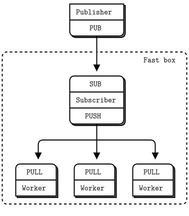
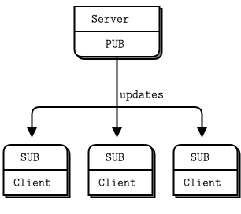
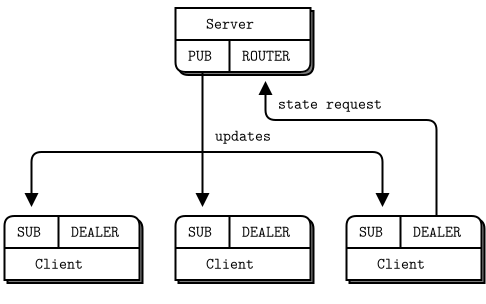
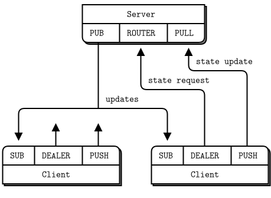
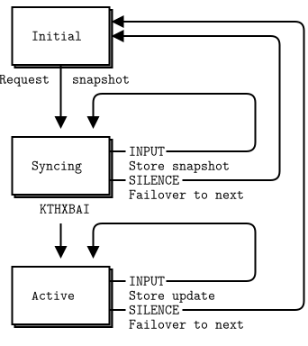
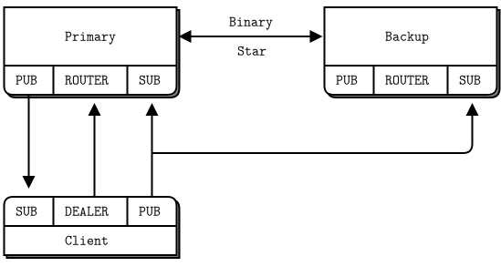
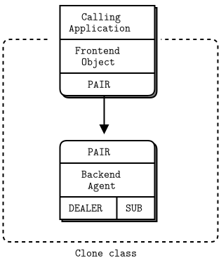

# 5장 - 고급 발행-구독 패턴 {-}

"3장 - 고급 요청-응답 패턴" 및 "4장 - 신뢰할 수 있는 요청-응답 패턴"에서 ØMQ의 요청-응답 패턴의 고급 사용을 보았습니다. 
그 모든 것을 이해하셨다면 축하드리며, 
이 장에서는 발행-구독(publish-subscribe)에 중점을 두고, ØMQ의 핵심인 발행-구독 패턴을 성능, 안정성, 변경정보 배포 및 모니터링을 위한 상위 수준 패턴으로 확장합니다.

다루는 내용은 다음과 같습니다.

* 발행-구독을 사용해야 할 때
* 너무 느린 구독자를 처리하는 방법(자살하는 달팽이 패턴)
* 고속 구독자 설계 방법(블랙박스 패턴)
* 발행-구독 네트워크를 모니터링하는 방법(에스프레소(Espresso) 패턴)
* 공유 카-값 저장소를 만드는 방법(복제 패턴)
* 리엑터를 사용하여 복잡한 서버를 단순화하는 방법
* 바이너리 스타 패턴을 사용하여 서버에 장애조치를 추가하는 방법

## 발행-구독의 장점과 단점

ØMQ의 저수준 패턴은 서로 다른 특성을 가지고 있습니다. 발행-구독은 멀티캐스트 혹은 그룹 메시징과 같은 오래된 메시징 문제를 해결합니다. 그것은 ØMQ를 특징짓는 꼼꼼한 단순성과 잔인한 무관심의 고유한 혼합을 가지고 있습니다. 발행-구독이 만드는 장단점이 어떻게 도움이 되는지, 필요한 경우 어떻게 사용해야 할지 이해할 가치가 있습니다.

첫째, PUB 소켓은 각 메시지를 "all of many"로 보내는 반면 PUSH 및 DEALER 소켓은 메시지를 "one of many"로 수신자들에게 순차적으로 전달합니다. 단순히 PUSH를 PUB로 바꾸거나 역으로 하더라도 모든 것이 똑같이 동작하기를 바랄 수는 없습니다. 사람들이 바꾸어 사용(PUSH, PUB)하는 것을 자주 제안하기 때문에 문제는 반복됩니다.

좀 더 깊게 생각하면 발행-구독은 확장성을 목표로 합니다. 
이는 많은 수신자들에게 빠르게 대량의 데이터를 송신하는 것입니다. 초당 수백만 개의 메시지를 수천 개의 단말로 송신해야 하는 경우, 소수의 수신자들에게 초당 몇 개의 메시지를 보내는 경우보다 발행-구독의 기능에 고마워할 것입니다.

확장성을 얻기 위해 발행-구독(pub-sub)은 푸시-풀(push-pull)과 동일하게 백-채터(back-chatter)를 제거합니다. 백-채터는 수신자가 발신자에게 응답하지 않음을 의미합니다. 일부 예외적인 경우로, SUB 소켓은 PUB 소켓에 구독을 보내지만 익명이며 드물게 일어납니다.

백-채터를 제거하는 것은 실제 확장성에 필수적입니다. 발행-구독 패턴은  네트워크 스위치에 의해 처리되는 PGM 멀티캐스트 통신규약에 말끔하게 매핑될 수 있습니다. 
즉, 구독자는 발행자에 연결하지 않고, 발행자가 메시지를 보내는 네트워크 스위치 상의 멀티캐스트 그룹에 연결합니다.

백-채터를 제거하면, 전체 메시지 흐름은 훨씬 단순해져, 많은 사람들이 단순한 API와 단순한 통신규약을 사용할 수 있습니다.
그러나 백-채터의 제거는 송신자들과 수신자들를 조정할 수 없게 되며 의미하는 바는 다음과 같습니다.

* 발행자들은 구독자들의 연결 성공 시점이 초기 연결 혹은 네트워크 장애 후에 재연결인지 모릅니다.
* 구독자들은 발행자들에게 "전송 메시지 속도를 조정해 주세요"와 같은 어떤 메시지도 송신할 수 없습니다. 발행자들은 최대 속도로 메시지를 전송하면, 구독자의 성능의 따라 메시지 계속 받거나 유실하게 됩니다.
* 발행자들은 구독자들이 프로세스 충돌, 네트워크 중단 등으로 사라진 시점을 모릅니다.

위의 단점은 안정적인 멀티캐스트를 수행하기 위해 해결이 필요합니다. 
ØMQ 발행-구독 패턴은 구독자가 연결 중이거나, 네트워크 장애가 발생하거나, 발행자의 송신하는 많은 메시지를 구독자 또는 네트워크가 처리할 수 없는 경우 메시지가 유실됩니다.

하지만 긍정적인 면에서 안정적인 멀티캐스팅의 괜찮은 사용 사례가 많다는 것입니다. 
백-채터가 필요할 때, ROUTER-DEALER(보통 수준의 메시지 처리량일 경우 주로 사용)를 사용하도록 전환하거나 동기화를 위한 별도의 채널을 추가할 수 있습니다(이에 대한 예는 나중에 살펴보겠습니다).

발행-구독은 라디오 방송과 같이 특정 채널에 가입하기 전에는 모든 것을 놓치며, 수신 품질에 따라 정보의 양이 달라집니다. 놀랍게도 이 모델은 실제 정보 배포에 완벽하게 매핑되어 유용하게 널리 사용되고 있습니다. 페이스북(Facebook)과 트위터(Twitter), BBC 세계 서비스, 스포츠 방송을 생각해 보십시오.

요청-응답과 같이 무엇이 잘못될 수 있는지의 관점에서 신뢰성을 정의하겠습니다. 
다음은 발행-구독의 전형적인 장애 사례입니다.

* 구독자가 늦게 가입하여 발행자가 이미 보낸 메시지들을 유실합니다.
* 구독자가 메시지들를 너무 느리게 처리하여, 대기열이 가득 차면 유실됩니다.
* 구독자가 자리를 비운 동안 메시지들를 유실할 수 있습니다.
* 구독자가 장애 후 재시작되면 이미 받은 데이터들을 유실할 수 있습니다.
* 네트워크가 과부하가 되어 데이터들을 유실할 수 있습니다(특히 PGM 통신의 경우).
* 네트워크의 처리 속도가 너무 느려 발행자의 대기열이 가득 차고 발행자에게 장애가 발생할 수 있습니다(ØMQ v3.2 이전).

더 많은 것이 잘못될 수 있지만 이것들은 우리가 현실적인 시스템에서 보는 전형적인 장애입니다. 
ØMQ v3.x부터 ØMQ 대기열의 내부 버퍼(소위 HWM(high-water mark))에 대한 기본적인 제한을 적용하므로 의도적으로 HWM을 무한으로 설정하지 않으면 발행자의 대기열이 가득 차는 장애는 발생하지 않습니다.

* HWM은 `setSockOpt()`에서 송신의 경우 `ZMQ_SNDHWM`, 수신의 경우 `ZMQ_RCVHWM`으로 설정합니다.

- PUB, PUSH : 송신 버퍼 존재
- SUB, PULL, REQ, REP : 수신 버퍼 존재
- DEALER/ROUTER/PAIR : 송신 및 수신 버퍼 존재

항상 단순한 것은 아니지만 장애 사례들에는 해결책이 있습니다. 
신뢰성은 대부분의 경우 필요하지 않는 복잡한 기능을 요구하지만, ØMQ는 기본적으로 제품 형태로 제공하려고 시도하진 않습니다(신뢰성을 적용하기 위한 범용적인 설계 방안은 존재하지 않습니다.).

## 발행-구독 추적 (에스프레소 패턴)

발행-구독 네트워크를 추적하는 방법을 보면서 이장을 시작하겠습니다. "2장 - 소켓 및 패턴"에서 전송 계층 간의 다리 역할을 수행하는 간단한 프록시를 보았습니다.
`szmq::proxy()` 메서드에는 3개 인수는 소켓들로 전송 계층 간 연결할 프론트앤드 소켓과 백엔드 소켓, 모든 메시지를 송신할 캡처 소켓입니다.

* int szmq::proxy (void *frontend_, void *backend_, void *capture_)

다음 코드는 매우 단순합니다.

* espresso.java : 에스프레소 패턴

```java
//  Espresso Pattern
//  This shows how to capture data using a pub-sub proxy

#include <szmq/szmq.h>
#include <iostream>
#include <thread>
#include <cstdlib>
#include <boost/format.hpp>
using namespace std;

//  The subscriber thread requests messages starting with
//  A and B, then reads and counts incoming messages.

static void*
subscriber_thread (szmq::Context *ctx)
{
    szmq::Socket<ZMQ_SUB, szmq::ZMQ_CLIENT> subscriber(*ctx);
    //  Subscribe to "A" and "B"
    subscriber.setSockOpt(ZMQ_SUBSCRIBE, "A", 1);
    subscriber.setSockOpt(ZMQ_SUBSCRIBE, "B", 1);   
    subscriber.connect(szmq::SocketUrl("tcp://localhost:6001"));
    int count = 0;
    while (count < 5) {
        auto string = subscriber.recvOne().read<std::string>();
        if (string.length() == 0)
            break;              //  Interrupted
        count++;
    }
    subscriber.close();
    return NULL;
}

//  .split publisher thread
//  The publisher sends random messages starting with A-J:

static void*
publisher_thread (szmq::Context *ctx)
{
    szmq::Socket<ZMQ_PUB, szmq::ZMQ_SERVER> publisher(*ctx);
    publisher.bind(szmq::SocketUrl("tcp://*:6000"));
    while (true) {
        auto string = boost::str(boost::format("%1%-%2%") % char(rand() % 10 + 'A') % (rand() % 100000));
        publisher.sendOne(szmq::Message::from(string));
        std::this_thread::sleep_for(std::chrono::milliseconds(100));     //  Wait for 1/10th second
    }
    return NULL;
}

//  .split listener thread
//  The listener receives all messages flowing through the proxy, on its
//  pipe. In CZMQ, the pipe is a pair of ZMQ_PAIR sockets that connect
//  attached child threads. In other languages your mileage may vary:

static void*
listener_thread (szmq::Context *ctx)
{
    szmq::Socket<ZMQ_PAIR, szmq::ZMQ_SERVER> pipe(*ctx);
    pipe.bind(szmq::SocketUrl("inproc://internal"));
    //  Print everything that arrives on pipe
    while (true) {
        auto frame = pipe.recvOne();
        if (frame.size()==0)
            break;              //  Interrupted
        frame.dump();
    }
    pipe.close();
    return NULL;
}

//  .split main thread
//  The main task starts the subscriber and publisher, and then sets
//  itself up as a listening proxy. The listener runs as a child thread:

int main (void)
{
    srand (static_cast<unsigned int>(std::time(0)));
    //  Start child threads
    szmq::Context ctx;
    szmq::Socket<ZMQ_XPUB, szmq::ZMQ_SERVER> xpublisher(ctx);
    xpublisher.bind(szmq::SocketUrl("tcp://*:6001"));
    szmq::Socket<ZMQ_XSUB, szmq::ZMQ_CLIENT> xsubscriber(ctx);
    xsubscriber.connect(szmq::SocketUrl("tcp://localhost:6000"));  
    szmq::Socket<ZMQ_PAIR, szmq::ZMQ_CLIENT> pipe(ctx);
    pipe.connect(szmq::SocketUrl("inproc://internal"));
    {
        thread(&publisher_thread, &ctx).detach();
    }
    {
        thread(&subscriber_thread, &ctx).detach();
    }
    {
        thread(&listener_thread, &ctx).detach();
    }    
    szmq::proxy(reinterpret_cast<void*>(*xsubscriber), reinterpret_cast<void*>(*xpublisher), reinterpret_cast<void*>(*pipe));

    cout <<" interrupted\n";
    //  Tell attached threads to exit
    xsubscriber.close();
    xpublisher.close();
    pipe.close();
    return 0;
}
```

* 빌드 및 테스트

~~~{.bash}
PS D:\work\sook\src\szmq\examples> cl -EHsc espresso.java szmq.lib

PS D:\work\sook\src\szmq\examples> ./espresso
[002] 0141       --> "01" 구독, 토픽 : "41" A
[002] 0142       --> "01" 구독, 토픽 : "41" B
[007] B-91164
[007] B-12979
[007] A-52599
[007] A-06417
[007] A-45770
[002] 0041       --> "00" 구독 취소, 토픽 : "41" A
[002] 0042       --> "00" 구독 취소, 토픽 : "41" B
~~~

에스프레소는 생성한 리스너 스레드는 PAIR 소켓을 읽고 출력을 합니다. PAIR 소켓은 파이프(pipe)의 한쪽 끝이며 다른 쪽 끝(추가 PAIR)은 `szmq::proxy()`에 전달하는 소켓입니다. 
실제로 관심 있는 메시지를 필터링하여 추적하려는 대상(에스프레소 패턴의 이름처럼)의 본질을 얻습니다.

* 에스프레소(Espresso)는 곱게 갈아 압축한 원두가루에 뜨거운 물을 고압으로 통과시켜 뽑아낸 이탈리안 정통 커피로 아주 진한 향과 맛이 특징이다.

구독자 스레드는 "A"및 "B"를 포함한 메시지 구독하며, 수신된 메시지가 5 개째 소켓을 제거하고 종료합니다. 예제를 실행하면 리스너는 2개의 구독 메시지(/01)들, 5개의 데이터 메시지들("A", "B" 포함)과 2개의 구독 취소 메시지(/00)를 출력하고 조용해집니다.

이것은 발행자 소켓이 구독자가 없을 때 데이터 전송을 중지하는 방법을 깔끔하게 보여줍니다. 
발행자 스레드가 여전히 메시지를 보내고 있지만 소켓은 조용히 그들을 버립니다.

* 구독자는 발행자에게 구독 시와 구독 취소 시 이벤트(event)를 보내며 보내는 메시지는 바이트(byte) 형태로 첫 번째 바이트(HEX 코드)는 "00"은 구독, "01"은 구독 취소이며 나머지 바이트들은 토픽(sizeof(event)-1)으로 구성됩니다.

## 마지막 값 캐싱

상용 발행-구독 시스템을 사용했다면 빠르고 즐거운 ØMQ 발행-구독 모델에서 누락된 일부 익숙한 기능들을 알 수 있습니다. 이 중 하나는 마지막 값 캐싱(LVC : Last Value Caching)입니다. 이것은 새로운 구독자가 네트워크에 참여할 때 누락한 메시지 받을 수 있는 방식으로 문제를 해결합니다. 이론은 발행자들에게 새로운 구독자가 참여했고 특정 토픽에 구독하려는 시점을 알려주면, 발행자는 해당 토픽에 대한 마지막 메시지를 재송신할 수 있습니다.

* TIB/RV(TIBCO Rendezvous)는 TIBCO사에서 개발한 상용 메시지 소프트웨어로 요청/응답(Request/reply), 브로드케스팅(Broadcasting), 신뢰성 메시징(reliable messaging), 메시지 전달 보장(Certified Messaging), 분산 메시지(Distributed Message), 원격 통신(Remote communication)등의 기능을 제공합니다.

발행자들이 새로운 구독자들이 참여하는 것을 알지 못하는 것은 대규모 발행-구독 시스템에서는 데이터의 양으로 인해 거의 불가능하기 때문입니다.
정말 대규모 발행-구독 네트워크를 만들려면 PGM과 같은 통신규약을 통해 이더넷 스위치의 기능을 활용하여 수천 명의 구독자에게 데이터를 멀티캐스트 해야 합니다. 
발행자가 각각 수천 명의 구독자들에게 TCP 유니캐스트를 시도하는 것으로 확장할 수 없으며, 이상한 불협화음, 불공정한 배포(일부 구독자가 다른 구독자보다 먼저 메시지를 받음), 네트워크 정체 등으로 보통 좋지 않은 결과를 겪습니다.

PGM은 단방향 통신규약입니다. 발행자는 네트워크 스위치의 멀티캐스트 주소로 메시지를 보내면 모든 관심 있는 구독자들에게 다시 브로드캐스트 합니다. 발행자는 구독자가 가입하거나 탈퇴하는 시점을  결코 알 수 없습니다. 이 모든 작업은 스위치에서 발생하며, 네트워크 스위치의 프로그래밍을 다시 작성하고 싶지는 않습니다.

그러나 낮은 대역폭을 가지는 저용량 네트워크에 수십 명의 구독자의 제한된 토픽가 있으면 TCP를 사용할 수 있으며, XSUB 및 XPUB 소켓은 에스프레소 패턴에서 본 것처럼 상호 통신합니다.

"ØMQ를 사용하여 LVC(last value cache)를 만들 수 있을까요?"에 대한 대답은 "예"이며 발행자와 구독자들 사이에 프록시를 만들면 됩니다. PGM 네트워크 스위치와 유사하지만 ØMQ는 우리가 직접 프로그래밍할 수 있습니다.

최악의 시나리오를 가정한 발행자와 구독자를 만드는 것부터 시작하겠습니다. 이 발행자는 병리학적입니다. 발행자는 각각 1000개의 토픽들에 즉시 메시지를 보내고 1초마다 임의의 토픽에 하나의 변경정보를 전송합니다. 구독자는 연결하고 토픽을 구독합니다. 마지막 값 캐핑(LVC)이 없으면 구독자는 데이터를 얻기 위해 평균 500초를 기다려야 합니다. 
TV 드라마에서 그레고르라는 탈옥한 죄수가 8.3분 내에 구독자의 데이터를 얻게 하지 못한다면 장난감 토끼 로저에게서 머리를 날려버리겠다고 위협하는 것처럼 말입니다.

다음은 발행자 코드입니다. 일부 주소에 연결하는 명령 줄 옵션이 없으면 단말에 바인딩되며, 나중에 마지막 값 캐시(LVC)에 연결에 사용합니다.

* pathopub.java : 병리학적인 발행자

```java
//  Pathological publisher
//  Sends out 1,000 topics and then one random update per second

#include <szmq/szmq.h>
#include <iostream>
#include <thread>
#include <cstdlib>
#include <string>
using namespace std;

int main (int argc, char *argv [])
{
    szmq::Context context;
    szmq::Socket<ZMQ_PUB, szmq::ZMQ_SERVER> publisher(context);

    if (argc == 2)
        publisher.bind(szmq::SocketUrl(argv [1]));
    else
        publisher.bind(szmq::SocketUrl("tcp://*:5556"));

    //  Ensure subscriber connection has time to complete
    std::this_thread::sleep_for(std::chrono::milliseconds(1000));   

    //  Send out all 1,000 topic messages
    int topic_nbr;
    for (topic_nbr = 0; topic_nbr < 1000; topic_nbr++) {
        publisher.sendMore(szmq::Message::from(to_string(topic_nbr)));
        publisher.sendOne(szmq::Message::from("Save Roger"));
    }
    //  Send one random update per second
    srand (static_cast<unsigned int>(std::time(0)));
    while (true) {
        std::this_thread::sleep_for(std::chrono::milliseconds(1000));  
        publisher.sendMore(szmq::Message::from(to_string(rand() % 1000)));
        publisher.sendOne(szmq::Message::from("Off with his head!"));
    }
    publisher.close();
    return 0;
}
```

구독자 코드는 다음과 같습니다.

* pathosub.java : 병리학적인 구독자

```java
//  Pathological subscriber
//  Subscribes to one random topic and prints received messages

#include <szmq/szmq.h>
#include <iostream>
#include <cstdlib>
#include <string>
using namespace std;

int main (int argc, char *argv [])
{
    szmq::Context context;
    szmq::Socket<ZMQ_SUB, szmq::ZMQ_CLIENT> subscriber(context);

    if (argc == 2)
        subscriber.connect(szmq::SocketUrl(argv [1]));
    else
        subscriber.connect(szmq::SocketUrl("tcp://localhost:5556"));

    srand (static_cast<unsigned int>(std::time(0)));
    std::string subscription = to_string(rand() % 1000);
    subscriber.setSockOpt(ZMQ_SUBSCRIBE, subscription.c_str(), subscription.length());
    
    while (true) {
        auto topic = subscriber.recvOne().read<std::string>();
        auto data = subscriber.recvOne().read<std::string>();
        if(topic.compare(subscription) != 0)
            break;
        cout << data << endl;
    }
    subscriber.close();
    return 0;
}
```

먼저 구독자를 실행하고 다음 발행자를 실행하면 구독자가 기대한 대로 “Save Roger”를 출력합니다.
“pathsub” 실행하면 생성된 토픽에 해당되는 “Sava Roger”을 수신하고 임의의 긴 시간(1초~16.7분) 후에 “Off with his head!”을 수신하게 됩니다.

* 빌드 및 테스트

~~~{.bash}
PS D:\work\sook\src\szmq\examples> cl -EHsc pathopub.java szmq.lib
PS D:\work\sook\src\szmq\examples> cl -EHsc pathosub.java szmq.lib
PS D:\work\sook\src\szmq\examples> ./pathopub
PS D:\work\sook\src\szmq\examples> ./pathosub
Save Roger
Off with his head!

// 주소를 지정한 경우
PS D:\work\sook\src\szmq\examples> ./pathopub tcp://*:5555
PS D:\work\sook\src\szmq\examples> ./pathosub tcp://localhost:5555
Save Roger
Off with his head!
~~~

두 번째 구독자를 실행하면 Roger의 곤경("Save Roger"을 수신하지 못하고 오랜 시간 후에 "Off with his head!" 수신)을 알게 되며 데이터 수신하기까지 오랜 시간을 기다려야 합니다.

 여기에 마지막 값 캐시(LVC)가 있습니다. 프록시가 2개의 소켓에 바인딩하고 양쪽의 메시지를 처리합니다.

* lvcach.java : 마지막 값 저장 프록시

```java
//  Last value cache
//  Uses XPUB subscription messages to re-send data
#include <szmq/szmq.h>
#include <iostream>
#include <map>
using namespace std;

int main (void)
{
    szmq::Context context;
    szmq::Socket<ZMQ_SUB, szmq::ZMQ_CLIENT> frontend(context);
    frontend.connect(szmq::SocketUrl("tcp://localhost:5557"));
    szmq::Socket<ZMQ_XPUB, szmq::ZMQ_SERVER> backend(context);
    backend.bind(szmq::SocketUrl("tcp://*:5558"));

    //  Subscribe to every single topic from publisher
    frontend.setSockOpt(ZMQ_SUBSCRIBE, "", 0);

    //  Store last instance of each topic in a cache
    std::map<std::string, std::string> cache;

    //  .split main poll loop
    //  We route topic updates from frontend to backend, and
    //  we handle subscriptions by sending whatever we cached,
    //  if anything:
    while (true) {
        std::vector<szmq::PollItem> items = {
			{reinterpret_cast<void*>(*frontend), 0, ZMQ_POLLIN, 0},
            {reinterpret_cast<void*>(*backend), 0, ZMQ_POLLIN, 0}};

        szmq::poll(items, 2, 1000);
        //  Any new topic data we cache and then forward
        if (items [0].revents & ZMQ_POLLIN) {
            auto topic = frontend.recvOne().read<std::string>();
            auto current = frontend.recvOne().read<std::string>();
            if (topic.length()==0)
                break;
            if(cache.count(topic)==0)
                cache.insert(std::make_pair(topic, current));   //insert
            else
                cache[topic] = current;  //update
            backend.sendMore(szmq::Message::from(topic));
            backend.sendOne(szmq::Message::from(current));
        }
        //  .split handle subscriptions
        //  When we get a new subscription, we pull data from the cache:
        if (items [1].revents & ZMQ_POLLIN) {
            auto frame = backend.recvOne().read<std::string>();            
            if (frame.length() == 0)
                break;
            //  Event is one byte 0=unsub or 1=sub, followed by topic
            if (frame[0] == 1) {
                auto topic = frame.substr(1, frame.length());
                cout << "Sending cached topic " << topic << endl;
                if(cache.count(topic)) {
                    auto previous = cache.at(topic);
                    backend.sendMore(szmq::Message::from(topic));
                    backend.sendOne(szmq::Message::from(previous));
                }
            }
        }
    }
    
    while (!cache.empty())
        cache.erase(cache.begin());
    frontend.close();
    backend.close();
    return 0;
}
```

프록시와 발행자를 순서대로 실행합니다.

~~~{.bash}
./lvcache &
./pathopub tcp://localhost:5557
~~~

그리고 원하는 수의 구독자들을 실행 시 프록시의 5558 포트에 연결합니다.

~~~{.bash}
./pathosub tcp://localhost:5558
~~~

* 빌드 및 테스트

~~~{.bash}
PS D:\work\sook\src\szmq\examples> cl -EHsc lvcache.java szmq.lib

PS D:\work\sook\src\szmq\examples> ./lvcache
Sending cached topic 985
Sending cached topic 158

PS D:\work\sook\src\szmq\examples> ./pathopub tcp://*:5557

PS D:\work\sook\src\szmq\examples> ./pathosub tcp://localhost:5558
Save Roger
Off with his head!
PS D:\work\sook\src\szmq\examples> ./pathosub tcp://localhost:5558
Save Roger
~~~

각 구독자는 "Save Roger"를 보고 받으며, 탈옥한 죄수 그레고르는 다시 감옥으로 돌아가 따뜻한 우유 한잔과 저녁 식사를 하게 되었습니다. 그는 진정 범죄를 저지르기보다는 관심받기를 원한 것이었습니다.

참고 : 기본적으로 XPUB 소켓은 중복 구독들을 보고하지 않습니다. 이는 XPUB를 XSUB에 그냥 연결할 때 원하는 것입니다. 우리의 예제는 임의의 토픽들을 사용하여 몰래 처리하므로 작동하지 않을 가능성은 백만분의 1입니다. 실제 LVC 프록시에서는 `ZMQ_XPUB_VERBOSE` 옵션을 사용하며 "6장 - ØMQ 커뮤니티"에서 연습문제로 구현하겠습니다.

## 느린 구독자 감지(자살하는 달팽이 패턴)

실제 생활에서 발행-구독 패턴을 사용할 때 발생하는 일반적인 문제는 느린 구독자입니다. 이상적인 세상에서 우리는 발행자에서 구독자로 데이터를 전속력으로 전송합니다. 실제로 구독자 응용프로그램은 종종 인터프리터 개발 언어로 작성되었거나 혹은 많은 작업을 처리하거나 잘못된 코드로 인한 오류로 발행자가 전송하는 데이터를 처리하지 못하는 상황이 발생할 수 있습니다.

* 인터프리터(interpreter) 개발 언어는 단말기를 통하여 컴퓨터와 대화하면서 작성할 수 있는 프로그래밍 언어로 PYTHON, BASIC, Prolog. LISP, LOGO, R 등이 있습니다.

느린 구독자를 처리하는 방법으로 이상적인 해결책은 구독자를 더 빠르게 만드는 것이지만 응용프로그램을 최적화하는 작업에 많은 시간이 소요될 수 있습니다. 
느린 구독자를 개선하기 위한 몇 가지 전통적인 전략들은 다음과 같습니다.

* 발행자의 메시지 대기열에 보관 
- 몇 시간 동안 이메일을 읽지 않을 때 Gmail이 하는 일입니다. 그러나 대용량 메시징에서 구독자가 많고 성능상의 이유로 발행자 대기열을 디스크의 데이터를 저장할 수 없는 경우 발행자의 메모리 부족과 충돌이 발생할 수 있습니다. 
* 구독자의 메시지 대기열에 보관
- 이것은 훨씬 낫고, 네트워크의 대역폭이 가능하다면 ØMQ가 기본적으로 하는 일입니다. 누군가 메모리가 부족하고 충돌이 발생하면 발행자가 아닌 구독자가 될 것입니다. 
- 이것은 "피크(Peaky)" 스트림에 적합하며 메시징이 많아 구독자가 한동안 처리할 수 없지만 메시징이 적어지면 처리 가능합니다. 그러나 일반적으로 너무 느린 구독자에게는 해결책이 아닙니다.
* 잠시 동안 신규 메시지를 수신 중단. 
- 수신 편지함의 저장 공간을 초과하는 경우 Gmail에서 수행하는 작업입니다.  신규 메시지는 거부되거나 삭제됩니다. 이것은 발행자의 관점에서는 훌륭한 전략이며, ØMQ에서 발행자가 HWM(High Water Mark)을 설정 시 적용됩니다. 그러나 여전히 느린 구독자를 개선하지는 못합니다. 단지 메시지 전송을 하지 못한 간격(GAP)을 가지게 됩니다.
* 느린 구독자를 연결을 끊어 처벌하기. 
- Hotmail에 2주 동안  로그인하지 않았을 때 수행하는 것이며, 내가 15번째 Hotmail 계정을 사용한 이유입니다.
이것은 잔인한 전략으로 구독자가 앉아서 주의를 기울이게 하며, 이상적이지만 ØMQ는 이를 수행하지 않는 이유는 발행자 응용프로그램에는 구독자가 보이지 않기 때문입니다.

어떤 전통적인 전략들도 적합하지 않아, 창의력을 발휘해야 합니다. 
발행자와의 연결을 끊는 대신 구독자가 자살하도록 설득하겠습니다. 이것은 자살하는 달팽이 패턴입니다. 구독자가 너무 느리게 실행되고 있음을 감지할 때, 한번 울고 죽게 합니다. "너무 느리다"는 판단은 구성 옵션으로 의미하는 바는 "만약 너무 천천히 당신이 여기 온다면, 내가 알아야 하니까 크게 소리쳐. 내가 고칠 수 있어!"입니다.

구독자는 "너무 느리다"를 감지하는 방법으로 한가지는 메시지를 순서대로 나열하고(순서대로 번호 지정) 발행자에서 HWM을 사용하는 것입니다. 그리고 구독자가 간격(즉, 번호가 연속적이지 않음)을 감지하면 잘못됨을 알게 되며, HWM을 "이 수준에 도달하면 울고 죽기" 수준으로 조정합니다.

이 해결책에는 2가지 문제가 있습니다. 
첫째, 발행자들이 많은 경우, 메시지 순서를 지정하는 방법이며 해결책은 각 발행자는 고유한 식별자(ID)를 가지고 순서에 추가하는 것입니다.(PUB ID + SEQUENCE) 
둘째, 구독자들이 ZMQ_SUBSCRIBE 필터를 사용하면 정의에 따라 간격이 생기며, 우리의 귀중한 메시지 순서는 소용이 없습니다.

일부 사용 사례들은 필터를 미사용 해야지 메시지 순서가 작동합니다. 그러나 보다 일반적인 해결책은 발행자가 각 메시지에 타임스탬프를 찍는 것입니다. 구독자가 메시지를 받으면 시간을 확인하고 그 차이가 1초 이상이면 "울고 죽기" 작업을 수행하며, 먼저 일부 운영자 컴퓨터 화면에 신호를 보냅니다.

자살하는 달팽이 패턴은 특히 구독자가 자신의 클라이언트들과 서비스 수준 계약(SLA, Service Level Agreements)을 맺고 있고 특정 최대 지연 시간을 보장해야 하는 경우에 효과적입니다. 최대 지연 시간을 보장하기 위해 구독자를 중단하는 것은 건설적인 방법은 아니지만, 가정 설정문(assertion) 모델입니다. 오늘 중단하면 문제는 해결되지만 지연되는 데이터가 하류(구독자들)로 흐르도록 허용하면 문제가 더 넓게 퍼져 많은 손상을 발생하지만 레이더(문제를 감지하는 수단)로 감지하는데 오래 걸릴 수 있습니다.

* 가정 설정문(Assertions)은 프로그램상에서 실수는 일어난다고 가정하고 이에 대비하여 방지하기 위해 가정 설정문(Assertion)의 조건을 설정하고 참(TRUE)이면 아무것도 하지 않지만, 거짓(FALSE)이면 즉시 프로그램을 정지시키는 방어적 프로그래밍(defensive programming)의 수단입니다.

자살하는 달팽이에 대한 작은 예제입니다.

* suisnail.java : 자살하는 달팽이

```java
//  Suicidal Snail

#include <szmq/szmq.h>
#include <iostream>
#include <thread>
#include <cstdlib>
using namespace std;

//  This is our subscriber. It connects to the publisher and subscribes
//  to everything. It sleeps for a short time between messages to
//  simulate doing too much work. If a message is more than one second
//  late, it croaks.

#define MAX_ALLOWED_DELAY   1000    //  msecs

static void*
subscriber (szmq::Context *ctx)
{
    // Interanl pipe
    szmq::Socket<ZMQ_PAIR, szmq::ZMQ_CLIENT> pipe(*ctx);
    pipe.connect(szmq::SocketUrl("inproc://sub"));
    //  Subscribe to everything
    szmq::Socket<ZMQ_SUB, szmq::ZMQ_CLIENT> subscriber(*ctx);
    subscriber.setSockOpt(ZMQ_SUBSCRIBE, "", 0);
    subscriber.connect(szmq::SocketUrl("tcp://localhost:5556"));

    //  Get and process messages
    while (true) {
        auto msg = subscriber.recvOne().read<uint64_t>();;
         //  Suicide snail logic
        if (szmq::now() - msg > MAX_ALLOWED_DELAY) {
            cout << "E: subscriber cannot keep up, aborting\n";
            pipe.sendOne(szmq::Message::from("gone and died"));
            break;
        }
        //  Work for 1 msec plus some random additional time
        std::this_thread::sleep_for(std::chrono::milliseconds(1 + rand() % 2)); 
    }
    pipe.close();
    subscriber.close();
    return NULL;
}

//  .split publisher task
//  This is our publisher task. It publishes a time-stamped message to its
//  PUB socket every millisecond:

static void*
publisher (szmq::Context *ctx)
{
    // Interanl pipe
    szmq::Socket<ZMQ_PAIR, szmq::ZMQ_CLIENT> pipe(*ctx);
    pipe.connect(szmq::SocketUrl("inproc://pub"));
    //  Prepare publisher
    szmq::Socket<ZMQ_PUB, szmq::ZMQ_SERVER> publisher(*ctx, szmq::NonblockingFlag{true});
    publisher.bind(szmq::SocketUrl("tcp://*:5556"));

    while (true) {
        //  Send current clock (msecs) to subscribers
        uint64_t now = szmq::now();
        publisher.sendOne(szmq::Message::from(now));
        auto signal = pipe.recvOne(0).read<std::string>();
        if (signal.length() > 0) {
            cout << "Message from main() : " << signal << endl;
            break;
        }
        std::this_thread::sleep_for(std::chrono::milliseconds(1));   //  1msec wait
    }
    pipe.close();
    publisher.close();
    return NULL;
}

//  .split main task
//  The main task simply starts a client and a server, and then
//  waits for the client to signal that it has died:

int main (void)
{
    szmq::Context ctx;
    // Interanl pipe
    szmq::Socket<ZMQ_PAIR, szmq::ZMQ_SERVER> subpipe(ctx);
    subpipe.bind(szmq::SocketUrl("inproc://sub"));
    szmq::Socket<ZMQ_PAIR, szmq::ZMQ_SERVER> pubpipe(ctx);
    pubpipe.bind(szmq::SocketUrl("inproc://pub"));
    // thread   
    thread(&publisher, &ctx).detach();
    thread(&subscriber, &ctx).detach();
    auto fromSub = subpipe.recvOne().read<std::string>();
    cout << "Message from subscriber thread : " << fromSub << endl;
    pubpipe.sendOne(szmq::Message::from("break"));
    std::this_thread::sleep_for(std::chrono::milliseconds(100));
    subpipe.close();
    pubpipe.close();
    return 0;
}
```

pipe 통신은 PAIR 진행되며, 2개의 스레드에 대하여 pubpipe, subpipe가 필요합니다.

* 빌드 및 테스트

~~~{.bash}
 PS D:\work\sook\src\szmq\examples> cl -EHsc suisnail.java szmq.lib
PS D:\work\sook\src\szmq\examples> ./suisnail
1605306034227
1605306034229
...
1605306035476
1605306035478
E: subscriber cannot keep up, aborting
Message from subscriber thread : gone and died
Message from main() : break
~~~

자살하는 달팽이 예제에서 몇 가지 주목할 사항은 다음과 같습니다.

* 여기에 있는 메시지는 밀리초(msec) 단위의 현재 시스템 시각으로만 구성됩니다. 현실적인 응용프로그램에서는 적어도 메시지는 "타임스탬프가 있는 메시지 헤더"와 "데이터가 있는 메시지 본문"으로 구성되어야 합니다.
* 예제에서는 단일 프로세스에서 2개의 스레드인 발행자와 구독자가 있습니다. 실제로는 별도의 프로세스들입니다. 스레드는 편의상 데모를 위하여 사용합니다.

## 고속 구독자 (블랙 박스 패턴)

이제 구독자를 더 빠르게 만드는 한 가지 방법을 보겠습니다. 발행-구독의 일반적인 사용 사례는 증권거래소에서 발생하는 시장 데이터와 같은 대용량 데이터 스트림을 배포하는 것입니다. 
일반적인 설정에는 발행자가 증권거래소에 연결되어 주가를 여러 구독자들에게 보냅니다. 구독자가 적으면 TCP를 사용할 수 있습니다. 많은 구독자의 경우 안정적인 멀티캐스트, 즉 PGM을 사용합니다.

그림 56 - 단순 블랙박스 패턴



전달 데이터(feed)가 초당 평균 10만 개의 100 바이트 메시지들이 있다고 가정합니다.
시장 데이터를 필터링한 후 구독자에게 전송할 필요가 없게 하면 일반적인 비율입니다.
이제 하루의 데이터(대략 8시간에 250GB)를 저장하고, 시뮬레이션 네트워크(소규모 구독자들의 그룹)에서 재현하기로 합니다. ØMQ 응용프로그램에서 초당 10만 개의 메시지들의 처리는 쉽지만, 더 빠르게 처리하고 싶습니다.

그래서 아키텍처상에서 발행자와 구독자를 위한 각각에 하나의 몪음으로 박스를 설치하였습니다.
설치된 컴퓨터는 8개 코어를 사용하며 12개 발행자를 대응합니다.

그리고 구독자에게 데이터를 전달하면서 다음 2가지에 대하여 주목하게 됩니다.

1. 우리가 메시지에 대한 일정 작업을 수행할 경우, 구독자는 처리 속도가 느려지면서 발행자가 전달하는 메시지들을 처리할 수 없게 됩니다.
2. 신중하게 최적화하고 TCP를 조정한 후에, 발행자와 구독자의 메시지 처리 한계는 초당 6백만개 입니다.

가장 먼저 할 일은 구독자를 멀티 스레드 설계로 분할하여 한 스레드 집합에서는 메시지들의 처리를 하며 다른 스레드는 집합에서는 메시지를 읽게 합니다.
일반적으로 우리는 동일한 방식으로 모든 메시지 처리하고 싶지 않기에 구독자가 메시지에 대한 필터링(토픽(TOPIC))을 수행합니다. 메시지가 어떤 기준과 일치하면 구독자는 작업자를 호출하여 작업을 처리하게 합니다.
ØMQ 용어로 작업자 스레드에 메시지를 보내는 것을 의미합니다.

따라서 구독자는 대기열 장치처럼 보입니다. 다양한 소켓을 사용하여 구독자와 작업자들을 연결할 수 있습니다. 단방향 통신과 작업자들 모두 동일하다고 가정하면 PUSH 및 PULL 소켓을 사용하고 모든 라우팅(작업자들에게 분배) 작업을 ØMQ에 위임할 수 있습니다. 이것은 가장 간단하고 빠른 접근 방식입니다.

구독자는 TCP 또는 PGM을 통해 발행자와 통신하며, 구독자는 `inproc://`를 통해 하나의 프로세스에 있는 모두 작업자들(스레드들)과 통신합니다.

그림 57 - 미친 블랙박스 패턴


이제 한계를 돌파해 봅시다. 구독자 스레드는 CPU의 100%에 도달한 이유는 하나의 스레드로 구성하여 2 이상의 CPU 코어를 사용할 수 없습니다. 
단일 스레드는 초당 2백만, 6백만 혹은 이상의 메시지들에서 처리 한계에 도달합니다.
작업을 분할하여 멀티스레드를 통한 병렬로 실행하겠습니다.

이러한 접근은 많은 고성능 메시지 처리 제품에서 사용되고 있으며 샤딩(sharding)이라 합니다. 샤딩을 사용하여 작업을 병렬 및 독립 스트림으로 분할합니다(한 스트림에서 토픽 키의 절반, 다른 스트림에서 토픽 키의 절반).
많은 스트림을 사용할 수 있지만 유휴 CPU 코어가 없으면 성능이 확장되지 않습니다. 
이제 하나의 메시지 스트림을 2개의 메시지 스트림으로 분할하는 방법을 보겠습니다.

* 병렬 샤딩(Parallel Sharding)은  데이터가 서로 공유되지 않도록 완전히 분리하여 독립적으로 동작하는 샤딩(Sharding)을 여러 개로 묶어서 병렬 처리를 통해 성능 및 확장성을 확보하는 방식입니다.

2개의 메시지 스트림들에 대하여 최고 속도로 작업하기 위하여 ØMQ을 다음과 같이 구성합니다.

* 하나가 아닌 2개의 I/O 스레드들.
* 2개의 네트워크 인터페이스(NIC), 구독자 당 하나씩.
* 개별 I/O 스레드는 지정된 네트워크 인터페이스(NIC)에 바인딩
* 2개의 구독자 스레드는 지정된 CPU 코어들에 바인딩.
* 2개의 SUB 소켓은 구독자 스레드당 하나씩 지정.
* 나머지 CPU 코어들은 작업자 스레드들에 할당.
* 작업자 스레드들은 가입자의 2개의 PUSH 소켓들에 연결

이상적으로는 아키텍처에서 완전히 부하 처리가 가능한 스레드 수를 코어 수와 일치시키려고 했습니다. 스레드가 코어 및 CPU 주기를 놓고 싸우기(Time sharing) 시작하면 스레드를 추가하는 비용이 메시지 처리량보다 큽니다(더 많은 메시지 처리하기 위해 더 많은 CPU 코어 구매). 더 많은 I/O 스레드를 생성하는 것에는 이점이 없습니다.

고속 구독자에 대한 테스트를 위한 예제입니다.

* hssub.java : 고속 구독자

 ```java
//  Hello World client
#include <szmq/szmq.h>
#include <assert.h>
#include <iostream>
#include <thread>
#include <boost/format.hpp>
#define NBR_WORKERS 3
using namespace std;

//  This is our subscriber. It connects to the publisher and subscribes
//  to everything. It sleeps for a short time between messages to
//  simulate doing too much work. If a message is more than one second
//  late, it croaks.
#define MAX_ALLOWED_DELAY   1000    //  msecs

//  .split publisher task
static void*
publisher (szmq::Context *ctx)
{
    // Interanl pipe
    szmq::Socket<ZMQ_PAIR, szmq::ZMQ_CLIENT> pipe(*ctx);
    pipe.connect(szmq::SocketUrl("inproc://pub"));
    //  Prepare publisher
    szmq::Socket<ZMQ_PUB, szmq::ZMQ_SERVER> publisher(*ctx);
    publisher.bind(szmq::SocketUrl("tcp://*:5556"));

    while (true) {
        //  Send current clock (msecs) to subscribers
        uint64_t now = szmq::now();
        publisher.sendOne(szmq::Message::from(now));
        auto signal = pipe.recvOne(0).read<std::string>();
        if (signal.length() > 0) {
            cout << "Publisher Message from main() : " << signal << endl;
            break;
        }
        std::this_thread::sleep_for(std::chrono::milliseconds(1));   //  1msec wait
    }
    pipe.close();
    publisher.close();
    return NULL;
}

// subscriber task
static void*
subscriber (szmq::Context *ctx)
{
    // Interanl pipe
    szmq::Socket<ZMQ_PAIR, szmq::ZMQ_CLIENT> pipe(*ctx);
    pipe.connect(szmq::SocketUrl("inproc://sub"));
    //  Subscribe to everything
    szmq::Socket<ZMQ_SUB, szmq::ZMQ_CLIENT> subscriber(*ctx);
    subscriber.setSockOpt(ZMQ_SUBSCRIBE, "", 0);
    subscriber.connect(szmq::SocketUrl("tcp://localhost:5556"));
    
    //  Socket to send messages to
    szmq::Socket<ZMQ_PUSH, szmq::ZMQ_SERVER> sender(*ctx);
    sender.bind(szmq::SocketUrl("tcp://*:5557"));
    //  Get and send messages
    while (true) {
        auto msg = subscriber.recvOne();
        sender.sendOne(msg);
        //  Suicide snail logic
        if (szmq::now() - msg.read<uint64_t>() > MAX_ALLOWED_DELAY) {
            cout << "E: subscriber cannot keep up, aborting\n";
            pipe.sendOne(szmq::Message::from("gone and died"));
            break;
        }
        std::this_thread::sleep_for(std::chrono::milliseconds(1 + rand() % 2)); 
    }
    pipe.close();
    subscriber.close();
    return NULL;
}
// worker task
static void*
worker(void *args, szmq::Context *ctx)
{
    // Interanl pipe
    szmq::Socket<ZMQ_SUB, szmq::ZMQ_CLIENT> pipe(*ctx);
    pipe.setSockOpt(ZMQ_SUBSCRIBE, "", 0);
    pipe.connect(szmq::SocketUrl("inproc://work"));
    //  Subscribe to everything
    szmq::Socket<ZMQ_PULL, szmq::ZMQ_CLIENT> worker(*ctx);
    worker.connect(szmq::SocketUrl("tcp://localhost:5557"));
    // poll items
    std::vector<szmq::PollItem> items = {
			{reinterpret_cast<void*>(*worker), 0, ZMQ_POLLIN, 0},
            {reinterpret_cast<void*>(*pipe), 0, ZMQ_POLLIN, 0}};
    //  Get and send messages
    while (true) {
        szmq::poll(items, 2, 10);
        if (items [0].revents & ZMQ_POLLIN) {
            auto msg = worker.recvOne().read<uint64_t>();
            cout << boost::format("[%1%]Receive: [%2%]\n") % (intptr_t)args % msg;
        }
        if (items [1].revents & ZMQ_POLLIN) {
            auto signal = pipe.recvOne(0).read<std::string>();
            if (signal.length() > 0) {
                cout << "Worker Message from main() : " << signal << endl;
                break;
            }
        
        }
    }
    pipe.close();
    worker.close();
    return NULL;
}

int main (void)
{
    szmq::Context ctx;
    // Interanl pipe
    szmq::Socket<ZMQ_PAIR, szmq::ZMQ_SERVER> subpipe(ctx);
    subpipe.bind(szmq::SocketUrl("inproc://sub"));
    szmq::Socket<ZMQ_PAIR, szmq::ZMQ_SERVER> pubpipe(ctx);
    pubpipe.bind(szmq::SocketUrl("inproc://pub"));
    szmq::Socket<ZMQ_PUB, szmq::ZMQ_SERVER> workpipe(ctx);
    workpipe.bind(szmq::SocketUrl("inproc://work"));
    // thread  
    thread(&publisher, &ctx).detach();
    thread(&subscriber, &ctx).detach();
    for (int worker_nbr = 0; worker_nbr < NBR_WORKERS; worker_nbr++)
        thread(&worker, (void *)(intptr_t)worker_nbr, &ctx).detach();
    // receive signal from subpipe
    auto fromSub = subpipe.recvOne().read<std::string>();
    cout << "Message from subscriber thread : " << fromSub << endl;
    pubpipe.sendOne(szmq::Message::from("break"));
    workpipe.sendOne(szmq::Message::from("break"));
    std::this_thread::sleep_for(std::chrono::milliseconds(1000));
    subpipe.close();
    pubpipe.close();
    workpipe.close();
    return 0;
}
 ```

* 빌드 및 테스트

 - 3개의 작업자들에게 라운드로빈 형태로 메시지가 전달되는 것을 확인 가능합니다.

~~~{.bash}
PS D:\work\sook\src\szmq\examples> cl -EHsc hssub.java szmq.lib
PS D:\work\sook\src\szmq\examples> ./hssub
[2]Receive: [1605313432325]
[1]Receive: [1605313432327]
[0]Receive: [1605313432329]
...
[1]Receive: [1605313436314]
[0]Receive: [1605313436316]
[2]Receive: [1605313436318]
E: subscriber cannot keep up, aborting
[1]Receive: [1605313436320]
Message from subscriber thread : gone and died
Worker Message from main() : break
Worker Message from main() : break
Worker Message from main() : break
Publisher Message from main() : break
~~~

## 신뢰할 수 있는 발행-구독 (복제 패턴)

좀 더 큰 작업 예제로, 신뢰할 수 있는 발행-구독 아키텍처를 만드는 문제를 보겠습니다. 
우리는 이것을 단계적으로 개발하며 목표는 일련의 응용프로그램들이 일부 공통 상태를 공유하게 합니다. 기술적 도전 과제들은 다음과 같습니다.

* 수천 또는 수만 개의 클라이언트 응용프로그램들이 있습니다.
* 임의로 네트워크에 가입하고 탈퇴합니다.
* 이러한 응용프로그램들은 하나의 최종 일관성 상태를 공유해야 합니다.
* 모든 응용프로그램은 언제든지 상태를 변경할 수 있습니다.

상태의 변경이 상당히 적은 양이라고 가정하고 실시간 처리 목표는 없습니다. 
전체 상태는 메모리에 저장하고, 일부 사용 사례는 다음과 같습니다.

* 클라우드 서버들의 그룹에서 공유하는 구성.
* 플레이어 그룹이 공유하는 일부 게임 상태.
* 환율 데이터가 실시간으로 변경되고 응용프로그램에서 가용함.

### 중앙집중형과 분산형

우리가 해야 할 첫 번째 결정은 중앙 서버 혹은 분산 서버로 작업할지 여부입니다. 
결과적인 설계에서 큰 차이를 만들며, 장단점은 다음과 같습니다.

* 개념적으로 중앙 서버로 작업하는 것이 네트워크가 태생적으로 비대칭형이기 때문에 이해하기 더 쉽습니다. 중앙 서버를 사용하면 검색, 바인딩과 연결 등과 관련된 모든 질문들을 피할 수 있습니다.
* 일반적으로 완전히 분산된 아키텍처는 기술적으로 더욱 어렵지만 의외로 간단한 통신규약으로 끝납니다. 즉, 각 노드가 올바른 방식으로 서버 및 클라이언트 역할을 해야 하며 이는 섬세합니다. 올바르게 수행하면 중앙 서버를 사용하는 것보다 결과는 더 간단합니다. "4장 - 신뢰할 수 있는 요청-응답 패턴"의 프리랜서 패턴에서 보았습니다.
* 중앙 서버는 대량 데이터 사용 사례에서 병목 현상을 겪을 수 있습니다. 초당 수백만 개의 메시지를 처리해야 한다면, 당장 분산 처리 환경을 목표로 해야 합니다.
* 역설적이게도 중앙집중식 아키텍처는 분산형 아키텍처보다 더 쉽게 더 많은 노드로 확장됩니다. 즉, 하나의 서버에 10,000개의 노드들을 연결하는 것이 노드들 간에 상호 연결하는 것보다 쉽습니다.

그래서 복제 패턴의 경우 중앙 서버를 통해 상태 변경을 전송하면 일련의 클라이언트들의 응용프로그램에서 사용합니다.

### 상태를 키-값 쌍으로 표시

우리는 한 번에 하나씩 문제를 해결하면서 단계적으로 복제(Clone)를 개발할 것입니다. 먼저 일련의 클라이언트들에서 공유 상태를 변경하는 방법을 보겠습니다. 우리는 상태를 표현하고 변경한 방법을 결정해야 합니다. 가장 단순한 형식은 키-값 저장소(해시 테이블)로 하나의 키-값 쌍은 공유 상태를 변경하는 기본 단위가 됩니다.

"1장 - 기본"에서 날씨 서버 및 클라이언트 예제로 간단한 발행-구독 패턴으로 구현하였습니다. 이제 서버(wuserver)를 변경하여 키-값 쌍을 보내고 클라이언트에서 해시 테이블에 저장하겠습니다. 이를 통해 고전적인 발행-구독 모델을 사용하여 한 서버에서 일련의 클라이언트들로 변경정보를 보낼 수 있습니다.

변경정보는 신규 키-값 쌍이거나 기존 키의 수정된 값 혹은 삭제된 키입니다. 
지금은 전체 저장소가 메모리에 저장할 수 있고 응용프로그램들이 해시 테이블이나 사전을 사용하는 것처럼 키로 접근한다고 가정합니다. 더 큰 저장소와 일종의 지속성이 필요한 경우 상태를 데이터베이스에 저장할 수 있지만 여기서는 관련이 없습니다.

다음은 서버 코드입니다.

* clonesrv1.java : 복제 서버, 모델 1

```java
//  Clone server Model One
#include <szmq/szmq.h>
#include <iostream>
#include <cstdlib>
#include <thread>
#include <string>
#include <map>
#include <boost/format.hpp>
using namespace std;

int main (void)
{
    //  Prepare our context and publisher socket
    szmq::Context ctx;
    szmq::Socket<ZMQ_PUB, szmq::ZMQ_SERVER> publisher(ctx);
    publisher.bind(szmq::SocketUrl("tcp://*:5556"));
    std::this_thread::sleep_for(std::chrono::milliseconds(200)); 
    // making key-value map
    std::map<uint64_t, uint64_t> kvmap;
    int64_t sequence = 0;
    std::srand (static_cast<unsigned int>(std::time(0)));
    vector <szmq::Message> kvmsg;
    while (true) {
        //  Distribute as key-value message
        uint64_t key = rand() % 10000;
        uint64_t value = rand() % 1000000;
        kvmsg.emplace_back(szmq::Message::from(key));  //  frame 0: key (0MQ string)
        kvmsg.emplace_back(szmq::Message::from(++sequence)); //  frame 1: sequence (8 bytes, network order)
        kvmsg.emplace_back(szmq::Message::from(value));  //  frame 2: body (blob)
        //cout << sequence << ", " << key << ", " << value << endl;
        publisher.sendMultiple(kvmsg);
        if(kvmap.count(key))
            kvmap[key] = value;
        else
            kvmap.insert(std::make_pair(key, value));
        kvmsg.clear();
    }
    cout << boost::format(" Interrupted\n%1% messages out\n") % (int)sequence;
    publisher.close();
    while (!kvmap.empty())
        kvmap.erase(kvmap.begin());
    return 0;
}
```

다음은 클라이언트 코드입니다.

* clonecli1.java : 복제 클라이언트, 모델 1

```java
//  Clone client Model One
#include <szmq/szmq.h>
#include <iostream>
#include <cstdlib>
#include <thread>
#include <map>
#include <boost/format.hpp>
using namespace std;

int main (void)
{
    //  Prepare our context and updates socket
    szmq::Context ctx;
    szmq::Socket<ZMQ_SUB, szmq::ZMQ_CLIENT> updates(ctx);
    updates.setSockOpt(ZMQ_SUBSCRIBE, "", 0);
    updates.connect(szmq::SocketUrl("tcp://localhost:5556"));

    // making key-value map
    std::map<uint64_t, uint64_t> kvmap;
    int64_t sequence = 0;

    while (true) {
        auto kvmsg = updates.recvMultiple();
        if (kvmsg.size()==0)
            break;          //  Interrupted
        //  frame 0: key (0MQ string)
        //  frame 1: sequence (8 bytes, network order)
        //  frame 2: body (blob)
        auto key = kvmsg.front().read<uint64_t>(); kvmsg.erase(kvmsg.begin()); //delete key
        sequence = kvmsg.front().read<int64_t>(); kvmsg.erase(kvmsg.begin()); //delete sequence
        auto value = kvmsg.front().read<uint64_t>();
        //cout << sequence << ", " << key << ", " << value << endl;
        if(kvmap.count(key))
            kvmap[key] = value;
        else
            kvmap.insert(std::make_pair(key, value));
        if((sequence % 10000) == 0)
            cout << boost::format("kvmap key : %1%, value %2%\n") % key % kvmap.at(key);
        kvmsg.clear();
    }
    cout << boost::format(" Interrupted\n%1% messages out\n") % (int)sequence;
    updates.close();
    while (!kvmap.empty())
        kvmap.erase(kvmap.begin());
    return 0;
}
```

* 빌드 및 테스트

~~~{.bash}
PS D:\work\sook\src\szmq\examples> cl -EHsc clonesrv1.java szmq.lib
PS D:\work\sook\src\szmq\examples> cl -EHsc clonecli1.java szmq.lib

PS D:\work\sook\src\szmq\examples> ./clonesrv1

PS D:\work\sook\src\szmq\examples> ./clonecli1
kvmap key : 1182, value 7692    --> 10,000번에 한번씩 출력
kvmap key : 3804, value 16830
kvmap key : 8983, value 21542
kvmap key : 265, value 12
kvmap key : 1481, value 1079
~~~

Figure 58 - 상태 변경정보 발행




첫 번째 모델에 대한 몇 가지 주목할 점은 다음과 같습니다.

* 멀티파트(multipart) ØMQ 메시지는 3개의 프레임으로 구성됩니다 : 키(ØMQ 문자열), 순서 번호(네트워크 바이트 순서의 64 비트 값(`int64_t`)), 바이너리 본문(모든 항목을 포함)
* 서버는 임의의 4자리 키(0~9999)로 메시지를 생성하므로, 크지만 방대하지는 않은 해시 테이블(1만 개 항목들)을 시뮬레이션할 수 있습니다.
* 현재 버전에서는 삭제를 구현하지 않습니다. 모든 메시지는 삽입 또는 변경입니다.
* 서버는 소켓을 바인딩하고 200 밀리초 동안 일시 중지합니다. 이는 구독자가 서버의 소켓에 연결할 때 메시지를 유실하는 느린 참여 증후군(slow joiner syndrome)을 방지합니다. 이후 버전의 복제 코드에서는 제거하겠습니다.
* 소켓에 대하여 코드상에서 발행자와 구독자라는 용어를 사용할 것입니다. 이것은 나중에 다른 일을 하는 다중 소켓들로 작업할 때 도움이 됩니다.

다음은 현재 동작하는 가장 간단한 형식의 kvmsg 클래스입니다.

* kvmsg_simple.h : 키-값 메시지 클래스

```java
/*  =====================================================================
 *  kvmsg_simple - simple key-value message class for example applications
 *  ===================================================================== */
        
#ifndef __KVSIMPLE_H_INCLUDED__
#define __KVSIMPLE_H_INCLUDED__

#include <szmq/szmq.h>
#include <iostream>
#include <algorithm>
#include <thread>
#include <map>
#include <boost/format.hpp>
using namespace std;

//  Message is formatted on wire as 3 frames:
//  frame 0: key (string)
//  frame 1: sequence (unit64_t)
//  frame 2: body (string)
#define FRAME_KEY       0
#define FRAME_SEQ       1
#define FRAME_BODY      2
#define KVMSG_FRAMES    3

class kvmsg {
public :
    //  Constructor, sets sequence as provided
    kvmsg(uint64_t sequence, int verbose=0) noexcept
        : mverbose(verbose){
            setSequence(sequence);
          }
    kvmsg recv(szmq::detail::SocketImpl& socket) noexcept {
        kvmsg me(0, mverbose);
        for (int frame_nbr = 0; frame_nbr < KVMSG_FRAMES; frame_nbr++) {
            me.mpresent [frame_nbr] = 1;
            me.mframe[frame_nbr] = socket.recvOne();
            //  Verify multipart framing
            bool rcvmore = (frame_nbr < KVMSG_FRAMES - 1)? true: false;
            if (socket.hasMore() != rcvmore) 
                break;
        }
        return me;
    }
    void send(szmq::detail::SocketImpl& socket) noexcept {
        for (int frame_nbr = 0; frame_nbr < KVMSG_FRAMES; frame_nbr++) {
            if (frame_nbr < KVMSG_FRAMES - 1)
                socket.sendMore(mframe[frame_nbr]);
            else
                socket.sendOne(mframe[frame_nbr]);
        }
    }
    std::string key(){
        if (mpresent [FRAME_KEY] == 1) {
            mkey = mframe[FRAME_KEY].read<std::string>();
            return mkey;
        }
        else
            return NULL;
    }
    uint64_t sequence(){
        return mframe [FRAME_SEQ].read<uint64_t>();
    }
    std::string body(){
        if (mpresent [FRAME_BODY]==1)
            return mframe[FRAME_BODY].read<std::string>();
        else
            return NULL;
    }
    size_t size() {
        if (mpresent [FRAME_BODY] == 1)
            return mframe [FRAME_BODY].size();
        else
            return 0;
    }
    //  Set message key as provided
    void setKey(std::string key){
        mframe[FRAME_KEY] = szmq::Message::from(key);
        mpresent [FRAME_KEY] = 1;
    }
    //  Set message sequence number
    void setSequence (uint64_t sequence){
        mframe [FRAME_SEQ] = szmq::Message::from(sequence);
        mpresent [FRAME_SEQ] = 1;
    }
    //  Set message body
    void setBody (std::string body){
        mframe [FRAME_BODY] = szmq::Message::from(body);
        mpresent [FRAME_BODY] = 1;
    }

    //  Set message key using printf format
    void fmtKey (char *format, ...){
        char value[KVMSG_KEY_MAX + 1];
        va_list args;
        va_start (args, format);
        vsnprintf (value, KVMSG_KEY_MAX, format, args);
        va_end (args);
        setKey (value);
    }
    //  Set message body using printf format
    void fmtBody (char *format, ...){
        char value[KVMSG_KEY_MAX + 1];
        va_list args;
        va_start (args, format);
        vsnprintf (value, KVMSG_KEY_MAX, format, args);
        va_end (args);
        setBody (value);
    }

    //  Store entire kvmsg into hash map, if key/value are set
    //  Nullifies kvmsg reference, and destroys automatically when no longer
    //  needed.
    void store (std::map<std::string, std::string> *kvmap){
        if (mpresent [FRAME_KEY] == 1 &&  mpresent [FRAME_BODY] == 1) {
            if(kvmap->count(key()))
                kvmap->at(key()) = body();
            else
                kvmap->insert(std::make_pair(key(), body()));
        }
    }
    //  Dump message to stderr, for debugging and tracing
    void dump (){
        cout << boost::format("[seq:%1%]\n") % sequence();
        cout << boost::format("[key:%1%]\n") % key();
        cout << boost::format("[size:%1%]\n") % size();
        cout << boost::format("[body:%1%]\n") % body();
    }

    //  Runs self test of class
    int test(){
        cout << " * kvmsg: \n";

        //  Prepare our context and sockets
        szmq::Context ctx;
        szmq::Socket<ZMQ_DEALER, szmq::ZMQ_SERVER> output(ctx);
        output.bind(szmq::SocketUrl("inproc://kvmsg_selftest"));
        szmq::Socket<ZMQ_DEALER, szmq::ZMQ_CLIENT> input(ctx);
        input.connect(szmq::SocketUrl("inproc://kvmsg_selftest"));

        std::map<std::string, std::string> kvmap;

        //  Test send and receive of simple message
        kvmsg kvmsg(1);
        kvmsg.setKey("key");
        kvmsg.setBody("body");
        if (mverbose)
            kvmsg.dump();
        kvmsg.send(output);
        kvmsg.store(&kvmap);
        auto kvmsg1 = kvmsg.recv(input);;
        if (mverbose)
            kvmsg1.dump();
        assert (kvmsg1.key().compare("key") == 0);
        kvmsg1.store (&kvmap);
        for (auto it = begin (kvmap); it != end (kvmap); ++it) 
            cout << "kvmap(key) : " << it->first <<", kvmap(body) : " << it->second << endl;
        //  Shutdown and destroy all objects
        while(!kvmap.empty())
            kvmap.erase(kvmap.begin());
        output.close();
        input.close();
        cout << "OK\n";
        return 0;
    }
   // Copyable 
    kvmsg(kvmsg const& other) noexcept {
        mverbose = other.mverbose;
        msequence = other.msequence;
        std::copy(other.mframe, other.mframe+KVMSG_FRAMES, mframe);
        std::copy(other.mpresent, other.mpresent+KVMSG_FRAMES, mpresent);
        mkey = other.mkey;
    }

    kvmsg& operator=(kvmsg const& other) noexcept {
        mverbose = other.mverbose;
        msequence = other.msequence;
        std::copy(other.mframe, other.mframe+KVMSG_FRAMES, mframe);
        std::copy(other.mpresent, other.mpresent+KVMSG_FRAMES, mpresent);
        mkey = other.mkey;
        return *this;
    }
    //  Destructor
     ~kvmsg(){};
private :
    int mverbose;
    uint64_t msequence;
    //  Presence indicators for each frame
    int mpresent [KVMSG_FRAMES];
    //  Corresponding 0MQ message frames, if any
    szmq::Message mframe [KVMSG_FRAMES];
    //  Key, copied into safe C string
    std::string mkey;
};

#endif     
```

* “kvmsg” 클래스에 대한 테스트를 수행하기 위한 “kvsimtest.c”는 다음과 같습니다.

```java
#include <szmq/szmq.h>
#include <iostream>
#include "kvmsg_simple.h"

using namespace std;

int main(){
	kvmsg kvmsg(1,1);
	kvmsg.test();
	return 0;
}
```

* 빌드 및 테스트

~~~{.bash}
PS D:\work\sook\src\szmq\examples> cl -EHsc kvsimtest.java szmq.lib

PS D:\work\sook\src\szmq\examples> ./t11
 * kvmsg:
[seq:1]
[key:key]
[size:4]
[body:body]
[seq:1]
[key:key]
[size:4]
[body:body]
kvmap(key) : key, kvmap(body) : body
OK
~~~

다음은 kvmsg 클래스 사용한 clone 서버와 클라이언트 예제입니다.

* clonesrv_kvm.java

```java
//  Clone server Model One
#include <szmq/szmq.h>
#include <iostream>
#include <cstdlib>
#include <thread>
#include <string>
#include <map>
#include <boost/format.hpp>
#include "kvmsg_simple.h"
using namespace std;

int main (void)
{
    //  Prepare our context and publisher socket
    szmq::Context ctx;
    szmq::Socket<ZMQ_PUB, szmq::ZMQ_SERVER> publisher(ctx);
    publisher.bind(szmq::SocketUrl("tcp://*:5556"));
    std::this_thread::sleep_for(std::chrono::milliseconds(200)); 

    std::map<std::string, std::string> kvmap;
    uint64_t sequence = 0;
    std::srand (static_cast<unsigned int>(std::time(0)));
    while (true) {
        //  Distribute as key-value message
        kvmsg kvmsg(++sequence);
        kvmsg.fmtKey("%d", rand() % 10000);
        kvmsg.fmtBody("%d", rand() % 1000000);
        cout << kvmsg.sequence() << ", " << kvmsg.key() << ", " << kvmsg.body() << endl;
        kvmsg.send(publisher);
        kvmsg.store(&kvmap);
    }
    cout << boost::format(" Interrupted\n%1% messages out\n") % (int) sequence;
    while(!kvmap.empty())
        kvmap.erase(kvmap.begin());
    publisher.close();
    return 0;
}
```

* clonecli_kvm.java

```java
//  Clone client Model One
#include <szmq/szmq.h>
#include <iostream>
#include <cstdlib>
#include <thread>
#include <map>
#include <boost/format.hpp>
#include "kvmsg_simple.h"
using namespace std;

int main (void)
{
    //  Prepare our context and updates socket
    szmq::Context ctx;
    szmq::Socket<ZMQ_SUB, szmq::ZMQ_CLIENT> updates(ctx);
    updates.setSockOpt(ZMQ_SUBSCRIBE, "", 0);
    updates.connect(szmq::SocketUrl("tcp://localhost:5556"));

    std::map<std::string, std::string> kvmap;
    uint64_t sequence = 0;

    while (true) {
        kvmsg kvmsg = kvmsg.recv (updates);
        kvmsg.store (&kvmap);
        cout << kvmsg.sequence() << ", " << kvmsg.key() << ", " << kvmsg.body() << endl;
        sequence++;
    }
    printf (" Interrupted\n%d messages in\n", (int) sequence);
    while(!kvmap.empty())
        kvmap.erase(kvmap.begin());
    updates.close();
    return 0;
}
```

* 빌드 및 테스트

~~~{.bash}
PS D:\work\sook\src\szmq\examples> cl -EHsc clonesrv_kvm.java szmq.lib
PS D:\work\sook\src\szmq\examples> cl -EHsc clonecli_kvm.java szmq.lib

PS D:\work\sook\src\szmq\examples> ./clonesrv_kvm
83168, 5588, 7219
83169, 9508, 20825
83170, 6126, 20640
83171, 923, 25304
83172, 8279, 23030
83173, 6969, 3773
83174, 2134, 28908
...
PS D:\work\sook\src\szmq\examples> ./clonecli_kvm
83168, 5588, 7219
83169, 9508, 20825
83170, 6126, 20640
83171, 923, 25304
83172, 8279, 23030
83173, 6969, 3773
83174, 2134, 28908
...
~~~

나중에 실제 응용프로그램에서 동작하는 보다 정교한 kvmsg 클래스를 만들겠습니다.

서버와 클라이언트 모두 해시 테이블을 유지하지만, 첫 번째 모델은 서버를 시작하기 전에 모든 클라이언트들을 구동하고 클라이언트들이 충돌하지 않는 경우에만 제대로 작동합니다. 
그것은 매우 인위적입니다.

### 대역 외 스냅샷 얻기

이제 두 번째 문제가 있습니다. 늦게 가입하는 클라이언트들과 혹은 장애조치 이후 재시작한 클라이언트들을 처리하는 방법입니다.

늦게 가입(또는 재시작)한 클라이언트들에 대하여 서버가 이미 발행한 메시지들을 받을 수 있게 하려면 서버 상태의 스냅샷을 얻어야 합니다. "메시지"의 의미를 "순서화된 키-값 쌍"으로 줄인 것처럼 "상태 정보"의 의미도 "해시 테이블" 줄일 수 있습니다. 서버 상태 정보를 얻기 위해 클라이언트는 DEALER 소켓을 열고 명시적으로 요청합니다.

이 작업을 수행하기 위해 타이밍 문제를 해결해야 합니다. 상태 스냅샷을 얻기는 일정 시간이 걸리며 스냅샷이 크면 상당히 오래 걸릴 수 있습니다. 
스냅샷에 올바르게 변경정보를 적용해야 하지만 서버는 변경정보 전송을 언제 시작할지 모릅니다.
한 가지 방법은 클라이언트가 구독을 시작하고 첫 번째 변경정보를 받은 다음 "변경정보 N에 대한 상태(state for update N)"를 요청하는 것입니다. 이렇게 하려면 서버가 각 변경정보에 대해 하나의 스냅샷을 저장해야 하므로 실용적이지 않습니다.

그림 59 - 상태 복제



따라서 클라이언트의 동기화는 다음과 같이 수행합니다.

* 클라이언트는 먼저 변경정보들을 구독한 다음 상태 요청을 하면, 상태가 이전 오래된 변경정보보다 최신이 됩니다. 
* 클라이언트는 서버가 상태로 응답할 때까지 대기하고 모든 변경정보를 대기열에 넣습니다. 
변경정보를 대기열에 넣기만 하고 처리하지 않도록 하는 것은 대기열을 읽지 않음으로써 가능합니다 : ØMQ는 변경정보들을 소켓 대기열에 넣어 보관합니다.
* 클라이언트가 상태 변경을 받으면 대기열에 넣어 두었던 변경정보 읽기를 다시 시작합니다. 그러나 상태 변경 시점보다 오래된 변경정보들은 모두 삭제됩니다. 따라서 상태 변경 전에 대기열에 최대 200 개의 변경정보가 포함된 경우 클라이언트는 최대 201개의 변경정보를 삭제합니다.
* 그런 다음 클라이언트는 자체 상태 스냅샷에 변경정보를 적용합니다.

다음의 서버 예제는 ØMQ의 자체 내부 대기열을 이용하는 단순한 모델입니다. 

* clonesrv2.java : 복제 서버, 모델 2

```java
//  Clone server - Model Two

//  Lets us build this source without creating a library
#include "kvmsg_simple.h"
#include <szmq/szmq.h>
#include <iostream>
#include <cstdlib>
#include <thread>
using namespace std;

//  Routing information for a key-value snapshot
typedef struct {
    szmq::detail::SocketImpl& socket;           //  ROUTER socket to send to
    std::string identity;     //  Identity of peer who requested state
} kvroute_t;

static int s_send_single (std::string key, std::string body, kvroute_t kvroute)
static void state_manager (szmq::Context *ctx);

int main (void)
{
    //  Prepare our context and sockets
    szmq::Context ctx;
    szmq::Socket<ZMQ_PUB, szmq::ZMQ_SERVER> publisher(ctx);
    publisher.bind(szmq::SocketUrl("tcp://*:5557"));
    szmq::Socket<ZMQ_PAIR, szmq::ZMQ_SERVER> pipe(ctx);
    pipe.bind(szmq::SocketUrl("inproc://internal"));

    uint64_t sequence = 0;
    srand (static_cast<unsigned int>(std::time(0)));

    //  Start state manager and wait for synchronization signal
    thread(&state_manager, &ctx).detach();
    auto msg = pipe.recvOne();
    cout << "I: state_manager is " << msg.read<std::string>() << endl;
    
    while (true) {
        //  Distribute as key-value message
        kvmsg kvmsg(++sequence);
        kvmsg.fmtKey("%d", rand() % 10000);
        kvmsg.fmtBody("%d", rand() % 1000000);
        kvmsg.send(publisher);
        kvmsg.send(pipe);
    }
    cout << boost::format(" Interrupted\n%1% messages out\n") % (int) sequence;
    publisher.close();
    pipe.close();
    return 0;
}

//  Send one state snapshot key-value pair to a socket
//  Hash item data is our kvmsg object, ready to send
static int
s_send_single (std::string key, std::string body, kvroute_t kvroute)
{
    //  Send identity of recipient first
    kvroute.socket.sendMore(szmq::Message::from(kvroute.identity));
    kvmsg kvmsg(0);
    kvmsg.setKey(key);
    kvmsg.setBody(body);
    kvmsg.send(kvroute.socket);
    return 0;
}

//  .split state manager
//  The state manager task maintains the state and handles requests from
//  clients for snapshots:

static void
state_manager (szmq::Context *ctx)
{
    szmq::Socket<ZMQ_PAIR, szmq::ZMQ_CLIENT> pipe(*ctx);
    pipe.connect(szmq::SocketUrl("inproc://internal"));

    std::map<std::string, std::string> kvmap;
    pipe.sendOne(szmq::Message::from("READY"));

    szmq::Socket<ZMQ_ROUTER, szmq::ZMQ_SERVER> snapshot(*ctx);
    snapshot.bind(szmq::SocketUrl("tcp://*:5556"));
    std::vector<szmq::PollItem> items = {
			{reinterpret_cast<void*>(*pipe), 0, ZMQ_POLLIN, 0},
            {reinterpret_cast<void*>(*snapshot), 0, ZMQ_POLLIN, 0}};
    uint64_t sequence = 0;       //  Current snapshot version number
    while (true) {
        szmq::poll (items, 2, -1);
        //  Apply state update from main thread
        if (items [0].revents & ZMQ_POLLIN) {
            kvmsg kvmsg = kvmsg.recv(pipe);
            sequence = kvmsg.sequence ();
            kvmsg.store (&kvmap);
        }
        //  Execute state snapshot request
        if (items [1].revents & ZMQ_POLLIN) {
            auto identity = snapshot.recvOne().read<std::string>();
            if (identity.size() == 0)
                break;          //  Interrupted

            //  Request is in second frame of message
            auto request = snapshot.recvOne().read<std::string>();
            if (request.compare("ICANHAZ?") != 0){
                cout << boost::format("E: bad request : (%1%), aborting\n") % request;
                break;
            }
            //  Send state snapshot to client
            kvroute_t routing = { snapshot, identity };
            //  For each entry in kvmap, send kvmsg to client
            for (auto it = begin (kvmap); it != end (kvmap); ++it) 
                s_send_single(it->first, it->second, routing);

            //  Now send END message with sequence number
            cout << "Sending state shapshot= " << (int) sequence << endl;
            snapshot.sendMore(szmq::Message::from(identity));
            kvmsg kvmsg(sequence);
            kvmsg.setKey("KTHXBAI");
            kvmsg.setBody("");
            kvmsg.send(snapshot);
        }
    }
    while(!kvmap.empty())
        kvmap.erase(kvmap.begin());
    pipe.close();
    snapshot.close();
}
```

* clonecli2.java : 복제 클라이언트, 모델 2

```java
//  Clone client - Model Two

//  Lets us build this source without creating a library
#include "kvmsg_simple.h"

int main (void)
{
    //  Prepare our context and subscriber
    szmq::Context ctx;
    szmq::Socket<ZMQ_DEALER, szmq::ZMQ_CLIENT> snapshot(ctx);
    snapshot.connect(szmq::SocketUrl("tcp://localhost:5556"));
    szmq::Socket<ZMQ_SUB, szmq::ZMQ_CLIENT> subscriber(ctx);
    subscriber.connect(szmq::SocketUrl("tcp://localhost:5557"));

    std::map<std::string, std::string> kvmap;

    //  Get state snapshot
    uint64_t sequence = 0;
    snapshot.sendOne(szmq::Message::from("ICANHAZ?"));
    while(true){
        kvmsg kvmsg = kvmsg.recv(snapshot);
        if(kvmsg.key().compare("KTHXBAI") == 0) {
            sequence = kvmsg.sequence();
            cout << "Received snapshot=" << (int)sequence << endl;
            break;
        }
        kvmsg.store(&kvmap);
    }
    //  Now apply pending updates, discard out-of-sequence messages
    while (true) {
        kvmsg kvmsg = kvmsg.recv(subscriber);
        if(kvmsg.sequence() > sequence){
            sequence = kvmsg.sequence();
            kvmsg.store (&kvmap);
        }
    }
    while (!kvmap.empty())
        kvmap.erase(kvmap.begin());
    snapshot.close();
    subscriber.close();
    return 0;
}
```

* clonecli2에서 "ICANHAZ?" 메시지를 clonesrv2로 보내면 서버는 해시 테이블에 저장한 변경정보들을 `s_send_single()`통하여 모두 전송하고 "KTHXBAI" 메시지를 전송합니다.
clonecli2에서 "KTHXBAI"을 받으면 해당 sequence를 기준으로 clonesrv2에서 발행된 변경정보의 sequence와 비교하여 이후의 것들만 받아 해시 테이블에 보관합니다.(이전 정보는 폐기)

* "ICANHAZ?"는 "I Can has?"(가져도 될까요?)이며 "KTHXBAI"는 "Ok, Thank you, goodbye"(예, 고마워요, 잘 있어요)를 의미합니다.

* 빌드 및 테스트

~~~{.bash}
PS D:\work\sook\src\szmq\examples> cl -EHsc clonesrv2.java szmq.lib
PS D:\work\sook\src\szmq\examples> cl -EHsc clonecli2.java szmq.lib

PS D:\work\sook\src\szmq\examples> ./clonesrv2
I: state_manager is READY
Sending state shapshot= 20483
Sending state shapshot= 3397381
Sending state shapshot= 7798297

PS D:\work\sook\src\szmq\examples> ./clonecli2
Received snapshot=20483
PS D:\work\sook\src\szmq\examples> ./clonecli2
Received snapshot=3397381
PS D:\work\sook\src\szmq\examples> ./clonecli2
Received snapshot=7798297
~~~

;Here are some things to note about these two programs:

2개의 프로그램에서 몇 가지 주목할 사항은 다음과 같습니다.

* 서버는 2가지 작업을 수행합니다. 하나의 스레드(clonesrv2)는 변경정보(무작위로)를 생성하여 메인 PUB 소켓으로 보내고, 다른 스레드(state_manager)는 파이프(PAIR)에 변경정보를 받아 해시 테이블에 보관하고 ROUTER 소켓에서 클라이언트의 상태 요청들을 처리합니다. 메인 스레드(clonesrv2)와 자식 스레드(state_manager)는 `inproc://` 연결을 통해 PAIR 소켓을 통해 통신합니다.
* 클라이언트는 정말 간단합니다. C++ 언어에서는 약 50 줄의 코드로 구성됩니다. 많은 무거운 작업이 kvmsg(kvmsg_simple) 클래스에서 수행됩니다. 그럼에도 불구하고 기본 복제 패턴은 처음에 보였던 것보다 구현하기가 쉽습니다.
* 우리는 상태를 직렬화하기 위해 화려한 것을 사용하지 않습니다. 해시 테이블은 일련의 kvmsg 객체를 보유하고 서버는 이러한 객체를 일련의 메시지로 클라이언트 요청(ICANHAZ) 시에 보냅니다. 여러 클라이언트들이 한 번에 상태를 요청하면, 각각 다른 스냅샷을 얻습니다.
* 우리는 클라이언트에 정확히 하나의 서버가 있다고 가정하며 서버가 실행 중이어야 합니다. 서버에 장애가 발생하면 어떻게 되는지는 여기서 다루지 않습니다.

현재, 2개 프로그램은 실제 작업을 수행하지 않지만 상태를 올바르게 동기화합니다. 깔끔한 예제로 PAIR-PAIR, PUB-SUB 및 ROUTER-DEALER와 같은 다양한 패턴을 혼합하는 방법을 다루었습니다.

### 클라이언트들로부터 변경정보 재발행

두 번째 모델에서 키-값 저장소에 대한 변경 사항은 서버 자체적으로 나왔습니다. 중앙집중식 모델에서는 유용하며, 예를 들어 서버에 중앙 구성 파일을 두고 각 노드들의 로컬 저장소에 사용하기 위해 배포합니다. 더 흥미로운 모델은 서버가 아닌 클라이언트로부터 변경정보들을 받는 것이며, 이럴 경우 서버는 상태 비저장(stateless) 브로커가 되며, 몇 가지 이점을 제공합니다.

* 우리는 서버의 안정성에 대해 덜 걱정합니다. 서버에 충돌이 발생하면 재시작하여 클라이언트에 신규 값을 제공할 수 있습니다.
* 키-값 저장소를 사용하여 활성 동료 간에 지식(저장소)을 공유할 수 있습니다.

클라이언트에서 다시 서버로 변경정보를 보내기 위해, 다양한 소켓 패턴을 사용할 수 있지만 가장 간단한 솔루션은 PUSH-PULL 조합입니다.

클라이언트들이 서로에게 직접 변경정보를 발행하지 않는 이유는 지연 시간(latency)이 줄어들지만 일관성(consistency)을 보장할 수 없기 때문입니다. 
변경정보를 받는 사람에 따라 변경정보 순서를 변경한다면 일관된 공유 상태를 얻을 수 없습니다. 
서로 다른 키들을 변경하는 두 개의 클라이언트들이 있다고 가정하면 잘 작동하지만 두 개의 클라이언트들이 거의 동시에 동일한 키를 변경하려고 하면 동일한 키에 다른 값으로 변경되어 일관성이 없어집니다.

여러 위치에서 동시 변경이 발생할 때 일관성을 유지하기 위한 몇 가지 전략들이 있습니다. 
우리는 모든 변경 사항을 중앙 집중화하는 접근 방식을 사용할 것입니다. 클라이언트가 변경하는 정확한 시간에 관계없이, 모든 변경 사항은 서버를 통해 전달되므로 변경정보를 받는 순서에 따라 단일 순서가 적용됩니다.

그림 60 - 변경정보 재발행



모든 변경 사항을 조정하기 위해, 서버는 모든 변경정보에 고유한 순서 번호를 추가할 수 있습니다. 고유한 순서 번호를 통해 클라이언트는 네트워크 정체(cogestion) 및 대기열 오버플로우(overflow)를 포함하여 심각한 장애를 감지할 수 있습니다. 클라이언트는 수신 메시지 스트림에 구멍(순서 번호가 연결되지 않는 부분)이 있음을 발견하면 조치를 취할 수 있습니다. 클라이언트가 서버에 접속하여 누락된 메시지를 요청하는 것이 합리적으로 보이지만 실제로는 유용하지 않습니다. 만약 구멍 네트워크 처리 부하에 따른 스트레스로 인한 것이라면, 네트워크에 더 많은 스트레스를 가하면 상황이 악화됩니다. 클라이언트가 할 수 있는 일은 사용자에게 "계속할 수 없음"이라고 경고하고 중지하고, 누군가가 문제의 원인을 수동으로 확인할 때까지 재시작하지 않는 것입니다.

클라이언트에서 상태 변경들을 생성하겠습니다. 
다음은 서버의 코드입니다.

* clonesrv3.java : 복제 서버, 모델 3

```java
//  Clone server - Model Three

//  Lets us build this source without creating a library
#include "kvmsg_simple.h"
#include <szmq/szmq.h>
#include <iostream>
#include <cstdlib>

//  Routing information for a key-value snapshot
typedef struct {
    szmq::detail::SocketImpl& socket;           //  ROUTER socket to send to
    std::string identity;     //  Identity of peer who requested state
} kvroute_t;

//  Send one state snapshot key-value pair to a socket
//  Hash item data is our kvmsg object, ready to send
static int
s_send_single (std::string key, std::string body, kvroute_t kvroute)
{
    //  Send identity of recipient first
    kvroute.socket.sendMore(szmq::Message::from(kvroute.identity));
    kvmsg kvmsg(0);
    kvmsg.setKey(key);
    kvmsg.setBody(body);
    kvmsg.send(kvroute.socket);
    return 0;
}

int main (void)
{
    //  Prepare our context and sockets
    szmq::Context ctx;
    szmq::Socket<ZMQ_ROUTER, szmq::ZMQ_SERVER> snapshot(ctx);
    snapshot.bind(szmq::SocketUrl("tcp://*:5556"));
    szmq::Socket<ZMQ_PUB, szmq::ZMQ_SERVER> publisher(ctx);
    publisher.bind(szmq::SocketUrl("tcp://*:5557"));
    szmq::Socket<ZMQ_PULL, szmq::ZMQ_SERVER> collector(ctx);
    collector.bind(szmq::SocketUrl("tcp://*:5558"));    

    //  .split body of main task
    //  The body of the main task collects updates from clients and
    //  publishes them back out to clients:
    uint64_t sequence = 0;
    std::map<std::string, std::string> kvmap;
    std::vector<szmq::PollItem> items = {
        {reinterpret_cast<void*>(*collector), 0, ZMQ_POLLIN, 0},
        {reinterpret_cast<void*>(*snapshot), 0, ZMQ_POLLIN, 0}};
    while (true) {
        szmq::poll (items, 2, 1000);

        //  Apply state update sent from client
        if (items [0].revents & ZMQ_POLLIN) {
            kvmsg kvmsg = kvmsg.recv(collector);
            kvmsg.setSequence(++sequence);
            kvmsg.send(publisher);
            kvmsg.store (&kvmap);
            cout << boost::format("I: publishing update %1%\n") % (int) sequence;
        }
        //  Execute state snapshot request
        if (items [1].revents & ZMQ_POLLIN) {
            auto identity = snapshot.recvOne().read<std::string>();
            //  Request is in second frame of message
            auto request = snapshot.recvOne().read<std::string>();
            if (request.compare("ICANHAZ?")!=0){
                cout << boost::format("E: bad request : (%1%), aborting\n") % request;
                break;
            }
            //  Send state snapshot to client
            kvroute_t routing = { snapshot, identity };
            //  For each entry in kvmap, send kvmsg to client
           for (auto it = begin (kvmap); it != end (kvmap); ++it) 
                s_send_single(it->first, it->second, routing);

            //  Now send END message with sequence number
            cout << "Sending state shapshot= " << (int) sequence << endl;
            snapshot.sendMore(szmq::Message::from(identity));
            kvmsg kvmsg(sequence);
            kvmsg.setKey("KTHXBAI");
            kvmsg.setBody("");
            kvmsg.send(snapshot);
        }
    }
    cout << boost::format(" Interrupted\n%1% messages out\n") % (int) sequence;
    while(!kvmap.empty())
        kvmap.erase(kvmap.begin());
    collector.close();
    snapshot.close();
    publisher.close();
    return 0;
}
```

다음은 클라이언트의 코드입니다.

* clonecli3.java : 복제 클라이언트, 모델 3

```java
//  Clone client - Model Three

//  Lets us build this source without creating a library
#include "kvmsg_simple.h"

int main (void)
{
    //  Prepare our context and subscriber
    szmq::Context ctx;
    szmq::Socket<ZMQ_DEALER, szmq::ZMQ_CLIENT> snapshot(ctx);
    snapshot.connect(szmq::SocketUrl("tcp://localhost:5556"));
    szmq::Socket<ZMQ_SUB, szmq::ZMQ_CLIENT> subscriber(ctx);
    subscriber.setSockOpt(ZMQ_SUBSCRIBE, "", 0);
    subscriber.connect(szmq::SocketUrl("tcp://localhost:5557"));
    szmq::Socket<ZMQ_PUSH, szmq::ZMQ_CLIENT> publisher(ctx);
    publisher.connect(szmq::SocketUrl("tcp://localhost:5558"));

    std::map<std::string, std::string> kvmap;
    srand (static_cast<unsigned int>(std::time(0)));

    //  .split getting a state snapshot
    //  We first request a state snapshot:
    uint64_t sequence = 0;
    snapshot.sendOne(szmq::Message::from("ICANHAZ?"));
    while (true) {
        kvmsg kvmsg = kvmsg.recv(snapshot);
        if(kvmsg.key().compare("KTHXBAI") == 0) {
            sequence = kvmsg.sequence();
            cout << "Received snapshot=" << (int)sequence << endl;
            break;
        }
        kvmsg.store(&kvmap);
    }
    //  .split processing state updates
    //  Now we wait for updates from the server and every so often, we
    //  send a random key-value update to the server:
    uint64_t alarm = szmq::now() + 1000;
    while (true) {
        std::vector<szmq::PollItem> items = {
            {reinterpret_cast<void*>(*subscriber), 0, ZMQ_POLLIN, 0}};
        uint64_t tickless = (int) ((alarm - szmq::now()));
        if (tickless < 0)
            tickless = 0;
        szmq::poll (items, 1, tickless);
        if (items [0].revents & ZMQ_POLLIN) {
            kvmsg kvmsg = kvmsg.recv (subscriber);
            //  Discard out-of-sequence kvmsgs, incl. heartbeats
            if (kvmsg.sequence () > sequence) {
                sequence = kvmsg.sequence ();
                kvmsg.store (&kvmap);
                cout << boost::format("I: received update=%1%\n") % (int) sequence;
            }
        }
        //  If we timed out, generate a random kvmsg
        if (szmq::now() >= alarm) {
            kvmsg kvmsg(0);
            kvmsg.fmtKey("%d", rand() % 10000);
            kvmsg.fmtBody("%d", rand() % 1000000);
            kvmsg.send(publisher);
            alarm = szmq::now() + 1000;
        }
    }
    cout << boost::format(" Interrupted\n%1% messages out\n") % (int) sequence;
    while(!kvmap.empty())
        kvmap.erase(kvmap.begin());
    subscriber.close();
    snapshot.close();
    publisher.close();
    return 0;
}
```

* clonecli3에서 1초마다 보내는 변경정보를 clonesrv3은 클라이언트들에 발행하며 clonecli3 중지하면 clonesrv3도 더 이상 변경정보를 발행하지 않습니다.

* 빌드 및 테스트

~~~{.bash}
PS D:\work\sook\src\szmq\examples> cl -EHsc clonesrv3.java szmq.lib
PS D:\work\sook\src\szmq\examples> cl -EHsc clonecli3.java szmq.lib

PS D:\work\sook\src\szmq\examples> ./clonesrv3
Sending state shapshot= 0
I: publishing update 1
I: publishing update 2
...
I: publishing update 13
Sending state shapshot= 13
I: publishing update 14
...
Sending state shapshot= 16
I: publishing update 17

PS D:\work\sook\src\szmq\examples> ./clonecli3
Received snapshot=0
I: received update=1
I: received update=2
...
I: received update=13
PS D:\work\sook\src\szmq\examples> ./clonecli3
Received snapshot=13
I: received update=14
I: received update=15
I: received update=16
...
PS D:\work\sook\src\szmq\examples> ./clonecli3
Received snapshot=22
...
~~~

세 번째 설계에서 몇 가지 주목할 점은 다음과 같습니다.

* 서버가 단일 작업(clonesrv3)으로 축소되었으며 클라이언트로부터 수신되는 변경정보를 위한 PULL 소켓, 상태 요청 및 스냅샷 전달을 위한 위한 ROUTER 소켓, 클라이언트에게 변경정보 송신을 위한 PUB 소켓을 관리합니다.
* 클라이언트는 간단한 무지연(tickless) 타이머를 사용하여 1초에 한 번씩 서버에 무작위 업데이트를 보냅니다. 실제 구현에서는 응용프로그램 코드에서 업데이트를 유도합니다.


### 하위트리와 작업

클라이언트들의 수가 증가하면 공유 스토어의 규모도 커질 것입니다. 모든 클라이언트에게 모든 스냅샷을 보내는 것은 합리적이지 않습니다. 이것은 발행-구독의 고전적인 이야기입니다 : 클라이언트들의 수가 매우 적으면 모든 메시지들을 모든 클라이언트들에게 보낼 수 있습니다. 아키텍처를 커지면 비효율적이 되며 클라이언트는 다양한 영역에 전문화되어 있습니다.

따라서 서버의 공유 저장소로 작업할 때에도 일부 클라이언트들은 해당 저장소의 일부에서만 작업하기를 원하여, 일부 저장소를 하위트리(subtree)라고 합니다. 클라이언트는 상태 요청 시 하위 트리를 요청해야 하며 변경정보들을 구독할 때 동일한 하위트리를 지정해야 합니다.

트리에 대한 몇 가지 공통적인 문법들이 있으며, 하나는 경로 계층(path hierarchy)이고 다른 하나는 토픽 트리(topic tree)입니다. 다음과 같이 보입니다.

* 경로 계층 : /some/list/of/paths
* 토픽 트리 : some.list.of.topics

예제에서는 경로 계층을 사용하고, 클라이언트와 서버를 확장하여 클라이언트가 단일 하위트리로 작업하게 합니다. 단일 하위트리로 작업하는 방법을 알게 되면 용도에 따라 다중 하위트리들을 처리하도록 확장할 수 있습니다.

다음은 모델 3의 작은 변형으로 하위트리를 구현하는 서버의 코드입니다.

* clonesrv4.java : 복제 서버, 모델 4

```java
//  Clone server - Model Three

//  Lets us build this source without creating a library
#include "kvmsg_simple.h"
#include <szmq/szmq.h>
#include <iostream>
#include <cstdlib>
#include <boost/format.hpp>
using namespace std;

//  Routing information for a key-value snapshot
typedef struct {
    szmq::detail::SocketImpl& socket;           //  ROUTER socket to send to
    std::string identity;     //  Identity of peer who requested state
    std::string subtree;          //  Client subtree specification
} kvroute_t;

//  Send one state snapshot key-value pair to a socket
//  Hash item data is our kvmsg object, ready to send
static int
s_send_single (std::string key, std::string body, kvroute_t kvroute)
{
    kvmsg kvmsg(0);
    kvmsg.setKey(key);
    kvmsg.setBody(body);
    if(kvroute.subtree.length() <= kvmsg.key().length() && 
     kvroute.subtree.compare(kvmsg.key().substr(0, kvroute.subtree.length()))==0){
         //  Send identity of recipient first
        kvroute.socket.sendMore(szmq::Message::from(kvroute.identity));
        kvmsg.send(kvroute.socket);
     }
    return 0;
}

int main (int argc, char *argv [])
{
    int verbose = (argc > 1 && strcmp (argv [1], "-v") == 0);
    //  Prepare our context and sockets
    szmq::Context ctx;
    szmq::Socket<ZMQ_ROUTER, szmq::ZMQ_SERVER> snapshot(ctx);
    snapshot.bind(szmq::SocketUrl("tcp://*:5556"));
    szmq::Socket<ZMQ_PUB, szmq::ZMQ_SERVER> publisher(ctx);
    publisher.bind(szmq::SocketUrl("tcp://*:5557"));
    szmq::Socket<ZMQ_PULL, szmq::ZMQ_SERVER> collector(ctx);
    collector.bind(szmq::SocketUrl("tcp://*:5558"));    

    //  .split body of main task
    //  The body of the main task collects updates from clients and
    //  publishes them back out to clients:
    uint64_t sequence = 0;
    std::map<std::string, std::string> kvmap;
    std::vector<szmq::PollItem> items = {
        {reinterpret_cast<void*>(*collector), 0, ZMQ_POLLIN, 0},
        {reinterpret_cast<void*>(*snapshot), 0, ZMQ_POLLIN, 0}};
    while (true) {
        szmq::poll (items, 2, 1000);

        //  Apply state update sent from client
        if (items [0].revents & ZMQ_POLLIN) {
            kvmsg kvmsg = kvmsg.recv(collector);
            kvmsg.setSequence(++sequence);
            kvmsg.send(publisher);
            kvmsg.store (&kvmap);
            if (verbose) kvmsg.dump();
            cout << boost::format("I: publishing update %1%\n") % (int) sequence;
        }
        //  Execute state snapshot request
        if (items [1].revents & ZMQ_POLLIN) {
            auto identity = snapshot.recvOne().read<std::string>();
            //  Request is in second frame of message
            auto request = snapshot.recvOne().read<std::string>();
            std::string subtree;
            if (request.compare("ICANHAZ?")==0){
                subtree = snapshot.recvOne().read<std::string>();
            }
            else{
                std::cout << boost::format("E: bad request : (%1%), aborting\n") % request;
                break;
            }
            //  Send state snapshot to client
            kvroute_t routing = { snapshot, identity, subtree };
            //  For each entry in kvmap, send kvmsg to client
           for (auto it = begin (kvmap); it != end (kvmap); ++it) 
                s_send_single(it->first, it->second, routing);

            //  Now send END message with sequence number
            cout << "Sending state shapshot= " << (int) sequence << endl;
            snapshot.sendMore(szmq::Message::from(identity));
            kvmsg kvmsg(sequence);
            kvmsg.setKey("KTHXBAI");
            kvmsg.setBody("");
            kvmsg.send(snapshot);
        }
    }
    cout << boost::format(" Interrupted\n%1% messages out\n") % (int) sequence;
    while(!kvmap.empty())
        kvmap.erase(kvmap.begin());
    collector.close();
    snapshot.close();
    publisher.close();
    return 0;
}
```

하위트리의 저장소의 내용을 구독하는 클라이언트의 코드입니다.

* clonecli4.java : 복제 클라이언트, 모델 4

```java
//  Clone client - Model Three

//  Lets us build this source without creating a library
#include "kvmsg_simple.h"

#define SUBTREE "/client/"

int main (int argc, char *argv [])
{
    int verbose = (argc > 1 && strcmp (argv [1], "-v") == 0);
    //  Prepare our context and subscriber
    szmq::Context ctx;
    szmq::Socket<ZMQ_DEALER, szmq::ZMQ_CLIENT> snapshot(ctx);
    snapshot.connect(szmq::SocketUrl("tcp://localhost:5556"));
    szmq::Socket<ZMQ_SUB, szmq::ZMQ_CLIENT> subscriber(ctx);
    subscriber.setSockOpt(ZMQ_SUBSCRIBE, "", 0);
    subscriber.connect(szmq::SocketUrl("tcp://localhost:5557"));
    subscriber.setSockOpt(ZMQ_SUBSCRIBE, SUBTREE, 8);
    szmq::Socket<ZMQ_PUSH, szmq::ZMQ_CLIENT> publisher(ctx);
    publisher.connect(szmq::SocketUrl("tcp://localhost:5558"));

    std::map<std::string, std::string> kvmap;
    srand (static_cast<unsigned int>(std::time(0)));

    //  .split getting a state snapshot
    //  We first request a state snapshot:
    uint64_t sequence = 0;
    snapshot.sendMore(szmq::Message::from("ICANHAZ?"));
    snapshot.sendOne(szmq::Message::from(SUBTREE));
    while (true) {
        kvmsg kvmsg = kvmsg.recv(snapshot);
        if(kvmsg.key().compare("KTHXBAI") == 0) {
            sequence = kvmsg.sequence();
            cout << "Received snapshot=" << (int)sequence << endl;
            break;
        }
        kvmsg.store(&kvmap);
    }
    //  .split processing state updates
    //  Now we wait for updates from the server and every so often, we
    //  send a random key-value update to the server:
    uint64_t alarm = szmq::now() + 1000;
    while (true) {
        std::vector<szmq::PollItem> items = {
            {reinterpret_cast<void*>(*subscriber), 0, ZMQ_POLLIN, 0}};
        uint64_t tickless = (int) ((alarm - szmq::now()));
        if (tickless < 0)
            tickless = 0;
        szmq::poll (items, 1, tickless);
        if (items [0].revents & ZMQ_POLLIN) {
            kvmsg kvmsg = kvmsg.recv (subscriber);
            if (verbose) kvmsg.dump();
            //  Discard out-of-sequence kvmsgs, incl. heartbeats
            if (kvmsg.sequence () > sequence) {
                sequence = kvmsg.sequence ();
                kvmsg.store (&kvmap);
                cout << boost::format("I: received update=%1%\n") % (int) sequence;
            }
        }
        //  If we timed out, generate a random kvmsg
        if (szmq::now() >= alarm) {
            kvmsg kvmsg(0);
            kvmsg.fmtKey("%s%d", SUBTREE, rand() % 10000);
            kvmsg.fmtBody("%d", rand() % 1000000);
            kvmsg.send(publisher);
            alarm = szmq::now() + 1000;
        }
    }
    cout << boost::format(" Interrupted\n%1% messages out\n") % (int) sequence;
    while(!kvmap.empty())
        kvmap.erase(kvmap.begin());
    subscriber.close();
    snapshot.close();
    publisher.close();
    return 0;
}
```

* 빌드 및 테스트
- clonecli4에서 필터링을 통해 "SUBTREE"가 포함되어 발행(publish)된 kvmsg 객체를 받아 해시 테이블에 저정하며, 1초 간격으로 상태 요청에 사용될 kvmsg의 key에 "SUBTREE"을 포함하여 보냅니다.

~~~{.bash}
PS D:\work\sook\src\szmq\examples> cl -EHsc clonesrv4.java szmq.lib
PS D:\work\sook\src\szmq\examples> cl -EHsc clonecli4.java szmq.lib

PS D:\work\sook\src\szmq\examples> ./clonesrv4 -v
Sending state shapshot= 0
[seq:1], [key:/client/1066], [size:4], [body:9960]
I: publishing update 1
[seq:2], [key:/client/702], [size:4], [body:1374]
I: publishing update 2
[seq:3], [key:/client/4484], [size:5], [body:28077]
I: publishing update 3
...

PS D:\work\sook\src\szmq\examples> ./clonecli4 -v
Received snapshot=0
[seq:1], [key:/client/1066], [size:4], [body:9960]
I: received update=1
[seq:2], [key:/client/702], [size:4], [body:1374]
I: received update=2
[seq:3], [key:/client/4484], [size:5], [body:28077]
I: received update=3
...
~~~

### 임시값들

임시값은 정기적으로 갱신(refresh)되지 없으면 자동으로 만료(expire)되는 값입니다. 등록 서비스에 복제가 사용된다고 생각하면, 임시값을 동적 값으로 사용할 수 있습니다. 노드는 네트워크에 가입하고 주소를 게시하고 이를 정기적으로 갱신합니다. 노드가 죽으면 그 주소는 결국 제거됩니다.

임시값들에 대한 일반적인 추상화는 이를 세션에 연결하고 세션이 종료될 때 삭제하는 것입니다. 
복제에서 세션은 클라이언트들에 의해 정의되며 클라이언트가 죽으면 종료됩니다. 
더 간단한 대안은 유효시간(TTL(Time to Live))을 임시값에 포함시켜 서버에서 TTL에 정해진 시간 동안 값이 갱신되지 않을 경우 만료하는 데 사용합니다.

좋은 디자인 원칙은 가능한 본질이 아닌 개념을 만들지 않는 것입니다.
매우 많은 수의 임시값들이 있는 경우 세션은 더 나은 성능을 제공합니다. 소수의 임시값들을 사용하는 경우 각 값에 TTL을 설정하는 것이 좋습니다. 대량의 임시값들을 사용하는 경우 이를 세션에 포함하고 한꺼번에 만료하는 것이 더 효율적입니다. 이번 단계의 주제에서는 세션을 제외하겠습니다.

이제 임시값을 구현합니다. 먼저 키-값 메시지에서 TTL을 인코딩하는 방법이 필요하며 프레임으로 추가할 수 있습니다.  속성으로 ØMQ 프레임을 사용할 때의 문제점은 매번 신규 속성을 추가할 때마다 메시지 구조를 변경할 경우 ØMQ 버전 간의 호환성을 깨뜨립니다. 따라서 메시지에 속성 프레임을 추가하고 속성값을 가져오고 입력할 수 있는 코드를 작성해 보겠습니다.

다음으로, "이 값을 삭제하십시오"라고 말하는 방법이 필요합니다. 지금까지는 서버와 클라이언트는 항상 맹목적으로 해시 테이블에 신규 값을 넣거나 기존 값을 변경했습니다. 
앞으로는 해시 테이블에서 값이 비어 있으면 "키 삭제"를 의미하게 하겠습니다.

다음은 기존 `kvsimple` 보다 좀 더 완벽한 버전의 `kvmsg` 클래스이며, 속성들 프레임(나중에 필요할 UUID 프레임을 추가)을 구현하였습니다. 또한 필요한 경우 해시 테이블에서 키(key)를 삭제함으로 빈 값(empty value)을 처리합니다.

* kvmsg.h : 키-값 메시지 클래스

```java
/*  =====================================================================
 *  kvmsg_simple - simple key-value message class for example applications
 *  ===================================================================== */
        
#ifndef __KVMSG_H_INCLUDED__
#define __KVMSG_H_INCLUDED__

#include <szmq/szmq.h>
#include <cstdarg>
#include <string>
#include <sstream>
#include <iostream>
#include <algorithm>
#include <thread>
#include <map>
#include <boost/format.hpp>
#include <boost/uuid/uuid.hpp>            // uuid class
#include <boost/uuid/uuid_generators.hpp> // generators
#include <boost/uuid/uuid_io.hpp>         // streaming operators etc.
#include <boost/algorithm/string.hpp>
using namespace std;
//  Keys are short strings
#define KVMSG_KEY_MAX   255

//  Message is formatted on wire as 5 frames:
//  frame 0: key (string)
//  frame 1: sequence (uint64_t(8 byte))
//  frame 2: uuid (sting, 16 bytes)
//  frame 3: properties (string)
//  frame 4: body (string)
#define FRAME_KEY       0
#define FRAME_SEQ       1
#define FRAME_UUID      2
#define FRAME_PROPS     3
#define FRAME_BODY      4
#define KVMSG_FRAMES    5

class kvmsg {
public :
    //  Constructor, sets sequence as provided
    kvmsg(uint64_t sequence, int verbose=0) noexcept
        : mverbose(verbose){
            setSequence(sequence);
          }
    //  .split property encoding
    //  These two helpers serialize a list of properties to and from a
    //  message frame:   
    void encodeProps() noexcept{  // map to string
        std::string props;
        for (auto it = begin (mprops); it != end (mprops); ++it){
            if (props.length() == 0)
                props = boost::str(boost::format("%1%=%2%") % it->first % it->second);
            else
                props = boost::str(boost::format("%1%=%2%\n%3%") % it->first % it->second % props);
	    }
        mframe[FRAME_PROPS] = szmq::Message::from(props);
        mpresent [FRAME_PROPS] = 1;
        // return props;
    }
    void decodeProps() noexcept{   // string to map
        std::istringstream iss(mframe[FRAME_PROPS].read<std::string>());
        while(!mprops.empty())
            mprops.erase(mprops.begin());
        std::string key, val;
        while(std::getline(std::getline(iss, key, '=') >> std::ws, val))
            mprops.insert(std::make_pair(key, val));
        //return mprops;
    }
    //  This method reads a key-value message from the socket and returns a 
    //  new {{kvmsg}} instance:
    kvmsg recv(szmq::detail::SocketImpl& socket) noexcept {
        kvmsg me(0, mverbose);
        for (int frame_nbr = 0; frame_nbr < KVMSG_FRAMES; frame_nbr++) {
            me.mpresent [frame_nbr] = 1;
            me.mframe[frame_nbr] = socket.recvOne();
            //  Verify multipart framing
            bool rcvmore = (frame_nbr < KVMSG_FRAMES - 1)? true: false;
            if (socket.hasMore() != rcvmore) 
                break;
        }
        me.decodeProps();
        return me;
    }
    //  Send key-value message to socket; any empty frames are sent as such.
    void send(szmq::detail::SocketImpl& socket) noexcept {
        encodeProps();  // make map to string
        for (int frame_nbr = 0; frame_nbr < KVMSG_FRAMES; frame_nbr++) {
            if (frame_nbr < KVMSG_FRAMES - 1)
                socket.sendMore(mframe[frame_nbr]);
            else
                socket.sendOne(mframe[frame_nbr]);
        }
    }
    std::string key(){
        if (mpresent [FRAME_KEY] == 1) {
            mkey = mframe[FRAME_KEY].read<std::string>();
            return mkey;
        }
        else
            return "";
    }
    uint64_t sequence(){
        if (mpresent [FRAME_SEQ] == 1) 
            return mframe [FRAME_SEQ].read<uint64_t>();
        else
            return 0;
    }
    //  Return body size from last read message, if any, else zero
    std::string body(){
        if (mpresent [FRAME_BODY]==1)
            return mframe[FRAME_BODY].read<std::string>();
        else
            return "";
    }
    //  Return uuid
    std::string uuid(){
        if (mpresent [FRAME_UUID]==1)
            return mframe[FRAME_UUID].read<std::string>();
        else
            return "";
    }    
    size_t size() {
        if (mpresent [FRAME_BODY] == 1)
            return mframe [FRAME_BODY].size();
        else
            return 0;
    }
    //  Set message key as provided
    void setKey(std::string key){
        mframe[FRAME_KEY] = szmq::Message::from(key);
        mpresent [FRAME_KEY] = 1;
    }
    //  Set message sequence number
    void setSequence (uint64_t sequence){
        mframe [FRAME_SEQ] = szmq::Message::from(sequence);
        mpresent [FRAME_SEQ] = 1;
    }
    //  Set message body
    void setBody (std::string body){
        mframe [FRAME_BODY] = szmq::Message::from(body);
        mpresent [FRAME_BODY] = 1;
    }

    //  Set message key using printf format
    void fmtKey (char *format, ...){
        char value[KVMSG_KEY_MAX + 1];
        va_list args;
        va_start (args, format);
        vsnprintf (value, KVMSG_KEY_MAX, format, args);
        va_end (args);
        setKey (value);
    }
    //  Set message body using printf format
    void fmtBody (char *format, ...){
        char value[KVMSG_KEY_MAX + 1];
        va_list args;
        va_start (args, format);
        vsnprintf (value, KVMSG_KEY_MAX, format, args);
        va_end (args);
        setBody (value);
    }

    void setUUID(){
        std::string tmp = boost::uuids::to_string(boost::uuids::random_generator()());
        std::string uuidstr =  boost::algorithm::replace_all_copy(tmp, "-", "");
        mframe [FRAME_UUID] = szmq::Message::from(uuidstr);
        mpresent [FRAME_UUID] = 1;
    }
    //  These methods get and set a specified message property:
    //  Get message property, return "" if no such property is defined.
    std::string getProp(std::string name){
        if(mprops.count(name))
            return mprops[name];
        else
            return "";        
    }
    //  Set message property
    void setProp(std::string name, std::string value){
        if(mprops.count(name))
            mprops[name] = value;
        else
            mprops.insert(std::make_pair(name, value));
    }
    //  Store entire kvmsg into hash map, if key/value are set
    //  Nullifies kvmsg reference, and destroys automatically when no longer
    //  needed.
    void store (std::map<std::string, kvmsg> *kvmap){
        kvmsg *self = this;
        if (mpresent [FRAME_KEY] == 1 &&  mpresent [FRAME_BODY] == 1) {
            if(kvmap->count(key()))
                kvmap->at(key()) = *self;
            else
                kvmap->insert(std::make_pair(key(), *self));
        }
    }
    void erase (std::map<std::string, kvmsg> *kvmap){
        kvmsg *self = this;
        if (mpresent [FRAME_KEY] == 1 &&  mpresent [FRAME_BODY] == 1) {
            if(kvmap->count(key()))
                kvmap->erase(self->key());
        }
    }   
    //  Dump message to stderr, for debugging and tracing
    void dump (){
        cout << boost::format("[seq:%1%], ") % sequence();
        cout << boost::format("[key:%1%], ") % key();
        cout << boost::format("[uuid:%1%], [props: ") % uuid();        
        for (auto it = begin (mprops); it != end (mprops); ++it) 
            cout << it->first << "=" << it->second << ";";
        cout << boost::format("], [size:%1%], ") % size();
        cout << boost::format("[body:%1%]\n") % body();
    }


    // Copyable 
    kvmsg(kvmsg const& other) noexcept {
        mverbose = other.mverbose;
        std::copy(other.mframe, other.mframe+KVMSG_FRAMES, mframe);
        std::copy(other.mpresent, other.mpresent+KVMSG_FRAMES, mpresent);
        mkey = other.mkey;
        mprops = other.mprops;
    }

    kvmsg& operator=(kvmsg const& other) noexcept {
        mverbose = other.mverbose;
        std::copy(other.mframe, other.mframe+KVMSG_FRAMES, mframe);
        std::copy(other.mpresent, other.mpresent+KVMSG_FRAMES, mpresent);
        mkey = other.mkey;
        mprops = other.mprops;
        return *this;
    }
    //  Destructor
     ~kvmsg(){
         while(!mprops.empty())
            mprops.erase(mprops.begin());
     };
    //  Runs self test of class
    int test(){
        cout << " * kvmsg: \n";

        //  Prepare our context and sockets
        szmq::Context ctx;
        szmq::Socket<ZMQ_DEALER, szmq::ZMQ_SERVER> output(ctx);
        output.bind(szmq::SocketUrl("inproc://kvmsg_selftest"));
        szmq::Socket<ZMQ_DEALER, szmq::ZMQ_CLIENT> input(ctx);
        input.connect(szmq::SocketUrl("inproc://kvmsg_selftest"));

        std::map<std::string, kvmsg> kvmap;

        //  Test send and receive of simple message
        kvmsg kvmsg(1);
        kvmsg.setKey("key");
        kvmsg.setUUID();
        kvmsg.setBody("body");
        if (mverbose)
            kvmsg.dump();
        kvmsg.send(output);
        kvmsg.store(&kvmap);
        auto kvmsg1 = kvmsg.recv(input);
        if (mverbose)
            kvmsg1.dump();
        assert (kvmsg1.key().compare("key") == 0);
        kvmsg1.store (&kvmap);
        for (auto it = begin (kvmap); it != end (kvmap); ++it) 
            cout << "kvmap(key) : " << it->first <<", kvmap(body) : " << it->second.body() << endl;
        
        // Test send and receive of message with properties
        kvmsg.setProp ("prop1", "value1");
        kvmsg.setProp ("prop2", "value1");
        kvmsg.setProp ("prop2", "value2");
        kvmsg.setKey  ("key");
        kvmsg.setUUID ();
        kvmsg.setBody ("body");
        assert (kvmsg.getProp ("prop2").compare("value2")==0);
        if (mverbose)
            kvmsg.dump();
        kvmsg.send (output);
        auto kvmsg2 = kvmsg.recv(input);
        if (mverbose)
            kvmsg2.dump ();
        assert (kvmsg2.key().compare("key")==0);
        assert (kvmsg2.getProp("prop2").compare("value2")==0);
        //  Shutdown and destroy all objects
        while(!kvmap.empty())
            kvmap.erase(kvmap.begin());
        output.close();
        input.close();
        cout << "OK\n";
        return 0;
    }     
private :
    int mverbose;
    //  Presence indicators for each frame
    int mpresent [KVMSG_FRAMES];
    //  Corresponding 0MQ message frames, if any
    szmq::Message mframe [KVMSG_FRAMES];
    //  Key, copied into safe C string
    std::string mkey;
    //  map of properties, as name, value strings
    std::map<std::string, std::string> mprops;
};

#endif     
```

* 테스트를 위하여 "kvmsgtest.c" 코드는 다음과 같습니다.

```java
#include <szmq/szmq.h>
#include <iostream>
#include "kvmsg.h"

using namespace std;

int main(){
	kvmsg kvmsg(1,1);
	kvmsg.test();
	return 0;
}
```

* 빌드 및 테스트 

~~~{.bash}
PS D:\work\sook\src\szmq\examples> cl -EHsc kvmsgtest.java szmq.lib

PS D:\work\sook\src\szmq\examples> ./kvmsgtest
 * kvmsg:
[seq:1], [key:key], [uuid:9eb01b7a82c44fc7a39df099a8729df5], [props: ], [size:4], [body:body]
[seq:1], [key:key], [uuid:9eb01b7a82c44fc7a39df099a8729df5], [props: ], [size:4], [body:body]
kvmap(key) : key, kvmap(body) : body
[seq:1], [key:key], [uuid:91241b1e6b3d48bab8fbd23dcae7b0fd], [props: prop1=value1;prop2=value2;], [size:4], [body:body]
[seq:1], [key:key], [uuid:91241b1e6b3d48bab8fbd23dcae7b0fd], [props: prop1=value1;prop2=value2;], [size:4], [body:body]
OK
~~~

모델 5 클라이언트는 모델 4와 거의 동일합니다. 이제 전체 kvmsg 클래스를 사용하고 각 메시지에 임의의 ttl 속성(초 단위로 측정)을 설정합니다.

```java
    kvmsg.setProp("ttl", boost::str(boost::format("%1%") % (rand() % 30)));
```

### 리엑터 사용

지금까지 우리는 서버에서 폴(poll) 루프를 사용했습니다. 다음 서버 모델에서는 리엑터로 전환하여 사용합니다. C 언어에서는 CZMQ의 zloop 클래스를 사용합니다. 리액터를 사용하면 코드가 더 장황해지지만 서버의 각 부분이 개별 리엑터 핸들러에 의해 처리되기 때문에 쉽게 이해할 수 있습니다.

단일 스레드를 사용하고 리엑터 핸들러에 서버 객체를 전달합니다. 서버를 여러 개의 스레드들로 구성하여 각 스레드는 하나의 소켓 또는 타이머를 처리하지만 스레드가 데이터를 공유하지 않을 경우 더 잘 작동합니다. 이 경우 모든 작업은 서버의 해시 맵을 중심으로 이루어지며 하나의 스레드가 더 간단합니다.

;There are three reactor handlers:
3개의 리엑터 핸들러는 다음과 같습니다.

* 하나는 ROUTER 소켓을 통해 오는 스냅샷 요청들을 처리합니다.
* 하나는 PULL 소켓을 통해 오는 클라이언트들의 변경정보를 처리합니다.
* 하나는 TTL이 경과된 임시값을 만료 처리(값을 공백으로 처리)합니다.

* clonesrv5.java : 복제 서버, 모델 5

```java
//  Clone server - Model Five

//  Lets us build this source without creating a library
#include "kvmsg.h"
#include <czmq.h>
#include <szmq/szmq.h>
#include <iostream>
#include <cstdlib>
#include <boost/format.hpp>
using namespace std;

//  Our server is defined by these properties
static int s_snapshots (zloop_t *loop, zmq_pollitem_t *poller, void *args);
static int s_collector (zloop_t *loop, zmq_pollitem_t *poller, void *args);
static int s_flush_ttl (zloop_t *loop, int timer_id, void *args);

//  Routing information for a key-value snapshot
class clonesrv {
public :
    clonesrv(szmq::Context& context, int port, int verbose) 
        : ctx(context),
          port(port),
          snapshot(context),
          publisher(context),
          collector(context),
          mverbose(verbose){
        sequence = 0;
		loop = zloop_new ();
        zloop_set_verbose (loop, mverbose);
	} 
    ~clonesrv() {
        while(!kvmap.empty())
            kvmap.erase(kvmap.begin());
        zloop_destroy(&loop);
        collector.close();
        snapshot.close();
        publisher.close();
    };
    int mverbose;
    szmq::Context& ctx;                //  Context wrapper
    std::map<std::string, kvmsg> kvmap;             //  Key-value store
    zloop_t *loop;              //  zloop reactor
    int port;                   //  Main port we're working on
    uint64_t sequence;           //  How many updates we're at
    szmq::Socket<ZMQ_ROUTER, szmq::ZMQ_SERVER> snapshot;             //  Handle snapshot requests
    szmq::Socket<ZMQ_PUB, szmq::ZMQ_SERVER> publisher;            //  Publish updates to clients
    szmq::Socket<ZMQ_PULL, szmq::ZMQ_SERVER> collector;            //  Collect updates from clients  
};

//  We handle ICANHAZ? requests by sending snapshot data to the
//  client that requested it:
//  Routing information for a key-value snapshot
typedef struct {
    szmq::detail::SocketImpl& socket;           //  ROUTER socket to send to
    std::string identity;     //  Identity of peer who requested state
    std::string subtree;          //  Client subtree specification
} kvroute_t;

//  Send one state snapshot key-value pair to a socket
//  Hash item data is our kvmsg object, ready to send
static int
s_send_single (std::string key, kvmsg data, kvroute_t kvroute)
{
    if(kvroute.subtree.length() <= data.key().length() && 
     kvroute.subtree.compare(data.key().substr(0, kvroute.subtree.length()))==0){
         //  Send identity of recipient first
        kvroute.socket.sendMore(szmq::Message::from(kvroute.identity));
        data.send(kvroute.socket);
     }
    return 0;
}

int main (int argc, char *argv [])
{
    int verbose = (argc > 1 && strcmp (argv [1], "-v") == 0);
    szmq::Context context;
    clonesrv self(context, 5556, verbose);    
    
    //  Set up our clone server sockets
    self.snapshot.bind(szmq::SocketUrl(boost::str(boost::format("tcp://*:%1%") % self.port)));
    self.publisher.bind(szmq::SocketUrl(boost::str(boost::format("tcp://*:%1%") % (self.port + 1))));
    self.collector.bind(szmq::SocketUrl(boost::str(boost::format("tcp://*:%1%") % (self.port + 2))));
    //  Register our handlers with reactor
    zmq_pollitem_t poller = { 0, 0, ZMQ_POLLIN };
    poller.socket = reinterpret_cast<void*>(*self.snapshot);
    zloop_poller (self.loop, &poller, s_snapshots, (void *)&self);
    poller.socket = reinterpret_cast<void*>(*self.collector);
    zloop_poller (self.loop, &poller, s_collector, (void *)&self);
    zloop_timer (self.loop, 1000, 0, s_flush_ttl, (void *)&self);

    //  Run reactor until process interrupted
    zloop_start (self.loop);
    return 0;
}

//  .split snapshot handler
//  This is the reactor handler for the snapshot socket; it accepts
//  just the ICANHAZ? request and replies with a state snapshot ending
//  with a KTHXBAI message:

static int
s_snapshots (zloop_t *loop, zmq_pollitem_t *poller, void *args)
{
    clonesrv *self = (clonesrv *)args;

    auto identity = self->snapshot.recvOne().read<std::string>();
    if (identity.length() > 0) {
        //  Request is in second frame of message
        auto request = self->snapshot.recvOne().read<std::string>();
        std::string subtree = "";
        if (request.compare("ICANHAZ?")==0) {
            subtree = self->snapshot.recvOne().read<std::string>();
        }
        else
            cout << boost::format("E: bad request (%1%), aborting\n") % request;

        if (subtree.length() > 0) {
            //  Send state socket to client
            kvroute_t routing = { self->snapshot, identity, subtree };
            for (auto it = begin (self->kvmap); it != end (self->kvmap); ++it) 
                s_send_single(it->first, it->second, routing);

            //  Now send END message with sequence number
            cout << boost::format("I: sending shapshot=%1%\n") % (int) self->sequence;
            self->snapshot.sendMore(szmq::Message::from(identity));
            kvmsg kvmsg(self->sequence);
            kvmsg.setKey("KTHXBAI");
            kvmsg.setBody("");
            kvmsg.send(self->snapshot);
        }
    }
    return 0;
}

//  .split collect updates
//  We store each update with a new sequence number, and if necessary, a
//  time-to-live. We publish updates immediately on our publisher socket:

static int
s_collector (zloop_t *loop, zmq_pollitem_t *poller, void *args)
{
    clonesrv *self = (clonesrv *)args;

    kvmsg kvmsg = kvmsg.recv(self->collector);
    kvmsg.setSequence (++self->sequence);
    kvmsg.send (self->publisher);
    // cout << "s_collector() : " << kvmsg.getProp("ttl") << endl;
    kvmsg.dump();
    uint64_t ttl = stoll (kvmsg.getProp ("ttl"));
    if (ttl)
        kvmsg.setProp ("ttl", boost::str(boost::format("%1%") % (szmq::now()+ttl*1000)));
    kvmsg.store (&self->kvmap);
    cout << boost::format("I: publishing update=%1%\n") % (int) self->sequence;
    return 0;
}

//  .split flush ephemeral values
//  At regular intervals, we flush ephemeral values that have expired. This
//  could be slow on very large data sets:

//  If key-value pair has expired, delete it and publish the
//  fact to listening clients.
static int
s_flush_single (std::string key, kvmsg data, void *args)
{
    clonesrv *self = (clonesrv *)args;
    //cout << "s_flush_single() : " << data.getProp("ttl") << endl;
    //data.dump();
    uint64_t ttl = stoll(data.getProp("ttl"));
    if (ttl && szmq::now () >= ttl) {
        data.setSequence (++self->sequence);
        data.setBody ("");
        data.send (self->publisher);
        data.store(&self->kvmap);
        //data.erase (&self->kvmap);
        cout << boost::format("I: publishing delete=%1%\n") % (int) self->sequence;
    }
    return 0;
}

static int
s_flush_ttl (zloop_t *loop, int timer_id, void *args)
{
    clonesrv *self = (clonesrv *)args;
    if (&self->kvmap)
        for (auto it = begin (self->kvmap); it != end (self->kvmap); ++it) {
            s_flush_single(it->first, it->second, args );
        }
    return 0;
}
```

kvmsg클래스에 TTL 속성을 부가한 클라이언트 소스는 다음과 같습니다.

* clonecli5.java : 복제 클라이언트, 모델 5

```java
//  Clone client - Model Three

//  Lets us build this source without creating a library
#include "kvmsg.h"

#define SUBTREE "/client/"

int main (int argc, char *argv [])
{
    int verbose = (argc > 1 && strcmp (argv [1], "-v") == 0);
    //  Prepare our context and subscriber
    szmq::Context ctx;
    szmq::Socket<ZMQ_DEALER, szmq::ZMQ_CLIENT> snapshot(ctx);
    snapshot.connect(szmq::SocketUrl("tcp://localhost:5556"));
    szmq::Socket<ZMQ_SUB, szmq::ZMQ_CLIENT> subscriber(ctx);
    subscriber.setSockOpt(ZMQ_SUBSCRIBE, "", 0);
    subscriber.connect(szmq::SocketUrl("tcp://localhost:5557"));
    subscriber.setSockOpt(ZMQ_SUBSCRIBE, SUBTREE, 8);
    szmq::Socket<ZMQ_PUSH, szmq::ZMQ_CLIENT> publisher(ctx);
    publisher.connect(szmq::SocketUrl("tcp://localhost:5558"));

    std::map<std::string, kvmsg> kvmap;
    srand (static_cast<unsigned int>(std::time(0)));

    //  .split getting a state snapshot
    //  We first request a state snapshot:
    uint64_t sequence = 0;
    snapshot.sendMore(szmq::Message::from("ICANHAZ?"));
    snapshot.sendOne(szmq::Message::from(SUBTREE));
    while (true) {
        kvmsg kvmsg = kvmsg.recv(snapshot);
        if(kvmsg.key().compare("KTHXBAI") == 0) {
            sequence = kvmsg.sequence();
            cout << "Received snapshot=" << (int)sequence << endl;
            break;
        }
        kvmsg.store(&kvmap);
    }
    //  .split processing state updates
    //  Now we wait for updates from the server and every so often, we
    //  send a random key-value update to the server:
    uint64_t alarm = szmq::now() + 1000;
    while (true) {
        std::vector<szmq::PollItem> items = {
            {reinterpret_cast<void*>(*subscriber), 0, ZMQ_POLLIN, 0}};
        uint64_t tickless = (int) ((alarm - szmq::now()));
        if (tickless < 0)
            tickless = 0;
        szmq::poll (items, 1, tickless);
        if (items [0].revents & ZMQ_POLLIN) {
            kvmsg kvmsg = kvmsg.recv (subscriber);
            if (verbose) kvmsg.dump();
            //  Discard out-of-sequence kvmsgs, incl. heartbeats
            if (kvmsg.sequence () > sequence) {
                sequence = kvmsg.sequence ();
                kvmsg.store (&kvmap);
                cout << boost::format("I: received update=%1%\n") % (int) sequence;
            }
        }
        //  If we timed out, generate a random kvmsg
        if (szmq::now() >= alarm) {
            kvmsg kvmsg(0);
            kvmsg.setKey(boost::str(boost::format("%1%%2%") % SUBTREE % (rand() % 10000)));
            kvmsg.setBody(boost::str(boost::format("%1%") %(rand() % 1000000)));
            kvmsg.setProp("ttl", boost::str(boost::format("%1%") % (rand() % 30)));
            kvmsg.send(publisher);
            alarm = szmq::now() + 1000;
        }
    }
    cout << boost::format(" Interrupted\n%1% messages out\n") % (int) sequence;
    while(!kvmap.empty())
        kvmap.erase(kvmap.begin());
    subscriber.close();
    snapshot.close();
    publisher.close();
    return 0;
}
```

* 빌드 및 테스트

~~~{.bash}
// 원도우
PS D:\work\sook\src\szmq\examples> cl -EHsc clonesrv5.java szmq.lib czmq.lib
PS D:\work\sook\src\szmq\examples> cl -EHsc clonecli5.java szmq.lib

PS D:\work\sook\src\szmq\examples> ./clonesrv5
[seq:1], [key:/client/7454], [uuid:], [props: ttl=10;], [size:5], [body:20506]
I: publishing update=1
[seq:2], [key:/client/3304], [uuid:], [props: ttl=23;], [size:5], [body:31294]
I: publishing update=2
[seq:3], [key:/client/6705], [uuid:], [props: ttl=15;], [size:5], [body:24539]
I: publishing update=3

PS D:\work\sook\src\szmq\examples> ./clonecli5 -v
Received snapshot=0
[seq:1], [key:/client/833], [uuid:], [props: ttl=16;], [size:5], [body:24623]
I: received update=1
[seq:1], [key:/client/8028], [uuid:], [props: ttl=20;], [size:5], [body:24017]
[seq:2], [key:/client/1569], [uuid:], [props: ttl=0;], [size:5], [body:24831]
I: received update=2
[seq:3], [key:/client/4847], [uuid:], [props: ttl=11;], [size:4], [body:4950]
I: received update=3

// 리눅스
zedo@sook:/work/sook/src/szmq/examples$ g++ -o clonesrv5 clonesrv5.java -lsook-szmq -lzmq -lczmq
zedo@sook:/work/sook/src/szmq/examples$ g++ -o clonecli5 clonecli5.java -lsook-szmq -lzmq

zedo@sook:/work/sook/src/szmq/examples$ ./clonesrv5 -v
I: sending shapshot=0
I: publishing update=1
I: publishing update=2
I: publishing update=3

zedo@sook:/work/sook/src/szmq/examples$ ./clonecli5 -v
Received snapshot=0
[seq:1], [key:/client/596], [uuid:], [props: ttl=12;], [size:6], [body:438481]
I: received update=1
[seq:2], [key:/client/6536], [uuid:], [props: ttl=12;], [size:6], [body:286243]
I: received update=2
[seq:3], [key:/client/4332], [uuid:], [props: ttl=26;], [size:6], [body:266366]
I: received update=3
[seq:4], [key:/client/3293], [uuid:], [props: ttl=27;], [size:6], [body:916440]
~~~

### 신뢰성을 위한 바이너리 스타 패턴 추가

지금까지 살펴본 복제 모델은 비교적 간단했습니다. 이제 우리는 불쾌하고 복잡한 영역에 들어가서 다른 에스프레소를 마시게 될 것입니다. 
"신뢰성 있는" 메시징을 만드는 것이 복잡한 만큼 "실제로 이것이 필요한가?"라는 의문이 있어야 합니다. "신뢰성이 없는" 혹은 "충분히 좋은 신뢰성을 가진" 상황에서 벗어날 수 있다면 비용과 복잡성 측면에서 큰 승리를 한 것입니다. 물론 때때로 일부 데이터가 유실할 수 있지만 좋은 절충안입니다. 하지만 한 모금의 에스프레소는 정말 좋습니다. 복잡성의 세계로 뛰어들어 가겠습니다. 

이전 모델(리엑터와 TTL)로 작업할 때 서버를 중지하고 재시작하면 복구된 것처럼 보이지만 물론 적절한 현재 상태 대신 빈 상태에 변경정보들을 반영합니다. 네트워크에 가입하는 모든 신규 클라이언트는 전체 이력 데이터 대신 최신 변경정보만 받습니다.

우리가 서버가 죽거나 충돌하면 복구하는 방법이 필요합니다. 또한 서버가 일정 시간 동안 작동하지 않는 경우 백업을 제공해야 합니다. 누군가 "신뢰성" 구현이 필요하면 우선 처리해야 하는 장애들에 대한 목록 요구해야 하며, 우리의 경우 다음과 같습니다.

* 서버 프로세스가 충돌하여 자동 또는 수동으로 재시작됩니다. 프로세스는 상태를 잃고 어딘가에서 다시 가져와야 합니다.
* 서버 머신(하드웨어)이 죽고 상당한 시간 동안 오프라인 상태입니다. 클라이언트는 어딘가의 대체 서버로 전환해야 합니다.
* 서버 프로세스 또는 머신이 네트워크에서 연결 해제됩니다(예 : 스위치가 죽거나 데이터센터가 무응답). 어제든지 정상화될 수 있지만 그동안 클라이언트들은 대체 서버가 필요합니다.

첫 번째 단계는 대체 서버를 추가하는 것입니다."4장 - 신뢰할 수 있는 요청-응답 패턴"의 바이너리 스타 패턴을 사용하여 기본 및 백업으로 구성할 수 있습니다. 바이너리 스타는 리엑터를 사용하므로 이전 서버 모델(리엑터+TTL)을 재구성하기에는 유용합니다.

기본 서버가 충돌하더라도 변경정보들이 손실되지 않도록 해야 합니다. 가장 간단한 방법은 클라이언트의 상태 변경정보를 2개 서버(기본-백업)에 모두 보내는 것입니다. 그런 다음 백업 서버는 클라이언트 역할을 수행하며, 모든 클라이언트가 수행하는 것처럼 서버로부터 변경정보들을 수신하여 상태를 동기화합니다. 또한 백업 서버는 클라이언트로부터 새로운 변경정보를 받지만 해시테 이블에 저장하지 않고 잠시 동안 가지고 있습니다.

따라서 모델 6은 모델 5에 비해 다음과 같은 변경 사항이 적용되었습니다.

* 클라이언트가 서버로 전송하는 상태 변경정보에 PUSH-PULL 패턴 대신 PUB-SUB 패턴을 사용합니다. 이렇게 하면 2대의 서버로 변경정보가 동일하게 펼쳐져 갈 수 있습니다. 그렇지 않으면 2개의 DEALER 소켓들을 사용해야 합니다.
* 서버 변경정보 메시지(클라이언트로 가는)에 심박을 추가하여, 클라이언트가 기본 서버의 죽음을 감지하게 하여, 클라이언트가 백업 서버로 전환하게 합니다.
* 2대의 서버를 바이너리 스타 bstar 리엑터 클래스를 사용하여 연결합니다. 바이너리 스타는 클라이언트들이 활성화 상태로 여기는 서버에 명시적인 요청하는 투표에 의존합니다. 투표 메커니즘으로 스냅샷 요청들을 사용할 것입니다.
* 모든 변경정보 메시지에 고유의 식별자로 UUID 필드를 추가하였습니다. 클라이언트는 상태 변경정보에서 생성하고, 서버는 다시 클라이언트에서 변경정보를 받아하여 전파합니다.
* 비활성 서버는 "보류 목록(Pending list)"에 
  - 클라이언트에서 수신되었지만 아직 활성 서버에서는 수신되지 않은 변경정보들을 저장하거나, 
  - 활성 서버에서는 수신되었지만 클라이언트에서는 아직 수신되지 않은 변경정보들을 저장합니다.
  - 보류 목록은 오래된 것부터 최신 순서로 정렬되어 있으므로 최신 것부터 변경정보들을 쉽게 제거할 수 있습니다.

그림 61 - 복제 클라이언트 유한 상태 머신



클라이언트 로직을 유한 상태 머신으로 설계하는 것이 유용합니다. 클라이언트는 다음 3가지 상태(INITIAL, SYNCING, ACTIVE)를 순환합니다.

* 기존 클라이언트 예제에서도 클라이언트가 시작되면 서버에 상태 요청(ICANHAZ)하여 snapshot 받아 오면, 클라이언트에 snapshot을 반영하고 서버에 완료(KTHXBAI)를 보낸 이후,  클라이언트에서 상태 변경정보를 보내면 서버가 각 클라이언트에서 변경정보를 전송하도록 하였습니다.

* [INITIAL] 클라이언트는 소켓(SUB, DEALER, PUB)을 열고 연결하고, 첫 번째 서버에서 스냅샷을 요청합니다. 클라이언트들의 요청 폭주를 방지하기 위해 주어진 서버에 2번만 요청합니다. 하나의 요청이 유실되는 것은 불행이지만, 두 번째까지 유실되는 것은 부주의입니다.
* [SYNCING] 클라이언트는 서버로부터 응답(스냅샷 데이터)을 기다렸다가 수신하여 저장합니다. 정해진 제한 시간 내에 서버로부터 응답이 없으면 다음 서버로 장애조치합니다.
* [ACTIVE] 클라이언트가 스냅샷을 받고, 서버의 변경정보들을 기다렸다가 처리합니다. 
다시 정해진 제한 시간(timeout)에 서버로부터 응답이 없으면 다음 서버로 장애조치합니다.

클라이언트는 영원히 반복됩니다. 시작 또는 장애조치 중에 일부 클라이언트들은 기본 서버와 통신을 시도하고 다른 클라이언트들은 백업 서버와 통신을 시도할 것입니다. 바이너리 스타 상태 머신은 이것을 정확하게 처리합니다. 소프트웨어가 정확하다는 것을 증명하는 것은 어렵지만 대신에 우리는 소프트웨어가 틀렸다는 것을 증명할 수 없을 때까지 두드려 봅니다.

장애조치는 다음과 같이 이루어집니다. 

* 클라이언트는 기본 서버가 더 이상 심박를 보내지 않음을 감지하고 죽었다는 결론을 내립니다. 클라이언트는 백업 서버에 연결하고 신규 상태 스냅샷을 요청합니다.
* 백업 서버는 클라이언트로부터 스냅샷 요청을 받기 시작하고 기본 서버의 죽음을 감지하여 기본 서버로 인계합니다.
* 백업 서버는 "보류 목록"을 자신의 해시 테이블에 적용한 다음, 클라이언트의 상태 스냅샷 요청을 처리하기 시작합니다.

기본 서버가 다시 온라인 상태가 되면 다음을 수행합니다.

* 비활성 상태로 서버를 시작하고, 복제 클라이언트로 백업 서버에 연결합니다.
* SUB 소켓을 통해 클라이언트들로부터 변경정보들을 수신하기 시작합니다.

몇 가지 가정들은 다음과 같습니다.

* 하나 이상의 서버가 계속 실행됩니다. 2대의 서버들이 충돌하면 모든 서버 상태가 유실되고 복구할 방법이 없습니다.
* 여러 클라이언트들이 동일한 해시 테이블의 키를 동시에 변경하지 않습니다. 클라이언트들의 변경정보들은 다른 순서로 2대 서버들에 도달합니다. 따라서 백업 서버는 기본 서버와 다른 순서의 변경정보들을 보류 목록(Pending List)의 반영할 수 있습니다. 한 클라이언트의 변경정보들은 항상 동일한 순서로 2대 서버들에 도달하므로 안전합니다.

따라서 바이너리 스티 패턴을 사용하는 고가용성 서버 쌍의 아키텍처에는 2대의 서버와 서버들과 통신하는 일련의 클라이언트들이 있습니다.

그림 62 - 고가용성 복제 서버 쌍



여기에 6번째로 복제 서버의 마지막 모델(모델 6)의 코드입니다.

* clonesrv6.java : 복제 서버, 모델 6

```java
//  Clone server - Model Five

//  Lets us build this source without creating a library
#include "bstar.h"
#include "kvmsg.h"
#include <czmq.h>
#include <szmq/szmq.h>
#include <iostream>
#include <cstdlib>
#include <list>
#include <boost/format.hpp>
using namespace std;

//  Our server is defined by these properties
// Bstar reactor handlers
static int s_snapshots (zloop_t *loop, zmq_pollitem_t *poller, void *args);
static int s_collector (zloop_t *loop, zmq_pollitem_t *poller, void *args);
static int s_flush_ttl (zloop_t *loop, int timer_id, void *args);
static int s_send_hugz (zloop_t *loop, int timer_id, void *args);
static int s_new_active(zloop_t *loop, zmq_pollitem_t *poller, void *args);
static int s_new_passive(zloop_t *loop, zmq_pollitem_t *poller, void *args);
static int s_subscriber(zloop_t *loop, zmq_pollitem_t *poller, void *args);

//  Routing information for a key-value snapshot
class clonesrv {
public :
    clonesrv(szmq::Context& context, int verbose) 
        : ctx(context),
          port(port),
          publisher(context),
          collector(context),
          subscriber(context),
          snapshot(context),
          mverbose(verbose){
        sequence = 0;
		loop = zloop_new ();
        zloop_set_verbose (loop, mverbose);
	} 
    ~clonesrv() {
        while(!kvmap.empty())
            kvmap.erase(kvmap.begin());
        zloop_destroy(&loop);
        publisher.close();      
        collector.close();
        subscriber.close();

    };
    int mverbose;
    szmq::Context& ctx;                //  Context wrapper
    std::map<std::string, kvmsg> kvmap;             //  Key-value store
    bstar *bstr;        //binary star server class(Bstar reactor core)
    zloop_t *loop;              //  zloop reactor
    int port;                   //  Main port we're working on
    int peer;                   //  Main port of our peer
    uint64_t sequence;           //  How many updates we're at
    szmq::Socket<ZMQ_PUB, szmq::ZMQ_SERVER> publisher;    //  Publish updates to clients
    szmq::Socket<ZMQ_SUB, szmq::ZMQ_SERVER> collector;   //  Collect updates from clients  
    szmq::Socket<ZMQ_SUB, szmq::ZMQ_CLIENT> subscriber;   //  Handle snapshot requests
    szmq::Socket<ZMQ_DEALER, szmq::ZMQ_CLIENT> snapshot; 
    std::list<kvmsg> pending;                             //  Pending updates from clients
    bool primary;               //  true if we're primary
    bool active;                //  true if we're active
    bool passive;               //  true if we're passive
};


int main (int argc, char *argv [])
{
    int verbose = (argc > 1 && (strcmp (argv [1], "-v") == 0 || strcmp (argv [2], "-v") == 0));
    szmq::Context context;
    clonesrv self(context, verbose);    
    if (argc > 1 && strcmp (argv [1], "-p") == 0) {
        zclock_log ("I: primary active, waiting for backup (passive)");
        self.bstr = new bstar(context, BSTAR_PRIMARY, "tcp://*:5003",
                                 "tcp://localhost:5004", verbose);
        self.bstr->voter("tcp://*:5556", s_snapshots, (void *)&self);
        self.port = 5556;
        self.peer = 5566;
        self.primary = true;
    }
    else
    if (argc > 1 && strcmp (argv [1], "-b") == 0) {
        zclock_log ("I: backup passive, waiting for primary (active)");
        self.bstr = new bstar(context, BSTAR_BACKUP, "tcp://*:5004",
                                 "tcp://localhost:5003", verbose);
        self.bstr->voter("tcp://*:5566", s_snapshots, (void *)&self);
        self.port = 5566;
        self.peer = 5556;
        self.primary = false;
    }
    else {
        zclock_log("Usage: clonesrv6 { -p | -b }");
        exit (0);
    }
    self.bstr->setVerbose(true);

    //  Set up our clone server sockets
    self.collector.setSockOpt(ZMQ_SUBSCRIBE, "", 0);
    self.publisher.bind(szmq::SocketUrl(boost::str(boost::format("tcp://*:%1%") % (self.port + 1))));
    self.collector.bind(szmq::SocketUrl(boost::str(boost::format("tcp://*:%1%") % (self.port + 2))));

    //  Set up our own clone client interface to peer
    self.subscriber.setSockOpt(ZMQ_SUBSCRIBE, "", 0);
    self.subscriber.connect(szmq::SocketUrl(boost::str(boost::format("tcp://localhost:%1%") % (self.peer + 1))));

    //  .split main task body
    //  After we've setup our sockets, we register our binary star
    //  event handlers, and then start the bstar reactor. This finishes
    //  when the user presses Ctrl-C or when the process receives a SIGINT
    //  interrupt:

    //  Register state change handlers
    self.bstr->newActive(s_new_active, (void *)&self);
    self.bstr->newPassive (s_new_passive, (void *)&self);


    //  Register our other handlers with the bstar reactor
    zmq_pollitem_t poller = { reinterpret_cast<void*>(*self.collector), 0, ZMQ_POLLIN };
    // poller.socket = reinterpret_cast<void*>(*self.collector);
    zloop_poller (self.bstr->loop, &poller, s_collector, (void *)&self);
    zloop_timer (self.bstr->loop, 1000, 0, s_flush_ttl, (void *)&self);
    zloop_timer (self.bstr->loop, 1000, 0, s_send_hugz, (void *)&self);

    //  Start the bstar reactor
    self.bstr->start();
    //  Interrupted, so shut down
    while(!self.pending.empty())
        self.pending.pop_back();
    delete (self.bstr);
    return 0;
}

//  We handle ICANHAZ? requests by sending snapshot data to the
//  client that requested it:
//  Routing information for a key-value snapshot
typedef struct {
    szmq::detail::SocketImpl& socket;           //  ROUTER socket to send to
    std::string identity;     //  Identity of peer who requested state
    std::string subtree;          //  Client subtree specification
} kvroute_t;

//  Send one state snapshot key-value pair to a socket
//  Hash item data is our kvmsg object, ready to send
static int
s_send_single (std::string key, kvmsg data, kvroute_t kvroute)
{
    if(kvroute.subtree.length() <= data.key().length() && 
     kvroute.subtree.compare(data.key().substr(0, kvroute.subtree.length()))==0){
         //  Send identity of recipient first
        kvroute.socket.sendMore(szmq::Message::from(kvroute.identity));
        data.send(kvroute.socket);
     }
    return 0;
}

//  .split snapshot handler
//  This is the reactor handler for the snapshot socket; it accepts
//  just the ICANHAZ? request and replies with a state snapshot ending
//  with a KTHXBAI message:

static int
s_snapshots (zloop_t *loop, zmq_pollitem_t *poller, void *args)
{
    clonesrv *self = (clonesrv *)args;

    auto identity = self->bstr->frontend.recvOne().read<std::string>();
    if (identity.length() > 0) {
        //  Request is in second frame of message
        auto request = self->bstr->frontend.recvOne().read<std::string>();
        std::string subtree = "";
        if (request.compare("ICANHAZ?")==0) {
            subtree = self->bstr->frontend.recvOne().read<std::string>();
        }
        else
            cout << boost::format("E: bad request (%1%), aborting\n") % request;

        if (subtree.length() > 0) {
            //  Send state socket to client
            kvroute_t routing = { self->bstr->frontend, identity, subtree };
            for (auto it = begin (self->kvmap); it != end (self->kvmap); ++it) 
                s_send_single(it->first, it->second, routing);

            //  Now send END message with sequence number
            cout << boost::format("I: sending shapshot=%1%\n") % (int) self->sequence;
            self->bstr->frontend.sendMore(szmq::Message::from(identity));
            kvmsg kvmsg(self->sequence);
            kvmsg.setKey("KTHXBAI");
            kvmsg.setBody("");
            kvmsg.send(self->bstr->frontend);
        }
    }
    return 0;
}

//  .split collect updates
//  The collector is more complex than in the clonesrv5 example because the 
//  way it processes updates depends on whether we're active or passive. 
//  The active applies them immediately to its kvmap, whereas the passive 
//  queues them as pending:

//  If message was already on pending list, remove it and return true,
//  else return false.
static bool
s_was_pending (clonesrv *self, kvmsg msg)
{
    kvmsg held = self->pending.front();
    for (auto it = begin (self->pending); it != end (self->pending); ++it){
        if(msg.uuid().compare(it->uuid()) == 0) {
            self->pending.erase(it);
            return true;
        }
    }
    return false;
}

static int
s_collector (zloop_t *loop, zmq_pollitem_t *poller, void *args)
{
    clonesrv *self = (clonesrv *)args;

    kvmsg kvmsg = kvmsg.recv(self->collector);
    if (self->active) {
        kvmsg.setSequence (++self->sequence);
        kvmsg.send (self->publisher);
        uint64_t ttl = stoll (kvmsg.getProp ("ttl"));
        if (ttl)
            kvmsg.setProp ("ttl", boost::str(boost::format("%1%") % (szmq::now()+ttl*1000)));
        kvmsg.store (&self->kvmap);
        zclock_log ("I: publishing update=%d", (int) self->sequence);
    }
    else{
        //  If we already got message from active, drop it, else
        //  hold on pending list
        if (!s_was_pending (self, kvmsg))
            self->pending.emplace_back(kvmsg);
    }
    return 0;
}

//  .split flush ephemeral values
//  At regular intervals, we flush ephemeral values that have expired. This
//  could be slow on very large data sets:

//  If key-value pair has expired, delete it and publish the
//  fact to listening clients.
static int
s_flush_single (std::string key, kvmsg data, void *args)
{
    clonesrv *self = (clonesrv *)args;
    //cout << "s_flush_single() : " << data.getProp("ttl") << endl;
    //data.dump();
    uint64_t ttl = stoll(data.getProp("ttl"));
    if (ttl && szmq::now () >= ttl) {
        data.setSequence (++self->sequence);
        data.setBody ("");
        data.send (self->publisher);
        data.store(&self->kvmap);
        //data.erase (&self->kvmap);
        zclock_log ("I: publishing delete=%d", (int) self->sequence);
    }
    return 0;
}

static int
s_flush_ttl (zloop_t *loop, int timer_id, void *args)
{
    clonesrv *self = (clonesrv *)args;
    if (&self->kvmap)
        for (auto it = begin (self->kvmap); it != end (self->kvmap); ++it) {
            s_flush_single(it->first, it->second, args );
        }
    return 0;
}

//  .split heartbeating
//  We send a HUGZ message once a second to all subscribers so that they
//  can detect if our server dies. They'll then switch over to the backup
//  server, which will become active:
static int
s_send_hugz (zloop_t *loop, int timer_id, void *args)
{
    clonesrv *self = (clonesrv *) args;

    kvmsg msg(self->sequence);
    msg.setKey ("HUGZ");
    msg.setBody("");
    msg.send(self->publisher);
    return 0;
}

//  .split handling state changes
//  When we switch from passive to active, we apply our pending list so that
//  our kvmap is up-to-date. When we switch to passive, we wipe our kvmap
//  and grab a new snapshot from the active server:

static int
s_new_active (zloop_t *loop, zmq_pollitem_t *unused, void *args)
{
    clonesrv *self = (clonesrv *) args;

    self->active = true;
    self->passive = false;

    //  Stop subscribing to updates
    zmq_pollitem_t poller = { reinterpret_cast<void*>(*self->subscriber), 0, ZMQ_POLLIN };
    zloop_poller_end (self->bstr->loop, &poller);

    //  Apply pending list to own hash table
    while(self->pending.size()){
        kvmsg msg = self->pending.front(); self->pending.pop_front();
        msg.setSequence(++self->sequence);
        msg.send(self->publisher);
        msg.store(&self->kvmap);
        zclock_log ("I: publishing pending=%d", (int) self->sequence);
    }
    return 0;
}

static int
s_new_passive (zloop_t *loop, zmq_pollitem_t *unused, void *args)
{
    clonesrv *self = (clonesrv *) args;

    while(!self->kvmap.empty())
        self->kvmap.erase(self->kvmap.begin());
    self->active = false;
    self->passive = true;

    //  Start subscribing to updates
    zmq_pollitem_t poller = { reinterpret_cast<void*>(*self->subscriber), 0, ZMQ_POLLIN };
    zloop_poller (self->bstr->loop, &poller, s_subscriber, self);

    return 0;
}

//  .split subscriber handler
//  When we get an update, we create a new kvmap if necessary, and then
//  add our update to our kvmap. We're always passive in this case:

static int
s_subscriber (zloop_t *loop, zmq_pollitem_t *poller, void *args)
{
    clonesrv *self = (clonesrv *) args;
    //  Get state snapshot if necessary
    if (self->kvmap.size() == 0) {
        self->snapshot.connect(szmq::SocketUrl(boost::str(boost::format("tcp://localhost:%1%") % self->peer)));
        zclock_log ("I: asking for snapshot from: tcp://localhost:%d",self->peer);
        self->snapshot.sendMore(szmq::Message::from("ICANHAZ?"));
        self->snapshot.sendOne(szmq::Message::from("")); // blank subtree to get all
        while (true) {
            kvmsg msg = msg.recv(self->snapshot);
            if (msg.key().compare("KTHXBAI") == 0) {
                self->sequence = msg.sequence();
                break;          //  Done
            }
            msg.store(&self->kvmap);
        }
        zclock_log ("I: received snapshot=%d", (int) self->sequence);
    }
    //  Find and remove update off pending list
    kvmsg msg = msg.recv(self->subscriber);
    if (msg.key().compare("HUGZ") != 0) {
        if (!s_was_pending (self, msg)) {
            //  If active update came before client update, flip it
            //  around, store active update (with sequence) on pending
            //  list and use to clear client update when it comes later
            self->pending.emplace_back(msg);
        }
        //  If update is more recent than our kvmap, apply it
        if (msg.sequence() > self->sequence) {
            self->sequence = msg.sequence();
            msg.store (&self->kvmap);
            zclock_log ("I: received update=%d", (int) self->sequence);
        }
    }

    return 0;
}
```

이 모델은 수백 줄의 코드에 불과하지만 작동하기 위해 많은 시간이 소요되었습니다. 정확히 말하면 모델 6을 구현하는데 대략 1주일이 걸렸으며 "신이시여, 이건 예제로 하기에는 너무 복잡합니다." 하며 삽질하였습니다. 우리는 작은 응용프로그램에 지금까지 적용한 거의 개념들을 모아 조립하였습니다. 바이너리 스타, TTL, 유한 상태 머신, 리엑터, 장애조치, 임시값, 하위트리 등이 있습니다. 나를 놀라게 한 것은 앞선 설계가 꽤 정확하다는 것입니다. 여전히 많은 소켓 흐름을 작성하고 디버깅하는 것은 매우 어렵습니다.

리엑터 기반 설계는 코드에서 많은 지저분한 작업을 제거하여, 남은 것을 더 간단하고 이해하기 쉽게 합니다. "4장 - 신뢰할 수 있는 요청-응답 패턴"의 bstar 리액터를 재사용하였습니다. 전체 서버가 하나의 스레드로 실행되므로 스레드 간 이상함이 일어나지 않습니다 - 모든 핸들러들에 전달된 구조체 포인터(self)만으로 즐거운 작업을 수행합니다. 리엑터 사용 시 하나의 좋은 효과는 폴링 루프와 약연결(loosely coupled)된 코드는 재사용하기 훨씬 쉽다는 것입니다. 모델 6의 큰 덩어리는 모델 5에서 가져왔습니다.

각 기능들을 하나씩 하나씩 구현하여, 다음 기능으로 넘어가기 전에 각 기능이 정상적으로 동작하게 하였습니다. 4~5개의 주요 소켓 흐름이 있기 때문에 많은 디버깅과 테스트가 필요했습니다. 디버깅은 컴퓨터 화면에 메시지를 덤프하여 수행하였습니다. ØMQ 응용프로그램을 단계별로 진행하기 위해 고적적인 디버거(gdb 등)를 사용하지 마십시오. 무슨 일이 일어나고 있는지 이해하려면 메시지 흐름을 확인해야 합니다.

테스트를 위해 항상 메모리 누수와 잘못된 메모리 참조를 잡기 위해 Valgrind를 사용하였습니다. 
C 언어의 주요 관심사로 컴파일러에서 가비지(garbage) 수집을 하지 않아 코드상에서 명시적으로 메모리 해제를 않으면 메모리 누수가 발생할 수 있습니다. 이때 kvmsg 및 CZMQ와 같은 적절하고 일관된 추상화를 사용하면 엄청난 도움이 됩니다.

* "clonecli6.c" 상태(INITIAL, SYNCING, ACTIVE)를 PUSH-PULL을 PUB-SUB로 변경한 클라이언트의 마지막 모델(모델 6)로 다음 주제에서 설명합니다.

* 빌드 및 테스트

~~~{.bash}
PS D:\work\sook\src\szmq\examples> cl -EHsc clonesrv6.java libzmq.lib czmq.lib

PS D:\work\sook\src\szmq\examples> ./clonesrv6 -p -v
20-11-19 07:53:02 I: primary active, waiting for backup (passive)
20-11-19 07:53:02 +++++ voter()
20-11-19 07:53:02 ----- voter()
...
D: 20-11-19 07:53:12 zloop: call SUB socket handler (000001EECE69B6C0, 0)
20-11-19 07:53:12 I: connected to backup (passive), ready as active
D: 20-11-19 07:53:12 zloop: cancel SUB poller (000001EECE7F0730, 0)
D: 20-11-19 07:53:12 zloop polling for 742 msec
...

PS D:\work\sook\src\szmq\examples> ./clonesrv6 -b -v
20-11-19 07:53:11 I: backup passive, waiting for primary (active)
20-11-19 07:53:11 +++++ voter()
20-11-19 07:53:11 ----- voter()
...
D: 20-11-19 07:53:12 zloop: call SUB socket handler (000001CD6DCEAB00, 0)
20-11-19 07:53:12 I: connected to primary (active), ready as passive
D: 20-11-19 07:53:12 zloop: register SUB poller (000001CD6DEC1A40, 0)
D: 20-11-19 07:53:12 zloop polling for 222 msec
...
~~~

### 클러스터된 해시맵 통신규약

모델 6 서버는 이전 모델(모델 5(임시값 + TTL))에 바이너리 스타 패턴을 매우 많이 혼합시켰지만, 모델 6 클라이언트는 좀 더 많이 복잡합니다. 클라이언트에 대해 알아보기 전에 최종 통신규약을 보면, 클러스터된 해시맵 통신규약으로 ØMQ RFC 사이트에 사양서로 작성해 두었습니다.

* [클러스터된 해시 맵 통신규약](https://rfc.zeromq.org/spec/12/)은 일련의 클라이언트들 간에 공유하기 위한 클러스터 전반의 키-값 해시 맵과 메커니즘을 정의합니다.

대략적으로 이와 같은 복잡한 통신규약을 설계하는 방법에는 두 가지가 있습니다. 첫 번째 방법은 각 흐름을 자체 소켓 집합으로 분리하는 것입니다. 이것이 우리가 여기서 사용한 접근 방식입니다. 장점은 각 흐름이 단순하고 깔끔하다는 것입니다. 단점은 한 번에 다중 소켓 흐름을 관리하는 것이 매우 복잡할 수 있습니다. 리엑터를 사용하면 더 단순해지지만 그래도 정상적으로 동작하게 하기 위해 함께 조정할 부분들이 많습니다.

두 번째 방법은 모든 것에 단일 소켓 쌍을 사용하는 것입니다. 이 경우 서버에는 ROUTER를, 클라이언트들에는 DEALER를 사용하여 해당 연결상에서 모든 작업을 수행했습니다. 
이러한 방법은 더 복잡한 통신규약을 만들지만 적어도 복잡성은 모두 한곳에 집중되어 있습니다. "7장 - ØMQ 활용한 고급 아키텍처"에서 ROUTER-DEALER 조합을 통해 수행되는 통신규약의 예를 살펴보겠습니다.

[CHP](https://rfc.zeromq.org/spec/12/) 사양서를 살펴보겠습니다. "SHOULD", "MUST"및 "MAY"는 통신규약 사양서에서 요구 사항 수준을 나타내기 위해 사용되는 핵심 용어라는 점에 주의하십시오.

#### 목표

CHP는 ØMQ 네트워크에 연결된 클라이언트들의 클러스터에서 신뢰할 수 있는 발행-구독에 대한 기반을 제공합니다. "해시 맵" 추상화를 키-값 쌍으로 구성하여 정의합니다. 모든 클라이언트들은 언제든지 키-값 쌍을 수정할 수 있으며, 변경 사항은 모든 클라이언트들에게 전파됩니다. 클라이언트는 언제든지 네트워크에 참여할 수 있습니다.

#### 아키텍처

CHP는 일련의 클라이언트와 서버 응용프로그램들을 연결합니다. 클라이언트들은 서버에 연결합니다. 클라이언트는 서로를 보지 못합니다. 클라이언트들은 언제든지 클러스터에 들어오고 나갈 수 있습니다.

#### 포트들과 접속들

서버는 3개의 포트를 오픈하며 다음과 같습니다.
* 스냅샷 포트(ØMQ ROUTER 소켓)로 포트 번호는 P.
* 발행자 포트(ØMQ PUB 소켓)로 포트 번호는 P+1.
* 수집자 포트(ØMQ SUB 소켓)로 포트 번호는 P+2.

클라이언트는 적어도 2개의 연결들이 오픈되어야 합니다.
* 스냅샷 연결(ØMQ DEALER 소켓)로 포트 번호는 P.
* 구독자 연결(ØMQ SUB 소켓)로 포트 번호는 P+1.
클라이언트는 3번째 연결을하여 해시맵 변경을 서버로 전달하면, 서버에서 각 클라이언트들에게 전파합니다.
* 발행자 연결(ØMQ PUB 소켓)으로 포트 번호는 P+2

명령(SUBTREE, SET, GET, CONNECT)에 있는 추가 프레임은 아래에서 설명합니다.

#### 상태 동기화

클라이언트는 스냅샷 연결(포트 번호 P)에 "ICANHAZ?" 명령을 전송하여 시작해야 합니다. 이 명령은 다음과 같은 두 개의 프레임으로 구성됩니다.

~~~{.bash}
[클라이언트] ICANHAZ 명령
-----------------------------------
Frame 0: "ICANHAZ?"
Frame 1: 하위트리 사양서(예 : "/client/")
~~~

2개 프레임들은 모두 ØMQ 문자열입니다. 하위트리 사양은 공백("")일 수 있지만 
공백이 아닐 경우 (`clone_subtree()`로 설정) 슬래시(/) 이후 구성되는 경로명이며, 슬래시(/)로 끝납니다.(예 : "/client/")
서버는 스냅샷 포트(ROUTER)로부터 "ICANHAZ?" 받고 0개 이상의 KVSYNC 명령으로 스냅샷 포트에 kvmsg를 전송 한 다음 "KTHXBAI" 명령을 전송합니다. 서버는 "ICANHAZ?" 명령에 의해 제공되는 클라이언트 식별자(ID)를 각 메시지들의 선두에 부여합니다. KVSYNC 명령은 다음과 같이 단일 키-값 쌍을 지정합니다.

~~~{.bash}
[섭버] KVSYNC 명령
-----------------------------------
Frame 0: 키, ØMQ 문자열
Frame 1: 순서 번호, 8 바이트 네트워크 순서
Frame 2: <공백>                --> UUID
Frame 3: <공백>                --> PROPERTIES
Frame 4: 값, 이진대형객체(Blob : Binary Large Object)
~~~

순서 번호는 중요하지 않으며 0일 수도 있습니다.
KTHXBAI 명령은 다음과 같은 형태입니다.

~~~{.bash}
[서버] KTHXBAI 명령
-----------------------------------
Frame 0: "KTHXBAI"
Frame 1: 순서 번호, 8 바이트 네트워크 순서
Frame 2: <공백>
Frame 3: <공백>
Frame 4: 서브트리 사양서(예 : "/client/")
~~~

순서 번호는 이전에 보낸 KVSYNC 명령의 가장 높은 순서 번호입니다.
클라이언트의 스냅샷 소켓(DEALER)를 통해 KTHXBAI 명령을 수신하면, 구독자 연결(SUB)에서 메시지를 수신하고 적용하기 시작합니다(SHOULD).

#### 서버에서 클라이언트로 전달되는 변경정보들

서버에 해시 맵에 대한 변경정보가 있을 때 발행자 소켓(PUB)에 KVPUB 명령으로 브로드캐스트 해야 합니다. KVPUB 명령의 형식은 다음과 같습니다.

~~~{.bash}
[서버] KVPUB 명령
-----------------------------------
Frame 0: 키, ØMQ 문자열
Frame 1: 순서 번호, 8 바이트 네트워크 순서
Frame 2: UUID, 16 바이트
Frame 3: 추가 속성들, ØMQ 문자열
Frame 4: 값, 이진대형객체(Blob : Binary Large Object)
~~~

순서 번호는 반드시 증가해야 합니다. 클라이언트는 순서 번호가 마지막으로 수신된 KTHXBAI 또는 KVPUB 명령보다 크지 않은 모든 KVPUB 명령을 폐기됩니다.
UUID는 선택 사항이며 "Frame 2"는 공백일 수 있습니다(크기 0). 추가 속성들은 0개 이상의 "name 
= value"형태와 뒤에 개행 문자로 구성됩니다. 키-값 쌍에 추가 속성들이 없는 경우 속성 필드는 공백입니다.

다른 변경정보들이 없는 경우 서버는 일정한 간격(예 : 1초당 한번)으로 HUGZ 명령을 발행자 소켓(PUB)으로 보내야 합니다. HUGZ 명령의 형식은 다음과 같습니다.

* HUGZ는 상대편 서버 및 클라이언트들에게 보냅니다.

~~~{.bash}
[서버] HUGZ 명령
-----------------------------------
Frame 0: "HUGZ"
Frame 1: 00000000
Frame 2: <공백>
Frame 3: <공백>
Frame 4: <공백>
~~~

클라이언트는 일정한 간격으로 HUGZ 메시지가 없을 경우, 서버에 장애가 발생했다는 표시로 사용됩니다(아래 안정성 참조).

#### 클라이언트에서 서버로 전달되는 변경정보들

클라이언트가 해시 맵에 대한 변경정보를 가지고 있을 때, KVSET 명령으로 발행자 연결(PUB)을 통해 변경정보를 서버에 보낼 수 있습니다. KVSET 명령의 형식은 다음과 같습니다.

~~~{.bash}
[클라이언트] KVSET 명령
-----------------------------------
Frame 0: 키, ØMQ 문자열
Frame 1: 순서 번호, 8 바이트 네트워크 순서
Frame 2: UUID, 16 바이트
Frame 3: 추가 속성들, ØMQ 문자열
Frame 4: 값, 이진대형객체(Blob : Binary Large Object)
~~~

순서 번호는 중요하지 않으며 0일 수 있습니다. UUID는 고유한 식별자로 신뢰성 있는 서버 아키텍처에서 사용됩니다. 만약 값이 공백(서버에서 TTL에 의한 값을 공백으로 치환)이면, 서버는 해당 키에 대한 키-값 항목을 삭제해야 합니다.
서버는 다음 속성을 수락해야 합니다.
* TTL(Time to Live) : 유효시간(초)을 지정합니다. KVSET 명령에 ttl 속성이 있는 경우, 서버는 키-값 쌍을 삭제하고 값이 비어있는 kvsmg를 KVPUB 명령을 통해 클라이언트들로 전송해야 하며, 클라이언트에서는 TTL이 만료되었을 때 삭제합니다.

#### 안정성

CHP는 기본 서버가 실패할 경우 백업 서버가 인계받는 이중 서버 구성으로 사용할 수 있습니다. CHP는 이런 장애조치에 사용되는 메커니즘을 정의하지 않지만 바이너리 스타 패턴이 도움이 될 수 있습니다.
서버 안정성을 지원하기 위해 클라이언트는 다음을 수행할 수 있습니다.

* 모든 KVSET 명령에서 UUID를 설정합니다.
* 일정 기간 동안 HUGZ 메시지 부재 감지하고 이를 현재 서버가 실패했음을 나타내는 표시로 사용합니다.
* 백업 서버에 연결하고 상태 동기화(ICANHAZ~KTXBAI)를 다시 요청합니다.

#### 확장성 및 성능

CHP는 브로커의 많은 수(수천)의 클라이언트들로 확장 가능하도록 설계되었으며, 단지 브로커상의 시스템 자원에 의해 제한받습니다.
모든 클라이언트들의 변경정보들이 단일 서버를 통과하기 때문에, 전체 처리량은 피크시 초당 수백만 개의 변경정보들로 제한될 수 있으며, 아마도 더 적을 수 있습니다.

#### 보안

CHP는 인증, 접근 제어 또는 암호화 메커니즘을 구현하지 않았으며, 이러한 메커니즘이 필요한 환경에서 사용해서는 안됩니다.

### 멀티스레드 스택과 API 구축

지금까지 사용한 클라이언트 스택은 CHP 통신규약을 제대로 처리할 만큼 똑똑하지 않습니다. 심박을 시작하자마자 백그라운드 스레드에서 실행할 수 있는 클라이언트 스택이 필요합니다. "4장 - 신뢰할 수 있는 요청-응답 패턴"의 마지막 있는 프리렌서 패턴에서 멀티스레드 API를 사용했지만 자세히 설명하지 않았습니다. 
멀티스레드 API는 CHP와 같은 복잡한 ØMQ 통신규약을 구현할 때 매우 유용합니다.

그림 63 - 멀티스레드 API



중요한 통신규약을 만들고 응용프로그램에서 제대로 구현될 것으로 기대한다면, 대부분의 개발자는  잘못된 길로 갈 수가 있습니다. 당신은 통신규약이 너무 복잡하고, 너무 섬세하며, 너무 사용하기 어렵다고 불평하는 많은 불행한 사람들과 함께 남겨질 것입니다. 
개발자들에게 호출할 간단한 API를 제공할 수 있다면, 당신은 API를 구매하려 할 것입니다.

멜티스레드 API는 2개의 PAIR 소켓으로 연결된 프론트엔드 개체와 백그라운드 에이전트로 구성됩니다. 이와 같이 2개의 PAIR 소켓을 연결하는 것은 매우 유용하여 ØMQ의 C 개발 언어에서 제공하는 고수준의 바인딩인 CZMQ에서 수행합니다. 이것은 "신규 스레드를 생성 시에 메시지를 보내는 데 사용할 수 있는 파이프를 사용"하는 방법입니다.

* "clonecli6.java"에서 아래와 같이 사용합니다.
 -  agent clagent(ctx, verbose);
    thread([&](){clagent.run();}).detach();

본 가이드에서 볼 수 있는 멀티스레드 API는 모두 동일한 형식을 가집니다.

* 객체의 생성자(`clonecli(ctx, verbose);`)는 컨텍스트(Context)를 생성하고 파이프로 연결된 백그라운드 스레드(`flagent.run()`)를 시작합니다. 파이프의 한쪽 끝을 잡고 있으므로 백그라운드 스레드에 명령을 보낼 수 있습니다.
* 백그라운드 스레드(`flagent.run()`)는 에이전트를 시작하여 기본적으로 `szmq::poll` 루프를 통하여 파이프 소켓과 다른 소켓들(DEALER, SUB 소켓)을 읽습니다.
* 메인 응용프로그램 스레드와 백그라운드 스레드는 ØMQ 메시지를 통하여 통신합니다. 규칙에 따라 프론트엔드는 다음과 같이 문자열 명령(CONNECT, GET, SET 등)을 보내면 클래스의 각 메서드가 백엔드 에이전트에 전송되는 메시지로 전환(`flagent.controlMessage()`)합니다.

```java
class flcleint {
    void connect(std::string endpoint ) noexcept {
        vector<szmq::Message> msgs;
        msgs.insert(msgs.begin(), szmq::Message::from("CONNECT"));
        msgs.insert(msgs.begin(), szmq::Message::from(endpoint));
        pipe.sendMultiple(msgs);  msgs.clear();
        std::this_thread::sleep_for(std::chrono::milliseconds(100));  
    }
    ...
}
```

* 메서드에 반환 코드가 필요한 경우 에이전트의 응답 메시지를 기다릴 수 있습니다.
* 에이전트가 비동기 이벤트들을 프론트엔드로 다시 보내야 하는 경우, `recv()` 메서드를 추가하여 프론트엔드 파이프에서 메시지를 기다립니다.
* 프론트엔드 파이프 소켓 핸들을 노출하여 추가 폴링 루프에 통합할 수 있습니다. 그렇지 않으면 모든 `recv()` 메서드가 응용프로그램을 차단합니다.

`clonecli` 클래스는 "4장 - 신뢰할 수 있는 요청-응답 패턴"의 프리랜서 패턴의 `flclient` 클래스와 동일한 구조를 가지며 복제 클라이언트의 마지막 모델(모델 5(임시값 + TTL))에서 고가용성 기능을 추가합니다. ØMQ가 없으면 이런 종류의 멀티스레드 API 설계는 몇 주동안 정말 힘든 작업이 될 것입니다. ØMQ에서는 하루나 이틀 정도의 작업이었습니다.

`clonecli` 클래스의 실제 API 메서드는 매우 간단합니다.

```java
class clonecli {
    //  Create a new clone class instance
    clonecli(szmq::Context& context, bool verbose);

    //  Destroy a clone class instance
    ~clonecli();

    //  Define the subtree, if any, for this clone class
    void subtree(std::string subtree);

    //  Connect the clone class to one server
    void connect (std::string address, std::string service);

    //  Set a value in the shared hashmap
    void set (std::string key, std::string value, std::string ttl);

    //  Get a value from the shared hashmap
    std::string get (std::string key);
    ...
}
```

복제 클라이언트의 모델 6 코드가 있으며 `clonecli` 클래스를 사용하여 얇은 껍질에 불과하게 되었습니다.

* clonecli6.java : 복제 클라이언트, 모델 6

```java
//  Clone client Model Six

//  Lets us build this source without creating a library
#include "clone.h"
#define SUBTREE "/client/"

int main (int argc, char *argv [])
{
    bool verbose = (argc > 1 && strcmp (argv [1], "-v") == 0);
    srand (static_cast<unsigned int>(std::time(0)));
    szmq::Context ctx;
    //  Create distributed hash instance
    clonecli clone(ctx, verbose);
    agent clagent(ctx, verbose);
    thread([&](){clagent.run();}).detach();
    std::this_thread::sleep_for(std::chrono::milliseconds(2000));

    //  Specify configuration
    clone.subtree (SUBTREE);
    clone.connect ("tcp://localhost", "5556");
    clone.connect ("tcp://localhost", "5566");

    //  Set random tuples into the distributed hash
    while (!zctx_interrupted) {
        //  Set random value, check it was stored
        std::string key = boost::str(boost::format("%1%%2%") % SUBTREE % (rand() % 10000));
        std::string value = boost::str(boost::format("%1%") % (rand() % 1000000));
        clone.set (key, value, to_string(rand() % 30));
        std::this_thread::sleep_for(std::chrono::milliseconds(1000));
    }
    return 0;
}
```

하나의 서버 단말을 지정하는 연결 방법에 유의하십시오. 내부적으로 우리는 실제로 3개의 포트들과 통신을 필요하며, CHP 통신규약에서 알 수 있듯이 3개의 포트는 연속 포트 번호입니다.

* 서버 상태(snapshot) 라우터(ROUTER 소켓)는 포트 번호 P.
* 서버 변경정보 발행자(PUB)는 포트 번호 P + 1.
* 서버 변경정보 구독자(SUB)는 포트 번호 P + 2.

따라서 3개의 연결을 하나의 논리적 기능(이는 3개의 개별 ØMQ 연결 호출로 구현)으로 수행할 수 있습니다.

복제 스택에 대한 소스 코드로 마무리하겠습니다. 이것은 복잡한 코드이지만 프론트엔드 객체 클래스와 백엔드 에이전트로 분리하면 이해하기 더 쉽습니다. 
프론트엔드는 문자열 명령들("SUBTREE", "CONNECT", "SET", "GET")을 에이전트에 전송합니다. 
에이전트는 이러한 명령들을 처리하고 서버와 통신합니다. 에이전트의 처리 로직은 다음과 같습니다.

1. 첫 번째 서버에서 스냅샷을 가져와서 시작
2. 구독자 소켓에서 읽기로 전환하여 서버로부터 스냅샷을 받을 때
3. 서버로부터 스냅샷을 받지 못하면 두 번째 서버로 장애조치합니다.
4. 파이프(pipe)와 구독자(SUB) 소켓에서 폴링합니다.
5. 파이프(pipe)에 입력이 있으면 프론트엔드 개체에서 전달된 제어 메시지("SUBTREE", "CONNECT", "SET", "GET")를 처리합니다.
6. 구독자(SUB)에 대한 입력이 있으면 변경정보를 저장하거나 적용하십시오.
7. 일정 시간 내에 서버에서 아무것도 받지 못한다면 장애조치합니다.
8. Ctrl-C로 프로세스가 중단될 때까지 반복합니다.


* clone.h : 복제 클라이언트 객체, 모델 6

```java
/*  =====================================================================
 *  clone - client-side Clone Pattern class
 *  ===================================================================== */
// 2020/11/19(tue) zedo- need to make 3 classes : clone, clonesrv, agent
#ifndef __CLONE_INCLUDED__
#define __CLONE_INCLUDED__

#include <szmq/szmq.h>
#include <czmq.h>
#include <iostream>
#include <map>
#include <boost/format.hpp>
#include "kvmsg.h"
using namespace std;
//  If no server replies within this time, abandon request
#define GLOBAL_TIMEOUT  4000    //  msecs
//  Number of servers to which we will talk to
#define SERVER_MAX      2
//  Server considered dead if silent for this long
#define SERVER_TTL      5000    //  msecs
//  States we can be in
#define STATE_INITIAL       0   //  Before asking server for state
#define STATE_SYNCING       1   //  Getting state from server
#define STATE_ACTIVE        2   //  Getting new updates from server

//  Here are the constructor and destructor for the clone class. Note that
//  we create a context specifically for the pipe that connects our
//  frontend to the backend agent:
//  our simple class model:
class clonecli {
public :
    clonecli(szmq::Context& context, bool verbose)
        : ctx(context),
		  pipe(context), 
          verbose(verbose){
		pipe.connect(szmq::SocketUrl("inproc://internal"));
	}
	
	//  Specify subtree for snapshot and updates, which we must do before
	//  connecting to a server as the subtree specification is sent as the
	//  first command to the server. Sends a [SUBTREE][subtree] command to
	//  the agent:
	void subtree(std::string subtree) noexcept {
        vector<szmq::Message> msg;
        msg.emplace_back(szmq::Message::from("SUBTREE"));
        msg.emplace_back(szmq::Message::from(subtree));
        if (verbose) {
            for (auto it = begin (msg); it != end (msg); ++it) 
                it->dump();
        }
        pipe.sendMultiple(msg);
	}
	
	//  Connect to a new server endpoint. We can connect to at most two
	//  servers. Sends [CONNECT][endpoint][service] to the agent:
	void connect (std::string address, std::string service) noexcept {
        vector<szmq::Message> msg;
        msg.emplace_back(szmq::Message::from("CONNECT"));
        msg.emplace_back(szmq::Message::from(address));
        msg.emplace_back(szmq::Message::from(service));
        if (verbose) {
            for (auto it = begin (msg); it != end (msg); ++it) 
                it->dump();
        }        
        pipe.sendMultiple(msg);
	}
	
	//  Set a new value in the shared hashmap. Sends a [SET][key][value][ttl]
	//  command through to the agent which does the actual work:
	void
	set (std::string key, std::string value, std::string ttl) noexcept {
        vector<szmq::Message> msg;
        msg.emplace_back(szmq::Message::from("SET"));
        msg.emplace_back(szmq::Message::from(key));
        msg.emplace_back(szmq::Message::from(value));
        msg.emplace_back(szmq::Message::from(ttl));
        if (verbose) {
            for (auto it = begin (msg); it != end (msg); ++it) 
                it->dump();
        }        
        pipe.sendMultiple(msg);
	}
	
	//  Look up value in distributed hash table. Sends [GET][key] to the agent and
	//  waits for a value response. If there is no value available, will eventually
	//  return NULL:
	std::string get (std::string key) noexcept {
        vector<szmq::Message> msg;
        msg.emplace_back(szmq::Message::from("GET"));
        msg.emplace_back(szmq::Message::from(key));
        if (verbose) {
            for (auto it = begin (msg); it != end (msg); ++it) 
                it->dump();
        }        
        pipe.sendMultiple(msg);
        auto reply = pipe.recvMultiple();
        if (verbose) {
            for (auto it = begin (reply); it != end (reply); ++it) 
                it->dump();
        }            
        if(reply.size() > 0){
            std::string value = reply.front().read<std::string>();
            return value;
        }
        return "";
	}

    ~clonecli() {  
        pipe.close();
    };
    szmq::Context& ctx;                //  Context wrapper
    szmq::Socket<ZMQ_PAIR, szmq::ZMQ_CLIENT> pipe;   //  internal pipe
    bool verbose;
};

//  The backend agent manages a set of servers, which we implement using
//  our simple class model:
class clonesrv {
public :
    clonesrv(szmq::Context& context, std::string address_, std::string port_, std::string subtree) 
        : ctx(context),
		  address(address_),
          port(port_),
          subscriber(context),
          snapshot(context){
        zclock_log ("I: adding server %s:%s...", address.c_str(), port);
		snapshot.connect(szmq::SocketUrl(boost::str(boost::format("%1%:%2%") % address % port)));
		subscriber.connect(szmq::SocketUrl(boost::str(boost::format("%1%:%2%") % address % (stoi(port)+1))));
		subscriber.setSockOpt(ZMQ_SUBSCRIBE, subtree.c_str(), subtree.length());
		subscriber.setSockOpt(ZMQ_SUBSCRIBE, "HUGZ", 4);
	} 
    ~clonesrv() {  
        snapshot.close();
        subscriber.close();
    };
    szmq::Context& ctx;                //  Context wrapper
	std::string	address;			//  Server address
    std::string port;                   //  Server port
    uint64_t expiry;           //  When server expires
    uint requests;              //  How many snapshot requests made?
    szmq::Socket<ZMQ_SUB, szmq::ZMQ_CLIENT> subscriber;   //  Incoming updates
    szmq::Socket<ZMQ_DEALER, szmq::ZMQ_CLIENT> snapshot;  //  Snapshot socket
};

//  .split backend agent class
//  Here is the implementation of the backend agent itself:

class agent {
public :
    agent(szmq::Context& context, bool verbose) 
        : ctx(context),
		  pipe(context),
          publisher(context),
          verbose(verbose){
        subtree = "";
        nbr_servers = 0;
        cur_server=0;
        state = STATE_INITIAL;
		pipe.bind(szmq::SocketUrl("inproc://internal"));
	}    
    //  Here we handle the different control messages from the frontend;
    //  SUBTREE, CONNECT, SET, and GET:
    int controlMessage() noexcept {
        if (verbose) cout << "+++++ agent.controlMessage()\n";
        auto msg = pipe.recvMultiple();
        if (verbose){ 
            for (auto it = begin (msg); it != end (msg); ++it) 
                it->dump();  
        }
        auto command = msg.front().read<std::string>(); msg.erase(msg.begin());
        if (command.length() == 0) 
            return -1;  //  Interrupted            
        if (command.compare("SUBTREE")==0) {
            subtree =msg.front().read<std::string>(); msg.erase(msg.begin());
        }
        else
        if (command.compare("CONNECT")==0) {
            auto address =msg.front().read<std::string>(); msg.erase(msg.begin());
            auto service =msg.front().read<std::string>(); msg.erase(msg.begin());
            if (nbr_servers < SERVER_MAX) {
                server [nbr_servers++] = new clonesrv(ctx, address, service, subtree);
                //  We broadcast updates to all known servers
                publisher.connect(szmq::SocketUrl(boost::str(boost::format("%1%:%2%") % address % (stoi(service) + 2))));
            }
            else
                zclock_log ("E: too many servers (max. %d)", SERVER_MAX);
        }
        else
        //  .split set and get commands
        //  When we set a property, we push the new key-value pair onto
        //  all our connected servers:
        if (command.compare("SET")==0) {
            auto key = msg.front().read<std::string>(); msg.erase(msg.begin());
            auto value = msg.front().read<std::string>(); msg.erase(msg.begin());
            auto ttl = msg.front().read<std::string>(); msg.erase(msg.begin());

            //  Send key-value pair on to server
            kvmsg kvmsg(0);
            kvmsg.setKey(key);
            kvmsg.setUUID();
            kvmsg.setBody(value);
            kvmsg.setProp("ttl", ttl);
            kvmsg.send(publisher);
            kvmsg.store(&kvmap);
        }
        else
        if (command.compare("GET")==0) {
            auto key =msg.front().read<std::string>(); msg.erase(msg.begin());
            auto kvmsg = kvmap.at(key);
            auto value = kvmsg.body();
            if (value.length() > 0)
                pipe.sendOne(szmq::Message::from(value));
            else
                pipe.sendOne(szmq::Message::from(""));
        }
        msg.clear();
        if (verbose) cout << "----- agent.controlMessage()\n";
        return 0;
    }

    //  The asynchronous agent manages a server pool and handles the
    //  request-reply dialog when the application asks for it:
    void* run() noexcept {
        if (verbose) cout << "+++++ agent.run()\n";     
        while (true) {
            clonesrv *srv = server [cur_server];  
            std::vector<szmq::PollItem> poll_set = {
                {reinterpret_cast<void*>(*pipe), 0, ZMQ_POLLIN, 0},
                {0, 0, ZMQ_POLLIN, 0}};
            int poll_timer = -1;
            int poll_size = 2;                         
            switch (state) {
                case STATE_INITIAL:
                    //  In this state we ask the server for a snapshot,
                    //  if we have a server to talk to...
                    if (nbr_servers > 0) {
                        zclock_log ("I: waiting for server at %s:%s...",
                            srv->address.c_str(), srv->port);
                        if (srv->requests < 2) {
                            srv->snapshot.sendMore(szmq::Message::from("ICANHAZ?"));
                            srv->snapshot.sendOne(szmq::Message::from(subtree));
                            srv->requests++;
                        }
                        srv->expiry = zclock_time () + SERVER_TTL;
                        state = STATE_SYNCING;
                        poll_set[1].socket = reinterpret_cast<void*>(*srv->snapshot);
                    }
                    else
                        poll_size = 1;
                    break;                    
                case STATE_SYNCING:
                    //  In this state we read from snapshot and we expect
                    //  the server to respond, else we fail over.
                    poll_set [1].socket = reinterpret_cast<void*>(*srv->snapshot);
                    break;
                    
                case STATE_ACTIVE:
                    //  In this state we read from subscriber and we expect
                    //  the server to give HUGZ, else we fail over.
                    poll_set [1].socket = reinterpret_cast<void*>(*srv->subscriber);
                    break;
            }
            if (nbr_servers > 0) {
                poll_timer = (srv->expiry - zclock_time ());
                if (poll_timer < 0)
                    poll_timer = 0;
            }
            //  .split client poll loop
            //  We're ready to process incoming messages; if nothing at all
            //  comes from our server within the timeout, that means the
            //  server is dead:
            szmq::poll (poll_set, poll_size, poll_timer);

            if (poll_set [0].revents & ZMQ_POLLIN) {
                if (controlMessage())
                    break;          //  Interrupted
            }
            else
            if (poll_set [1].revents & ZMQ_POLLIN) {
                if (state == STATE_SYNCING) {
                    kvmsg msg = msg.recv (srv->snapshot);
                    if (verbose) {
                        cout << "STATE_SYNCING : snapshot\n";
                        msg.dump();
                    }
                    //  Anything from server resets its expiry time
                    srv->expiry = zclock_time () + SERVER_TTL;
                    //  Store in snapshot until we're finished
                    srv->requests = 0;
                    if (msg.key().compare("KTHXBAI") == 0) {
                        sequence = msg.sequence();
                        state = STATE_ACTIVE;
                        zclock_log ("I: received from %s:%s snapshot=%d",
                            srv->address.c_str(), srv->port,
                            (int) sequence);
                    }
                    else
                        msg.store(&kvmap);
                } else 
                if (state == STATE_ACTIVE) {                
                    kvmsg msg = msg.recv (srv->subscriber);
                    if (verbose) {
                        cout << "STATE_ACTIVE : subscribe\n";
                        msg.dump();
                    }
                    //  Anything from server resets its expiry time
                    srv->expiry = zclock_time () + SERVER_TTL;
                    //  Discard out-of-sequence updates, incl. HUGZ
                    if (msg.sequence() > sequence) {
                        sequence = msg.sequence();
                        msg.store (&kvmap);
                        zclock_log ("I: received from %s:%s update=%d",
                            srv->address.c_str(), srv->port,
                            (int)sequence);
                    }
                }
            }            
            else {
                //  Server has died, failover to next
                zclock_log ("I: server at %s:%s didn't give HUGZ",
                        srv->address.c_str(), srv->port);
                cur_server = (cur_server + 1) % nbr_servers;
                state = STATE_INITIAL;
            }
        }
        if (verbose) cout << "----- agent.run()\n";
        return NULL;
    }
    ~agent() {  
        int server_nbr;
        for (server_nbr = 0; server_nbr < nbr_servers; server_nbr++)
            delete (&server [server_nbr]);
        while(!kvmap.empty())
            kvmap.erase(kvmap.begin());
        publisher.close();
        pipe.close();
    };
    szmq::Context& ctx;                //  Context wrapper
    szmq::Socket<ZMQ_PAIR, szmq::ZMQ_SERVER> pipe;     //  Pipe back to application
    std::map<std::string, kvmsg> kvmap;      //  Actual key/value table
    std::string subtree;              //  Subtree specification, if any
    clonesrv *server[SERVER_MAX];
    uint nbr_servers;           //  0 to SERVER_MAX
    uint state;                 //  Current state
    uint cur_server;            //  If active, server 0 or 1
    uint64_t sequence;           //  Last kvmsg processed
    szmq::Socket<ZMQ_PUB, szmq::ZMQ_CLIENT> publisher;            //  Outgoing updates
    bool verbose;
};

#endif
```

* 빌드 및 테스트

~~~{.bash}
// 원도우의 경우
PS D:\work\sook\src\szmq\examples> cl -EHsc clonecli6.java szmq.lib czmq.lib

PS D:\work\sook\src\szmq\examples> ./clonesrv6 -p -v

PS D:\work\sook\src\szmq\examples> ./clonesrv6 -b -v

PS D:\work\sook\src\szmq\examples> ./clonecli6
20-11-21 08:07:37 I: adding server tcp://localhost:5556...
20-11-21 08:07:37 I: waiting for server at tcp://localhost:5556...
20-11-21 08:07:37 I: adding server tcp://localhost:5566...
20-11-21 08:07:42 I: server at tcp://localhost:5556 didn't give HUGZ
20-11-21 08:07:42 I: waiting for server at tcp://localhost:5566...
20-11-21 08:07:44 I: received from tcp://localhost:5566 snapshot=7
20-11-21 08:07:44 I: received from tcp://localhost:5566 update=8
20-11-21 08:07:44 I: received from tcp://localhost:5566 update=9
20-11-21 08:07:45 I: received from tcp://localhost:5566 update=10
20-11-21 08:07:45 I: received from tcp://localhost:5566 update=11
20-11-21 08:07:46 I: received from tcp://localhost:5566 update=12

// 리눅스의 경우
[zedo@jeroMQ examples]$ g++ -o clonesrv6 clonesrv6.java  -lsook-szmq -lzmq -lczmq -lpthread
[zedo@jeroMQ examples]$ g++ -o clonecli6 clonecli6.java  -lsook-szmq -lzmq -lczmq -lpthread

[zedo@jeroMQ examples]$ ./clonesrv6 -p -v
[zedo@jeroMQ examples]$ ./clonesrv6 -b -v
[zedo@jeroMQ examples]$ ./clonecli6 -v
+++++ agent.run()
[007]SUBTREE
[008]/client/
[007]CONNECT
[015]tcp://localhost
[004]5556
[007]CONNECT
[015]tcp://localhost
[004]5566
[003]SET
[012]/client/7066
[006]964370
[002]11
...
~~~

복제 클라이언트의 모델 6 까지 구현하였으며, 이장을 마지막으로 기본적인 구현 방법 마무리 하였습니다. 
