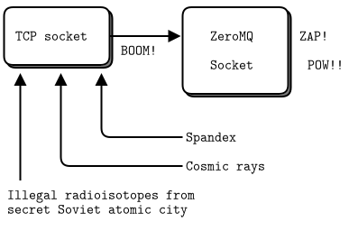

# 서문 {-}

## 요약 

이 책은 ØMQ 라이브러리의 입문서지만, 일반적인 메시징 시스템의 설계 방법을 배울 수 있도록 작성되어 있습니다.
멀티스레드 프로그래밍 및 네트워크 프로그래밍에서 일어나는 일반적인 문제 해결 방법 및 분산 응용 프로그램의 설계 방법 등을 배울 수 있습니다.
예를 들어, P2P(Peer-to-Peer) 응용프로그램과 분산 해시 테이블 등의 기반을 구현하고자 하는 분들도 추천합니다.

「ØMQ 가이드」는 피터 힌트젠스가 zeroMQ 3.2 버전 기준으로 작성한「[ØMQ - The Guide](http://zguide.zeromq.org/)」에 대하여 2020년 기준 zeroMQ 4.3.2 버젼 기준 java 바인딩(jeroMQ)을 제작하여 적용하였습니다.

향후 ØMQ 기능 변경에 따라 해당 문서는 지속적으로 수정 및 타 개발 언어들에서도 적용할 수 있도록 하겠습니다.

오자/오역 및 의견이 있을 경우 「[@박재도](zzeddo@gmail.com)」 연락 부탁드립니다.

## 100자로 ØMQ 설명하기

ZeroMQ(ØMQ, 0MQ, 혹은 zmq 알려짐)는 내장된 네트워킹 라이브러리와 유사하지만 동시성(concurrency) 프레임워크처럼 동작합니다. ØMQ는 다양한 전송계층 환경에서 단순 메시지를 전송하는 소켓을 제공하는데 전송수단으로 프로세스 내 통신(스레드 간), 프로세스 간 통신, TCP 그리고 멀티캐스트 등 다양합니다. 당신은 ØMQ 소켓을 N 대 N 방식으로 멀티캐스팅(pgm, epgm), 발행-구독(pub-sub), 작업 분배(pipeline), 그리고 요청-응답(request-reply) 등 패턴으로 사용할 수 있습니다. 이것은 클러스터 제품들에 적용해도 전혀 문제없는 높은 성능을 가지고 있습니다.  비동기 I/O 모델로 비동기 메시지 작업들을 구축하여 확장 가능한 멀티코어 응용프로그램을 제공합니다. 다양한 개발언어 API 있으며 거의 모든 운영체제에서 적용 가능합니다. ØMQ는 iMatix에서 개발했으며 LGPLv3 라이선스로 오픈소스입니다.

## 시작하기

일반적인 TCP 소켓을 가져다가 여러 가지 요소들(구소련 연방의 방사선 동위원소, 근육빵빵맨 등)을 혼합하여 ØMQ을 만들었으며, ØMQ 소켓은 네트워킹 세계(모두가 연결된)를 구원하는 슈퍼 히어로입니다.

그림 1 - 무서운 일

## Zero의 철학

ØMQ의 0은 단지 절충안입니다.
한편에서는 이상한 이름으로 구굴 또는 트위터 검색에서의 가시성이 저하되고 있습니다.
다른 한편에서는 덴마크의 끔찍한 놈들이란 "ØMG røtfl"의미로 혹은 "Ø는 이상한 모양 제로는 아니다"와 "Rødgrød med Fløde!"(크림이 오른 덴마크 간식)등으로 표현하는 것은 잘못되었습니다.

원래 ØMQ의 zero의 의미는 "브러커 없는(zero broker)"를 (좀 더 정확하게) 의미하였으며 "(가능한) 지연 없는(zero latency)"로 하는 것이었습니다. 이것을 위하여 서로 상반된 목표들로 둘려 싸이게 되었습니다 : 관리 없애기(zero administration), 비용 없애기(zero cost), 낭비 없애기(zero waste). 
"zero"는 미니멀리즘 문화를 참조하여 프로젝트에 반영하였으며 새로운 기능을 부가하기보다는 복잡성을 제거함으로 힘을 부여하였습니다.

## 대상 독자

이 책은 전문 프로그래머로 미래의 컴퓨팅을 지배할 거대한 분산 소프트웨어를 만드는 방법을 배우려는 사람을 대상으로 합니다. ØMQ가 여러 개발 언어를 사용할 수 있지만 여기에 있는 대부분의 예제는 java 언어로 되어 있기 때문에 java 코드를 읽을 수 있으며 네트워크상에서 응용프로그램을 확장하는 문제에 관심이 있고 최소한의 비용으로 최상의 결과가 필요하다고 가정합니다. 그렇지 않으면 ØMQ가 제공하는 절충안들을 이해하지 못할 것입니다. 
우리는 가능한 분산 컴퓨팅과 네트워크 상의 모든 개념들을 표현하여 ØMQ을 사용할 수 있도록 하였습니다.
